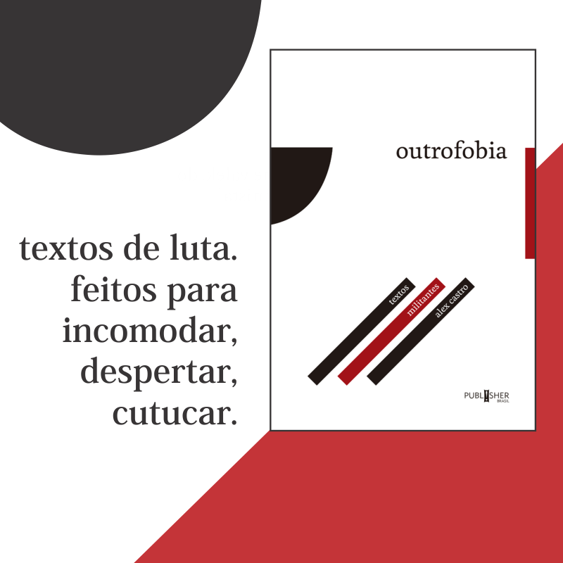

# Prisão Privilégio

Estamos algemadas à Prisão Privilégio quando simplesmente nos recusamos a encarar e reconhecer nossos privilégios, mesmo quando eles estão em nossa cara, gritando e bufando.

Quando pergunto se as pessoas são ricas, elas ou dão respostas abstratas *("sou rico em oportunidades")* ou negam *("olha, eu até ganho bem, mas não me considero rica porque não consigo comprar tudo o que eu quero.")*

Ninguém acha que é rica, ou que é privilegiada, pois isso acarretaria obrigações sociais que queremos evitar, uma autoimagem da qual fugimos.

O privilegiado é sempre um outro.

### Quem são as pessoas privilegiadas

No Brasil, classe média é quem tem renda mensal per capita **menor** que R$1.019.

Só 20% de pessoas brasileiras ganham mais de R$1.019: essas pessoas, queiram ou não, esperneiem ou não, fazem parte da *classe alta*, da elite econômica do Brasil.

E quem ganha mais de R$2.400 *(sempre mensal per capita)* faz parte da *alta classe alta*, o topo do topo da pirâmide, onde estão somente 4,4% das pessoas brasileiras.

Por mais que isso interfira em nossa identidade de pessoa-sofredora-que-paga-impostos-escorchantes, etc, se estamos no topo da pirâmide econômica, se ganhamos mais do que 96% das nossas compatriotas, então, somos sim pessoas ricas. Somos sim pessoas privilegiadas.

E está na hora de começarmos a refletir sobre esses privilégios.

Citando o [relatório](http://www.sae.gov.br/documentos/publicacoes/vozes-da-nova-classe-media-3%C2%BA-caderno/) onde essa classificação foi divulgada:

> "No Brasil, fazem parte dos 5% mais ricos todos aqueles em famílias com renda per capita acima de R$2.400 ao mês e muitos membros desse grupo se consideram parte da classe média. **Seria impossível conceber qualquer divisão da população em três classes de renda (baixa, média e alta) em que os 5% mais ricos estivessem fora da classe alta.** Para todos aqueles com essa opinião, qualquer definição coerente para a classe média sempre os excluiria e, por essa razão, seria percebida como empobrecida. "

Muitas de nós, quando descobrimos que de acordo com a classificação do governo não somos classe média, ficamos revoltadas.

Surpreendentemente, em vez de ficarmos revoltadas com nossos muitos privilégios, com a enorme quantidade de pessoas que vivem sem eles, com a gigantesca desigualdade em nosso país.... ficamos revoltadas com o governo ousar dizer que somos classe alta!

Mas a classificação do governo é apenas uma convenção e, no fim das contas, é irrelevante.

Talvez até achemos um absurdo o governo convencionar que a classe média só vai até a renda mensal per capita de R$1.019 e que nós, que ganhamos R$3 mil *("que não dá pra nada!!"),* também deveríamos ser classe média.

Só que a nomenclatura é uma convenção arbitrária, como qualquer outra. O governo poderia nos chamar de "classe média", de "classe epaminondas" ou de "classe blé" e não faria diferença alguma.

Qualquer que seja o nome convencionado, uma pessoa com renda mensal de R$3 mil ganha mais do que 99% da população brasileira.

Essa é a definição de privilégio.

Por fim, só para irmos um pouco mais longe, quem ganha mais de R$8 mil mensais *per capita* faz parte do 1% de pessoas mais ricas... da humanidade.

A questão não é o quanto trabalhamos por nosso dinheiro, quantas obrigações financeiras temos, quanto dinheiro nos sobra depois de pagá-las, quantas coisas queremos consumir e não podemos.

A questão é que, [se ganhamos mais de R$8 mil mensais](http://www.globalrichlist.com/), ganhamos melhor do que 99% das pessoas humanas que existem!

É inacreditável o quanto esperneamos, a quantidade de justificativas que arrumamos, os pelos em ovo que encontramos.... tudo para não olharmos no espelho e vermos ali pessoas privilegiadas. Pessoas que estão no topo da pirâmide econômica e social de nosso país. Pessoas que precisam antes abrir mão de privilégios do que continuar correndo atrás de adquirir novos.

O problema do Brasil não é existirem pessoas privilegiadas. Elas sempre existiram e sempre existirão.

O nosso problema é que nós, as pessoas privilegiadas, vivemos cercadas de miseráveis que fazem nossas unhas e lavam nosso chão por uma miséria... e ainda assim somos completamente incapazes de reconhecer nossos imensos privilégios.

### O privilegiado é sempre um outro

Nossa tendência de pessoas humanas é sempre normalizar e normatizar nossa situação: perceber **nossa** vida como *“a vida normal e normativa”*, e as vidas das pessoas mais pobres como *“vidas pobres”* e as vidas das pessoas ricas como *“vidas ricas”*.

Sempre existirão pessoas com mais e com menos privilégios que nós. A questão é outra: para **quem** estamos olhando?

Uma pessoa brasileira com renda mensal de R$3 mil pode escolher olhar para o 1% de pessoas brasileiras ainda mais privilegiadas que ela e aspirar possuir ainda mais privilégios.

Ou ela pode escolher se solidarizar com as 99% de pessoas brasileiras que têm muito, muito menos e tomar ação política para mudar essa realidade.

Estamos presas na Prisão Privilégio não simplesmente por **sermos** pessoas privilegiadas, mas por sermos pessoas privilegiadas que **não enxergam e não reconhecem** nossos imensos privilégios.

No Brasil, quase nenhuma pessoa se admite “rica” ou “privilegiada”. Ambas as palavras, para todos os fins e efeitos, se tornaram praticamente xingamentos.

Há muitos anos, eu fui uma criança rica, crescendo entre outras crianças ricas, em uma das escolas mais caras do país.

Um dia, em uma lancha de quarenta pés em Búzios, eu disse alguma coisa que já nem lembro o que era, mas que incluía o reconhecimento explícito de que nós ali éramos pessoas ricas: *“porque nós, os ricos, etc”*, algo assim.

Bateu um silêncio constrangedor. Algumas pessoas olharam para o mar ao longe, outras passaram as pontas dos dedos por seus jacarés nas camisas pólo. Finalmente, um dos meninos tomou para si o ônus da resposta:

> “Imagina, Alex! Eu e minha família não somos ricos!”

Eu, criança bocuda, ainda sem entender direito o tamanho do tabu onde tinha esbarrado, insisti:

> “Mas João Paulo! Acabamos de sair de sua casa de praia cinematográfica, com um deck envidraçado se estendendo até o meio do mar, e estamos agora na lancha que seu pai acabou de trocar ano passado, indo para um restaurante-ilha onde o almoço vai custar vários salários-mínimos. Óbvio que você é rico!”

Como dizer que o rei não está nu quando ele está ali, balançando as bolas bem na sua cara?:

> “Bem, Alex, veja, não somos ricos, meu pai trabalhou muito, mas é assalariado, um mero presidente de empresa multinacional, pode ser demitido a qualquer momento pelos acionistas! Ok, tudo bem, conseguimos economizar muito, temos um certo conforto, é verdade, mas não somos ricos.”

Por fim, o abacaxi é fatalmente passado adiante:

“Rico, rico mesmo, é o Carlos Eduardo, que tem um iate de sessenta pés e a família é dona de sua própria ilha. Ele sim é rico, Alex. Não eu, pô!”

Mais tarde, durante aquele mesmo almoço, o sofrido Carlos Eduardo também negou peremptoriamente sua condição de rico.

“Imagina! Minha família agora até está em uma situação confortável, fruto de muito trabalho apesar dos impostos escorchantes, mas rico mesmo, rico de verdade, é o Luis Felipe, do nono ano. Ele sim é rico!”

Infelizmente, não lembro mais o que o Luis Felipe possuía para marcá-lo como rico.

Talvez Belize.

### **O privilégio é um olhar**

Todas as pessoas privilegiadas compartilham de diferentes graus da mesma cegueira.

Meus amigos de infância em Búzios não eram pessoas especialmente sem-noção: eles não se achavam ricos pelo mesmo motivo que todas as pessoas privilegiadas não se acham privilegiadas.

Porque quando crescemos rodeadas por algo – nesse caso, o privilégio – aquilo vira a regra contra a qual o mundo é comparado. Nossa vida é sempre a normal, a normativa: as outras vidas é que são menos ou mais alguma coisa.

Nós, as pessoas privilegiadas, escolhemos olhar para as pessoas ricas e famosas, consumindo revistas de fofocas e programas de glamour, ao mesmo tempo em que escolhemos nunca olhar para as pessoas pobres e sofridas, evitando cruzar com elas nas ruas e nunca entrando nas comunidades onde moram.

Então, se evitamos as incômodas pessoas menos privilegiadas; se normatizamos nossas próprias vidas repletas de privilégios; e se olhamos com atenção somente para as pessoas com ainda mais privilégios que nós... o resultado final será nos tornarmos pessoas privilegiadas que simplesmente não conseguem enxergar seus próprios privilégios:

> “Privilegiada? Eu? Claro que não. Só tenho UMA jacuzzi! Privilegiado é o Luciano Huck, que tem cinco. Sério, eu vi no Vídeo Show!”

Por outro lado, pessoas privilegiadas que frequentam comunidades carentes quase sempre se tornam mais e mais conscientes da imensidão de seus privilégios.

O peixe não enxerga a água justamente por viver toda a sua vida rodeado por ela, e só percebe sua falta quando está se debatendo no convés do barco.

Nós também só percebemos a extensão de nossos privilégios – que sempre estiveram a nossa volta, por todos os lados, nunca questionados, nunca problematizados – quando somos confrontadas com sua ausência.

Mas não é preciso esperar que desigualdade do Brasil nos exploda na cara: podemos mudar a direção da nossa mirada hoje.

Podemos desnaturalizar tudo aquilo que nos parecia mais natural.

### **Breve história dos meus privilégios**

Só podemos admitir nossos privilégios quando damos um passo atrás, desnaturalizamos nossas vidas, saímos do centro do universo que ocupamos em nossa imaginação egocêntrica e passamos a nos enxergar em relação às outras pessoas que estão girando conosco pelo espaço na superfície dessa bola de pedra e água.

Eu *(nascido em 1974)* cursei o ensino fundamental no Colégio Santo Agostinho *(um dos melhores da cidade)*, o médio na Escola Americana do Rio de Janeiro *(na época, a mais cara do Brasil)* e, depois, História no IFCS/UFRJ *(turma de 1999)* porque meu pai cresceu em Botafogo, fez o ensino médio no Colégio Andrews *(tradicionalíssimo)* e se formou bacharel em Economia *(turma de 1970)* pela mesma UFRJ.

Meu pai *(nascido em 1946)* estudou na UFRJ porque meu avô estudou Engenharia no Instituto Eletrotécnico de Itajubá, atual Universidade Federal de Itajubá *(turma de 1938)* e trabalhou durante muitos anos para a CHESF *(Companhia Hidro-Elétrica do São Francisco)*, inclusive nas obras do Complexo Hidrelétrico de Paulo Afonso.

Meu avô *(1909-1989)* foi engenheiro civil porque meu bisavô *(1876-1965)* saiu do Mato Grosso *(onde seu pai, veterano do Paraguai, estava servindo desde a guerra)* pra estudar no Colégio Militar do Rio de Janeiro, onde teve a honra de ser comandante-aluno de 1897 , formou-se engenheiro militar, participou do episódio dos 18 do Forte de Copacabana e reformou-se tenente-coronel.

Em 1888, com 12 anos de idade, meu bisavô estudava na capital do Império, em um dos melhores colégios públicos do país, com bolsa integral, soldo e emprego garantido após a formatura.

Se, ao invés disso, nesse mesmo ano, ele tivesse sido libertado *(leia-se posto pra fora de casa)* com a roupa do corpo, analfabeto e despreparado, sem conhecer pai e mãe, desprovido de qualquer poupança ou bens, teriam seus filhos e netos e bisnetos estudado nas melhores escolas e universidades do país e feito parte da elite brasileira?

Sem esse capital socioeconômico e cultural acumulado pelo meu bisavô em 1888 *(para não irmos mais longe)*, onde teria ido parar a cadeia de acontecimentos que desembocou na minha vida? Estaria eu, nesse momento, sadio e medindo 1,80m, proprietário de apartamento em Copacabana e publicando livros?

Dentre minhas realizações, quantas são exclusivamente por mérito meu e quantas são consequência direta da vida privilegiada que eu e meus antepassados levamos?

Que tipo de dívida *eu*, pessoalmente, tenho com as pessoas que não tiveram tanta sorte?

Afinal, se eu e meus antepassados somos privilegiados, então é porque existem pessoas que não são.

E por que não são? É porque não estudaram tanto ou trabalharam tão duro quanto eu ou meu pai?

Por que o faxineiro do banco trabalha o dia inteiro, assim como meu pai, o gerente do banco, mas leva pra casa só uma fração do salário? Será que o filho do faxineiro, que estudou em escola pública e trabalha desde os doze anos, vai ter a mesma chance que eu de entrar em uma universidade federal?

Que privilégios meu pai teve que o faxineiro não teve? Que privilégios eu tive que o filho do faxineiro não teve?

Qual é a origem histórica dessa assimetria socioeconômica tão gigantesca?

Faz sentido falar em meritocracia em uma sociedade tão desigual?

### **Ação de graças pelos privilégios recebidos**

O Brasil e os Estados Unidos são duas sociedades muito parecidas em sua desigualdade, racismo, outrofobia.

Uma diferença, entretanto, é que as pessoas ricas [norte-americanas](http://www1.folha.uol.com.br/fsp/especial/fj191227.htm) praticam muito mais filantropia do que as [brasileiras](http://www1.folha.uol.com.br/fsp/mercado/me2101201103.htm).

Outra diferença é que o feriado mais importante dos Estados Unidos, quase desconhecido no Brasil, é o dia de ação de graças, quando *(teoricamente)* as pessoas refletem sobre as muitas graças recebidas.

Talvez exista uma relação.

Sou grato por ter nascido *homem*. (Em uma sociedade machista, onde mulheres ganham uma fração do salário dos homens pelo mesmo trabalho, são vítimas de violência de gênero, possuem menos direitos perante a lei e representam apenas uma pequena parcela da elite corporativa.)

Sou grato por ter nascido *cis*. (Em uma sociedade transfóbica, onde as pessoas trans\* são perenemente invisibilizadas e silenciadas, encontram enormes obstáculos para realizar tratamentos e procedimentos médicos de acordo com suas necessidades, e sofrem violência e intimidação até para usar banheiros públicos ou ver seus nomes corretos na carteira de identidade.)

Sou grato por ter nascido *branco*. (Em uma sociedade racista, onde as pessoas negras são consistentemente assassinadas em números alarmantes, formam maioria da população carcerária mas a minoria da população universitária, encontram dificuldades para conseguir empregos e alugar apartamentos, e têm até mesmo seu cabelo chamado de "ruim".)

Sou grato por ter nascido *heterossexual*. (Em uma sociedade homofóbica, onde as pessoas homossexuais têm menos direitos perante a lei, como casar ou servir nas forças armadas, são consistentemente assassinadas em números também alarmantes, sofrem todo tipo de preconceito, rejeição e bullying desde a infância, inclusive e principalmente das próprias famílias que deveriam amá-los, muitas partindo para o suicídio como última alternativa.)

Sou grato por ter nascido com o *corpo sem deficiências*. (Em uma sociedade capacitista, onde as pessoas com deficiências são consistentemente ignoradas e invisibilizadas e mesmo as poucas leis que tentam lhes facilitar a vida acabam ignoradas, e são impossibilitadas fazer coisas que deveriam ser simples, como entrar em prédios públicos e subir em ônibus, usar um computador ou votar.)

Sou grato por ter nascido em um país *democrático, próspero e estável*. (Em um mundo convulsionado, repleto de guerras civis e genocídios, onde a maioria dos habitantes vive em imensa pobreza, sem acesso a inovações tecnológicas, serviços públicos, universidades e hospitais, eleições regulares e nem mesmo às proteções mais básicas do Estado de direito.)

Sou grato por ter nascido na *classe alta urbana*. (Em um país desigual, onde as pessoas dessa classe alta — especialmente quando são homens brancos cis e héteros — têm acesso desproporcional a todas as benesses e regalias que esse Estado pode oferecer, e as outras cidadãs muitas vezes vivem vidas instáveis que lembram bastante a das cidadãs dos países convulsionados e pobres.)

Sou grato por meu pai e minha mãe descenderem de uma longa linha de pessoas privilegiadas como eu, bem-alimentadas e *sem doenças congênitas ou genéticas*. (Em um país onde a fome e a desnutrição são disseminadas e já foram mais, onde doenças infantis medievais e perfeitamente evitáveis ainda causam mortes e mutilações, onde a desnutrição na infância limita o desenvolvimento físico e intelectual para toda a vida.)

Sou grato por ter nascido de um pai e de uma mãe que *quiseram e planejaram juntos me ter*. (Em um país onde muitas pessoas não têm acesso nem à educação sexual nem a controle de natalidade, onde a maior instituição religiosa luta para mantê-las na ignorância, onde a opção do aborto é proibida às mulheres que não têm dinheiro para pagar uma clínica clandestina.)

Sou grato por *meu pai ter ficado*. (Em uma sociedade onde um número tristemente grande de homens não participa em nada da criação dos filhos e filhas que geraram.)

Sou grato por ter crescido em um *seguro e tranquilo bairro classe alta*. (Em uma sociedade onde muitos bairros são fatais para quem mora neles, seja por terem sido abandonados pelo Estado e tomados por bandidos que se comportam como senhores feudais, seja por serem invadidos pelo Estado com a mesma truculência com a qual invadiriam um país inimigo, tratando todas as pessoas-cidadãs como bandidas e matando a torto e a direito.)

Sou grato por ter estudado nas *melhores escolas particulares* da minha cidade. (Em uma sociedade onde as escolas públicas, abandonadas pela elite cujas crianças não estudam mais nelas, formam um número assustador de analfabetas funcionais.)

Sou grato por *não ter tido que trabalhar* durante a minha infância e adolescência. (Em uma sociedade onde muitas crianças, além de estudar em escolas que não lhes formam, ainda precisam ajudar suas famílias com o seu próprio trabalho desde muito cedo, algumas vezes até mesmo voltando-se ao crime.)

Sou grato por ter crescido em um tranquilo *ambiente familiar sem violência doméstica*. (em uma sociedade onde a violência doméstica, contra crianças e particularmente contra a mulher, é uma doença endêmica, gerando traumas psicológicos e físicos e até a morte, e naturalizando a violência doméstica para as futuras gerações.)

Sou grato por ter estudado em algumas das *melhores universidades públicas* do país e do mundo. (Em uma sociedade desigual e injusta, onde praticamente só as crianças da elite conseguem entrar nas melhores universidades gratuitas, pois tiveram dinheiro para frequentar escolas particulares, não precisar trabalhar e dispor do ócio de apenas estudar.)

Sou grato por ter tido a oportunidade de *estudar fora do meu país*. (Onde pela primeira vez pude contemplar minha sociedade com distância crítica e percebi que nossa outrofobia, nosso racismo, nossa desigualdade, nossa injustiça, nossa homofobia, nosso machismo, não eram a única maneira de organizar uma sociedade, que havia outros jeitos, outros caminhos.)

Mais do que tudo, sou profundamente grato por ter tido *acesso a mestras e professoras, amigas e militantes, escritoras e estudiosas* que me abriram os olhos quanto aos imensos privilégios que sempre desfrutei e ainda desfruto; que estimularam minha generosidade e minha empatia, minha militância e minha consciência; que me mostraram esses outros jeitos e outros caminhos.

Senão, eu poderia estar como a maioria das pessoas com quem cresci: sentadas no topo de uma formidável montanha de privilégios, sem nunca perceber sua condição de privilegiadas, reclamando de quem tenta chamar a atenção para seus privilégios, e obsessivamente tentando acumular mais e mais privilégios.

A maior graça pela qual sou grato é a de *tentar conscientemente não ser mais assim*.

### **A ilusão da meritocracia**

Nenhuma dessas graças que recebi foi mérito meu. Não posso me orgulhar de nenhuma delas.

*A meritocracia é uma mentira.* Não existe, nunca existiu, não poderia existir.

Se eu não tivesse recebido qualquer uma dessas graças, minha vida teria sido outra. Quem sabe, nem começasse. Quem sabe, acabasse muito mais cedo. Teria eu conseguido publicar romances ou fazer pós-graduação? Não ser estuprado, encarcerado, linchado? Quem sabe?

Essas graças, cada uma delas, sem exceção, são privilégios.

**\* \* \***

Muitas vezes, quando digo que o Brasil não é um país meritocrático, alguém menciona alguma mítica pessoa-negra-favelada-trabalhadora cujo sucesso pessoal significaria obviamente que o racismo está resolvido e que as cotas raciais não são necessárias.

Sim, uma pessoa favelada brilhante, competente e talentosa, se vencer todas as armadilhas da vida, pode teoricamente conseguir cursar uma universidade federal, abrir uma empresa, ficar rica – mas só se não errar nunca, se nunca cair em tentação, se nunca for morta de bala perdida ou torturada pela polícia, e tiver muita, muita sorte. É possível.

Já o manto de privilégios que cobre as pessoas privilegiadas é tão espesso que não existem erros tão grandes, nem preguiça nem inépcia tão profundas, que lhes faça percorrer o caminho inverso. Sempre se dará um jeito. Podem ser assistentes administrativas do escritório do padrinho, balconistas da padaria da tia, sócia das amigas de infância que montaram empresa: *“fica tranquilo, compadre, ele não é nenhum gênio, mas família é família, não?”*

Outro enorme privilégio que nós, pessoas privilegiadas, raramente enxergamos, é o fato de quase todas as nossas pessoas amigas e familiares também serem privilegiadas, o que nos abre portas e nos concede oportunidades totalmente fora do alcance das pessoas marginalizadas.

Pois um dos grandes empecilhos para o progresso pessoal e profissional de uma pessoa que nasceu em uma favela é o simples fato de que quase todas as pessoas do seu círculo familiar e de amizades provavelmente também nasceram em favelas e estão subempregadas.

*(Um* [*estudo do IPEA*](http://www.dpnet.com.br/2009/09/23/economia7_0.asp) *revelou que, para as pessoas pobres, por mais escolarizadas que sejam, existe* [*um teto socioeconômico*](http://cleobf.blogspot.com.br/2009/09/menos-vagas-para-pobres-que-estudam.html) *do qual não conseguem passar, justamente por estarem fora das redes de contato e apadrinhamento das classes privilegiadas.)*

Em um país injusto e desigual como o nosso, não é preciso ter lancha de quarenta pés ou ilha particular pra ser uma pessoa privilegiada. Se você está aqui, lendo esse texto, e não lavando chão em troca de um salário mínimo, provavelmente é uma pessoa privilegiada também.

### **O privilégio é um contínuo**

Você, pessoa lendo esse texto, talvez não tenha tido os mesmos privilégios que eu, mas provavelmente também é uma pessoa privilegiada.

Para começar, em um mundo desigual e injusto como o nosso, você já é uma pessoa privilegiada só por estar viva *(outras menos privilegiadas morreram de doenças infantis facilmente evitáveis)*, ociosa *(outras menos privilegiadas trabalham e estudam, ou trabalham vários empregos, e ainda cuidam das crianças e da casa, e não têm oportunidade alguma de ler textinhos na internet)* e capaz de entender textos complexos como esse que está lendo agora *(outras menos privilegiadas, a maioria das pessoas brasileiras, são analfabetas funcionais)*.

Uma possível definição de privilégio: uma faceta do nosso dia a dia que nos parece naturalizada e normativa, sobre a qual nunca pensamos porque sempre contamos com ela, mas que faz uma falta aguda e pronunciada às pessoas que não dispõem dessa vantagem.

Uma mulher cisgênero e heterossexual, por exemplo, não conta com várias “vantagens” masculinas que, para os homens, são tão naturais que nunca nem pensam nelas, como falar sem ser interrompida em uma reunião de negócios ou ter a temperatura do ambiente de trabalho sempre regulada para o seu conforto pessoal.

Por outro lado, do ponto de vista de pessoas trans\* e homossexuais, essa mesma mulher dispõe de vários privilégios com os quais elas apenas sonham, como usar o banheiro que se encaixa com sua identidade de gênero e passear de mãos dadas nas ruas com a pessoa com quem tem um relacionamento amoroso.

Abaixo, os principais tipos de privilégio da sociedade brasileira e **alguns** exemplos de cada um.

Ênfase em “alguns”. Infelizmente, seria possível empilhar exemplo em cima de exemplo pela eternidade, mas o meu objetivo é somente *iniciar* uma reflexão.

### **Privilégio masculino**

Aquelas coisas que parecem normais e dadas aos homens, mas que, do ponto de vista das mulheres, são privilégios:

– Não tenho medo de ser estuprado, mesmo quando bebo até cair.

– Quando saio de casa, meu corpo não é agarrado, apertado, bolinado, elogiado por pessoas que nem conheço.

– Procriar é opcional para mim. Ninguém vincula meu valor como pessoa à paternidade.

– Caso procrie, minha vida não precisará mudar por causa das crianças.

– Ninguém manda no meu corpo.

– Sou dono da minha sexualidade.

– Gasto uma parcela ínfima da minha renda com produtos de beleza e estética.

– O livro sagrado da minha religião diz que tenho que ser obedecido.

### **Privilégio branco**

Aquelas coisas que parecem normais e dadas às pessoas brancas, mas que, do ponto de vista das pessoas negras, são privilégios:

– Posso correr a pé pelas ruas de qualquer grande cidade brasileira sem arriscar ser preso ou, pior, morto pela polícia.

– O segurança não me segue dentro das lojas, para garantir que não vou roubar.

– Meu cabelo natural não é criticado, proibido, estigmatizado.

– Não preciso nunca nem pensar que tenho "cor" ou "raça" ou "etnia".

– Os médicos, juízes, políticos, diretores de empresa com quem trato se parecem comigo.

– Minha aparência não é associada com animais, com ignorância, com hiperssexualidade.

– As pessoas não mudam de calçada por minha causa.

– Nunca tive apelido baseado em minha cor.

– Quando começo a namorar uma pessoa, não existe a possibilidade dos sogros e sogras terem algo contra mim sem nem me conhecer, somente por causa da minha cor.

### **Privilégio hétero**

Aquelas coisas que parecem normais e dadas às pessoas heterossexuais, mas que, do ponto de vista das pessoas homossexuais, são privilégios:

– Minha orientação sexual não é xingamento.

– Beijo em público sem medo de sofrer represálias.

– Nenhuma religião tem planos de me “curar”.

– Posso casar com a pessoa que eu amo, tomar decisões sobre a saúde dela, compartilhar plano de saúde, e até obter outra nacionalidade.

– Nunca corri o risco de ser rejeitado na escola, expulso de casa, despedido da empresa, só por causa da minha orientação sexual.

### **Privilégio cisgênero**

Aquelas coisas que parecem normais e dadas às pessoas cisgêneras *(ou seja, cuja identidade de gênero concorda com o gênero ao qual foram designadas ao nascer)*, mas que, do ponto de vista das pessoas trans\*, são privilégios:

– Minha carteira de identidade apresenta o nome com o qual me sinto mais à vontade.

– Uso o banheiro que prefiro usar *(e nunca corri risco de sofrer uma expulsão dele!)*

– Não preciso ficar constantemente pensando na minha identidade de gênero, definindo-a, explicando-o, defendendo-a.

– Nunca perdi um emprego, ou um imóvel que queria alugar, somente pela “discrepância” entre minha aparência e meu nome.

– Nunca precisei lutar para convencer minha família, minhas colegas, meu trabalho, meu Estado, de que eu realmente sou quem eu sou.

– Ninguém confunde minha orientação sexual com minha identidade de gênero.

O contínuo de privilégios de uma sociedade complexa como a brasileira é tão complexo quanto ela.

Cada uma de nós existe em ponto diferente, fluido e mutável, desse mesmo contínuo de privilégios.

Não cabe a mim querer me instituir um tribunal dos privilégios alheios. Não sou eu que vou dizer se você é uma pessoa privilegiada ou não.

Mas onde *você* acha que está nesse contínuo de privilégios?

### **Aprender a ouvir**

Para as pessoas privilegiadas, o processo de refletir sobre nossos privilégios é dolorido e interminável *(mas não tão dolorido quanto a vida das pessoas interminavelmente desprivilegiadas)* e o primeiro passo é aprendermos a ouvir.

Quando uma outra pessoa estiver relatando preconceitos que nunca sofremos e nunca sofreremos, como uma mulher contando a um homem como é opressor levar cantadas na rua, ou um homem negro contando a um branco como é opressor sempre ser parado em blitz pela polícia, a única reação aceitável é ouvir e acolher.

Não cabe a um homem dizer a uma mulher que algo que ela sente que a oprime na verdade *"é uma bobagem"*. Não cabe a uma pessoa branca dizer a uma negra que algo que ela sente que a oprime na verdade *"é porque vê racismo em tudo"*.

Se queremos abrir mão de nossos privilégios, devemos começar acolhendo e ouvindo as pessoas que não os têm.

Para uma pessoa privilegiada, simplesmente ouvir as desprivilegiadas, sem interpelar grosseiramente nem minimizar as agressões sofridas, já é um grande, enorme, importantíssimo primeiro passo.

Mas é só o primeiro.

### **Somos pessoas privilegiadas, e agora?**

Quando afirmo minha condição de privilegiado, não estou me gabando. Pelo contrário.

As pessoas privilegiadas devem reconhecer seus privilégios não para se gabar *(ou para se envergonhar)*, mas porque só assim podem assumir sua responsabilidade de ajudar as não-privilegiadas. Só assim podem começar a compensar a sociedade por tudo o que receberam em excesso. Só assim podem começar a abrir mão de alguns privilégios em prol de quem tem menos.

E eu sou uma pessoa privilegiada em quase todos os quesitos.

Isso não me faz o vilão. Isso não me faz o inimigo. Isso não significa que sou culpado pelos crimes da nossa sociedade outrofóbica, machista, racista, elitista, homofóbica, transfóbica, intolerante.

Mas significa que, como *beneficiário* desses crimes, tenho a *responsibilidade* de ajudar. De me tornar parte da solução e não do problema.

Sou um homem branco hétero cis, classe alta e pós-graduado *(e também pró-feminista, esquerdista, ateu, praticante de BDSM, de simplicidade voluntária e de relacionamentos não-monogâmicos)*, que consciente do lugar de privilégio que ocupo em nossa sociedade outrofóbica, racista, machista, homofóbica, transfóbica e elitista, tento utilizar esses meus privilégios para contribuir na promoção de pautas como feminismo, lutas sociais, consumismo, movimento negro, narcisismo, escravidão, trabalho doméstico.

Mas nunca terei tido outra infância a não ser a minha.

Nunca vou saber como é a sensação de ter um encontro com um homem, às vezes até conhecido, às vezes dentro da minha própria casa, e pensar se será hoje o meu estupro; de descobrir em mim os primeiros desejos sexuais e perceber que sou homossexual; de ser constantemente parado pela polícia e tratado como criminoso só por causa da cor da minha pele. Não posso estalar o dedo e desejar ser o que não sou.

Mas não preciso ser mulher para lutar contra o machismo, nem negro, contra o racismo. Não é necessário sofrer algo na pele para ter empatia por quem sofre. É possível transcendermos nossa outrofobia, nossa criação, nosso passado, nossa classe social, nosso gênero, nossos preconceitos.

Podemos ser maiores que nossas caixinhas.

### **O baralho viciado**

Nossa sociedade não se organizou sozinha, nem caiu pronta do céu: foi organizada por muitos homens *(ênfase em "homens")*, ao longo de muitos séculos, e obedece, em larga medida, aos interesses de quem a organizou – interesses muitas vezes conflitantes e contraditórios, pois a sociedade é fruto não de uma "conspiração a portas fechadas", mas de um longo processo social e político.

No caso do Brasil, nossa sociedade foi engendrada por uma elite machista, classista, hierarquizada, racista, paternalista, hipócrita e autoritária, e continuamos funcionando de acordo com esse paradigma outrofóbico até hoje, mesmo que sob o verniz da democracia e do estado de direito.

Então, se todas as pessoas brasileiras magicamente deixarem de ser outrofóbicas mas as estruturas e instituições permanecerem inalteradas, essa nossa hipotética sociedade sem machistas e sem racistas continuará intrinsecamente machista e racista, e marcada pela mais profunda outrofobia, pela mais crônica desigualdade racial e de gênero.

Acredito nos bons sentimentos de todo mundo, mas não deixo de achar incrível que, mesmo ninguém sendo machista ou racista nessa nossa sociedade tão linda, o resultado final é que as pessoas brasileiras do sexo feminino ou de pele mais escura *(e gays e trans\* e etc e etc)* sempre acabam se dando pior. A Outrofobia sempre vence.

O baralho que herdamos já está viciado para beneficiar sempre um tipo específico de jogador. Não basta que os jogadores beneficiados simplesmente não trapaceem – pois, mesmo assim, vão continuar magicamente ganhando todas as partidas.

É necessário trocar de baralho.

### Politicamente correto e privilégio

As pessoas privilegiadas sempre tiveram o privilégio de nomear a si mesmas e ao mundo. Hoje, as minorias desprivilegiadas estão começando também a conquistar o direito de se nomear. O nome disso é politicamente correto e esse assunto é parte integrante da Prisão Privilégio. Então, na sequência, leia os textos [Politicamente correto, uma defesa](http://www.papodehomem.com.br/politicamente-correto-uma-defesa/) e [Elogio à liberdade de expressão](http://www.papodehomem.com.br/elogio-a-liberdade-de-expressao).

### Outrofobia: Textos Militantes

Acabou de sair meu livro [Outrofobia: Textos Militantes](http://publisherbrasil.com.br/produto/outrofobia/), publicado pela editora Publisher Brasil em 2015. São textos políticos, sobre feminismo e racismo, transfobia e privilégio, feitos pra cutucar, incomodar, acordar.

Se você gostou do que eu escrevo, então, [dá uma olhada no livro](http://publisherbrasil.com.br/produto/outrofobia/): custa só trinta reais e deve ter mais coisa que você vai gostar também.

\* \* \*

### **Notas de leitura**

Os dados sobre a classe média vêm do [Vozes da Nova Classe Média, Caderno 03](http://www.sae.gov.br/documentos/publicacoes/vozes-da-nova-classe-media-3%C2%BA-caderno/), lançado pela Secretaria de Assuntos Estratégicos (SAE) em abril de 2013, os da riqueza humana, do [Global Rich List](http://www.globalrichlist.com/); e os do IPEA, do Comunicado do IPEA número 29, [A Desigualdade no Desemprego no Brasil Metropolitano](http://www.ipea.gov.br/portal/index.php?option=com_content&view=article&id=1748), lançado em setembro de 2009. Sobre [privilégios](http://escrevalolaescreva.blogspot.com.br/2013/09/reconheca-seus-privilegios-pra-poder.html) [masculinos](http://escrevalolaescreva.blogspot.com.br/2008/12/durma-se-com-um-privilgio-desses.html), [brancos](http://escrevalolaescreva.blogspot.com.br/2009/10/o-privilegio-branco-ao-vivo-e-em-cores.html), [heterossexuais](http://escrevalolaescreva.blogspot.com.br/2009/10/porque-eu-sou-e-homem-os-privilegios.html) e [cisgêneros](http://escrevalolaescreva.blogspot.com.br/2013/10/alguns-privilegios-cis.html), recomendo os textos linkados, todos da querida professora e blogueira Lola Aronovich, completos e acessíveis, dos quais adaptei vários itens.

### **Três avisos importantes sobre meus textos**

Eles falam sempre **sobre e para as pessoas privilegiadas**, justamente para tentar fazê-las ter consciência de seus enormes privilégios. *(Leia também* [*Carta aberta às pessoas privilegiadas*](http://papodehomem.com.br/privilegiadas/) *e* [*Ação de graças pelos privilégios recebidos*](http://papodehomem.com.br/acao-de-gracas/)*)*;

Buscam sempre usar uma **linguagem de gênero neutra** *(Para mais detalhes, confira meu* [*mini-manual pessoal para uso não sexista da língua*](http://alexcastro.com.br/sexismo/)*);*

E são sempre todos **rigorosamente ficcionais**. *(Ou não:* [*Alex Castro não existe*](http://alexcastro.com.br/alex-castro-nao-existe/)*,* [*só o texto importa.*](http://papodehomem.com.br/so-o-texto-importa/) *Em caso de dúvida, consulte* [*minha biografia do meu site pessoal*](http://alexcastro.com.br/bio/)*.)*

### **O encontro “As Prisões”**

Há doze anos, escrevo sobre as bolas de ferro mentais e emocionais que arrastamos pela vida: as ideias pré-concebidas, as tradições mal-explicadas, os costumes sem-sentido.

Agora, estou conduzindo o encontro "[As Prisões](http://alexcastro.com.br/encontros/)" no Rio de Janeiro e em São Paulo. O público-alvo são ovelhas negras em busca de interlocutores. O encontro oferece a oportunidade de passarmos o dia inteiro trocando histórias, compartilhando vidas, debatendo perplexidades. Ao final, nós, todas as pessoas, estamos exaustas, gastas, esvaziadas. Confusas, atarantadas, chacoalhadas.

O encontro "[As Prisões](http://alexcastro.com.br/encontros/)" é independente por ideologia. Não possui vínculo institucional algum. É divulgado pela internet de forma alternativa e realizado em praias, parques, quintais, praças. Oferece frutas e castanhas para comermos ao longo do dia e tem um intervalo para almoço. Começa sempre às nove da manhã de sábado ou de domingo e termina na hora que terminar. Muitas vezes, a química é tanta que não queremos ir embora: o encontro mais longo durou 15 horas.

O encontro é pago. Mas negar uma pessoa só porque ela não pode pagar seria dar importância demais a essa convenção arbitrária que chamamos dinheiro. Portanto, algumas pessoas pagam, outras pagam menos, outras não pagam. Na prática, as que pagam me possibilitam fazer o encontro para as que não pagam. Nada poderia ser mais solidário do que isso. *(Para saber mais, consulte a* [*política de gratuidades.*](http://alexcastro.com.br/encontros/gratuidades/)

Não é auto-ajuda, terapia, coaching. Não é palestra, aula, exposição de conteúdo. Não tem apostila, powerpoint, frases de efeito pra anotar no moleskine. Não oferece respostas, soluções, remédios. Não promete uma vida mais calma, mais centrada, mais bem-sucedida.

Não ajuda em nada. Pelo contrário, só atrapalha. Às vezes, nos transforma em pessoas ainda mais confusas, desajustadas, perdidas. Afinal, ser bem-sucedida e bem-ajustada em um mundo canalha pode bem ser indicativo de nossa própria canalhice.

Durante os anos de 2013 e 2014, levei o encontro "[As Prisões](http://alexcastro.com.br/encontros/)" para as cinco regiões do Brasil. Em 2015, o encontro será realizado apenas no Rio de Janeiro e em São Paulo.

Para mais detalhes, vídeos, depoimentos, calendário completo, tudo isso,[veja aqui](http://alexcastro.com.br/encontros/).

Os próximos textos da série [As Prisões](http://alexcastro.com.br/encontros/) serão enviadas primeiro, com exclusividade, às pessoas assinantes [do meu newsletter](http://alexcastro.com.br/assine/) e, então, publicadas aqui no PapodeHomem. [Confira as que já foram publicadas](http://papodehomem.com.br/secoes/series/prisoes/).

---

*publicado em 09 de Junho de 2015, 00:05*
