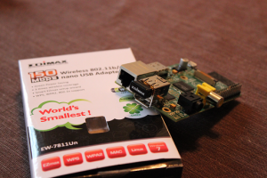
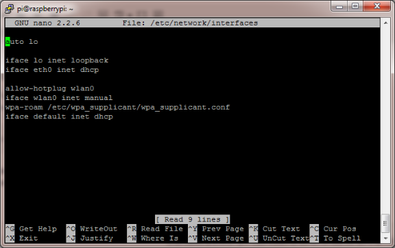
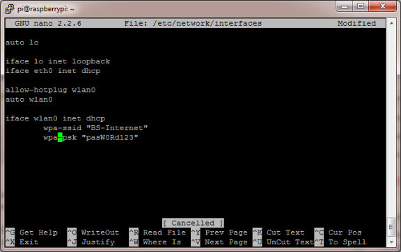

# How-To: Add WiFi to the Raspberry Pi

As you may know the Raspberry Pi can only access your home network using a network cable. But lets face it, your Raspberry Pi project is not always going to be deployed close to a network outlet – so what do we do?

The best solution is to buy a cheap USB WiFi adapter and use one of the USB ports to access our wireless home network. Setting up a Raspberry Pi using the Raspbian OS to access your wireless network is easy – this guide will guide you through the process.

## Prerequisites & Equipment

You are going to need the following:

- A Raspberry Pi ([Buy here](http://www.amazon.com/gp/product/B009SQQF9C/ref=as_li_tl?ie=UTF8&camp=1789&creative=390957&creativeASIN=B009SQQF9C&linkCode=as2&tag=rapihq-20&linkId=7AUXDVI32J6O4PHW))
- A USB WiFi Adapter (I use the [Edimax – Wireless 802.11b/g/n nano USB adapter](http://www.amazon.com/gp/product/B003MTTJOY/ref=as_li_tl?ie=UTF8&camp=1789&creative=390957&creativeASIN=B003MTTJOY&linkCode=as2&tag=rapihq-20&linkId=7QAXDGG72H4EWYFB) – its small and cheap!)
- A SD Card flashed with the Raspbian OS (Here is a [guide](http://raspberrypihq.com/booting-the-raspberry-pi-for-the-first-time/ "Booting the Raspberry Pi for the first time") if you need)
- Access to the Raspberry either via keyboard and a monitor or [remotely](http://raspberrypihq.com/working-with-a-raspberry-pi-from-another-computer/ "Working with a Raspberry Pi from another computer")

  [](http://raspberrypihq.com/wp-content/uploads/2013/07/IMG_1251_web.png)

  Raspberry Pi with Edimax Wifi Adapter

Before we proceed I want to point out the importance of buying the right USB WiFi Adapter. As you may have experienced with other types of hardware devices not all devices are plug-n-play. Sometimes you will need to download a driver to make them work. While drivers are normally readily available for Windows computers – it is a different world for Linux and Raspberry Pi’s. This is why it is very important to buy a WiFi Adapter that mentions “Linux” in the product description or package. I use the [Edimax – Wireless 802.11b/g/n nano USB adapter](http://www.amazon.com/gp/product/B003MTTJOY/ref=as_li_tl?ie=UTF8&camp=1789&creative=390957&creativeASIN=B003MTTJOY&linkCode=as2&tag=rapihq-20&linkId=7QAXDGG72H4EWYFB) because I have found it to be cheap and very easy to work with. I very recommend you do the same – it could save you a lot of headaches.

## Adding WiFi adapter to the Raspberry Pi

Plug the USB WiFi adapter into one of the free USB ports on the Raspberry Pi. Power up the Raspberry Pi – remember at this point the WiFi adapter does not work yet. You are still going to need some other means of being able to control the Raspberry Pi either via a keyboard or [remotely using a wired network connection](http://raspberrypihq.com/working-with-a-raspberry-pi-from-another-computer/ "Working with a Raspberry Pi from another computer").

After booting and logging-in you want to make sure that the Raspberry Pi found your new wireless adapter. To look at which peripherals the operating system found when booting run the following command:

```
dmesg | more
```

You can use the *spacebar* to scroll down a page at a time – towards the end you will see something similar to the following lines:

```
[ 3.282651] usb 1-1.2: new high-speed USB device number 4 using dwc_otg
[ 3.394810] usb 1-1.2: New USB device found, idVendor=7392, idProduct=7811
[ 3.407489] usb 1-1.2: New USB device strings: Mfr=1, Product=2, SerialNumber=3
[ 3.420530] usb 1-1.2: Product: 802.11n WLAN Adapter
```

This means that the operating system recognized the USB WiFi Adapter using one of the built-in drivers (*you can return to the terminal by pressing “q”*). All that is left is to configure your WiFi connection.

## Configuring the WiFi network

On the Raspberry Pi (and on Linux in general) you configure your network settings in the file “/etc/network/interfaces”. You can edit this file using the following command:

```
sudo nano /etc/network/interfaces
```

This will open the file in an editor called **nano** it is a very simple text editor that is easy to approach and use; even for users not familiar to a linux based operating systems just use the arrow keys.

After opening the file in **nano** you will see a screen like this:

[](http://raspberrypihq.com/wp-content/uploads/2013/07/interfaces-in-nano-initial.png)

To configure you wireless network you want to modify the file such that it looks like the following:

```
auto lo
iface lo inet loopback
iface eth0 inet dhcp

allow-hotplug wlan0
auto wlan0

iface wlan0 inet dhcp
   wpa-ssid "Your Network SSID"
   wpa-psk "Your Password"
```

You will need to put your own SSID and password into the appropriate places. If you can’t remember your network name – just pull up your phone it will most like display the name in the settings or network settings screens.

After editing the file you should see something like the following:

[](http://raspberrypihq.com/wp-content/uploads/2013/07/interfaces-in-nano-after-edit.png)

To save the file press *Ctrl+O* this will write the file to the disk – afterwards you can exit **nano**by pressing *Ctrl+X.*If **nano**asks if you want to *Save modified buffer?* press “Y” followed by hitting *enter* to confirm the filename.

At this point everything is configured – all we need to do is reload the network interfaces. This can be done by running the following command (*warning:* if you are connected using a remote connection it will disconnect now):

```
sudo service networking reload
```

After reloading the network interface (and re-connecting to the pi if you are using a remote connection) – you can now check the status of our WiFi connection by running:

```
ifconfig
```

The result should look something like this:

```
wlan0 Link encap:Ethernet HWaddr 80:1f:02:aa:12:58
      inet addr:192.168.1.8 Bcast:192.168.1.255 Mask:255.255.255.0
      UP BROADCAST RUNNING MULTICAST MTU:1500 Metric:1
      RX packets:154 errors:0 dropped:173 overruns:0 frame:0
      TX packets:65 errors:0 dropped:0 overruns:0 carrier:0
      collisions:0 txqueuelen:1000
      RX bytes:32399 (31.6 KiB) TX bytes:13036 (12.7 KiB)
```

If you see a valid IP address under “inet addr” you can now disconnect the network cable, and enjoy your freedom to move your Raspberry Pi around – *because the WiFi connection is up and running!*
