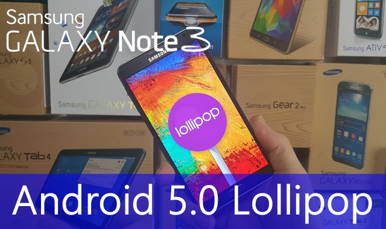
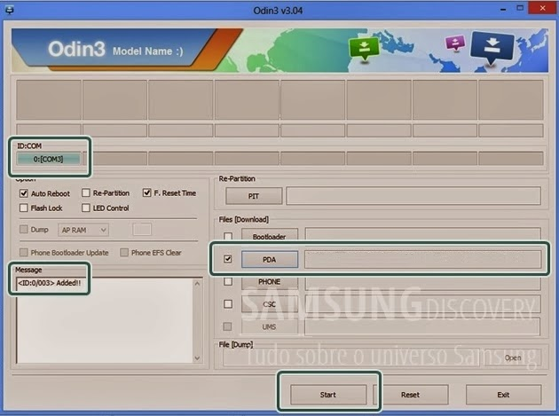

# Atualização oficial Android 5.0 Lollipop para o Galaxy Note 3 SM-N9005 e SM-N900

A Samsung segue liberando as atualizações do Android 5.0 Lollipop para os seus principais aparelhos, depois do **[Galaxy S5](http://www.samsungdiscovery.com/2015/01/liberada-atualizacao-oficial-do-android-5-0-lollipop-compativel-com-galaxy-s5-brasileiro.html)** e do **[Galaxy S4](http://www.samsungdiscovery.com/2015/02/tutorial-atualizacao-oficial-android-5-0-1-lollipop-para-o-galaxy-s5-gt-i9500.html)** com processador Exynos (modelo GT-I9500) receber o update, agora foi a vez da variante 4G do Galaxy Note 3 receber a novidade.  
A atualização se iniciou pela Europa, mas é totalmente compatível com o aparelho nacional, e por ser uma rom oficial você pode atualizar manualmente o seu dispositivo sem se preocupar com a perda de garantia ou o aumento do contador binário do aparelho.  
Ainda não há informações sobre o início do update oficial no Brasil, lembrando que aparelho customizados por empresas de telefonia podem demorar ainda mais para receberem a novidade, mas como dito acima, você pode atualizar manualmente seguindo o tutorial abaixo, que é compatível com os modelos 3G SM-N900 e 4G SM-N9005, basta baixar a rom correspondente ao modelo de seu aparelho e seguir o tutorial normalmente.  
**ATENÇÃO:**O processo, apesar de ser relativamente simples, envolve alguns riscos. Nós do **[Samsung Discovery](http://samsungdiscovery.com/2012/09/termos-de-uso_20.html)** não nos responsabilizamos por eventual dano causado ao seu aparelho, somente prossiga se tiver certeza de assumir todos os riscos.

- **BACKUP:** Sempre faça um backup de todas as suas informações, salvando os dados fora da memória do aparelho, para que em caso de algum imprevisto você possa recuperar seus dados

Antes de tudo recomendamos a leitura do artigo ["Confira algumas dicas indispensáveis para executar tutoriais com perfeição no Android"](http://www.samsungdiscovery.com/2014/07/confira-algumas-dicas-indispensaveis-para-executar-tutoriais-com-perfeicao-no-android.html), ele trará dicas importantes para você não ter problemas.

**Pré-requisitos:**

- Baixar e descompactar o Odin v.3.09 (**[aqui](https://mega.co.nz/#!mdBSlRYZ!kP7Ima80kx3tMElBE_n153KyIbysohZNsuF_Gv5FZK0)**).
- Baixar e descompactar a ROM com o Android 5.0 Lollipop compatível com a versão de seu aparelho nos links abaixo:
- **Galaxy Note 3 3G - SM-N900:****[Rapidgator](http://rapidgator.net/file/d3864608b9949b7e980fc6c1ac9d3a91), [Uploaded](http://uploaded.net/file/j5gqmpq5) e****[Sammobile](http://www.sammobile.com/firmwares/download/42405/N900XXUEBOA6_N900SEREBOA6_SER.zip/).**
- **Galaxy Note 3 4G - SM-N9005: [Rapidgator](http://rapidgator.net/file/e50e82cccfefe8fae3e916f13ccd53ba), [Uploaded](http://uploaded.net/file/lmil6bbg) e****[Sammobile](http://www.sammobile.com/firmwares/download/43186/N9005XXUGBOA5_N9005XEOGBOA4_XEO.zip/)**(é necessário fazer um cadastro gratuito no site SamMobile para baixar a ROM).
- Carregue o seu Galaxy Note 3 até atingir pelo menos 60% do nível de bateria.
- Baixe e instale Drivers Samsung USB no seu PC: **[Download](http://d-h.st/rQI).**
- Caso seu aparelho não seja reconhecido instale a versão mais recente do **[Kies](http://www.baixaki.com.br/download/samsung-kies.htm).**
- Ir até Configurações » Opções do desenvolvedor e ative a depuração USB (caso seu aparelho não tenha essa opção vá em Configurações » Sobre o dispositivo e clique 7 vezes sobre o Número da Compilação para ativar o as opções de desenvolvedor).
- Não é necessário, mas é altamente recomendado realizar um wipe data / factory reset em seu aparelho antes de instalar a nova ROM, isso garante que o aparelho irá rodar a nova versão do Android sem problemas e sem travamentos. Para isso segure simultaneamente os botões "Home" + "Ligar/desligar" + "Aumentar Volume", vá na opção "wipe/factory reset" e confirme. **ATENÇÃO: ISSO APAGARÁ TODOS OS SEUS DADOS SALVOS NO APARELHO**

**Tutorial**

**1 -** Descompacte o Odin e também a ROM que você acabou de baixar nos links acima.  
**2 -** xecute o Odin e clique no botão **PDA/AP** (o nome do botão varia de acordo com a versão do Odin utilizada)e selecione o arquivo da ROM que você descompactouertifique-se de que a opção "Re-Partition" **NÃO**esteja marcada.

**3 -** Desligue seu aparelho e o reinicie em modo "Download". Para isso, com o aparelho desligado, segure simultaneamente as teclas "Home" + "Ligar/Desligar" + "Diminuir Volume".  
**4 -** Após o aparelho reiniciar em modo "Download" pressione a tecla "Aumentar Volume" e conecte seu dispositivo ao computador e espere ele ser reconhecido pelo Odin, conforme demonstra a imagem acima.

**5 -** Com o aparelho já reconhecido pelo Odin clique em **"Start"**. O processo iniciará e a tela de seu aparelho será tomada pela tela de programação durante a instalação da ROM. Ao final seu aparelho será reiniciado automaticamente já atualizado para o Android 5.0 Lollipop.  
**Obs.:** A primeira inicialização pode demorar um pouco, mas isso é normal.  
**Dica:** Caso o seu aparelho não ligue ou fique reiniciando continuamente, reinicie o Galaxy S4 no modo recovery, para isso segure simultaneamente os botões "Home" + "Ligar/desligar" + "Aumentar Volume", vá na opção "wipe/factory reset" e confirme. **ATENÇÃO: ISSO APAGARÁ TODOS OS SEUS DADOS SALVOS NO APARELHO**. Após realizado o procedimento o aparelho deve reiniciar normalmente.

Via [SamMobile](http://www.sammobile.com/2015/02/13/galaxy-note-4-snapdragon-variant-sm-n910f-galaxy-note-3-lte-get-lollipop-update/)
