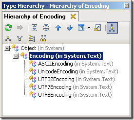

# UTF8Encoding.Default != Encoding.UTF8 (.NET C#)

January 20, 2009 by [Lars Corneliussen](https://startbigthinksmall.wordpress.com/author/larscorneliussen/ "Posts by Lars Corneliussen")

Looks like *UTF8Encoding.Default* would return a default instance of the UTF8Encoding, right?

Well, it doesn’t – it returns the operating system’s default ANSI encoding.

The same with *ASCIIEncoding.Default*, *UnicodeEncoding.Default*, *UTF32Encoding.Default* and *UTF7Encoding.Default*!

Why? Because they all derive from ***System.Text.Encoding*** **where *Default* is definded:**

```
|  |  |
| --- | --- |
|  | /// <summary>  /// Gets an encoding for the operating  /// system's current ANSI code page.  /// </summary>  public static System.Text.Encoding Default { get; } |
```

[](https://startbigthinksmall.files.wordpress.com/2009/01/tmp1f4.png)

So instead use *Encoding.ASCII*, *Encoding.UTF8*, *Encoding.UTF7*, *Encoding.UTF32* and *Encoding.Unicode* to refer explicitly to an encoding.

[About these ads](http://wordpress.com/about-these-ads/)
