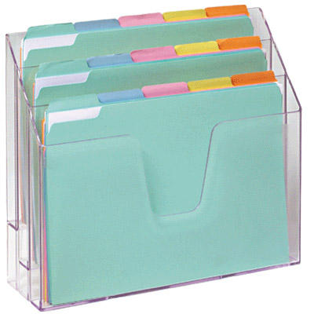
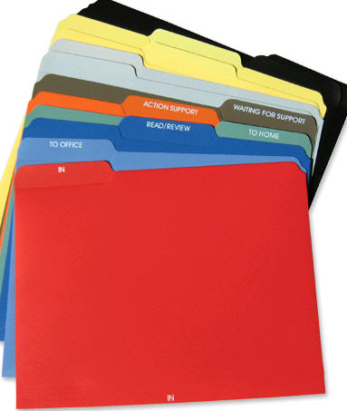
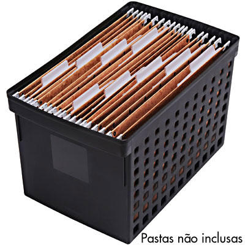
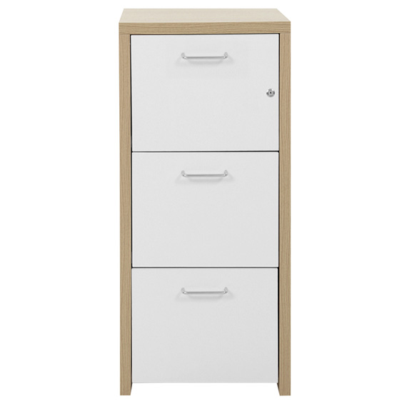
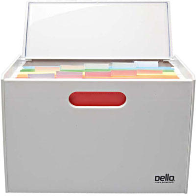
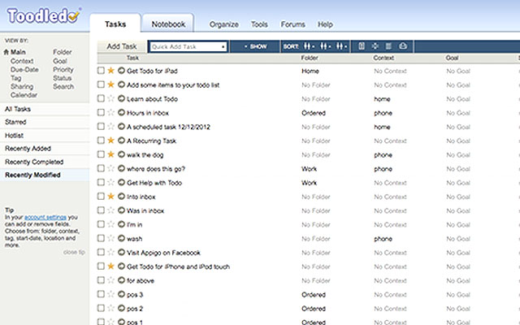
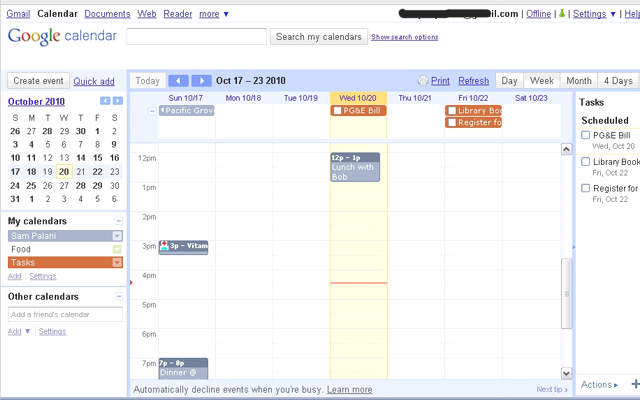

04 *Jun 2015*

## Aprenda GTD: Como encontrar as ferramentas para implementar e quais você vai precisar

Hoje em nossa série **Aprenda GTD**, ainda no nível **Ground (“pé no chão”)**, vamos falar sobre como escolher boas ferramentas para implementar o GTD e quais você irá precisar, para poder fazer as melhores escolhas para você. Esse assunto sempre rende bate-papos apaixonados porque cada um gosta mais de uma ferramenta do que de outra, mas meu objetivo aqui é falar sobre o que você vai precisar, para que possa escolher de acordo com o que **você** gostar mais. É muito importante gostar das ferramentas utilizadas, e não escolher uma porque todo mundo diz que é “a melhor”.

Aliás, o primeiro mito que quero derrubar neste post é a ideia de usar uma única ferramenta para o GTD. O próprio David diz: escolha boas ferramentas para as diversas funções. Quem faz a sincronização entre uma e outra é você, sem dramas. O GTD vem da época que não existiam apps e nada sincronizava com nada, e sempre funcionou. Não é uma “limitação” técnica que fará com que alguém deixe de usar uma ferramenta ótima para implementar o GTD.

Vamos então falar sobre as ferramentas que você vai precisar para implementar o método GTD. A ideia é que, com esse post, você já as providencie, para que possamos continuar com o método.

### Uma ou mais ferramentas para fazer a coleta

É importante que você anote tudo aquilo que não pode esquecer, no GTD. Quando você for começar a usar o método mesmo, vai fazer uma super coleta guiada, que será o tema do próximo post, provavelmente. E a ideia é que essa coleta vire um hábito para você. Portanto, faz sentido que você tenha sempre com você uma ferramenta para coletar.

A ferramenta de coleta mais comum que existe é o papel. Eu acho mais rápido de escrever, transportar, não dependo de bateria nem de limitações como “desligue seus aparelhos eletrônicos”. **Minha ferramenta preferida para coletar é um simples bloco de papel e caneta, que tenho sempre comigo**.

Você pode comprar bloquinhos ou usar folhas reaproveitadas de trabalhos ou impressões que não usará mais. Eu faço as duas coisas. Gosto de comprar um pacote da marca Spiral que vende na Kalunga, com 10 bloquinhos, e custa uns 9,50 reais. Sempre que sobra algum papel que não será mais usado por aqui, eu recorto cada folha em umas oito partes e utilizo para coleta também.

É importante fazer a coleta em cada pedaço de papel porque, ao processar, você já se livra dele. Além disso, você consegue se concentrar em um único item de cada vez. Mas claro que isso é a minha prática. Existem outras ferramentas de coleta, tais como:

- Caderno (usei durante muitos anos)
- Aplicativos de notas no celular (o próprio Evernote pode ter um caderno chamado “entrada”)
- Aplicativos de tarefas que tenham uma área para entrada (o Todoist tem)
- Gravador de voz
- Enviar e-mail para si mesmo

Além dos bloquinhos, onde anoto ideias, coisas a fazer e lembretes diversos, **gosto de usar folhas de sulfite para notas de reuniões e mapas mentais diversos** que faço no dia a dia. Como gosto de **digitalizar e enviar para o Evernote**, a folha de sulfite é a ideal – fica bem certinha digitalizada.

### Uma ou mais caixas de entrada físicas

É importante poder **centralizar toda a papelada que você coleta em um único lugar**, em vez de deixar tudo espalhado – uma coisa na bolsa, outra na mesa da cozinha, outra no escritório. Mesmo que você não faça a coleta do GTD em formato de papel, você ainda vai lidar com muitos deles no seu dia a dia, como contas, documentos, trabalhos dos filhos que vêm da escola, entre outros. É importante ter um lugar para centralizar o que chega até você, e esse lugar é a caixa de entrada física.

O ideal é **ter uma em sua mesa de trabalho e outra em casa**.

Eu utilizo uma comprada na Kalunga (que, na loja, está classificada como “organizador de escritório”), da marca Acrimet, que custa uns 45 reais:

Você pode usar uma bandeja de madeira ou de plástico ou até mesmo uma caixa de presente para ser a sua caixa de entrada. O importante é que ela seja de fácil acesso e sem complicações (como uma tampa). E deve ficar na sua mesa.

**Como eu me desloco muito, também gosto de ter uma pasta dentro da minha bolsa ou mochila** para os papéis, recibos e outros que chegam até mim ao longo do dia. Quando chego em casa, transfiro para a caixa de entrada. Eu uso uma pasta da David Allen Company que o Daniel me deu de presente (comprada nos Estados Unidos), mas você pode usar qualquer pasta.

Eu uso a vermelhinha desse jogo

### Uma lixeira para papel

Pode parecer besteira falar assim, mas é importante ter perto de você uma lixeira para jogar fora papel. Eu recomendo que você já a deixe equipada com a sacola verde, que representa o lixo reciclável, e jogue somente papel ali dentro. Você vai usar bastante.

Algumas pessoas gostam de ter uma fragmentadora de papel. Ela não é necessária para o GTD, mas a lixeira sim. Use as variações que quiser.

### Um tickler

O tickler é uma espécie de agenda física ou digital onde você insere documentos – bem resumidamente. A ideia é a seguinte: você assinou um documento que vai precisar novamente só daqui a 10 dias – onde você guarda? Você imprimiu o voucher do hotel para uma viagem que acontecerá somente em três dias – onde ele vai ficar? Você começará em um novo emprego no dia 27 e precisa levar muitos documentos – onde os colocará? Enfim, o tickler é para esse tipo de arquivo corrente que você vai precisar nos próximos dias ou meses.

Mais para a frente nesta série eu vou explicar cada uma das funções que estou citando neste post direitinho. O que será necessário você ter, no caso do tickler, é **um sistema que acomode 43 pastas** – 12 pastas para os meses do ano e 31 pastas para os dias do mês. Eu acredito que a melhor maneira de se fazer isso seja usando um arquivo para pastas suspensas, como este da Ordene:

Eu tenho um arquivo (o móvel mesmo) com três gavetas para pastas suspensas e uso apenas uma delas (a primeira) para o meu tickler. Comprei na Tok&Stok (da linha Boss):

Algumas pessoas me perguntam se podem usar uma pasta com 12 divisórias apenas para os meses, e eu sempre digo que é melhor usar o que funciona para cada um (melhor isso do que nada, digamos assim). Porém, não é o GTD mesmo. A recomendação de ter divisórias para os dias é importante seguir, e à medida que você for se aprofundando no método vai ficar mais claro o motivo.

Também dá para fazer o tickler em formato digital (é legal ter os dois). Você pode fazer isso de algumas maneiras:

- Pastas no computador representando os meses e os dias
- Cadernos, tags ou lembretes no Evernote, com a mesma função
- Anexando arquivos a um evento no seu calendário (no Google e no Outlook dá para fazer)

### Um arquivo de referência

Referência é todo aquele material que, por algum motivo, você quer ou precisa guardar. Certidões, documentos, comprovantes e toda sorte de arquivos. Eu recomendo que você tenha um físico (para tudo aquilo que ainda precisa ser físico – cartões de crédito, passaporte, documentos assinados, certidões) e um digital, para tentar colocar a maioria das coisas e liberar espaço físico em casa e no escritório, além da possibilidade de compartilhar, se necessário.

Para o arquivo físico, você pode usar:

- Um móvel para pastas suspensas, como o meu ali em cima
- Um arquivo menor para pastas suspensas

Esse é da marca Dello e vende na Kalunga

- Pastas de plástico
- Caixas (tipo aquelas de presente, decoradas)
- Pastas de arquivo morto, de papelão ou de plástico

Para o arquivo de referência digital, você pode utilizar as seguintes ferramentas:

- Um HD externo
- As pastas do seu próprio computador
- Evernote
- Dropbox
- Google Drive

Eu utilizo diversas ferramentas dessas, porque cada uma tem uma função diferente. Por exemplo: como regra geral, tudo vai para o Evernote. Porém, trabalho com arquivos mais pesados (vídeos, imagens, áudios) que não cabem no Evernote, então uso o Dropbox. Na Call Daniel, é usado o Google Drive para referência do time, então também preciso manusear por lá. Não precisa ser uma única ferramenta, desde que faça sentido para você. **Basta criar processos.**

A recomendação do David Allen para o arquivamento é arquivar em **ordem alfabética** e de uma maneira que seja **dedutiva** para você.

O que é importante sobre o arquivo de referência é que **deve ser muito fácil de armazenar coisas nele e criar pastas**. Se houver limitações, você vai acumular coisas fora dele outra vez. Pense nisso!

### Uma ferramenta para criar listas

Todo o sistema GTD se baseia no manuseio de listas. Portanto, escolha aquela ferramenta que simplesmente funcione para você ou que você gostar mais. Todas as ferramentas abaixo suportam listas e são recomendadas:

- Todoist
- Evernote
- Toodledo
- Wunderlist
- Outlook
- Google Tasks
- IQTell
- Lotus Notes
- Trello
- GQueues
- Remember the milk
- OmniFocus
- Things
- Caderno de papel
- Fichário
- Pastas catálogo
- Fichas 3×5
- Lembretes do celular

Toodledo

O recomendável é que a ferramenta tenha alguma forma de **fazer anotações** em um item da lista, para informações diversas e planos de projetos.

Eu acredito que o mais importante, quando se fala em uma ferramenta de listas, é que seja **fácil o acesso** a ela, para usar sempre que necessário. Não adianta uma lista de mercado, por exemplo, que fica na sua casa, por mais linda que seja, sendo que você vai precisar dela quando estiver no mercado. Da mesma maneira, de nada adianta uma ferramenta incrível que você use no seu computador mas não consegue acessar de outro. Tudo isso deve ser observado.

### Um calendário

É necessário utilizar um calendário para ações e lembretes com data e hora no GTD. Todas as ferramentas abaixo podem ser usadas com essa finalidade:

- Agenda de papel
- Google Calendar
- Calendário do Outlook
- Calendário impresso
- Filofax
- Moleskine planner

Google Calendar

A recomendação do David é que o calendário seja **visualizado semanalmente**, então busque por essa configuração ao comprar uma agenda de papel, por exemplo.

### Uma ou mais ferramentas para manusear arquivos de suporte a projetos

Você vai manusear informações referentes aos seus projetos e é necessário organizá-las. Para isso, você pode ter pastas físicas ou manusear arquivos digitais. Podem ser as mesmas ferramentas que você utilizou para seus arquivos de referência. A função é parecida – a diferença é que os arquivos de suporte a projetos estão em uso corrente e pode ser mais adequado deixá-los com acessibilidade facilitada. No formato físico, isso pode significar uma pasta mais próxima de você do que dentro de um arquivo, por exemplo. Monte a sua configuração!

Algumas ferramentas de listas sincronizam com ferramentas comumente usadas para arquivos de referência. Isso é ok. Porém, uma maneira de “sincronizar” é você simplesmente escrever no campo de anotação da tarefa na sua lista o local onde está esse arquivo, ou inserir uma URL (se o arquivo for digital) no mesmo campo. **Não deixe de usar uma ferramenta que você gosta apenas por esse detalhe.**

Neste post, você viu quais são as ferramentas necessárias para usar o GTD. O que eu sugiro é que você faça testes e encontre seu setup ideal para prosseguirmos com os próximos posts. Encontre ferramentas que façam sentido para você! E nada é engessado – você pode mudar depois, especialmente no que diz respeito às listas. Porém, procure desde já encontrar a que gosta mais, porque isso é parte importante do processo.

Dúvidas? Poste nos comentários! [anexo ausente]

Escrito por [Thais Godinho](http://vidaorganizada.com/sobre/ "Thais Godinho")

em [Aprenda GTD](http://vidaorganizada.com/categoria/gtd/aprenda-gtd/ "Aprenda GTD")

- [2 comentários](http://vidaorganizada.com/gtd/aprenda-gtd/aprenda-gtd-como-encontrar-as-ferramentas-para-implementar-e-quais-voce-vai-precisar/#comments)

### Posts relacionados:

- 
- 
- 
- 
- 
