# Tools for debugging, testing and using HTTP/2

04 Dec 2015
by [John Graham-Cumming](https://blog.cloudflare.com/author/john-graham-cumming/).

With CloudFlare's release of HTTP/2 for all our customers the web suddenly has a lot of HTTP/2 connections. To get the most out of HTTP/2 you'll want to be using an up to date web browser (all the major browsers support HTTP/2).

But there are some non-browser tools that come in handy when working with HTTP/2. This blog post starts with a useful browser add-on, and then delves into command-line tools, load testing, conformance verification, development libraries and packet decoding for HTTP/2.

If you know of something that I've missed please write a comment.

# Browser Indicators

For Google Chrome there's a handy [HTTP/2 and SPDY Indicator](https://chrome.google.com/webstore/detail/http2-and-spdy-indicator/mpbpobfflnpcgagjijhmgnchggcjblin?hl=en) extension that adds a colored lightning bolt to the browser bar showing the protocol being used when a web page is viewed.

The blue lightning bolt shown here indicates that the CloudFlare home page was served using HTTP/2:

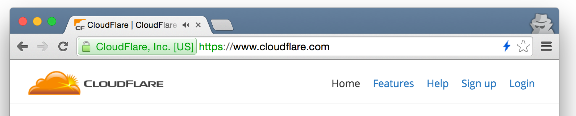

A green lightning bolt indicates the site was served using SPDY and gives the SPDY version number. In this case SPDY/3.1:

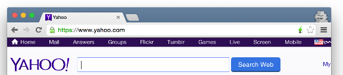

A grey lightning bolt indicates that neither HTTP/2 no SPDY were used. Here the web page was served using HTTP/1.1.


There's a similar extension for [Firefox](https://addons.mozilla.org/en-GB/firefox/addon/spdy-indicator/).

### Online testing

There's also a handy [online tool](https://tools.keycdn.com/http2-test) to check any individual web site.

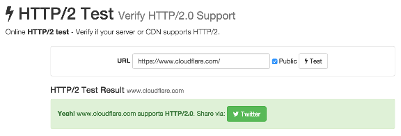

### Claire

CloudFlare also has a Google Chrome extension called [Claire](https://chrome.google.com/webstore/detail/claire/fgbpcgddpmjmamlibbaobboigaijnmkl) that gives information about how a web page was loaded. For example here's the information that Claire shows for a site using CloudFlare that uses [IPv6](https://www.cloudflare.com/ipv6), [Railgun](https://www.cloudflare.com/railgun), and HTTP/2.

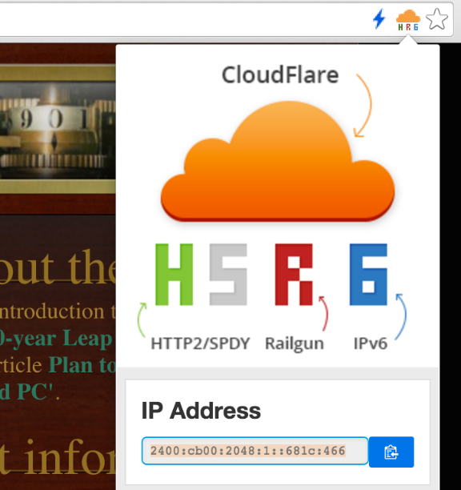

## Command-line Tools

There's a handy command-line tool called [is-http](https://github.com/stefanjudis/is-http2-cli) which is installed using npm as follows:

```
npm install -g is-http2-cli
```

Once installed you can check the HTTP/2 status of a web on the command-line:

```
$ is-http2 www.cloudflare.com
✓ HTTP/2 supported by www.cloudflare.com
Supported protocols: h2 spdy/3.1 http/1.1

$ is-http2 www.amazon.com
× HTTP/2 not supported by www.amazon.com
Supported protocols: http/1.1
```

The `is-http` tool is also useful because it gives you a list of the protocols advertised by the server. As you can see www.cloudflare.com supports HTTP/2, HTTP/1.1 and SPDY/3.1.

In version 7.43.0 the venerable `curl` tool got HTTP/2 support when it's linked with the [nghttp](https://nghttp2.org/) library. To build `curl` from sources you'll need OpenSSL, zlib, nghttp2 and libev. I used the following sequence of commands.

```
$ curl -LO http://dist.schmorp.de/libev/libev-4.20.tar.gz
$ tar zvxf libev-4.20.tar.gz
$ cd libev-4.20
$ ./configure
$ make
$ sudo make install

$ curl -LO https://www.openssl.org/source/openssl-1.0.2d.tar.gz
$ tar zxvf openssl-1.0.2d.tar.gz
$ cd openssl-1.0.2d
$ ./config shared zlib-dynamic
$ make && make test
$ sudo make install

$ curl -LO http://zlib.net/zlib-1.2.8.tar.gz
$ tar zxvf zlib-1.2.8.tar.gz
$ cd zlib-1.2.8
$ ./configure
$ make && make test
$ sudo make install

$ curl -LO https://github.com/tatsuhiro-t/nghttp2/releases/download/v1.5.0/nghttp2-1.5.0.tar.gz
$ tar zxvf nghttp2-1.5.0.tar.gz
$ cd nghttp2-1.5.0
$ OPENSSL_CFLAGS="-I/usr/local/ssl/include" OPENSSL_LIBS="-L/usr/local/ssl/lib -lssl -lcrypto -ldl" ./configure
$ make
$ sudo make install

$ curl -LO http://curl.haxx.se/download/curl-7.46.0.tar.gz
$ tar zxvf curl-7.46.0.tar.gz
$ cd curl-7.46.0
$ ./configure
$ make && make test
$ sudo make install
$ sudo ldconfig
```

Once installed `curl` has a new `--http2` option that causes it to use HTTP/2 (if it can). The `-v` verbose option will show information about the use of HTTP/2:

```
$ curl -vso /dev/null --http2 https://www.cloudflare.com/
[...]
* Using HTTP2, server supports multi-use
* Connection state changed (HTTP/2 confirmed)
* TCP_NODELAY set
* Copying HTTP/2 data in stream buffer to connection buffer after upgrade: len=0
* Using Stream ID: 1 (easy handle 0xc3dba0)
[...]
```

### nghttp2

If you built `curl` using my instructions above you will have built and installed some tools that come with the [nghttp2](https://nghttp2.org/) library. One of those is a command-line client called `nghttp`. It can be used like `curl` to download from the web using HTTP/2 but it also has a handy verbose option that shows that actual HTTP/2 frames sent and received.

By running it with `-nv` you get HTTP/2 and throw away the actual downloaded page. Here's its output when downloading www.cloudflare.com using HTTP/2. On a terminal with color support it uses coloring to highlight different parts of the log.

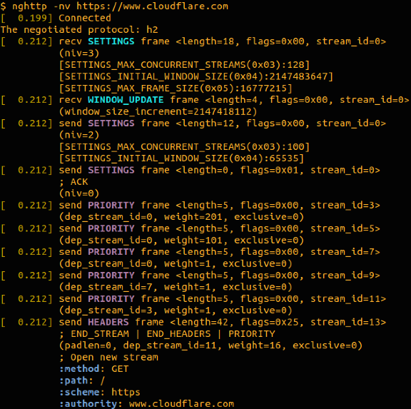

Another curl-like command-line tool for HTTP/2 is [h2c](https://github.com/fstab/h2c). It also enables dumping of HTTP/2 frames and has a nice feature that it runs in the background and keeps connections to servers alive and has a useful 'wiretap' feature for intercepting an HTTP/2 for debugging.

If you have [Go 1.5.1](https://golang.org/dl/) installed then you can download it as follows:

```
$ export GO15VENDOREXPERIMENT=1
$ go get github.com/fstab/h2c
```

You start `h2c` running by doing `h2c start &` which sets it running in the background. You can then communicate with a web server like this:

```
 $ h2c connect www.cloudflare.com
 $ h2c get /
 $ h2c disconnect
```

And it will perform the HTTP request. To see detailed output at the HTTP/2 you start h2c with the `--dump` parameter:

```
 $ h2c start --dump
```

You will then get detailed output dumped by that process, in color, of the HTTP/2 frames being used.

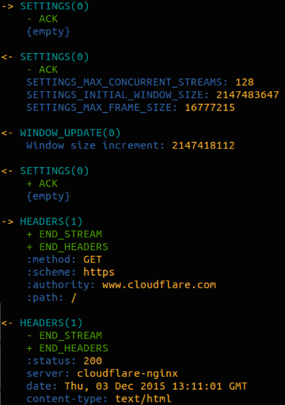

Details of the wiretap feature are in [this blog post](http://unrestful.io/2015/08/28/wiretap.html).

### openssl s\_client

If you just want to find out what protocols a web site supports OpenSSL's `s_client` can be used. If you specify an empty `-nextprotoneg` option OpenSSL sends an empty TLS option asking for negotiation of the next protocol and the server responds with a complete list of protocols it supports.

```
$ openssl s_client -connect www.cloudflare.com:443 -nextprotoneg ''
CONNECTED(00000003)
Protocols advertised by server: h2, spdy/3.1, http/1.1
```

There you can see that www.cloudflare.com support HTTP/2 (the h2), SPDY/3.1 and HTTP/1.1.

If you want to do low level HTTP/2 debugging there's an interactive client call [h2i](https://github.com/golang/net/tree/master/http2/h2i). Once again it requires that you have Go installed. To get it, run

```
$ go get github.com/golang/net/http2/h2i
```

You can then use `h2i` to connect to a site that uses HTTP/2 and send it individual HTTP/2 frames. For example, here's the start of session connecting to www.cloudflare.com and requesting the home page using the `headers` command which allows you to type in a standard HTTP/1.1 request.

```
$ h2i www.cloudflare.com
Connecting to www.cloudflare.com:443 ...
Connected to 198.41.214.163:443
Negotiated protocol "h2"
[FrameHeader SETTINGS len=18]
 [MAX_CONCURRENT_STREAMS = 128]
 [INITIAL_WINDOW_SIZE = 2147483647]
 [MAX_FRAME_SIZE = 16777215]
[FrameHeader WINDOW_UPDATE len=4]
  Window-Increment = 2147418112

h2i> headers
 (as HTTP/1.1)> GET / HTTP/1.1
 (as HTTP/1.1)> Host: www.cloudflare.com
 (as HTTP/1.1)>
  Opening Stream-ID 1:
  :authority = www.cloudflare.com
  :method = GET
  :path = /
  :scheme = https
 [FrameHeader HEADERS flags=END_HEADERS stream=1 len=819]
   :status = "200"
   server = "cloudflare-nginx"
   date = "Fri, 04 Dec 2015 10:36:15 GMT"
   content-type = "text/html"
   last-modified = "Thu, 03 Dec 2015 22:27:41 G MT" 
   strict-transport-security = "max-age=31536000"
   x-content-type-options = "nosniff"
   x-frame-options = "SAMEORIGIN"
   cf-cache-status = "HIT"
   expires = "Fri, 04 Dec 2015 14:36:15 GMT"
   cache-control = "public, max-age=14400"
 [FrameHeader DATA stream=1 len=7261]
   "<!DOCTYPE html>\n<html>\n<head>\n<!
```

# Load Testing

The [nghttp2](https://nghttp2.org/) library also includes a load testing tool called [h2load](https://nghttp2.org/documentation/h2load.1.html) which can be used a little like [ab](https://httpd.apache.org/docs/2.2/programs/ab.html). There's a useful [HOWTO](https://nghttp2.org/documentation/h2load-howto.html) on using the tool.

I ran it against the CloudFlare test server like this:

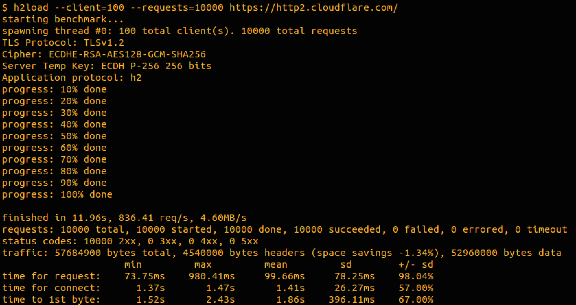

# Conformance

If you are testing an HTTP/2 implementation there's a useful tool called [h2spec](https://blog.cloudflare.com/tools-for-debugging-testing-and-using-http-2/) which runs through a conformance test against a real HTTP/2 server. To use it first install [Go 1.5.1](https://golang.org/dl/) and then do

```
$ go get github.com/summerwind/h2spec/cmd/h2spec
```

I only recommend it for testing locally running HTTP/2 servers. If you built `nghttp2` above while building `curl` you will also have the `nghttpd` HTTP/2 server available. You can run `h2spec` against it like this:

```
$ nghttpd --no-tls -D -d /tmp 8888
$ h2spec -p 8888
```

`h2spec` will run a battery of tests against the server and output conformance information with a reference to the relevant part of [RFC7540](https://tools.ietf.org/html/rfc7540).

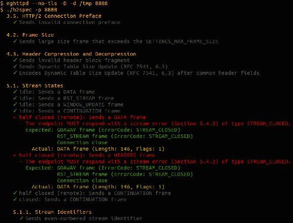

If you need to test a number of web sites to see which support HTTP/2 there's a tool called [h2scan](https://github.com/jgrahamc/h2scan). Feed it a list of web sites and it will check to see if they support HTTPS, SPDY/3.1 and HTTP/2.

```
$ cat examples
www.cloudflare.com
www.amazon.com
www.yahoo.com
$ h2scan --fields < examples
name,resolves,port443Open,tlsWorks,httpsWorks,cloudflare,spdyAnnounced,http2Announced,spdyWorks,http2Works,npn
www.cloudflare.com,t,t,t,t,t,t,t,t,t,h2 spdy/3.1 http/1.1
www.amazon.com,t,t,t,t,f,f,f,-,-,http/1.1
www.yahoo.com,t,t,t,t,f,t,f,t,-,spdy/3.1 spdy/3 http/1.1 http/1.0
```

# Useful Libraries

If you are working in C and need to add HTTP/2 support to a program there's the [nghttp2](https://nghttp2.org/) library that is full implementation of HTTP/2 with a simple interface. Their [HTTP/2 client tutorial](https://nghttp2.org/documentation/tutorial-client.html#libevent-client-c) explains how to use the library to add HTTP/2 client capabilities. nghttp2 can also be used for [servers](https://nghttp2.org/documentation/tutorial-server.html#libevent-server-c).

Go programmers will find full HTTP/2 support will arrive with Go 1.6. If you can't wait until then there's an extension package for HTTP/2 [golang.org/x/net/http2](https://godoc.org/golang.org/x/net/http2) . Details [here](https://http2.golang.org/).

There's a pure Ruby implementation of HTTP/2 available from [Ilya Grigorik](https://github.com/igrigorik/http-2).

Haskell programmers can use the [http2](https://hackage.haskell.org/package/http2) hackage.

# Packet Snooping

The popular Wireshark packet analyzer added decoding on HTTP/2 in version [1.12.0](https://www.wireshark.org/docs/relnotes/wireshark-1.12.0.html#_new_protocol_support) and fully decodes HTTP/2 frames. Unfortunately most HTTP/2 is sent over TLS which means that, by default, Wireshark will not be able to decrypt the packets to be able to get to the HTTP/2 for decoding.

Fortunately, there is a workaround if you are using Google Chrome for testing. It is possible to get Chrome to save the symmetric cryptographic key used for TLS connections to a file and Wireshark is able to read that file to decode TLS connections.

This is done by setting the `SSLKEYLOGFILE` environment variable before running Chrome. I'm running on Mac OS X and use Google Chrome Canary for testing so I run:

```
% export SSLKEYLOGFILE=`pwd`/sslkey.log
% /Applications/Google\ Chrome\ Canary.app/Contents/MacOS/Google\ Chrome\ Canary
```

Google Chrome will then write session keys to that file. In Wireshark I configure it to read the file by going to Preferences, expanding the Protocols list.

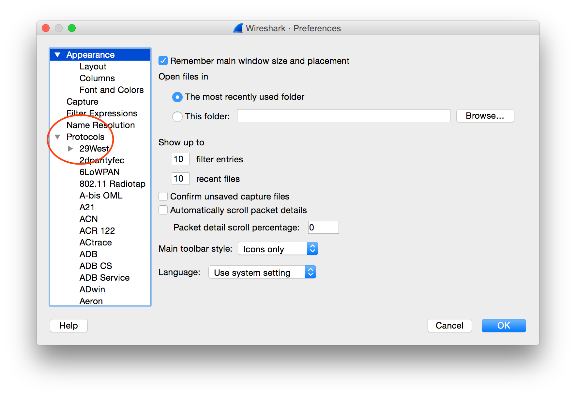

Then I find SSL and set the Pre-Master-Secret log filename to point to the same file.

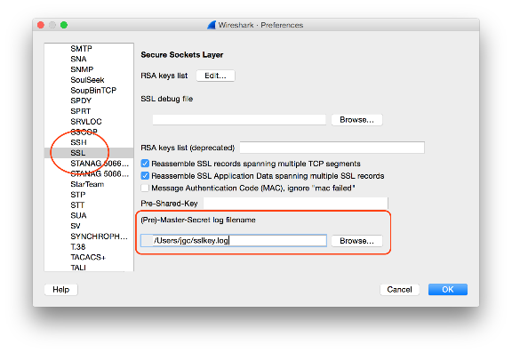

Then Wireshark can decode the TLS connections made by that browser. Here's the beginning of a connection between Google Chrome Canary and the experimental server <https://http2.cloudflare.com/>.

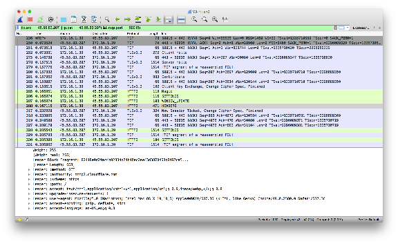

# Chrome Developer View

Finally, if you are looking at the performance of your own web site it can be handy to understand which parts of the page were downloaded using HTTP/2 and which were not. You can do that pretty easily using the Developer view in Google Chrome. Here's a shot of the CloudFlare blog loaded in Chrome. There's an additional Protocol fields available on the pop-up menu.

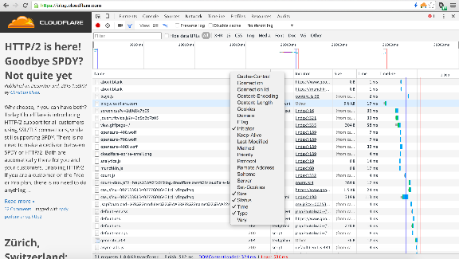

Once added you can sort by protocol to see which parts were HTTP/2 (the h2) and which were other protocols.

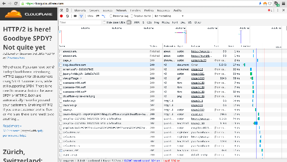

# Learning about HTTP/2

1. Short [introduction to HTTP/2](https://www.cloudflare.com/http2/what-is-http2/) from CloudFlare.
2. [http2 explained](http://daniel.haxx.se/http2/) from the creator of `curl`.
3. The [home page](http://http2.github.io/) of the HTTP/2 working group with lots of information plus a list of useful [tools](https://github.com/http2/http2-spec/wiki/Tools).
