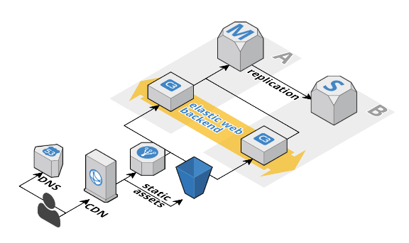
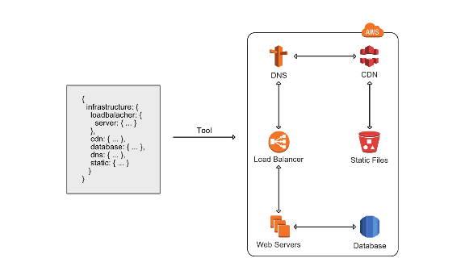
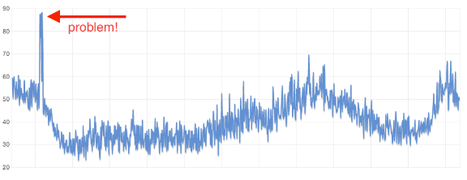
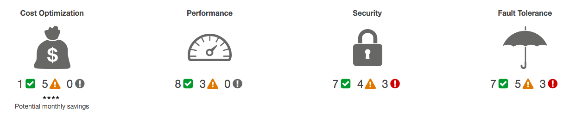

# 5 AWS mistakes you should avoid

Since this year I'm working as an AWS Cloud Consultant where I see a lot of small to medium sized AWS deployments. Most of them are typical web applications. I want to share with you the 5 most common mistakes that you better avoid:

- managing infrastructure manually
- not using Auto Scaling Groups
- not analyzing metrics in CloudWatch
- ignoring Trusted Advisor
- underutilizing virtual machines

If you are interested in how to avoid the mistakes in a typical web application read on.

## Typical web application

A typical web application consists of at least:

- load balancer
- scalable web backend
- database

and looks like the following figure.

This pattern is very common and if yours look different you should have (strong) reasons.

## Mistake 1: managing infrastructure manually

If your AWS setup was created by clicking around in the web based management console you are managing infrastructure manually. The biggest problem with this approach: it is not reproducible, it is not documented and you can make a lot of mistakes. Luckily [AWS CloudFormation](https://aws.amazon.com/cloudformation/) solves your problem free of charge. Instead of creating all the resources (like EC2 instances, Security Groups, Subnets, ...) manually you describe them in a template. CloudFormation will figure out how to turn this template into a running stack. CloudFormation creates all the resources for you in proper order as shown in the following figure.

You can even update templates to apply changes to a running stack. A typical web application can be described in a CloudFormation template easily as shown [here](https://github.com/AWSinAction/code/blob/master/chapter2/template.json).

Our [blog contains many CloudFormation examples](https://cloudonaut.io/tag/cloudformation/) and I also wrote a [book about AWS and CloudFormation](https://www.manning.com/books/amazon-web-services-in-action?a_aid=mwittig&a_bid=cc17df85). There is no reason why you should manage your infrastructure manually. It's unprofessional! It's a mess!

## Mistake 2: not using Auto Scaling Groups

The biggest problem with Auto Scaling Groups is that people assume that they are about auto scaling which they are not! Every EC2 instance should be launched inside an Auto Scaling Group. Even if it's a single EC2 instance. The Auto Scaling Group takes care of monitoring the EC2 instance, it acts as a logical group of virtual machines, and it's free.

In the typical web application the web servers will run on virtual machines in an Auto Scaling Group. You can of course use Auto Scaling Groups to scale the number of virtual machines based on the current workload but as precondition you need Auto Scaling Groups. Auto scaling is achieved by setting alarms on metrics like CPU usage (of the logical group) or number of requests the load balancer received. If the alarm threshold is reached you can define an action like increase the number of machines in the Auto Scaling Group.

## Mistake 3: not analyzing metrics in CloudWatch

Every AWS service reports interesting metrics to a service called [CloudWatch](https://aws.amazon.com/cloudwatch/). Virtual machines report CPU usage, network usage, and disk activity. Databases report also memory usage and IOPS usage. Your job is to analyze the data. Look at the following graph showing CPU usage over a day.

Can you see the usage spike? I can tell you that this spike was visible every day. Always the same time. It smells like cronjob and of course it was a cronjob. But this machine was running a web server. So every day the latency increased because of that cronjob. Just run it on a separate virtual machine to solve the problem. It's all in CloudWatch but you need to look at it!

The second step, once you analyzed your metrics is to define alarms on them. Not the other way around!

## Mistake 4: ignoring Trusted Advisor

Do you know [Trusted Advisor](https://aws.amazon.com/premiumsupport/trustedadvisor)? It checks your AWS account against best practices defined by AWS. The focus areas are:

- cost optimization
- performance
- security
- fault tolerance

If your Trusted Advisor Dashboard looks like the following figure you have a good starting point for improvement.

I suggest to care about security first! You can enable a weekly email from Trusted Advisor which tells you what has changed (resolved or new issues) since last week. Activate this in the preferences section. If you pay for AWS support Trusted Advisor becomes even more powerful by adding more checks.

## Mistake 5: underutilizing virtual machines

There is no reason - beside manually managed infrastructure - to not decrease the instance size (number of machines or `c3.xlarge` to `c3.large`) if you realize that your EC2 instances are underutilized. How do you know if you are underutilized? Check your CloudWatch metrics! It's that easy.
If you use Auto Scaling Groups you should also check your auto scaling rules and CloudWatch metrics to scale up later or scale down earlier.

## Summary

As an AWS Cloud Consultant I see many AWS accounts. During the year I collected mistakes that I saw in each account and aggregated them to provide you my best of. It turned out that the 5 most common mistakes on AWS are:

- managing infrastructure manually
- not using Auto Scaling Groups
- not analyzing metrics in CloudWatch
- ignoring Trusted Advisor
- underutilizing virtual machines

Now it's your turn to check your infrastructure.

Happy Christmas!

---

This post received [over 250 comments on Hacker News](https://news.ycombinator.com/item?id=10794951).

This post was mentioned on [Stuff The Internet Says On Scalability For January 1st, 2016](http://highscalability.com/blog/2016/1/1/stuff-the-internet-says-on-scalability-for-january-1st-2016.html).
