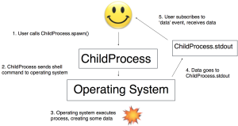

# How I fixed Node.js

My first open-source contribution

It was the lazy Saturday after Thanksgiving, and to burn off some of the extra calories from the preceding days I decided to break into the open-source world. I’d worked with [node.js](https://nodejs.org/en/) at Jut, so I was acquainted with the platform, though I had no experience with the source code. So I wandered into the issue tracker for the node.js repository and settled on issue [4049](https://github.com/nodejs/node/issues/4049), a memory leak in the ChildProcess module.

### ChildProcess

The [ChildProcess](https://nodejs.org/api/child_process.html) module is a part of node.js that runs [shell](https://en.wikipedia.org/wiki/Shell_%28computing%29) commands. You can run a shell command using ChildProcess.spawn(). Given a shell command, ChildProcess.spawn runs it and returns an object with fields called stdout and stderr. stdout and stderr are [streams](https://nodejs.org/api/stream.html), so you can read data from them. Data from stdout corresponds to the output of the spawned process, and data from stderr describes errors that the spawned process encounters.

Streams are [EventEmitters](https://nodejs.org/api/events.html), and they emit events whenever their status changes. For instance, they emit a data event when they get new data, and they emit a close event when they have no more data and their underlying data source is empty. So the stdout stream for our child processes emits a data event when its ChildProcess’s shell command gives it some new data, and it emits a close event when the shell command is done and there’s no more data. Clients such as ChildProcess can add *event handlers* to streams using the on function. Event handlers are functions that will be called when a stream emits a particular event. Here’s a sketch of how it all fits together:



And here’s a simple example that runs an [echo](https://en.wikipedia.org/wiki/Echo_%28command%29) command and logs the result:

```
ChildProcessrequire'child_process' process ChildProcessspawn'echo''hello'

processstdout'data'functiondatum
    console'received datum: ' datumtoString
```

That prints received datum: hello.

### The bug

The node.js user [jhenninger](https://github.com/jhenninger) had found a combination of spawning processes, reading from their stdout streams, and killing the processes that caused a [memory leak](https://en.wikipedia.org/wiki/Memory_leak). A lot of my work at Jut involved running down memory leaks, so I figured I was qualified to attack this one.

The issue handily came with reproducing code. The code spawns a simple child process every 50 milliseconds, reads from its stdout stream, and promptly kills it. This should cause the ChildProcess object to have nothing left to do, so the [garbage collector](http://jayconrod.com/posts/55/a-tour-of-v8-garbage-collection) should free the memory allocated to it.  But this code contained some extra logic, powered by the [weak.js](https://www.npmjs.com/package/weak) library, that kept track of these garbage collections. This logic indicated that ChildProcess objects were not being freed. Here’s the script (I added some comments and changed some variable names from the original, for clarity):

```
ChildProcessrequire'child_process'require'weak'// nifty library that lets you fire a callback when an object is garbage collected child_processes_in_memory function callback
  consolechild_processes_in_memory// one fewer process is in memory now that this one has been freed

setIntervalfunction spawnKillChildProcessspawn'yes'// start a process running the "yes" commandchild_processes_in_memory// p is now in memory, so increment child_processes_in_memorystdout// get some data from the process (since p is running "yes" the data looks like newline separated 'y' characters)// stop the process, this should free up all the resources associated with it enabling p to be freed callback// call callback() when p is freed// trigger an immediate garbage collection, so p will be deallocated right here if possible
```

### The search

The first step was to witness the leak on my own machine. I downloaded the node.js source code, ran the script and lo: a memory leak. The sign of the memory leak was that the child\_processes\_in\_memory variable was steadily increasing. If the ChildProcess objects were being freed as they should be, the callback would keep the value of child\_processes\_in\_memory at 1 or 0.

Now it was time to dive into the code. I had three functions that I needed to understand before I could fix this leak: spawn, read, and kill. I decided to start with kill, because I had a hunch that was where the problem was.

I tracked down ChildProcess’s kill function, but all it did was call this.\_handle.kill(). To figure out what that meant, I had to go back to the ChildProcess constructor, where I saw the initializer this.\_handle = new Process();. Process is defined by the [v8](https://en.wikipedia.org/wiki/V8_%28JavaScript_engine%29) engine that powers node.js. v8 is much more mature than Node, so I decided to operate for the moment under the assumption that Process was working okay, and the problem was in Node, not v8, so I didn’t inspect Process’s source code in any depth.

But two lines after the initialization of this.\_handle, I noticed the line this.\_handle.onexit = function(exitCode, signalCode) {. Based on the name, I figured this was likely where ChildProcess was supposed to clean up its resources after its process had been killed. The interesting part for me was this bit at the end of the function:

```
processnextTickflushStdio

maybeClose
```

The function name maybeClose suggested that this function doesn’t always succeed — a process might not end up closing. To figure out under what circumstances the process wouldn’t close, I went to maybeClose‘s definition:

```
function maybeClosesubprocess
  subprocess_closesGotsubprocess_closesGot  subprocess_closesNeeded
    subprocess'close' subprocessexitCode subprocesssignalCode
```

To interpret this, I had to find out what those \_closesGot and \_closesNeeded fields meant. I found their declarations in the spawn method: \_closesNeeded is initialized to 1 and incremented for each output stream associated with the process, and \_closesGot is initialized to 0 and only incremented here in maybeClose. The output streams for the ChildProcesses we are interested in are the stdout and stderr streams.

ChildProcess’s spawn method puts a close event handler on stdout and stderr, calling maybeClose in response to their close events. As we saw earlier, stdout and stderr emit these close events when all their data has been read and there’s no more data left to read. So the full shutdown procedure for a ChildProcess is: the shell command defining the process finishes, then the stdout and stderr streams close, then the ChildProcess object closes.

A ChildProcess object is an EventEmitter too, and it will emit a close event of its own once all its output streams have emitted close events. To get a better feel for how all these close events were interacting, I wanted to trace all the events my child processes were emitting. I implemented this with some tweaks to my test script – I numbered each of my child processes, and I overwrote their emit functions with a function that logged their number and then called the normal emit function. Here’s how it turned out:

```
 process_index 

setIntervalfunction spawnKillChildProcessspawn'yes'// start a process running the "yes" commandnumber  process_index old_emit // save a reference to p's ordinary emitfunction// overwrite p's emit
    consolenumber
    old_emitapply arguments// handle the event as we ordinarily would using p's original emit function// ... rest of the script as above
```

Maybe I’m crazy, but I find hacks like that ridiculously beautiful. The way Javascript lets you freely manipulate your objects is one of the main reasons I love it. Anyway, running the script that way, I got to see every event that my ChildProcess objects were emitting, and sure enough, the ones that were never getting freed were never emitting close events either. By similarly tracing the emits from stderr and stdout, I found that stdout was not always closing. This meant that p was stuck at two \_closesGot (the ones from this.\_handle.onexit and stderr), so it never could close itself.

If I took out the call to p.stdout.read(), all of the close events always fired. So somehow my call to p.stdout.read() was preventing p.stdout from closing once I killed the process p. To figure out why, I had to check out the code for read, defined in net.js. It looks like this:

```
Socketprototypefunctionreturn streamReadableprototype streamReadableprototype_consuming return
```

Our stdout and stderr here are actually Sockets, a subclass of Stream, so this is the function that gets called when I read from them. All the real reading work is handled by stream.Readable.prototype.read, but first Socket.prototype.read sets this.\_consuming to true the first time it is called with a nonzero argument. Since I invoke it like  p.stdout.read(), n is undefined, not 0. That means this.\_consuming does get set to true here.

The final piece of the puzzle was the flushStdio method of ChildProcess, which you may recall is the other method (besides maybeClose) that ChildProcess calls in this.\_handle.onexit. Here’s how it looked when I found it:

```
function flushStdiosubprocesssubprocessstdio return
  subprocessstdioforEachfunctionstream stdiostream streamreadable  stream_consumingreturn
    streamresume
```

stream.resume() is a method that tells the stream to emit any data it has buffered, then tear itself down and emit a close event. That seems important. But look! We don’t call it if the stream has its \_consuming field set. We set our stdout‘s \_consuming to true when we called read() on it, so flushStdio didn’t call resume() on stdout. This seemed likely to be the cause of the memory leak.

### The fix

I didn’t see any reason not to call resume() on streams that had \_consuming set. So I replaced if (!stream || !stream.readable || stream.\_consuming) in the flushStdio function with if (!stream || !stream.readable) and reran the leak-generating script. Sure enough, no leak ensued! I had fixed node.js.

I’m not sure how the original broken code came into existence in the first place, but there had recently been a major refactor of how Node’s streams are implemented, so I guess this slipped through the cracks.

With the mystery solved, all that remained was to get my code into production. I wrote up a little test that spawns and kills a process and wait for the close event from it, made sure it failed on the master branch and passed on my branch, and opened a pull request against node with my change and the test. The reviewers noted that my test spawned a process using the yes command, which apparently doesn’t work on Windows. When I changed it to the more-universal echo command, they approved my [commit](https://github.com/nodejs/node/commit/7793c364fc59a480c94387f8f42681d9e28f2658), and just like that I was a node.js contributor!

So that’s the story of how I learned a new codebase, fixed a bug in node.js, and made the world a better place. Not too bad for the lazy Saturday after Thanksgiving!
