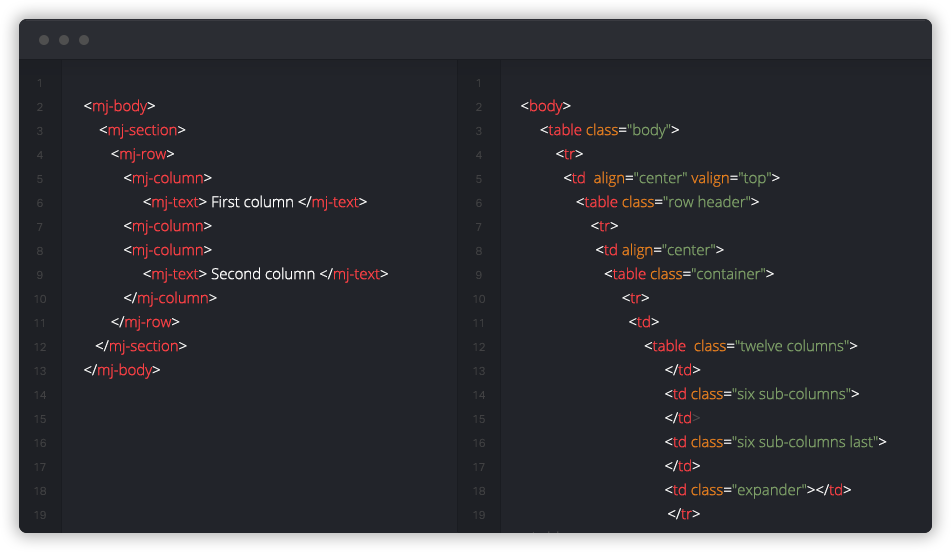
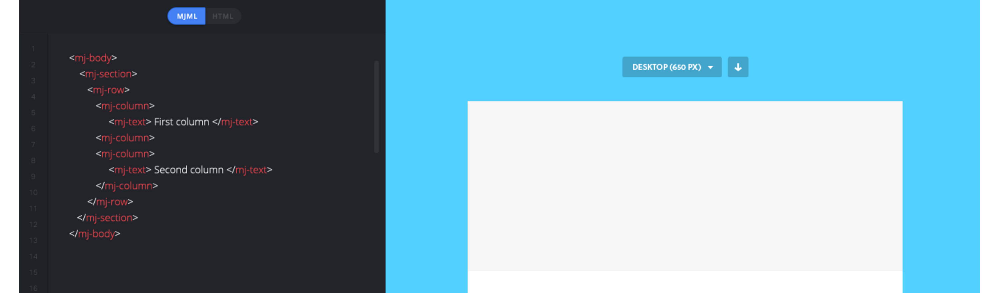

# Introduction

MJML is a markup language designed to reduce the pain of coding a responsive email. Its semantic syntax makes it easy and straightforward while its rich standard components library fastens your development time and lightens your email codebase. MJML’s open-source engine takes care of translating the MJML you wrote into responsive HTML.

[](http://mjml.io/)

# Installation

```
npm install -g mjml
```

[**Via... click:**](https://github.com/mjmlio/mjml/releases)

# Show me the code!

### Command line

> Compile the file and output the result in `a.html`

```
$ mjml -r input.mjml
```

> Redirect the result to a file

```
$ mjml -r input.mjml -o output.html
```

> Watch a file and compile every time the file changes

```
$ mjml -w input.mjml -o output.html
```

### Inside NodeJs

```
import   

  Compile an mjml string

const htmlOutput  .mjml2html(<mj-body>
  <mj-section>
    <mj-column>
      <mj-text>
        Hello World!
      </mj-text>
    </mj-column>
  </mj-section>
</mj-body>
)

  Print the responsive HTML generated

console.(htmlOutput);
```

### Create your component

> Issue the following in your terminal

```
$ mjml --init-component name of your component

# If your component cannot contain anything else than text:
$ mjml --init-component name of you component -e

# It means nothing inside it will be parsed by the mjml engine.
```

It will create a basic component template in a `.js` file. Follow the instructions provided in the file
and read more about custom components in the documentation

# Try it live

Get your hands dirty by trying the MJML online editor! Write awesome code on the left side and preview your email on the right. You can also get the rendered HTML directly from the online editor.

[](http://mjml.io/try-it-live)

# Contributors

# Contribute

- Fork the repository
- Code an awesome feature (we are confident about that)
- Make your pull request
- Add your github profile here
