# Learn Enough Git to Be DangerousMichael Hartl

An Introduction to Version Control with Git

$9.00

[Buy eBooks](https://www.softcover.io/buy/28fdb94f/learn_enough_git)

[Get updates](http://www.learnenough.com/git-tutorial)

Follow author to receive email updates about new content

*Learn Enough™ Git to Be Dangerous* is the final installment in a trilogy of tutorials on *developer fundamentals* designed to teach three skills essential for software developers and those who work with them. The first two cover the [Unix command line](http://learnenough.com/command-line-tutorial) and [text editors](http://learnenough.com/text-editor-tutorial); this one adds a third: *version control*. As with the first two tutorials, *Learn Enough™ Git to Be Dangerous* doesn’t even assume you’re familiar with the *category* of application, so if you’re unsure about what “version control” is, you’re in the right place. Even if you are already familiar with the subject, it’s likely you’ll still learn a lot from this tutorial. Either way, learning this important technology prepares you for the other [Learn Enough™ tutorials](http://learnenough.com/) while enabling an astonishing variety of applications—including a special surprise bonus at the end of this tutorial ([Box](http://www.learnenough.com/git-tutorial#aside-shipping)).

*Note*: *Learn Enough™ Git to Be Dangerous* is available for free online, but ebooks (EPUB, MOBI, PDF) are [available for purchase](https://www.softcover.io/buy/28fdb94f/learn_enough_git) as well.

Box 1.
Real artists ship

As legendary Apple cofounder Steve Jobs once said: *Real artists ship.* What he meant was that, as tempting as it is to privately polish in perpetuity, makers must *ship* their work—that is, actually finish it and get it out into the world. This can be scary, because shipping means exposing your work not only to fans but also to critics. “What if people don’t like what I’ve made?” *Real artists ship.*

It’s important to understand that shipping is a separate skill from making. Many makers get good at making things but never learn to ship. To keep this from happening to us, starting in *Learn Enough™ Git to Be Dangerous* we’re going to ship at least one thing in every Learn Enough™ tutorial. In fact, in this tutorial we’ll actually ship *two* things—a public Git repository and a surprise bonus that will give you bragging rights with all of your friends.

[Version control](https://en.wikipedia.org/wiki/Version_control) solves a problem that might look familiar if you’ve ever seen Word documents or Excel spreadsheets with names like `Report_2014_1.doc`, `Report_2014_2.doc`, `Report_2014_3.doc`, or `annual-budget-v17.xls`. These cumbersome names indicate how annoying it can be to track different versions of documents. Nowadays, applications like Word do sometimes offer built-in version tracking, but such features are tightly coupled to the underlying application and aren’t useful for any other document types. Many technical applications (including most websites and programming projects) require a general solution to the problem of versions.

A version control system (or *VCS*) provides an automatic way to track changes in software projects, giving creators the power to view previous versions of files and directories, develop speculative features without disrupting the main development, securely back up the project and its history, and collaborate easily and conveniently with others. In addition, using version control also makes deploying production websites and web applications much easier. As a result, fluency in at least one version control system is an essential component of *technical sophistication* ([Box](http://www.learnenough.com/git-tutorial#aside-technical_sophistication)). This applies especially to the version control system covered in this tutorial, called *Git*.

Box 2.
Technical sophistication

A principal theme of the [Learn Enough™ tutorials](http://learnenough.com/) is the development of *technical sophistication*, the combination of hard and soft skills that make it seem like you can magically solve any technical problem ([Figure](http://www.learnenough.com/git-tutorial#fig-tech_support_cheat_sheet)).[1](http://www.learnenough.com/git-tutorial#cha-0_footnote-1) *Learn Enough™ Git to Be Dangerous* is important for developing these skills because being able to use at least one modern version control system is an essential component of technical sophistication.

In the context of Git, technical sophistication includes several things. Many Git commands print various details to the terminal screen; technical sophistication lets you figure out which ones to pay attention to and which to ignore. There are also many Git-related resources on the web, which among other things means that Google searches are often useful for figuring out the exact command you need at a particular time. Technical sophistication lets you figure out the best search terms for finding the answer you’re looking for; e.g., if you need to delete a remote branch ([Section 4.3.1](http://www.learnenough.com/git-tutorial#sec-exercises_pushing_branches)), Googling for “git delete remote branch” is a good bet to turn up something useful. Finally, repository hosting sites like [GitHub](http://github.com/) and [Bitbucket](http://bitbucket.org/) typically include commands to help guide you through various setup tasks, and technical sophistication gives you the confidence to follow the steps even if you don’t understand every detail.

One helpful command for learning Git is `git help`, which by itself gives general guidelines on Git usage, and when applied to a specific command gives further information on that command. For example, `git help add` shows details about the `git add` command. The output of `git help` is similar to the man pages [covered](https://www.learnenough.com/command-line-tutorial#sec-man_pages) in [*Learn Enough™ Command Line to Be Dangerous*](http://learnenough.com/command-line-tutorial): full of useful but often obscure information. As always, use your technical sophistication to help make sense of it.

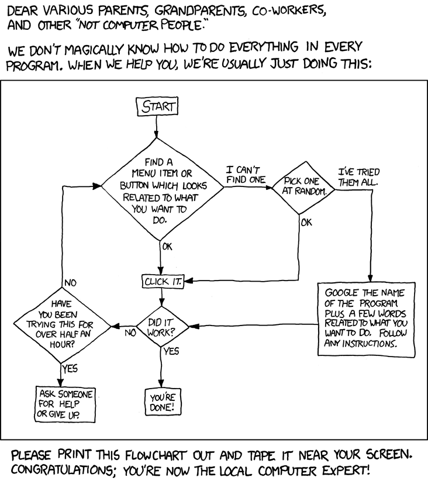

Version control has evolved considerably over the years. The family line leading to Git includes programs called RCS, CVS, and Subversion, and there are many current alternatives as well, including Perforce, Bazaar, and Mercurial. I mention these examples not because you need to know what they are, but only to show what a bewildering variety there is. What’s worse, when you choose a version control system, you really *commit* to it,[2](http://www.learnenough.com/git-tutorial#cha-0_footnote-2) and it is often difficult to switch from one to another. Happily, in the last few years an undisputed winner has emerged in the open-source VCS wars: Git. This victory is the main reason this tutorial is called *Learn Enough™ Git to Be Dangerous* rather than *Learn Enough™ Version Control to Be Dangerous*. Nevertheless, many of the ideas here are quite general, and if by some chance you need to use a different VCS, this tutorial will still provide a useful introduction to the subject.

Originally developed by [Linux](https://en.wikipedia.org/wiki/Linux) creator Linus Torvalds[3](http://www.learnenough.com/git-tutorial#cha-0_footnote-3) to host the Linux [kernel](https://en.wikipedia.org/wiki/Kernel_(operating_system)), Git has a combination of power, speed, and community adoption that leave it few rivals. It can be tricky to learn, though, and other Git tutorials have a tendency to introduce lots of heavy theory, which can be interesting to learn but in practice is really only understood by a tiny handful of Git users ([Figure](http://www.learnenough.com/git-tutorial#fig-xkcd_git) and [Figure](http://www.learnenough.com/git-tutorial#fig-xkcd_git_title_text)).[4](http://www.learnenough.com/git-tutorial#cha-0_footnote-4) The good news is that the set of Git commands needed to be productive is relatively small; there are some pointers to more advanced and theory-oriented resources listed in [Section](http://www.learnenough.com/git-tutorial#sec-conclusion), but in this tutorial we focus on the essential commands needed to be *dangerous*.

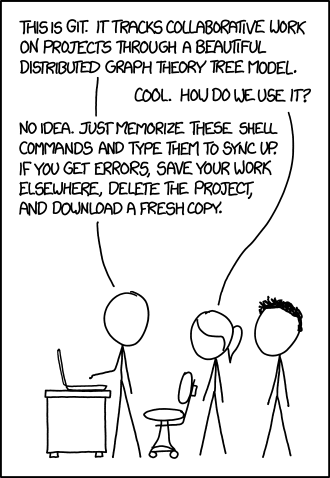

Figure 2: “[Git](https://m.xkcd.com/1597/)” via the webcomic [xkcd](http://xkcd.com/). See also the [title text](http://www.explainxkcd.com/wiki/index.php/title_text) ([Figure](http://www.learnenough.com/git-tutorial#fig-xkcd_git_title_text)).

> *If that doesn’t fix it, git.txt contains the phone number of a friend of mine who understands git. Just wait through a few minutes of “It’s really pretty simple, just think of branches as…” and eventually you’ll learn the commands that will fix everything.*

## [Getting started](http://www.learnenough.com/git-tutorial#sec-getting_started)

To see how version control works and what benefits it brings, it helps to have a concrete application in mind, so we’ll be making a simple project consisting of a small website. We’ll begin by installing Git (if necessary) and doing some one-time configuration. Then we’ll create the new project and start tracking its changes with Git.

For reference, important commands from this section are summarized in [Table](http://www.learnenough.com/git-tutorial#table-getting_started).

### [Installation and setup](http://www.learnenough.com/git-tutorial#sec-installation_and_setup)

Before doing anything else, we first need to verify that Git is installed on the present system. As a reminder, we’re working in the Unix tradition, so it is strongly recommended that you use Macintosh OS X or Linux (possibly via a virtual machine ([Box](http://www.learnenough.com/git-tutorial#aside-using_unix))).

Box 3.
Using Unix

This tutorial, as with the others in the [Learn Enough™ to Be Dangerous](http://learnenough.com/) series, assumes you have access to a computer running some variant of Unix. If you already run Macintosh OS X or Linux, you’re good to go, but if you’re on Windows you should install a *Linux Virtual Machine* as described below:

1. Install the right version of [VirtualBox](https://www.virtualbox.org/) for your system (free).
2. Download the [Learn Enough Virtual Machine](https://softcover-static.s3.amazonaws.com/LearnEnough-v.1.4.ova) (large file).
3. Once the download is complete, double-click the resulting “OVA” file and follow the instructions to install the Virtual Machine (VM).
4. Double-click the VM itself and log in using the default user’s password, which is “foobar!”.

The result will be a Linux desktop environment (including a command-line terminal program, text editor, and Git) pre-configured for this tutorial.

In the longer run, I recommend switching to a Mac as soon as possible. (*Warning*: This might start a [holy war](http://www.learnenough.com/text-editor-tutorial#aside-holy_wars).) You might have to save up a bit, as Macs are generally more expensive than Windows machines, but in most cases the increased productivity will quickly pay for the difference. (If you find yourself liking Linux, feel free to stick with it, but Macs are generally easier to use with a better user interface. Plus, you can always run Linux inside a VM, even on a Mac.)

The easiest way to check for Git is to start a terminal window and use `which`[5](http://www.learnenough.com/git-tutorial#cha-0_footnote-5) at the command line to see if the `git` executable is already present:

```
 which git
/usr/local/bin/git
```

If the result is empty, it means you have to install Git manually. To do this, follow the instructions at “[Getting Started – Installing Git](https://git-scm.com/book/en/v2/Getting-Started-Installing-Git)” in the official Git documentation. (This will likely give you an opportunity to apply some technical sophistication ([Box](http://www.learnenough.com/git-tutorial#aside-technical_sophistication)).)

After installing Git but before starting a project, we need to perform a series of one-time setup steps, as shown in [Listing](http://www.learnenough.com/git-tutorial#code-global_config). These are *global* setups, meaning you only have to do them once per computer. Note that the name and email address you use in your Git configuration will be available in any repositories you make public, so don’t expose any information you’d rather keep private.

Listing 1:
One-time global configuration settings

```
 git config --global user.name "Your Name"
 git config --global user.email your.email@example.com
 git config --global alias.co checkout
```

Only the first two lines above are strictly necessary; the optional third line is included so that you can use `git co` in place of the more verbose `git checkout`. For maximum compatibility with systems that don’t have `co` configured, this tutorial will use the full `checkout` command, but in real life I nearly always use `git co`.

#### [Prompt branches and tab completion](http://www.learnenough.com/git-tutorial#sec-prompt_branches_and_tab_completion)

At this point, you should be ready to go, but before moving on there are a couple of other features I recommend adding. Following these steps should be within your capabilities if you completed [*Learn Enough™ Command Line to Be Dangerous*](http://learnenough.com/command-line-tutorial) and [*Learn Enough™ Text Editor to Be Dangerous*](http://learnenough.com/text-editor-tutorial), but they are optional, so you can skip this section if you run into trouble.

First, we can arrange for the command-line prompt to include the name of the current *branch* (alluded to in [Figure](http://www.learnenough.com/git-tutorial#fig-xkcd_git_title_text) and covered starting in [Section](http://www.learnenough.com/git-tutorial#sec-branching_and_merging)). Second, we can add the ability to fill in Git branch names using [*tab completion*](https://www.learnenough.com/command-line-tutorial#aside-tab_completion), which is especially convenient when dealing with longer branch names. Both of these features come as shell scripts with the Git source code distribution, but it can be difficult to track them down on the local system, so I’ve placed copies on the Learn Enough™ [CDN](https://en.wikipedia.org/wiki/Content_delivery_network) for convenience. As described in [*Learn Enough™ Command Line to Be Dangerous*](http://learnenough.com/command-line-tutorial), we can download such files using `curl`, as shown in [Listing](http://www.learnenough.com/git-tutorial#code-git_shell_scripts).

Listing 2:
Downloading scripts for branch display and tab completion.

```
 curl -o ~/.git-prompt.sh       -OL cdn.learnenough.com/git-prompt.sh
 curl -o ~/.git-completion.bash -OL cdn.learnenough.com/git-completion.bash
```

Here the `-o` flag arranges to save the files locally under slightly different names from the ones on the server, prepending a dot `.` so that the files are [hidden](https://www.learnenough.com/command-line-tutorial#sec-hidden_files).

After downloading the scripts as in [Listing](http://www.learnenough.com/git-tutorial#code-git_shell_scripts), on some systems we need to make them executable, which we can do with the `chmod` command (as [mentioned](http://www.learnenough.com/text-editor-tutorial#sec-writing_an_executable_script) in [*Learn Enough™ Text Editor to Be Dangerous*](http://learnenough.com/text-editor-tutorial)):

```
 chmod +x ~/.git-prompt.sh
 chmod +x ~/.git-completion.bash
```

Next, we need to tell the shell about the new commands, so open up the Bash profile file in your favorite editor (which for simplicity I’ll assume is Atom):

```
 atom ~/.bash_profile
```

Then add the configuration shown in [Listing](http://www.learnenough.com/git-tutorial#code-git_configuration) to the bottom of the file. Also, make sure to delete any other lines starting with `PS1` (which you’ll have to do if you modified `.bash_profile` [as shown](http://www.learnenough.com/text-editor-tutorial#code-customize_prompt) in [*Learn Enough™ Text Editor to Be Dangerous*](http://learnenough.com/text-editor-tutorial)).

Listing 3:
Git configuration in the `.bash_profile` file. ~/.bash\_profile

```
.
.
.
# Git configuration
# Branch name in prompt
source ~/.git-prompt.sh
'[\W$(__git_ps1 " (%s)")]\$ '
export PROMPT_COMMAND'echo -ne "\033]0;${PWD/#$HOME/~}\007"'
# Tab completion for branch names
source ~/.git-completion.bash
```

*Note*: The vertical dots in [Listing](http://www.learnenough.com/git-tutorial#code-git_configuration) indicate omitted content and should not be copied literally. This is the sort of thing you can figure out using your technical sophistication ([Box](http://www.learnenough.com/git-tutorial#aside-technical_sophistication)). Speaking of which, I have hardly any idea of what most of the code in [Listing](http://www.learnenough.com/git-tutorial#code-git_configuration) means; part of having technical sophistication means be able to copy things from the Internet and get them to work even when you have no idea what you’re doing ([Figure](http://www.learnenough.com/git-tutorial#fig-no_idea)).[6](http://www.learnenough.com/git-tutorial#cha-0_footnote-6)


Figure 4: It’s OK—neither does anyone else.

Once we’ve saved the result of editing `.bash_profile`, we have to *source* it to make the changes active (as [discussed](http://www.learnenough.com/text-editor-tutorial#code-source_command) in [*Learn Enough™ Text Editor to Be Dangerous*](http://learnenough.com/text-editor-tutorial)).

```
 source ~/.bash_profile
```

Figuring out if this worked will have to wait until [Section](http://www.learnenough.com/git-tutorial#sec-our_first_commit), where the prompt should change from

```
[website]$
```

```
[website (master)]$
```

after we initialize the repository. We’ll also be able to tab-complete, e.g., the `master` branch by typing `git checkout m⇥` instead of typing it all out. (In fact, with the configuration shown in [Listing](http://www.learnenough.com/git-tutorial#code-global_config), we could type the even more compact `git co m⇥`.)

#### [Exercises](http://www.learnenough.com/git-tutorial#sec-exercises_getting_started)

1. Run `git help` at the command line. What is the first command listed?
2. There’s a chance that the full output of `git help` was too big to fit in your terminal, with most of it just scrolling by. What’s the command to let us navigate the output of `git help` interactively? *Hint*: [Pipe](https://www.learnenough.com/command-line-tutorial#sec-wordcount_and_pipes) the output to [`less`](https://www.learnenough.com/command-line-tutorial#sec-less_is_more).
3. Git stores global configuration settings in a hidden text file located in your home directory. By inspecting the file `~/.gitconfig` with a tool of your choice (`cat`, `less`, a text editor, etc.), confirm that the configuration set up by [Listing](http://www.learnenough.com/git-tutorial#code-global_config) corresponds to simple text entries in this file.

### [Initializing the repo](http://www.learnenough.com/git-tutorial#sec-initializing_the_repo)

Now it’s time to start creating a project and put it under version control with Git. We’ll be making a simple website consisting of two pages, a Home page and an About page.[7](http://www.learnenough.com/git-tutorial#cha-0_footnote-7) We’ll begin by making a directory with the generic name `website` inside a repository directory, `repos`:

```
[~]$ mkdir -p repos/website
```

Here we’ve used the “make directory” command `mkdir` [covered](https://www.learnenough.com/command-line-tutorial#sec-making_directories) in [*Learn Enough™ Command Line to Be Dangerous*](http://learnenough.com/command-line-tutorial), together with the `-p` option, which arranges for `mkdir` to create intermediate directories as required (in this case, `repos`). Note also that I’ve included the current directory in the prompt (in this case, `[~]`) as arranged by the configuration in [Listing](http://www.learnenough.com/git-tutorial#code-git_configuration).

After making the directory, we can `cd` into it as follows:

```
[~]$ cd repos/website/
[website]$
```

([Recall](https://www.learnenough.com/command-line-tutorial#aside-tab_completion) that you can use tab completion when changing directories, so in real life I would probably type something like `cd re⇥w⇥`.) Note that now the prompt displays the name of the new directory (`[website]`), as promised in [Section 1.1.1](http://www.learnenough.com/git-tutorial#sec-prompt_branches_and_tab_completion).

Even though the `website` directory is empty, we can already *initialize* the repository using the `init` command, which creates a special hidden directory where Git stores the information it needs to track our project’s changes. All Git commands consist of the command-line program `git` followed by the name of the command, so the full command to initialize a repository is `git init`:

```
[website]$ git init
Initialized empty Git repository in /Users/mhartl/repos/website/.git/
[website (master)]$
```

As shown above and again in [Figure](http://www.learnenough.com/git-tutorial#fig-git_prompt), the prompt should now display the *branch name*, which in this case is Git’s default branch, called `master`.[8](http://www.learnenough.com/git-tutorial#cha-0_footnote-8) If the prompt doesn’t display the branch name, it means that the configuration from [Section 1.1.1](http://www.learnenough.com/git-tutorial#sec-prompt_branches_and_tab_completion) isn’t working properly, so use your technical sophistication ([Box](http://www.learnenough.com/git-tutorial#aside-technical_sophistication)) to resolve the issue.

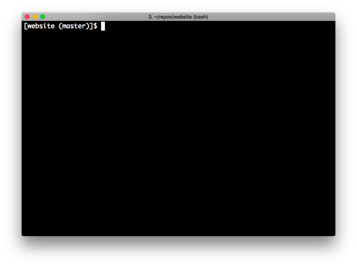

Figure 5: The Git prompt with the branch name.

#### [Exercises](http://www.learnenough.com/git-tutorial#sec-exercises_initializing_the_repo)

1. Run the command to list all files and directories to determine the name of the hidden directory used by Git. *Hint*: See “[Listing](https://www.learnenough.com/command-line-tutorial#sec-listing)” in [*Learn Enough™ Command Line to Be Dangerous*](http://learnenough.com/command-line-tutorial).
2. Using the result of the previous exercise, guess the name of the main configuration file located in the hidden Git directory. Use `cat` to dump its contents to the screen.

### [Our first commit](http://www.learnenough.com/git-tutorial#sec-our_first_commit)

Git won’t let us complete the initialization of the repository while it’s empty, so we need to make a change to the current directory. We’ll make a more substantive change in a moment, but for now we’ll follow a common convention and simply use `touch` to create an empty file (as [mentioned](https://www.learnenough.com/command-line-tutorial#code-ls_no_such) in [*Learn Enough™ Command Line to Be Dangerous*](http://learnenough.com/command-line-tutorial)). In this case, we’re making a simple website, and the [near-universal convention](https://en.wikipedia.org/wiki/Webserver_directory_index) is to call the main page `index.html`:

```
[website (master)]$ touch index.html
```

Having created this first file, we can use the `git status` command to see the result:

```
[website (master)]$ git status
On branch master

Initial commit

Untracked files:
  (use "git add <file>..." to include in what will be committed)

  index.html

nothing added to commit but untracked files present (use "git add" to track)
```

We see here that the `index.html` file is “untracked”, which means Git doesn’t yet know about it. We can *add* it using the `git add` command:

```
[website (master)]$ git add -A
```

Here the `-A` option tells Git to add *all* untracked files, even though in this case there’s only one. In my experience, 99% of the time you add files you’ll want to add them all, so this is a good habit to cultivate, and learning how to add individual files is left as an exercise ([Section 1.3.1](http://www.learnenough.com/git-tutorial#sec-exercises_our_first_commit)). (By the way, the equivalent command `git add .`, where the dot refers to the [current directory](https://www.learnenough.com/command-line-tutorial#sec-navigating_directories), is also common.)

We can see the result of `git add -A` by running `git status` again:

```
[website (master)]$ git status
On branch master

Initial commit

Changes to be committed:
  (use "git rm --cached <file>..." to unstage)

  new file:   index.html
```

As implied by the word “unstage”, the status of the file has been promoted from *untracked* to *staged*, which means the file is ready to be added to the repository. *Untracked/unstaged* and *staged* are two of the four states commonly used by Git, as shown in [Figure](http://www.learnenough.com/git-tutorial#fig-git_status_sequence).

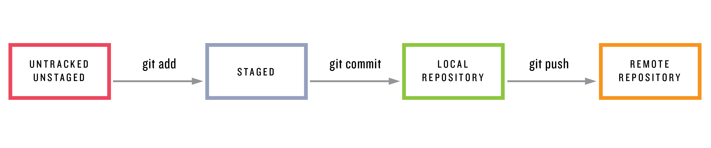

Figure 6: The main Git status sequence for a changing file.

As shown in [Figure](http://www.learnenough.com/git-tutorial#fig-git_status_sequence), after putting changes in the staging area we can make them part of the local repository by *committing* them using `git commit`. (We’ll cover the final step from [Figure](http://www.learnenough.com/git-tutorial#fig-git_status_sequence), `git push`, in [Section](http://www.learnenough.com/git-tutorial#sec-adding_a_readme).) Most uses of `git commit` use the command-line option `-m` to include a *message* indicating the purpose of the commit ([Box](http://www.learnenough.com/git-tutorial#aside-commit_messages)). In this case, the purpose is to initialize the new repository, which we can indicate as follows:

```
[website (master)]$ git commit -m "Initialize repository"
[master (root-commit) 879392a] Initialize repository
 1 file changed, 0 insertions(+), 0 deletions(-)
 create mode 100644 index.html
```

(I’ve shown my output here for completeness, but your details will vary.)

Box 4.
Committing to Git

By design, Git requires every commit to include a *commit message* describing the purpose of the commit. Typically, this takes the form of a single line, usually limited to around 72 characters, with an optional longer message if desired ([Section 4.2.3](http://www.learnenough.com/git-tutorial#sec-exercises_merge_conflicts)). Although conventions for commit messages vary ([Figure](http://www.learnenough.com/git-tutorial#fig-xkcd_git_commit)),[9](http://www.learnenough.com/git-tutorial#cha-0_footnote-9) the style adopted in this tutorial is to write commit messages in the *present tense* using the [*imperative mood*](http://en.wikipedia.org/wiki/Imperative_mood), as in “Initialize repository” rather than “Initializes repository” or “Initialized repository”. The reason for this convention is that Git models commits as a series of text transformations, and in this context it makes sense to describe what each commit *does* instead of what it did. Moreover, this usage agrees with the convention followed by the commit messages generated by Git commands themselves (e.g., “merge” rather than “merges” or “merged”). For more information, see the GitHub article “[Shiny new commit styles](https://github.com/blog/926-shiny-new-commit-styles)”.

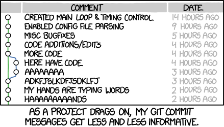

Figure 7: “[Git Commit](https://m.xkcd.com/1296/)” via [xkcd](http://xkcd.com/).

At this point, we can use `git log` to see a record of our commit:

```
[website (master)]$ git log
commit 879392a6bd8dd505f21876869de99d73f40299cc
Author: Michael Hartl <michael@michaelhartl.com>
Date:   Thu Dec 17 20:00:34 2015 -0800

    Initialize repository
```

The commit is identified by a *hash*, which is a unique string of letters and numbers that lets Git retrieve the changes made in the commit. In my case, the hash appears as

```
879392a6bd8dd505f21876869de99d73f40299cc
```

but since each hash is unique your result will differ. The hash is often referred to as a “SHA” (pronounced *shah*) because of the acronym for the [Secure Hash Algorithm](https://en.wikipedia.org/wiki/SHA-1) used to generate it. We’ll put these SHAs to use in [Section](http://www.learnenough.com/git-tutorial#sec-recovering_from_errors), and several more advanced Git operations require them as well.

#### [Exercises](http://www.learnenough.com/git-tutorial#sec-exercises_our_first_commit)

1. Using the `touch` command, create empty files called `foo` and `bar` in your repository directory.
2. By using `git add foo`, add `foo` to the staging area. Confirm with `git status` that it worked.
3. Using `git commit -m` and an appropriate message, add `foo` to the repository.
4. By using `git add bar`, add `bar` to staging area. Confirm with `git status` that it worked.
5. Now run `git commit` *without* the `-m` option. Use your [Vim knowledge](http://www.learnenough.com/text-editor-tutorial#sec-vim) to add the message “Add bar”, save, and quit.
6. Using `git log`, confirm that the commits made in the previous exercises worked correctly.

### [Viewing the diff](http://www.learnenough.com/git-tutorial#sec-viewing_the_diff)

It’s often useful to be able to view the changes represented by a potential commit before making it. To see how this works, let’s add a little bit of content to `index.html` by [redirecting the output](https://www.learnenough.com/command-line-tutorial#sec-redirecting_and_appending) of `echo` to make a “hello, world” page:

```
[website (master)]$ echo "hello, world" > index.html
```

[Recall](https://www.learnenough.com/command-line-tutorial#sec-redirecting_and_appending) from [*Learn Enough™ Command Line to Be Dangerous*](http://learnenough.com/command-line-tutorial) that the Unix `diff` utility lets us compare two files `foo` and `bar` by typing

```
[website (master)]$ diff foo bar
```

Git has a similar function, `git diff`, which by default just shows the difference between the last commit and unstaged changes in the current project:

```
[website (master)]$ git diff
diff --git a/index.html b/index.html
index e69de29..4b5fa63 100644
--- a/index.html
+++ b/index.html
@@ -0,0 +1 @@
+hello, world
```

Because the content added in [Section](http://www.learnenough.com/git-tutorial#sec-our_first_commit) was empty, here the diff appears simply as an addition:

```
+hello, world
```

We can commit this change by passing the `-a` option (for “all”) to `git commit`, which arranges to commit all the changes in currently existing files ([Listing](http://www.learnenough.com/git-tutorial#code-git_commit_a_m)).

Listing 4:
Committing changes to all modified files.

```
[website (master)]$ git commit -a -m "Add content to index.html"
[master 03aff34] Add content to index.html
 1 file changed, 1 insertion(+)
```

Note that the `-a` option includes changes only to files already added to the repository, so when there are new files it’s important to run `git add -A` as in [Section](http://www.learnenough.com/git-tutorial#sec-our_first_commit) to make sure they’re added properly. It’s easy to get in the habit of running `git commit -a` and forget to add new files explicitly; learning how to deal with this situation is left as an exercise ([Section 1.4.1](http://www.learnenough.com/git-tutorial#sec-exercises_viewing_the_diff)).

Having added and committed the changes, there’s now no diff:

```
[website (master)]$ git diff
[website (master)]$
```

(In fact, simply adding the changes is sufficient; running `git add -A` would also lead to there being no diff.) We can confirm that the change went through by running `git log`:

```
[website (master)]$ git log
commit 03aff34ec4f9690228e057a4252bcca169a868b4
Author: Michael Hartl <michael@michaelhartl.com>
Date:   Thu Dec 17 20:03:33 2015 -0800

    Add content to index.html

commit 879392a6bd8dd505f21876869de99d73f40299cc
Author: Michael Hartl <michael@michaelhartl.com>
Date:   Thu Dec 17 20:00:34 2015 -0800

    Initialize repository
```

#### [Exercises](http://www.learnenough.com/git-tutorial#sec-exercises_viewing_the_diff)

1. Use `touch` to create an empty file called `baz`. What happens if you run `git commit -am "Add baz"`?
2. Add `baz` to the staging area using `git add -A`, then commit with the message `"Add bazz"`.
3. Realizing there’s a typo in your commit message, change `bazz` to `baz` using `git commit --amend`.
4. Run `git log` to get the SHA of the last commit, then view the diff using `git show <SHA>` to verify that the message was amended properly.

### [Adding an HTML tag](http://www.learnenough.com/git-tutorial#sec-adding_a_tag)

We’ve now seen all of the major elements involved in the simplest Git workflow, so in this section and the next we’ll review what we’ve done and see how everything fits together. We’ll err on the side of making more frequent commits, representing relatively modest changes, but this isn’t necessarily how you should work in real life ([Box](http://www.learnenough.com/git-tutorial#aside-commitment_issues)). Still, it’s an excellent foundation, and it will give you a solid base on which to build your own workflow and development practices.

Box 5.
Commitment issues

One common issue when learning Git involves figuring out when to make a commit. Unfortunately, there’s no simple answer, and real-life usage varies considerably ([Figure](http://www.learnenough.com/git-tutorial#fig-xkcd_git_commit)). My best advice is to make a commit whenever you’ve reached a natural stopping point, or when you’ve made enough changes that you’re starting to worry about losing them. In practice, this can lead to inconsistent results, and it’s common to work for a while and make a large commit and then make a minor unrelated change with a small commit. This mismatch between commit sizes can seem a little weird, but it’s a difficult situation to avoid.

Many teams (including most open-source projects) have their own conventions for commits, including the practice of *squashing* commits to combine them all into one commit for convenience. (Per [Box](http://www.learnenough.com/git-tutorial#aside-technical_sophistication), this is exactly the kind of thing you can learn about by [Googling for it](http://lmgtfy.com/?q=git+squash+commits).) In these circumstances, I recommend following the conventions adopted by the project in question.

More than anything, don’t worry about it too much. [Figure](http://www.learnenough.com/git-tutorial#fig-xkcd_git_commit) is a only a slight exaggeration, and in any case deciding when to commit is the kind of thing that you’ll invariably get better at with time and experience.

As in previous sections, we’ll be working on the main `index.html` file. Let’s start by opening this file in both a text editor and in a web browser. My preferred method for doing this is at the command line using the `atom` and `open` commands (though the latter works only on Macintosh OS X):

```
[website (master)]$ atom index.html
[website (master)]$ open index.html
```

If you’re not on a Mac (or even if you are), you can open the directory using a graphical file browser and double-clicking the file to open it in the default browser ([Figure](http://www.learnenough.com/git-tutorial#fig-index_filesystem_browser)). However you open the file, the results should appear approximately as shown in [Figure](http://www.learnenough.com/git-tutorial#fig-hello_world_atom) and [Figure](http://www.learnenough.com/git-tutorial#fig-hello_world_browser).

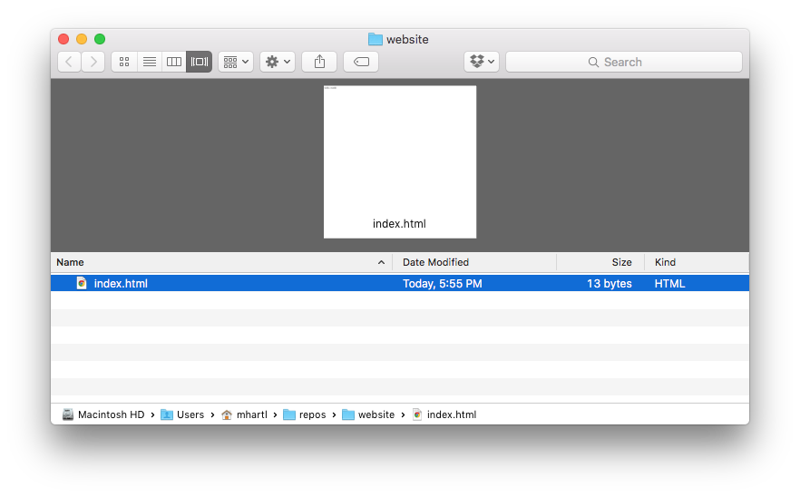

Figure 8: Viewing `index.html` in a filesystem browser.

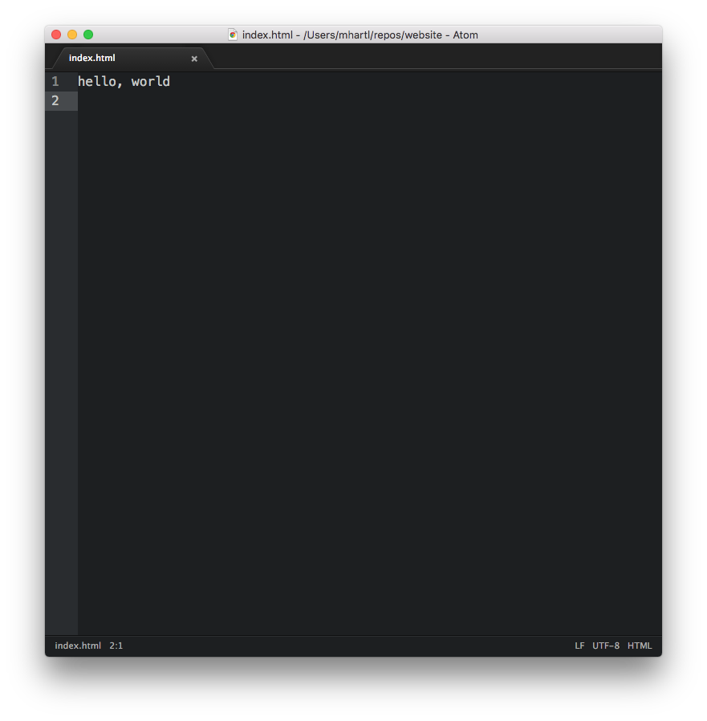

Figure 9: The initial HTML file opened in Atom.

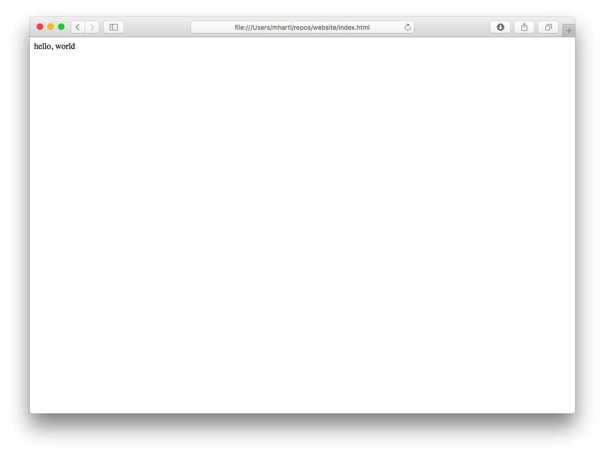

Figure 10: The initial HTML file viewed in a web browser.

At this point, we’re ready to make a change, which is to promote “hello, world” from ordinary text to a top-level (Level 1) heading. In HTML, the language of the World Wide Web, the way to do this is with a *tag*—in this case, the Level 1 header tag `h1`. Most browsers set `h1` tags in a large font, so the text `hello, world` should look bigger when we’re done. To make the change, replace the current contents of `index.html` with the contents shown in [Listing](http://www.learnenough.com/git-tutorial#code-hello_world_h1). (In this and all other examples of editing text, you’ll learn more if you type in everything by hand instead of copying and pasting.)

Listing 5:
A top-level heading.

```
<h1>hello, world</h1>
```

[Listing](http://www.learnenough.com/git-tutorial#code-hello_world_h1) shows the basic structure used by most HTML tags. First, there’s an *opening tag* that looks like `<h1>`, where the angle brackets `<` and `>` surround the tag name (in this case, `h1`). After the content, there’s a *closing tag* that’s the same as the opening tag, except with an extra slash after the opening angle bracket: `</h1>`. (Note that, as with addresses on the World Wide Web, this is a *slash*, not a *backslash* ([Figure](http://www.learnenough.com/git-tutorial#fig-xkcd_slash)).[10](http://www.learnenough.com/git-tutorial#cha-0_footnote-10))

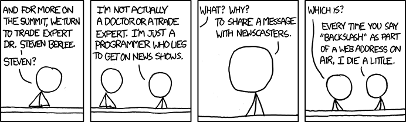

Figure 11: “[Trade expert](https://m.xkcd.com/727/)” opines on *slash* vs. *backslash*.

Upon refreshing the web browser, the index page should appear something like [Figure](http://www.learnenough.com/git-tutorial#fig-hello_world_h1). As promised, the font size of the text for the top-level heading is bigger (and bolder, too).

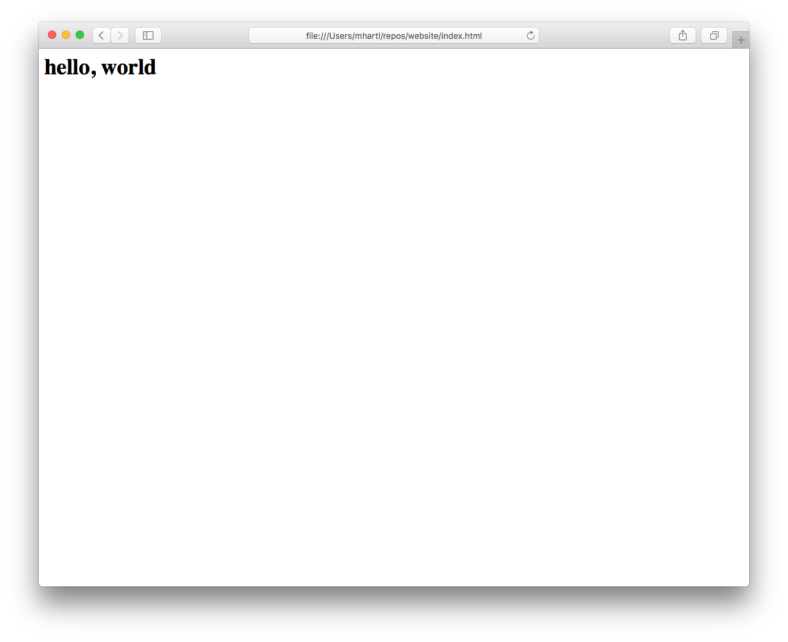

Figure 12: The result of adding an `h1` tag.

As before, we’ll run `git status` and `git diff` to learn more about what we’re going to commit to Git, though with experience you’ll come to run these commands only when necessary. The status simply indicates that `index.html` has been modified:

```
[website (master)]$ git status
On branch master
Changes not staged for commit:
  (use "git add <file>..." to update what will be committed)
  (use "git checkout -- <file>..." to discard changes in working directory)

  modified:   index.html

no changes added to commit (use "git add" and/or "git commit -a")
```

Meanwhile, the diff shows that one line has been deleted (indicated with `-`) and another added (indicated with `+`):

```
[website (master)]$ git diff
diff --git a/index.html b/index.html
index 4b5fa63..45d754a 100644
--- a/index.html
+++ b/index.html
@@ -1 +1 @@
-hello, world
+<h1>hello, world</h1>
```

As with the Unix `diff` utility, modified sections of code or markup are shown as close to each other as possible so that it’s clear at a glance what changed.

At this point, we’re ready to commit our changes. In [Listing](http://www.learnenough.com/git-tutorial#code-git_commit_a_m) we used both the `-a` and `-m` options to commit **a**ll pending changes while adding a commit **m**essage, but in fact the two can be combined as `-am` ([Listing](http://www.learnenough.com/git-tutorial#code-git_commit_am)).

Listing 6:
Committing with `-am`.

```
[website (master)]$ git commit -am "Add an h1 tag"
```

Using the `-am` combination as in [Listing](http://www.learnenough.com/git-tutorial#code-git_commit_am) is common in idiomatic Git usage.

#### [Exercises](http://www.learnenough.com/git-tutorial#sec-exercises_adding_a_tag)

1. The `git log` command shows only the commit messages, which makes for a compact display but isn’t particularly detailed. Verify by running `git log -p` that the `-p` option shows the full diffs represented by each commit.
2. Under the `h1` tag in [Listing](http://www.learnenough.com/git-tutorial#code-hello_world_h1), use the `p` tag to add a *paragraph* consisting of the line “Call me Ishmael.” The result should appear as in [Figure](http://www.learnenough.com/git-tutorial#fig-ishmael_paragraph). (Don’t worry if you get stuck; we’ll incorporate the answer to this exercise in [Section](http://www.learnenough.com/git-tutorial#sec-adding_html_structure) ([Listing](http://www.learnenough.com/git-tutorial#code-html_structure)).)

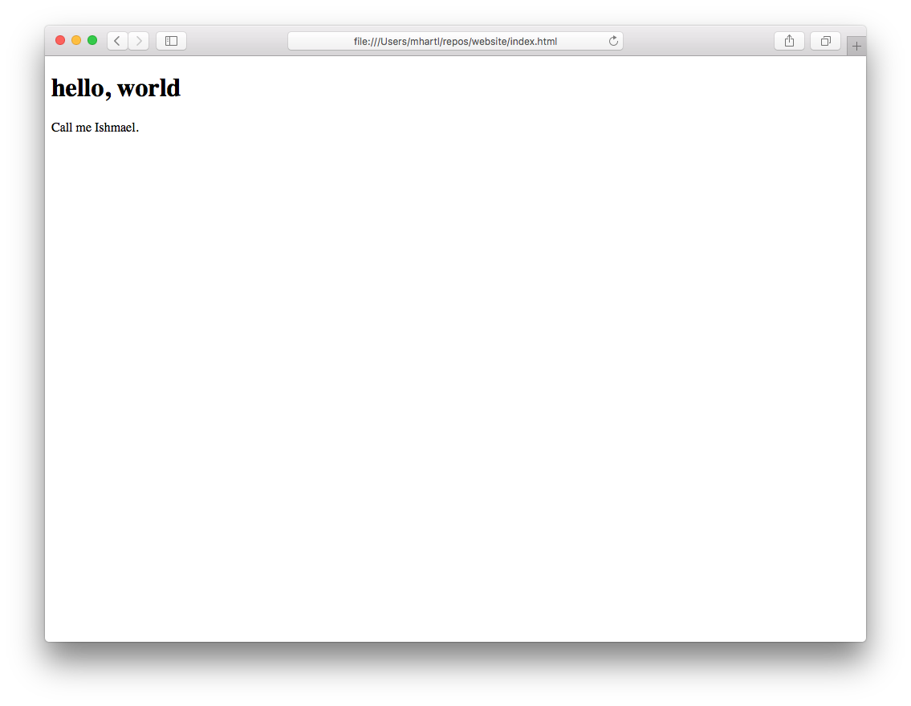

Figure 13: The result of adding a short paragraph.

### [Adding HTML structure](http://www.learnenough.com/git-tutorial#sec-adding_html_structure)

Although the web browser correctly rendered the `h1` tag in [Figure](http://www.learnenough.com/git-tutorial#fig-hello_world_h1), properly formatted HTML pages have more structure than just bare `h1` or `p` tags. In particular, each page should have an `html` tag consisting of a *head* and a *body* (identified with `head` and `body` tags, respectively), as well as a “doctype” identifying the document type, which in this case is a particular version of HTML called HTML5. (Don’t worry about these details now; we’ll cover them in more depth in [*Learn Enough™ HTML to Be Dangerous*](http://learnenough.com/html-tutorial).)

Applying these general considerations to `index.html` leads to the full HTML structure shown in [Listing](http://www.learnenough.com/git-tutorial#code-html_structure). This includes the `h1` tag from [Listing](http://www.learnenough.com/git-tutorial#code-hello_world_h1) and the paragraph tag from [Figure](http://www.learnenough.com/git-tutorial#fig-ishmael_paragraph). (The `title` tag, included inside the `head` tag, is empty, but in general every page should have a title, and adding one for `index.html` is left as an exercise ([Section 1.6.1](http://www.learnenough.com/git-tutorial#sec-exercises_adding_html_structure)).)

Listing 7:
The HTML page with added structure.

```
 <!DOCTYPE html>
 <html>
   <head>
     <title></title>
   </head>
   <body>
     <h1>hello, world</h1>
     <p>Call me Ishmael.</p>
   </body>
 </html>
```

Because this is a lot more content than our previous iteration ([Listing](http://www.learnenough.com/git-tutorial#code-hello_world_h1)), it’s a good idea to go through it line by line:

1. The document type declaration
2. Opening `html` tag
3. Opening `head` tag
4. Opening and closing `title` tags
5. Closing `head` tag
6. Opening `body` tag
7. Top-level heading
8. Paragraph from the exercises ([Section 1.5.1](http://www.learnenough.com/git-tutorial#sec-exercises_adding_a_tag))
9. Closing `body` tag
10. Closing `html` tag

As usual, we can see the changes represented by our addition using `git diff` ([Listing](http://www.learnenough.com/git-tutorial#code-diff_html_structure)).

Listing 8:
The diff for adding HTML structure.

```
[website (master)]$ git diff
diff --git a/index.html b/index.html
index 4b5fa63..afcd202 100644
--- a/index.html
+++ b/index.html
@@ -1 +1,10 @@
-<h1>hello, world</h1>
+<!DOCTYPE html>
+<html>
+  <head>
+    <title></title>
+  </head>
+  <body>
+    <h1>hello, world</h1>
+    <p>Call me Ishmael.</p>
+  </body>
+</html>
```

Despite the extensive diffs in [Listing](http://www.learnenough.com/git-tutorial#code-diff_html_structure), there are hardly any user-visible differences ([Figure](http://www.learnenough.com/git-tutorial#fig-html_structure)); the only change from [Figure](http://www.learnenough.com/git-tutorial#fig-ishmael_paragraph) is a small amount of space above the top-level heading. The structure is much better, though, and brings our page nearly into compliance with the HTML5 standard. (It’s not quite valid because a nonblank page title is required, which we’ll fix in [Section 1.6.1](http://www.learnenough.com/git-tutorial#sec-exercises_adding_html_structure).)

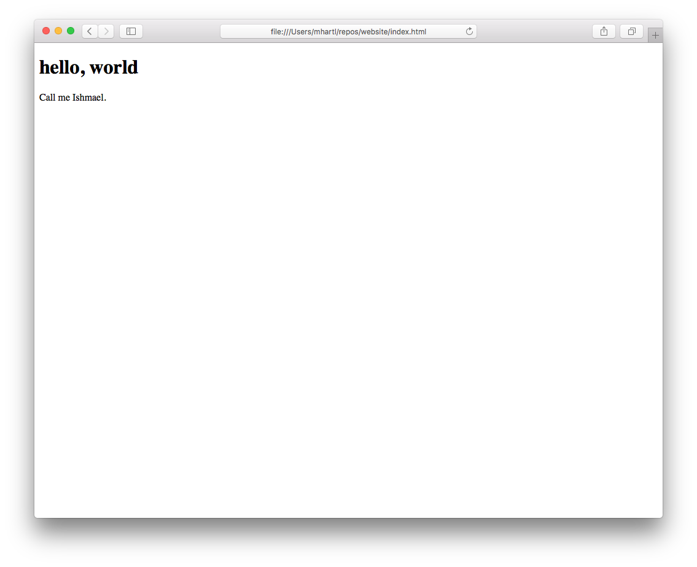

Figure 14: Adding HTML structure makes hardly any difference in the appearance.

Since we haven’t added any files, using `git commit -am` suffices to commit all the changes ([Listing](http://www.learnenough.com/git-tutorial#code-commit_html_structure)).

Listing 9:
The commit to add the HTML structure.

```
[website (master)]$ git commit -am "Add some HTML structure"
```

#### [Exercises](http://www.learnenough.com/git-tutorial#sec-exercises_adding_html_structure)

1. Add the title “A whale of a greeting” to `index.html`. Browsers differ in how they display titles; the result in Google Chrome is shown in [Figure](http://www.learnenough.com/git-tutorial#fig-page_title).
2. Commit the new title with a commit message of your choice. Verify using `git log -p` that the change was committed as expected.
3. By pasting the contents of [Listing](http://www.learnenough.com/git-tutorial#code-html_structure) into an [HTML validator](https://validator.w3.org/#validate_by_input), verify that it is *not* (quite) a valid web page.
4. Using the validator, verify that the current `index.html` (with nonblank page title) *is* valid.

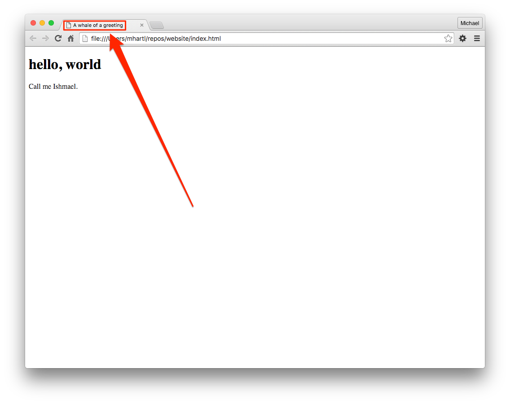

Figure 15: The page title displayed in a browser.

### [Summary](http://www.learnenough.com/git-tutorial#sec-summary_getting_started)

Important commands from this section are summarized in [Table](http://www.learnenough.com/git-tutorial#table-getting_started).

|  |  |  |
| --- | --- | --- |
| **Command** | **Description** | **Example** |
| git help | Get help on a command | `$ git help push` |
| git config | Configure Git | `$ git config --global …` |
| source <file> | Activate Bash changes | `$ source ~/.bash_profile` |
| mkdir -p | Make intermediate directories as necessary | `$ mkdir -p repos/website` |
| git status | Show the status of the repository | `$ git status` |
| touch <name> | Create empty file | `$ touch foo` |
| git add -A | Add all files or directories to staging area | `$ git add -A` |
| git add <name> | Add given file or directory to staging area | `$ git add foo` |
| git commit -m | Commit staged changes with a message | `$ git commit -m "Add thing"` |
| git commit -am | Stage and commit changes with a message | `$ git commit -am "Add thing"` |
| git diff | Show diffs between commits, branches, etc. | `$ git diff` |
| git commit --amend | Amend the last commit | `$ git commit --amend` |
| git show <SHA> | Show diff vs. the SHA | `$ git show fb738e…` |

Table 1: Important commands from [Section](http://www.learnenough.com/git-tutorial#sec-getting_started).

## [Backing up and sharing](http://www.learnenough.com/git-tutorial#sec-sharing)

With the changes made in [Section](http://www.learnenough.com/git-tutorial#sec-getting_started), we’re now ready to push a copy of our project to a *remote repository*. This will serve as a backup of our project and its history, and will also make it easier for collaborators to work with us on our site.

We’ll start by pushing our project up to *GitHub*, a site designed to facilitate collaboration with Git repositories. For repositories that are publicly available, GitHub is free, so we’ll plan to make our website’s repo public to take advantage of this. (GitHub charges for private repositories, but we’ll discuss an alternative in [Section 4.4.1](http://www.learnenough.com/git-tutorial#sec-exercises_surprise_bonus).) Over time, releasing projects publicly on GitHub serves to build up a portfolio, which is one good reason to make as much work public as possible. There’s also a Secret Reason™ for adding our repo to GitHub, which we’ll get to in [Section](http://www.learnenough.com/git-tutorial#sec-a_surprise_bonus).

For reference, important commands from this section are summarized in [Table](http://www.learnenough.com/git-tutorial#table-sharing).

### [Signing up for GitHub](http://www.learnenough.com/git-tutorial#sec-github)

If you don’t already have a GitHub account, you can get started by visiting the [GitHub signup page](https://github.com/join) ([Figure](http://www.learnenough.com/git-tutorial#fig-join_github)) and following the instructions. Use your technical sophistication ([Box](http://www.learnenough.com/git-tutorial#aside-technical_sophistication)) if you get stuck.

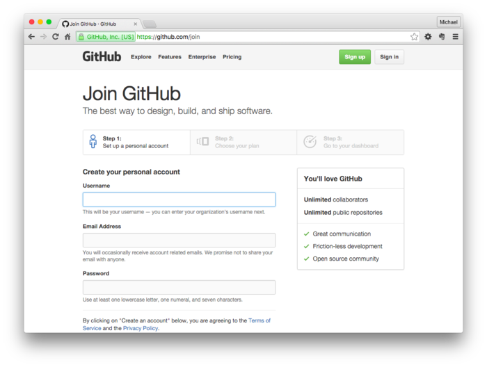

Figure 16: Joining GitHub.

Once you’ve signed up for GitHub, you’ll need to add *SSH keys* to your account, which serve as a way to identify trusted computers without requiring passwords.[11](http://www.learnenough.com/git-tutorial#cha-0_footnote-11) To do this, follow the steps in the GitHub article “[Generating SSH Keys](https://help.github.com/articles/generating-ssh-keys/)” ([Figure](http://www.learnenough.com/git-tutorial#fig-generating_ssh_keys)). This is a good application of the command-line knowledge from [*Learn Enough™ Command Line to Be Dangerous*](http://learnenough.com/command-line-tutorial), and is an *excellent* exercise in technical sophistication. In particular, following the GitHub tutorial on generating SSH keys will help you develop an essential technical skill:

> It’s important to able to follow a series of commands *even if you don’t completely understand them*.

Even *I* don’t completely understand the commands at “[Generating SSH Keys](https://help.github.com/articles/generating-ssh-keys/)”, and that’s OK. All you need is enough technical sophistication to follow the steps (and resolve any errors that occur) even if you’re not 100% sure of what you’re doing ([Figure](http://www.learnenough.com/git-tutorial#fig-no_idea)).

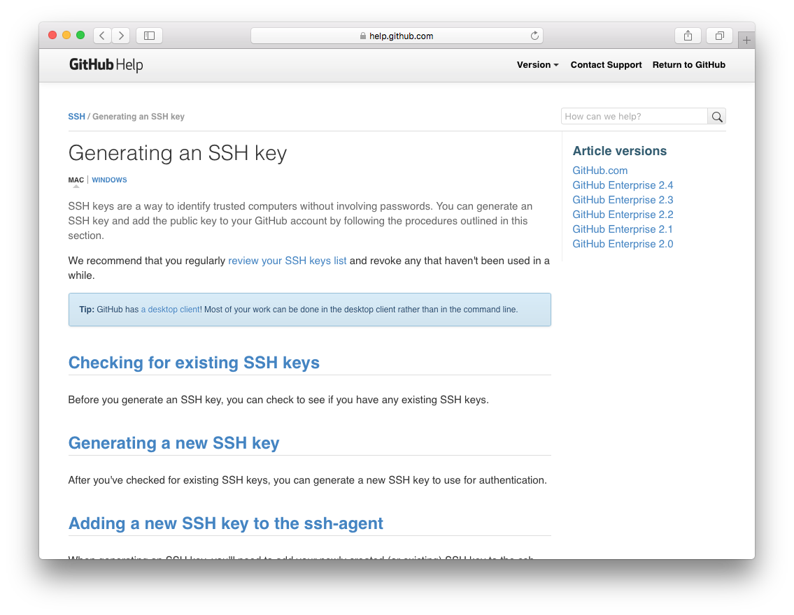

Figure 17: The GitHub tutorial on generating SSH keys.

One neat thing about the GitHub SSH keys tutorial is that it detects the system you’re on and customizes the tutorial accordingly. For example, on my system (Macintosh OS X), the SSH tutorial includes the step

```
$ pbcopy < ~/.ssh/id_rsa.pub
# Copies the contents of the id_rsa.pub file to your clipboard
```

which works only on a Mac. This customization is fine for most situations, but sometimes it will fail. For example, if you are on a Macintosh or Windows computer but are using the Linux virtual machine from [Box](http://www.learnenough.com/git-tutorial#aside-using_unix), you need the instructions for Linux, not for your native OS. In that case, either use a browser on the system for which you need instructions or look for menu items with links to the right platform ([Figure](http://www.learnenough.com/git-tutorial#fig-github_ssh_menu)).

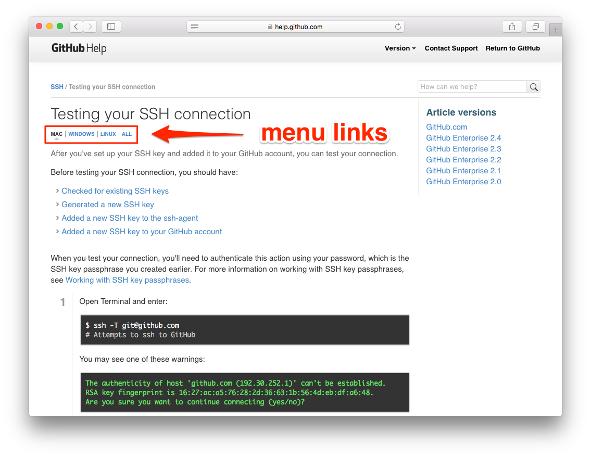

Figure 18: Menu links for the SSH tutorial on different systems.

#### [Exercises](http://www.learnenough.com/git-tutorial#sec-exercises_github)

1. Read the [SSH article on Wikipedia](https://en.wikipedia.org/wiki/Secure_Shell) until you finish it or run out of motivation to continue.

### [Remote repo](http://www.learnenough.com/git-tutorial#sec-remote_repo)

After signing up for a GitHub account, the next step is to create a remote repository. Start by selecting the menu item for adding a new repository, as shown in [Figure](http://www.learnenough.com/git-tutorial#fig-add_new_repository), and then fill in the repository name (“website”) and description (“A sample website for Learn Enough Git to Be Dangerous”) as shown in [Figure](http://www.learnenough.com/git-tutorial#fig-create_a_new_repository). GitHub actively develops its user interface, so [Figure](http://www.learnenough.com/git-tutorial#fig-add_new_repository), [Figure](http://www.learnenough.com/git-tutorial#fig-create_a_new_repository), and other GitHub screenshots may not match your results exactly, but this is no cause for concern. As usual, apply your technical sophistication ([Box](http://www.learnenough.com/git-tutorial#aside-technical_sophistication)) to resolve any discrepancies.

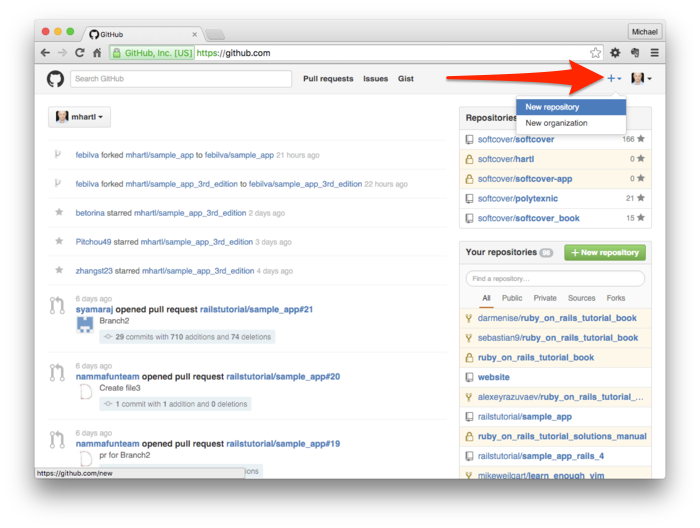

Figure 19: Adding a new repository at GitHub.

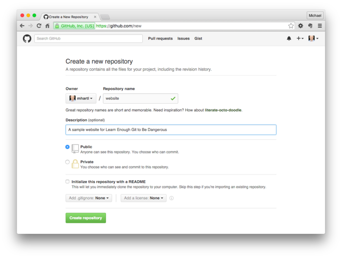

Figure 20: Creating a new repository.

After clicking the green “Create repository” button seen in [Figure](http://www.learnenough.com/git-tutorial#fig-create_a_new_repository), you should see a page like [Figure](http://www.learnenough.com/git-tutorial#fig-pushing_up_repo) containing instructions for how to *push* your local repository up to GitHub. The exact commands will be tailored to your personal account name; the template looks like [Listing](http://www.learnenough.com/git-tutorial#code-github_push_template).

Listing 10:
A template for the first push to GitHub.

```
[website (master)]$ git remote add origin https://github.com/<username>/website.git
[website (master)]$ git push -u origin master
```

Of course, you should replace `<username>` with your actual username. For example, the commands for my username, which is `mhartl`, look like this (which you can also see in [Figure](http://www.learnenough.com/git-tutorial#fig-pushing_up_repo)):

```
[website (master)]$ git remote add origin https://github.com/mhartl/website.git
[website (master)]$ git push -u origin master
```

The two commands in [Listing](http://www.learnenough.com/git-tutorial#code-github_push_template) first set GitHub as the *remote origin* and then *push* the full repository. The `-u` option to `git push` sets GitHub as the *upstream repository*, which means we’ll be able to download any changes automatically when we run `git pull` starting in [Section](http://www.learnenough.com/git-tutorial#sec-clone_push_pull). Don’t worry too much about these details, though; you will almost always copy such commands from GitHub and probably won’t ever have to figure them out on your own.

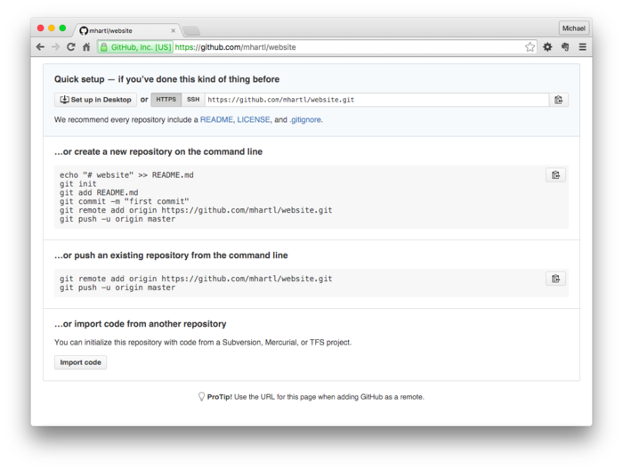

Figure 21: Instructions for pushing up the repo.

After executing the first `git push` as shown in [Listing](http://www.learnenough.com/git-tutorial#code-github_push_template), you should reload the current page (using, e.g., ⌘R or the icon shown in [Figure](http://www.learnenough.com/git-tutorial#fig-reload_page)). The result should look something like [Figure](http://www.learnenough.com/git-tutorial#fig-remote_repo). If it does, you have officially shipped your first Git repository!

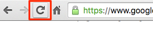

Figure 22: The browser reload page button.

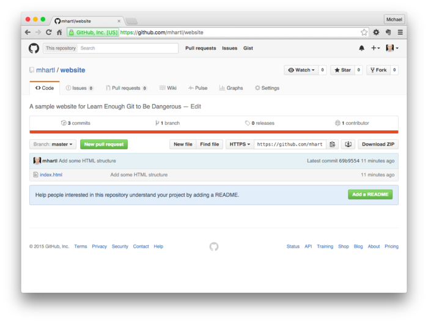

Figure 23: The remote repository at GitHub.

#### [Exercises](http://www.learnenough.com/git-tutorial#sec-exercises_remote_repo)

1. On the GitHub page for your repo, click on “Commits” to see a list of your commits. Confirm that they match the results of running `git log` on your local system.
2. At GitHub, click on the commit for adding HTML structure ([Listing](http://www.learnenough.com/git-tutorial#code-commit_html_structure)). Verify that the diff for the commit agrees with the one shown in [Listing](http://www.learnenough.com/git-tutorial#code-diff_html_structure).
3. In honor of shipping your first Git repo, drink a celebratory beverage of your choice ([Figure](http://www.learnenough.com/git-tutorial#fig-champagne)).[12](http://www.learnenough.com/git-tutorial#cha-0_footnote-12)


Figure 24: Shipping a project often calls for a celebratory beverage.

### [Adding a README](http://www.learnenough.com/git-tutorial#sec-adding_a_readme)

Now that we’ve pushed up our repository, let’s add a second file and practice the `add`, `commit`, and `push` sequence shown in [Figure](http://www.learnenough.com/git-tutorial#fig-git_status_sequence). You may have noticed in [Figure](http://www.learnenough.com/git-tutorial#fig-remote_repo) that GitHub encourages the presence of a README file via the note “Help people interested in this repository understand your project by adding a README.” Such a file literally asks the viewer to “READ ME”, *à la* the DRINK ME bottle from [*Alice’s Adventures in Wonderland*](https://www.cs.indiana.edu/metastuff/wonder/ch1.html) ([Figure](http://www.learnenough.com/git-tutorial#fig-drink_me)),[13](http://www.learnenough.com/git-tutorial#cha-0_footnote-13) and it’s a good practice to include one.

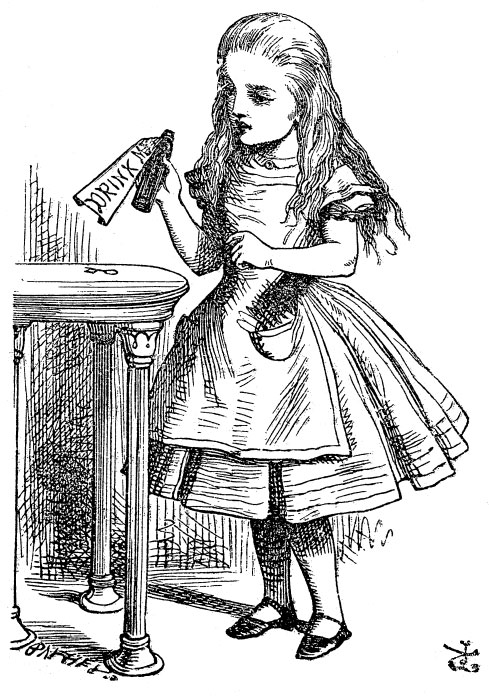

Figure 25: Alice would know to read a README file.

[Figure](http://www.learnenough.com/git-tutorial#fig-remote_repo) shows a green `Add a README` button that GitHub includes to make it easy to add a README file through the web interface, but we’ll follow the common (and more instructive) practice of adding it by hand locally and then pushing it up. When it comes to rendering and displaying READMEs, GitHub supports several common formats, but my favorite format for short documents like READMEs is Markdown, a lightweight markup language [discussed before](http://www.learnenough.com/text-editor-tutorial#sec-opening) in [*Learn Enough™ Text Editor to Be Dangerous*](http://learnenough.com/text-editor-tutorial).

We can get started by opening `README.md` in Atom (or any other text editor), where the `.md` extension identifies the file as Markdown:

```
[website (master)]$ atom README.md
```

We can then fill it with the content shown in [Listing](http://www.learnenough.com/git-tutorial#code-readme).

Listing 11:
The contents of the README file. ~/repos/website/README.md

```
# Sample Website

This is a sample website made as part of
[*Learn Enough™ Git to Be Dangerous*](http://learnenough.com/git-tutorial),
possibly the greatest beginner Git tutorial in the history of the Universe.
You should totally [check it out](http://learnenough.com/git-tutorial),
and be sure to [join the email list](http://learnenough.com/#email_list) and
[follow @learnenough](http://twitter.com/learnenough) on Twitter.

After finishing *Learn Enough™ Git to Be Dangerous*, I'll know enough Git to be
*dangerous*. This means I'll be able to use Git to track changes in my projects,
back up data, share my work with others, and collaborate with programmers and
other users of Git.
```

The result in Atom appears as shown in [Figure](http://www.learnenough.com/git-tutorial#fig-atom_readme). As [mentioned](http://www.learnenough.com/text-editor-tutorial#sec-previewing_markdown) in [*Learn Enough™ Text Editor to Be Dangerous*](http://learnenough.com/text-editor-tutorial), Atom includes a Markdown previewer via the Packages menu item shown in [Figure](http://www.learnenough.com/git-tutorial#fig-markdown_preview_menu), which (after resizing the window) results in the preview shown in [Figure](http://www.learnenough.com/git-tutorial#fig-atom_markdown_preview).[14](http://www.learnenough.com/git-tutorial#cha-0_footnote-14)

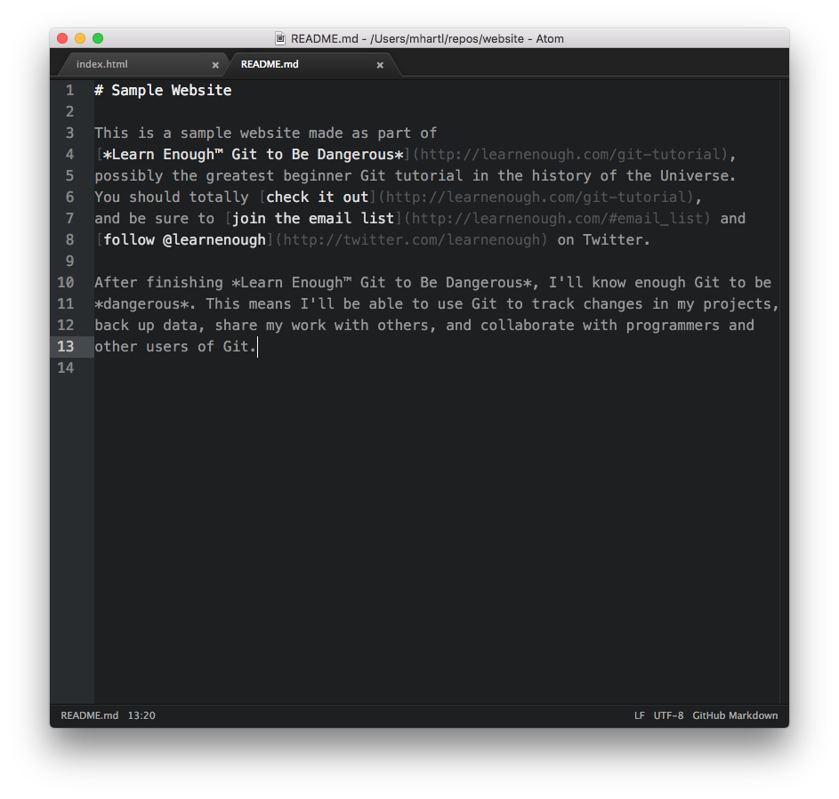

Figure 26: The README file viewed in Atom.

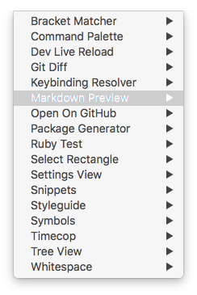

Figure 27: The Packages menu item for toggling the Markdown preview.

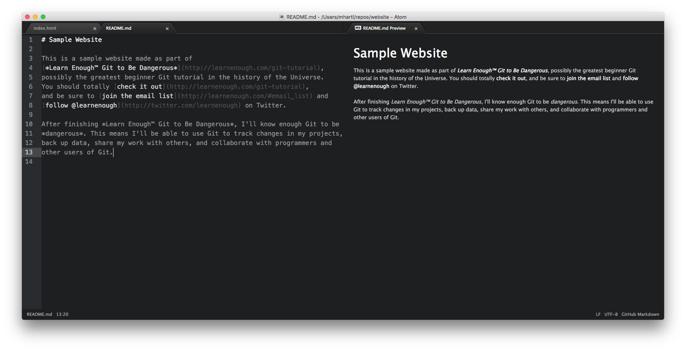

Figure 28: The resized Atom window with a Markdown preview.

Now that we’ve created the `README.md` file, we’re ready to add it to our Git repository and push it up. We can’t just run `git commit -am` because `README.md` isn’t currently in the repository, so we have to add it first:

```
[website (master)]$ git add -A
```

(As noted in [Section 1.3.1](http://www.learnenough.com/git-tutorial#sec-exercises_our_first_commit), we could also run `git add README.md`, but in most cases we want to add all the new files, so I suggest getting in the habit of running `git add -A` unless there’s a specific reason not to.) Then we commit as usual:

```
[website (master)]$ git commit -m "Add README file"
```

By the way, there’s no harm in including `-a` via the `-am` combination shown in [Listing](http://www.learnenough.com/git-tutorial#code-git_commit_am) (and despite the redundancy I often do so out of habit), so this could just as easily read `git commit -am "Add a README file"`. (The call to `git add` is still necessary, though; recall from [Section](http://www.learnenough.com/git-tutorial#sec-viewing_the_diff) that `git commit -a` by itself commits changes only to files that Git is already tracking and have been modified.)

Having added the file to the repository and made a commit, we’re now ready to push up to GitHub. Recall from [Listing](http://www.learnenough.com/git-tutorial#code-github_push_template) that the first occurrence of `git push` included the “set upstream” option `-u`, the destination `origin`, and the branch name `master`, but once these are set up we can omit all those details and just `push`, like this:

```
[website (master)]$ git push
```

The result of this is to push up the new README to the remote repository, which means that we’ve completed the full sequence shown in [Figure](http://www.learnenough.com/git-tutorial#fig-git_status_sequence). In this case, GitHub uses the `.md` extension to identify the file as Markdown, converting it to HTML for easy viewing,[15](http://www.learnenough.com/git-tutorial#cha-0_footnote-15) as shown in [Listing](http://www.learnenough.com/git-tutorial#code-readme).

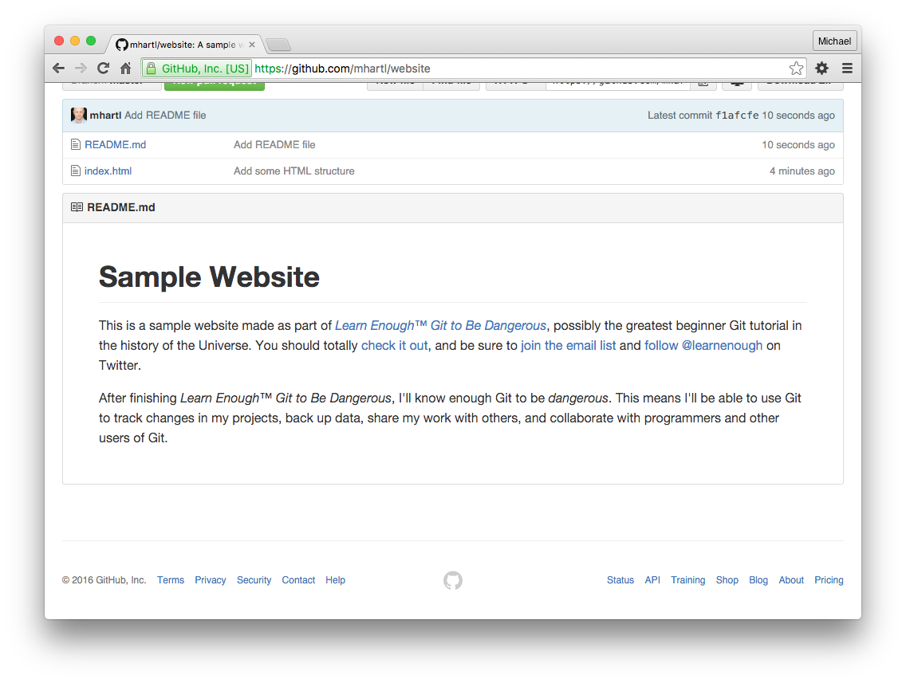

Figure 29: The README file at GitHub.

#### [Exercises](http://www.learnenough.com/git-tutorial#sec-exercises_adding_a_readme)

1. Using the Markdown shown in [Listing](http://www.learnenough.com/git-tutorial#code-official_git_documentation), add a line at the end of the README with a link to the official Git documentation.
2. Commit your change with an appropriate message ([Box](http://www.learnenough.com/git-tutorial#aside-commit_messages)). You don’t have to run `git add`. Why not?
3. Push your change to GitHub. By refreshing your browser, confirm that the new line has been added to the rendered README. Click on the “official Git documentation” link to verify that it works.

Listing 12:
Markdown code for adding a link to the official Git documentation. ~/repos/website/README.md

```
For more information on Git, see the
[official Git documentation](https://git-scm.com/).
```

### [Summary](http://www.learnenough.com/git-tutorial#sec-summary_sharing)

Important commands from this section are summarized in [Table](http://www.learnenough.com/git-tutorial#table-sharing).

|  |  |  |
| --- | --- | --- |
| **Command** | **Description** | **Example** |
| git remote add | Add remote repo | `$ git remote add origin` |
| git push -u <loc> <br> | Push to branch to remote | `$ git push -u origin master` |
| git push | Push to default remote | `$ git push` |

Table 2: Important commands from [Section](http://www.learnenough.com/git-tutorial#sec-sharing).

## [Intermediate workflow](http://www.learnenough.com/git-tutorial#sec-intermediate_workflow)

In this section, we’ll practice and extend the basic workflow introduced in [Section](http://www.learnenough.com/git-tutorial#sec-adding_a_readme). This will include adding a new directory to our project, learning how to tell Git to ignore certain files, how to *branch* and *merge*, and how to recover from errors. Rather than providing an encyclopedic coverage of Git’s many commands, our focus is on covering practical techniques used every day by software developers and other users of Git.

For reference, important commands from this section are summarized in [Table](http://www.learnenough.com/git-tutorial#table-intermediate_workflow).

### [Commit, push, repeat](http://www.learnenough.com/git-tutorial#sec-commit_push_repeat)

We’ll start by adding an image to our site, which involves making a change to an existing file (`index.html`) while adding a new file in a new directory. The first step is to make a directory for images:

```
[website (master)]$ mkdir images
```

Next, download the image shown in [Figure](http://www.learnenough.com/git-tutorial#fig-breaching_whale)[16](http://www.learnenough.com/git-tutorial#cha-0_footnote-16) to the local directory using `curl`:

```
$ curl -o images/breaching_whale.jpg \
>      -OL https://cdn.learnenough.com/breaching_whale.jpg
```

Note here that you should type the backslash character `\` in the first line, but you *shouldn’t* type the literal angle bracket `>` in the second line. The `\` is used for a *line continuation*, and after hitting return the `>` will be added automatically by your shell program.


Figure 30: An image to include in our website.

We’re now ready to include the image in our index page using the *image tag* `img`. This is a new kind of HTML tag; before we had opening and closing tags like

```
<p>content</p>
```

but the image tag is different. Unlike tags like `h1` and `p`, the `img` tag *self-closing*, which means that it starts with ``:

```

```

Note that `img` has no content between tags because there’s no “between”; instead, it has a path to the *source* of the image, indicated by `src`. By the way, in the example above the path `path/to/file` is *meta*, meaning that it talks *about* the path rather than referring to the literal path itself. In such cases, it’s important to use the actual path to the file. (Successfully navigating such meta usage is a good sign of increasing technical sophistication ([Box](http://www.learnenough.com/git-tutorial#aside-technical_sophistication)).) In this case, the path is `images/breaching_whale.jpg`, so the `img` tag in `index.html` should appear as shown in [Listing](http://www.learnenough.com/git-tutorial#code-img_tag). (This image tag is actually missing something important, which we’ll add in [Section](http://www.learnenough.com/git-tutorial#sec-merge_conflicts).)

Listing 13:
Adding an image to the index page. ~/repos/website/index.html

```
<!DOCTYPE html>
<html>
  <head>
    <title>A whale of a greeting</title>
  </head>
  <body>
    <h1>hello, world</h1>
    <p>Call me Ishmael.</p>
    
  </body>
</html>
```

Refreshing the browser then gives the result shown in [Figure](http://www.learnenough.com/git-tutorial#fig-website_with_image). (Note that [Listing](http://www.learnenough.com/git-tutorial#code-img_tag) includes the `title` tag content, thereby incorporating the solution to an exercise in [Section 1.6.1](http://www.learnenough.com/git-tutorial#sec-exercises_adding_html_structure).)

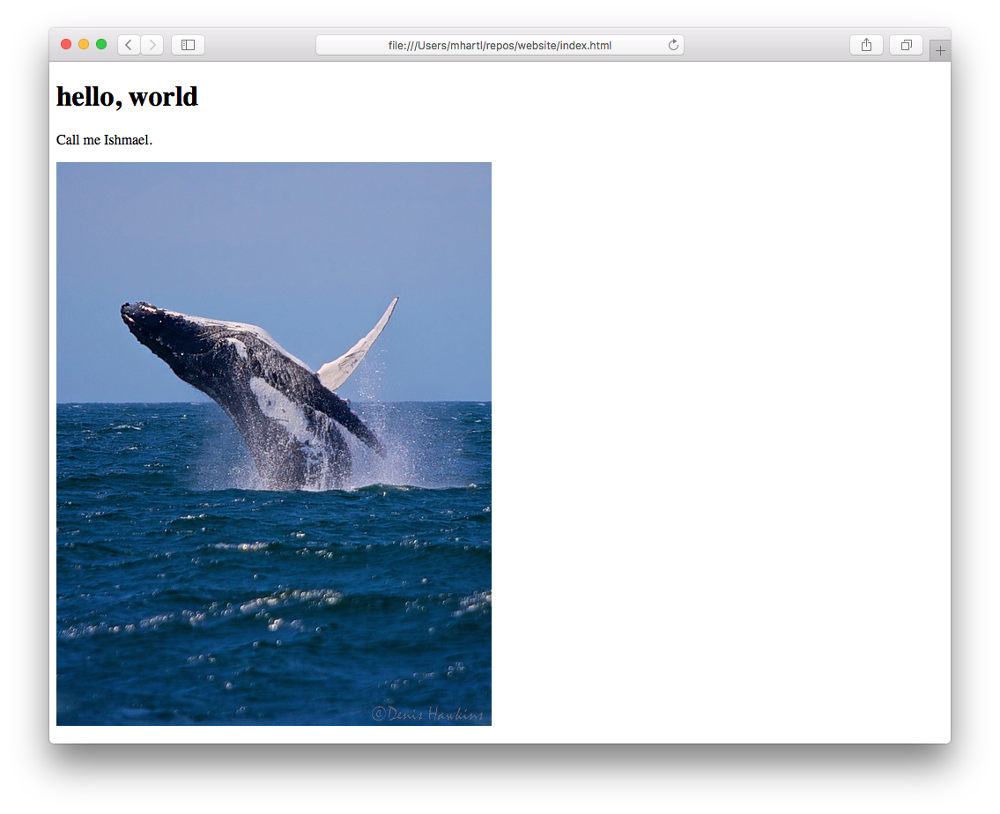

Figure 31: Our website with an added image.

At this point, `git diff` confirms that the image addition is ready to go:

```
[website (master)]$ git diff index.html
diff --git a/index.html b/index.html
index 706a1be..74043f7 100644
--- a/index.html
+++ b/index.html
@@ -6,5 +6,6 @@
   <body>
     <h1>hello, world</h1>
     <p>Call me Ishmael.</p>
+    
   </body>
 </html>
```

On the other hand, running `git status` shows that the entire `images/` directory is untracked:

```
[website (master)]$ git status
On branch master
Your branch is up-to-date with 'origin/master'.
Changes not staged for commit:
  (use "git add <file>..." to update what will be committed)
  (use "git checkout -- <file>..." to discard changes in working directory)

  modified:   index.html

Untracked files:
  (use "git add <file>..." to include in what will be committed)

  images/

no changes added to commit (use "git add" and/or "git commit -a")
```

As you might guess, `git add -A` adds all untracked *directories* in addition to adding all untracked files, so we can add the image and its directory with a single command:

```
[website (master)]$ git add -A
```

We then commit and push as usual:

```
[website (master)]$ git commit -m "Add an image"
[website (master)]$ git push
```

It’s a good idea to get in the habit of pushing up to the remote repository frequently, as it serves as a guaranteed backup of the project while also allowing collaborators to pull in any changes ([Section](http://www.learnenough.com/git-tutorial#sec-collaborating)).

After refreshing the GitHub repository in your browser, you should be able to confirm the presence of the new file by clicking on the `images` directory link, with the results as shown in [Figure](http://www.learnenough.com/git-tutorial#fig-images_directory_on_github).

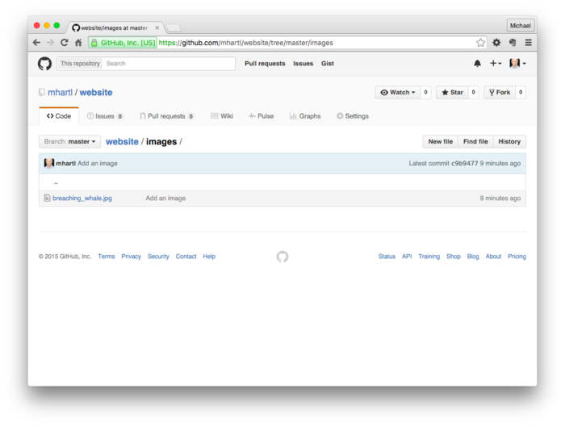

Figure 32: The new images directory on GitHub.

#### [Exercises](http://www.learnenough.com/git-tutorial#sec-exercises_commit_push_repeat)

1. Click on the image link at GitHub to verify that the `git push` succeeded.
2. At this point, the number of commits is large enough that the output of `git log -p` is probably too big to fit in your terminal window. Confirm that running `git log -p` drops you into a `less` interface for easier navigation.
3. Use your knowledge of [`less` commands](https://www.learnenough.com/command-line-tutorial#table-less_commands) to search for the commit that added the HTML `DOCTYPE`. What is the SHA of the commit?

### [Ignoring files](http://www.learnenough.com/git-tutorial#sec-ignoring_files)

A frequent issue when dealing with Git repositories is coming across files you *don’t* want to commit. These include files containing secret credentials, configuration files that aren’t shared across computers, temporary files, log files, etc.

For example, on Macintosh OS X a common side-effect of using the [Finder](https://support.apple.com/en-us/HT201732) to open directories is the creation of a hidden file called `.DS_Store`.[17](http://www.learnenough.com/git-tutorial#cha-0_footnote-17) In case you haven’t run into it yourself, we can simulate such a side-effect by using `touch` to create a sample `.DS_Store` file as follows:

```
[website (master)]$ touch .DS_Store
```

This file now shows up in the status:

```
[website (master)]$ git status
On branch master
Your branch is up-to-date with 'origin/master'.
Untracked files:
  (use "git add <file>..." to include in what will be committed)

  .DS_Store

nothing added to commit but untracked files present (use "git add" to track)
```

This is annoying, as we have no need to track this file, and indeed it could easily cause conflicts ([Section](http://www.learnenough.com/git-tutorial#sec-merge_conflicts)) down the line.

In order to avoid this annoyance, Git lets us *ignore* such files using a special hidden configuration file called `.gitignore`. To ignore `.DS_Store`, create a file called `.gitignore` using your favorite text editor and then fill it with the contents shown in [Listing](http://www.learnenough.com/git-tutorial#code-gitignore_ds_store).

Listing 14:
Configuring Git to ignore a file. ~/repos/website/.gitignore

```
.DS_Store
```

After saving the contents of [Listing](http://www.learnenough.com/git-tutorial#code-gitignore_ds_store), the status now picks up the newly added `.gitignore` file, but it *doesn’t* list the `.DS_Store` file, thereby confirming that it’s being ignored:

```
[website (master)]$ git status
On branch master
Your branch is up-to-date with 'origin/master'.
Untracked files:
  (use "git add <file>..." to include in what will be committed)

  .gitignore

nothing added to commit but untracked files present (use "git add" to track)
```

This is an excellent start, but it would be inconvenient if we had to add the name of every file we want to ignore. For instance, the Vim text editor ([covered briefly](http://www.learnenough.com/text-editor-tutorial#sec-vim) in [*Learn Enough™ Command Line to Be Dangerous*](http://learnenough.com/command-line-tutorial)) sometimes creates *temporary files* whose names involve appending a tilde `~` to the end of the normal filename, so you might be editing a file called `foo` and end up with a file called `foo~` in your directory. In such a case, we would want to ignore *all* files ending in a tilde. To support this case, the `.gitignore` file also lets us use *wildcards*, where the asterisk `*` represents “anything”:[18](http://www.learnenough.com/git-tutorial#cha-0_footnote-18)

```
*~
```

Adding the line above to `.gitignore` would cause all temporary Vim files to be ignored by Git. We can also add directories to `.gitignore`, so that, e.g.,

```
tmp/
```

would arrange to ignore all files in the `tmp/` directory.

Git ignore files can get quite complicated, but in practice you can build them up over time by running `git status` and looking for any files or directories you don’t want to track, and then adding a corresponding pattern to the `.gitignore` file. In addition, many systems (such as the [Ruby on Rails](http://rubyonrails.org/) web framework and the [Softcover](http://www.softcover.io/) publishing platform) generate a good starting `.gitignore` file for you.[19](http://www.learnenough.com/git-tutorial#cha-0_footnote-19) See [Chapter 1](https://www.railstutorial.org/book/beginning#sec-first_time_setup) of the [*Ruby on Rails Tutorial*](http://railstutorial.org/book) for more information.

#### [Exercises](http://www.learnenough.com/git-tutorial#sec-exercises_ignoring_files)

1. Commit the `.gitignore` file to your repository. *Hint*: Running `git commit -am` isn’t enough. Why not?
2. Push your commit up to GitHub and confirm using the web interface that the push succeeded.

### [Branching and merging](http://www.learnenough.com/git-tutorial#sec-branching_and_merging)

One of the most powerful features of Git is its ability to make *branches*, which are effectively complete self-contained copies of the project source, together with the ability to *merge* one branch into another. The best thing about a branch is that you can make your changes to the project in isolation from the master copy of the code, and then merge your changes in only when they’re done. This is especially helpful when collaborating with other users ([Section](http://www.learnenough.com/git-tutorial#sec-collaborating)); having a separate branch lets you make changes independently from other developers, reducing the risk of accidental conflicts.

We’ll use the addition of a second HTML page, an “About page”, as an example of how to use Git branches. Our first step is to use `git checkout` with the `-b` option, which makes a new branch called `about-page` and checks it out at the same time, as shown in [Listing](http://www.learnenough.com/git-tutorial#code-checkout_about_page).[20](http://www.learnenough.com/git-tutorial#cha-0_footnote-20)

Listing 15:
Checking out and creating the `about-page` branch.

```
[website (master)]$ git checkout -b about-page
[website (about-page)]$
```

Note that, per [Section 1.1.1](http://www.learnenough.com/git-tutorial#sec-prompt_branches_and_tab_completion), the prompt has changed to reflect the name of the new branch.

We can visualize our repository as shown in [Figure](http://www.learnenough.com/git-tutorial#fig-git_branch). The main repository evolution is a series of commits, and the branch represents a copy of the repo at the time the branch was made.[21](http://www.learnenough.com/git-tutorial#cha-0_footnote-21) Our plan is to make a series of changes on the `about-page` branch, and then incorporate the changes back into the `master` branch using `git merge`.

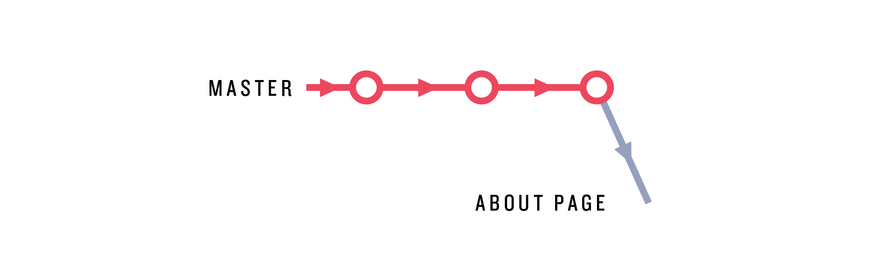

Figure 33: Branching off the `master` branch.

We can view the current branches using the `git branch` command:

```
[website (about-page)]$ git branch
* about-page
master
```

This lists all the branches currently defined on the local machine, with an asterisk `*` indicating the currently checked-out branch. (We’ll learn how to list *remote* branches in [Section](http://www.learnenough.com/git-tutorial#sec-pushing_branches).)

Having checked out the branch for the About page, we’re now ready to start making some changes to our working directory. We’ll start by making a new file called `about.html` to include some information about our project. Because we want the new page to have the full HTML structure (as in [Figure](http://www.learnenough.com/git-tutorial#fig-html_structure)), we’ll copy over the `index.html` file and then edit it as necessary:

```
[website (about-page)]$ cp index.html about.html
```

If this duplication seems a little unclean, it is. For example, what if there were an error in the HTML structure of `index.html`? Having copied it over to `about.html`, we’d have to make the correction in both places. As we’ll see in [Section](http://www.learnenough.com/git-tutorial#sec-pushing_branches), in fact there *is* an error, and we *will* have to make the correction twice. This sort of situation is annoying, and it’s far better to use a *site template* that avoids unnecessary duplication. We’ll start learning about how to do that in [*Learn Enough™ CSS & Layout to Be Dangerous*](http://www.learnenough.com/css-and-layout-tutorial).

Throughout the rest of the tutorial, we’ll be editing both `index.html` and `about.html`, so this is a good opportunity to use the preferred technique for opening a full project in a text editor (as [covered](http://www.learnenough.com/text-editor-tutorial#sec-editing_projects) in [*Learn Enough™ Text Editor to Be Dangerous*](http://learnenough.com/text-editor-tutorial)). I suggest closing all current editor windows and re-opening the project as follows:

```
[website (about-page)]$ atom .
```

By doing this, we can use “[fuzzy opening](http://www.learnenough.com/text-editor-tutorial#sec-fuzzy_opening)” to open the files of our choice. In particular, in Atom we can use ⌘P to open `about.html` and start making the necessary changes.

After opening `about.html`, fill it with the contents shown in [Listing](http://www.learnenough.com/git-tutorial#code-about_html). As always, I recommend typing in everything by hand, which will make it easier to see the diffs relative to [Listing](http://www.learnenough.com/git-tutorial#code-img_tag).

Listing 16:
The initial HTML for the About page. ~/repos/website/about.html

```
<!DOCTYPE html>
<html>
  <head>
    <title>About Us</title>
  </head>
  <body>
    <h1>About</h1>
    <p>
      This site is a sample project for the <strong>awesome</strong> Git
      tutorial <em>Learn Enough™ Git to Be Dangerous</em>.
    </p>
  </body>
</html>
```

[Listing](http://www.learnenough.com/git-tutorial#code-about_html) introduces two new tags: `strong` (which most browsers render as **boldface** text) and `em` for emphasis (which most browsers render as *italicized* text).

We’re now ready to commit the initial version of the About page. Because `about.html` is a new file, we have to add it and then commit, and I sometimes like to combine these two steps using `&&` as [described](https://www.learnenough.com/command-line-tutorial#aside-combining_commands) in [*Learn Enough™ Command Line to Be Dangerous*](http://learnenough.com/command-line-tutorial):

```
[website (about-page)]$ git add -A && git commit -m "Add About page"
```

At this point, the `about-page` branch has diverged from `master`, as shown in [Figure](http://www.learnenough.com/git-tutorial#fig-about_page_branch_first_diff).

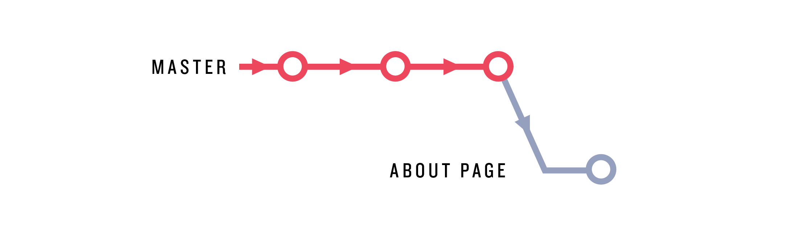

Figure 34: The `about-page` branch with a diff from `master`.

Before merging `about-page` back in to the `master` branch, we’ll make one more change. In the editor, use ⌘P or the equivalent to open `index.html` and add a *link* to the About page, as shown in [Listing](http://www.learnenough.com/git-tutorial#code-index_about_link).

Listing 17:
Adding a link to the About page. ~/repos/website/index.html

```
<!DOCTYPE html>
<html>
  <head>
    <title>A whale of a greeting</title>
  </head>
  <body>
    <h1>hello, world</h1>
    <a href="about.html"About this project</a>
    <p>Call me Ishmael.</p>
    
  </body>
</html>
```

[Listing](http://www.learnenough.com/git-tutorial#code-index_about_link) uses the important (if confusingly named) *anchor tag* `a`, which is the HTML tag for making links. This tag contains both content (“About this project”) and a *hypertext reference*, or `href`, which in this case is the `about.html` file we just created. (Because `about.html` is on the same site, we can link to it directly, but when linking to external sites the href should be a fully qualified URL, such as <http://example.com/>.)

After saving the change and refreshing `index.html` in our browser, the result should appear as shown in [Figure](http://www.learnenough.com/git-tutorial#fig-link_to_about_page). Following the link should lead us to the About page, as seen in [Figure](http://www.learnenough.com/git-tutorial#fig-about_page_broken). Note that the trademark character ™ doesn’t display properly; we will fix this issue in [Section](http://www.learnenough.com/git-tutorial#sec-pushing_branches).

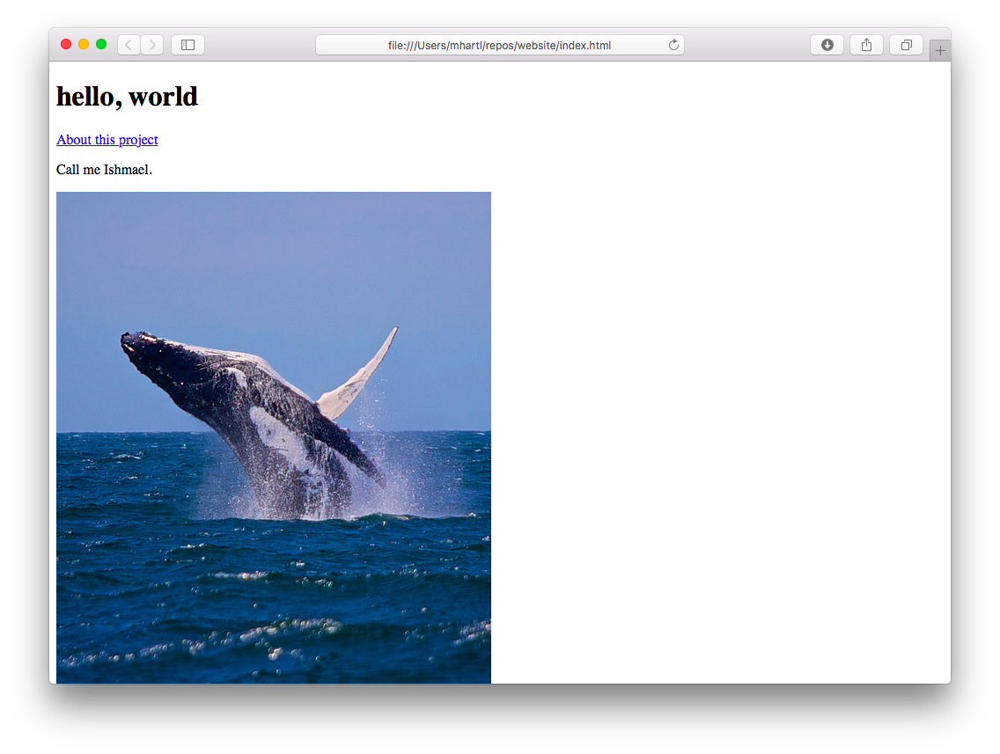

Figure 35: The index page with an added link.

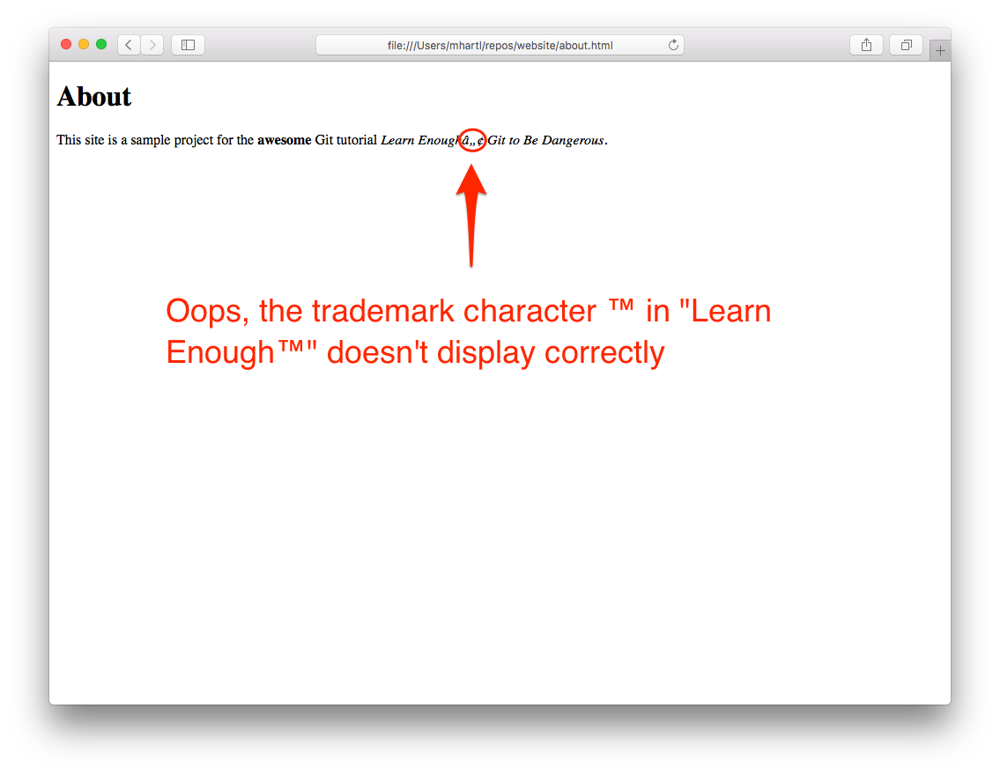

Figure 36: A slightly broken About page.

Having finished with the changes to `index.html`, we can make a commit as usual with `git commit -am`:

```
[website (about-page)]$ git commit -am "Add a link to the About page"
```

With this commit, the `about-pages` branch now appears as in [Figure](http://www.learnenough.com/git-tutorial#fig-about_page_branch_index_changes).

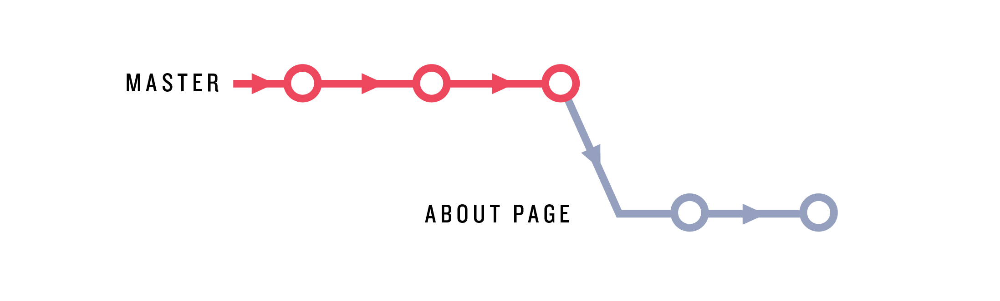

Figure 37: The current state of the `about-page` branch relative to `master`.

We’re done making changes for now, so we’re ready to merge the About page topic branch back into the `master` branch. We can get a handle on which changes we’ll be merging in by using `git diff`; we saw in [Section](http://www.learnenough.com/git-tutorial#sec-viewing_the_diff) that this command can be used by itself to see the difference between unstaged changes and our last commit, but the same command can be used to show diffs between branches. This can take the form `git diff branch-1 branch-2`, but if you leave the branch unspecified Git automatically diffs against the current branch. This means we can diff `about-page` vs. `master` as follows:

```
[website (about-page)]$ git diff master
```

The result in my terminal program appears as shown in [Figure](http://www.learnenough.com/git-tutorial#fig-git_diff_master). On my system, the diff is too long to fit on one screen, but (as we saw with `git log` in [Section 3.1.1](http://www.learnenough.com/git-tutorial#sec-exercises_commit_push_repeat)) the output of `git diff` uses the `less` program in this case.

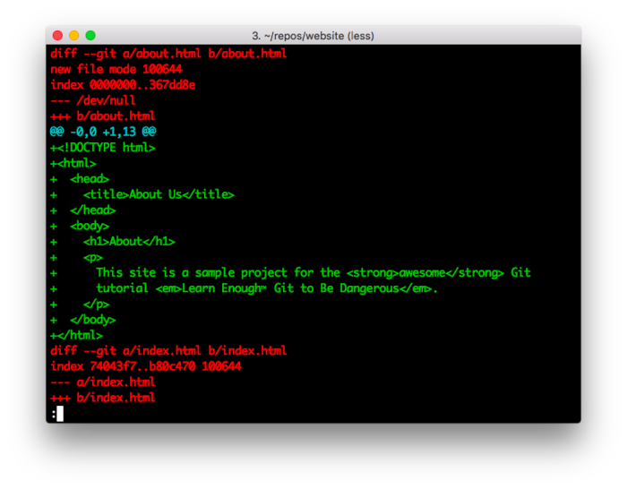

Figure 38: Diffing two branches.

To incorporate the changes on `about-page` into `master`, we first check out the `master` branch, and then merge in the other branch. With the configuration settings in [Section 1.1.1](http://www.learnenough.com/git-tutorial#sec-prompt_branches_and_tab_completion), you should be able to use tab completion by typing `git checkout m⇥` to get this:[22](http://www.learnenough.com/git-tutorial#cha-0_footnote-22)

```
[website (about-page)]$ git checkout master
[website (master)]$
```

Note that, unlike the `checkout` command in [Listing](http://www.learnenough.com/git-tutorial#code-checkout_about_page), here we omit the `-b` option because the `master` branch already exists.

At this point, we’re ready to merge in the changes, which we do with `git merge`:

```
[website (master)]$ git merge about-page
```

At this point, our branch structure appears as in [Figure](http://www.learnenough.com/git-tutorial#fig-about_page_merged).


Figure 39: The branches after merging `about-page` into `master`.

In the present case, the `master` branch didn’t change while we were working on the `about-page` branch, but Git excels even when the original branch has changed in the interim. This situation is especially common when collaborating with others ([Section](http://www.learnenough.com/git-tutorial#sec-collaborating)), but can happen even when working alone. Suppose, for example, that we discovered a typo on `master` and wanted to fix it and push up immediately. In that case the `master` branch would change ([Figure](http://www.learnenough.com/git-tutorial#fig-master_branch_change)), but we could still merge in the topic branch as usual. There is a possibility that changes on `master` would *conflict* with the merged changes, but Git is good at automatically merging content. Even when conflict is unavoidable, Git is good at marking conflicts explicitly so that we can resolve them by hand. We’ll see a concrete example of this in [Section](http://www.learnenough.com/git-tutorial#sec-merge_conflicts).

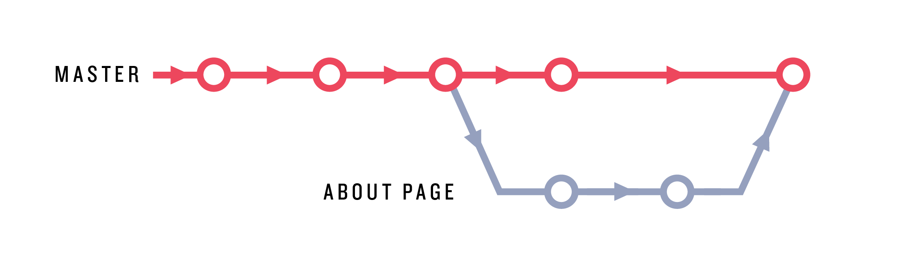

Figure 40: The tree structure if we made a change to `master`.

Having merged in the changes, we can sync up the local `master` branch with the version at GitHub (called `origin/master`) as usual:

```
[website (master)]$ git push
```

Since we probably don’t need the `about-page` branch any longer, we can optionally delete it, which is left as an exercise ([Section 3.3.2](http://www.learnenough.com/git-tutorial#sec-exercises_branching_and_merging)).

#### [Rebasing](http://www.learnenough.com/git-tutorial#sec-rebasing)

The most common way to combine branches is `git merge`, but there’s a second method called `git rebase` that you’re likely to encounter at some point. My advice for now is: *ignore `git rebase`*. The differences between merging and rebasing are subtle, and conventions for using `rebase` differ, so I recommend using `git rebase` only when an advanced Git user tells you to; otherwise, use `git merge` to combine the contents of two branches.

#### [Exercises](http://www.learnenough.com/git-tutorial#sec-exercises_branching_and_merging)

1. Use the command `git branch -d about-page` to delete the topic branch. Confirm by running `git branch` that only the `master` branch is left.
2. In [Listing](http://www.learnenough.com/git-tutorial#code-checkout_about_page), we used `git checkout -b` to create a branch and check it out at the same time, but it’s also possible to break this into two steps. As a first step, use `git branch` to make a branch with the name `really-long-branch-name`. (This just involves passing an argument to `git branch`, as in `git branch <branch name>`.) Confirm by running `git branch` without an argument that the new branch exists but isn’t currently checked out.
3. Use `git checkout` to check out `really-long-branch-name`. *Hint*: Use tab completion ([Section 1.1.1](http://www.learnenough.com/git-tutorial#sec-prompt_branches_and_tab_completion)).
4. Use `touch` to add and commit a file with a name of your choice.
5. Check out the `master` branch and try deleting the really long branch using `git branch -d` and confirm that it doesn’t work. The reason is that, in contrast to the `about-page` branch, the really long branch hasn’t been merged into `master`, and by design `-d` doesn’t work in this case. Because we don’t actually want its changes, delete the really long branch by using the related `-D` option, which deletes the branch in question even if its changes are unmerged.

### [Recovering from errors](http://www.learnenough.com/git-tutorial#sec-recovering_from_errors)

One of the most useful features of Git is its ability to let us recover from errors that would otherwise be catastrophic. The error-recovery techniques themselves can be dangerous, though, so they should always be implemented with care.

One common scenario is making unintentional changes to a project and wanting to get back to the state of the repository at the last commit (known as `HEAD`). For example, say we wanted to delete all the Vim temp files, which as mentioned in [Section](http://www.learnenough.com/git-tutorial#sec-ignoring_files) match the pattern `*~`. Ordinarily, we could do this with `rm -f *~`, but it would be easy to accidentally put a space between the characters, thereby deleting *all* the files in our `website` directory. **Warning: The following command is** ***extremely dangerous*****. Make 100% sure you are in the specified `website` directory before running it. Learn Enough™ to Be Dangerous cannot assume responsibility for any damage caused by running the following command in the wrong directory.** OK, here we go:

```
[website (master)]$ pwd
/Users/mhartl/repos/website
# DO NOT RUN THE FOLLOWING COMMAND UNLESS 100% SURE YOU'RE IN THE RIGHT DIRECTORY
# SERIOUSLY, I'M NOT KIDDING, THIS IS EXTREMELY DANGEROUS
# OK, HERE GOES NOTHING…
[website (master)]$ rm -f * ~
```

Because the wildcard operator `*` matches anything, all our (non-hidden) files are now gone.

In a regular Unix directory, there would be no hope of recovering the deleted files (which is one reason why the great power of `rm -f` [requires great responsibility](https://www.learnenough.com/command-line-tutorial#fig-spider_man)). Happily, in a Git repository we can undo the changes by forcing the system to check out the most recently committed version. We can inspect the damage using `git status`:

```
[website (master)]$ git status
On branch master
Your branch is up-to-date with 'origin/master'.
Changes not staged for commit:
  (use "git add/rm <file>..." to update what will be committed)
  (use "git checkout -- <file>..." to discard changes in working directory)

  deleted:    README.md
  deleted:    about.html
  deleted:    index.html

no changes added to commit (use "git add" and/or "git commit -a")
```

As indicated by the `deleted` label, all three of our files are now gone. To undo this deletion, we can pass the `-f` (force) option to `checkout`:[23](http://www.learnenough.com/git-tutorial#cha-0_footnote-23)

```
[website (master)]$ git checkout -f
```

We can then confirm that the deletions have been undone:

```
[website (master)]$ git status
On branch master
Your branch is up-to-date with 'origin/master'.
nothing to commit, working directory clean
```

Phew! That was a close one. (It’s worth noting that `git checkout -f` is also potentially dangerous, as it wipes out *all* the changes you’ve made, so only use this trick when you’re 100% sure you want to revert to `HEAD`.)

Another source of robustness against error is using branches, as described in [Section](http://www.learnenough.com/git-tutorial#sec-branching_and_merging). Because changes made on one branch are isolated from other branches, you can always just delete the branch if things go horribly wrong. For example, suppose we made the same `rm -f` mistake on a `test-branch` (**ALSO EXTREMELY DANGEROUS**):

```
[website (master)]$ git checkout -b test-branch
[website (master)]$ pwd
/Users/mhartl/repos/website
# DO NOT RUN THE FOLLOWING COMMAND UNLESS 100% SURE YOU'RE IN THE RIGHT DIRECTORY
# SERIOUSLY, I'M NOT KIDDING, THIS IS EXTREMELY DANGEROUS
# OK, HERE GOES NOTHING…
[website (test-branch)]$ rm -f * ~
```

We can fix this by committing the changes and then deleting the branch:

```
[website (test-branch)]$ git commit -am "Oops"
[website (test-branch)]$ git checkout master
[website (master)]$ git branch -D test-branch
```

Note here that we need to use `-D` instead of `-d` to delete the branch because `test-branch` is unmerged ([Section 3.3.2](http://www.learnenough.com/git-tutorial#sec-exercises_branching_and_merging)).

A final example of recovering from error involves the common case of a bug or other defect that makes its way into a project, origins unknown. In such a case, it’s convenient to be able to check out an earlier version of the repository.[24](http://www.learnenough.com/git-tutorial#cha-0_footnote-24) The way to do this is to use the SHAs from the Git log ([Section](http://www.learnenough.com/git-tutorial#sec-our_first_commit)). For example, to restore the website project to the state right after the second commit, we would run `git log` and navigate to the beginning of the log. Because `git log` uses the `less` interface, we can do this by typing `G` to go to the last line of the log.[25](http://www.learnenough.com/git-tutorial#cha-0_footnote-25) The result on my system is shown in [Listing](http://www.learnenough.com/git-tutorial#code-git_log_shas). (Because SHAs are by design unique identifiers, your values will differ.)

Listing 18:
Viewing the SHAs in the Git log.

```
[website (master)]$ git log
commit 8c19674468a67720b9ba61a783e81f97062874bf
Author: Michael Hartl <michael@michaelhartl.com>
Date:   Mon Dec 21 21:27:56 2015 -0800

    Add a README

commit 69b955490caf12552e83d476820d29475fa35010
Author: Michael Hartl <michael@michaelhartl.com>
Date:   Mon Dec 21 21:02:20 2015 -0800

    Add some HTML structure

commit 03aff34ec4f9690228e057a4252bcca169a868b4
Author: Michael Hartl <michael@michaelhartl.com>
Date:   Thu Dec 17 20:03:33 2015 -0800

    Add content to index.html

commit 879392a6bd8dd505f21876869de99d73f40299cc
Author: Michael Hartl <michael@michaelhartl.com>
Date:   Thu Dec 17 20:00:34 2015 -0800

    Initialize repository
```

To check out the commit with the message “Add content to index.html”, simply copy the SHA and check it out:

```
[website (master)]$ git checkout 03aff34ec4f9690228e057a4252bcca169a868b4
Note: checking out '03aff34ec4f9690228e057a4252bcca169a868b4'.

You are in 'detached HEAD' state. You can look around, make experimental
changes and commit them, and you can discard any commits you make in this
state without impacting any branches by performing another checkout.

If you want to create a new branch to retain commits you create, you may
do so (now or later) by using -b with the checkout command again. Example:

  git checkout -b new_branch_name

HEAD is now at 03aff34... Add content to index.html
[website ((03aff34...))]$
```

Note that the branch name in the last line has changed to reflect the value of the SHA, and Git has issued a warning that we are in a ‘detached HEAD’ state. I recommend using this technique to inspect the state of the project and figure out any necessary changes, then check out the `master` branch to apply them:

```
[website ((03aff34...))]$ git checkout master
[website (master)]$
```

At this point, you could switch to your text editor and make any necessary changes (such as fixing a bug discovered on the earlier commit).

If all this seems a little abstract, don’t worry. The main takeaways are (1) it’s possible to “go back in history” to view the project at an earlier state and (2) it’s tricky to make changes, so if you find yourself doing anything complicated you should ask a more experienced Git user what to do. (In particular, the exact practices in such a case could be team-dependent.)

#### [Exercises](http://www.learnenough.com/git-tutorial#sec-exercises_recovering_from_errors)

1. The `git checkout -f` trick works only with files that are already part of the repository, but sometimes you want to get rid of added files as well. Using `touch`, create a file with a name of your choice, then `git add` it. Verify that running `git checkout -f` gets rid of it.
2. Many Unix programs accept options in both “short form” and “long form”. Repeat the previous exercise with `git checkout --force` to confirm that the effects of `-f` and `--force` are identical. *Extra credit*: Double-check this conclusion by finding the “force” option in the output of `git help checkout`.
3. Resetting the working directory by adding all the files and doing a force-checkout is useful enough that it’s probably worth adding the combination as an alias to your system. Add `gcl` (for “Git clear”) to your system by including the contents of [Listing](http://www.learnenough.com/git-tutorial#code-gcl) in your `.bash_profile` file.[26](http://www.learnenough.com/git-tutorial#cha-0_footnote-26) Confirm that it’s working by repeating the first exercise using `gcl` instead of typing the commands out by hand. *Hint*: Don’t forget to `source` your `.bash_profile` file as in [Section 1.1.1](http://www.learnenough.com/git-tutorial#sec-prompt_branches_and_tab_completion).

Listing 19:
A Bash alias for clearing the working directory of any changes.

```
alias 'git add -A && git checkout --force'
```

### [Summary](http://www.learnenough.com/git-tutorial#sec-summary_intermediate_workflow)

Important commands from this section are summarized in [Table](http://www.learnenough.com/git-tutorial#table-intermediate_workflow).

|  |  |  |
| --- | --- | --- |
| **Command** | **Description** | **Example** |
| .gitignore | Tell Git which things to ignore | `$ echo .DS_store >> .gitignore` |
| git checkout <br> | Check out a branch | `$ git checkout master` |
| git checkout -b <br> | Check out & create a branch | `$ git checkout -b about-page` |
| git branch | Display local branches | `$ git branch` |
| git merge <br> | Merge in a branch | `$ git merge about-page` |
| git rebase | Do something possibly weird & confusing | See [Figure](http://www.learnenough.com/git-tutorial#fig-xkcd_git) and [Figure](http://www.learnenough.com/git-tutorial#fig-xkcd_git_title_text) |
| git branch -d <br> | Delete branch (if merged) | `$ git branch -d about-page` |
| git branch -D <br> | Delete branch (even if unmerged) **(dangerous)** | `$ git branch -D other-branch` |
| git checkout -f | Force checkout, discarding changes **(dangerous)** | `$ git add -A && git checkout -f` |

Table 3: Important commands from [Section](http://www.learnenough.com/git-tutorial#sec-intermediate_workflow).

## [Collaborating](http://www.learnenough.com/git-tutorial#sec-collaborating)

Now that we’ve covered some of the tools needed to use Git effectively on solo projects, it’s time to learn about what is perhaps Git’s greatest strength: making it easier to collaborate with other people. This is especially the case when using repository hosts like [GitHub](http://github.com/) or [Bitbucket](http://bitbucket.com/), but it is also possible to host Git repositories on private servers (sometimes using software like [GitLab](https://about.gitlab.com/) to get many GitHub-like benefits).

Because this tutorial is designed for individual readers, we won’t actually be able to collaborate with others, but this section will explain how you can practice “collaborating” with yourself. There are many different collaboration scenarios, and they vary significantly by team and by project, so we’ll focus on the important case of multiple collaborators who all have *commit rights* to a particular repo. This model is appropriate for teams where everyone can make changes without explicit approval from a project maintainer.

Open-source projects typically use a different flow involving *forking* and *pull requests*, but the details differ enough that it’s best to defer to the collaboration instructions of each particular project. Consider, for example, the instructions for [contributing to Ruby on Rails](http://edgeguides.rubyonrails.org/contributing_to_ruby_on_rails.html). With the commands from this tutorial and your technical sophistication ([Box](http://www.learnenough.com/git-tutorial#aside-technical_sophistication)), you’ll be in a good position to understand and follow such instructions if you decide to get involved in contributing to open-source software or other projects under version control with Git.

For reference, important commands from this section are summarized in [Table](http://www.learnenough.com/git-tutorial#table-collaborating).

### [Clone, push, pull](http://www.learnenough.com/git-tutorial#sec-clone_push_pull)

As an example of a common collaboration workflow, we’ll simulate the case of two developers working on the same project, in this case the simple website developed in this tutorial. We’ll start with Alice ([Figure](http://www.learnenough.com/git-tutorial#fig-alice))[27](http://www.learnenough.com/git-tutorial#cha-0_footnote-27) working in the original `website` directory, and we’ll create a second directory (`website-copy`) for her collaborator Bob ([Figure](http://www.learnenough.com/git-tutorial#fig-bob)).[28](http://www.learnenough.com/git-tutorial#cha-0_footnote-28)


Figure 41: Alice, working on `website`.


Figure 42: Bob, working on `website-copy`.

As a first step, Alice runs `git push` just to make sure all her changes are on the remote repository:


```
[website (master)]$ git push
```

In real life, Alice would now need to add Bob as a collaborator on the `website` repository, which she could do at GitHub by clicking on **Settings > Collaborators** and then put Bob’s GitHub username in the Add collaborator box ([Figure](http://www.learnenough.com/git-tutorial#fig-github_add_collaborator)). Because we’re collaborating with ourselves, we can skip this step.

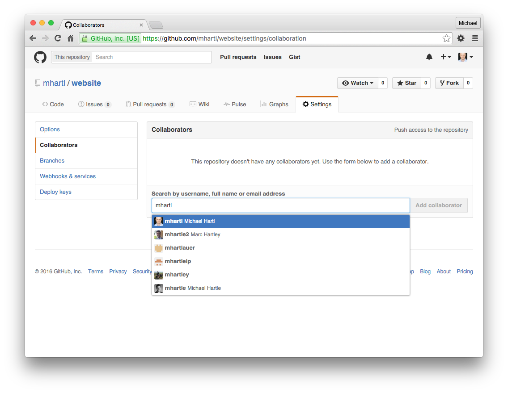

Figure 43: The GitHub page to add collaborators.

Once Bob gets the notification that he’s been added to the `website` repository, he can go to GitHub to get the *clone URL*, as shown in [Figure](http://www.learnenough.com/git-tutorial#fig-clone_url). This URL lets Bob make a full copy of the repository (including its history) using `git clone`.

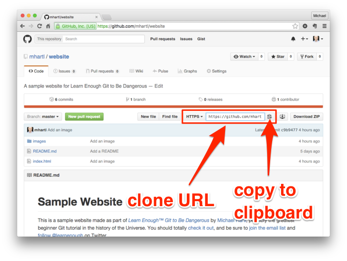

Figure 44: Finding the clone URL at GitHub.

Ordinarily, Bob would probably use his own `repos` directory, with a project called `website` as in Alice’s original, but because we’re only simulating the collaboration we’ll use the name `website-copy` for clarity. In addition, when doing something a little artificial like this I like to use a temp directory called `~/tmp`,[29](http://www.learnenough.com/git-tutorial#cha-0_footnote-29) so create this directory if it doesn’t already exist on your system:

```
$ cd
$ mkdir tmp/
```

Then `cd` to it and clone the repo to the local directory:


```
[~]$ cd tmp/
[tmp]$ git clone <clone URL> website-copy
Cloning into 'website-copy'...
[tmp]$ cd website-copy/
```

Here we’ve included the argument `website-copy` to `git clone`, thereby showing how to use a different name than the original repo, but usually you just run `git clone <clone URL>`, which uses the default repo name (in this case, `website`).

Now we’re ready to open the copy of the project and start making edits:


```
[website-copy (master)]$ atom .
```

For the purposes of this exercise, I recommend placing the editor windows for `website` and `website-copy` side by side, as shown in [Figure](http://www.learnenough.com/git-tutorial#fig-side_by_side).

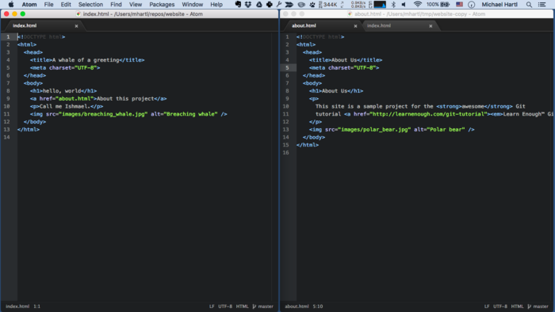

Figure 45: The `website` and `website-copy` editors running side by side.

To begin the collaboration, we’ll have Bob make a change to the site by wrapping the tutorial title on the About page in a link, like this:

```
<a href="http://learnenough.com/git-tutorial"…</a>
```

Here the ellipsis … represents the full title of the tutorial, *Learn Enough™ Git to Be Dangerous*. The resulting line is too long to display here, but we can wrap it, as shown in [Figure](http://www.learnenough.com/git-tutorial#fig-toggle_soft_wrap), with the result as shown in [Figure](http://www.learnenough.com/git-tutorial#fig-wrapped_about_page).

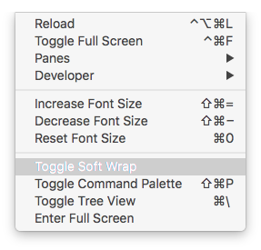

Figure 46: Toggling soft wrap in Atom.

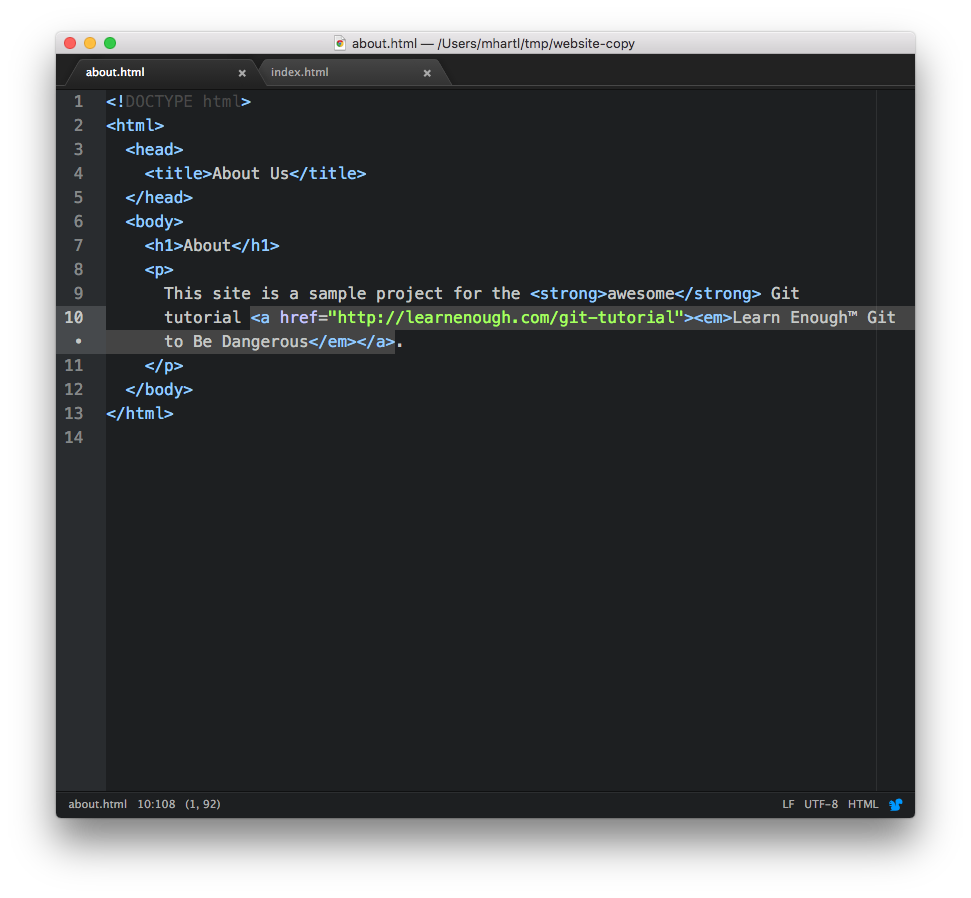

Figure 47: The About page with soft wrap activated.

If we look at the diff using `git diff`, we see the wrapped line ([Figure](http://www.learnenough.com/git-tutorial#fig-wrapped_diff)), which appears in a browser as shown in [Figure](http://www.learnenough.com/git-tutorial#fig-about_page_link).

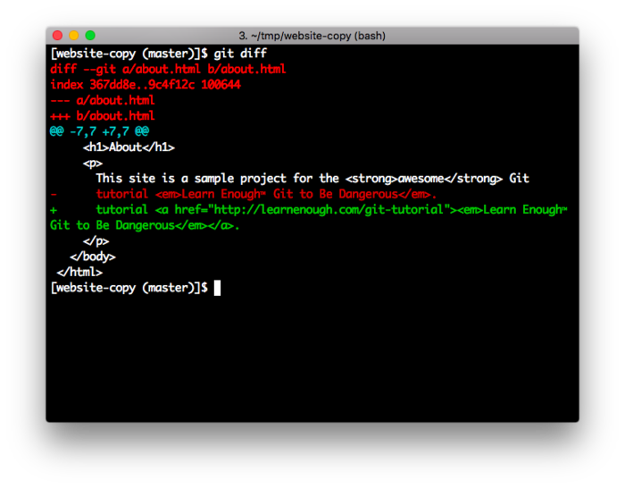

Figure 48: The diff with a wrapped line.

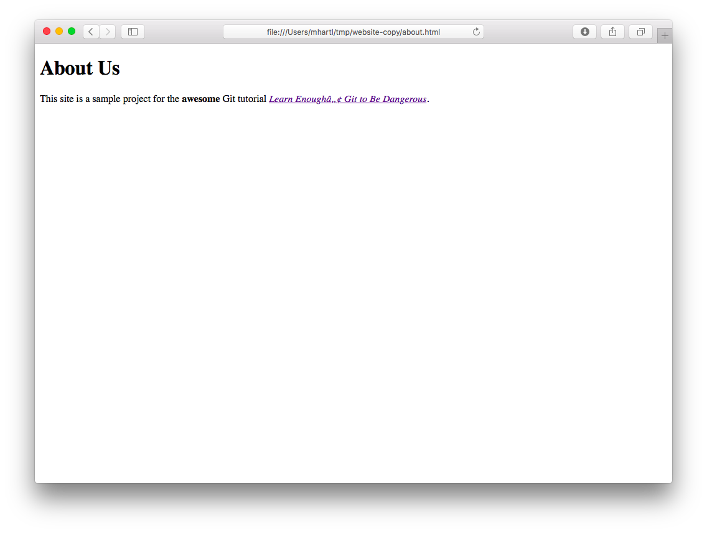

Figure 49: Linking the Git tutorial title on the About page.

Having added the link, Bob can commit his changes and push up to the remote repository:


```
[website-copy (master)]$ git commit -am "Add link to tutorial title"
[website-copy (master)]$ git push
```

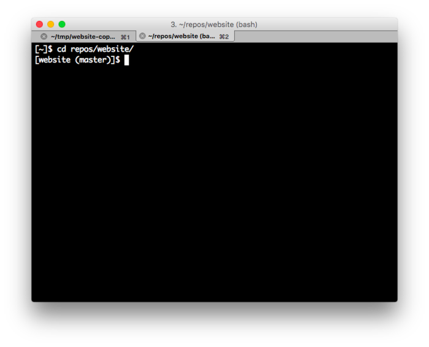

Figure 50: Using a new terminal tab for the original directory.

At this point, Bob might send Alice a notification that there’s a change ready, or Alice might just be diligent about checking for changes. In either case, Alice can get the changes from the remote origin by running `git pull`. I suggest opening up a new tab in your terminal window for Alice’s directory, as shown in [Figure](http://www.learnenough.com/git-tutorial#fig-new_tab), and then run `git pull`:


```
[website (master)]$ git pull
remote: Counting objects: 3, done.
remote: Compressing objects: 100% (1/1), done.
remote: Total 3 (delta 2), reused 3 (delta 2), pack-reused 0
Unpacking objects: 100% (3/3), done.
From https://github.com/mhartl/website
   42db83e..986a487  master     -> origin/master
Updating 42db83e..986a487
Fast-forward
 about.html | 2 +-
 1 file changed, 1 insertion(+), 1 deletion(-)
```

With that, Alice’s project should have Bob’s commit, and her copy of the About page should be identical to [Figure](http://www.learnenough.com/git-tutorial#fig-about_page_link). (Checking that Bob’s commit is present in the log is left as an exercise.)

#### [Exercises](http://www.learnenough.com/git-tutorial#sec-exercises_clone_push_pull)

1. As Alice, run `git log` to verify that the commit was pulled down correctly. Double-check the details using `git log -p`.
2. The whale picture added in [Listing](http://www.learnenough.com/git-tutorial#code-img_tag) ([Figure](http://www.learnenough.com/git-tutorial#fig-breaching_whale)) requires attribution under the [Creative Commons Attribution-NoDerivs 2.0 Generic](https://creativecommons.org/licenses/by-nd/2.0/) license. As Alice, link the image to the original attribution page, as shown in [Listing](http://www.learnenough.com/git-tutorial#code-whale_attribution). Commit the result and push to GitHub.
3. As Bob, pull in the changes from the previous exercise. Verify by refreshing the browser and by running `git log -p` that Bob’s repo has been properly updated.


Listing 20:
Linking to the whale image’s attribution page. ~/repos/website/index.html

```
    .
    .
    .
    <a href="https://www.flickr.com/photos/28883788@N04/10097824543"
      
    </a>
    .
    .
    .
```

### [Pulling and merge conflicts](http://www.learnenough.com/git-tutorial#sec-merge_conflicts)

In [Section](http://www.learnenough.com/git-tutorial#sec-clone_push_pull), Alice didn’t make any changes while Bob was making his commit, so there was no chance of conflict, but this is not always the case. In particular, when two collaborators edit the same file, it is possible that the changes might be irreconcilable. Git is pretty smart about merging in changes, and in general conflicts are surprisingly rare, but it’s important to be able to handle them when they occur. In this section, we’ll consider both cases in turn.

#### [Non-conflicting changes](http://www.learnenough.com/git-tutorial#sec-non_conflicting_changes)

We’ll start by having Alice and Bob make *non*-conflicting changes in the same file. Suppose Alice decides to change the top-level heading on the About page from “About” to “About Us”, as shown in [Listing](http://www.learnenough.com/git-tutorial#code-about_us_h1).


Listing 21:
Alice’s change to the About page’s `h1`. ~/repos/website/about.html

```
<!DOCTYPE html>
<html>
    .
    .
    .
    <h1>About Us</h1>
    .
    .
    .
  </body>
</html>
```

After making this change, Alice commits and pushes as usual:


```
[website (master)]$ git commit -am "Change page heading"
[website (master)]$ git push
```


Figure 51: An image for Bob to add to the About page.

Meanwhile, Bob decides to add a new image ([Figure](http://www.learnenough.com/git-tutorial#fig-polar_bear))[30](http://www.learnenough.com/git-tutorial#cha-0_footnote-30) to the About page. He first downloads it with `curl` as follows:


```
[website-copy (master)]$ curl -o images/polar_bear.jpg \
>                             -OL cdn.learnenough.com/polar_bear.jpg
```

He then adds it to `about.html` using the `img` tag, as shown in [Listing](http://www.learnenough.com/git-tutorial#code-about_page_added_image), with the result shown in [Figure](http://www.learnenough.com/git-tutorial#fig-about_with_polar_bear).


Listing 22:
Adding an image to the About page. ~/tmp/website-copy/about.html

```
<!DOCTYPE html>
<html>
    .
    .
    .
    
  </body>
</html>
```

Note that Bob has included an `alt` attribute in [Listing](http://www.learnenough.com/git-tutorial#code-about_page_added_image), which is a text alternative to the image. The `alt` attribute is actually required by the HTML5 standard, and including it is a good practice because it’s used by [web spiders](https://en.wikipedia.org/wiki/Web_crawler) and by screen readers for the visually impaired.

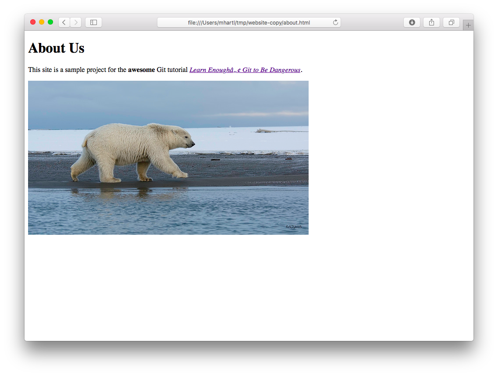

Figure 52: The About page with an added image.

Having made his change, Bob commits as usual:


```
[website-copy (master)]$ git add -A
[website-copy (master)]$ git commit -m "Add an image"
```

When he tries to push, though, something unexpected happens, as shown in [Listing](http://www.learnenough.com/git-tutorial#code-push_rejected).


Listing 23:
Bob’s push, rejected.

```
[website-copy (master)]$ git push
To https://github.com/mhartl/website.git
 ! [rejected]        master -> master (fetch first)
error: failed to push some refs to 'https://github.com/mhartl/website.git'
hint: Updates were rejected because the remote contains work that you do
hint: not have locally. This is usually caused by another repository pushing
hint: to the same ref. You may want to first integrate the remote changes
hint: (e.g., 'git pull ...') before pushing again.
hint: See the 'Note about fast-forwards' in 'git push --help' for details.
```

Because of the changes Alice already pushed, Git won’t let Bob’s push go through. As indicated by the highlighted line above, the solution to this is for Bob to `pull`:


```
[website-copy (master)]$ git pull
```

Even though Alice made changes to `about.html`, there is no conflict because Git figures out how to combine the diffs. In particular, `git pull` brings in the changes from the remote repo and merges them in automatically, adding the option to add a commit message by dropping Bob into the default editor, which on most systems is Vim ([Figure](http://www.learnenough.com/git-tutorial#fig-merge_editor)). (This is but one of many reasons why [*Learn Enough™ Command Line to Be Dangerous*](http://learnenough.com/command-line-tutorial) covered Minimum Viable Vim.) To get the merge to go through, you can simply quit out of Vim using `:q`.

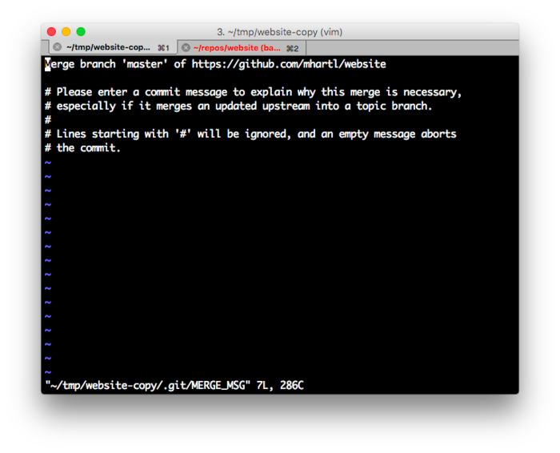

Figure 53: The default editor for merging from a `git pull`.

We can confirm that this worked by checking the log, which shows both the merge commit and Alice’s commit from the original copy ([Listing](http://www.learnenough.com/git-tutorial#code-git_log_merge)).


Listing 24:
The Git log after Bob merges in Alice’s changes. (Exact results will differ.)

```
[website-copy (master)]$ git log
commit 86dccde63ac15331a068ce79fa9c83d8b784b28b
Merge: 9b7eda1 5ca69e4
Author: Michael Hartl <michael@michaelhartl.com>
Date:   Mon Dec 28 13:14:44 2015 -0800

    Merge branch 'master' of https://github.com/mhartl/website

commit 9b7eda1b0a95740a241684b82d4474aa8f16ae45
Author: Michael Hartl <michael@michaelhartl.com>
Date:   Mon Dec 28 13:13:37 2015 -0800

    Add an image

commit 5ca69e4dca9487b5cd7e1be52222c5389392527d
Author: Michael Hartl <michael@michaelhartl.com>
Date:   Mon Dec 28 13:02:42 2015 -0800

    Change page heading
```

If Bob now pushes, it should go through as expected


```
$ git push
```

This puts Bob’s changes on the remote repo, which means Alice can pull them in:


```
$ git pull
```

Alice can confirm that her repo now includes Bob’s changes by inspecting the Git log, which should match the results you got in [Listing](http://www.learnenough.com/git-tutorial#code-git_log_merge). Meanwhile, she can refresh her browser to see Bob’s cool new [ursine](http://www.merriam-webster.com/dictionary/ursine) addition ([Figure](http://www.learnenough.com/git-tutorial#fig-about_polar_bear_alice)).


Figure 54: Confirming that Alice’s repo includes Bob’s added image.

#### [Conflicting changes](http://www.learnenough.com/git-tutorial#sec-conflicting_changes)

Even though Git’s merge algorithms can often figure out how to combine changes from different collaborators, sometimes there’s no avoiding a conflict. For example, suppose both Alice and Bob notice that the required `alt` attribute is missing from the image included in [Listing](http://www.learnenough.com/git-tutorial#code-img_tag) and decide to correct the issue by adding one.


Listing 25:
Alice’s image `alt`. ~/repos/website/index.html

```
<!DOCTYPE html>
<html>
    .
    .
    .
    <a href="https://www.flickr.com/photos/28883788@N04/10097824543"
      
    </a>
  </body>
</html>
```

First, Alice adds the `alt` attribute “Breaching whale” ([Listing](http://www.learnenough.com/git-tutorial#code-breaching_whale_alt)) and then commits and pushes her change:[31](http://www.learnenough.com/git-tutorial#cha-0_footnote-31)


```
[website (master)]$ git commit -am "Add necessary image alt"
[website (master)]$ git push
```


Listing 26:
Bob’s image `alt`. ~/tmp/website-copy/index.html

```
<!DOCTYPE html>
<html>
    .
    .
    .
    <a href="https://www.flickr.com/photos/28883788@N04/10097824543"
      
    </a>
  </body>
</html>
```

Meanwhile, Bob adds his own `alt` attribute, “Whale” ([Listing](http://www.learnenough.com/git-tutorial#code-whale_alt)), and commits his change:


```
[website-copy (master)]$ git commit -am "Add an alt attribute"
```

If Bob tries to `push`, he’ll be met with the same rejection message shown in [Listing](http://www.learnenough.com/git-tutorial#code-push_rejected), which means he should pull—but that comes at a cost:


```
[website-copy (master)]$ git pull
remote: Counting objects: 3, done.
remote: Compressing objects: 100% (1/1), done.
remote: Total 3 (delta 2), reused 3 (delta 2), pack-reused 0
Unpacking objects: 100% (3/3), done.
From https://github.com/mhartl/website
   5ca69e4..7ada3b5  master     -> origin/master
Auto-merging index.html
CONFLICT (content): Merge conflict in index.html
Automatic merge failed; fix conflicts and then commit the result.
[website-copy (master|MERGING)]$
```

As indicated in the second highlighted line, Git has detected a merge conflict from Bob’s pull, and his working copy has been put into a special branch state called `master|MERGING`.

Bob can see the effect of this conflict by viewing `index.html` in his text editor, as shown in [Figure](http://www.learnenough.com/git-tutorial#fig-merge_conflict). Supposing Bob prefers Alice’s more descriptive `alt` text, he can resolve the conflict by deleting all but the line with `alt="Breaching whale"`, as seen in [Figure](http://www.learnenough.com/git-tutorial#fig-edited_merge_conflict).

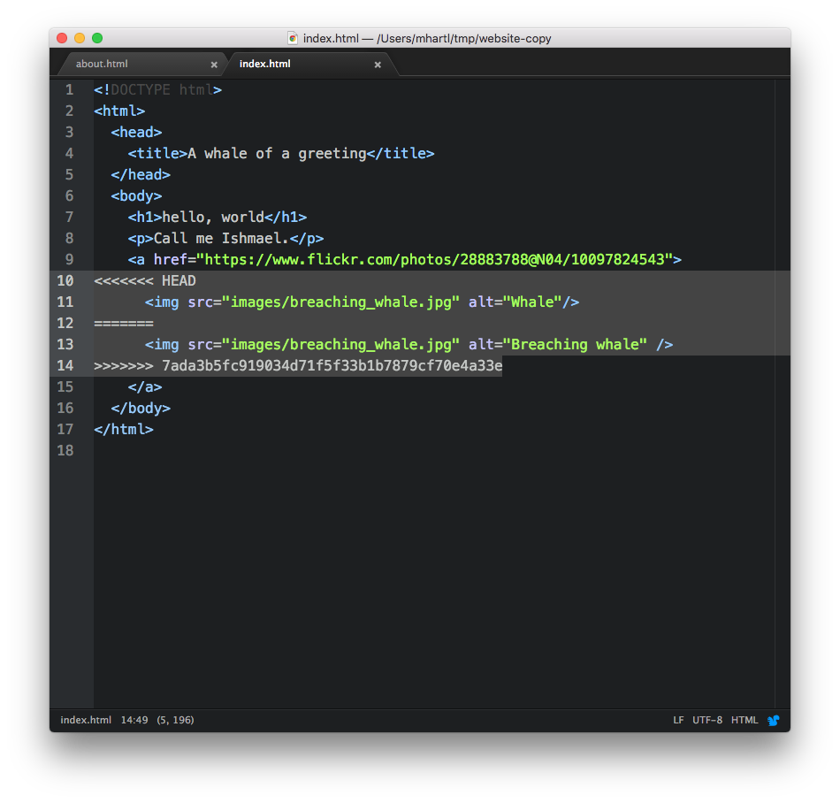

Figure 55: A file with a merge conflict.

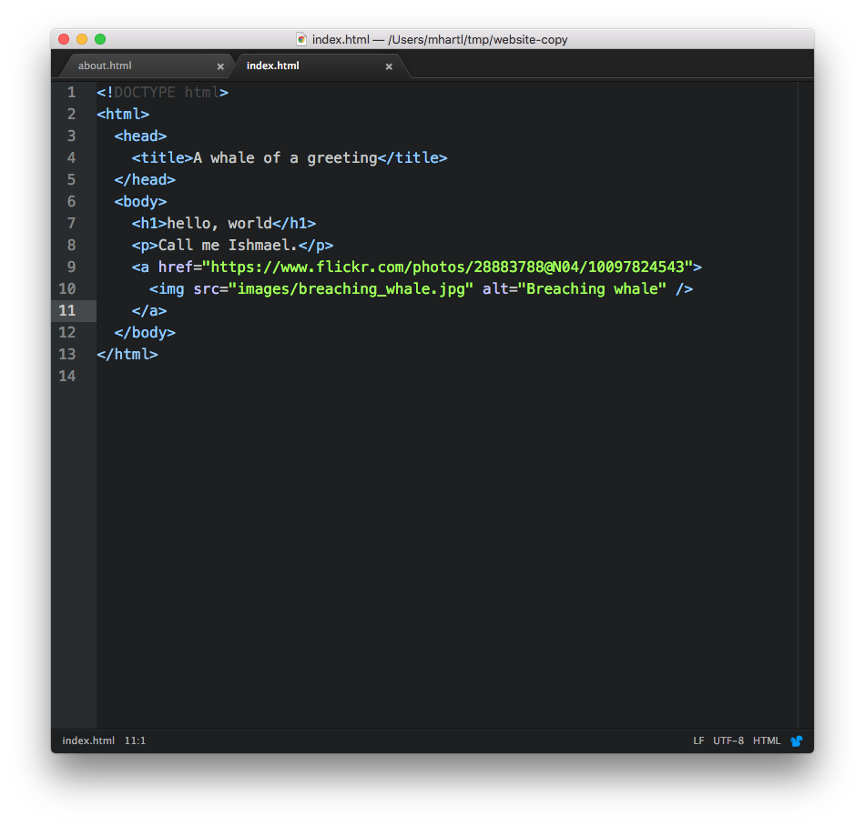

Figure 56: The HTML file edited to remove the merge conflict.

After saving the file, Bob can commit his change, which causes the prompt to revert back to displaying the `master` branch, and at that point he’s ready to `push`:


```
[website-copy (master|MERGING)]$ git commit -am "Use longer alt attribute"
[website-copy (master)]$ git push
```

Alice’s and Bob’s repos now have the same content, but it’s still a good idea for Alice to pull in Bob’s merge commit:


```
[website (master)]$ git pull
```

Because of the potential for conflict, it’s a good idea to do a `git pull` before making any changes on a project with multiple collaborators. Even then, on a long enough timeline some conflicts are inevitable, and with the techniques in this section you’re now in a position to handle them.

#### [Exercises](http://www.learnenough.com/git-tutorial#sec-exercises_merge_conflicts)

1. Change your default Git editor from Vim to Atom. *Hint*: [Google for it](http://lmgtfy.com/?q=git+change+default+editor+atom). (This is an absolutely *classic* application of technical sophistication ([Box](http://www.learnenough.com/git-tutorial#aside-technical_sophistication)): With a well-chosen Google search, you can often go from “I have no idea how to do this” to “It’s done” in under 30 seconds.)
2. The polar bear picture added in [Listing](http://www.learnenough.com/git-tutorial#code-about_page_added_image) ([Figure](http://www.learnenough.com/git-tutorial#fig-polar_bear)) requires attribution under the [Creative Commons Attribution 2.0 Generic](https://creativecommons.org/licenses/by/2.0/) license. As Alice, link the image to the original attribution page, as shown in [Listing](http://www.learnenough.com/git-tutorial#code-polar_bear_attribution). Then run `git commit -a` *without* including `-m` and a command-line message. This should drop you into the default Git editor. Quit the editor *without* including a message, which cancels the commit.
3. Run `git commit -a` again, but this time add the commit message “Add polar bear attribution link”. Then hit return a couple of times and add a longer message of your choice. (One example appears in [Figure](http://www.learnenough.com/git-tutorial#fig-longer_message).) Save the message and exit the editor.
4. Run `git log` to confirm that both the short and longer messages correctly appear. After pushing the changes to GitHub, navigate to the page for the commit to confirm that both the short and longer messages correctly appear.
5. As Bob, pull in the changes to the About page. Verify by refreshing the browser and by running `git log -p` that Bob’s repo has been properly updated.


Listing 27:
Linking to the polar bear image’s attribution page. ~/repos/website/about.html

```
    .
    .
    .
    <a href="https://www.flickr.com/photos/puliarfanita/22959238329"
      
    </a>
    .
    .
    .
```

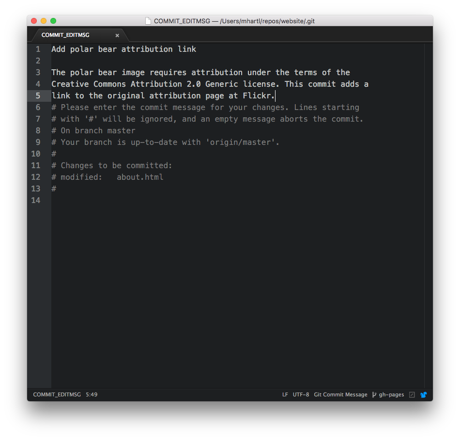

Figure 57: Adding a longer message in a text editor.

### [Pushing branches](http://www.learnenough.com/git-tutorial#sec-pushing_branches)

In this section, we’ll apply our newfound collaboration skills to get Alice to request a bugfix from Bob, who will make the correction and then share the result with Alice. In the process, we’ll learn how to collaborate on branches other than `master`, thereby applying the material from [Section](http://www.learnenough.com/git-tutorial#sec-branching_and_merging) as well.

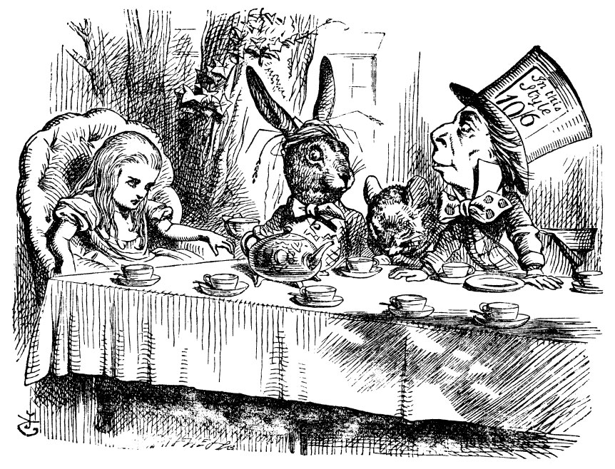

Figure 58: Alice has a [tea party](https://www.cs.indiana.edu/metastuff/wonder/ch7.html) to attend and so asks Bob to fix the website.

Recall from [Section](http://www.learnenough.com/git-tutorial#sec-branching_and_merging) that the trademark character ™ is currently broken on the About page ([Figure](http://www.learnenough.com/git-tutorial#fig-about_page_broken)). Alice suspects the fix for this involves adding some markup to the HTML template for the website’s pages, but she’s already agreed to attend a tea party ([Figure](http://www.learnenough.com/git-tutorial#fig-tea_party)),[32](http://www.learnenough.com/git-tutorial#cha-0_footnote-32) so she only has time to add a couple of *HTML comments* requesting for Bob to add the relevant fix, as shown in [Listing](http://www.learnenough.com/git-tutorial#code-about_stub) and [Listing](http://www.learnenough.com/git-tutorial#code-index_stub). (We’ll cover HTML comments further in [*Learn Enough™ HTML to Be Dangerous*](http://learnenough.com/html-tutorial).)


Listing 28:
A stub for the fix to the ™ problem. ~/repos/website/about.html

```
<!DOCTYPE html>
<html>
  <head>
    <title>About Us</title>
    <!-- Add something here to fix trademark -->
  </head>
  .
  .
  .
</html>
```

Listing 29:
A stub to add the ™ fix to the index page. ~/repos/website/index.html

```
<!DOCTYPE html>
<html>
  <head>
    <title>A whale of a greeting</title>
    <!-- Add something here to fix trademark -->
  </head>
  .
  .
  .
</html>
```

Notice that Alice has wisely asked Bob to fix the index page as well ([Listing](http://www.learnenough.com/git-tutorial#code-index_stub)) even though the current error only occurs on the About page. This way, any ™ or similar characters added to `index.html` will automatically work in the future. (As noted in [Section](http://www.learnenough.com/git-tutorial#sec-branching_and_merging), having to make such changes in multiple places is annoying, and it’s also brittle and error-prone. The correct solution is to use *templates*, which we’ll cover starting in [*Learn Enough™ CSS & Layout to Be Dangerous*](http://www.learnenough.com/css-and-layout-tutorial).)

Alice has decided to follow a common convention and use a separate branch for the bugfix, which in this case she calls `fix-trademark`:


```
[website (master)]$ git checkout -b fix-trademark
[website (fix-trademark)]$
```

This shows something important: it’s possible to make changes to the working directory (in this case, the additions from [Listing](http://www.learnenough.com/git-tutorial#code-about_stub) and [Listing](http://www.learnenough.com/git-tutorial#code-index_stub)) *before* creating a new branch, as long as those changes haven’t yet been committed.

Having made the new branch for the fix, Alice can make a commit and push up the branch using `git push`:


```
[website (fix-trademark)]$ git commit -am "Add placeholders for the trademark fix"
[website (fix-trademark)]$ git push -u origin fix-trademark
```

Here Alice has used exactly the same `push` syntax used in [Listing](http://www.learnenough.com/git-tutorial#code-github_push_template) to push the repo up to GitHub in the first place, with `fix-trademark` in place of `master`.

If Alice sends Bob a note before she heads off to her tea party, Bob will know to do a `git pull` to pull in Alice’s changes:


```
[website-copy (master)]$ git pull
remote: Counting objects: 4, done.
remote: Compressing objects: 100% (1/1), done.
remote: Total 4 (delta 3), reused 4 (delta 3), pack-reused 0
Unpacking objects: 100% (4/4), done.
From https://github.com/mhartl/website
 * [new branch]      fix-trademark -> origin/fix-trademark
Already up-to-date.
```

Bob can check his local working directory for the `fix-trademark` branch that Alice created and pushed, but it isn’t there:


```
[website-copy (master)]$ git branch
* master
```

The reason is that the branch is associated with the remote `origin`, and such branches aren’t displayed by default. To see it, Bob can use the `-a` option (for “all”):[33](http://www.learnenough.com/git-tutorial#cha-0_footnote-33)


```
[website-copy (master)]$ git branch -a
* master
  remotes/origin/HEAD -> origin/master
  remotes/origin/fix-trademark
  remotes/origin/master
```

To start work on `fix-trademark` on his local copy, Bob just needs to check it out. By using the same name (i.e., `fix-trademark`), he arranges for it to be associated with the upstream branch on GitHub, which means that `git push` will automatically push up his changes:[34](http://www.learnenough.com/git-tutorial#cha-0_footnote-34)


```
[website-copy (master)]$ git checkout fix-trademark
Branch fix-trademark set up to track remote branch fix-trademark from origin.
Switched to a new branch 'fix-trademark'
[website-copy (fix-trademark)]$
```

At this point, Bob can `diff` against `master` to see what he’s dealing with:

```
[website-copy (fix-trademark)]$ git diff master
diff --git a/about.html b/about.html
index 8a879f5..3d567eb 100644
--- a/about.html
+++ b/about.html
@@ -2,6 +2,7 @@
 <html>
   <head>
     <title>About Us</title>
+    <!-- Add something here to fix trademark display -->
   </head>
   <body>
     <h1>About Us</h1>
diff --git a/index.html b/index.html
index fcb80f4..c4920c0 100644
--- a/index.html
+++ b/index.html
@@ -2,6 +2,7 @@
 <html>
   <head>
     <title>A whale of a greeting</title>
+    <!-- Add something here to fix trademark display -->
   </head>
   <body>
     <h1>hello, world</h1>
```

Now all Bob has to do is actually implement the fix. If you’d like a challenging exercise in technical sophistication, try Googling around to see if you can figure out what the problem might be, and also how you might fix it. In case you’d like to do this, I’ll wait here while you look…

All right, the problem is that the page doesn’t have the right *character encoding* to display non-[ASCII](https://en.wikipedia.org/wiki/ASCII) characters like ™, ®, or £. The fix involves using a tag called `meta` to tell browsers to use a character set (or `charset` for short) called [UTF-8](https://en.wikipedia.org/wiki/UTF-8), which will let our page display anything that’s part of the enormous set of [Unicode](https://en.wikipedia.org/wiki/Unicode) characters. The result, which you would not necessarily be able to guess, appears in [Listing](http://www.learnenough.com/git-tutorial#code-about_meta) and [Listing](http://www.learnenough.com/git-tutorial#code-index_meta).


Listing 30:
A fix for the ™ problem. ~/tmp/website-copy/about.html

```
<!DOCTYPE html>
<html>
  <head>
    <title>About Us</title>
    <meta charset="utf-8"
  </head>
  .
  .
  .
</html>
```

Listing 31:
Adding the ™ fix to the index page. ~/tmp/website-copy/index.html

```
<!DOCTYPE html>
<html>
  <head>
    <title>A whale of a greeting</title>
    <meta charset="utf-8"
  </head>
  .
  .
  .
</html>
```

By the way, the `meta` tag is a special kind of tag called a “void element”, and doesn’t have a closing tag (not even a self-closing like the `img` tag introduced in [Section](http://www.learnenough.com/git-tutorial#sec-commit_push_repeat)). This is not the sort of detail you should ever worry about, because solutions like this will almost always involve copying from some reference page or Stack Overflow answer on the Web.

Having made the change, Bob can confirm the fix by reloading the page in his browser, as shown in [Figure](http://www.learnenough.com/git-tutorial#fig-working_trademark).

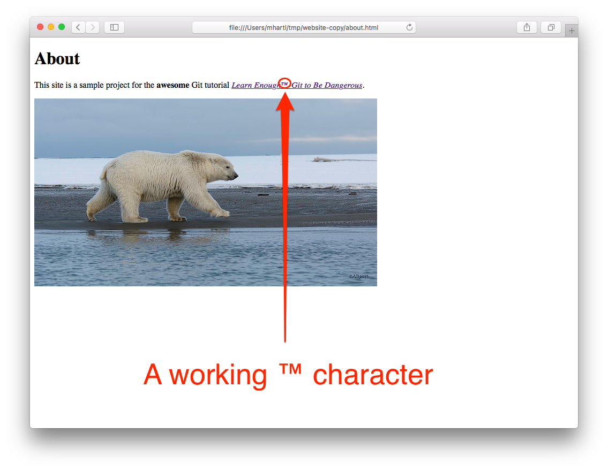

Figure 59: Confirming a working trademark character.

Confident that his solution is correct, Bob can now make a commit and push the fix up to the remote server:


```
[website-copy (fix-trademark)]$ git commit -am "Fix trademark character display"
[website-copy (fix-trademark)]$ git push
```

With that, Bob sends a note to Alice that the fix is pushed, and heads out for some well-deserved rest ([Figure](http://www.learnenough.com/git-tutorial#fig-beach_relaxing)).[35](http://www.learnenough.com/git-tutorial#cha-0_footnote-35)


Figure 60: Bob’s reward for a job well-done.

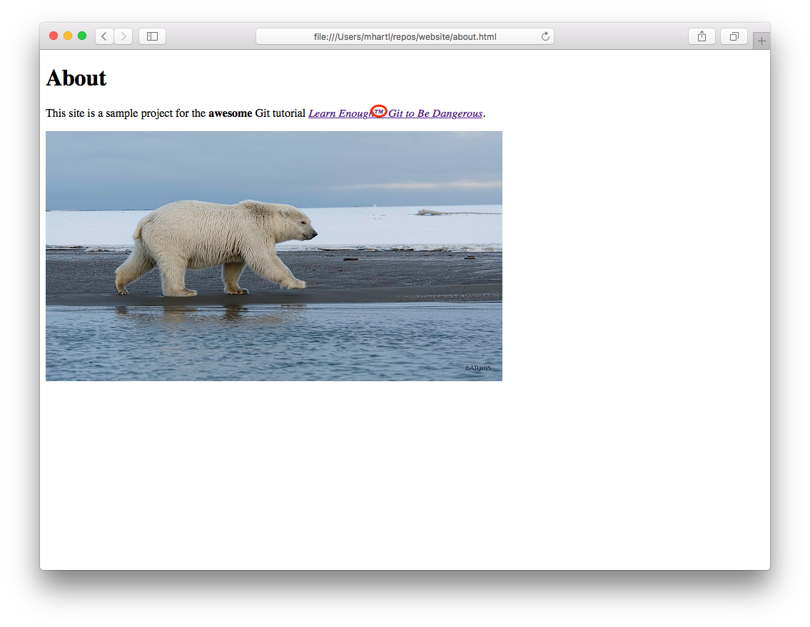

Figure 61: Reconfirming the trademark fix before merging.

Alice, now back from her tea party, gets Bob’s note and pulls in his fix:


```
[website (fix-trademark)]$ git pull
```

She refreshes her browser to confirm that the ™ character displays properly on her end of things ([Figure](http://www.learnenough.com/git-tutorial#fig-working_trademark_confirmed)), and then merges the changes into `master`:


```
[website (fix-trademark)]$ git checkout master
[website (master)]$ git merge fix-trademark
[website (master)]$ git push
```

With the final `git push`, Alice arranges for the remote `master` branch on GitHub to get the fix. (Syncing up Bob’s `master` branch is left as an exercise ([Section 4.3.1](http://www.learnenough.com/git-tutorial#sec-exercises_pushing_branches)).)

Of course, `git push` publishes the change only to a remote Git repository. Wouldn’t it be nice if there were a way to confirm that the ™ character—and the rest of the website—displays correctly on the live Web?

#### [Exercises](http://www.learnenough.com/git-tutorial#sec-exercises_pushing_branches)

1. Bob’s `master` branch doesn’t currently have Alice’s merge, so check out `master` as Bob and do a `git pull`. Confirm using `git log` that Alice’s merge commit is now present.
2. Delete the `fix-trademark` branch locally. Do you need to use the `-D` option ([Section 3.3.2](http://www.learnenough.com/git-tutorial#sec-exercises_branching_and_merging)), or is `-d` sufficient?
3. Delete the remote `fix-trademark` branch on GitHub. *Hint*: If you get stuck, [Google for it](http://lmgtfy.com/?q=git+delete+remote+branch).

### [A surprise bonus](http://www.learnenough.com/git-tutorial#sec-a_surprise_bonus)

As hinted at the end of the last section, it would be nice to be able to confirm that the new character encoding works on a live web page. But this requires knowing how to deploy a live site to the Web, and that’s beyond the scope of a humble Git tutorial, right? Amazingly, the answer is no. The reason is that GitHub offers a free service called *GitHub Pages*, and *any* repository at GitHub that contains static HTML is automatically available as a live website.

There is one minor prerequisite to using GitHub Pages, which is that you have to [verify your email address](https://help.github.com/articles/verifying-your-email-address) with GitHub. Once you’ve done that, though, all you need to do is make and push a branch called `gh-pages`:

```
[website (master)]$ git checkout -b gh-pages
[website (gh-pages)]$ git push -u origin gh-pages
```

That’s it! Our website is now available at the URL

```
http://<username>.github.io/website/
```

where `<username>` is your GitHub username. Since my username is `mhartl`, my copy of the this tutorial’s website is at [mhartl.github.io/website/](http://mhartl.github.io/website), as shown in [Figure](http://www.learnenough.com/git-tutorial#fig-production_website).

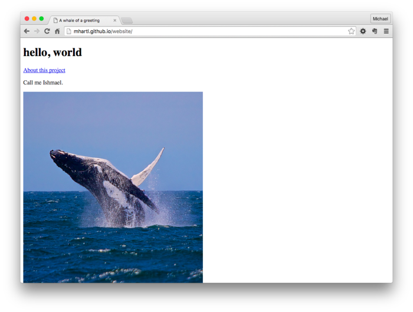

Figure 62: A production website at GitHub Pages.

Note that the URL `http://<username>.github.io/website/` automatically displays `index.html`, which is the usual convention on the web: the index page is understood to be the default, so there’s no need to type it in. This is not the case with other pages, though, and if you follow the link to the About page you’ll see that the filename appears in the address bar ([Figure](http://www.learnenough.com/git-tutorial#fig-production_about_page)). You’ll also see in [Figure](http://www.learnenough.com/git-tutorial#fig-production_about_page) that the trademark character ™ renders correctly on a live website, just as we hoped it would.

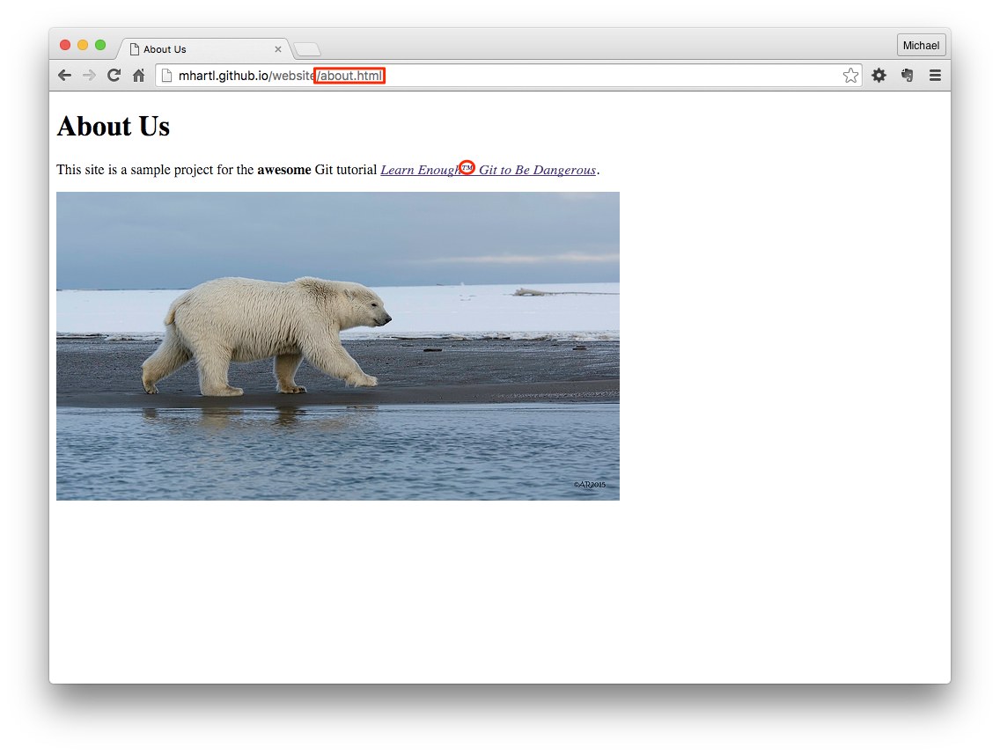

Figure 63: The About page in production.

Because static HTML pages by definition don’t change from one page view to the next, GitHub can [*cache*](https://en.wikipedia.org/wiki/Web_cache) them efficiently, which makes GitHub Pages sites both fast and cheap to serve (which is why GitHub can afford to offer them for free). This means that such sites can handle a potentially huge amount of traffic, making Pages suitable for production websites. The example website in this tutorial is really just a toy, but it’s a great start, and we’ll build on this foundation to make a nearly industrial-grade website in [*Learn Enough™ HTML to Be Dangerous*](http://learnenough.com/html-tutorial) and a fully industrial-grade site in [*Learn Enough™ CSS & Layout to Be Dangerous*](http://www.learnenough.com/css-and-layout-tutorial).

#### [Exercises](http://www.learnenough.com/git-tutorial#sec-exercises_surprise_bonus)

1. On the About page, add a link back to `index.html`. Commit and push your change and verify that the link works on the production site.
2. As [covered](https://www.learnenough.com/command-line-tutorial#sec-renaming_copying_deleting) in [*Learn Enough™ Command Line to Be Dangerous*](http://learnenough.com/command-line-tutorial), two of the most important Unix commands are `mv` and `rm`. Git provides analogues of these commands, which have the same effect on local files while also arranging to track the changes. Experiment with these commands via the following sequence: Create a file with some [*lorem ipsum*](http://lipsum.com/) text, add & commit it, rename it with `git mv` & commit, then remove it with `git rm` and commit again. Examine the results of `git log -p` to see how Git handled the operations.
3. To practice the process of making a new Git repository, make a second project called `second_website` in the `repos` directory. Create an `index.html` file with the content “hello, again!” and follow the steps (starting in [Section](http://www.learnenough.com/git-tutorial#sec-initializing_the_repo)) needed to deploy it to the live Web.
4. Make a third, secret project called `secret_project`. Touch files called `foo`, `bar`, and `baz` in the main project directory, and then follow the steps to initialize the repository and commit the initial results. Then, instead of pushing to a public repository at GitHub, create a free *private* repository at [Bitbucket](http://bitbucket.org/). (You may have to [sign up for a Bitbucket account](https://bitbucket.org/account/signup/) and [share the SSH keys](http://lmgtfy.com/?q=bitbucket+ssh+keys) you created in [Section](http://www.learnenough.com/git-tutorial#sec-github).) The result will be a repository suitable for securely sharing with private collaborators.

### [Summary](http://www.learnenough.com/git-tutorial#sec-summary_collaborating)

Important commands from this section are summarized in [Table](http://www.learnenough.com/git-tutorial#table-collaborating).

|  |  |  |
| --- | --- | --- |
| **Command** | **Description** | **Example** |
| git clone <URL> | Copy repo (incl. full history) to local disk | `$ git clone https://ex.co/repo.git` |
| git pull | Pull in changes from remote repository | `$ git pull` |
| git branch -a | List all branches | `$ git branch -a` |
| git checkout <br> | Check out remote branch and configure for push | `$ git checkout fix-trademark` |
| gh-pages | Branch name for production website | `$ git push -u origin gh-pages` |

Table 4: Important commands from [Section](http://www.learnenough.com/git-tutorial#sec-collaborating).

## [Conclusion](http://www.learnenough.com/git-tutorial#sec-conclusion)

Congratulations! You now know enough Git to be *dangerous*. There’s a lot more to learn, and if you continue down this technical path you’ll keep getting better at using Git for years to come, but with the material in this tutorial you’ve got a great start. For now, you’re probably best off working with what you’ve got, applying your technical sophistication ([Box](http://www.learnenough.com/git-tutorial#aside-technical_sophistication)) when necessary. Once you’ve gotten a little more experience under your belt, I recommend seeking out additional resources. Here are some suggestions for getting started:

At this point, you have completed the **Learn Enough™ Developer Fundamentals** and are in an excellent position to collaborate with millions of software developers around the world. You are also well on your way to becoming a developer yourself. Regardless of your ultimate goals, you can continue improving your dev skills with the rest of the core Learn Enough™ sequence:

Good luck!

*Learn Enough™ Git to Be Dangerous*. Copyright © 2016 by Michael Hartl.

## Stay in Touch

Joining the email list for this article will allow the author to contact you to let you know about special offers and when new tutorials launch

1. Copyright © Randall Munroe and used unaltered under the terms of the [Creative Commons Attribution-NonCommercial 2.5 Generic](https://creativecommons.org/licenses/by-nc/2.5/) license. [↑](http://www.learnenough.com/git-tutorial#cha-0_footnote-ref-1)
2. Pun intended. If you don’t get it, don’t worry—by the end of this tutorial, you will. [↑](http://www.learnenough.com/git-tutorial#cha-0_footnote-ref-2)
3. [*Git*](https://en.wikipedia.org/wiki/Git_(slang)) is a mildly insulting British slang term for a stupid or annoying person, and Linus likes to joke that he named both Linux and Git after himself. [↑](http://www.learnenough.com/git-tutorial#cha-0_footnote-ref-3)
4. Copyright © Randall Munroe and used unaltered under the terms of the [Creative Commons Attribution-NonCommercial 2.5 Generic](https://creativecommons.org/licenses/by-nc/2.5/) license. The advice in [Figure](http://www.learnenough.com/git-tutorial#fig-xkcd_git) to delete your project and download a fresh copy is a joke. You shouldn’t follow it. Probably. [↑](http://www.learnenough.com/git-tutorial#cha-0_footnote-ref-4)
5. The `which` command is discussed [here](https://www.learnenough.com/command-line-tutorial#sec-downloading_a_file) in [*Learn Enough™ Command Line to Be Dangerous*](http://learnenough.com/command-line-tutorial). [↑](http://www.learnenough.com/git-tutorial#cha-0_footnote-ref-5)
6. Image is a common Internet meme [↑](http://www.learnenough.com/git-tutorial#cha-0_footnote-ref-6)
7. [*Learn Enough™ HTML to Be Dangerous*](http://learnenough.com/html-tutorial) and [*Learn Enough™ CSS & Layout to Be Dangerous*](http://www.learnenough.com/css-and-layout-tutorial) build on this foundation to make more complicated sites. [↑](http://www.learnenough.com/git-tutorial#cha-0_footnote-ref-7)
8. As we’ll learn in more detail in [Section](http://www.learnenough.com/git-tutorial#sec-branching_and_merging), branches are effectively copies of the project where we can make changes safely in isolation from any other copies. [↑](http://www.learnenough.com/git-tutorial#cha-0_footnote-ref-8)
9. Copyright © Randall Munroe and used unaltered under the terms of the [Creative Commons Attribution-NonCommercial 2.5 Generic](https://creativecommons.org/licenses/by-nc/2.5/) license. [↑](http://www.learnenough.com/git-tutorial#cha-0_footnote-ref-9)
10. Copyright © Randall Munroe and used unaltered under the terms of the [Creative Commons Attribution-NonCommercial 2.5 Generic](https://creativecommons.org/licenses/by-nc/2.5/) license. [↑](http://www.learnenough.com/git-tutorial#cha-0_footnote-ref-10)
11. SSH, or *Secure Shell*, lets you run a Unix shell on a remote computer (such as a Linux webserver). The `ssh` program is often used as a verb, as in “Just ssh into the server and reboot the machine.” [↑](http://www.learnenough.com/git-tutorial#cha-0_footnote-ref-11)
12. Image retrieved from https://www.flickr.com/photos/hintsa/483303703 on 2016-01-01. Copyright © 2006 by Mark Hintsa and used unaltered under the terms of the [Creative Commons Attribution-NonCommercial 2.0 Generic](https://creativecommons.org/licenses/by-nc/2.0/) license. [↑](http://www.learnenough.com/git-tutorial#cha-0_footnote-ref-12)
13. [*Alice’s Adventures in Wonderland*](https://www.cs.indiana.edu/metastuff/wonder/ch1.html) original illustrations by John Tenniel. Image retrieved from http://www.alice-in-wonderland.net/resources/pictures/alices-adventures-in-wonderland/ on 2016-01-04. Copyright © 1865, now in the public domain. [↑](http://www.learnenough.com/git-tutorial#cha-0_footnote-ref-13)
14. Atom comes with a built-in Markdown previewer, but [recall](http://www.learnenough.com/text-editor-tutorial#sec-customization) from [*Learn Enough™ Text Editor to Be Dangerous*](http://learnenough.com/text-editor-tutorial) that editors such as Sublime Text often have installable Markdown Preview packages as well. [↑](http://www.learnenough.com/git-tutorial#cha-0_footnote-ref-14)
15. This involves converting the `#` in [Listing](http://www.learnenough.com/git-tutorial#code-readme) to a top-level heading (the `h1` we first saw in [Section](http://www.learnenough.com/git-tutorial#sec-adding_a_tag)) and converting each Markdown link of the form `[content](address)` into an HTML *anchor* tag `a`, which we’ll meet in [Section](http://www.learnenough.com/git-tutorial#sec-branching_and_merging). [↑](http://www.learnenough.com/git-tutorial#cha-0_footnote-ref-15)
16. Image retrieved from https://www.flickr.com/photos/28883788@N04/10097824543 on 2015-12-26. Copyright © 2013 by Denis Hawkins and used unaltered under the terms of the [Creative Commons Attribution-NoDerivs 2.0 Generic](https://creativecommons.org/licenses/by-nd/2.0/) license. [↑](http://www.learnenough.com/git-tutorial#cha-0_footnote-ref-16)
17. This happened to me when I ran `open images/` while writing [Section](http://www.learnenough.com/git-tutorial#sec-commit_push_repeat), which is what reminded me I should cover it here. [↑](http://www.learnenough.com/git-tutorial#cha-0_footnote-ref-17)
18. Wildcards are [discussed](https://www.learnenough.com/command-line-tutorial#sec-listing) in [*Learn Enough™ Command Line to Be Dangerous*](http://learnenough.com/command-line-tutorial), as in the command `ls *.txt`. [↑](http://www.learnenough.com/git-tutorial#cha-0_footnote-ref-18)
19. This common practice is further evidence of the ubiquity of Git—at this point, many projects simply assume you’re using it. [↑](http://www.learnenough.com/git-tutorial#cha-0_footnote-ref-19)
20. I use `git checkout` for maximum compatibility, but recall that I usually use the shortcut `git co` as described in [Section](http://www.learnenough.com/git-tutorial#sec-installation_and_setup). [↑](http://www.learnenough.com/git-tutorial#cha-0_footnote-ref-20)
21. Of course, it would be potentially inefficient to copy all the files over to the new branch, since there’s usually a lot overlap with the old one. To avoid any unnecessary duplication, Git tracks diffs rather than actually making full copies of all files. [↑](http://www.learnenough.com/git-tutorial#cha-0_footnote-ref-21)
22. If you implemented the third line in [Listing](http://www.learnenough.com/git-tutorial#code-global_config), you could type the even more compact `git co m⇥`. [↑](http://www.learnenough.com/git-tutorial#cha-0_footnote-ref-22)
23. The command `git reset --hard HEAD` is equivalent, but I find the version with `checkout` to be easier to remember. [↑](http://www.learnenough.com/git-tutorial#cha-0_footnote-ref-23)
24. The most powerful way to track down such errors is `git bisect`. This advanced technique is covered in the [Git documentation](https://git-scm.com/docs/git-bisect). [↑](http://www.learnenough.com/git-tutorial#cha-0_footnote-ref-24)
25. This `less` navigation trick is [described](https://www.learnenough.com/command-line-tutorial#sec-less_is_more) in [*Learn Enough™ Command Line to Be Dangerous*](http://learnenough.com/command-line-tutorial). [↑](http://www.learnenough.com/git-tutorial#cha-0_footnote-ref-25)
26. Note that [Listing](http://www.learnenough.com/git-tutorial#code-gcl) uses `--force` in place of `-f`. When using the command line, I prefer to use short forms like `-f`, but in aliases and other source code I prefer to use the long form for clarity. [↑](http://www.learnenough.com/git-tutorial#cha-0_footnote-ref-26)
27. Image retrieved from https://www.flickr.com/photos/11325321@N08/7194585552 on 2016-01-05. Copyright © 2012 by Jenny Park and used unaltered under the terms of the [Creative Commons Attribution 2.0 Generic](https://creativecommons.org/licenses/by/2.0/) license. [↑](http://www.learnenough.com/git-tutorial#cha-0_footnote-ref-27)
28. Image retrieved from https://www.flickr.com/photos/f\_rabelais/23685328246 on 2016-01-05. Copyright © 2015 by F. Rabelais and used unaltered under the terms of the [Creative Commons Attribution 2.0 Generic](https://creativecommons.org/licenses/by/2.0/) license. [↑](http://www.learnenough.com/git-tutorial#cha-0_footnote-ref-28)
29. The idea behind a temp directory is to have a place to put temporary files that won’t necessarily persist for long. Many operating systems have a system-wide temp directory (often called `/tmp`), but also I like to have one under my home directory for personal use. [↑](http://www.learnenough.com/git-tutorial#cha-0_footnote-ref-29)
30. Image retrieved from https://www.flickr.com/photos/puliarfanita/22959238329 on 2015-12-28. Copyright © 2015 by Anita Ritenour and used unaltered under the terms of the [Creative Commons Attribution 2.0 Generic](https://creativecommons.org/licenses/by/2.0/) license. [↑](http://www.learnenough.com/git-tutorial#cha-0_footnote-ref-30)
31. [Listing](http://www.learnenough.com/git-tutorial#code-breaching_whale_alt) and [Listing](http://www.learnenough.com/git-tutorial#code-whale_alt) include the attribution link added in [Section 4.1.1](http://www.learnenough.com/git-tutorial#sec-exercises_clone_push_pull). [↑](http://www.learnenough.com/git-tutorial#cha-0_footnote-ref-31)
32. [*Alice’s Adventures in Wonderland*](https://www.cs.indiana.edu/metastuff/wonder/ch1.html) original illustrations by John Tenniel. Image retrieved from http://www.alice-in-wonderland.net/resources/pictures/alices-adventures-in-wonderland/ on 2016-01-04. Copyright © 1865, now in the public domain. [↑](http://www.learnenough.com/git-tutorial#cha-0_footnote-ref-32)
33. In fact, `git branch --all` works, but when using Git at the command line it’s more common to use the short forms of the options. [↑](http://www.learnenough.com/git-tutorial#cha-0_footnote-ref-33)
34. Note that, because `fix-trademark` doesn’t yet exist locally, its name can’t be tab-completed in this step, so Bob (and you) will have to type out “fix-trademark” by hand. [↑](http://www.learnenough.com/git-tutorial#cha-0_footnote-ref-34)
35. Image retrieved from https://www.flickr.com/photos/rtadlock/2716877199 on 2016-01-06. Copyright © 2008 by Robert Tadlock and used unaltered under the terms of the [Creative Commons Attribution 2.0 Generic](https://creativecommons.org/licenses/by/2.0/) license. [↑](http://www.learnenough.com/git-tutorial#cha-0_footnote-ref-35)
