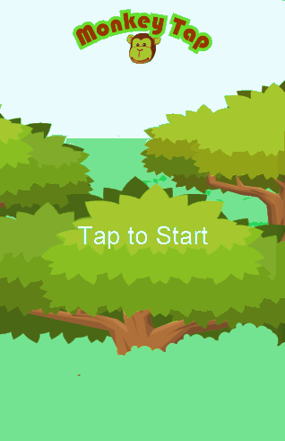
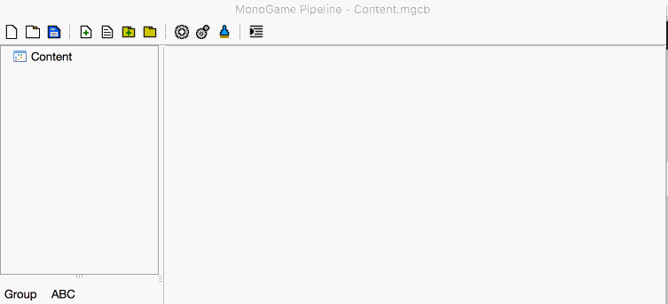
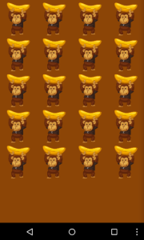

# Build Your First Game with MonoGame

Game development is what got many developers into programming. But how many of us actually ever learned how to create games? Creating games can be challenging, but it doesn’t have to be that way! MonoGame is a [cross-platform gaming framework](http://www.monogame.net/) based on Microsoft’s XNA framework that’s extremely easy to learn. Best of all, games you build with MonoGame will run on iOS, Android, Mac OS X, tvOS, Windows, Linux, PlayStation 4, and more—write once, play anywhere.

In this blog post, we’re going to walk through each step required to create your first game from start to finish, creating a user interface to [adding game logic](https://blog.xamarin.com/building-your-first-game-with-monogame-finishing-the-app/). The object of the game is to tap the monkeys as they appear to keep them from running off with your bananas. If you leave any monkey untapped for more than five seconds, the monkey takes your bananas, and the game is over! Think of it as Whack-a-Mole, but with monkeys!

## File -> New Game

To get started, we first need to make sure we have both [Xamarin](http://xamarin.com/download) and the [latest development build of MonoGame](http://www.monogame.net/downloads/) installed. For this tutorial, we will be using Xamarin Studio, though the exact same steps apply when building games with MonoGame in Visual Studio as well.

First, we need to create a shared project where our game logic will reside that can also be shared with all target platforms we want our game to run on. Within Xamarin Studio, choose File -> New Solution -> MonoGame -> Library -> MonoGame Shared Library and name the project MonkeyTap. We must add projects for all of the platforms we wish to target.

Add a “MonoGame for Android Application” project to the solution and name it MonkeyTap.Android. If our game needed to take advantage of native Android features, such as NFC, the platform-specific project is the place to do so. Because our game doesn’t utilize any of these components, we can delete the `Game1` class created in the Android project and add a reference to the shared project we just created earlier.

Hit F5 or Cmd+Enter to run the app on your selected emulator or the Xamarin Android Player. You should see a lovely blue screen. Now that our solution is properly configured, it’s time to get started writing our game!

## Anatomy of a Game

Many different components work together to create a game. The `Game1` class contains the main logic for our game, and is made up five main methods. Each serves its own purpose in making sure a game functions properly, from displaying art and playing sound effects to responding to user input and executing game logic. `Game1` is made up of five main methods:

- Constructor
- Initialize
- LoadContent
- Update

The constructor and `Initialize` methods are used to perform any initializations the game needs before starting to run. `LoadContent` is for loading up any game content, such as textures, sounds, shaders, and other graphical or audio components. `Update` is used to update any game logic you have while your game executes (gathering user input or updating the world), while `Draw` should exclusively be used to draw any graphics that need displaying.

## Adding Game Assets

No game is complete without textures and sound effects, known in game development as “content” or “assets”. Most gaming frameworks have a content pipeline, which is just used to take raw assets and turn them into an optimized format for your game. The `Content.mgcb` file in the *Content folder* is MonoGame’s content pipeline. Anything added to this file will be optimized and included in your final application package.

All game assets should be shared between any target platforms. Drag the *Content directory* from the Android project to the shared project. Ensure the *Build Action* of the `Content.mgcb` file is set to `MonoGameContentReference`. If this build action does not appear in the drop down, right-click the `Content.mcgb` file, select *Properties*, and manually enter the text to `MonoGameContentReference`. [Download the *MonkeyTap* assets](https://github.com/infinitespace-studios/Monkey.Tap/blob/master/Assets.zip) and extract them into the *Content folder* in the Shared Project.

MonoGame has a special Pipeline Editor to make it super easy to work with game assets. Double-click the `Content.mgcb` file to open the Pipeline Editor. Next, add the asset files you just downloaded as seen below:

Now that our game content is optimized for use in our application, we can use the assets in our game.

## Creating *MonkeyTap* User Interface

Loading game assets is done through a `ContentManager`, which is exposed by default via the “Content” property of the `Game` class. First, let’s import some necessary namespaces and declare fields to store our game assets:

|  |  |
| --- | --- |
|  | usingSystemCollectionsGeneric  usingMicrosoftFrameworkAudio  usingMicrosoftFrameworkInputTouch  usingMicrosoftFrameworkMedia  publicclassGame1  GraphicsDeviceManager graphics  SpriteBatch spriteBatch  Texture2D monkey  Texture2D background  Texture2D  SpriteFont  SoundEffect  title |

Next, we need to load our assets. Add the following code to your `LoadContent` method, which is where all assets should be loaded in MonoGame:

|  |  |
| --- | --- |
|  | monkeyContent"monkey"  backgroundContent"background"  Content"logo"  Content"font"  Content"hit"  titleContent"title"  MediaPlayerIsRepeating  MediaPlayertitle |

All of our content is now loaded, from textures to audio. Now that we have loaded our content, it’s time to draw the user interface on the screen. The `SpriteBatch` class is used to draw 2D images and text. To make rendering as efficient as possible, drawing is batched together and sprites must be drawn between the `Begin` and `End` methods of `SpriteBatch`. Update the `Draw` method to draw our monkey texture on the screen using the `spriteBatch` field we just created:

|  |  |
| --- | --- |
|  | protectedoverrideGameTime gameTime  graphicsGraphicsDeviceClearColorCornflowerBlue  spriteBatchBegin  spriteBatchmonkeyVector2  spriteBatch  gameTime |

Hit F5 or Cmd+Enter to run the application. You should see the monkey smiling with his banana and hear the [music from Jason Farmer](https://twitter.com/thecacktus) we set to play in `LoadContent`. Now that our game assets are loading, let’s build the rest of the user interface for playing *MonkeyTap*!

## Building the *MonkeyTap* User Interface

Traditional Whack-a-Mole style games have moles that randomly appear on screen and must be tapped to disappear. Rather than randomly rendering monkeys on the screen, we can use a grid to help ensure that the monkeys don’t overlap to provide a consistent user experience. The grid is made up of multiple cells, each of which contains a rectangle, color, countdown timer, and transition value that will be used to fade the monkey in. Copy and paste the following `GridCell` class into the Game1.cs file:

|  |  |
| --- | --- |
|  | publicclassGridCell  publicRectangle DisplayRectangle  publicColor Color  publicTimeSpan CountDown  publicfloatTransition  publicGridCell  Reset  publicUpdateGameTime gameTime  ColorColorWhite  TransitionfloatgameTimeElapsedGameTimeTotalMilliseconds  CountDowngameTimeElapsedGameTime  CountDownTotalMilliseconds<=  return  returnfalse  publicReset  ColorColorTransparentBlack  CountDownTimeSpanFromSeconds  Transition  public  ColorColorWhite  CountDownTimeSpanFromSeconds |

The `Reset` method is used to reset the cell back to its default state where the monkey is hidden. This is called when the user taps a monkey. is used to set the timer to five seconds when the monkey appears onscreen. The `Update` method is called each frame to update the countdown timer, and helps us to figure out if a user has not tapped the monkey within the given five second timeframe.

Now that cells are defined, let’s define the grid. Create a new `List` field called grid:

Add the following code to the `LoadContent` method to calculate the display rectangles for the cell:

|  |  |
| --- | --- |
|  | viewportgraphicsGraphicsDeviceViewport  paddingviewportWidth  gridWidthviewportWidthpadding  gridHeightgridWidth  paddinggridHeightgridHeightpadding  paddingviewportWidthgridWidthgridWidthpadding  GridCell  DisplayRectangleRectanglegridWidthgridHeight |

If you want your game to look good on all form factors, you need to take screen size into account, rather than hardcode positional values. `GraphicsDevice.ViewPort` provides us with a dynamic way to work with different form factors. In the code above, we add 10% of the screen width as padding to between the cells and calculate a width and height for the grid using the same property. We then loop through the (x,y) coordinates for each row and column and calculate the display rectangle.

Replace the `Draw` method with the code to draw our monkeys:

|  |  |
| --- | --- |
|  | protectedoverrideGameTime gameTime  graphicsGraphicsDeviceClearColorSaddleBrown  spriteBatchBegin  foreachsquare  spriteBatchmonkeydestinationRectanglesquareDisplayRectanglecolorColorWhite  spriteBatch  gameTime |

Finally, we want our game to run only in Portrait, so add the following code to the constructor:

|  |  |
| --- | --- |
|  | graphicsSupportedOrientationsDisplayOrientationPortrait |

Run the app, and you should see a grid full of monkeys!

With that, our [user interface](https://github.com/infinitespace-studios/Monkey.Tap/) for our game built with MonoGame is complete. Follow our next post on [adding game logic](https://blog.xamarin.com/building-your-first-game-with-monogame-finishing-the-app/) to complete your first game!
