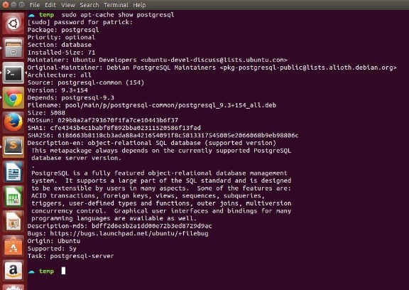
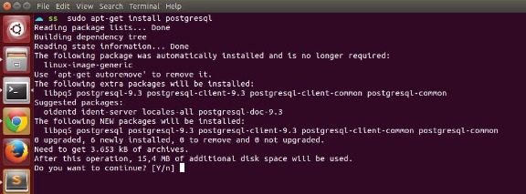
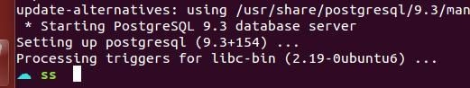
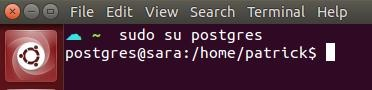
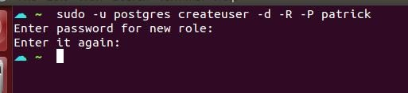

# Instalando o PostgreSQL 9.3 no Ubuntu 14.04 LTS


Na data atual deste post, a versão mais recente do PostgreSQL é a 9.3.

Para checar a versão atual disponível no seu Ubuntu faça o seguinte:

```
sudo apt-get update
sudo apt-cache show postgresql
```

Abaixo, como podem ver **Version: 9.3.+154**



## Instalando

Utilizando os recursos padrões do Ubuntu, neste caso o `apt-get`, siga os passos abaixo para instalar o PostgreSQL:

```
sudo apt-get install postgresql
```



No final da instalação, deve aparecer uma informação no terminal dizendo que o PostgreSQL foi iniciado, como na imagem abaixo:



Pronto!

O PostgreSQL está instalado, agora vamos configurá-lo.

## Configurando

### Senha do usuário postgres

Agora vamos alterar a senha do usuário **postgres** que é criado por padrão durante a instalação.

Para isso, alterne para o usuário utilizando o comando abaixo:

```
sudo su postgres
```

Deve aparecer algo como isso:



Agora, vamos entrar no console do **psql** (como se fosse o `mysql -uroot -p`, entendeu?):

```
psql -d postgres -U postgres psql
```

Então digite o comando abaixo para alterar a senha:

```
ALTER USER postgres with PASSWORD 'SENHA_QUE_VOCE_DESEJA_AQUI';
```

Deve aparecer algo como:

```
postgres=# ALTER USER postgres with PASSWORD 'novasenha';
ALTER ROLE
postgres=#
```

Para sair do **psql** digite `\q` e pressione enter.

### Acesso remoto

Abra o arquivo `postgresql.conf` localizado em `/etc/postgrseql/9.3/main/postgresql.conf` e altere a seguinte linha:

```
# listen_address = 'localhost'
```

Para...

```
# listen_address = '*'
```

Salve, feche o arquivo e reinice o database:

```
sudo service postgresql restart
```

Com isso você está garantindo o acesso remoto ao database.

### Permissões para outros usuários

Abra o arquivo `pg_hba.conf` e altere as linhas conforme mencionado abaixo.

A alteração deve ser da palavra **peer** por **md5**.

```
# Database administrative login by Unix domain socket
local   all             postgres                                peer

# TYPE  DATABASE        USER            ADDRESS                 METHOD

# "local" is for Unix domain socket connections only
local   all             all                                     peer
# IPv4 local connections:
host    all             all             127.0.0.1/32            md5
# IPv6 local connections:
host    all             all             ::1/128                 md5
```

Neste caso, ficará assim:

```
# Database administrative login by Unix domain socket
local   all             postgres                                md5

# TYPE  DATABASE        USER            ADDRESS                 METHOD

# "local" is for Unix domain socket connections only
local   all             all                                     md5
# IPv4 local connections:
host    all             all             127.0.0.1/32            md5
# IPv6 local connections:
host    all             all             ::1/128                 md5
```

Salve, feche e reinicie o database.

```
sudo service postgresql restart
```

Explicando resumidamente o que foi feito:

- O tipo de conexão **peer**, possibilita qualquer usuário do Ubuntu a conectar no postgres caso haja um database com o nome dele, ou seja: se existe um database com o nome **patrick**, o usuário **patrick** pode conectar no postgres apenas digitando: `psql`, sem a necessidade de informar qualquer parâmetro.
- Já o tipo **md5**, força o usuário a conectar utilizando um usuário e senha do postgres (explicando de maneira incrivelmente resumida).

## Configurando um novo usuário

Caso queira trabalhar com um usuário diferente e/ou outros desenvolvedores acessem a sua máquina, faça o seguinte:

1 - Alternando o usuário do terminal para *postgres*

```
sudo su - postgres
```

2 - Inicie o console do PostgreSQL com o usuário atual (postgres)

```
sudo -u postgres createuser -d -R -P NOME_DO_USUARIO
```

Deve te retornar algo como:



Agora vamos criar um **novo database** para este usuário:

```
sudo -u postgres createdb -O NOME_DO_USUARIO NOME_DO_DATABASE
```

Pronto! Agora você tem 1 novo usuário, e um database vinculado a ele.

### Bônus: permissão para um novo usuário

Vamos dizer, que você quer criar um usuário específico para um novo desenvolvedor da sua equipe, e então dar permissão pra ele em um database existente. Para isso, basta fazer o seguinte:

1 - Crie o usuário do novo desenvolvedor:

```
sudo -u postgres createuser -d -R -P usuario_do_desenvolvedor
```

2 - Após isso, entre no postgres com um super usuário (o seu ou o próprio "postgres"):

```
psql --username=postgres --password
```

3 - Dê permissão para este usuário acessar um database específico:

```
GRANT ALL PRIVILEGES ON DATABASE database_desejado TO usuario_do_desenvolvedor;
```

4 - Pronto! Agora o desenvolvedor pode acessar este database de duas formas:

4.1 - Pelo terminal: `psql --username=usuario_do_desenvolvedor --password --dbname=database_desejado`

4.2 - Ou utilizando qualquer outro software, como: **PgAdmin, PhpPgAdmin, etc**.

---

Espero ter ajudado.

Qualquer dúvida, deixem um comentário abaixo.
