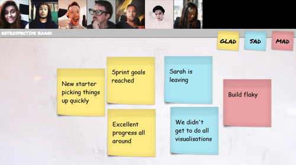
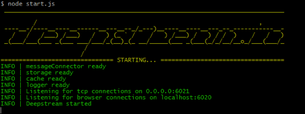
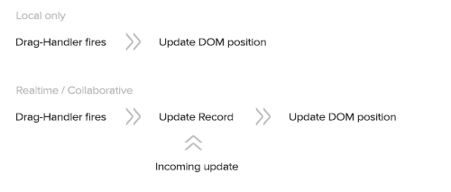
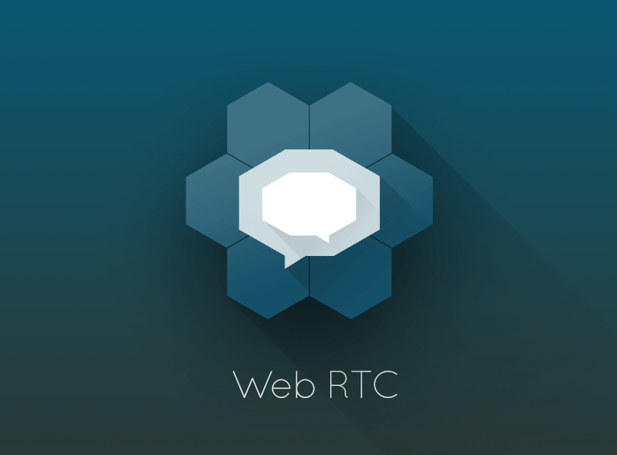
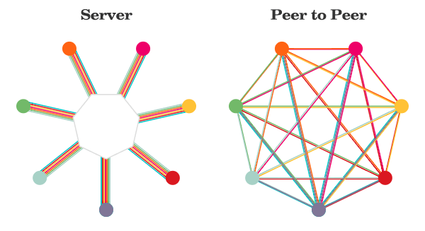

# Building A Real-Time Retrospective Board With Video Chat

Advertisement

[](https://auslieferung.commindo-media-ressourcen.de/www/delivery/ck.php?oaparams=2__bannerid=12885__zoneid=22__OXLCA=1__cb=5d6e817127__oadest=https%3A%2F%2Fwww.untapt.com%2F%3Futm_campaign%3D16-03-smash-content%26utm_source%3Dsmcontent)

If you’ve ever worked in an agile environment, chances are you’ve had your share of “retrospectives” — meetings where people write what made them “glad,” “mad” or “sad” onto different-colored notes, post them onto a board, arrange them in groups and — most importantly — talk about them.

These meetings are straightforward, as long as everyone is in the same room. But if you’re working with a locally distributed team, things can get a bit tricky. Let’s address this by creating a virtual version of our board to allow team members in different locations to hold their retrospective just as if they were in the same room.

[](https://media-mediatemple.netdna-ssl.com/wp-content/uploads/2016/01/01-realtime-retrospective-board-opt.png)[1](https://www.smashingmagazine.com/2016/03/building-a-real-time-retrospective-board-with-video-chat/?utm_source=nodeweekly&utm_medium=email#1)  

The final retrospective board with video chat. ([View large version](https://media-mediatemple.netdna-ssl.com/wp-content/uploads/2016/01/01-realtime-retrospective-board-opt.png)[2](https://www.smashingmagazine.com/2016/03/building-a-real-time-retrospective-board-with-video-chat/?utm_source=nodeweekly&utm_medium=email#2))

Our “virtual retrospective board” needs to allow team members to:

- create, edit and move sticky notes;
- sync the current state of the board in real time between all team members;
- talk about the board via video chat.

It also needs to:

- make sure users log in with the right password.

To achieve this, we’ll be using:

- a bit of [jQuery](http://jquery.com/)[3](https://www.smashingmagazine.com/2016/03/building-a-real-time-retrospective-board-with-video-chat/?utm_source=nodeweekly&utm_medium=email#3) (chances are you’ll pick your M\*C framework of choice, but let’s keep things simple);
- [deepstream](http://deepstream.io/)[25](https://www.smashingmagazine.com/2016/03/building-a-real-time-retrospective-board-with-video-chat/?utm_source=nodeweekly&utm_medium=email#25)[4](https://www.smashingmagazine.com/2016/03/building-a-real-time-retrospective-board-with-video-chat/?utm_source=nodeweekly&utm_medium=email#4) (an open-source Node.js server that comes with all sorts of real-time functionality, like pub-sub, remote procedure calls and, most importantly for our sticky-notes board, data sync and WebRTC for video communication).

One more thing:

### Let’s Fire Up The Server [Link](https://www.smashingmagazine.com/2016/03/building-a-real-time-retrospective-board-with-video-chat/?utm_source=nodeweekly&utm_medium=email#lets-fire-up-the-server)

Simply install deepstream via `npm install deepstream.io`, and create a file (for example, `start.js`) with the following content:

```
 DeepstreamServer  require 'deepstream.io' 
 tutorialServer   DeepstreamServer
tutorialServer 'host' 'localhost' 
tutorialServer 'port'  
tutorialServerstart
```

Run it with `node start.js`, and you should see this:

[](https://media-mediatemple.netdna-ssl.com/wp-content/uploads/2016/01/02-deepstream-console-output-opt.png)[6](https://www.smashingmagazine.com/2016/03/building-a-real-time-retrospective-board-with-video-chat/?utm_source=nodeweekly&utm_medium=email#6)  

The output from deepstream’s startup console. ([View large version](https://media-mediatemple.netdna-ssl.com/wp-content/uploads/2016/01/02-deepstream-console-output-opt.png)[7](https://www.smashingmagazine.com/2016/03/building-a-real-time-retrospective-board-with-video-chat/?utm_source=nodeweekly&utm_medium=email#7))

Nice. Now, let’s stop it again. What, why? Well, at the moment, our server is open to the world. Anyone can connect to it and learn what happened in our retrospective. Let’s make sure that every user connecting to deepstream at least knows the password, `sesame`. To do this, we need to register a `permissionHandler` — an object that checks whether a client is allowed to log in and whether it may perform a certain action. So, let’s use the same `tutorialServer.set()` method we’ve used before.

```
tutorialServer 'permissionHandler' 
  isValidUser function connectionData authData callback  
    // We don't care what the user name is, 
    // as long as one is specified.
     authDatausername  
      callback 'No username specified' 
    
    // Let's keep things simple and expect the same password
    // from all users.
      authDatapassword  'sesame'  
      callback 'Wrong password' 
    
    // All good. Let's log the user in.
     
      callback  authDatausername 
    
  
  canPerformAction function username message callback  
     // Allow everything as long as the client is logged in.
    callback
```

That’s it. If you’d like to learn more about security in deepstream, have a look at the [authentication](http://deepstream.io/tutorials/authentication.html)[8](https://www.smashingmagazine.com/2016/03/building-a-real-time-retrospective-board-with-video-chat/?utm_source=nodeweekly&utm_medium=email#8) and [permissioning](http://deepstream.io/tutorials/permissioning.html)[9](https://www.smashingmagazine.com/2016/03/building-a-real-time-retrospective-board-with-video-chat/?utm_source=nodeweekly&utm_medium=email#9) tutorials.

### Connecting And Logging In [Link](https://www.smashingmagazine.com/2016/03/building-a-real-time-retrospective-board-with-video-chat/?utm_source=nodeweekly&utm_medium=email#connecting-and-logging-in)

Time to get cracking on the client. Let’s either create a basic HTML app structure or just [clone the project from GitHub](https://github.com/hoxton-one/realtime-retrospective-board)[10](https://www.smashingmagazine.com/2016/03/building-a-real-time-retrospective-board-with-video-chat/?utm_source=nodeweekly&utm_medium=email#10). The first thing you’ll need is deepstream’s client script. You can get it via `bower install deepstream.io-client-js` or [from the “Downloads” page](http://deepstream.io/download/)[11](https://www.smashingmagazine.com/2016/03/building-a-real-time-retrospective-board-with-video-chat/?utm_source=nodeweekly&utm_medium=email#11).

Once you’ve got it, let’s connect to our deepstream server:

```
 ds  deepstream 'localhost:6020'
```

So, are we connected and ready for some real-time awesomeness? Um, not quite. At the moment, our connection is in a kind of quarantine state, waiting for the user to log in. To do this, we’ll create the world’s most basic log-in form:

```
 action
   classlogin-error</div
  input  placeholderusername/>
  input password placeholderpassword/>
  input submit valuelogin />
</form
```

Once the user hits the log-in button, we’ll read the values from the form, send them to deepstream using its `login()` method and wait for the response. Should the response be positive (`success === true`), we’ll hide the log-in form and start the application. Otherwise, we’ll show the error message that we set in `permissionHandler` earlier (for example, `callback( 'No username specified' );`).

```
$ 'form'  'submit' function event 
  eventpreventDefault

   authData  
    username $ 'form input[type="text"]' 
    password $ 'form input[type="password"]' 
  

  dslogin authData function success errorEvent errorMessage  
     success  
       StickyNoteBoard ds 
       VideoChat ds authDatausername 
      $ 'form' 
      
      $ '.login-error'  errorMessage
```

### Building The Board [Link](https://www.smashingmagazine.com/2016/03/building-a-real-time-retrospective-board-with-video-chat/?utm_source=nodeweekly&utm_medium=email#building-the-board)

Phew! Finally, we’ve got all of the log-in bits out of the way and can start building the actual UI. But first, let’s talk about [records](http://deepstream.io/tutorials/records.html)[12](https://www.smashingmagazine.com/2016/03/building-a-real-time-retrospective-board-with-video-chat/?utm_source=nodeweekly&utm_medium=email#12) and [lists](http://deepstream.io/tutorials/lists.html)[13](https://www.smashingmagazine.com/2016/03/building-a-real-time-retrospective-board-with-video-chat/?utm_source=nodeweekly&utm_medium=email#13). Deepstream’s data sync is based on a concept called “records.” A record is just a bit of data — any JSON structure will do.

Each record is identified by a unique name:

```
 johnDoe  dsrecordgetRecord 'johnDoe'
```

Its data can be set like so:

```
johnDoe firstname 'John' lastname 'Doe' 
  johnDoe 'age'
```

… and read like so:

```
 firstname  johnDoe 'firstname'
```

… and listened to like so:

```
 firstname  johnDoesubscribe 'age' function newAge  
  alert 'happy birthday'
```

Collections of records are called lists. A list is a flat array of record names. It has methods similar to a record’s but also some specific ones, like `hasEntry()` and `removeEntry()`, as well as list-specific events, such as `'entry-added'`.

For our board, we’ll use both records and lists. The board will be represented as a list, and each sticky note will be an individual record.

```
 stickynoteID  thisdsgetUid
   stickynote  thisdsrecordgetRecord stickynoteID 
  
  stickynote
    type 'glad'
    content 'Great sprint!'
    position 
      left 
      top 
    
  

   allStickyNotes  thisdsrecordgetList 'tutorial-board' 
  allStickyNotesaddEntry stickynoteID
```

### Wiring It Up To The DOM [Link](https://www.smashingmagazine.com/2016/03/building-a-real-time-retrospective-board-with-video-chat/?utm_source=nodeweekly&utm_medium=email#wiring-it-up-to-the-dom)

Now that we’re armed with this knowledge, the next thing to do is set the sticky note’s text in the record whenever the user changes it — and update the DOM whenever a change comes in. If we use a `textarea` field, here’s what that would look like:

```
// Subscribe to incoming changes to the sticky-note text
  thisrecordsubscribe 'content' function value  
    thistextArea value 
   this   

  // Store and sync changes to the sticky-note text made by this user
  thistextAreakeyup function 
    thisrecord 'content' thistextArea 
   this
```

### The Hard Bits [Link](https://www.smashingmagazine.com/2016/03/building-a-real-time-retrospective-board-with-video-chat/?utm_source=nodeweekly&utm_medium=email#the-hard-bits)

Easy enough so far. At this point, your changes will already sync across all connected clients. So, let’s add some dragging to our sticky notes.

This should be fairly straightforward. We’ll just use jQuery’s `draggable` functionality, and whenever the position changes, we’ll update both the DOM element’s position and the value of the record’s position. OK? But then we’ll also need to subscribe to the record’s `position` field to apply incoming changes — in which case, we’ll need to differentiate between local and remote changes. Surely, an `if` condition would… STOP!

Let me stop you right there. Building a collaborative real-time app can be very hard — or very easy, depending on your approach. Don’t try to orchestrate different callbacks to keep local and remote changes in sync. Make your life easier and just use the record as a single source of truth. To stick with our draggable example, here’s what I mean:



Control flow while sticky note is dragged.

Here it is in code:

```
// Update the record's position on screen whenever it is dragged.
  thisrecordsubscribe 'position' function position  
    thiselement position 
   this   

  // Get drag events from the sticky note note using jQuery UI.
  thiselementdraggable
    handle ".stickynote-header"
    zIndex 
    // Prevent jQuery draggable from updating the DOM's position and
    // leave it to the record instead.
    helper function return $   
    drag function event ui  
      thisrecord 'position' uiposition      
     this
```

Notice how the dragging and DOM updates are now decoupled. We’ll apply a similar concept to our sticky note list. Whenever the user clicks “Add note,” we’ll add an entry to the list. Whenever an entry is added to the list (whether locally or by another user), we’ll add a note to the board.

```
function StickyNoteBoard ds  
  thislist  dsrecordgetList 'tutorial-board' 
  thislist 'entry-added' thisonStickyNoteAdded this  
  thislistwhenReady thisonStickyNotesLoaded this  
  $ '.small-stickynote' click thiscreateStickyNote this  

StickyNoteBoardprototypeonStickyNotesLoaded  function 
  thislistgetEntriesforEach thisonStickyNoteAdded this  

StickyNoteBoardprototypeonStickyNoteAdded  function stickynoteID  
   StickyNote /*…*/ 

StickyNoteBoardprototypecreateStickyNote  function event  
   stickynoteID  thisdsgetUid
   stickynote  thisdsrecordgetRecord stickynoteID 
   thislistaddEntry stickynoteID
```

These should be all of the main building blocks of our board. Thanks for holding out with me for so long. I’ve skipped a few lines that wire things together; to see the full code, please have a [look at the GitHub repository](https://github.com/hoxton-one/realtime-retrospective-board/tree/master/client)[14](https://www.smashingmagazine.com/2016/03/building-a-real-time-retrospective-board-with-video-chat/?utm_source=nodeweekly&utm_medium=email#14).

### Adding Video Chat [Link](https://www.smashingmagazine.com/2016/03/building-a-real-time-retrospective-board-with-video-chat/?utm_source=nodeweekly&utm_medium=email#adding-video-chat)

Now it’s time to tackle the video-chat part of our retrospective board.


Video chat via WebRTC.

Retrospectives are all about people talking to each other. Without communication, even the best collection of suggestions and feedback will remain unused.

### Let’s Talk About WebRTC [Link](https://www.smashingmagazine.com/2016/03/building-a-real-time-retrospective-board-with-video-chat/?utm_source=nodeweekly&utm_medium=email#lets-talk-about-webrtc)

Chances are that if you’re working in web technology, you’ve come across WebRTC. It’s an exciting new standard that allows us to transmit audio, video and even data streams directly between browsers without having to route them through a server.

[](https://media-mediatemple.netdna-ssl.com/wp-content/uploads/2016/01/05-deepstream-webrtc-opt.png)[15](https://www.smashingmagazine.com/2016/03/building-a-real-time-retrospective-board-with-video-chat/?utm_source=nodeweekly&utm_medium=email#15)  

WebRTC in deepstream. ([View large version](https://media-mediatemple.netdna-ssl.com/wp-content/uploads/2016/01/05-deepstream-webrtc-opt.png)[16](https://www.smashingmagazine.com/2016/03/building-a-real-time-retrospective-board-with-video-chat/?utm_source=nodeweekly&utm_medium=email#16))

However, as far as browser APIs go, WebRTC is one of the most **complicated ones**. And despite being a peer-to-peer protocol, it still requires a server. The reason for all of this is that in order to connect two browsers, both have to know where the other one is — and that is way more complicated than it sounds.

Imagine a friend asking for your address. You answer, “I’m in the bedroom” — leaving it to them to find out which house your bedroom is in, which street your house is on, which town that street is in and so on. And once they can reliably locate your bedroom, you still have to provide a list of windows and doors they have to try to see if one is open.

[Deepstream](http://deepstream.io/tutorials/webrtc.html)[17](https://www.smashingmagazine.com/2016/03/building-a-real-time-retrospective-board-with-video-chat/?utm_source=nodeweekly&utm_medium=email#17) tries to abstract all of that away and reduce WebRTC to two concepts: a phonebook and a call. We’ll use both to create a video chat room that allows our team to talk about what’s happening on the retrospective board.

### Connect The Streams [Link](https://www.smashingmagazine.com/2016/03/building-a-real-time-retrospective-board-with-video-chat/?utm_source=nodeweekly&utm_medium=email#connect-the-streams)

Video in a browser comes in the form of a `MediaStream`. These streams are a combination of audio and video signals that can be played in a `video` element or sent to someone else via the Internet. You can retrieve a stream from a webcam or microphone, from another user via WebRTC or, once `captureStream` is fully supported, even from a `canvas` element.

### Getting Your Local Webcam Stream [Link](https://www.smashingmagazine.com/2016/03/building-a-real-time-retrospective-board-with-video-chat/?utm_source=nodeweekly&utm_medium=email#getting-your-local-webcam-stream)

Let’s start with our local webcam and microphone stream. It can be retrieved using `getUserMedia` — and immediately the trouble starts. `getUserMedia` has been around for a while now, but the API is still not fully standardized and, therefore, is still vendor-prefixed. But help is at hand. The official WebRTC initiative maintains an adapter script that normalizes browser differences and stays up to date with API changes. You can [find it on GitHub](https://github.com/webrtc/adapter)[18](https://www.smashingmagazine.com/2016/03/building-a-real-time-retrospective-board-with-video-chat/?utm_source=nodeweekly&utm_medium=email#18).

Once it’s installed, retrieving your local video and audio stream and playing it in a `video` tag is as simple as this:

```
navigatormediaDevicesgetUserMedia
    video  width  height  
    audio false
  
  function onStream stream  
        // Mute the local video to eliminate microphone feedback.
        addVideo stream  
    
  catchfunction onError error  
         // If the user doesn't have a webcam or doesn't allow access,
        // you'll end up here.
    

function addVideo stream muted  
   video  $ '<video></video>' 
    'width' '160px'
    'height' '120px'
    'autoplay' 'autoplay'
    'muted' muted
    'data-username' username
  
  videosrcObject  stream
  thisouterElementappend video
```

### Make Sure To Handle Errors [Link](https://www.smashingmagazine.com/2016/03/building-a-real-time-retrospective-board-with-video-chat/?utm_source=nodeweekly&utm_medium=email#make-sure-to-handle-errors)

Whenever an application requests access to a user’s webcam or microphone, a lot of things can go wrong. A user might not have a webcam at all, might have a webcam but no microphone, might have a webcam that is not able to provide the required resolution, or might have a webcam that simply is not allowed access to their media devices. All of these cases are captured in `getUserMedia`’s error callback. Have a look at the [official specification](http://www.w3.org/TR/mediacapture-streams/#mediastreamerror)[19](https://www.smashingmagazine.com/2016/03/building-a-real-time-retrospective-board-with-video-chat/?utm_source=nodeweekly&utm_medium=email#19) for the full lists of errors that could occur.

### Registering For Incoming Calls [Link](https://www.smashingmagazine.com/2016/03/building-a-real-time-retrospective-board-with-video-chat/?utm_source=nodeweekly&utm_medium=email#registering-for-incoming-calls)

Now that we’ve got our local video stream, it’s time to add ourselves to the phonebook and listen for others adding themselves. To let the others know who we are, we’ll use the user name we’ve logged in with.

```
// Add ourselves to the phonebook
dswebrtcregisterCallee thisusername thisonIncomingCall this  

// Listen for others adding themselves
dswebrtclistenForCallees thisonCallees this
```

`ds.webrtc.listenForCallees` will invoke `this.onCallees` immediately with a list of all currently registered callees and then again whenever another users is added or removed from the phonebook.

This will help us solve an inherent problem of peer-to-peer systems: rooms.

### The Problem With Rooms [Link](https://www.smashingmagazine.com/2016/03/building-a-real-time-retrospective-board-with-video-chat/?utm_source=nodeweekly&utm_medium=email#the-problem-with-rooms)

Rooms are a common concept in every chat application: A number of participants all talk to each other at the same time. With a centralized server, this is easy: You log in and get every participant’s video stream. With a network of peer-to-peer connections, however, things are a bit trickier.

To create a room, every participant has to connect to every other participant exactly once.

[](https://media-mediatemple.netdna-ssl.com/wp-content/uploads/2016/01/06-peer-to-peer-rooms-opt.png)[20](https://www.smashingmagazine.com/2016/03/building-a-real-time-retrospective-board-with-video-chat/?utm_source=nodeweekly&utm_medium=email#20)  

Many-to-many video chat: server versus peer-to-peer. ([View large version](https://media-mediatemple.netdna-ssl.com/wp-content/uploads/2016/01/06-peer-to-peer-rooms-opt.png)[21](https://www.smashingmagazine.com/2016/03/building-a-real-time-retrospective-board-with-video-chat/?utm_source=nodeweekly&utm_medium=email#21))

To achieve this, we’ll assume two things:

- that the whole phonebook (i.e. the array of callee names, provided by `listenForCallees`) constitutes one room;
- that every new user has to call all currently present users (this way, the first user to log in won’t call anyone, the second user will call the first, the third user will call the other two and so on).

With this in mind, here’s what our `onCallees` function will look like:

```
VideoChatprototypeonCallees  function callees  
 call i metaData   user thisusername 

 i   i  calleeslength i  
  // No point in calling ourselves.
   callees i   thisusername  continue
  call  thisdswebrtcmakeCallcalleesi metaData thislocalStream
  call 'established' thisaddVideothis thisusername 
  call 'ended' thisremoveVideothis thisusername 

  // And done. Let's unsubscribe from future updates.
  thisdswebrtcunlistenForCallees
```

### Waiting For Incoming Calls [Link](https://www.smashingmagazine.com/2016/03/building-a-real-time-retrospective-board-with-video-chat/?utm_source=nodeweekly&utm_medium=email#waiting-for-incoming-calls)

Great! We’re now connected to everyone who’s in the room. The bit that’s left is to accept incoming calls from new participants. When we’ve registered ourselves as a callee, we’ve provided a callback function for incoming calls:

```
dswebrtcregisterCalleethisusername thisonIncomingCallthis
```

Now it’s time to fill it in:

```
VideoChatprototypeonIncomingCall  function call metaData  
    call 'established' thisaddVideo this metaDatauser  
    call 'ended' thisremoveVideo this metaDatauser  
    // Let's not be picky; let’s accept all calls.
    callaccept thislocalStream
```

That’s it! From now on, every time you log into the retrospective board, your webcam will spring to life, you’ll be connected to all other members of your team, and every new joiner will automatically connect to you.

As with the first part of the tutorial, I’ve skipped a few lines that wire things together. To get the full script, please [look at the GitHub repository](https://github.com/hoxton-one/realtime-retrospective-board)[22](https://www.smashingmagazine.com/2016/03/building-a-real-time-retrospective-board-with-video-chat/?utm_source=nodeweekly&utm_medium=email#22).

### Is That All There Is To Building Production-Ready Video Chat? [Link](https://www.smashingmagazine.com/2016/03/building-a-real-time-retrospective-board-with-video-chat/?utm_source=nodeweekly&utm_medium=email#is-that-all-there-is-to-building-production-ready-video-chat)

Well, almost. WebRTC is used in production in large-scale apps like Google Hangouts and Skype for Web. But the developers of those apps had to take some detours to achieve their quality of service.

Hangouts relies on a number of non-standard features built specifically into Chrome (and available as plugins for other browsers), whereas Skype for Web is investigating a parallel standard, called Object Real-Time Communication (ORTC), which is currently supported only by IE Edge.

That might sound an awful lot like the standards battles of the past, but things are actually looking quite promising this time: ORTC isn’t meant to compete with WebRTC, but rather to augment and ultimately complete it. It is designed to be shimmable and, finally, merged with WebRTC in the next version after 1.0.

### But Why Is It Necessary? [Link](https://www.smashingmagazine.com/2016/03/building-a-real-time-retrospective-board-with-video-chat/?utm_source=nodeweekly&utm_medium=email#but-why-is-it-necessary)

Production-ready RTC apps use a number of techniques to achieve a solid user experience across devices and bandwidths. Take Simulcast, which allows us to send different resolutions and frame rates of the same stream. This way, it leaves the recipient to pick a quality to display, rather than performing CPU-intensive on-the-fly compression; it is, therefore, a fundamental part of most video chats. Unfortunately, Simulcast has only just made it into the WebRTC 1.0 specification. It is, however, already available in ORTC.

The same is true for a number of other low-level APIs. WebRTC is well usable and ready to go, but not until the consolidation with ORTC and the final alignment of browser video codecs will it be fully usable in production.

Until then, great low-level libraries like [SimpleWebRTC](https://simplewebrtc.com/)[23](https://www.smashingmagazine.com/2016/03/building-a-real-time-retrospective-board-with-video-chat/?utm_source=nodeweekly&utm_medium=email#23) and [adapter.js](https://github.com/webrtc/adapter)[24](https://www.smashingmagazine.com/2016/03/building-a-real-time-retrospective-board-with-video-chat/?utm_source=nodeweekly&utm_medium=email#24) will be around to bridge the gap, and high-level technologies like [deepstream](http://deepstream.io/)[25](https://www.smashingmagazine.com/2016/03/building-a-real-time-retrospective-board-with-video-chat/?utm_source=nodeweekly&utm_medium=email#25)[4](https://www.smashingmagazine.com/2016/03/building-a-real-time-retrospective-board-with-video-chat/?utm_source=nodeweekly&utm_medium=email#4) give developers a head start on building a solid RTC project without having to worry much about its internals.

*(rb, jb, ml, al)*

**Hold on tiger! Thank you for reading the article.** Did you know that we also publish [printed books](https://www.smashingmagazine.com/books/) and run [friendly conferences](https://www.smashingmagazine.com/smashing-workshops/) – crafted for pros like you? Like [SmashingConf Oxford](http://smashingconf.com/), on March 15—16, with smart design patterns and front-end techniques.

[↑ Back to top](https://www.smashingmagazine.com/2016/03/building-a-real-time-retrospective-board-with-video-chat/?utm_source=nodeweekly&utm_medium=email#top)
[Tweet it](https://twitter.com/intent/tweet?original_referer=https://www.smashingmagazine.com/2016/03/building-a-real-time-retrospective-board-with-video-chat/&source=tweetbutton&text=Building%20A%20Real-Time%20Retrospective%20Board%20With%20Video%20Chat&url=https://www.smashingmagazine.com/2016/03/building-a-real-time-retrospective-board-with-video-chat/&via=smashingmag)[Share on Facebook](http://www.facebook.com/sharer/sharer.php?u=https://www.smashingmagazine.com/2016/03/building-a-real-time-retrospective-board-with-video-chat/)
