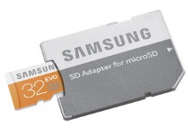
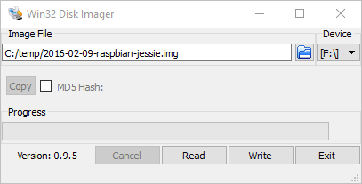
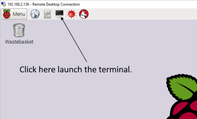
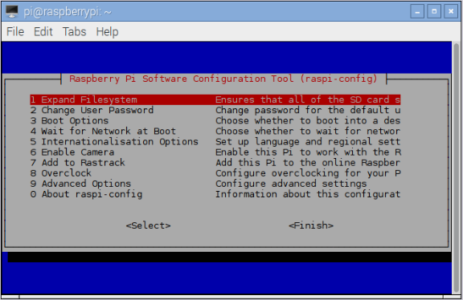
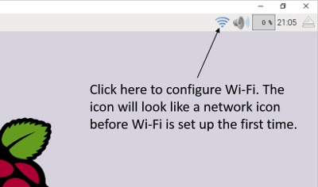
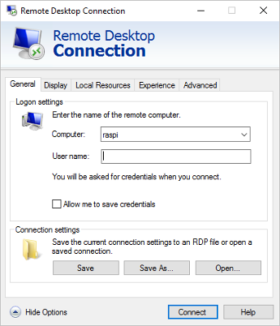
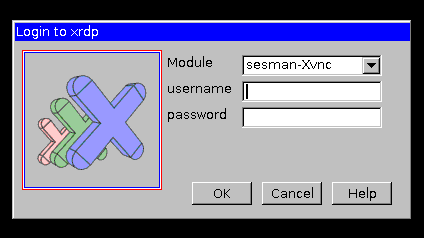

# Beginner’s Guide to Installing Node.js on a Raspberry Pi


In this second installment of our LTM (Learning through Making) series of Node.js tutorials, we’re going to get Node up and running on a Raspberry Pi 2 or Pi 3. With the Raspberry Pi 3, you won’t need to buy a separate USB Wi-Fi adapter. I’m focusing on the Raspberry Pi 2/Pi 3 rather than older versions such as the Raspberry Pi B+ since these are the latest models at the time of this writing.  The Raspberry Pi 2, for example, sports a 900MHz quad-core ARMv7 chip with 1 GB of RAM versus the Model B+’s 700 MHz single-core ARMv6 chip with 512 MB RAM. While Node can run on the model B+, we will be happier campers with this extra computing power available to us! Let’s get started.

This tutorial is useful for anyone wishing to successfully install a Raspberry Pi 2/Pi 3 system, even if they are not interested in Node.js since the Node.js installation happens in the final steps of the tutorial.  But, why would you not want to install Node.js? [anexo ausente]

### e972c4f22b1e0463d51efe06bf2d2066.jpgHardware Needed

If you don’t currently own a Raspberry Pi, the easiest way to get started is to buy a starter kit such as this one on Amazon:

- [CanaKit Raspberry Pi 3 Complete Starter Kit – 32 GB Edition](http://www.amazon.com/gp/product/B01C6Q2GSY/ref=as_li_tl?ie=UTF8&camp=1789&creative=9325&creativeASIN=B01C6Q2GSY&linkCode=as2&tag=thisdavej-20&linkId=VRAGHJ2RQIMQQTVG) (Note: my affiliate info is included on Amazon links so you can, if you desire, support these tutorials while paying nothing extra.)

We’ll need the following items to get rolling:

- Raspberry Pi **2** or Pi **3** – Model B  (these are the official names for the Raspberry Pi 2 and Pi 3.  Don’t let the “B” confuse you since there is also an older Raspberry Pi – Model B which is now effectively the “Raspberry Pi 1 – Model B”.)
- MicroSD card (I recommend a class 10 card that is 16 GB or higher.  I like this [Samsung 32GB Class 10 microSD card](http://www.amazon.com/gp/product/B00IVPU786/ref=as_li_tl?ie=UTF8&camp=1789&creative=9325&creativeASIN=B00IVPU786&linkCode=as2&tag=thisdavej-20&linkId=CXW5WB6NJTW2VVAE).)
- MicroSD to SD memory card adapter (so you can use the SD card reader on your laptop/desktop to write to the microSD card.  Many microSD card vendors include this SD adapter with the purchase as shown here.)  
  
- Micro USB power supply (2.5A or greater recommended) to power the RasPi.
- (RasPi 2 only) USB WiFi adapter (or Ethernet cable if preferred.  I have tested this [Edimax USB WiFi adapter](http://www.amazon.com/gp/product/B003MTTJOY/ref=as_li_tl?ie=UTF8&camp=1789&creative=9325&creativeASIN=B003MTTJOY&linkCode=as2&tag=thisdavej-20&linkId=RZGOFLPTQIH5ASNB) on Raspbian and it works great out of the box.  There’s a reason this is a best seller on Amazon.)  This is not needed for the RasPi 3 since it includes built-in Wi-Fi.
- Windows laptop/desktop (Linux or Mac works great too, but this tutorial is geared more toward Windows machines so some readers will need to adapt)
- HDMI monitor/USB keyboard/mouse (You can borrow these from another system temporarily and then run your RasPi in a headless mode as I will explain later.)

Once you have gathered the needed hardware, we are ready to bring our RasPi machine to life!

### Write Raspbian Image to SD Card

We will be running Raspbian which is a free operating system based on Debian Linux and optimized for the RasPi.  Here we go:

- Download the latest Raspbian image from <https://www.raspberrypi.org/downloads/raspbian/>.  Be sure to download the full version rather than the “lite version.  The download is about 1.5 GB so it may take some time to download depending on the speed of your Internet connection.
- The download will arrive as a .zip file and will need to be unzipped into an .img file so it is ready to be written to the microSD card.
- Insert the microSD card into the SD adapter as shown in the Samsung sample picture above.
- Insert the SD adapter in the SD card reader on your laptop/desktop.  Make sure it is seated well in the connection.
- Launch Windows Explorer and verify that the SD card registers as a drive on your system.  Make a note of the drive letter as you will need it soon.
- Download and install [Win32 Disk Imager](https://sourceforge.net/projects/win32diskimager/).
- Launch Win32 Disk Imager. The interface will look like this:

  
- Navigate to the Raspbian image (.img file) that you downloaded.
- Specify the target device location of the SD card.  The target device is the “F” drive in the screenshot above, but yours may be different.  
  WARNING: Be sure you choose the right target device or you will write the image to another drive on your system and this will not be good.
- Click the *Write* button to write the image to the SD card.
- Side note: the Win32 Disk Imager is a great tool for backing up SD cards too.  When you have completed this tutorial, you could create an image (.img file) of your pristine RasPi for writing back to the microSD card for use later if you mess something up and want to roll back to the pristine image.
- After the image is written to the SD card, click on the *Safely Remove Hardware* icon in the notification area at the far right of the Windows taskbar.
- Remove the SD adapter from your laptop/desktop, and remove the microSD card from the SD adapter.

### Prep the hardware

The [Tech Brick Café](http://techbrickcafe.blogspot.com/2015/10/raspberry-pi-2-model-b-single-board.html) has a nice overview picture of the various parts of the RasPi 2 [here](http://1.bp.blogspot.com/-v9M2cZM4BJo/Vi4l_fie0sI/AAAAAAAAAAw/9aa1y3-hhVQ/s400/Raspberry_pi_2_2.PNG) (RasPi 3 looks very similar) that may help you in this section.  Let’s get this little SBC (single board computer) ready to boot! Here are the steps:

- Insert the microSD card into the RasPi.  (Turn the RasPi upside down.  The microSD card slot is located on the side opposite of the USB ports.  This [short video](https://www.youtube.com/watch?v=PCcXa4UFeLg) explains the process well.)
- Connect the USB keyboard and mouse
- Connect the HDMI cable
- Connect the USB Wi-Fi adapter (or Ethernet connection if you are not using Wi-Fi)  This step is not necessary if you are using a Raspberry Pi 3 which has on-board Wi-Fi.
- Connect the power supply (You will see the RasPi lights come on and power up.)
- You should now see Raspbian booting on the screen.  Hooray!

### Configure the RasPi

We first need to make a few changes to the RasPi to for the purpose of optimization and personalizing it for our use.  To get started, launch a terminal session by clicking on the icon shown here:



Next, run the following command from the terminal session:

```
$ sudo raspi-config
```

- $ sudo raspi-config

```
$ sudo raspi-config
```

This will launch the following screen:



At this screen, we will configure our RasPi.  To navigate, there are a few keyboard shortcuts we need to know:

- Arrow keys – used to go up and down to select menu items.
- Enter key – used to select and drill further into the menu
- Tab key – used to break out of the menu.  In the screen above, the tab key will take you to the bottom two menu options so you can, for example, arrow to the right and select <Finish>.
- Spacebar – used to toggle radio button selections on and off.

Who needs a mouse when you have a keyboard?  [anexo ausente]  Let’s start configuring!

- Expand Filesystem – click Enter to select and drill into the *Expand Filesystem* option.  This ensures that all of the SD card storage is available to Raspbian.
- (Optional) Change User Password – from a security perspective, it’s a good idea to change the default password.  Just make sure you don’t forget it. [anexo ausente]

#### Internationalization Options

The Raspberry Pi is the brilliant brainchild from our friends in the UK.  If you are not from the UK, some of the keys on your keyboard may not work as expected.  Here are the changes I made to make my RasPi feel at home in San Diego:

First, arrow down to *Internationalization Options* and hit Enter.

Change locale – hit Enter (the screen will momentarily blip to black before returning to Raspi-config.)

- Arrow down to “en\_US.UTF-8 UTF-8”.
- Press the spacebar to put a \* in the brackets [\*].
- Hit the tab key and then hit the Enter key to select <Ok>.
- (Another screen appears.) Select “en\_US.UTF8” as the default locale.
- Hit the tab key and then hit the enter key to select <Ok>.
- (The system will generate the new locales and then bring you back to the main menu.)

Arrow back down to *Internationalization Options* and hit Enter.

Change Timezone – hit Enter

- Select your geographic area.  (US, in my case)
- Select your specific time zone.
- Hit the tab key and then hit the enter key to select <Ok>.

Arrow back down to *Internationalization Options* and hit Enter.

Change Keyboard Layout – hit Enter

- Change keyboard if needed.  Here’s the changes I made:
- Select Generic 105 keyboard (international) and hit enter
- Select Other
- Select English (US)
- Key to function as AltGr (I chose the default for the keyboard layout.)
- Compose key – No compose key
- Use control-alt-backspace to terminate an X Server: no

After completing those steps, you will be brought back to the main menu.  We only have a couple of configuration options left to complete.

Arrow down to Advanced Options and hit Enter. Make the following changes as you see fit:

- Hostname – if you prefer less typing, you can change the host name from “raspberrypi” to something shorter such as “raspi”.
- SSH – you can choose to enable SSH access so that you can remote into your RasPi using an SSH client such as [Putty](http://www.putty.org/)  or Bitvise – in addition to remoting in through the Windows Remote Desktop (explained below).  SSH provides remote terminal access, but does not provide a GUI interface by itself.

Once you are back to the main menu (as shown in our raspi-config screenshot above), you can hit the Tab key, arrow right to select the <Finish> option, and click enter.  The RasPi will then let you know that it needs to reboot to activate the changes you made.  Reboot it now.

### Configure Wi-Fi

After the RasPi reboots, we are ready to get Wi-Fi up and running to get on the network.

- Click on the network icon in the top right of the screen as shown in the screenshot.

  
- From here, select your network SSID (Wi-Fi network).
- You will be prompted for your pre shared key (Wi-Fi) network password.  Enter it and select *OK*.
- Wait for the icon to transform from a network icon to the Wi-Fi icon shown in the screenshot above.  From this point, you should be connected to your Wi-Fi network.
- Test your Wi-Fi network connection by launching the Terminal once again.

  
- From the terminal, issue a ping command to verify your network connection is working:

  ```
  $ ping google.com
  ```

  - $ ping google.com

  ```
  $ ping google.com
  ```

We’re now ready to move on and ensure our system is up to date with security patches

### Apply Raspbian Updates

We will first run the apt-get “update” command.  This command will not actually update any software on the system, but will download the latest package lists from the software repositories so that Rasbian will be aware of all new software available along with dependencies.  Issue the following command at the “$” prompt:

```
$ sudo apt-get update
```

- $ sudo apt-get update

```
$ sudo apt-get update
```

Next, run the following command to upgrade any packages installed on your system that need upgrades:

```
$ sudo apt-get dist-upgrade
```

- $ sudo apt-get dist-upgrade

```
$ sudo apt-get dist-upgrade
```

This is important to keep your RasPi system synchronized with security updates, etc. These two commands should be issued together and run periodically.

### Prepare Remote Desktop

We want to run the RasPi remotely through Windows rather than having to tie up a dedicated HDMI monitor and USB keyboard/mouse.  Let’s do that now:

- Issue the following command to install the xrdp software so that we can connect to our RasPi remotely from our laptop/desktop without requiring a second monitor/keyboard/mouse:

  ```
  $ sudo apt-get -y install xrdp
  ```

  - $ sudo apt-get -y install xrdp

  ```
  $ sudo apt-get -y install xrdp
  ```

  The “-y” option will automatically answer yes to the default questions which is what we want in this context.
- Next, we need to install the samba package so we will be able to access the RasPi by its host name from Windows machines on the network rather than by it’s IP address which can change since the RasPi receives its IP address via DHCP:

  ```
  $ sudo apt-get -y install samba
  ```

  - $ sudo apt-get -y install samba

  ```
  $ sudo apt-get -y install samba
  ```
- After this installation completes, you should be able to ping the RasPi Hostname (configured in raspi-config above) from a Windows machine:

  ```
  C:\> ping raspi
  ```

  - C:\> ping raspi

  ```
  C:\> ping raspi
  ```
- You are now ready to launch a remote desktop connection!
- From your Windows machine, hit the *Windows* key, and type “Remote Desktop Connection” to bring up the Remote Desktop program.  Click it in to invoke it.
- Type the host name of your RasPi (“raspi” in my case) in the *Computer* textbox and click the *Connect* button.

  
- You will then be prompted with the xrdp login screen:

  
- Enter your credentials and log into the RasPi.
  - username: pi
  - password: raspberry (unless you changed it above in the raspi-config configuration step above.

Amazing!  We are connected remotely to the RasPi and we no longer need the dedicated HDMI monitor and USB keyboard/mouse. Let’s go ahead and shut down the RasPi for a minute so we can free up our monitor and keyboard/mouse:

- Click the *Menu* button in the top left corner of the screen and select *Shutdown*.
- Click *OK* to shut down the machine.
- Wait a minute for the RasPi to fully power down.
- Unplug the power cable, HDMI cable, and the USB keyboard and mouse.
- Plug the power cable back in and the RasPi should be on its way back up without all of those extra cables!
- After giving the RasPi a minute or so to boot, connect to it once again using the Windows Remote Desktop program.

### Create Windows File Share on the RasPi (Optional)

We can create a Windows file share on the RasPi so that we can copy files from our Windows machine directly onto the RasPi.  This can come in handy in many contexts.  Here’s how we do it:

- Launch a terminal session.
- Create a directory called “share” in your home directory as follows:

  ```
  $ mkdir ~/share
  ```

  - $ mkdir ~/share

  ```
  $ mkdir ~/share
  ```
- Issue the following command to launch the Leafpad editor.

  ```
  $ sudo leafpad /etc/samba/smb.conf &
  ```

  - $ sudo leafpad /etc/samba/smb.conf &

  ```
  $ sudo leafpad /etc/samba/smb.conf &
  ```
- We could have also used the console-based “nano” editor, but Leafpad provides a GUI which is more suitable for beginners.  The ampersand on the end of the command launches Leafpad as a background process so we are returned to a shell prompt in the terminal.  Also, the smb.conf is part of the Samba package we installed early and this is why it exists on our system.
- Scroll down to the very bottom of the smb.conf configuration file and add the following:

  ```
  [PiShare]
   comment=Raspi Share
   path=/home/pi/share
   browseable=Yes
   writeable=Yes
   only guest=No
   create mask=0777
   directory mask=0777
   public=no
  ```

  - [PiShare]
  - comment=Raspi Share
  - path=/home/pi/share
  - browseable=
  - writeable=
  - only guest=
  - create mask=
  - directory mask=
  - public=

  ```
  [PiShare]
   comment=Raspi Share
   path=/home/pi/share
   browseable=Yes
   writeable=Yes
   only guest=No
   create mask=0777
   directory mask=0777
   public=no
  ```
- Save the changes to the smb.conf configuration file and exit the Leafpad editor.  (Raspbian will automagically restart the SMB (Samba) services based on the changes you made to the configuration file.)
- Back in a terminal session, we need to create an SMB (Samba) user so we can connect securely from Windows.  We will create a user named “pi”, but this will be an SMB (Windows user) rather than the Rasbian “pi” user. Here’s how we do it:

  ```
  $ sudo smbpasswd -a pi
  ```

  - $ sudo smbpasswd -a pi

  ```
  $ sudo smbpasswd -a pi
  ```

  You will be prompted to enter and re-enter a password.  Document this password somewhere for future reference.

We are ready to connect to our newly created RasPi file share from Windows!

- Back on your Windows machine, type the Windows key and “R” (Win-R) to launch a run box for typing in commands.
- Enter two backslashes followed by the name of your RasPi machine (i.e. your Hostname) and hit enter.  For example:

  ```
  \\raspi
  ```

  - \\raspi

  ```
  \\raspi
  ```
- When prompted for credentials, enter the following:
  - Username: The format to enter here in Windows parlance is the domain\username.  For us, our domain will be our RasPi hostname and our user name will be “pi”.  Therefore, we will enter: raspi\pi  
    If your Hostname is not raspi, you will obviously enter that instead.
  - Password: (enter the password you created with the smbpasswd command above)
- Voilà!  We should now be connected.  You can test the file share by creating a text file on the Windows side and verifying that it shows up in the */home/pi/share* directory on the RasPi side.

### Install Node.js

You now have an amazing general purpose Raspberry Pi system that can be used for a variety of tasks and inter-operates well in the Windows world (it even looks like a Windows machine to the other Windows machines!) – and can play nicely in the Mac and Linux world too.  Let’s go ahead and install Node.js so we will be ready to do some fun projects in the future.  Here are the steps:

Our friends at NodeSource host and maintain some excellent Node.js binary distributions.  We will leverage a command they have written to add another package repository to our RasPi so that we will be able to “apt-get install” a modern version of Node.js from their repository.  This is beneficial since the Debian/Raspbian versions may not always be up to date.  By adding the NodeSource repository, we will also be able to receive updates rather than just installing a standalone (.deb) file version of Node that cannot be updated easily.  Here we go in the final stretch:

Let’s go for an installation of the latest version of Node at the time of this writing which is Node 5.X.

```
$ curl -sL https://deb.nodesource.com/setup_5.x | sudo -E bash -
```

- $ curl -sL https://deb.nodesource.com/setup\_5.x | sudo -E bash -

```
$ curl -sL https://deb.nodesource.com/setup_5.x | sudo -E bash -
```

The previous command updates our package repository to include the NodeSource packages.  Now, let’s install Node.js!

```
$ sudo apt-get install -y nodejs
```

- $ sudo apt-get install -y nodejs

```
$ sudo apt-get install -y nodejs
```

We can then test and see what version of Node we are running and launch the Node REPL as we discussed in the [previous article](http://thisdavej.com/learning-through-making-getting-started-with-node-js/) as a quick test to confirm the installation was successful.

```
$ node -v
v5.6.0
$ node
> 1 + 3
4
> # We can hit Ctrl-C twice to exit the REPL and get back to the bash (shell) prompt.
```

- $ node -v
- v5.6.0
- $ node
- > 1 + 3
- # We can hit Ctrl-C twice to exit the REPL and get back to the bash (shell) prompt.

```
$ node -v
v5.6.0
$ node
> 1 + 3
4
> # We can hit Ctrl-C twice to exit the REPL and get back to the bash (shell) prompt.
```

### Next time

In a future post, we will leverage the goodness of the npm (Node Package Manager) community and build a simple, but highly functional Web server without any code.  This can be accomplished using the Raspberry Pi system you just created here or on a Windows/Linux/Mac machine as I outlined in a [previous article](http://thisdavej.com/learning-through-making-getting-started-with-node-js/).  Hope to see you then!

[Follow](https://twitter.com/thisDaveJ) Dave Johnson on Twitter to stay up to date on the latest tutorials and tech articles.

Share
