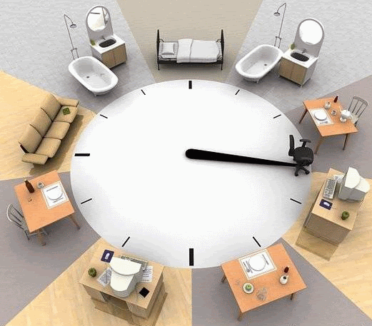
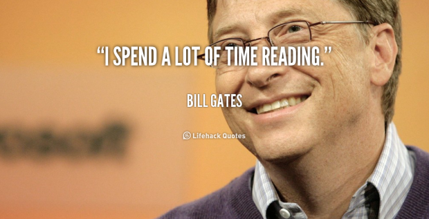

# 6 hábitos produtivos para fazer antes de dormir

por Outubro 1, 2014[Concentração](https://blog.todoist.com/pt/category/concentracao-2/), [Dicas](https://blog.todoist.com/pt/category/dicas-2/), [Produtividade](https://blog.todoist.com/pt/category/produtividade/)

A gente já falou na semana passada sobre os [7 hábitos altamente produtivos de pessoas famosas,](https://todoist.com/blog/pt_br/7-habitos-produtivos-de-pessoas-famosas/) como Paul McCartney, Steve Jobs e vários pensadores e artistas importantes da história – e muitos deles tinham como hábitos positivos em sua rotina acordarem bem cedo para trabalhar. Aliás, acordar cedo já foi provado ter um efeito positivo sobre a nossa produtividade: ao acordar cedo, a gente consegue ter mais tempo para tomar um café da manhã completo e com calma, além de planejar e se organizar melhor para o dia seguinte. Mas a verdade é que, tão importante quanto os hábitos que temos pela manhã, são os hábitos saudáveis que devemos ter antes de ir dormir e que podem também nos ajudar a melhorar nossa produtividade e energia.

Por isso, resolvemos nos debruçar melhor sobre a questão, e pesquisamos algumas boas práticas para incorporarmos à nossa rotina ao fim do dia – sendo que algumas delas, como no post anterior, também são adotadas por pessoas altamente bem-sucedidas, o que é um ótimo sinal. E a primeira coisa que observamos é que existem relações entre as pessoas que possuem hábitos produtivos pela manhã e que desempenham atividades que exijam/envolvam criatividade. Um [estudo do Albion College](http://www.scientificamerican.com/article/sleepy-brains-think-freely/) mostrou que o período noturno é o melhor momento para desempenhar atividades criativas – e isso acontece mesmo quando estamos cansados depois de um dia de trabalho.

A estilista Vera Wang concordaria com isso: em 2006, ela deu uma entrevista à revista Fortune falando que sua rotina noturna incluía muitos desenhos – e que era no silêncio da noite em que ela às vezes conseguia desvencilhar-se de algum bloqueio criativo. E isso combina com o que dizem os cientistas: pessoas que são adeptas de acordarem cedo para se tornarem mais produtivas de manhã, geralmente têm o seu momento mais criativo à noite (e muitas vezes, um pouco antes de se deitar). Isso acontece muito porque nossa mente está menos “contida” à noite, e nossa habilidade de relativizar logicamente diminui – mas isso é positivo para a criatividade, que consegue fluir e até trazer soluções porque permite que a gente conecte idéias de uma forma mais livre, o que não faríamos normalmente.

E se a gente já tentou entender [neste post](https://todoist.com/blog/pt_br/quer-de-tornar-um-verdadeiro-gtd-entao-descubra-seu-dia-mais-produtivo/) qual o dia da semana em que somos mais ou menos produtivos, agora podemos também tentar obter o máximo de cada um de nossos dias, adotando hábitos positivos à noite. Vamos a eles:

## **1. Revise seu dia anterior**

“O que você realizou hoje?” Essa é a pergunta que [Benjamim Franklin fazia a si mesmo todos os dias](https://todoist.com/blog/pt_br/7-habitos-produtivos-de-pessoas-famosas/), antes de dormir. Ele ia além: mantinha um diário onde anotava seus sucessos, bem como descrevia seus fracassos – e isto é ótimo para ter claramente em vista suas metas e prioridades para o próximo dia.

Anotar seus sucessos é, ainda, um passo poderoso para a frente: é uma forma de reconhecer e agradecer as coisas boas que aconteceram conosco, e nos ajudam a nos reenergizar para a etapa do dia seguinte. Por isso, não abra mão desta tarefa: vale a pena dedicar a ela ao menos de 5 a 10 minutos – depois de um tempo você verá a diferença!

## **2. Planeje seu próximo dia**

O CEO da American Express CEO tem o hábito de gerenciar seu tempo planejando tudo no dia anterior – e ele faz isso de uma forma bem simples: Ele planeja três coisas que precisam ser feitas no dia seguinte. Assim, ele já acorda sabendo o que precisa realizar e se foca nestes resultados.

Parece simples, mas talvez seja esta a coisa mais importante que deve ser feita antes de dormir. A principal vantagem disso é que essa lista de tarefas que você preparar será a primeira coisa que você vai ver no dia seguinte, e isso o ajudará a se organizar melhor. Desde passar as roupas e deixar o traje de trabalho do dia seguinte pronto, como os documentos separados para uma reunião importante: tudo isso o fará ter mais tempo no dia seguinte para tomar café e se organizar com calma – e acredite: [acordar sem pressa traz várias coisas boas](https://todoist.com/blog/pt_br/5-dicas-saudaveis-para-aumentar-sua-produtividade/) para a sua produtividade!

Você pode imaginar a importância disso se pensar em como funciona o contrário: você pode acordar tarde, não achar as roupas de que precisa para trabalhar, esquecer os documentos importantes em casa… e com isso seu vira uma bagunça.

## **3. Medite**

A meditação já transcendeu os hábitos de academias zen para ganhar os hábitos de pessoas bem-sucedidas; e não é a toa que muitas revistas e jornais apontam os benefícios de meditar regularmente. Uma das adeptas é a apresentadora americana Oprah Winfrey, dona de uma agenda bem ocupada, mas que ao final de cada dia reserva alguns momentos para se focar em uma sessão de meditação.

A apresentadora Oprah. Crédito da Foto: Flickr de Alan Light

Infelizmente, ainda há alguns estigmas envolvendo a meditação, e o debate sobre se os seus efeitos diretos sobre a mente são verdadeiros é reacendido de tempos em tempos. Porém, um [estudo realizado em 2014](http://www.health.harvard.edu/blog/mindfulness-meditation-may-ease-anxiety-mental-stress-201401086967)  analisou mais de 19.000 casos envolvendo meditação, e com resultados claros na redução do estresse, da ansiedade, da depressão e da dor. Prova de que, mesmo com todo o debate, não há como negar os fatos, não é?

## **4. Leia um livro**

O bilionário dono da Microsoft, Bill Gates, é um leitor voraz, e já declarou gastar uma hora lendo um livro antes de dormir. Os seus assuntos preferidos? Vão de política a atualidades.

Crédito da imagem: Lifehack Quotes

Ler um livro antes de dormir tem vantagens que vão muito além do simples “ganhar conhecimento”: está comprovado de que a leitura melhora a capacidade de memória e reduz o estresse. [Um estudo de 2009 feito pela Universidade de Essex](http://www.kumon.co.uk/blog/reading-reduces-stress-levels/) já revelou que ler pelo menos 6 minutos ao dia pode diminuir o estresse em até 68%.

## **5. Desconecte-se**

Após passar por uma crise de estafa e machucar sua cabeça a ponto de levar cinco pontos, Arianna Huffington se tornou uma evangelista do conceito de “desplugar-se”. Todas as noites antes de dormir, ela põe seu celular em outro quarto para que ela não se distraia com isso antes de dormir. E acredite: de acordo com os cientistas, ela está certíssima em fazer isso.

O professor [Charles Czeisler,](http://www.lifehack.org/articles/productivity/%C2%A0http://www.dailymail.co.uk/health/article-2577824/Why-NEVER-mobile-bedroom.html#ixzz3CAEyr7eS) da Universidade de Harvard, disse que a luz clara emitida pelos nossos celulares acaba por interferir no ritmo natural do nosso sono – é como se ela induzisse nosso corpo a pensar que é dia – e o resultado disso é que essa luz manda uma mensagem a nosso cérebro que previne que ele envie certos sinais a nosso corpo, fazendo com que o processo de adormecer se torne muito mais difícil.

Então, se você quiser uma boa noite de sono, deixe o celular longe de você!

## 6. Durma bem

Não é segredo: uma péssima noite de sono pode acabar com a disposição e a produtividade do dia seguinte. Mas como assegurar (ou tentar tornar o melhor possível) uma boa qualidade de sono? O ideal é começar a desacelerar algumas horas antes de dormir.

E isso significa cortar algumas coisas: cafeína seria a primeira delas. Enquanto o [café é um aliado de manhã](https://todoist.com/blog/pt_br/5-dicas-saudaveis-para-aumentar-sua-produtividade/) para ajudar a aumentar a concentração, à noite ele pode dificultar  uma boa noite de sono. Comidas pesadas também devem ser evitadas. Imagine que falta uma hora para você dormir e bate uma fome. O que faz? Come. E assim, dali a uma hora, você vai tentar dormir, porque sua mente se programou para isso, mas o seu corpo vai dizer “Espera: você acabou de me dar um monte de coisa para digerir. Tenho trabalho a fazer. Espera aí, tá?”

O mesmo acontece com líquidos: se bater a sede, aproveite para beber água, mas não exagere: senão, no meio da noite você pode ter vontade de ir ao banheiro, e só acordar para fazer isso pode acabar com o sono do resto da noite.

Você costuma ter uma rotina antes de dormir que te ajuda a se tornar mais produtivo no dia seguinte? O que você faz? Conte para a gente nos comentários! [anexo ausente]
