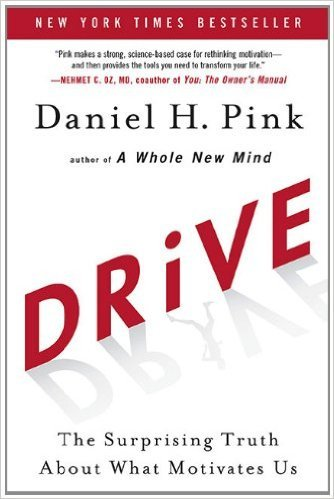
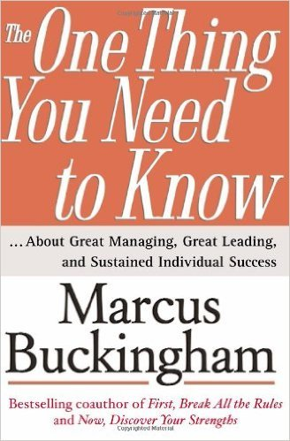
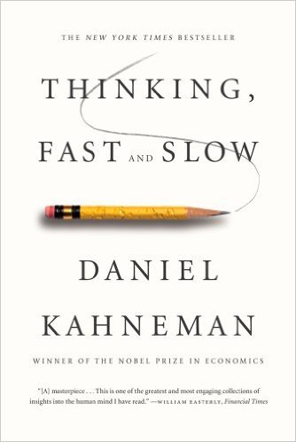

# 10 books every new manager should read

[Facebook](https://www.facebook.com/zuck/posts/10102373155843461)Mark Zuckerberg.

Stepping into a management role for the first time can be scary.

It doesn't help that there's a ton of conflicting management advice out there, and sifting through it could take years.

That's why we recommend starting with these 10 books, which offer practical insights on leading a team.

We didn't simply stick with traditional business reads — instead, we included novels, psychological research, and the musings of a Roman emperor.

Each of these books will help prepare you to tackle the myriad challenges of managing people.

### 'Drive' by Daniel H. Pink

Amazon

Now that you're in charge of a team of people, how will you inspire them to perform at their best?

In this best-selling business book, Pink explains why, contrary to popular belief, extrinsic incentives like money [*aren't* the best way to motivate high performance](http://www.businessinsider.com/why-incentives-dont-actually-make-people-do-better-work-2014-3). Instead, employers should focus on cultivating in their workers a sense of autonomy, mastery, and purpose in order to help them succeed.

Using real-life anecdotes and research, Pink walks readers through each of these three concepts and why they're absolutely crucial in the business world.

## [Find it here >>](http://www.amazon.com/gp/product/1594488843/ref=as_li_tl?ie=UTF8&camp=1789&creative=390957&creativeASIN=1594488843&linkCode=as2&tag=thebusiinsi-20&linkId=QJW2Y4ZHLQ6FR43E)

### 'The One Thing You Need to Know' by Marcus Buckingham

Amazon

According to Buckingham, great managers are able to [identify their employees' individual strengths and capitalize on them](http://www.businessinsider.com/how-to-be-a-great-manager-2013-8). This approach, he argues, is considerably more effective than trying to improve people's weak points.

Among the tips he offers for motivating high performance: Set clear expectations, offer praise and recognition, and show people you care about them.

It's a compelling read that will make the transition from managing yourself to managing others easier.

## [Find it here >>](http://www.amazon.com/gp/product/0743261658/ref=as_li_tl?ie=UTF8&camp=1789&creative=390957&creativeASIN=0743261658&linkCode=as2&tag=thebusiinsi-20&linkId=SHL4P6GQ6GLVEUWP)

### 'Thinking, Fast and Slow' by Daniel Kahneman

Amazon

This 2011 best-seller is a favorite of [Jack Zenger](http://zengerfolkman.com/jack/), cofounder and CEO of leadership consultancy Zenger/Folkman.

Kahneman, a psychologist who won the Nobel Prize in economics, breaks down all of human thought into two systems: the fast and intuitive "System 1" and the slow and deliberate "System 2." Using this framework, he lays out a number of [cognitive biases](http://www.businessinsider.com/cognitive-biases-2015-10) that affect our everyday behavior, from the halo effect to the planning fallacy.

As you transition into people management, this book will help you anticipate the psychological stumbling blocks you and your team will encounter, and give you scientific strategies for overcoming them.

## [Find it here >>](http://www.amazon.com/gp/product/0374533555/ref=as_li_tl?ie=UTF8&camp=1789&creative=390957&creativeASIN=0374533555&linkCode=as2&tag=thebusiinsi-20&linkId=CGC3CT5JSAONBMFU)
