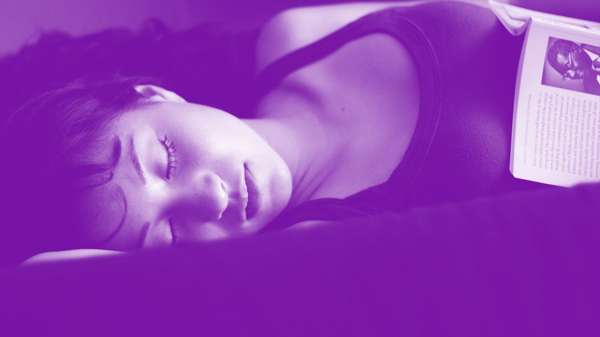

# Why Six Hours Of Sleep Is As Bad As None At All

## Getting six hours of sleep a night simply isn't enough for you to be your most productive. In fact, it's just as bad as not sleeping at all.

[Photo: Flickr user [Mark Sebastian](https://www.flickr.com/photos/71865026%40N00/2733975281)]

Advertisement

Not getting enough sleep is detrimental to both your health and productivity. Yawn. We've heard it all before. But results from one study impress just how bad a cumulative lack of sleep can be on performance. Subjects in a lab-based sleep study who were allowed to get only six hours of sleep a night for two weeks straight functioned as poorly as those who were forced to stay awake for two days straight. The kicker is the people who slept six hours per night thought they were doing just fine.

This [sleep deprivation study](http://www.ncbi.nlm.nih.gov/pubmed/12683469), published in the journal *Sleep*, took 48 adults and restricted their sleep to a maximum of four, six, or eight hours a night for two weeks; one unlucky subset was deprived of sleep for three days straight.

"Subjects who got six hours of sleep a night for two weeks straight functioned as poorly as those who were forced to stay awake for two days straight."

During their time in the lab, the participants were tested every two hours (unless they were asleep, of course) on their cognitive performance as well as their reaction time. They also answered questions about their mood and any symptoms they were experiencing, basically, "How sleepy do you feel?"

#### Why Six Hours of Sleep Isn't Enough

As you can imagine, the subjects who were allowed to sleep eight hours per night had the highest performance on average. Subjects who got only four hours a night did worse each day. The group who got six hours of sleep seemed to be holding their own, until around day 10 of the study.

In the last few days of the experiment, the subjects who were restricted to a maximum of six hours of sleep per night showed cognitive performance that was as bad as the people who weren't allowed to sleep at all. Getting only six hours of shut-eye was as bad as not sleeping for two days straight. The group who got only four hours of sleep each night performed just as poorly, but they hit their low sooner.

"The six-hour sleep group didn't rate their sleepiness as being all that bad, even as their cognitive performance was going downhill."

One of the most alarming results from the sleep study is that the six-hour sleep group didn't rate their sleepiness as being all that bad, even as their cognitive performance was going downhill. The no-sleep group progressively rated their sleepiness level higher and higher. By the end of the experiment, their sleepiness had jumped by two levels. But the six-hour group only jumped one level. Those findings raise the question about how people cope when they get insufficient sleep, perhaps suggesting that they're in denial (willful or otherwise) about their present state.

#### We Have No Idea How Much We Sleep

Complicating matters is the fact that people are terrible at knowing how much time they actually spend asleep.  
According to the Behavioral Risk Factor Surveillance System survey, as [reported by the CDC](http://www.cdc.gov/features/dssleep), more than 35% of Americans sleep less than seven hours in a typical day. That's one out of every three people. However, those who suffer from sleep problems don't accurately estimate how much they sleep each night.

"If you think you sleep seven hours a night, as one out of every three Americans does, it's entirely possible you're only getting six."

[Research from University of Chicago](http://www.ncbi.nlm.nih.gov/pubmed/10678467), for instance, shows that people are as likely to overestimate how much they sleep as underestimate it. [Another sleep study published in *Epidemiology*](http://www.ncbi.nlm.nih.gov/pmc/articles/PMC2785092/), indicates people generally overestimate their nightly sleep by around 0.8 hours. The same study also estimates that for every hour beyond six that people sleep, they overestimate sleep by about half an hour. If you think you sleep seven hours a night, as one out of every three Americans does, it's entirely possible you're only getting six.

So no one knows how much or little they're sleeping, and when they don't sleep enough, they believe they're doing better than they are.

Even just a little bit of sleep deprivation, in this case, six rather than eight hours of sleep across two weeks, accumulates to jaw-dropping results. Cumulative sleep deprivation isn't a new concept by any means, but it's rare to find research results that are so clear about the effects.

#### Fixing Sleep: Easier Said Than Done

Figuring out how to get enough sleep, consistently, is a tough nut to crack. The same advice experts have batted around for decades is probably a good place to start: Have a consistent bedtime; don't look at electronic screens at least 30 minutes before bed; limit alcohol intake (alcohol makes many people sleepy, but it can also decrease the quality and duration of sleep); and get enough exercise.

Other advice that you'll hear less often, but which is equally valid, is to lose excess weight. [Sleep apnea and obesity have a very high correlation](https://sleepfoundation.org/sleep-topics/obesity-and-sleep), according to the National Sleep Foundation. What's more, obese workers already [suffer from more lost productive time](http://www.ncbi.nlm.nih.gov/pubmed/16340703) than normal weight and overweight workers.

Other causes of sleep problems include physical, neurological, and psychological issues. Even stress and worry can negatively affect sleep. The CDC has called lack of sleep a health problem, and for good reason. Diet, exercise, mental health, and physical health all affect our ability to sleep, and in return, our ability to perform to our best.

Fixing bad sleep habits to get enough sleep is easier said than done. But if you're functioning as if you hadn't slept for two days straight, isn't it worthwhile?

*Jill Duffy is a writer covering technology and productivity. She is the author of Get Organized: How to Clean Up Your Messy Digital Life.*

#### We put sleep research to the test in a sleep-deprivation obstacle course.

#### Newsletter

Get the latest Leadership stories delivered to your inbox daily.

I'd also like to receive special Fast Company offers
