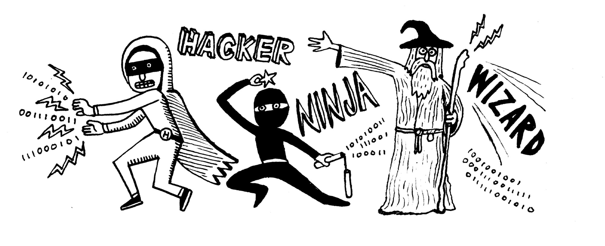

### I’m a boring programmer (and proud of it)

![](data:image%2Fpng;base64,iVBORw0KGgoAAAANSUhEUgAAASwAAACWCAYAAABkW7XSAAAEYklEQVR4Xu3UAQkAAAwCwdm%2F9HI83BLIOdw5AgQIRAQWySkmAQIEzmB5AgIEMgIGK1OVoAQIGCw%2FQIBARsBgZaoSlAABg+UHCBDICBisTFWCEiBgsPwAAQIZAYOVqUpQAgQMlh8gQCAjYLAyVQlKgIDB8gMECGQEDFamKkEJEDBYfoAAgYyAwcpUJSgBAgbLDxAgkBEwWJmqBCVAwGD5AQIEMgIGK1OVoAQIGCw%2FQIBARsBgZaoSlAABg+UHCBDICBisTFWCEiBgsPwAAQIZAYOVqUpQAgQMlh8gQCAjYLAyVQlKgIDB8gMECGQEDFamKkEJEDBYfoAAgYyAwcpUJSgBAgbLDxAgkBEwWJmqBCVAwGD5AQIEMgIGK1OVoAQIGCw%2FQIBARsBgZaoSlAABg+UHCBDICBisTFWCEiBgsPwAAQIZAYOVqUpQAgQMlh8gQCAjYLAyVQlKgIDB8gMECGQEDFamKkEJEDBYfoAAgYyAwcpUJSgBAgbLDxAgkBEwWJmqBCVAwGD5AQIEMgIGK1OVoAQIGCw%2FQIBARsBgZaoSlAABg+UHCBDICBisTFWCEiBgsPwAAQIZAYOVqUpQAgQMlh8gQCAjYLAyVQlKgIDB8gMECGQEDFamKkEJEDBYfoAAgYyAwcpUJSgBAgbLDxAgkBEwWJmqBCVAwGD5AQIEMgIGK1OVoAQIGCw%2FQIBARsBgZaoSlAABg+UHCBDICBisTFWCEiBgsPwAAQIZAYOVqUpQAgQMlh8gQCAjYLAyVQlKgIDB8gMECGQEDFamKkEJEDBYfoAAgYyAwcpUJSgBAgbLDxAgkBEwWJmqBCVAwGD5AQIEMgIGK1OVoAQIGCw%2FQIBARsBgZaoSlAABg+UHCBDICBisTFWCEiBgsPwAAQIZAYOVqUpQAgQMlh8gQCAjYLAyVQlKgIDB8gMECGQEDFamKkEJEDBYfoAAgYyAwcpUJSgBAgbLDxAgkBEwWJmqBCVAwGD5AQIEMgIGK1OVoAQIGCw%2FQIBARsBgZaoSlAABg+UHCBDICBisTFWCEiBgsPwAAQIZAYOVqUpQAgQMlh8gQCAjYLAyVQlKgIDB8gMECGQEDFamKkEJEDBYfoAAgYyAwcpUJSgBAgbLDxAgkBEwWJmqBCVAwGD5AQIEMgIGK1OVoAQIGCw%2FQIBARsBgZaoSlAABg+UHCBDICBisTFWCEiBgsPwAAQIZAYOVqUpQAgQMlh8gQCAjYLAyVQlKgIDB8gMECGQEDFamKkEJEDBYfoAAgYyAwcpUJSgBAgbLDxAgkBEwWJmqBCVAwGD5AQIEMgIGK1OVoAQIGCw%2FQIBARsBgZaoSlAABg+UHCBDICBisTFWCEiBgsPwAAQIZAYOVqUpQAgQMlh8gQCAjYLAyVQlKgIDB8gMECGQEDFamKkEJEDBYfoAAgYyAwcpUJSgBAgbLDxAgkBEwWJmqBCVAwGD5AQIEMgIGK1OVoAQIGCw%2FQIBARsBgZaoSlACBB1YxAJfjJb2jAAAAAElFTkSuQmCC)

**Archetypes for programmers (if you believe all those silly job postings). Illustration by** [**Nate Otto**](https://twitter.com/nongallery)**.**

I have a confession to make — I’m not a rock star programmer. Nor am I a hacker. I don’t know ninjutsu. Nobody has ever called me a wizard.

Still, I take pride in the fact that I’m a good, solid programmer. One who works hard at his craft and really enjoys it, even without the fancy labels.

![](data:image%2Fpng;base64,iVBORw0KGgoAAAANSUhEUgAAASwAAACWCAYAAABkW7XSAAAEYklEQVR4Xu3UAQkAAAwCwdm%2F9HI83BLIOdw5AgQIRAQWySkmAQIEzmB5AgIEMgIGK1OVoAQIGCw%2FQIBARsBgZaoSlAABg+UHCBDICBisTFWCEiBgsPwAAQIZAYOVqUpQAgQMlh8gQCAjYLAyVQlKgIDB8gMECGQEDFamKkEJEDBYfoAAgYyAwcpUJSgBAgbLDxAgkBEwWJmqBCVAwGD5AQIEMgIGK1OVoAQIGCw%2FQIBARsBgZaoSlAABg+UHCBDICBisTFWCEiBgsPwAAQIZAYOVqUpQAgQMlh8gQCAjYLAyVQlKgIDB8gMECGQEDFamKkEJEDBYfoAAgYyAwcpUJSgBAgbLDxAgkBEwWJmqBCVAwGD5AQIEMgIGK1OVoAQIGCw%2FQIBARsBgZaoSlAABg+UHCBDICBisTFWCEiBgsPwAAQIZAYOVqUpQAgQMlh8gQCAjYLAyVQlKgIDB8gMECGQEDFamKkEJEDBYfoAAgYyAwcpUJSgBAgbLDxAgkBEwWJmqBCVAwGD5AQIEMgIGK1OVoAQIGCw%2FQIBARsBgZaoSlAABg+UHCBDICBisTFWCEiBgsPwAAQIZAYOVqUpQAgQMlh8gQCAjYLAyVQlKgIDB8gMECGQEDFamKkEJEDBYfoAAgYyAwcpUJSgBAgbLDxAgkBEwWJmqBCVAwGD5AQIEMgIGK1OVoAQIGCw%2FQIBARsBgZaoSlAABg+UHCBDICBisTFWCEiBgsPwAAQIZAYOVqUpQAgQMlh8gQCAjYLAyVQlKgIDB8gMECGQEDFamKkEJEDBYfoAAgYyAwcpUJSgBAgbLDxAgkBEwWJmqBCVAwGD5AQIEMgIGK1OVoAQIGCw%2FQIBARsBgZaoSlAABg+UHCBDICBisTFWCEiBgsPwAAQIZAYOVqUpQAgQMlh8gQCAjYLAyVQlKgIDB8gMECGQEDFamKkEJEDBYfoAAgYyAwcpUJSgBAgbLDxAgkBEwWJmqBCVAwGD5AQIEMgIGK1OVoAQIGCw%2FQIBARsBgZaoSlAABg+UHCBDICBisTFWCEiBgsPwAAQIZAYOVqUpQAgQMlh8gQCAjYLAyVQlKgIDB8gMECGQEDFamKkEJEDBYfoAAgYyAwcpUJSgBAgbLDxAgkBEwWJmqBCVAwGD5AQIEMgIGK1OVoAQIGCw%2FQIBARsBgZaoSlAABg+UHCBDICBisTFWCEiBgsPwAAQIZAYOVqUpQAgQMlh8gQCAjYLAyVQlKgIDB8gMECGQEDFamKkEJEDBYfoAAgYyAwcpUJSgBAgbLDxAgkBEwWJmqBCVAwGD5AQIEMgIGK1OVoAQIGCw%2FQIBARsBgZaoSlAABg+UHCBDICBisTFWCEiBgsPwAAQIZAYOVqUpQAgQMlh8gQCAjYLAyVQlKgIDB8gMECGQEDFamKkEJEDBYfoAAgYyAwcpUJSgBAgbLDxAgkBEwWJmqBCVAwGD5AQIEMgIGK1OVoAQIGCw%2FQIBARsBgZaoSlACBB1YxAJfjJb2jAAAAAElFTkSuQmCC)

This is from a clothing website.

Yet every week I see a call for ninja programmers, who I assume slice lines of code with incredible precision. I read about tech rock stars, who I imagine write functions as beautiful as the “Stairway to Heaven” solo. I hear people throw around the word hacker (and the associated hack, hackfest, and hackathon) as if haphazardly chopping something into little bits or prying your way into an unauthorized system is a good thing.

And lest we forget about those amazing wizards, who can turn nothing into something with their…

![](data:image%2Fpng;base64,iVBORw0KGgoAAAANSUhEUgAAASwAAACWCAYAAABkW7XSAAAEYklEQVR4Xu3UAQkAAAwCwdm%2F9HI83BLIOdw5AgQIRAQWySkmAQIEzmB5AgIEMgIGK1OVoAQIGCw%2FQIBARsBgZaoSlAABg+UHCBDICBisTFWCEiBgsPwAAQIZAYOVqUpQAgQMlh8gQCAjYLAyVQlKgIDB8gMECGQEDFamKkEJEDBYfoAAgYyAwcpUJSgBAgbLDxAgkBEwWJmqBCVAwGD5AQIEMgIGK1OVoAQIGCw%2FQIBARsBgZaoSlAABg+UHCBDICBisTFWCEiBgsPwAAQIZAYOVqUpQAgQMlh8gQCAjYLAyVQlKgIDB8gMECGQEDFamKkEJEDBYfoAAgYyAwcpUJSgBAgbLDxAgkBEwWJmqBCVAwGD5AQIEMgIGK1OVoAQIGCw%2FQIBARsBgZaoSlAABg+UHCBDICBisTFWCEiBgsPwAAQIZAYOVqUpQAgQMlh8gQCAjYLAyVQlKgIDB8gMECGQEDFamKkEJEDBYfoAAgYyAwcpUJSgBAgbLDxAgkBEwWJmqBCVAwGD5AQIEMgIGK1OVoAQIGCw%2FQIBARsBgZaoSlAABg+UHCBDICBisTFWCEiBgsPwAAQIZAYOVqUpQAgQMlh8gQCAjYLAyVQlKgIDB8gMECGQEDFamKkEJEDBYfoAAgYyAwcpUJSgBAgbLDxAgkBEwWJmqBCVAwGD5AQIEMgIGK1OVoAQIGCw%2FQIBARsBgZaoSlAABg+UHCBDICBisTFWCEiBgsPwAAQIZAYOVqUpQAgQMlh8gQCAjYLAyVQlKgIDB8gMECGQEDFamKkEJEDBYfoAAgYyAwcpUJSgBAgbLDxAgkBEwWJmqBCVAwGD5AQIEMgIGK1OVoAQIGCw%2FQIBARsBgZaoSlAABg+UHCBDICBisTFWCEiBgsPwAAQIZAYOVqUpQAgQMlh8gQCAjYLAyVQlKgIDB8gMECGQEDFamKkEJEDBYfoAAgYyAwcpUJSgBAgbLDxAgkBEwWJmqBCVAwGD5AQIEMgIGK1OVoAQIGCw%2FQIBARsBgZaoSlAABg+UHCBDICBisTFWCEiBgsPwAAQIZAYOVqUpQAgQMlh8gQCAjYLAyVQlKgIDB8gMECGQEDFamKkEJEDBYfoAAgYyAwcpUJSgBAgbLDxAgkBEwWJmqBCVAwGD5AQIEMgIGK1OVoAQIGCw%2FQIBARsBgZaoSlAABg+UHCBDICBisTFWCEiBgsPwAAQIZAYOVqUpQAgQMlh8gQCAjYLAyVQlKgIDB8gMECGQEDFamKkEJEDBYfoAAgYyAwcpUJSgBAgbLDxAgkBEwWJmqBCVAwGD5AQIEMgIGK1OVoAQIGCw%2FQIBARsBgZaoSlAABg+UHCBDICBisTFWCEiBgsPwAAQIZAYOVqUpQAgQMlh8gQCAjYLAyVQlKgIDB8gMECGQEDFamKkEJEDBYfoAAgYyAwcpUJSgBAgbLDxAgkBEwWJmqBCVAwGD5AQIEMgIGK1OVoAQIGCw%2FQIBARsBgZaoSlACBB1YxAJfjJb2jAAAAAElFTkSuQmCC)

There are no magical spells that will fix your code’s ills.

With such cool sounding names and implied mystical skills, it sure sounds like these are the archetypes that all programmers should model themselves after.

But what if, like me, you don’t relate to these labels at all? If you don’t share the sensibilities of a rock star-ninja-hacker-wizard, you must be doing something wrong, right? Nope.
