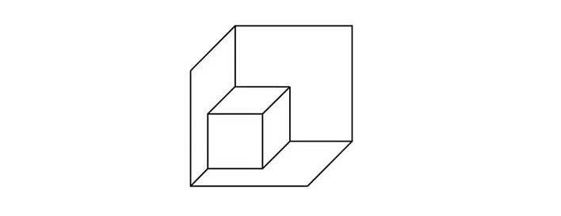
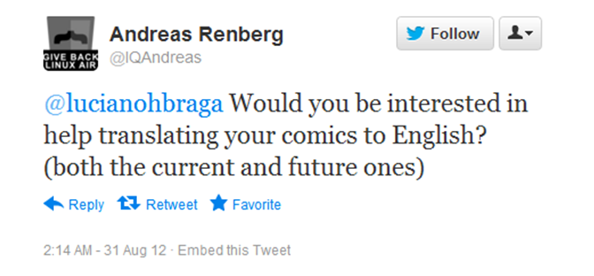
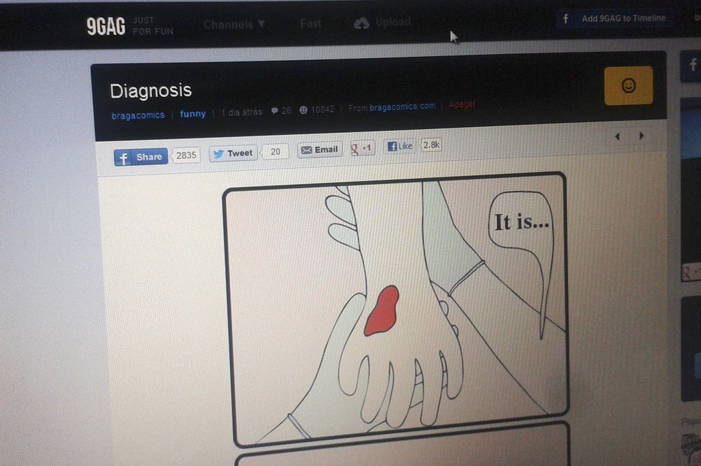

# Como aproveitar seu tempo livre para começar projetos paralelos?

Comecei a levar projetos paralelos a sério em algum dia de 2010 e hoje sou feliz vivendo disso

Eu não faço ideia do dia ou mês ou onde foi que comecei a dar bola para projetos paralelos. E quando digo “dar bola”, digo levar a sério, colocar no meu radar, fazer disso algo importante para a minha vida assim como comer, dormir, tomar banho, namorar, essas coisas que todo mundo faz praticamente todos os dias.

Talvez eu tenha começado no meio de um banho ou depois que recebi um comentário positivo em uma tirinha. Ou talvez vendo uma palestra sobre o assunto. Não sei. A única coisa que tenho certeza é que quando percebi, não havia mais volta.

Foi tipo “woooow, então é possível fazer outra coisa com meu tempo livre ao invés de só descansar e passar o tempo?”. Pode parecer absurdo para vocês, mas esse pensamento foi surpreendente pra mim na época. Juro que isso não passava pela minha cabeça e acredito que não foi só comigo. 'De onde eu venho', somos treinados desde sempre a separar trabalho de lazer, tempo remunerado de tempo livre, local de trabalho de local de dormir: se estamos sendo pagos, estamos trabalhando. Se não estamos, devemos descansar. Era assim. Simples, superficial e dicotômico.

PUBLICIDADE

[inRead invented by Teads](http://inread-experience.teads.tv/)

Descobrir que eu poderia fazer outra coisa no tempo livre além de ficar vendo séries ou trocar um sábado de sol no parque por ficar em casa trabalhando em algo que gosto – mesmo não ganhando 'nada' para isso – fez meu cérebro explodir. O estrago estava feito, não tinha como ele voltar para um estágio anterior que ignorasse essa possibilidade.

*O que ao primeiro olhar parece uma caixa num canto de uma caixa maior, com um esforcinho vira um cubo com um vértice faltando. Essa mudança de percepção faz com que você nunca mais consiga ver a caixa no canto sem saber que pode ser um cubo incompleto. Aprendi isso numa aula* [*desse curso*](https://www.coursera.org/learn/management-philosophy) *do Coursera.*

Eu não conseguia olhar mais para o meu tempo livre do mesmo jeito. Tempo livre se tornou tempo de criação, aprendizado, experimentação, descanso (também não sou nenhum ciborgue) e, mais importante, exercício de paixão.

Mas o ano em que isso aconteceu eu sei: foi lá por 2010. Eu já estava no “mercado” dos projetos paralelos há dois anos.

Em 2008 criei o [Tiras Toscas](https://tirastoscas.wordpress.com/), um blog com tiras (toscas) que fazia no meu tempo livre. No ano seguinte ele evoluiu para o [Braga Comics](http://www.bragacomics.com/), site de tirinhas (não tão toscas) que mantenho até hoje. Ainda em 2009 surgiu a [Shoot The Shit](http://www.shoottheshit.cc/), que na época era um espaço para tirar ideias da gaveta e hoje é um estúdio criativo de comunicação.

Todos esses projetos surgiram de sonhos e desejos que eu tinha, mas que não eram saciados pelo meu trabalho corporativo como redator numa agência de propaganda. E depois de fazer alguns cursos na Perestroika e ser picado pelo lema deles, o [Vai Lá e Faz](http://www.vlef.me/), comecei.

### Os primeiros passos

Sempre quis ser cartunista, desde pequeno, então por que não ser? Criei um Wordpress sem nenhum custo e comecei. Sempre quis fazer ações criativas estilo Greenpeace, pensei: por que não? Juntei com mais dois amigos e começamos a Shoot The Shit.

A partir dessa expansão do meu cérebro, decidi que sempre que eu quisesse ser/fazer algo, eu iria sê-lo/fazê-lo.

Eu queria viver a experiência de ser professor, então criei um curso chamado [Projetos Paralelos](http://www.lucianobraga.cc/#/projetos-paralelos/).

Eu queria ser roteirista, fiz um curso e comecei a escrever, tendo hoje uma série produzida na TVE, além de uma [história em quadrinhos pela metade](http://impeach-man.tumblr.com/) e outra em fase de pré-produção.

Eu queria que mais pessoas conhecessem as palestras do TED. Me juntei com uma amiga e criamos o [One Ted a Day](http://onetedaday.tumblr.com/).

Eu queria escrever um livro sobre o que aprendi nessa jornada dos projetos paralelos, fiz um projeto no Catarse e bum, o [livro](http://www.lucianobraga.cc/livro/) existe e está disponível de graça para quem quiser.

*Criei um curso para ver se eu gostava de dar aula, já que fazer mestrado ou algum outro pós me pareciam caminhos muito longos. Preferia fazer para ver se gostava do que investir 2 anos no meio acadêmico e me decepcionar depois.*

Ninguém precisa do “ok” de ninguém para ser algo. Se você também quer ser cartunista, basta você decidir isso e estará feito (e, obviamente, sair fazendo tirinhas). Qualquer coisa que você quiser ser, só depende de você.

Mas claro, não vamos ser ingênuos. Todos temos contas para pagar e trabalhos que ocupam 1/3 do dia. E OK. Não tem nada de errado nisso. Nossa sociedade funciona assim e continuará funcionando assim por um bom tempo. Errado é usar isso como desculpa para não começar aquele seu projeto que está na gaveta e que sempre foi seu sonho realizá-lo.

### Como começar?

#### Primeiro de tudo, arranje tempo

Às vezes vamos ver TV e o que era pra ser uma atividade de vinte minutos nos ocupa duas horas. Começamos a mexer no celular e uma hora passa voando. Quando não temos, no nosso tempo livre, muitas opções de entretenimento para usufruir, aceitamos mais facilmente o fato de estar trabalhando no nosso projeto paralelo.

Se estamos falando de projetos que vamos tocar no nosso tempo livre, então o tempo é nossa matéria prima e quanto mais tivermos melhor. Pare de ver tanta TV, delete seus jogos e o Facebook do celular. Corte seus feeds pela metade. Faça o que for necessário para desocupar o seu tempo livre – estranho pensar que o seu tempo **livre** está **ocupado**, né?

O objetivo aqui é diminuir potenciais distrações.

#### Crie uma rotina

Projetos paralelos podem muito bem sair do trilho por falta de organização. Como tocamos eles no nosso tempo livre, qualquer semana com muitos compromissos pode jogar o projeto para a gaveta novamente. Para que isso não aconteça, criar uma rotina é essencial. Podemos fazer isso colocando um calendário na nossa parede e definindo uma lista de tarefas.

A lista serve para que toda vez que você parar para fazer algo relacionado a sua iniciativa, esteja claro o que deve ser feito. Liste tudo que é preciso ser realizado e ordene por prioridade. Eu uso o [Wunderlist](https://www.wunderlist.com/) para isso. Daí cada vez que sobra um tempinho livre, abro ele e vejo qual é a tarefa no topo da lista.

Já colocar o calendário na parede e marcar todos os dias que você trabalhou no seu projeto te ajuda a não deixar que ele caia no esquecimento. Mesmo em momentos de intensa vida social, aquele calendário vai te olhar todo dia e dizer: “tá, e aí?”.

#### **Desapegue-se da perfeição**

Nada nunca vai ser perfeito e exatamente como a sua cabeça imaginou. Nada. Nunca. Simples assim. Aceite isso e vamos em frente. Como diria outro autor aqui da casa, [desista de ser bom](http://papodehomem.com.br/desista-de-ser-bom/).

#### **Venda-se**

Não tenha medo de contar para o mundo o que você gosta de fazer. Por mais que seu projeto possa ser bem *low profile*, saiba que mostrar aos outros abre espaço para feedbacks, elogios e a criação de um público. Ter pessoas que o acompanham e manifestam seu carinho é talvez a maior motivação que alguém pode ter.

Depois é trabalhar muito e deixar que o universo faça a sua parte também. Geralmente ele recompensa quem faz por merecer de maneiras incríveis.

*Uma vez recebi esse tweet de um desconhecido e alguns emails trocados depois, ele me mandou todas as minhas tirinhas traduzidas. O universo é foda.*

### E a grana?

Cara, nem tudo nessa vida é dinheiro, vai por mim. Projetos Paralelos não são sobre grana. São sobre você. Como eu disse, todo mundo tem seus empregos que ocupam oito horas de dedicação diárias, então esqueça o lado financeiro por um momento e pense em todos os benefícios que eles podem te trazer. Se você precisa de uma forcinha pra lembrar disso, lá vai:

#### Aumenta suas habilidades

Seja lá qual for seu emprego agora, é provável que você seja pago para realizar apenas uma única tarefa. Já num projeto paralelo, você tem que fazer praticamente tudo sozinho: marketing, relações públicas, reuniões, design, social media, atendimento, office-boy, programação, contabilidade (se der grana), etc. Não significa que você será bom em tudo, mas sempre serve como aprendizado.

#### **Gera conhecimento pessoal**

Num projeto paralelo, o caminho a ser tomado é decidido por nós mesmos, e não por um chefe ou memorando. A gente é que escolhe o que fazer, como fazer e com quem fazer. Saber quais são seus gostos, objetivos e paixões é importante nesse momento. E mesmo que você não saiba muito sobre você, trilhar esse caminho vai ajudar a encontrar respostas.

#### Pode se tornar o emprego dos seus sonhos

Quando começamos um projeto paralelo, geralmente criamos algo que gostamos de fazer. Seria burrice utilizar nosso tempo, esforço e grana em algo que não temos afinidade ou paixão. A partir do momento que começamos a fazer aquilo que a gente gosta, é “só” dar retorno financeiro para ele se tornar o emprego dos seus sonhos.

#### Traz mais paixão para seu dia-a-dia

Começar a fazer algo não porque alguém mandou ou porque vai dar dinheiro, mas simplesmente porque você gosta daquilo é talvez um dos sentimentos mais gratificantes que existe. Por mais lixo que seja seu trabalho assalariado, impossível você não ficar mais feliz e realizado ao ver algo com o seu DNA e seu esforço ganhar vida.

Eu até poderia continuar escrevendo mais benefícios aqui.

Ou poderia falar sobre o [pensamento renascentista](https://en.wikipedia.org/wiki/Polymath) que dizia que felicidade só é alcançada quando de alguma forma alimentamos nossa gama de talentos individuais.

Ou poderia contar a história da designer americana [Jessica Hische](http://jessicahische.is/), que começou um simples blog onde todo dia postava uma letra do alfabeto criada por ela mesmo e hoje tem no seu portfólio os letterings de um filme do Wes Anderson.

Ou falar do Bruce Wayne, que no seu tempo livre combatia o crime em Gotham City e hoje lemos livros contando sua história.

Ou poderia falar mais de mim mesmo, que hoje vivo dos meus projetos e atingi inúmeras conquistas com vários deles.

*Foto que tirei quando umas das minhas tirinhas apareceu na Hot Page do* [*9GAG*](http://9gag.com/u/bragacomics/posts)*, um dos maiores sites de humor do mundo. Defina felicidade.*

Eu poderia. Mas o tempo está passando.

Então em vez de ficar só reclamando que seu trabalho não satisfaz seu propósito, sua felicidade ou sua criatividade, pare e olhe com carinho para seu tempo livre. O que você gostaria de fazer? Que projeto está na sua gaveta? Como ele pode te ajudar a alcançar uma vida mais criativa e apaixonante? Você nasceu para fazer o quê?

Seja quinze minutos ou quatro horas por dia. Seja o final de semana inteiro (as séries ainda vão existir se você não abrir o Netflix). O tempo livre está aí. Todos temos. Basta decidirmos [o que fazer com eles](http://www.larusso.com.br/blog/2016/1/20/por-que-vivemos-para-pagar-contas).

> *“Não é sobre tempo, é sobre escolhas. Como você está gastando suas escolhas?”*
>
> *Beverly Adamo*

[Comece](https://www.youtube.com/watch?v=D-_tLB4ANj4).

---

*publicado em 07 de Fevereiro de 2016, 00:05*
