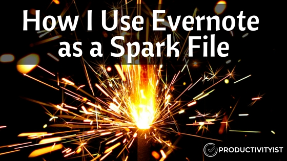
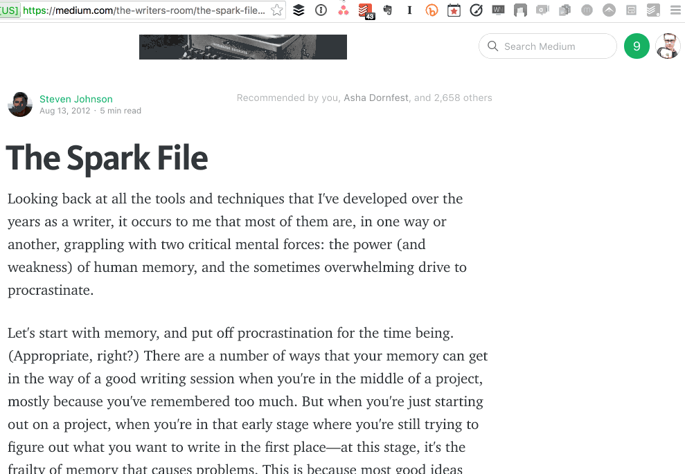
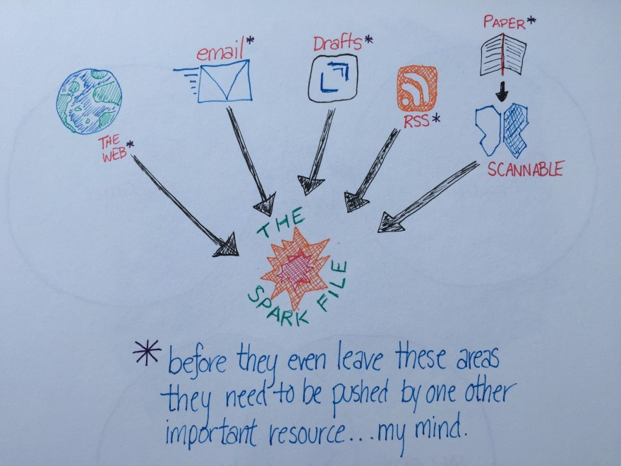
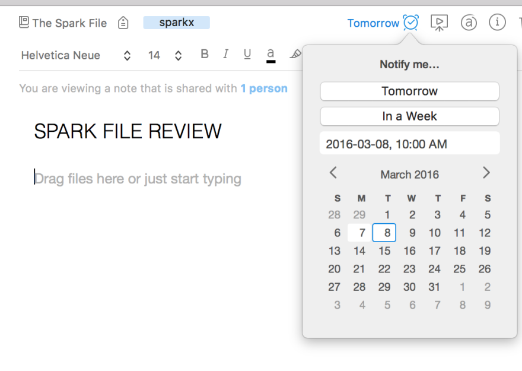

Writer Steven Johnson has written [an excellent piece over at Medium](https://medium.com/the-writers-room/the-spark-file-8d6e7df7ae58#.ocnwucfl2) about what he calls The Spark File. He describes it as follows:

> *“…for the past eight years or so, I’ve been maintaining a single document where I keep all my hunches: ideas for articles, speeches, software features, startups, ways of framing a chapter I know I’m going to write, even whole books. I now keep it as a Google document so I can update it from wherever I happen to be. There’s no organizing principle to it, no taxonomy–just a chronological list of semi-random ideas that I’ve managed to capture before I forgot them. I call it The Spark File.”*

He goes on to mention different ways The Spark File has helped him, but the most beneficial thing he does with The Spark File is revisit it regularly. This allows him to capture his thoughts and ideas without abandoning current writing assignments or activities with the knowledge that he can review these new captured moments at regular intervals.

I’ve taken a page from Steven Johnson and started my own spark file. But mine lives in [Evernote](https://www.evernote.com/referral/Registration.action?sig=b557601b87d365d549c1e1d32579b466&amp;uid=133165).

[I’ve been an Evernote user for a long time](http://productivityist.com/category/blog/apps/evernote-collection/), and I have primarily used it for research. Having my spark file live in Evernote as a notebook just seems like a no-brainer to me because of the the versatility of Evernote.

First off, the [Evernote Web Clipper](https://evernote.com/webclipper/) allows me to easily assign anything I find on the Internet to The Spark File. In fact, the clipper has decided that nearly everything I clip should go to The Spark File unless I manually change the notebook I’d like the content to land in.

Secondly, I share The Spark File with team members who help shape the content of Productivityist. That means that anything they find (or hear) that could be used as blog post (or something else) for Productivityist can easily be dropped into The Spark File for all of us to review. Plus, they can add their own notes to the content they’re adding (since each is a note) and even tag it with whatever type of content they feel it would be suitable as (we use blogcontent, coursecontent, ebookcontent, filmcontent, and audiocontent as tags with no spaces so that they can be found easily when searching notes).

Finally, since Evernote is essentially structured as a digital filing cabinet (and works really well with [Scrivener](http://lcmike.jarono.hop.clickbank.net/?tid=evernotesparkfile/)), I can easily move content from idea to content simply. I know where all of my ideas live and that removes a lot of friction from my work. That means I can grab an idea and run with it…or just let it incubate longer if need be.

### Getting Ideas into The Spark File

While using the Evernote Web Clipper is one of the most common ways to move ideas into the Evernote spark file, I also use [Drafts](https://geo.itunes.apple.com/us/app/drafts-4-quickly-capture-notes/id905337691?mt=8&amp;at=10l66s) on my iPhone and iPad to get things sorted into Evernote accordingly.

I’ve crafted an Action in Drafts that allows me to save notes directly to my spark file. [My friend Brett Kelly has put together a two-part series over at the Agile Tortoise website](https://agiletortoise.zendesk.com/hc/en-us/articles/203762058-Using-Drafts-with-Evernote-Introduction) that can help you do the same.

> If you’ve been searching for the best resource on Evernote then you’ll want to check out Brett Kelly’s **Evernote Essentials**. Brett is my go-to guy for all things Evernote and the recently revamped and refreshed Evernote Essentials is THE place to start if you want to get the most out of Evernote. [You can learn more about this amazing product by visiting the Evernote Essentials website.](http://members.nerdgap.com/order-evernote-essentials/?orid=2897&amp;opid=2/&amp;sid=sparkfilepost)

The other advantages of using Evernote for my spark file is that I can create audio notes. I like to talk things through so I can either create a note in my spark file that generates written content or add my verbalizations to existing notes that already have written content.

I also take pictures that “spark” ideas and use them in my spark file. I did this with an ad I saw in San Francisco for something that Nest was working on. I never did use the idea, but the fact I captured it and didn’t have to struggle to remember it kept my mind free to do more important things. Plus, the optical character recognition of Evernote allows me to easily search for terms that may be in a picture rather than text. This is useful if I decide to sketch out something on paper and bring it into Evernote for review later.

With the integration [Penultimate](https://geo.itunes.apple.com/us/app/penultimate/id354098826?mt=8&amp;at=10l66s) has with Evernote I can also sketch out outlines and on my iPad and bring them into The Spark File as well. I may not be able to do it directly (things I create in Penultimate go to the Penultimate notebook by default and then I manually move them to The Spark File notebook), but having that capability is another great feature. It allows me to explore how I may want to create content and develop ideas into something more tangible.

### How I Process The Evernote Spark File

Filling up The Spark File is one thing. Reviewing it and emptying it regularly is another. Here’s how I go through that whole process.

I created a way to “ping” myself to review The Spark File Notebook every week. I used to have a task set up in my task app to remind me to go review the notes in The Spark File every Monday and Tuesday, but I’ve done away with that reminder. Instead, I use Evernote’s reminder feature. I have a single note in that notebook that is titled “Spark File Review” and I reset it every time I review it. My usual frequency is to review the notebook’s contents every Sunday, Monday and Tuesday since Sunday is my day to plan and Monday and Tuesday are my themed days for writing. Generally I will grab enough ideas from The Spark File over those days to carry me through until the following Sunday.

As soon as an idea has been converted into something “real”, I delete it from The Spark File. The Spark File is only there to house ideas that haven’t been audited and made actionable. Once an idea is more than an idea, it no longer needs to be in that file.

That’s the whole process. I grab ideas from The Spark File, turn them into content, and delete the corresponding note from the notebook. It’s as simple as that.

Keeping a spark file in Evernote has helped me organize my thoughts and also streamline the process I use for creating new content. Just create a notebook in Evernote called Spark File (or something similar) and then start using it to store your random thoughts, ideas, and – as Steven Johnson calls them – “hunches.” Then start doing the work you need to do and let those random things find their way into Evernote when you can review them later…which is always better than trying to remember them when you’re in the middle of doing something now.
