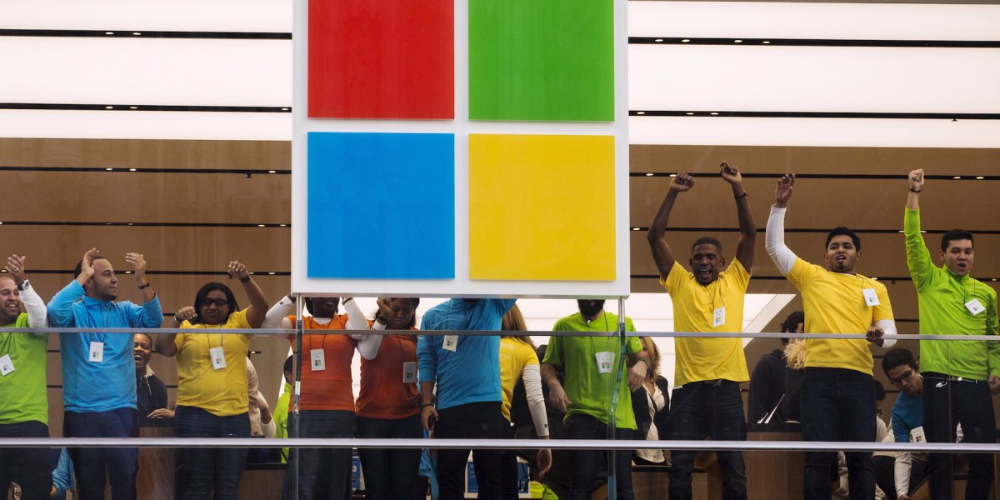
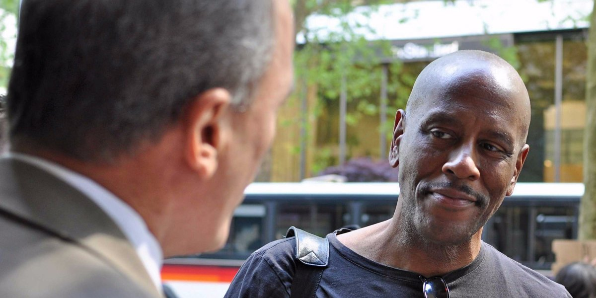
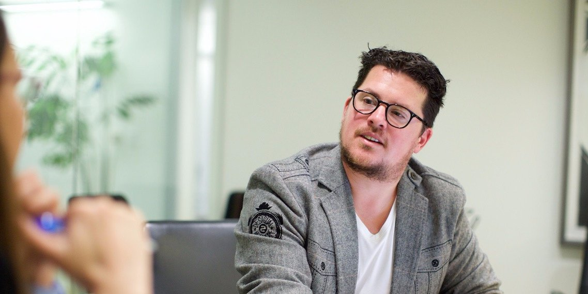
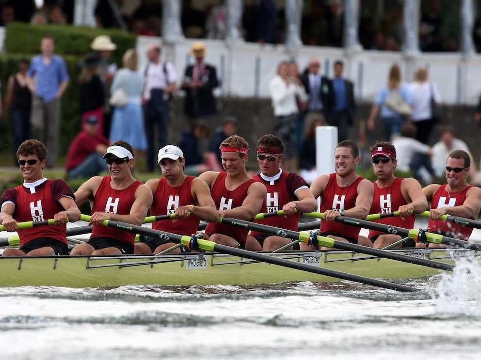

# 28 brilliant questions to ask at the end of every job interview

- [Jacquelyn Smith](http://www.businessinsider.com/author/jacquelyn-smith)
- [**](http://www.businessinsider.com/questions-to-ask-at-end-of-job-interview-2016-4mailto:jsmith@businessinsider.com)
  [**](http://twitter.com/jacquelynvsmith)
  [**](https://plus.google.com/u/1/+JacquelynSmith/posts?rel=author)

- May 2, 2016, 11:45 AM
- 1,738,095
- [6](http://www.businessinsider.com/questions-to-ask-at-end-of-job-interview-2016-4#comments)

- [**
  facebook](https://www.facebook.com/sharer/sharer.php?u=http://www.businessinsider.com/questions-to-ask-at-end-of-job-interview-2016-4 "facebook")
- [**
  linkedin](http://www.linkedin.com/shareArticle?mini=true&url=http://www.businessinsider.com/questions-to-ask-at-end-of-job-interview-2016-4&title=28%20brilliant%20questions%20to%20ask%20at%20the%20end%20of%20every%20job%20interview&summary=Here%27s%20what%20to%20say%20when%20the%20interviewer%20asks, "linkedin")
- [**
  twitter](http://twitter.com/share?url=http://read.bi/1O0UnIw&via=BI_Careers&text=28%20smart%20questions%20to%20ask%20at%20the%20end%20of%20every%20job%20interview "twitter")
- [**
  email](http://www.businessinsider.com/questions-to-ask-at-end-of-job-interview-2016-4# "email")
- [**
  print](# "print")

[[anexo ausente]](http://static4.businessinsider.com/image/56aa2886c08a809e2f8ba94c-960/8641127317_5d74845d3f_b.jpg)[AIGA RALEIGH/flickr](https://www.flickr.com/photos/aigaraleighdesigncommunity/8641127317)The questions you ask your interviewer can make or break your chances.

It's important to remember that every interview is a two-way street.

You should be assessing the employer just as much as they're assessing you because you both need to walk away convinced that the job would be a great fit.

So when the tables are turned and the interviewer asks, "Do you have any questions for me?" take advantage of this opportunity. It's the best way to determine if you'd be happy working for this employer, and whether your goals are aligned with theirs. 

"The very process of asking questions completely changes the dynamic of the interview and the hiring manager's perception of you," says Teri Hockett, chief executive of [What's For Work?](http://whatsforwork.com/Base/LandingPage), a career site for women. "Asking questions also gives you the opportunity to discover details that you might not have otherwise unveiled."

Amy Hoover, president of [TalentZoo](http://www.talentzoo.com/), says there's another reason you should always prepare questions. "It's expected — and if you don't ask at least two questions, you will appear disinterested, or worse, less intelligent and engaged than a prospective employer would like." You should have at least four questions prepared, though, in case your original two are answered through the course of the interview.

But, Hoover says, don't just ask questions for the sake of it. To actually benefit from them, you'll need to think carefully about what you want to ask.

"Your questions can, in fact, make or break an interview," she explains. "If they're not thoughtful, or if you ask something that has already been addressed, this can hurt you way more than it can help. Asking smart, engaging questions is imperative."

Luckily, there are plenty of smart ones to pick from.

Here are 28 questions you should always ask in a job interview — if they weren't already answered — to help you get a better sense of the role and the company, and to leave the interview with a positive, lasting impression:

#### View As: [One Page](http://www.businessinsider.com/questions-to-ask-at-end-of-job-interview-2016-4#) [Slides](http://www.businessinsider.com/questions-to-ask-at-end-of-job-interview-2016-4?op=0#/#-1)

  

[Flickr/Strelka Institute for Media](https://www.flickr.com/photos/strelka/25227340343/)

### Who do you think would be the ideal candidate for this position, and how do I compare?

Hoover recommends this question because it's a quick way to figure out whether your skills align with what the company is currently looking for. If they don't match up, then you know to walk away instead of wasting time pursuing the wrong position for yourself, she says.

### Who would I be reporting to? Are those three people on the same team or on different teams? What's the pecking order?

It's important to ask about the pecking order of a company in case you have several bosses, Vicky Oliver writes in her book, ["301 Smart Answers to Tough Interview Questions](http://www.amazon.com/gp/product/1402203853/ref=as_li_ss_tl?ie=UTF8&tag=thebusiinsi-20&linkCode=as2&camp=1789&creative=390957&creativeASIN=1402203853)."

If you're going to be working for several people, you need to know "the lay of the internal land," she says, or if you're going to be over several people, then you probably want to get to know them before accepting the position.

### How has this position evolved?

Basically, this question just lets you know whether this job is a dead end or a stepping-stone.

Reuters

Microsoft employees

### How would you describe the company's culture?

Hoover says this question gives you a broad view on the corporate philosophy of a company and on whether it prioritizes employee happiness.

### Who do you consider your major competitors? How are you better?

This question is not for the faint of heart, but it shows that you are already thinking about how you can help the company rise to meet some of its bigger goals, says Peter Harrison, CEO of [Snagajob](http://www.snagajob.com/).

### Beyond the hard skills required to successfully perform this job, what soft skills would serve the company and position best?

Knowing what skills the company thinks are important will give you more insight into its culture and its management values, Hoover says, so you can evaluate whether you would fit in.

Saiba mais

Saiba mais

[Flickr/KKendall](http://www.flickr.com/photos/kkendall/7173759082/in/photostream/)

### Do you have any hesitations about my qualifications?

While this question puts you in a vulnerable position, it shows that you are confident enough to openly bring up and discuss your weaknesses with your potential employer.

### What do you like most about working for this company?

Hoover says this question is important because it lets you "create a sense of camaraderie" with the interviewer because "interviewers — like anyone — usually like to talk about themselves and especially things they know well." Plus, this question gives you a chance to get an insider's view on the best parts about working for this particular company, she says.

### Can you give me example of how I would collaborate with my manager?

Knowing how managers use their employees is important so you can decide whether they are the type of boss that will let you use your strengths to help the company succeed.

[Sebastiaan ter Burg/Flickr](https://www.flickr.com/photos/ter-burg/16036794635/in/album-72157649375763027/)

### Can you tell me what steps need to be completed before your company can generate an offer?

"Any opportunity to learn the timeline for a hire is crucial information for you," Hoover advises.

Asking about an "offer" rather than a "decision" will give you a better sense of the timeline because "decision" is a broad term, while an "offer" refers to the point when they're ready to hand over the contract.

[](https://www.googleadservices.com/pagead/aclk?sa=L&ai=C3-CeUmkrV9X-O5GYxATh1rqgDpmv16oFmfCk4PEBmYulytMCEAEg__D4IWDNwOeAnAOgAZe-r9YDyAEC4AIAqAMByAOZBKoEzwFP0HAHJ6JHEi89MZgojyoTCcLSEXiCZjHUboHORXVuRunPhqnPeQfVbEfwWDxuUVFezRU5b33Qp6FGcmBrxf32IBp71UNI3VEvzq8jFqwr4iVmuQZlGIAu47zsA3O9IPNkzvbFf9ROqUtTAQnairWRKGZjAUK0E0yeAfBarWVkfz0rS9EgJX7uyAENVEFy4r_9TLJLlXLYeLzBJvc_usSuQJ4LmvaWUQq9jfSkf5nQus-lsPdkDpkcfjA8K20RPsW0YawpcYl4pW4YcHhaLkbgBAGIBgGgBgKAB9HB0CmoB6a-G9gHAQ&num=1&cid=CAASEuRoD4tv78fGYdhtPLQvQ24oaA&sig=AOD64_0g7dQBjioaUIloFaUVkNrfrpKtlA&client=ca-pub-1037373295371110&adurl=http://www.ecwid.com%3Fsource%3DPPC-g-RemarketingNE%26jadid%3D64800144913%26jap%3Dnone%26jk%3D%26jkId%3Dgc:a8a8ae4cd48b4d7920148d531f36b4c53:t8_:k_:pl_www.businessinsider.com%26jp%3Dwww.businessinsider.com%26js%3D1%26jsid%3D36964%26jt%3D1)

[anexo ausente]

### How would you score the company on living up to its core values? What’s the one thing you’re working to improve on?

Harrison says this is a respectful way to ask about shortcomings within the company — which you should definitely be aware of before joining a company. As a bonus, he says it shows that you are being proactive in wanting to understand more about the internal workings of the company before joining it.

### What are the challenges of this position?

If the interviewer says, "There aren't any," you should proceed with caution.

[anexo ausente]

[WOCinTech Chat/flickr](https://www.flickr.com/photos/wocintechchat/22543243101/)

### What have past employees done to succeed in this position?

The main point of this question is to get your interviewer to reveal how the company measures success.

### If you were to hire me, what might I expect in a typical day?

Obviously this shows your eagerness about the position, Harrison says, but it also gives you a better idea about what the job will be like on a daily basis so you can decide whether you really want to pursue it. "A frank conversation about position expectations and responsibilities will ensure not only that this is a job you want, but also one that you have the skills to be successful in," he advises.

### What type of employee tends to succeed here? What qualities are the most important for doing well and advancing at the firm?

This question shows the interviewer that you care about your future at the company, and it will also help you decide if you're a good fit for the position, Oliver writes. "Once the interviewer tells you what she's looking for in a candidate, picture that person in your mind's eye," she says. "She or he should look a lot like you."

### Is there anyone else I need to meet with?/Is there anyone else you would like me to meet with?

Hoover says knowing if they want you to meet with potential coworkers or not will give you insight into how much the company values building team synergy. In addition, if the interviewer says you have four more interviews to go, then you've gained a better sense of the hiring timeline as well, she says.

Phil Cole/Getty Images

### How do you help your team grow professionally?

Harrison says this question shows that you're willing to work hard to ensure that you grow along with your company. This is particularly important for hourly workers, he says, because they typically have a higher turnover rate, and are thus always looking for people who are thinking long-term.

### When your staff comes to you with conflicts, how do you respond?

Knowing how a company deals with conflicts gives you a clearer picture about the company's culture, Harrison says. But more importantly, asking about conflict resolution shows that you know dealing with disagreements in a professional manner is essential to the company's growth and success.

### Will I have an opportunity to meet those who would be part of my staff/my manager during the interview process?

Getting the chance to meet with potential teammates or managers is essential to any professional interview process, Hoover says. If they don't give that chance, "proceed with caution," she advises.

### How do you evaluate success here?

Knowing how a company measures its employees' success is important. It will help you understand what it would take to advance in your career there — and can help you decide if the employer's values align with your own.

[Strelka Institute for Media, Architecture and Design](https://www.flickr.com/photos/strelka/14913755183/)

### What are some of the problems your company faces right now? And what is your department doing to solve them?

Asking about problems within a company gets the "conversation ball" rolling, and your interviewer will surely have an opinion, Oliver writes. Further, she says their answers will give you insights into their personality and ambitions and will likely lead to other questions.

### What's your timeline for making a decision, and when can I expect to hear back from you?

This one tells them you're interested in the role and eager to hear their decision.

"Knowing a company's timeline should be your ultimate goal during an interview process after determining your fit for the position and whether you like the company's culture," Hoover says. It will help you determine how and when to follow up, and how long to wait before "moving on."

### Is this a new position? If not, why did the person before me leave this role?

This might be uncomfortable to ask, but Harrison says it's not uncommon to ask and that it shows you are being smart and analytical by wanting to know why someone may have been unhappy in this role previously.

If you found out they left the role because they were promoted, that's also useful information.

[Pressmaster/Shuttershock](http://www.shutterstock.com/pic-240326128/stock-photo-businessman-pointing-at-notepaper-while-explaining-his-idea-to-colleague.html?src=pp-same_model-240326176-_FrkFx7GxpE52_-i4CgAhw-3&ws=1)

### Where do you see the company in three years and how would the person in this role contribute to this vision?

Asking this question will show your interviewer that you can think big picture, that you're wanting to stay with the company long-term, and that you want to make a lasting impression in whatever company you end up in, says Harrison.

### I read X about your CEO in Y magazine. Can you tell me more about this?

Oliver says questions like this simply show you've done your homework and are genuinely interested in the company and its leaders.

### What's your staff turnover rate and what are you doing to reduce it?

While this question may seem forward, Harrison says it's a smart question to ask because it shows that you understand the importance of landing a secure position. "It is a black and white way to get to the heart of what kind of company this is and if people like to work here," he says.

[antoniodiaz/shutterstock](http://www.shutterstock.com/cat.mhtml?country_code=US&page_number=4&position=60&safesearch=1&search_language=en&search_type=keyword_search&searchterm=resume&sort_method=popular&source=search&timestamp=1449588116&tracking_id=cFli5Xr0WTNhVey3U59yhw&page=4&inline=289870199)

### Is there anything else I can provide to help you make your decision?

This simple question is polite to ask and it can give you peace of mind to know that you've covered all your bases, Hoover says. "It shows enthusiasm and eagerness but with polish."

### Is there anything we haven't covered that you think is important to know about working here?

Hoover says this is a good wrap-up question that gives you a break from doing all the talking. In addition, she says you may get "answers to questions you didn't even know to ask but are important."

*Vivian Giang and Natalie Walters contributed to previous versions of this article.*
