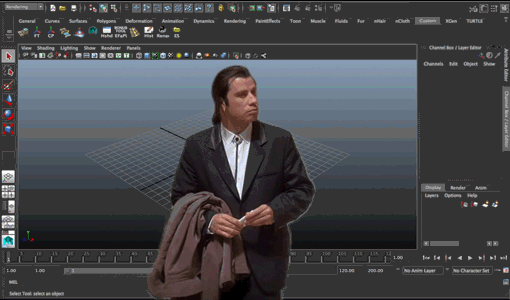
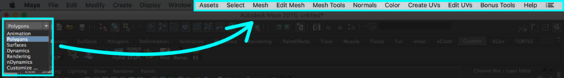
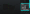
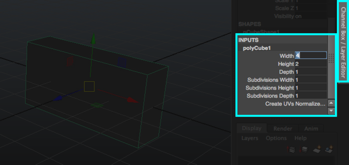
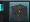
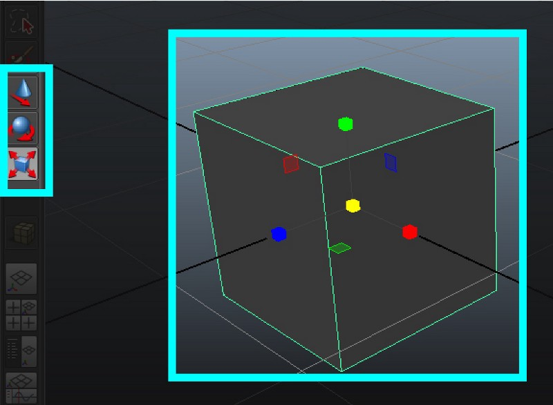
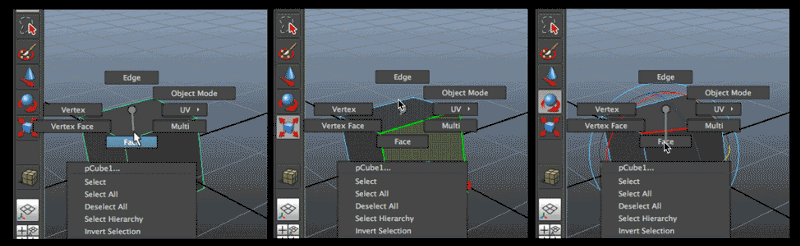
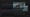
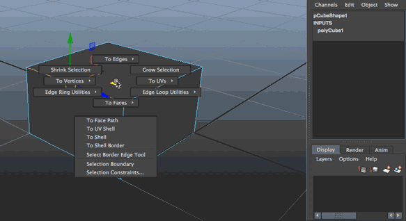
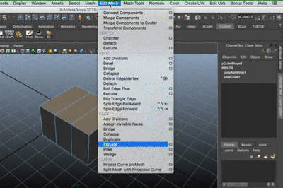

# 3D modeling for UI Designers

#### Part 1 — Creating 3D objects

Recently I've had the opportunity to work in an awesome project at [HE:labs](http://helabs.com/en/). It was an interactive isometric map where each building represented a project and on mouse over we displayed a short looping animation as a preview of what that project was about. I got some really good feedback for this app and the client was really happy with it, so I felt like it could be a good opportunity to explain a really simple approach for creating 3D images and animations for apps using Maya.

If you never ever opened Maya, the interface can be a bit scary. With so many little buttons and options, it’s quite easy to get lost.

This was me, opening Maya for the first time

But I'll try my best to make this tutorial simple, so let's focus on what's important for us. I'm going to split this tutorial into 3 parts. The first one for creating 3D models, the 2nd one for rendering out images and the third part for creating simple 3D animations.

I’m using **Maya 2015**. The interface tends to change a bit from one version to the other, so if you don’t have Maya installed on your computer, I suggest installing the same version to follow along :)

#### Understanding the interface

First of all, make sure that the dropdown menu on the top left corner is set to "**polygons**". Each option of this dropdown unlocks several other options on the top menu, so it's important that it's set to polygons while we're creating 3D objects.

When you change the option on the dropdown, you'll notice that the top menu also changes

On the top menu, if you select *Create > Polygon primitives,* you'll see a bunch of options for creating basic objects like cubes, spheres and cylinders. Every time that you create a *primitive,* you'll notice that inside the *Channel box/Layer editor* tab on the right side of your monitor, a new *Input* with the name of the primitive will be created ( something like *polyCube1* ). Clicking on this name, you'll be able to modify some attributes of the primitive, like width, height and depth.

Now that we have created our first primitive, let's explore the main tools for modelling. On the left side of your monitor, you'll notice 3 buttons with primitives and red arrows. Those buttons allow you to *Translate ( Move ), Rotate* or *Scale* an object in a Maya scene.

Using the scale tool to change the size of a cube

These tools can also be used for *vertices, edges* and *faces*. If you right click on an object, you'll see some options that allow you to change the selection mode between them.

Scaling a face, rotating an edge and moving a vertice

By default, you should see a viewport with 4 different cameras. I like to work using a single panel with a perspective view. If you’d like the same, you can change it by selecting *Panels > Layouts > Single Pane.*

You should also try holding down alt and middle mouse dragging to move the camera around. If you hold down alt and left drag instead, you’ll rotate the camera. If you want to set the camera to an object, just select the object and press F :)

#### Modeling an old Factory

Now that we understand a bit better how things work, let's create this factory icon to explore modelling techniques.

The final result should look like this :)

We can start by creating a cube. Select an edge and hold down *command* ( or *ctrl* if you're using Windows ) and right click on the cube. You'll see another menu show up. While still holding down the right mouse button, move the mouse to *Edge ring utilities* and then to *Edge ring and split.* Inside *INPUTS,* you can change the *split type* from *relative* to *multi* and select how many *divisions* you want. We'll use these divisions to create the roof.

Hovering to select can be tricky at first but it makes the flow faster once you get it :)

Now you can select the faces on top of the cube, and extrude them ( *edit mesh > face > extrude* ) This will allow you to pull those faces out, creating the roof. You should also turn off the option *"Keep Faces Together"* on the side panel and increase the *Offset* on the black and yellow menu close to the control arrows. After that, if you delete one edge from each "roof" you'll get a triangle shape.

To create the door, for example, you can start with a cube, then extrude and offset the front face to create the door trim. You can detach the front face from the door trim by going to *Mesh > Separate > Extract.* Keeping it separated will allow you to model the door without affecting the trim. To create the metal bars of a rolling door, use the *edge ring and split*, and then *extrude* the faces. Once you have one door ready, you can duplicate it by pressing *Ctrl + D.*
