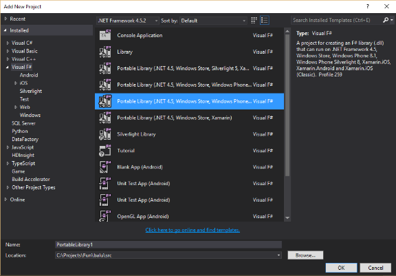
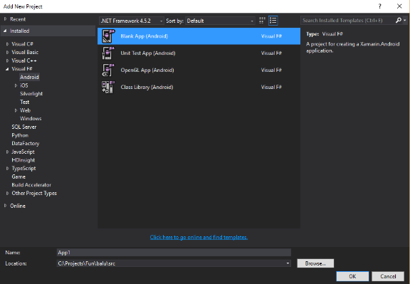

# Starting Xamarin Android application development with F#

Tue Apr 19 2016

I am not a mobile application developer but I needed to build an Android application. As for .NET developer, Xamarin Android was a natural choice.

# Introduction

Previously I tried to build [Xamarin Android](https://developer.xamarin.com/guides/android/) applications in *F#* too. I was able to create a simple application, but I had issues creating *PCL* libraries to be able to reuse common code with other applications. Now I have installed [Visual Studio 2015 Update 2](https://www.visualstudio.com/en-us/news/vs2015-update2-vs.aspx) which includes new project templates for *F#*, including *Android*, *iOS*, and *PCL*.

# Creating a F# Android application

With a new update of *Visual Studio*, *F#* finally gets *PCL* library templates which allow building cross-platform libraries. By using *PCL* library in my *Android* application, I can keep all application logic separately from UI. And if I would like to build *iOS* or *Windows Phone* versions of my application, I could reuse the library.

So let's start with *PCL* library. I chose *PCL* library template which has support for *iOS*, *Android*, and *Windows Phone*.

Next, I wanted to create *Android* application - chose *Blank App (Android)* template.

But after selecting the template and creating the project, the project fails to load. After some googling found out the I am not the only guy with such [issue](http://stackoverflow.com/q/36349718/660154). Also found that it might be caused by *Android* template to expect *F# SDK 3.0* to be installed, but *Visual Studio* is installed with *F# SDK 3.1*. When I installed *SDK 3.0* from [here](http://go.microsoft.com/fwlink/?LinkId=261286), the project started to load.

# Deploying an application to an Android Emulator

## Issues with Android Emulator

Previously I successfully deployed an application to a phone, but never got default *Android Emulator* to run and didn't try other emulators. I tried it again, but still - no success. When deploying an application from *Visual Studio*, *Android Emulator* starts with a black screen and nothing happens. When I tried to run it from *Android Emulator Manager*, it displayed *Android* logo and hung. I didn't bother to find out why because there are other options available.

## Issues with Visual Studio Android Emulator

*Visual Studio Android Emulator* seemed really good, but unfortunately, it doesn't run on my computer. It uses *Hyper-V* virtual machine. I had *Hyper-V* enabled, but it didn't work because I have a *Windows 10 Pro* upgraded from *Windows 10 Home*. And there is an issue with *Windows* upgrade that it doesn't create *Hyper-V* administrator group and it is not possible to create it manually.

I could install *Windows 10 Pro* from the scratch, but *Windows 10 Multiple Editions* *ISO* image I have from *MSDN* doesn't give me a choice to install *Windows 10 Pro* - it installs *Home* version by default.

So I had to find another option for *Android* emulation.

## Genymotion - Android Emulator which works

I found that there is another *Android Emulator* - [Genymotion](https://www.genymotion.com/). It uses *VirtualBox* for *Android* emulation.

After installation tried to run it, but it failed. After some googling found that *Hyper-V* has to be disabled. As I am not using it (and unable to use it), I turned it off. But there are options to [switch between Hyper-V and VirtualBox](http://www.hanselman.com/blog/SwitchEasilyBetweenVirtualBoxAndHyperVWithABCDEditBootEntryInWindows81.aspx).

Now I am able to run and deploy my *Android* application from *Visual Studio* in an emulator:

# Deploying an application to a device

Deployment onto device were simple. First had to enable developer options by opening *Settings -> About phone* and tapping multiple times on *Build number*. Next, enable *USB debugging* in *Developer options*, connect the phone to the computer. *Windows 10* finds required drivers and connects the phone. Then an option to debug an application on the phone appeared in *Visual Studio*. Start debugging and application gets deployed to the phone.

# Summary

After initial *Android* application project setup and successful deployment to an emulator and device, it is quite easy for .NET developer to start creating applications. But getting started is not smooth and could frighten off some developers. I hope that after *Microsoft* [acquisition](http://blogs.microsoft.com/blog/2016/02/24/microsoft-to-acquire-xamarin-and-empower-more-developers-to-build-apps-on-any-device/#sm.0001ow17ovl7ydvbwzj26l7705nl5) of *Xamarin*, things will get better.
