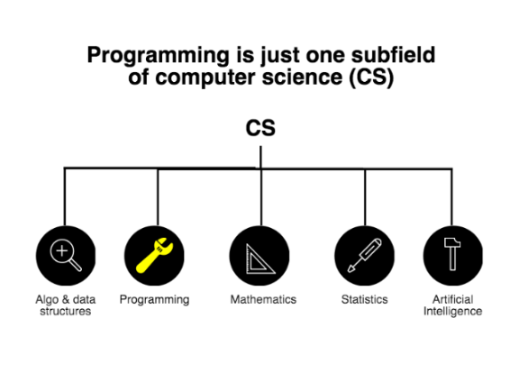
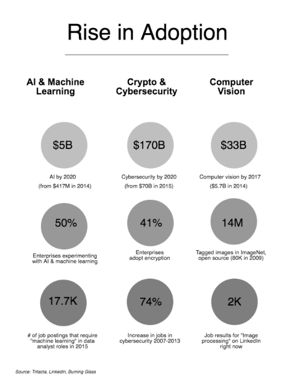
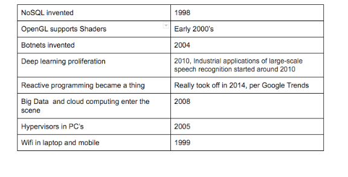

# The Immutability of Math and How Almost Everything Else Will Pass

8 min read

*This article was originally published on [Forbes](http://www.forbes.com/sites/vivekravisankar/2016/05/31/the-immutability-of-math-and-how-almost-everything-else-will-pass/2/#66808b7af488)*  
*TL;DR: Right now, there’s a cultural push to untie the historical link between advanced math and programming that could partially deter engineers from entering the field. But those who have a strong foundation in math will have the best jobs of the future. Let’s stop separating math from programming for short-term relief and, instead, focus on fundamental, unchanging truths with which we’ll engineer the future.*

---

If you dig deep into today’s discourse on the role of mathematics in programming, you’ll find a sharp, double-edged sword.

On the one hand, people often say that because the number of app development tools are growing, you don’t necessarily need to be great at math to write software today. Amidst a widespread shortage of traditional programming talent, numerous [opinion pieces](http://www.slate.com/articles/life/classes/2015/08/what_coding_class_should_i_take_programming_is_like_learning_a_new_language.html), [video interviews with educators](https://www.youtube.com/watch?v=bZjTbb9eBX0) and [forum questions](https://www.quora.com/Should-I-pursue-computer-science-if-I-am-bad-at-math) point to answers that are positioned to ease the apprehension of people exploring the field. And it’s true. Chances are, the average software engineer is not going to need Calculus while coding apps in Ruby on Rails. If you look at any given job requirement, you’d be hard pressed to find probability or number theory next to Java or C++ skills.

Since computer science is a nascent field that sprouted out of mathematic departments, there’s a cultural push to untie the historical link between advanced math and programming that could partially deter engineers from entering the field. For instance, there are literally half a dozen recent articles titled with something like: *“You Don’t Have to be Good at Math to Code”* ([1](http://www.sarahmei.com/blog/2014/07/15/programming-is-not-math/), [2](http://www.robbyonrails.com/articles/2008/01/01/advanced-mathematics-and-programming), [3](http://inventwithpython.com/blog/2012/03/18/how-much-math-do-i-need-to-know-to-program-not-that-much-actually/), [4](http://www.theatlantic.com/technology/archive/2015/09/you-dont-have-to-be-good-at-math-to-learn-to-code/403342/), [5](http://www.slate.com/articles/life/classes/2015/08/what_coding_class_should_i_take_programming_is_like_learning_a_new_language.html), [6](https://www.mutuallyhuman.com/blog/2014/01/14/math-is-not-necessary-for-software-development/)). Downplaying the importance of mathematical knowledge in software development aims to help make the field less intimidating for entry-level programmers.

But is downplaying the importance of math a sustainable message for future generations of engineers?

On the other hand, software development is quickly shapeshifting. If you discount mathematics, and in turn focus on learning transitory programming tools, you’ll be left without the skills necessary to adapt to emerging computer science concepts that have already started infiltrating engineering teams today. Without expanding mathematical knowledge, these software engineers are going to risk being left out of the most exciting, creative engineering jobs of the rapidly approaching future.

**Math is a Veiled Pillar**

The reality is that even though most programmers today don’t need to know advanced mathematics to be good software developers, math is still a fundamental pillar of both computer science and software development. Programming is just one tool in a computer scientist’s toolkit—a means to an end. It’s hard to draw definitive lines between disciplines, but here’s an attempt at an eagle-eye view of computer science as a field to build a bigger picture:

At its core, computers are centered on the mathematical concept of logic. Fundamental math that you learn in high school or middle school, like linear algebra, boolean logic, graph theory, inevitably shows up in daily programming. Here are 10 examples of times when you might need mathematics in real-world programming today:

1. **Number theory.** If you’re ever asked how one algorithm or data structure performs over another, you’ll need a solid grasp of number theory to make that analysis.
2. **Graphing.** If you’re programming for user interface, basic geometry, like graphing, is an essential skill.
3. **Geometry.** If you’re creating a mobile app and you need to create custom bounce animations that are modeled on springs, you’ll need geometry skills.
4. **Basic Algebra.** If your boss asks you: How much user retention can we expect to grow next month if we increase the performance of our backend by 20%? This is a pure variable equation.
5. **Single Variable Calculus.** These days [FinTech firms like Jane Street](https://twitter.com/sama/status/720613807861719040) are among the most sought-after companies for programmers because they pay well and have interesting challenges. You need to be able to analyze financial parameters to make crucial predictions to get these coveted jobs.
6. **Statistics.** If you’re working at a startup and you need to A/B test different elements on a website, you might be tapped to understand normal distribution, confidence intervals, variation and standard deviation to see how well your code change is performing.
7. **Linear Algebra.** Anytime you have image processing problems, recommendation engines (like Google’s PageRank or Netflix’s recommendation list), you need linear algebra skills.
8. **Probability.** When you’re debugging or testing, you’ll need a solid understanding of probability to make randomized sequences reproducible.
9. **Big-O.** If your company’s expanding to a brand new region, and you don’t understand the implications of a O(N^2) sorting algorithm, you could be pinged at odd hours because the expansion introduced holes in the algorithm.
10. **Optimization.** Generally, anytime you need to make something run faster or perform better, you should be able to know how to get the minimum and maximum value of a function.

We’re far beyond the point of needing engineers to code simple solutions. Engineering teams at enterprises and—especially—startups have to earn the leading edge. They rely

on engineering and product teams to gain competitive advantage by investing in emerging concepts like Big Data manipulation, handle high-scale systems and predictive modeling. And they all require a solid framework of mathematics.

It’s not uncommon to hear refutations like: *I’ve been a software engineer for 15 years and never used advanced mathematics on the job.* But are we all really still going to be coding web and mobile apps 10 years from now?

**Those Who Incrementally Exercise Mathematics Skills Will Get the Coolest Jobs**

In the beginning of this piece, we considered why many educators and experts might be downplaying the importance of math in daily programming to encourage more engineers to enter the field. In order to meet the demand for engineering talent in the next 5 to 10 years, it’s clear that we need to take steps to encourage more peopleof diverse backgrounds to join the field. The [BLS reports](http://www.exploringcs.org/resources/cs-statistics)that computing and mathematics will make up more than half of the projected growth of annual STEM job openings between 2010 – 2020.

But this message of *“you don’t have to be good at math to program”* is actually fueling a self-destructive myth that’s baked into our culture today, which is: Math skills can’t be acquired: You’re either born with it or you’re not. This myth persists for at least two reasons:

One, [Professors Miles Kimball and assistant professor Noah Smith](http://www.theatlantic.com/education/archive/2013/10/the-myth-of-im-bad-at-math/280914/) have taught math for many years and say: “people’s belief that math ability can’t change becomes a self-fulfilling prophecy.” Consistently saying that you’re “not a math person” means you won’t be a math person.

Two, people perceive mathematical fields as dry and uncreative. It goes back to the [oversimplification of the dichotomy between the “left brain” humanities and “right brain” STEM subjects](https://braindecoder.com/post/neil-degrasse-tyson-elegantly-debunk-right-left-brain-myth-1120713524). People who want to be more creative have more reasons to distance themselves from math.

A better way to attract more people to the field is by talking about the interesting, creative jobs that are taking over the future of software development.

In the next 10 years, software engineers aren’t still going to be limited to programming web and mobile apps. They’ll be working on writing mainstream computer vision and virtual reality apps, working with interesting cryptographic algorithms for security and building amazing self-learning products using machine learning. You can’t go very far in any of these fields without a solid mathematical foundation.

As the field of computer science is expanding, companies are going to be able to take advantage of more complex math to build software technology. Dr. Ann Irvine, principal data scientist at security software company[RedOwl](https://redowl.com/), always looks for strong intuition on how to work with large datasets. And math happens to be inherently tied to this skill.

> *“It’s largely enabled by the fact that lots of modern computer algorithms, especially in machine learning, take advantage of very large data sets, so that enables the use of more complex mathematical models.” – Principal Data Scientist Ann Irvine, PhD*

As it stands today, you don’t need much beyond basic algebra and geometry for software development in general. But software development of the future will be made up of highly specialized subfields of CS. Here’s a chart that illustrates just how fast these futuristic technologies are shifting toward the mainstream consumer market. The first row talks about the market opportunity in the next 4 years, the second row highlights the adoption rate and the final row is an indication of the job demand today:

**Focus on the Fundamentals Because Technology Will Pass Anyway**

*“The most valuable acquisitions in a scientific or technical education are the general-purpose mental tools which remain serviceable for a lifetime.” – George Forsythe, the founder of Stanford’s computer science engineering department.*

It’s far more empowering to talk about the importance of skills that serve you for a lifetime rather than the demand for short-term tools today. Math is an unshakeable force in programming. The  core concept of breaking down problems, abstractions and finding solutions using formal formulas will never change.

**In fact, academia is susceptible to a massive, inherent failure in being able to keep up with the ever changing tools that industries demand. Hisham H. Muhammad is a computer science PhD and [illustrates the argument perfectly in this Tweet](https://twitter.com/hisham_hm/status/675845003709702144) below. It’s interesting to contrast the years in which Hisham studied computer science between 1994-2000 with the years at which the technologies mentioned started taking off:**

There’s such an emphasis on branches of programming language and tools today that it’s easy to miss the bigger forrest. It’s better to start practicing now while there’s no significant pressure to apply advanced concepts to your work…yet. Even if it’s by solving one mathematical problem a day, you’ll be so much better equipped with tools to solve much more interesting problems down the line. Let’s stop separating math from programming for short-term relief and, instead, focus on fundamental, unchanging truths with which we’ll engineer the future.

**Resources to Help Boost Confidence in Math:**

- Forget what you learned in school (memorizing theorems or trig identities won’t help you). Instead, learn to recognize problems and choose the right formula.
- Read great books:
  - *[*Art of Problem So*](https://www.artofproblemsolving.com/store)*
  - *Mathematics for Computer Science (*[*free eBook*](https://www.cs.princeton.edu/courses/archive/fall06/cos341/handouts/mathcs.pdf)
  - *Godel Escher Bach*[*free eBook*](http://www.physixfan.com/wp-content/files/GEBen.pdf)
