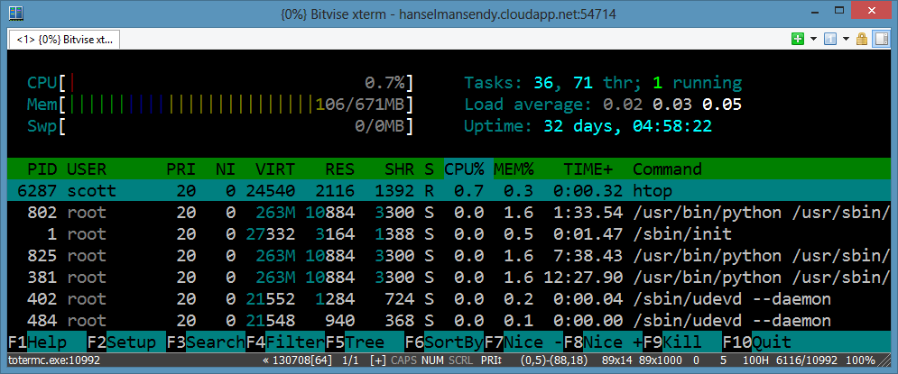
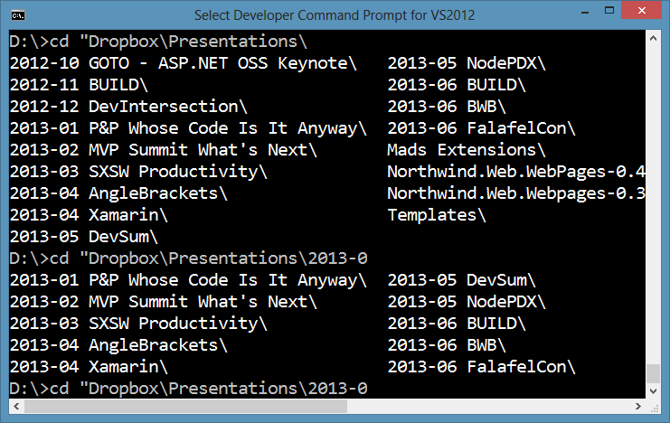
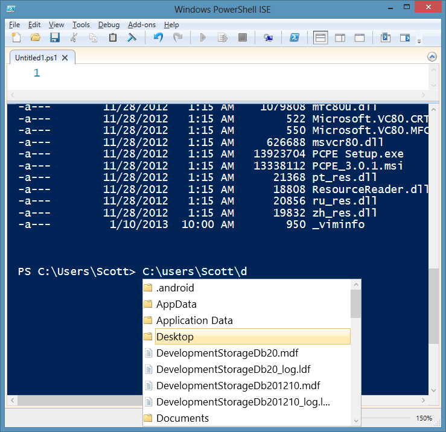
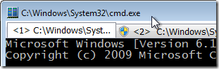
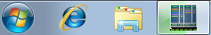
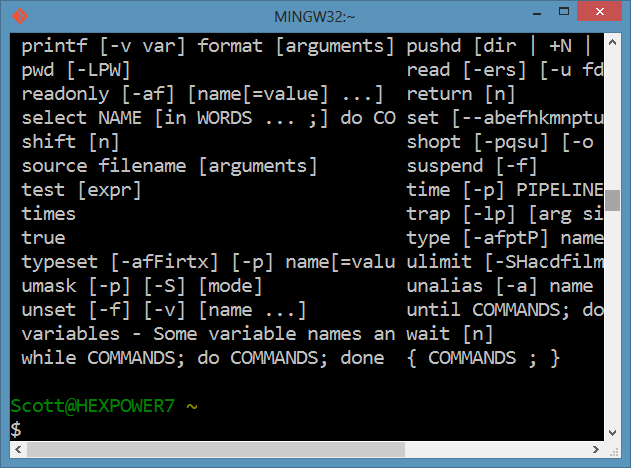
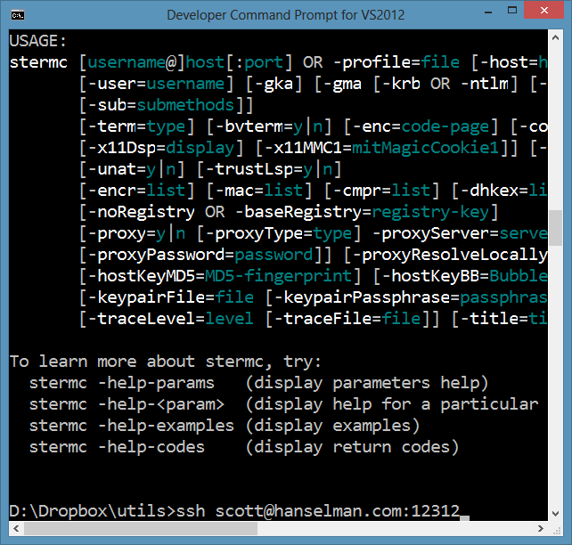
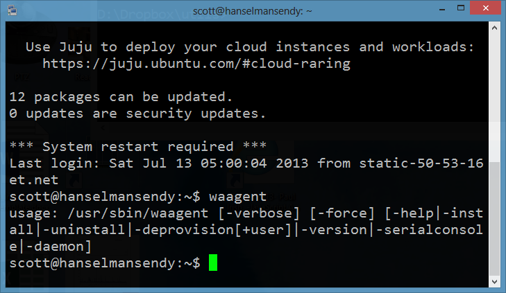

## [Making a better, somewhat prettier, but definitely more functional Windows Command Line](http://www.hanselman.com/blog/MakingABetterSomewhatPrettierButDefinitelyMoreFunctionalWindowsCommandLine.aspx)

July 16, '13
[Comments [58]](http://www.hanselman.com/blog/CommentView.aspx?guid=6c51ca98-9588-4d4b-ab4a-ad772035c43f#commentstart)
Posted in [Tools](http://www.hanselman.com/blog/CategoryView.aspx?category=Tools)

I've blogged before, in fact in 2004, (!) [that Windows is missing the text mode boat](http://www.hanselman.com/blog/OpportunityWindowsIsCompletelyMissingTheTextModeBoat.aspx). There is a massive opportunity for a great, nay, awesome and pretty, command line on Windows. If someone cracks this problem, they're gonna be heroes.

I love iTerm2 and its tabs, its font handling, its simple elegance. I want this on Windows. In 2011 [I found Console2](http://www.hanselman.com/blog/Console2ABetterWindowsCommandPrompt.aspx), and then in 2012 I moved to [ConEmu, a great tabbed terminal for Windows](http://www.hanselman.com/blog/ConEmuTheWindowsTerminalConsolePromptWeveBeenWaitingFor.aspx). Even then, it's not "pretty." I love these guys, and the ConEmu is truly an amazing and configurable piece of software, but it was written by developers for developers. I have to change the fonts to Consolas for the main font and Segoe UI for the rest to make it tolerable. Am I being petty and focusing on looks? Absolutely. Gorgeous and functional software is why Mac companies like [Panic](http://panic.com/transmit/) exist. They make things that are pretty AND functional. Windows folks could definitely "lovingly design" stuff more.

Here's some command line utilities that augment and help - but don't yet complete *save* - the Windows Command Line.

### [Clink](https://code.google.com/p/clink/)

I just learned about [Clink](https://code.google.com/p/clink/) and I'm hooked. It's hooked as well, directly into your cmd.exe window! \*rimshot\*

We all know that there's Cygwin for a bash-like experience in Windows, but Click is a small utility that brings some of those productivity and editing features into cmd.exe directly!

- Bash-like line editing from GNU's Readline library. [Read more](http://cnswww.cns.cwru.edu/php/chet/readline/readline.html#SEC3) on Readline's keyboard shortcuts.
- Better path completion (TAB).
- **Paste from clipboard (Ctrl-V).** Oh yes.
- Support for the completion of executables/commands, and environment variables.
- Undo/Redo (Ctrl-\_ or Ctrl-X, Ctrl-U)
- Improved command line history.
  - Persists across sessions.
  - Searchable (Ctrl-R and Ctrl-S).
  - [History expansion](http://cnswww.cns.cwru.edu/php/chet/readline/history.html#SEC3) (e.g. !!, !, and !$).

The most significant change that Clink makes is to Tab Completion, moving to a more Bash-y "show them the choices" mode rather than the DOS-like "make them cycle through everything." Here I've pressed TAB over 2013-0 and Clink is showing me what I can choose from.

### [PowerShell ISE](http://technet.microsoft.com/en-us/library/hh849182.aspx)

Surprise! You **already have this** on your Windows computer. Ya, it freaked me out also. You can even hide the script pane if you want (Ctrl-R) and just use PowerShell ISE as a console! You get auto completion (see the Directory intellisense below), coloring, aliases and all the power of PowerShell.

Sure, it's not bash, but that may be a good thing. You may not have been exposed to PowerShell and the prospect may frighten you, but try it for a bit. They've **aliased** the obvious commands "ls" does what you'd expect as does "dir." Moving around will feel like any command prompt.

Not to mention if you **are** using PowerShell you already get a full debugger experience.

It won't win any awards for good looks (again, I come back to the importance of fonts, whitespace, and good typography...get a designer) but it is extremely functional and you already have it!

### [0b55b2c3a67b59a80bf52347cd930fae.pngConEmu](http://www.hanselman.com/blog/ConEmuTheWindowsTerminalConsolePromptWeveBeenWaitingFor.aspx)

I've talked about [ConEmu](http://code.google.com/p/conemu-maximus5/) before, but I'll [bring some of that over here](http://www.hanselman.com/blog/ConEmuTheWindowsTerminalConsolePromptWeveBeenWaitingFor.aspx). ConEmu takes your command prompt and adds tabs, status bar details, admin tabs, freakin' **taskbar progress bars on copies (which is hot)**, and deep support for [FarManager](http://www.farmanager.com/) (Norton Commander anyone?)

[ConEmu](http://code.google.com/p/conemu-maximus5/) is definitely a huge jump for console usability on Windows. The feature that really blew me away was Progress Bar integration. If you're familiar with Windows 7 you are likely familiar with the way that progress bars are overlaid over a Windows 7 Taskbar button. ConEmu looks at the current application running and some heuristics and **overlays progress.** Madness. Do a chkdsk and watch the progress bar. Love this little detail.

### [Git for Windows or Cygwin](http://msysgit.github.io/)

If you want a Linux-like experience on Windows with a nice shell, [Cygwin](http://cygwin.com/install.html) has long been a choice. However, since the release of [Git for Windows](http://msysgit.github.io/) most folks I know just install it and use the Git Bash. If you get Cygwin proper you'll get a much more complete "fake Linux" through their very competent set of command line tools, but for most, Git Bash will suffice.

What about SSHing? That's a fundamental part of command-line life for folks connecting to remote Unix machines. For me, I have a [Linux farm I run on Azure](http://www.hanselman.com/blog/HowToSetupALoadBalancedWebFarmOfVirtualMachinesLinuxOrOtherwiseOnWindowsAzureCommandLine.aspx) that I often need to ssh into.

> Random: I like to say I 'shoosh' into the machines, but folks keep looking at me weird. I thought this was a thing?

However, the SSH clients for Windows suck. Ok, they don't suck, but they are ugly. It's scandalous how ugly. Mad respect to PuTTY for being awesome and super functional, but it's like running Windows 95 in a window every time I launch it. Here's some better SSH clients, including a fork of PuTTY itself.

### [Bitvise SSH Client](http://www.bitvise.com/ssh-client-download) - more importantly, SSH from the command line

The [Bitvise SSH Client](http://www.bitvise.com/ssh-client-download) is free for personal use and works great. There's a whole GUI, and, bless them, it's [not pretty](http://www.bitvise.com/screenshots). However! There's also a command line version which is the REAL treasure. I just want to type **ssh** and be on my way.

In fact, I made a batch file called "ssh.bat" and put it in my PATH that just has this inside: "stermc %1" this means I can just type ssh user@hostname:port and be on my way. This is, for me, WAY easier than putty for most things. Bitcise is definitely worth checking out.

### [Kitty](http://kitty.9bis.net/)

[Kitty](http://kitty.9bis.net/) is a fork of version 0.62 of the original PuTTY. There's also a portable version that I've put in my Dropbox utils folder (which is in my PATH) so it's on every machine I have automatically. Kitty has some nice features like Send to Tray, transparency, session launching (so you don't need Pageant), and lots of little poweruser features like "rolling up" the app if you Ctrl-Click on the Title Bar.

Kitty also can [integrate into your browser to handle ssh:// links](http://kitty.9bis.net/), which is a nice touch.

What console app improvers have I missed? What do you use on Windows? Sound off in the comments.

---

**Sponsor:** Big thanks to the folks at RedGate for sponsoring the feed this week. Take a moment and check out their free download of Deployment Manager! [***Easy release management***](http://bit.ly/13nLzUg)***:** Deploy your .NET apps, services and SQL Server databases in a single, repeatable process with Red Gate’s Deployment Manager. There’s a free Starter edition, so get started now!*

[« Hanselman's Newsletter of Wonderful Thin...](http://www.hanselman.com/blog/HanselmansNewsletterOfWonderfulThingsJune4th2013.aspx) | [Blog Home](http://www.hanselman.com/blog/default.aspx) | [If you're not using Glimpse with ASP.NET... »](http://www.hanselman.com/blog/IfYoureNotUsingGlimpseWithASPNETForDebuggingAndProfilingYoureMissingOut.aspx)

#### About Scott

Scott Hanselman is a former professor, former Chief Architect in finance, now speaker, consultant, father, diabetic, and Microsoft employee. He is a failed stand-up comic, a cornrower, and a book author.

[[anexo ausente]](http://facebook.com/scott.hanselman)
[[anexo ausente]](http://twitter.com/shanselman)
[[anexo ausente]](http://plus.google.com/108573066018819777334?rel=author)
[[anexo ausente]](http://feeds.hanselman.com/ScottHanselman)  
[About](http://hanselman.com/about)   [Newsletter](http://www.hanselman.com/newsletter)

[Comments [58]](http://www.hanselman.com/blog/CommentView.aspx?guid=6c51ca98-9588-4d4b-ab4a-ad772035c43f#commentstart)

Share on: [Twitter](http://twitter.com/intent/tweet?url=http://www.hanselman.com/blog/MakingABetterSomewhatPrettierButDefinitelyMoreFunctionalWindowsCommandLine.aspx&text=Making%20a%20better,%20somewhat%20prettier,%20but%20definitely%20more%20functional%20Windows%20Command%20Line%20-%20Scott%20Hanselman&via=shanselman), [Facebook](http://facebook.com/sharer.php?u=http://www.hanselman.com/blog/MakingABetterSomewhatPrettierButDefinitelyMoreFunctionalWindowsCommandLine.aspx), [Google+](https://plus.google.com/share?url=http://www.hanselman.com/blog/MakingABetterSomewhatPrettierButDefinitelyMoreFunctionalWindowsCommandLine.aspx) or use the
[Permalink](http://www.hanselman.com/blog/MakingABetterSomewhatPrettierButDefinitelyMoreFunctionalWindowsCommandLine.aspx)
