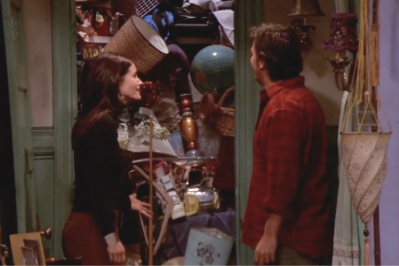

# Total renewal: why one life hack can change everything for you

Look at your life at this very moment. Do you feel that something is amiss? Maybe you can’t find motivation or make the right choice?

The answer to this kind of anxiety is, in fact, in the most mundane of things. **It’s how you cope with your daily routine that shows much about how you do everything else.**

### A simple solution

[© Warner Bros. Television](http://www.warnerbros.com/studio/divisions/television/warner-bros-television)

When I was in college, my room was a total mess — and my life too. I was depressed more often than not. **I didn’t care about order around me, and thus the chaos outside slowly turned into chaos within me.**

On the day I decided that I couldn’t stand the mess anymore, I started working on it. First up were my room and office. The decision was spontaneous, but I think that all the right thoughts in life come to mind like this.

This simple action kickstarted my new way of life. I can’t say daily cleanup changed me, of course, but it was a start. **It made me see the lack of clarity in my life, and I finally understood what I really loved and what felt off.**

**When your mind is in chaos, it translates itself to the outside. So it only feels natural that if we change our habits, we’ll also be able to bring our whole life to order.**

### How it moves into other areas of life

[© BBC Films](http://www.bbc.co.uk/bbcfilms)

Now that I was taking care of my daily routine, my habits touched upon my job, food, and even my mood. I began living healthily, broke up with people dragging me down, left the college I loathed, and started doing things I was interested in. It all gave me freedom. Everything fell into place, and I felt like my mind had a total cleanup too.

### Here’s how to take action

[© 20th Century Fox Film Corporation](http://www.foxmovies.com/)

Take a look at your life as if it were a messy room. What’s off? Is everything in its place? Is there anyone or anything keeping you from changing? Are there things you’d like to do but aren’t doing? When you’ve answered these questions, start cleaning up.

It often helps to start with something simple, like throwing out old trash. Did you feel the lightness in your heart after that?

### Removing roadblocks

[© Warner Bros. Pictures Co.](http://www.warnerbros.com/)

Next, determine the roadblocks keeping you from moving on: lack of knowledge, fear, anxiety, or even some people you know. Make a list of these things — seeing it will help you realize what an obstacle they really are. Write down several possible solutions for each problem.

**You know how to deal with any problem, just admit it.** Fear, laziness, and weakness are all that keep us from doing that, so do a major cleanup in your head and get on with it!

Preview photo credit [Dubova/Shutterstock.com](http://www.shutterstock.com/pic-230914261.html)
  
Author [Joe Martino](http://www.collective-evolution.com/2014/10/01/why-one-life-hack-can-change-everything-for-you/)
, **adapted by BrightSide.me**

### We’d love to hear your views on this…
