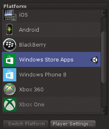
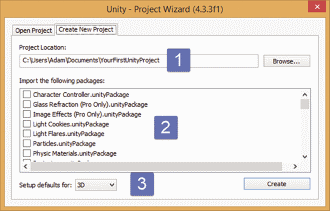
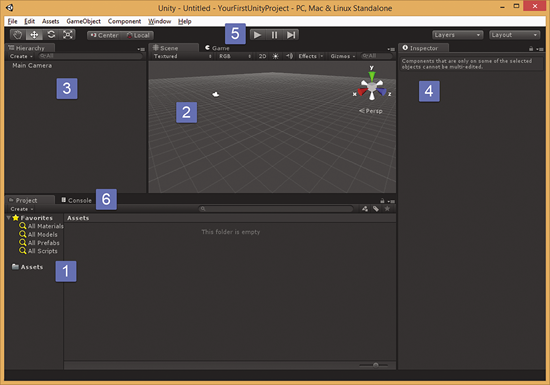
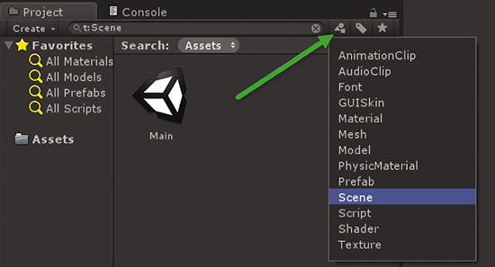
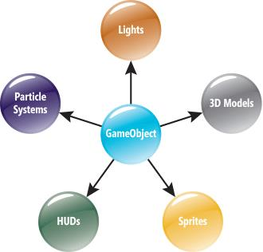
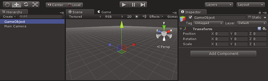
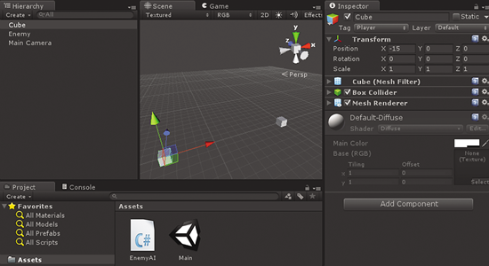
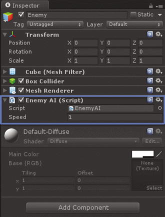
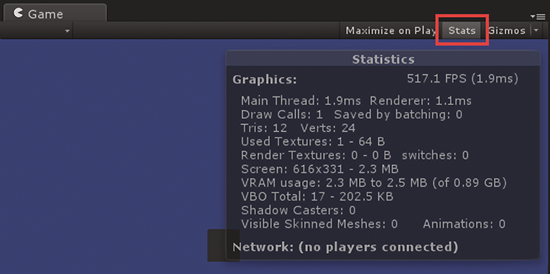
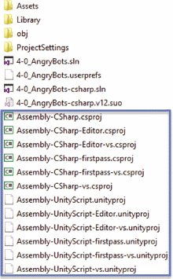

# Developing Your First Game with Unity and C#

## What Unity Is

Unity is a 2D/3D engine and framework that gives you a system for designing game or app scenes for 2D, 2.5D and 3D. I say games and apps because I’ve seen not just games, but training simulators, first-responder applications, and other business-focused applications developed with Unity that need to interact with 2D/3D space. Unity allows you to interact with them via not only code, but also visual components, and export them to every major mobile platform and a whole lot more—for free. (There’s also a pro version that’s very nice, but it isn’t free. You can do an impressive amount with the free version.) Unity supports all major 3D applications and many audio formats, and even understands the Photoshop .psd format so you can just drop a .psd file into a Unity project. Unity allows you to import and assemble assets, write code to interact with your objects, create or import animations for use with an advanced animation system, and much more.

As **Figure 1** indicates, Unity has done work to ensure cross-platform support, and you can change platforms literally with one click, although to be fair, there’s typically some minimal effort required, such as integrating with each store for in-app purchases.



**Figure 1 Platforms Supported by Unity**

Perhaps the most powerful part of Unity is the Unity Asset Store, arguably the best asset marketplace in the gaming market. In it you can find all of your game component needs, such as artwork, 3D models, animation files for your 3D models (see Mixamo’s content in the store for more than 10,000 motions), audio effects and full tracks, plug-ins—including those like the MultiPlatform toolkit that can help with multiple platform support—visual scripting systems such as PlayMaker and Behave, advanced shaders, textures, particle effects, and more. The Unity interface is fully scriptable, allowing many third-party plug-ins to integrate right into the Unity GUI. Most, if not all, professional game developers use a number of packages from the asset store, and if you have something decent to offer, you can publish it there as well.

## What Unity Isn’t

I hesitate to describe anything Unity isn’t as people challenge that all the time. However, Unity by default isn’t a system in which to design your 2D assets and 3D models (except for terrains). You can bring a bunch of zombies into a scene and control them, but you wouldn’t create zombies in the Unity default tooling. In that sense, Unity isn’t an asset-creation tool like Autodesk Maya or 3DSMax, Blender or even Adobe Photoshop. There’s at least one third-party modeling plug-in (ProBuilder), though, that allows you to model 3D components right inside of Unity; there are 2D world builder plug-ins such as the 2D Terrain Editor for creating 2D tiled environments, and you can also design terrains from within Unity using their Terrain Tools to create amazing landscapes with trees, grass, mountains, and more. So, again, I hesitate to suggest any limits on what Unity can do.

Where does Microsoft fit into this? Microsoft and Unity work closely together to ensure great platform support across the Microsoft stack. Unity supports Windows standalone executables, Windows Phone, Windows Store applications, Xbox 360 and Xbox One.

## Getting Started

Download the latest version of Unity and get yourself a two-button mouse with a clickable scroll wheel. There’s a single download that can be licensed for free mode or pro. You can see the differences between the versions at [unity3d.com/unity/licenses](http://unity3d.com/unity/licenses). The Editor, which is the main Unity interface, runs on Windows (including Surface Pro), Linux and OS X.

I’ll get into real game development with Unity in the next article, but, first, I’ll explore the Unity interface, project structure and architecture.

## Architecture and Compilation

Unity is a native C++-based game engine. You write code in C#, JavaScript (UnityScript) or, less frequently, Boo. Your code, not the Unity engine code, runs on Mono or the Microsoft .NET Framework, which is Just-in-Time (JIT) compiled (except for iOS, which doesn’t allow JIT code and is compiled by Mono to native code using Ahead-of-Time [AOT] compilation).

Unity lets you test your game in the IDE without having to perform any kind of export or build. When you run code in Unity, you’re using Mono version 3.5, which has API compatibility roughly on par with that of the .NET Framework 3.5/CLR 2.0.

You edit your code in Unity by double-clicking on a code file in the project view, which opens the default cross-platform editor, Mono­Develop. If you prefer, you can configure Visual Studio as your editor.

You debug with MonoDevelop or use a third-party plug-in for Visual Studio, UnityVS. You can’t use Visual Studio as a debugger without UnityVS because when you debug your game, you aren’t debugging Unity.exe, you’re debugging a virtual environment inside of Unity, using a soft debugger that’s issued commands and performs actions.

To debug, you launch MonoDevelop from Unity. MonoDevelop has a plug-in that opens a connection back to the Unity debugger and issues commands to it after you Debug | Attach to Process in MonoDevelop. With UnityVS, you connect the Visual Studio debugger back to Unity instead.

When you open Unity for the first time, you see the project dialog shown in **Figure 2**.



**Figure 2 The Unity Project Wizard**

In the project dialog, you specify the name and location for your project (1). You can import any packages into your project (2), though you don’t have to check anything off here; the list is provided only as a convenience. You can also import a package later. A package is a .unitypackage file that contains prepackaged resources—models, code, scenes, plug-ins—anything in Unity you can package up—and you can reuse or distribute them easily. Don’t check something off here if you don’t know what it is, though; your project size will grow, sometimes considerably. Finally, you can choose either 2D or 3D (3). This dropdown is relatively new to Unity, which didn’t have significant 2D game tooling until fairly recently. When set to 3D, the defaults favor a 3D project—typical Unity behavior as it’s been for ages, so it doesn’t need any special mention. When 2D is chosen, Unity changes a few seemingly small—but major—things, which I’ll cover in the 2D article later in this series.

This list is populated from .unitypackage files in certain locations on your system; Unity provides a handful on install. Anything you download from the Unity asset store also comes as a .unitypackage file and is cached locally on your system in C:\Users\<you>\AppData\­Roaming\Unity\Asset Store. As such, it will show up in this list once it exists on your system. You could just double-click on any .unitypackage file and it would be imported into your project.

Continuing with the Unity interface, I’ll go forward from clicking Create in the dialog in **Figure 2** so a new project is created. The default Unity window layout is shown in **Figure 3**.



**Figure 3 The Default Unity Window**

Here’s what you’ll see:

1. Project: All the files in your project. You can drag and drop from Explorer into Unity to add files to your project.
2. Scene: The currently open scene.
3. Hierarchy: All the game objects in the scene. Note the use of the term GameObjects and the GameObjects dropdown menu.
4. Inspector: The components (properties) of the selected object in the scene.
5. Toolbar: To the far left are Pan, Move, Rotate, Scale and in the center Play, Pause, Advance Frame. Clicking Play plays the game near instantly without having to perform separate builds. Pause pauses the game, and advance frame runs it one frame at a time, giving you very tight debugging control.
6. Console: This window can become somewhat hidden, but it shows output from your compile, errors, warnings and so forth. It also shows debug messages from code; for example, Debug.Log will show its output here.

Of important mention is the Game tab next to the Scene tab. This tab activates when you click play and your game starts to run in this window. This is called play mode and it gives you a playground for testing your game, and even allows you to make live changes to the game by switching back to the Scene tab. Be very careful here, though. While the play button is highlighted, you’re in play mode and when you leave it, any changes you made while in play mode will be lost. I, along with just about every Unity developer I’ve ever spoken with, have lost work this way, so I change my Editor’s color to make it obvious when I’m in play mode via Edit | Preferences | Colors | Playmode tint.

## About Scenes

Everything that runs in your game exists in a scene. When you package your game for a platform, the resulting game is a collection of one or more scenes, plus any platform-­dependent code you add. You can have as many scenes as you want in a project. A scene can be thought of as a level in a game, though you can have multiple levels in one scene file by just moving the player/camera to different points in the scene. When you download third-party packages or even sample games from the asset store, you typically must look for the scene files in your project to open. A scene file is a single file that contains all sorts of metadata about the resources used in the project for the current scene and its properties. It’s important to save a scene often by pressing Ctrl+S during development, just as with any other tool.

Typically, Unity opens the last scene you’ve been working on, although sometimes when Unity opens a project it creates a new empty scene and you have to go find the scene in your project explorer. This can be pretty confusing for new users, but it’s important to remember if you happen to open up your last project and wonder where all your work went! Relax, you’ll find the work in a scene file you saved in your project. You can search for all the scenes in your project by clicking the icon indicated in **Figure 4** and filtering on Scene.



**Figure 4 Filtering Scenes in the Project**

In a scene, you can’t see anything without a camera and you can’t hear anything without an Audio Listener component attached to some GameObject. Notice, however, that in any new scene, Unity always creates a camera that has an Audio Listener component already on it.

## Project Structure and Importing Assets

Unity projects aren’t like Visual Studio projects. You don’t open a project file or even a solution file, because it doesn’t exist. You point Unity to a folder structure and it opens the folder as a project. Projects contain Assets, Library, ProjectSettings, and Temp folders, but the only one that shows up in the interface is the Assets folder, which you can see in **Figure 4**.

The Assets folder contains all your assets—art, code, audio; every single file you bring into your project goes here. This is always the top-level folder in the Unity Editor. But make changes only in the Unity interface, never through the file system.

The Library folder is the local cache for imported assets; it holds all metadata for assets. The ProjectSettings folder stores settings you configure from Edit | Project Settings. The Temp folder is used for temporary files from Mono and Unity during the build process.

I want to stress the importance of making changes only through the Unity interface and not the file system directly. This includes even simple copy and paste. Unity tracks metadata for your objects through the editor, so use the editor to make changes (outside of a few fringe cases). You can drag and drop from your file system into Unity, though; that works just fine.

## The All-Important GameObject

Virtually everything in your scene is a GameObject. Think of System.Object in the .NET Framework. Almost all types derive from it. The same concept goes for GameObject. It’s the base class for all objects in your Unity scene. All of the objects shown in **Figure 5** (and many more) derive from a GameObject.



**Figure 5 GameObjects in Unity**

A GameObject is pretty simple as it pertains to the Inspector window. You can see in **Figure 6** that an empty GameObject was added to the scene; note its properties in the Inspector. GameObjects by default have no visual properties except the widget Unity shows when you highlight the object. At this point, it’s simply a fairly empty object.



**Figure 6 A Simple GameObject**

A GameObject has a Name, a Tag (similar to a text tag you’d assign via a FrameworkElement.Tag in XAML or a tag in Windows Forms), a Layer and the Transform (probably the most important property of all).

The Transform property is simply the position, rotation and scale of any GameObject. Unity uses the left-hand coordinate system, in which you think of the coordinates of your computer screen as X (horizontal), Y (vertical) and Z (depth, that is, coming in or going out of the screen).

In game development, it’s quite common to use vectors, which I’ll cover a bit more in future articles. For now, it’s sufficient to know that Transform.Position and Transform.Scale are both Vector3 objects. A Vector3 is simply a three-dimensional vector; in other words, it’s nothing more than three points—just X, Y and Z. Through these three simple values, you can set an object’s location and even move an object in the direction of a vector.

## Components

You add functionality to GameObjects by adding Components. Everything you add is a Component and they all show up in the Inspector window. There are MeshRender and SpriteRender Components; Components for audio and camera functionality; physics-related Components (colliders and rigidbodies), particle systems, path-finding systems, third-party custom Components, and more. You use a script Component to assign code to an object. Components are what bring your GameObjects to life by adding functionality, akin to thedecorator pattern in software development, only much cooler.

I’ll assign some code to a new GameObject, in this case a simple cube you can create via GameObject | Create Other | Cube. I renamed the cube Enemy and then created another to have two cubes. You can see in **Figure 7** I moved one cube about -15 units away from the other, which you can do by using the move tool on the toolbar or the W key once an object is highlighted.



**Figure 7 Current Project with Two Cubes**

The code is a simple class that finds a player and moves its owner toward it. You typically do movement operations via one of two approaches: Either you move an object to a new position every frame by changing its Transform.Position properties, or you apply a physics force to it and let Unity take care of the rest.

Doing things per frame involves a slightly different way of thinking than saying “move to this point.” For this example, I’m going to move the object a little bit every frame so I have exact control over where it moves. If you’d rather not adjust every frame, there are libraries to do single function call movements, such as the freely available iTween library.

The first thing I do is right-click in the Project window to create a new C# script called EnemyAI. To assign this script to an object, I simply drag the script file from the project view to the object in the Scene view or the Hierarchy and the code is assigned to the object. Unity takes care of the rest. It’s that easy.

**Figure 8** shows the Enemy cube with the script assigned to it.



**Figure 8 The Enemy with a Script Assigned to It**

Take a look at the code in **Figure 9** and note the public variable. If you look in the Editor, you can see that my public variable appears with an option to override the default values at run time. This is pretty cool. You can change defaults in the GUI for primitive types, and you can also expose public variables (not properties, though) of many different object types. If I drag and drop this code onto another GameObject, a completely separate instance of that code component gets instantiated. This is a basic example and it can be made more efficient by, say, adding a RigidBody component to this object, but I’ll keep it simple here.

Figure 9 The EnemyAI Script

```
public class EnemyAI : MonoBehavior
{
  // These values will appear in the editor, full properties will not.
  public float Speed = 50;
  private Transform _playerTransform;
  private Transform _ myTransform;
  // Called on startup of the GameObject it's assigned to.
  void Start()
  {
    // Find some gameobject that has the text tag "Player" assigned to it.
    // This is startup code, shouldn't query the player object every
    // frame. Store a ref to it.
    var player = GameObject.FindGameObjectWithTag("Player");
    if (!player)
    {
      Debug.LogError(
        "Could not find the main player. Ensure it has the player tag set.");
    }
    else
    {
      // Grab a reference to its transform for use later (saves on managed
      // code to native code calls).
      _playerTransform = player.transform;
    }
    // Grab a reference to our transform for use later.
    _myTransform = this.transform;
  }
  // Called every frame. The frame rate varies every second.
  void Update()
  {
    // I am setting how fast I should move toward the "player"
    // per second. In Unity, one unit is a meter.
    // Time.deltaTime gives the amount of time since the last frame.
    // If you're running 60 FPS (frames per second) this is 1/60 = 0.0167,
    // so w/Speed=2 and frame rate of 60 FPS (frame rate always varies
     // per second), I have a movement amount of 2*0.0167 = .033 units
    // per frame. This is 2 units.
    var moveAmount = Speed * Time.deltaTime;
    // Update the position, move toward the player's position by moveAmount.
    _myTransform.position = Vector3.MoveTowards(_myTransform.position,
      _playerTransform.position, moveAmount);
  }
}
```

In code, I can get a reference to any component exposed in the editor. I can also assign scripts to a GameObject, each with its own Start and Update methods (and many other methods). Assuming a script component containing this code needs a reference to the EnemyAI class (component), I can simply ask for that component:

```
public class EnemyHealth : MonoBehavior
private EnemyAI _enemyAI;
// Use this for initialization.
void Start () {
  // Get a ref to the EnemyAI script component on this game object.
  var enemyAI = this.GetComponentEnemyAI();
}
// Update is called once per frame.
void Update () {
  _enemyAI.MoveTowardsPlayer();
}
```

After you edit code in MonoDevelop or your code editor of choice and then switch back to Unity, you’ll typically notice a short delay. This is because Unity is background compiling your code. You can change your code editor (not debugger) via Edit | Preferences | External Tools | External Script Editor. Any compilation issues will show up at the very bottom status bar of your Unity Editor screen, so keep an eye out for them. If you try to run your game with errors in the code, Unity won’t let you continue.

## Writing Code

In the prior code example, there are two methods, Start and Update, and the class EnemyHealth inherits from the MonoBehavior base class, which lets you simply assign that class to a GameObject. There’s a lot of functionality in that base class you’ll use, and typically a few methods and properties. The main methods are those Unity will call if they exist in your class. There are a handful of methods that can get called (see [bit.ly/1jeA3UM](http://bit.ly/1jeA3UM)). Though there are many methods, just as with the ASP.NET Web Forms Page Lifecycle, you typically use only a few. Here are the most common code methods to implement in your classes, which relate to the sequence of events for MonoBehavior-derived classes:

Awake: This method is called once per object when the object is first initialized. Other components may not yet be initialized, so this method is typically used to initialize the current GameObject. You should always use this method to initialize a MonoBehavior-derived class, not a constructor. And don’t try to query for other objects in your scene here, as they may not be initialized yet.

Start: This method is called during the first frame of the object’s lifetime but before any Update methods. It may seem very similar to Awake, but with Start, you know the other objects have been initialized via Awake and exist in your scene and, therefore, you can query other objects in code easily, like so:

```
// Returns the first EnemyAI script component instance it finds on any game object.
// This type is EnemyAI (a component), not a GameObject.
var enemyAI = GameObject.FindObjectOfTypeEnemyAI();
// I'll actually get a ref to its top-level GameObject.
var enemyGameObject = enemyAI.gameObject;
// Want the enemy’s position?
var position = enemyGameObject.transform.position;
```

Update: This method is called every frame. How often is that, you ask? Well, it varies. It’s completely computation-dependent. Because your system is always changing its load as it renders different things, this frame rate varies every second. You can press the Stats button in the Game tab when you go into play mode to see your current frame rate, as shown in **Figure 10**.



**Figure 10 Getting Stats**

FixedUpdate: This method is called a fixed number of times a second, independent of the frame rate. Because Update is called a varying number of times a second and isn’t in sync with the physics engine, it’s typically best to use FixedUpdate when you want to provide a force or some other physics-related functions on an object. FixedUpdate by default is called every .02 seconds, meaning Unity also performs physics calculations every .02 seconds (this interval is called the Fixed Timestep and is developer-adjustable), which, again, is independent of frame rate.

## Unity-Generated Code Projects

Once you have code in your project, Unity creates one or more project files in your root folder (which isn’t visible in the Unity interface). These are not the Unity engine binaries, but instead the projects for Visual Studio or MonoDevelop in which you’ll edit and compile your code. Unity can create what might seem like a lot of separate projects, as **Figure 11** shows, although each one has a an important purpose.



**Figure 11 Unity-Created Projects**

If you have a simple Unity project, you won’t see all of these files. They get created only when you have code put into various special folders. The projects shown in **Figure 11** are broken out by only three types:

- Assembly-CSharp.csproj
- Assembly-CSharp-Editor.csproj
- Assembly-CSharp-firstpass.csproj

For each of those projects, there’s a dupli­cate project created with -vs appended to it, Assembly-CSharp-vs.csproj, for example. These projects are used if Visual Studio is your code editor and they can be added to your exported project from Unity for platform-specific debugging in your Visual Studio solution.

The other projects serve the same purpose but have CSharp replaced with UnityScript. These are simply the JavaScript (UnityScript) versions of the projects, which will exist only if you use JavaScript in your Unity game and only if you have your scripts in the folders that trigger these projects to be created.

Now that you’ve seen what projects get created, I’ll explore the folders that trigger these projects and show you what their purposes are. Every folder path assumes it’s underneath the /Assets root folder in your project view. Assets is always the root folder and contains all of your asset files underneath it. For example, Standard Assets is actually /Assets/Standard Assets. The build process for your scripts runs through four phases to generate assemblies. Objects compiled in Phase 1 can’t see those in Phase 2 because they haven’t yet been compiled. This is important to know when you’re mixing UnityScript and C# in the same project. If you want to reference a C# class from UnityScript, you need to make sure it compiles in an earlier phase.

Phase 1 consists of runtime scripts in the Standard Assets, Pro Standard Assets and Plug-ins folders, all located under/Assets. This phase creates the Assembly-CSharp-firstpass.csproj project.

Phase 2 scripts are in the Standard Assets/Editor, Pro Standard Assets/Editor and Plug-ins/Editor folders. The last folder is meant for scripts that interact with the Unity Editor API for design-time functionality (think of a Visual Studio plug-in and how it enhances the GUI, only this runs in the Unity Editor). This phase creates the Assembly-CSharp-Editor-firstpass.csproj project.

Phase 3 comprises all other scripts that aren’t inside an Editor folder. This phase creates the Assembly-CSharp-Editor.csproj project.

Phase 4 consists of all remaining scripts (those inside any other folder called Editor, such as /Assets/Editor or /Assets/­Foo/Editor). This phase creates the Assembly-CSharp.csproj project.

There are a couple other less-used folders that aren’t covered here, such as Resources. And there is the pending question of what the compiler is using. Is it .NET? Is it Mono? Is it .NET for the Windows Runtime (WinRT)? Is it .NET for Windows Phone Runtime? **Figure 12** lists the defaults used for compilation. This is important to know, especially for WinRT-based applications because the APIs available per platform vary.

**Figure 12 Compilation Variations**

|  |  |  |
| --- | --- | --- |
| Platform | Game Assemblies Generated By | Final Compilation Performed By |
| Windows Phone 8 | Mono | Visual Studio/.NET |
| Windows Store | .NET | Visual Studio/.NET (WinRT) |
| Windows Standalone (.exe) | Mono | Unity - generates .exe + libs |
| Windows Phone 8.1 | .NET | Visual Studio/.NET (WinRT) |

When you perform a build for Windows, Unity is responsible for making the calls to generate the game libraries from your C#/UnityScript/Boo code (DLLs) and to include its native runtime libraries. For Windows Store and Windows Phone 8, it will export a Visual Studio solution, except for Windows standalone, in which Unity generates the .exe and required .dll files. I’ll discuss the various build types in the final article in the series, when I cover building for the platform. The graphics rendering at a low level is performed on the Windows platforms by DirectX.

Designing a game in Unity is a fairly straightforward process:

- Bring in your assets (artwork, audio and so on). Use the asset store. Write your own. Hire an artist. Note that Unity does have native support for Maya, Cheetah3d, Blender and 3dsMax, in some cases requiring that software be installed to work with those native 3D formats, and it works with .obj and .fbx common file formats, as well.
- Write code in C#, JavaScript/UnityScript, or Boo, to control your objects, scenes, and implement game logic.
- Test in Unity. Export to a platform.
- Test on that platform. Deploy.

## But Wait, I Want More!

This article serves as an overview of the architecture and process in Unity. I covered the interface, basics of assigning code, GameObjects, components, Mono and .NET, plus more. This sets us up nicely for the next article where I’ll dive right into assembling game components for a 2D game. Keep an eye on Microsoft Virtual Academy, as I’ll be doing a two-day Unity learning event late summer. And watch for local regional learning events at [unity3d.com/pages/windows/events](http://unity3d.com/pages/windows/events).
