# Jumpstart Your Xamarin App Development

So you want to build a mobile app? Your developer zen will quickly be threatened by the plethora of ways you can go about building a modern, cross-platform mobile app today. The below illustration shows an assortment of just a few of the technologies that you can use and the most common frameworks/platforms used for each.

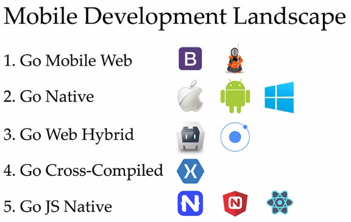

This is what we have done to ourselves over the last 10 years. Choice is a good thing for developers, except that too much choice can become a little crippling.

On a positive note, the choice of technology stack becomes much easier once you decide to focus on what matters most – your skills and expertise. In today's age, you really want to build truly cross-platform mobile apps from single codebase and preferably have the app be native to each platform. If your developer background is .NET, you'll possibly lean towards using C# with Xamarin.

Xamarin lets you to build modern cross-platform mobile apps using your .NET skills. You write C#/XAML and your code gets cross-compiled down to native bits on each platform. This article walks you through some essential tooling that you should have in your arsenal for Xamarin development, as well as how to jumpstart your app with some polished UI.

## The IDEs

When it comes to Xamarin development, you get two rich Integrated Development Environments (IDEs) to choose from:

Both IDEs sport some common features for ease of development:

1. Rich Intellisense support for code completion;
2. Intelligent typing assist for iOS/Android API mappings;
3. Built-in Xamarin project templates;
4. Easy code navigation and IDE configurations;
5. Switchable light and dark themes;
6. Choice of various device emulators with varying screen sizes;
7. Easy debug options for both emulators/device deployment;
8. Publish apps to stores directly from the IDE;
9. Integrated version control;
10. Robust User Interface Designers for iOS/Android.

Both Visual Studio and Xamarin Studio come in completely free yet feature-rich Community editions. You do have to keep a couple of limitations in mind though:

- Visual Studio on Windows will need a Mac to act as an iOS build host running XCode – this is an Apple licensing requirement. The Mac could be hard wired to the Windows development machine, somewhere on the network or in the cloud. In fact, with the recent [iOS Windows Simulator](https://developer.xamarin.com/guides/cross-platform/windows/ios-simulator/), you do not ever have to leave the comforts of Visual Studio – the simulator will stream the iOS emulator from the Mac.
- Xamarin Studio on Mac can only target iOS and Android, but not Windows. The app solution from Xamarin Studio could, however, be brought over to Visual Studio on a Windows development machine later to add a Windows-supporting project, while still leveraging the common Portable Class Library (PCL) for code sharing between platforms.

## Must-Have Tools

Now, once you have begun your Xamarin app development, you'll want to keep a few tools in your arsenal – these aren't necessary, but often make your life easier. Most are usable within the comforts of your beloved IDE.

- [NuGet](https://www.nuget.org/) – As the de facto package manager for the .NET ecosystem, NuGet will faithfully serve your Xamarin projects as well. Bring in your favorite .NET libraries, services and utility wrappers.
- [Xamarin Component Store](https://components.xamarin.com/) – Your Xamarin app needs awesomeness and you do not need to reinvent the wheel. Augment your app with polished UI components, service SDKs and various cloud/social integrations – all from one component store.
- [MVVM Light](http://www.mvvmlight.net/) – Bring some structure and sanity to your Xamarin apps by following the established Model-View-ViewModel (MVVM) pattern and including the MVVM Light framework. You get out-of-the-box features like commanding, messenger, inversion of control (IoC) and INotifyPropertyChanged UI data binding implementations.
- [Prism for Xamarin.Forms](https://www.nuget.org/packages/Prism.Forms/5.6.1-pre1) – Have you used and liked Prism for past XAML development? Now you can bring the Prism fun to Xamarin.Forms development with a NuGet package and an optional [Prism Template pack](https://visualstudiogallery.msdn.microsoft.com/e7b6bde2-ba59-43dd-9d14-58409940ffa0) to get you started. You get to leverage built-in MVVM features like commanding, ViewModelLocator, event aggregator, navigation and IoC with Unity.
- [XUnit](http://xunit.github.io/) – This is the perfect open source unit testing framework for your Xamarin apps – both for PCLs and device-specific projects. Simply get a NuGet package in your project, write some unit tests and run them against your app, either through the command line, MSBuild or using the iOS/Android test runners.
- [Xamarin WorkBooks](https://developer.xamarin.com/guides/cross-platform/workbooks/) – Need a playground as you are building your Xamarin apps? Like experimenting with native API features, want to document a functionality for someone or simply see your tentative code in action? You're in luck with the newly introduced Xamarin Workbooks – a standalone application that allows for building interactive documents with executable live code outside of any apps. You could run code-fenced C# blocks inline or inside iOS/Android simulators. It's perfect to try out or share new features before adding them to your app.
- [Xamarin Test Cloud](https://www.xamarin.com/test-cloud) – Your professional Xamarin apps should not be at the mercy of mobile device idiosyncrasies. And let's face it, there are a plethora of devices across various platforms that may run your Xamarin app. The solution is Xamarin Test Cloud. You can automate app testing on 2000+ real devices, all running in the cloud. Increase confidence in your app by testing user interactions on real devices to find bugs, with complete memory and performance analysis. Get polished reports, fix problems and repeat – that's how you ship high quality apps.
- [PreBuilt Apps](https://www.xamarin.com/prebuilt) – Jumpstart your Xamarin app development with a polished pre-built app – showcase apps with open source code in GitHub. Peruse unique features or incorporate UI components to give your Xamarin apps a flying start.

## Leveraging Open Source

As if the Microsoft acquisition of Xamarin wasn't big enough deal, sweeter news greeted .NET developers in early 2016 – Xamarin was going open source! All of the Xamarin frameworks, namely Xamarin.iOS, Xamarin.Android and Xamarin.Forms are completely open source, as are all the SDKs under a broad MIT license. Everything starts at [open.xamarin.com](http://open.xamarin.com/).

The open sourcing of Xamarin has two major repercussions. One is that Xamarin and all of its tooling are now completely free. And two is that there is a true collaborative open source community being now built around Xamarin. You can be a part of it.

### Why and How to build from Source?

Normally, you would just download the Xamarin SDKs and start building your app. But the true developer in you wants to look under the covers – what is the framework doing for you? Now you can look through Xamarin's source code, pull it down and build the SDK/libraries yourself

Let's say you want to look deeper into Xamarin.Forms – all the source is at <https://github.com/xamarin/Xamarin.Forms>. You can download or clone the whole repository and build it locally. Follow the [defined requirements](https://github.com/xamarin/Xamarin.Forms/blob/master/README.md), open the solution in Visual Studio 2015 and fire up the build. Here's a glimpse of the Xamarin.Forms solution and component projects in VS – plenty to look around and learn.

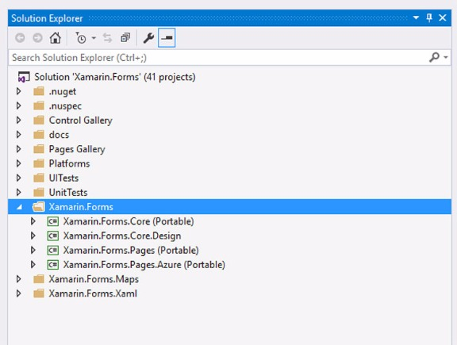

Say you wanted to play around with Xamarin.iOS and Xamarin.Mac – how is your app running inside the glowing fruit devices? Well you can start at <https://github.com/xamarin/xamarin-macios>. With compilation for Mono under the covers, Xamarin for iOS/Mac has a few more [defined requirements](https://github.com/xamarin/xamarin-macios/blob/master/README.md) in order to build locally. So get yourself the CLI tools and specific versions of XCode/Xamarin Studio and Mono. Here's what all the project components look like when pulled down:

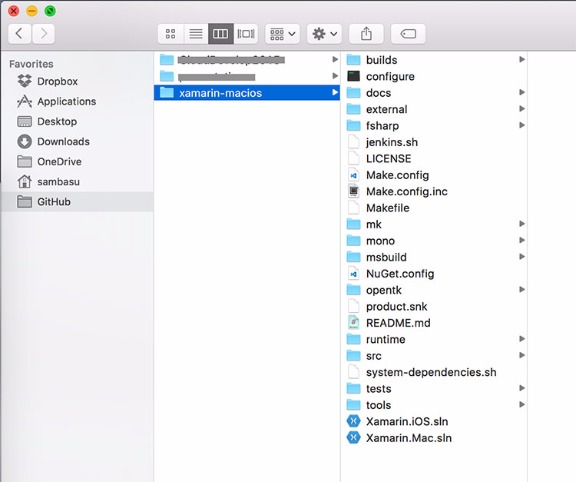

There are helpful [scripts](https://github.com/xamarin/xamarin-macios/blob/master/README.md) that will install and provision dependencies. Once they are ready, fire up the build and proceed with the local installation:

```
$ make world
$ make installsystem
```

### Contribute back

Now that you have been brave enough to look into Xamarin source code and build the tooling/frameworks locally, take the next logical step forward – contribute back. Think you can tweak something to be better or fix a bug or take a stab at a pending to-do item? This is your opportunity to pay back some technical debt and make the world a better place by contributing to open source projects. Xamarin empowers millions of developers though – so there is a process to contributing:

- File a bug and track issues at <https://bugzilla.xamarin.com/newbug>.
- For design discussions, subscribe to [forms-devel@lists.xamarin.com](http://developer.telerik.com/featured/jumpstart-xamarin-app-development/forms-devel@lists.xamarin.com) or [macios-devel@lists.xamarin.com](http://developer.telerik.com/featured/jumpstart-xamarin-app-development/macios-devel@lists.xamarin.com).
- Discuss issues in the [Gitter chat room](https://gitter.im/xamarin/xamarin-macios?utm_source=badge&utm_medium=badge&utm_campaign=pr-badge&utm_content=badge).
- Make appropriate code changes following the coding patterns, sign the [.NET Foundation's CLA](https://cla2.dotnetfoundation.org/) and make a pull request. The rest they say is for legends!

## Polished UI

You have started building your dream Xamarin app, picked the IDE of your choice and grabbed the necessary frameworks. Guess what? Your end users do not see any of magic behind the scenes. What they do see is the app UI and the fluidity of user experience that your app provides. You can try reinventing the wheel on UI or go for some well-engineered UI controls out of the box.

### Telerik UI for Xamarin

[Telerik UI for Xamarin](http://www.telerik.com/xamarin-ui) includes elegant, polished and performant native UI widgets for all your Xamarin apps. With UI for Xamarin, you'll get to deliver your Xamarin apps quicker and delight users with beautiful functional UI.

What you get out of the box are UI widgets that are difficult to create by hand – like various [charts](http://www.telerik.com/xamarin-ui/chart), a polished [ListView](http://www.telerik.com/xamarin-ui/listview), [SideDrawer](http://www.telerik.com/xamarin-ui/sidedrawer) and much more.

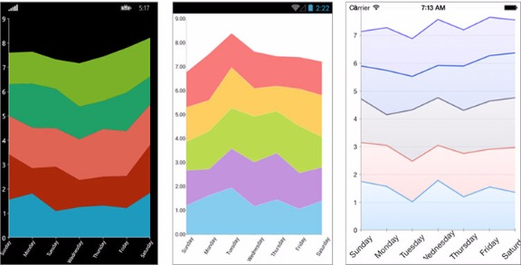

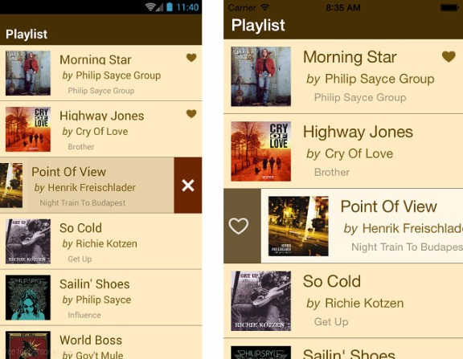

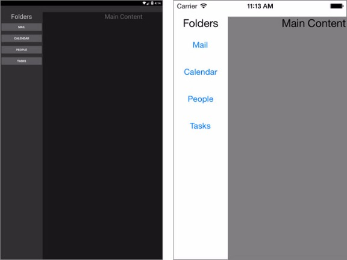

### How to get started

So how do you incorporate Telerik UI for Xamarin in your Xamarin project? There are several ways you can go about doing that:

1. **NuGet Package** – Probably the easiest way to include UI for Xamarin bits in your project is the NuGet route. Simply point your NuGet source to the Telerik feed and you get one-click install of Telerik UI for Xamarin. Works the same way from Visual Studio and Xamrin Studio, as shown below.

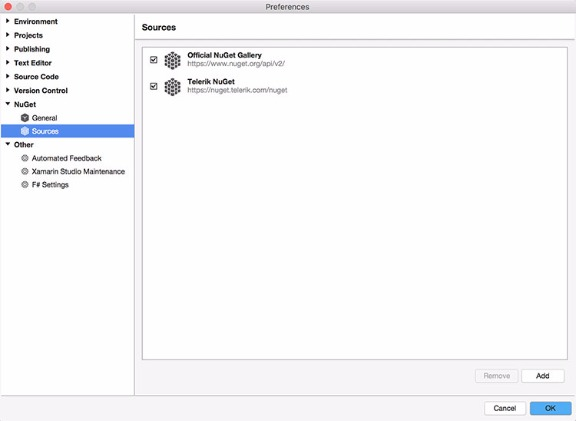

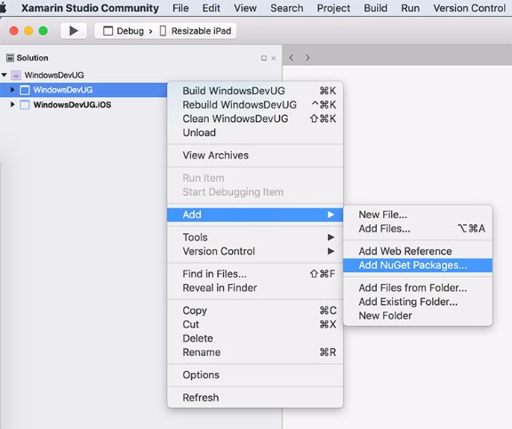

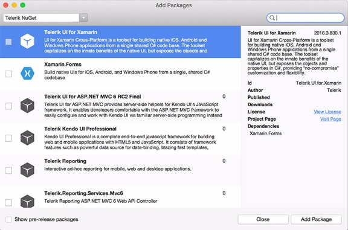

1. **Telerik Control Panel** – If you have an existing Telerik account subscription, you can leverage the Telerik Control Panel to download the UI for Xamarin bits. It will show up if you just have UI for Xamarin subscription or the entire [DevCraft](http://www.telerik.com/devcraft) product suite, as below.

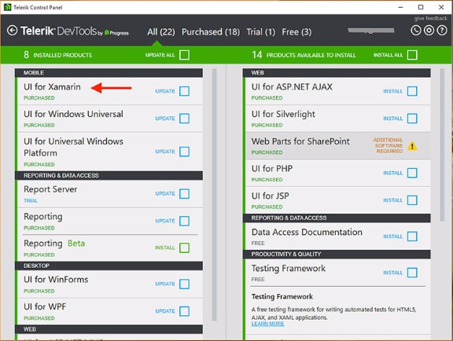

1. **Plain Download** – If you are just trying out UI for Xamarin, a simple trial download may be the easiest way to get started. Simply head to the [download site](http://www.telerik.com/download/xamarin-ui) and pull down the raw bits. Once downloaded, you'll find examples, templates and binaries specific to each platform and common ones as well. Make sure to check out the [documentation](http://docs.telerik.com/devtools/xamarin/index) for the UI widgets you are using – each has specific requirements to get the references right in your device-specific or shared projects.

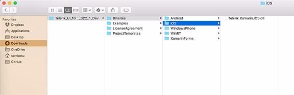

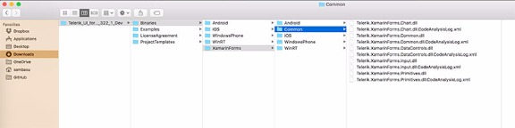

## Conclusion

Xamarin provides an excellent way for .NET developers to leverage their existing skills and build truly native, cross-platform mobile apps. With an open source foundation, mature tooling, supporting frameworks and polished UI libraries, the world is your oyster. What are you building next?

**Related resources:**

*Header image courtesy of [Ze’ev Barkan](https://flic.kr/p/BQibJM)*

[](http://www.telerik.com/xamarin-ui)
