# Everything I Learned About Dual-Stick Shooter Controls

Everything I Learned About Dual-Stick Shooter Controls

---

***The following blog post, unless otherwise noted, was written by a member of Gamasutra’s community.  
The thoughts and opinions expressed are those of the writer and not Gamasutra or its parent company.***

---

Dual-stick shooter controls on a gamepad should be a completely solved problem by now, shouldn’t they? When I started developing my open-source game [Relic Hunters Zero](http://www.relichunters.com.br/) on my spare time last year, I was very surprised to realise that I’d have to bang my head against multiple walls to get everything up to an acceptable level of quality. Granted, there are a few good bits of information here and there on the internet, but it’s all very scattered and hardly enough for a first-timer on the genre like me.

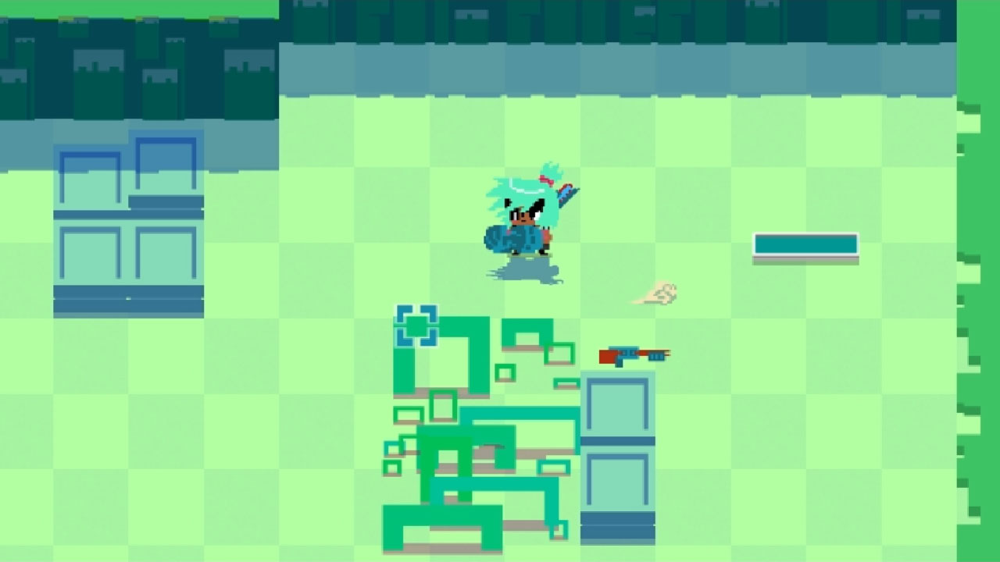

This is my kid, Relic Hunters Zero

Now that the game is nearing its release I decided I might as well aggregate, in a single article, all knowledge I gained on the subject through research, trial and error, and mostly by obsessing over the tiny details that make all the difference.

Zero is the major example I’ll use below, but you’ll find that it’s a good one - it contains pretty much all of the tropes and control scheme challenges in the genre. So strap your belts, grease your control sticks and let’s get on with it, shall we?

Understanding Axes and Implementing Deadzones Correctly

First of all, we need to lay a solid foundation for our controls. When dealing with analog sticks, that foundation is a good Deadzone. I won’t cover this in too much detail, but there is a [fantastic article about this subject written by Josh Sutphin](http://www.gamasutra.com/blogs/JoshSutphin/20130416/190541/Doing_Thumbstick_Dead_Zones_Right.php), and I recommend it for a more in-depth look.

Analog stick input is composed by two axes (usually “x” axis and “y” axis) with values that range from -1 to 1. “0” is the absolute center, while “1” or “-1” represent the very edges of the stick, either up/down or left/right. By combining these two axes we get 360-degree directional input with an “intensity” value that ranges from 0 to 1.

So what is a “deadzone”, you ask? When you are not touching the stick, even the best possible gamepad won’t give you a perfect “0” value for any of the two axes. What you normally get is a frenetic value switch, usually on the 0.05 to 0.15 scale on quality hardware. So if you just use that raw input in your game - say, for movement - you will see your character twitching in all directions like a pudding having a seizure.

That’s when the deadzone comes in. We ignore all values below a certain threshold, smoothing out the rough patches of the input. The idea itself is pretty simple, but you would be surprised at how often it is implemented the wrong way! Actually, on both the engines I normally use (Game Maker: Studio and Unity) I find deadzones to be handled poorly, so I tend to get raw XInput data and code the deadzones myself.

On my first implementation I made the rookie mistake of just checking each individual deadzone to see if either one is above my desired threshold. For example, if it’s a 0.3 deadzone, my code would be something like this:

if ( Math.abs(joy\_get\_axisX()) > 0.3 ) || ( Math.abs(joy\_get\_axisY()) > 0.3 )  
  
DoTheStuff();

Which is usually the first thing that comes to mind - and also extremely wrong. What you get with this is terrible directional input that feels “sticky” on the diagonals, like a square.

That’s when I found Sutphin’s article, so I will use some images from it to illustrate the point. His example is an even worse "naive implementation" that checked the variables independently, like this:

if ( Math.abs(joy\_get\_axisX()) > 0.3 )   
  
DoTheXStuff();

( Math.abs(joy\_get\_axisY()) > 0.3 )  
  
DoTheYStuff();

And it looks even worse than the square:

This is not what we want in most cases - certainly not what I wanted in Relic Hunters! So the correct way to do it is to find the vector combining both axes (normalized to 0-1) and then compare its length with your Deadzone. This will result in a nice radial deadzone like this:

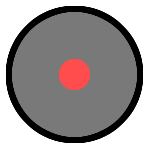

Sutphin’s article goes on to offer an even more sophisticated model, which he calls “Scaled Gradient Deadzone”, based on the idea of smoothly “killing” the input instead of instantly dropping off to 0 when the deadzone is reached. While it is an amazing tool for a FPS game, I found it to be overkill for Relic Hunters Zero, so after a few tests I ended up sticking with the simple radial deadzone. In fact, let’s talk more about what I’ve learned, and the differences between FPS and dual-stick shooter controls.

Analog vs. Digital Input

A constant lesson for me was that concepts that are perfectly fine for digital input don’t always translate well for analog. As a huge fan of FPS games, I came into Relic Hunters eager to try a lot of neat control tricks that make these games feel great, usually to no avail.

So let’s begin by understanding how FPS aiming is different from dual-stick shooter aiming. In first-person-shooters, input is digital - there is no direct correlation between the position of the sticks (intensity and direction) and the position of the crosshair (a pair of coordinates on a cartesian plane). Dual-stick Shooters are analog - the firing direction correlates with the direction of the stick.

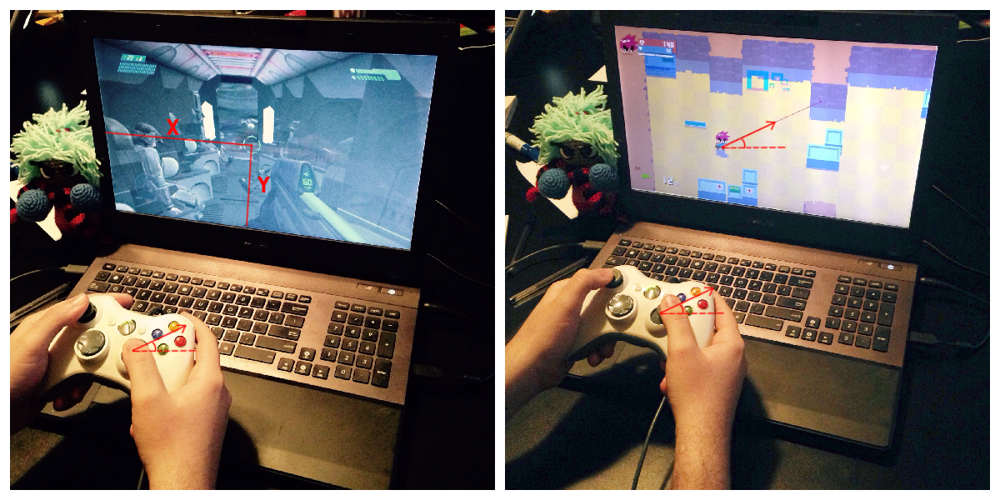

Analog/Digital vs. Analog/Analog comparison

This changes everything. First of all, as I’ll demonstrate below, assisted aiming becomes a real challenge. Also, the player is always holding the input down! While in FPS games you can “rest” your right stick after you place the crosshair where you want it, in dual-stick shooters you have to keep holding it.

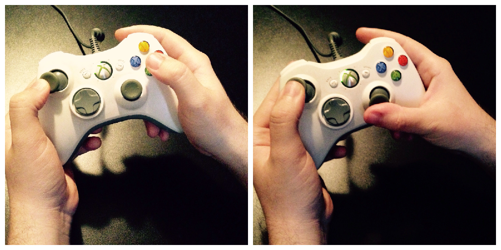

With dual-stick shooters you can’t reach the face buttons

This means that you can never expect players to use the right-stick and the face buttons (XYAB on Xbox, Square/X/Triangle/Circle on Playstation) at the same time. Any actions that need to be executed while you aim must be mapped to the triggers and shoulder buttons, so we have to design accordingly. Of course, mapping is a matter of preference (you should always offer your players the option to remap their controls), but you have to make sure that you don’t have more than 3 or 4 commands (ideally 2) in your design that must be executed while aiming.

Thou Shall Not Snap

A great rule of thumb (no pun intended) that makes up most of the good feel of Relic Hunters’ controls is that the aim must never, EVER snap into position. If you translate stick input directly into in-game look direction you will get very jaggy results that look and feel awful.

So, my first commandment: directional input should always be interpolated. Even very high-speed rotation (say 12 degrees per frame in a 60fps game) feels much better than snapping towards the input position.

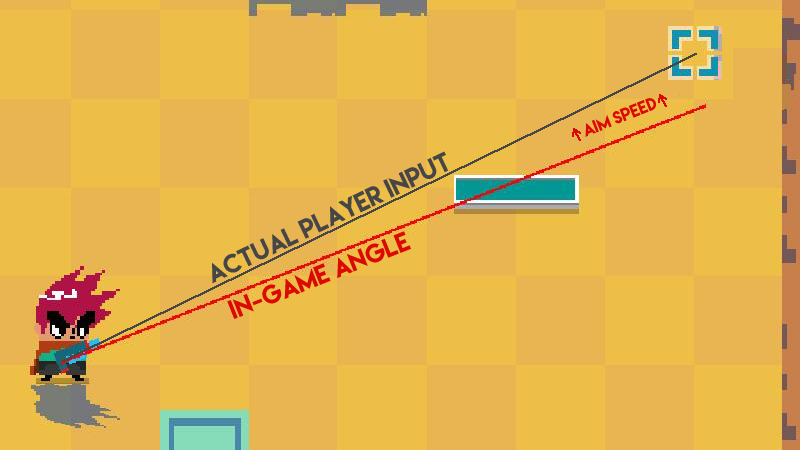

Gap between input direction and in-game direction

The way I do it is to have two different directions: a “target” direction that comes straight from input, and a “view” direction that is displayed in-game, and rotates towards the target direction with a set speed. I also recommend having a “minimum difference” between the two values before moving, which will compensate for the tiny variations on axis value that you may get from hardware.

Aim Sensitivity and Sticky Aim

The speed with which we rotate this “view” direction is the “aim sensitivity”. Higher sensitivity will give you snappy, agile input with smaller precision, while lower sensitivity will rotate slowly providing you with increased accuracy at the expense of responsiveness.

One neat trick that I soon learned is that you don’t have to choose - at least not all the time. Just as FPS games change aiming sensitivity depending on the situation, so can dual-stick shooters! In relic hunters I use a high sensitivity when you just move the right stick to aim, but a much lower one when you hold Left Trigger to enter the special “laser sight aiming” mode. I also zoom in and move the camera a little bit towards the aiming direction to better communicate and smooth out the transition.

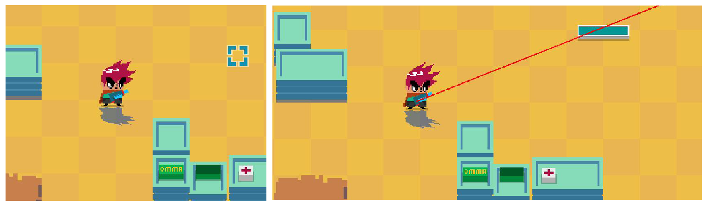

Two different aiming modes in Relic Hunters Zero

But that’s not all you can do. There’s a very cool aim assist tool in console first-person shooters called “Sticky Aim”. The idea is to give you an invisible helping hand by detecting that your crosshair is on top of an enemy and then dramatically decreasing aiming sensitivity - this way you can acquire targets and keep them in your crosshair much more easily. You can see this trick while aiming in gamepad-focused shooters such as Halo 3 and Borderlands 2, and it is even used in Destiny’s mouse-like interface to help you click on the buttons.

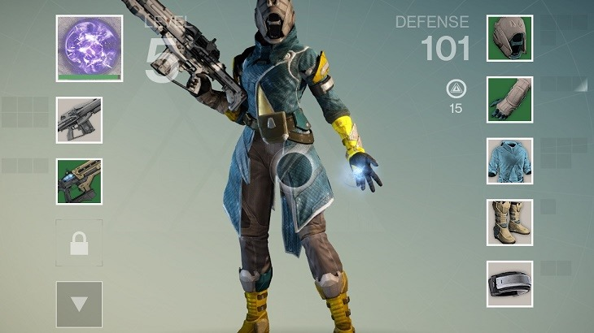

Destiny’s menus with “sticky” buttons

My idea was to translate “sticky aim” directly into my game. Surprisingly, it worked! In Relic Hunters Zero I lower the rotation speed of the “view” aim significantly if there is an enemy on the way. It helps the player in a very subtle way - you won’t even notice it unless you switch it on/off on the fly to feel the difference - but accuracy is increased.

That’s the whole idea, actually. The best control scheme in my opinion is the one that offers maximum success to players while giving them a clear impression that they are doing all the work - any assisted aiming should be as invisible as possible.

Auto-aiming (a.k.a. “Thou Shall Snap”)

Unfortunately, “sticky aim” did not solve Relic Hunters Zero’s aiming completely, so I also had to look for an actual “auto-aim” solution that directly changed the aiming direction. That’s when it got tricky.

My first instinct was to keep the “invisible” approach as I tried to emulate Destiny’s best-in-class aim system: a combination between sticky aim, large hitboxes and a gentle “nudge” of the aim towards valid targets.

I spent a lot of hours trying to make it work before I gave up. Ultimately what I did was adding a third value to the aim direction: besides the “input” and the “view” values, I’d have an “auto-aim offset” that tried to compensate for differences between the player’s input and the target position. It slowly “nudged” the direction towards the enemies and at first it worked brilliantly! Accuracy was excellent and the feeling of control was great.

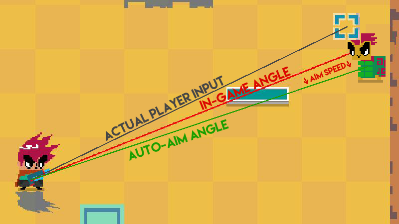

A third aiming direction is introduced, and it sucked

The problem is that, in an analog control scheme, player directional input is always held, remember? So when the enemy dies or gets out of range, there is a gap there between input and in-game direction created by the auto-aim. My first solution was to smoothly “return” the aim offset to zero, but testing resulted in a lot of players reporting that the aim was “weird and moved by itself”.

Worse - at times players would “fight” against the auto-aim, and the laser sight would jitter up and down. My last resort was NOT removing the gap until the player let go of the stick - that is, after auto-aiming, there would be a constant offset between the input and the in-game direction. I hope this would maybe go unnoticed, but it wasn’t the case. The gap could get pretty wide when engaging multiple enemies, and even if it didn’t I was underestimating the precision of human muscle memory: players would try aiming at the same direction they just did a second before, and get different results. It was not acceptable.

The final solution? Breaking my first commandment. Turns out that using a relatively narrow auto-aim angle (about 30 degrees) and instantly snapping towards the enemy while changing the color of the laser sight was the best solution. Messing with the directional input was always unnatural, so trying to mask it was a fool’s errand - I found out that it was much better to clearly communicate to players that auto-aiming is taking place, and let it do its thing.

The narrow range makes sure that switching between targets can be done smoothly without the player feeling that the aim is “stuck” somewhere, and it gave that extra edge that controller input needed to be as accurate as the mouse. I’d prefer if the system was invisible, but that was the best solution I could come up with at the time. Also, players can disable both this auto-aim system and the sticky aim in the game’s Settings menu if they want to.

More auto-aiming challenges

But that wasn’t the whole story. Even if your game has it easier by not displaying aiming direction and simply firing a projectile towards the stick’s direction (like Geometry Wars, for instance), there is an unexpected complication to take into account when calculating the auto-aim angle.

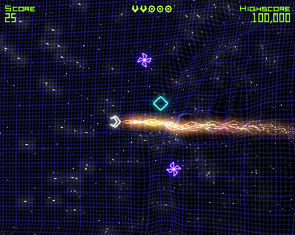

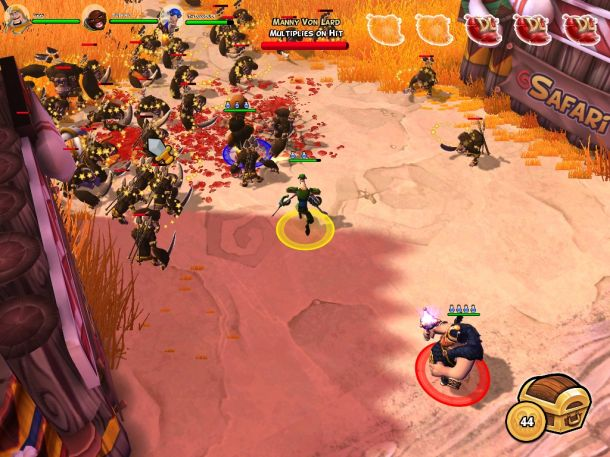

In games such as Geometry Wars and Dungeonland players don’t get directional feedback before the projectiles fly, so you are free to auto-aim invisibly and as much as you want!

My first naive implementation of auto-aim had a minimum angle, and it just checked the angular difference between the player’s input and the target direction. If it was smaller than the minimum angle, I turned on the auto-aim. Simple, right? And also completely wrong.

What actually happens is that players would get MORE accurate the further they were from enemies. This is because the angular difference diminishes with the square of the distance (or something like that, I hope my mathematician friends don’t hang me).

Incorrect: different situations, same results

On the example above you can see that even though the player’s directional input and the angle towards the enemy was the same, the actual angular difference was far from it! Unfortunately, my sloppy code did not differentiate between these two cases, so I ended up with an auto-aim system that was either useless at close range or completely ubiquitous at long range.

I solved this by “projecting” the player’s directional input towards the target first, and then checking that final angle against my minimum auto-aim angle.

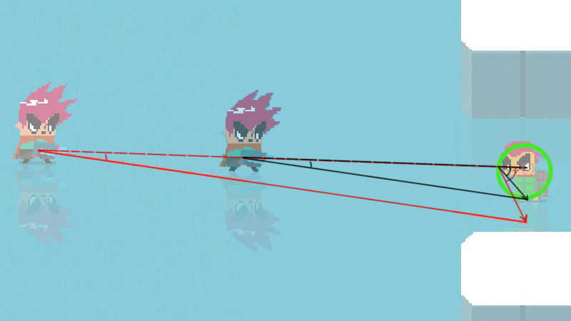

Correct: different situations, different results

It seems obvious now, but I’m a bit embarrassed at how many hours I wasted trying to make the first system work - so I consider this section of the article my good deed of the day! =)

“A Good Feel Is A Hack”

I usually tell people - especially well-trained programmers that are cursed with having to work with me - that “A Good Feel Is A Hack”. When programming controls and feedback for games, it is tempting to try and make everything work with simple, all-encompassing rules, just like real-life.

The sad fact though is that real-life feels like s\*\*\*.

We want our games to feel smooth and larger than life, and often that will translate into a lot of special cases and ugly “ifs” in your otherwise pristine control code. Don’t be afraid of them! This is general advice, so the best I can do is offer a few examples.

In Relic Hunters Zero, my camera tracks a “sweet spot” between the player position and the aiming position. It works great for mouse input (digital, remember?), but I had to make a lot of exceptions for analog sticks. For instance, there was a small and snappy camera movement that happened every time the player switched movement direction, and it was distracting - so I went into the code and wrote a special exception so that the camera would ignore the crosshair position unless the player was not moving OR not using the right analog stick OR the distance was below a certain threshold. Ugly, but effective.

Another example: my game has a digital crosshair as well as directional input (more on that on the next section). If you have auto-aim turned off or you use the subtle “assist” mode which uses the narrow angle I mentioned before, the digital crosshair stays at a distance to the player relative to the length of the stick’s directional vector. For the “full” auto-aim mode, however, I found out that it was better to communicate which enemy was being targeted, so I snap the digital crosshair to be straight on top of the enemy. This exception caused the camera to behave weirdly though, so I coded in yet another exception for the camera to ignore the crosshair when in “full” auto-aim unless the player is aiming or using the right stick.

In conclusion, a good game feel usually revolves around these small touches as you polish the rough edges of the experience. Players don’t care how elegant your code is, they just want smooth controls and feel - just make sure to document your “hacks” well and code maintenance won’t be a problem.

Digital Crosshair With Directional Input

I have just spoiled this in the previous sections, but Relic Hunters Zero has two types of aiming: regular and laser sight. Laser sight is 100% analog - it simply draws a red line corresponding to the input direction from the controller.

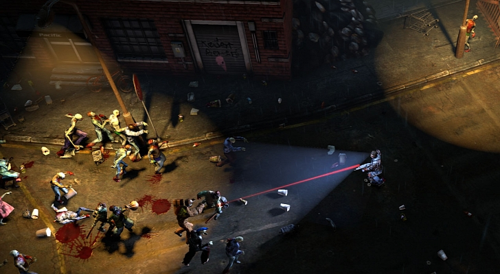

Fully directional aiming in Dead Nation

“Regular” aiming, however, tries to quasi-emulate the mouse input by having a digital crosshair. The way I did it was that the crosshair has a maximum and a minimum distance from the player that is defined by how far the stick is held from the deadzone. This is a simple thing that feels great and helps players check their surroundings, because the camera will follow the crosshair as it distances itself from the player character.

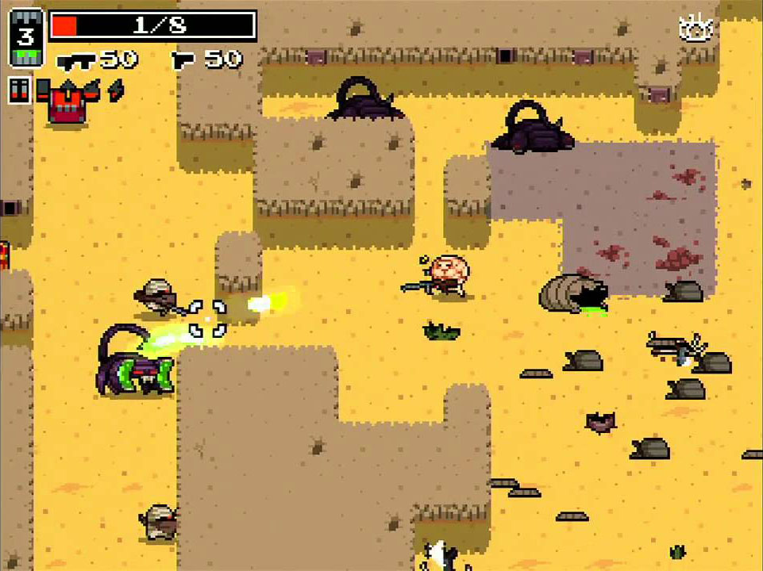

Digital crosshair with directional input in Nuclear Throne

As always, I didn’t get it right at first. I did it like many games do and just had the crosshair follow the “view” direction, and multiplied the maximum distance by the length of the resulting vector of stick input. However, “Thou Shall Not Snap” was in full effect here: the direct correlation between the stick vector and the crosshair distance felt horrible.

Not only was it a bit jaggy and a bit too fast, it also made the camera behave weirdly - it snapped to “0” distance when the input reached the deadzone. It’s common to quickly change directions in Relic Hunters Zero with the digital crosshair - you’re trying to look around to search for enemies, items or whatever -, and you’d get a “bump” on the camera every time the direction changed. This was a result of the stick reaching the deadzone and emerging again on the other side, and it was a disaster.

The solution was to make the digital crosshair also have a “target” position and its own “view” position, as well as speed and acceleration values. This not only solved the terrible “bump” issue but also made camera movement smoother, and direction changes look and feel much better!

Camera Ease-in and Ease-out

The holy grail of “Thou Shall Not Snap” is the camera. Making your camera movement tween instead of snap to position is almost always guaranteed to make your game feel better, no matter the genre.

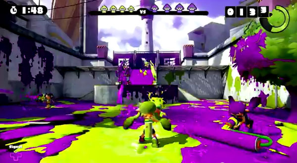

Splatoon’s delicious camera was a big inspiration for Relic Hunters

Making the camera movement smooth in my game had countless benefits. Just like other interpolated movements, even a very fast interpolation is a world away in terms of quality from just snapping to position.

This is most noticeable in the game during sudden movements: dashing, aiming with a sniper rifle and camera shake. Not only it makes the movements smoother and better-looking, it also mitigates motion sickness!

Motion sickness happens when the view moves too drastically / unpredictably, so smaller acceleration usually means that your players will be less likely to experience it.

Give The Game A Rest

Last but not least, this is one of the most valuable lessons I learned while making games: after you spend too much time designing controls and game feel, you become used to them and completely numb to any possible issues.

Unfortunately, user testing is much less useful for game feel and controls than it is for other aspects of games. The main reason is that “feel” is an extremely subjective experience, and most people have an incredible hard time explaining or even identifying it.

Players - and even fellow developers or professional critics - will usually blame bad control/feel issues on other aspects of the game, not because they are dishonest, but because their brains are telling them that there’s something “off” and rush to come up with an explanation. So that’s a huge problem in game design that is rarely discussed - uncomfortable controls and feel will introduce noise in player feedback.

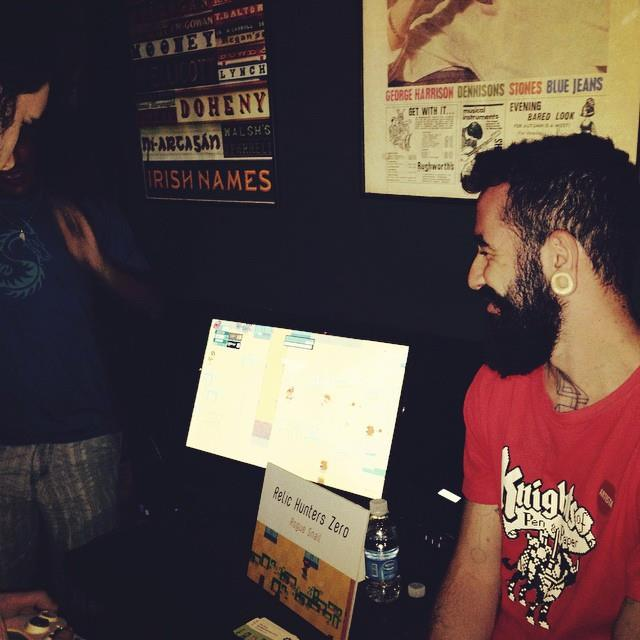

Playtesting your game with complete strangers is extremely valuable!

I’m not saying that controls can’t be improved with player feedback - they definitely can, and you’ve just read about player testing helping me in pretty much all of the points of this article. A good rule of thumb I use (for feel and for everything else) is that if 3 or more people independently complain about something in your game, you most likely have a serious problem worth looking into.

Nevertheless, the designer is still the most important pair of eyes and hands when tuning the feel and controls of the game, so it’s very important to keep your perspective fresh. Take some time off (usually between a week and a month works for me), play other games, do other stuff, and then come back and check how well your controls and your feel are holding up.

I’m not telling you to stop working on the game! Even when we are part of a team, it’s hard to have that luxury. As a solo developer, I usually shifted my focus elsewhere, coding a menu system, or a save system, or audio system - whatever kept me off the controls.

If your game has support for both keyboard/mouse and gamepad, it’s also helpful to switch between them when developing. In Relic Hunters I would use only the mouse for a week, and then as I switched back to the controller I would notice several issues with it, and vice-versa.

That’s it!

Well, I think that’s about all the useful things I’ve learned during these months spent making Relic Hunters. The project is a 100% free, collaborative initiative, so you are all invited to [come check the code out](https://github.com/mventurelli/relichunterszero) if you want to see how I solved a particular problem - and, of course, to join us in keeping the game “Updated Forever”.

If you have any questions I can answer them on the comments, or on twitter @markventurelli.

[Relic Hunters Zero releases for free on Steam on August 18th.](http://store.steampowered.com/app/382490/)

Cheers,

~Mark
