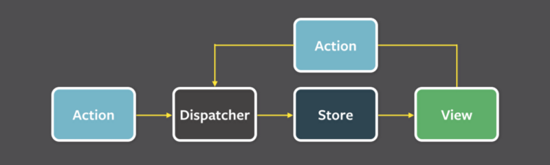

# Evitando complexidade acidental ao estruturar sua aplicação Redux

Implementações do Flux, tais como Redux, nos ensinam a pensar explicitamente sobre o estado da nossa aplicação e passamos um tempo estruturando sua modelagem. No final, não é uma tarefa trivial. É um clássico exemplo de teoria do caos, onde uma pequena vibração inofensiva na direção errada, pode causar um furação de complexidade adicional no futuro. Abaixo, está uma lista de dicas para modelar o estado da sua aplicação e deixar a sua lógica de negócio e o seu eu futuro o mais lúcido possível.

#### O que exatamente é o estado da aplicação

De acordo com o [Wikipedia](https://en.wikipedia.org/wiki/State_%28computer_science%29) — o estado de um programa de computador é armazenado em variáveis, que representam locais de armazenamento na memória do computador. O conteúdo dessas posições em memória, a qualquer ponto de execução do programa, isso é chamado de estado do programa.

No nosso contexto, é importante adicionar a palavra “mínimo” para essa definição. Quando modelamos o estado da nossa aplicação para controle explícito, vamos dar o nosso melhor para usar o mínimo tamanho de dados possíveis para expressar seu estado, e ignorar todas essas outras “variáveis” que podem ser, apenas, dados derivados desses dados mínimos.

Em aplicações [Flux](https://facebook.github.io/flux/) o estado da aplicação é mantido em “stores”. São despachados “actions” que modificam essas “stores”, após tudo isso, as “views” que estiverem escutando essas “stores” irão se re-renderizar se existir um novo estado para elas.

[Redux](http://redux.js.org/), que será nossa implementação de Flux usada nesse artigo, adiciona algumas etapas nesse processo — uma delas, mantendo o estado da aplicação em apenas uma “store”, que também é imutável e que também é de fácil serialização.

### **1. Evite modelar estado baseado na API do servidor**

O estado de algumas aplicações, algumas vezes, nascem baseadas no servidor. Quando uma aplicação mostra dados vindo de uma requisição de um servidor remoto, é muito tentador manter a estrutura de dados da mesma forma como o servidor enviou.

Considere o exemplo de um comércio eletrônico para uma loja. O dono da loja irá usar a aplicação para catalogar seus produtos, então, mostrar uma lista de produtos é fundamental. A lista de produtos é requisitada usando a API do servidor, mas, é necessário guardar seu estado no cliente para ser possível re-utiliza-lá. Vamos assumir que a API principal para buscar essa lista retorna o seguinte JSON:

A lista de produtos é um *array de objetos*, então, vamos salvar no estado da aplicação como um *array de objetos*, certo?

A API do servidor segue diferentes conceitos que, não necessariamente, estão em conformidade com a estrutura de dados que sua aplicação está tentando criar. Nesse caso, a escolha de *array* no servidor, pode estar relacionada a paginação, dividir a lista em pequenos pedaços ao invés de mandar a lista inteira para ter uma resposta mais rápida. Todas as preocupações de rede são importantes, mas geralmente, não são relacionadas com nossas preocupações na modelagem do estado da aplicação.

### **2. Prefira objetos ao invés de array**

Em geral, *arrays* são inconvenientes para manter estado. Considere a situação de quando um item precisa ser atualizado ou selecionado. Esse pode ser o caso, por exemplo, se na aplicação nós adicionarmos a possibilidade de editar preços, ou se os dados precisam ser atualizados no servidor. Iterar sobre um grande *array* para achar um produto específico, é bizarro, já que podemos acessar ele através do seu ID.

Então, qual é a minha recomendação? Use *objetos* e indexe suas chaves pela chave primária.

Isso significa, que os dados do exemplo anterior, podem ser armazenados no estado da aplicação da seguinte maneira:

E se a ordenação é importante? Por exemplo, se a ordem retornada pelo servidor é a mesma ordem que devemos mostrar para o usuário. Nesse caso, nós podemos armazenar um *array* contendo apenas as chaves primárias, nesse cado, o ID:

Uma observação interessante: Se você estiver planejando usar o componente [ListView](https://facebook.github.io/react-native/docs/listview.html) no React Native, essa estrutura funciona muito bem. A versão recomendada do atributo [cloneWithRows](https://facebook.github.io/react-native/docs/listviewdatasource.html#clonewithrows) suporta uma linha de ID’s exatamente nesse formato.

### **3. Evite modelar o estado baseado na estrutura de suas páginas**

A proposta principal do estado da aplicação é propagar dados para suas páginas serem renderizadas para o usuário. É tentador evitar a transformação de dados adicional e simplesmente guardar os dados exatamente da maneira que sua página irá consumir.

Vamos voltar ao nosso exemplo do comércio eletrônico. Supondo que cada produto pode estar em estoque ou fora de estoque. Podemos guardar essa informação em um atributo *boolean* no na chave do nosso produto:

Em seguida, foi pedido a possibilidade de mostrar uma lista de produtos que estão fora de estoque. Se você se lembrar do exemplo anterior, o componente ListView do React Native espera 2 métodos para seu atributo [cloneWithRows](https://facebook.github.io/react-native/docs/listviewdatasource.html#clonewithrows): um objeto de dados e um *array* de ID’s. Somos tentados a preparar nosso estado para manter essa relação explícita. Isso nos proporcionará a possibilidade de disponibilizar ambos os argumentos para ListView sem precisar de transformações adicionais. Nossa estrutura de dados fica da seguinte maneira:

Parece uma ótima idéia, certo?!… Bom… na verdade não é!

A razão, é a mesma de anteriormente, que a página contém diferentes preocupações que não devem ser refletidas no nosso estado. Páginas não se importam em manter um estado mínimo. Na verdade, é o oposto, porque os dados devem ser mostrado a qualquer custo para o usuário. Páginas diferentes podem precisar dos mesmos dados em maneiras diferentes e é impossível satisfazer todas sem duplicar dados no nosso estado.

E isso tudo, nos leva ao próximo ponto…

### **4. Nunca guarde dados duplicados no estado da sua aplicação**

Um bom teste para saber se seu estado está guardado dados duplicados é verificar se atualizações são feitas em dois lugares ao mesmo tempo para manter consistência. No exemplo acima, produtos fora de estoque, vamos supor que o primeiro produto fica fora de estoque. O processo de atualização desse produto é a seguinte: temos que atualizar a chave “outOfStock” para *true* no objeto produto, e adicionar seu ID no *array* “outOfStockProductIds” — duas atualizações.

Lidar com dados duplicados é simples. Tudo que você tem que fazer é remover uma das instâncias. A razão por trás disso, é baseado na teoria [única fonte de verdade](https://en.wikipedia.org/wiki/Single_source_of_truth), do inglês, *single source of truth*. Se os dados são salvados apenas uma vez, não é possível ter inconsistências no estado da nossa aplicação.

Se removermos o array “outOfStockProductIds”, nós ainda teremos que achar uma maneira de mostrar esses dados na página. Essa transformação terá que ocorrer em tempo de execução, antes da página ser mostrada ao usuário. A prática recomendada em Redux para esse tipo de caso, é implementar um [**selector**](https://egghead.io/lessons/javascript-redux-colocating-selectors-with-reducers):

Os seletores são funções puras que recebem o estado como entrada e retornam o parte do estado transformado, da maneira que deve ser consumido. [Dan Abramov](https://twitter.com/dan_abramov) recomenda a armazenar esses seletores próximo ao seus reducers, afinal, eles são dependentes. Nós vamos executar o seletor dentro na execução da página, dentro do “mapStateToProps”.

Outra alternativa viável para nosso exemplo, é remover todos as chaves “outOfStock” dos nosso produtos. Nessa alternativa, nós mantemos o *array* “outOfStockProductMap” como única fonte de verdade. Bem… na verdade… seguindo a dica #2, acho que é melhor mudar esse array para um objeto:

### **5. Nunca guarde dados derivados no seu estado**

O princípio de fonte única de verdade é válido não apenas para dados duplicados. Qualquer dado derivado encontrado na seu estado, estão violando esse princípio, porque atualizações feitas no estado, terão que ocorrer um locais múltiplos para manter a consistências do seu estado.

Vamos supor o cliente pediu outra funcionalidade, a habilidade de colocar produtos à venda e adicionar desconto no seu preço. Então precisamos mostrar ao usuário uma lista de todos os produtos, uma lista de produtos sem desconto e uma lista de produtos com desconto.

Um erro comum seria adicionar mais um array no estado contendo os ID’s dos produtos em questão. Vamos pensar que os 3 arrays podem ser derivados do filtro atual e da lista principal, uma solução melhor seria criar essa seleção usando um **selector**:

Seletores são executados todas as vezes que o estado muda, exatamente antes da página ser mostrada ao usuário. Se os seus seletores estiverem executando algo complexo e intenso para a CPU e você estiver preocupado com performance, aplique [memoização](https://en.wikipedia.org/wiki/Memoization) para computar os dados e cachea-los. Dê uma olhada na biblioteca [Reselect](https://github.com/reactjs/reselect) para resolver esse problema.

### **6. Faça a normalização de objetos aninhados**

Em geral, a motivação para todas essas dicas é manter a simplicidade. Estados precisam ser planejados de tempos em tempos, e queremos fazer isso com o mínimo de problemas possível. Simplicidade é fácil de manter quando seus objetos são independentes, mas, o que acontece quando você tem dados aninhados?

Vamos considerar o exemplo abaixo, no estado da nossa aplicação. Queremos adicionar um sistema de gerenciamento de pedidos, onde nossos usuários fazem compras de vários produtos em um único pedido. Vamos assumir que temos uma API de servidor que retorna em JSON a seguinte lista de pedidos:

O pedido contém vários produtos, então nós temos uma relação entre eles que precisam ser modeladas. Nós vimos na dica #1 que, provavelmente, não devemos usar a resposta da API do jeito que ela é como modelo de estado, que nesse exemplo, de fato é problemática, porque vai causar a duplicação de dados do produto.

Uma boa abordagem nesse caso é normalizar os dados e manter dois objetos separados — um para os produtos, outro para os pedidos. Como ambos contém ID’s únicos, nós podemos usar os ID’s para criar a relação entre os objetos. Resultando no seguinte modelo de estado:

Se quisermos achar todos os produtos que fazem parte de um pedido, nós iteramos na chave “products” do pedido. O resultado é que, cada chave dentro dele é um ID único de produto. Acessando o objeto “productsById” com esse ID, irá retornar os detalhes do produto. Adicionalmente, os detalhes de cada produto relacionados a esse pedido, como “giftWrap”, são encontrados no objeto “products” do pedido.

Esse processo de normalizar as respostas de API’s se transforma em um trabalho tedioso, de uma olhada em bibliotecas para esse trabalho, como o [normalizr](https://github.com/paularmstrong/normalizr) que recebe como entrada um “schema” e faz todo o trabalho para você.

### **7. O estado da sua aplicação pode ser considerado um banco de dados em memória**

Todas essas dicas de modelagem soam familiar, afinal, nós fazemos escolhas semelhantes quando colocamos nosso chapéu de DBA e modelamos [banco de dados tradicionais](https://en.wikipedia.org/wiki/Database).

Quando modelamos banco de dados tradicionais, nós evitamos duplicação de dados, derivações, indexamos dados em objetos (tabelas) usando ID como chave primária e normalizamos relações entre várias tabelas. Basicamente tudo o que falamos até agora.

Trate o estado da sua aplicação como um banco de dados em memória, talvez isso possa te ajudar a pensar de maneira correta e tomar decisões melhores para estrutura seus dados.
