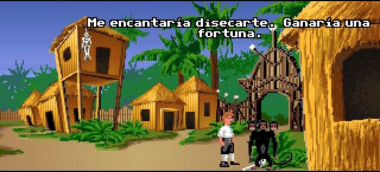
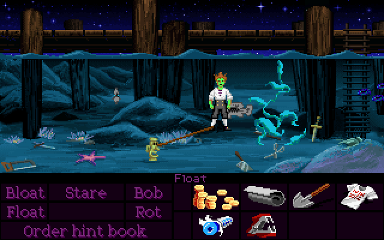

# "The Secret of Monkey Island" es el mejor videojuego del mundo

Mario Chavarría

marzo 18, 2015

Hubo un tiempo a principios
de los noventa en el que te podías pasar tres semanas intentando dilucidar cómo
transportar determinada cantidad de delicioso pero corrosivo Grog desde una
taberna hasta la prisión del pueblo, con el único objeto de derretir la cerradura
y liberar a un potencial miembro de tu futura tripulación. En aquella época, en
la que lo más parecido que existía a una guía online era poner una conferencia
telefónica a Granada para preguntarle a tu tío el *enrollao* (el que te había
pasado el juego en dos disquetes de 3.5) cómo había superado él determinada
parte del juego, el mundo de los videojuegos era totalmente distinto al que
conocemos hoy en día.

El género dominante, el
paradigma que prevalecía en aquel entonces, era el de la aventura gráfica, un
género basado en la investigación detectivesca que ponía a prueba tu lógica
deductiva hasta extremos muchas veces delirantes. En muchas de estas aventuras
ni siquiera podías morir; y vosotros pensaréis: ¡Qué guay! PUES NO. Había algo
mucho peor que morir en un videojuego, y era quedarte atascado durante semanas
sin saber cómo avanzar, probando combinaciones de acciones en una vorágine de
crecimiento exponencial hasta alcanzar el más ridículo de los absurdos. Era
frustrante pero a la vez maravilloso. Lo echo de menos. Por las noches rezo
entre lágrimas pidiéndole a Dios que nos devuelva a aquella época dorada del
conocimiento.

El caso es, que de entre
toda la excelsa lista de juegos que nos deleitaron durante aquellos años (la
mayoría obra de Lucasarts, y con honrosos representantes en otras compañías
como Sierra), destaca, brillando en el firmamento como un poderoso cometa, un
título que ha pasado a los anales de la cultura popular como un clásico eterno
y sagrado, comparable en impacto y alcance a otras sagas trufadas de sables
láser, látigos y chaquetas de cuero y Anillos de Poder Únicos. Me refiero,
claro está, a la saga de Monkey Island (entiéndase por saga la formada por las
dos primeras partes).

En aquella dulce época a la
que ya me he referido antes, pasaba horas y horas delante de mi [386](http://es.wikipedia.org/wiki/Intel_80386) (equipado
con uno de aquellos flamantes protectores de pantalla que se acoplaban con
velcro al monitor y que probablemente a día hoy estén desaconsejados por 9 de
cada 10 oftalmólogos) intentando desentrañar los misterios de esta atemporal
aventura. Algunos dirán que perdía el tiempo, yo opino todo lo contrario. Para
mí forma parte de mi educación como ser humano, de mi bagaje como ente que
transita por los complicados caminos de la existencia.Por decirlo rápido y mal, he aprendido más
con los dos primeros *monkeys* que con mi paso por la Facultad de Ciencias de la
Información. Me resulta complicado enumerar de forma ordenada y coherente la
miríada de virtudes de este maravilloso artefacto cultural, cuya presencia
debería de ser obligatoria en todo plan de estudios universitario que se
precie, pero lo intentaré.

*The Secret of Monkey Island* parte de una premisa clásica, siguiendo el esquema
de "el viaje del héroe", promulgado por Joseph Campbell: un chico normal es
obligado por las circunstancias a dejar su existencia mundana y a emprender un
viaje que es a la vez físico, espiritual e iniciático y que le cambiará para
siempre. Por el camino encontrará mentores, brujos, princesas y enemigos, y al
final cumplirá su misión y volverá triunfante y cambiado, siendo ahora un héroe
que usa lo aprendido en la epopeya para ayudar a sus semejantes y hacer
prevalecer lo que es justo. La cosa es que pronto descubriremos que en el juego
esta estructura se deforma deliciosamente gracias al genio de Ron Gilbert y
compañía: la princesa es muy capaz de cuidar ella solita de sí misma, el héroe
es un patán entrañable cuya cualidad heroica más significativa es que puede
aguantar la respiración bajo el agua durante diez minutos y el villano es un
pirata fantasma encantador y carismático que nos regalará inolvidables momentos
de diversión. Es más, al final del viaje el propio héroe no tendrá muy claro si
ha aprendido algo o no (ni siquiera si ha viajado), y yendo más allá, si
hablamos de la segunda parte de la saga, descubriremos que mantener el estatus
del héroe no es tarea fácil ni mucho menos, de hecho es una labor de lo más
estresante.

Podría empezar hablando de
su genial sistema antipirateo, una rueda de cartón -sí, un SISTEMA FÍSICO- en
el que superponían diferentes partes de caras de piratas para formar un sistema
de claves basado en fechas. O deleitarme elogiando su laureado interfaz,el SCUMM, aquel panel que ofrecía un
determinado número de acciones y un listado de objetos cuya combinación
permitía avanzar en el juego y que fue el denominador común de toda una serie
de videojuegos que cambiaron la forma de jugar -y de pensar- de toda una
generación. Pero no, aún así no alcanzaría para ilustrar la genialidad del
Monkey Island.

Creo que quizá el mayor
logro resida en un guión sólido como el acero, en unos diálogos dignos de una
comedia de Ernst Lubitsch y en la manera magistral en la que recurre a la
autorreferencia, el metahomenaje y la parodia de género. Pero lo que para mí de
verdad parte la pana, lo que me parece la ostia, etc., es la sensación de
LIBERTAD. Es decir: al final del juego, en mitad de una escena romántica entre
los protagonistas, cuando nuestro héroe, Guybrush, empezaba a esbozar una
especie de moraleja, y decía, algo así como "Si algo he aprendido de toda esta
aventura es..." Tú podías elegir entre varias frases para acabar el discurso, y
sí, podías ponerte romántico, o heroico, pero también podías elegir decir
"Nunca pagues más de veinte duros por un videojuego".

No tengo palabras para
explicar la genialidad de semejante atrevimiento. La irreverencia, la
posibilidad de reírse de uno mismo, la ausencia de complejos... Es maravilloso.
Eso sobrepasa el mero entretenimiento, eso te educa. Te prepara para toda la
mierda por la que vas a tener que pasar luego. Es como un entrenamiento Jedi
para nuestro deambular por la vida adulta. Es decir, afrontémoslo, por el amor
de Dios, en qué videojuego actual puedes escuchar a un personaje diciéndote:
"¿Llevas un recoge-plátanos en el bolsillo o es que te alegras de verme?". No
existe. No es posible. En nuestro ámbito cultural actual, en el que cada
palabra y cada acción están milimétricamente medidas con el objeto de no
ofender a nada ni a nadie, semejante arranque de desinhibición, de frescura, se
antoja imposible.

Creo que es una buena
muestra de lo revolucionario, de lo único de esta maravilla digital. Por no
hablar de las celebérrimas peleas de insultos, de los chascarrillos geniales,
del bastoncillo de las orejas gigante como llave para abrir las puertas del
inframundo, del ídolo Fabuloso que más bien parece un Fabuloso Tope de Puerta,
del pollo de goma, del mono de tres cabezas, de la camiseta en la que pone:
"encontré el tesoro de Mêlée Island™ y lo único que he conseguido es esta
estúpida camiseta", de Stan y su negocio de barcos usados, de la cerveza de
raíz, de los conflictos vecinales entre Lechuck, los caníbales de Monkey Island
y Herman Toothrot, el hilarante pero enajenado náufrago de Monkey Island, del
homenaje a Indiana Jones con frases como "estoy vendiendo estas chaquetas de
cuero" o "este SÍ es el cáliz de un carpintero", de George Lucas disfrazado de
troll comiéndose un arenque, del árbol de goma con guiño al universo Sierra,
del cartel electoral que reza: "reelija a la gobernadora Marley, ¡cuando solo
hay un candidato, solo hay una elección!", o de la máquina expendedora de Grog
con un logo sospechosamente parecido al de otra bebida gaseosa refrescante de
extractos... Podría tirarme días y días así. Podría hablar de lo genial de su
planteamiento argumental, de cómo nos pasamos horas y horasbuscando el secreto mencionado en el título,
cuando en realidad ese secreto no se desvela, es un *mcguffin*, un pretexto que nos guía a través de tribulaciones y
acertijos para convertirnos en el héroe que estamos destinados a ser. O podría
hablar su música o de los maravillosos gráficos que aún a día de hoy se
conservan frescos y actuales y cuya comparación con la nueva y reciente
reinterpretación HD convierte a esta última en poco menos que en un chiste de
mal gusto. Podría seguir y seguir, pero no tendría sentido. El universo Monkey
Island es tan vasto y tan rico en matices que creo que cualquierhomenaje o estudio se queda corto para
reflejar la magnitud de su grandeza. Por eso mi consejo es simple: HAY QUE
JUGARLO. Hay que disfrutarlo, desgranarlo, amarlo, gozarlo, aprovecharlo. Hay
que regocijarse, deleitarse, solazarse en su genialidad. Es la única manera de
entenderlo del todo. Hay un antes y un después de Monkey Island. Si queréis que
vuestros hijos sirvan para algo el día de mañana, no lo dudéis; que jueguen al
Monkey Island. Eso les dará armas para desenvolverse ahí fuera. Os lo
garantizo.

En fin, creo que me ha
pasado como a Guybrush y a su viaje iniciático, no sé si al final alguien habrá
aprendido algo con todo esto, de hecho ni siquiera estoy seguro de que esto
haya sido realmente un viaje. Pero yo si que tengo muy clara una cosa: puedo
afirmar sin temor a sonrojarme que *The
Secret of Monkey Island* es lo que más me gusta del mundo entero. No es
coña. LO QUE MÁS. Bueno, miento: hay una cosa que me gusta más; el Monkey 2.
