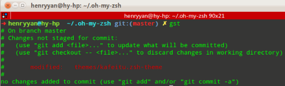

# Git Tips & Tricks

Handy Git commands for everyday use

[Git](https://git-scm.com/) comes with a ton of commands, and that's probably an understatement.

[The internet](https://about.gitlab.com/images/theinternet.png) is full of Git tips and it's hard if not impossible to know them all, but sometimes you stumble upon an aha! moment that changes your whole workflow.

In this post, we gathered some Git tips and tricks we use at GitLab everyday. Hopefully they will add up to your aha! moment.

## Intro

Almost everybody at GitLab will need to use Git at some point. For newcomers who know nothing about Git that can be a fearsome experience. We have a [Git cheatsheet](https://gitlab.com/gitlab-com/marketing/raw/master/design/print/git-cheatsheet/print-pdf/git-cheatsheet.pdf) and a `#git-help` chat channel where we ask questions and provide help if some of us get stuck. That's a quick way to provide help, and if something is complicated or someone has messed up their local repository and needs immediate help, there's always a person to jump on a quick call.

Here's a pack of Git tricks that will leverage your Git-fu and you'll hopefully find useful. Remember, the list is far from exhaustive :)

## Git's built-in help

The majority of users rely on sites like [StackOverflow](https://stackoverflow.com/) to find answers to their Git problems, but how often do you use Git's built-in help to find more about a command you are struggling with?

### The most common commands

Run `git help` to print a list of the most common commands. You'll probably notice you've used most of them, but how well do you really know them? Thankfully, there is a help page for every command!

### A help page for every command

Git's documentation is comprehensive and is automatically installed with Git. Run `git help <command>` to find out all about a command's behavior and what options it can take.

### Git guides

Git comes with a handful of guides ready for you to explore. Run `git help -g` to see what's available:

```
The common Git guides are:

   attributes   Defining attributes per path
   everyday     Everyday Git With 20 Commands Or So
   glossary     A Git glossary
   ignore       Specifies intentionally untracked files to ignore
   modules      Defining submodule properties
   revisions    Specifying revisions and ranges for Git
   tutorial     A tutorial introduction to Git (for version 1.5.1 or newer)
   workflows    An overview of recommended workflows with Git
```

Jump to a Git tutorial with `git help tutorial`, go through the glossary with `git help glossary` or learn about the most common commands with `git help everyday`.

## See the repository status in your terminal's prompt

It's very useful to be able to visualize the status of your repository at any given time. While there are 3rd party tools that include this information ([oh-my-zsh](http://ohmyz.sh/) anyone?), Git itself provides a script named `git-prompt.sh` that does exactly that. You can [download it](https://github.com/git/git/blob/master/contrib/completion/git-prompt.sh) and follow the instructions in it to install and use it in your system. If you're using Linux and have installed Git with your package manager, it may already be present on your system, usually under `/etc/bash_completion.d/`.

Go ahead and replace your boring shell prompt with something like this:



*Taken from oh-my-zsh's [themes wiki](https://github.com/robbyrussell/oh-my-zsh/wiki/Themes#kafeitu)*

## Autocompletion for Git commands

You may also find it useful to use the [completion scripts](https://github.com/git/git/tree/master/contrib/completion) that provide Git command completion for `bash`, `tcsh` and `zsh`. Again, follow the instructions inside the scripts to learn how to install them. Once done, you can try out typing a command.

Let's say you want to type `git pull`. If Git completion is enabled, typing just the first letter with `git p` followed by `Tab` will show the following:

```
pack-objects   -- create packed archive of objects
pack-redundant -- find redundant pack files
pack-refs      -- pack heads and tags for efficient repository access
parse-remote   -- routines to help parsing remote repository access parameters
patch-id       -- compute unique ID for a patch
prune          -- prune all unreachable objects from the object database
prune-packed   -- remove extra objects that are already in pack files
pull           -- fetch from and merge with another repository or local branch
push           -- update remote refs along with associated objects
```

To show all available commands, type `git` in your terminal followed by `Tab`+ `Tab`, and see the magic happening.


## Git plugins

Since Git is free software, it's easy for people to write scripts that extend its functionality. Let's see some of the most common ones.

### The `git-extras` plugin

If you want to enhance Git with more commands, you'll want to try out the [`git-extras` plugin](https://github.com/tj/git-extras). It includes commands like `git info` (show information about the repository), `git effort` (number of commits per file), and the list goes on. After you [install](https://github.com/tj/git-extras/blob/master/Installation.md) it, make sure to visit the [documentation on the provided commands](https://github.com/tj/git-extras/blob/master/Commands.md) in order to understand what each one does before using it.

### The `git-open` plugin

If you want to quickly visit the website on which the repository you're on is hosted, `git-open` is for you. All major providers are supported (GitLab, GitHub, Bitbucket) and you can even use them all at the same time if you set them as different remotes.

[Install it](https://github.com/paulirish/git-open#installation), and try it out by cloning a repository from [GitLab.com](https://gitlab.com/explore). From your terminal navigate to that repository and run `git open` to be transferred to the project's page on GitLab.com.

It works by default for projects hosted on GitLab.com, but you can also use it with your own GitLab instances. In that case, make sure to set up the domain name with:

```
git config gitopen.gitlab.domain git.example.com
```

You can even open different remotes and branches if they have been set up. Read more in the [examples section](https://github.com/paulirish/git-open#examples).

## `.gitconfig` on steroids

The `.gitconfig` file contains information on how you want Git to behave on certain circumstances. There are options you can set at a repository level, but you can also set them in a global `.gitconfig` so that all local config will inherit its values. This file usually resides in your home directory. If not, either you'll have to create it manually or it will be automatically be created when you issue a command starting with `git config --global` as we'll see below.

The very first encounter with `.gitconfig` was probably when you set your name and email address for Git to know who you are. To know more about the options `.gitconfig` can take, see the [Git documentation on `.gitconfig`](https://git-scm.com/docs/git-config).

If you are using macOS or Linux, `.gitconfig` will probably be hidden if you are trying to open it from a file manager. Either make sure the hidden files are shown or open it using a command in the terminal: `atom ~/.gitconfig`.

Let's explore some of the most useful config options.

### Set a global `.gitignore`

If you want to avoid committing files like `.DS_Store`, Vim `swp` files, etc., you can set up a global `.gitignore` file.

First create the file:

```
touch ~/.gitignore
```

Then run:

```
git config --global core.excludesFile ~/.gitignore
```

Or manually add the following to your `~/.gitconfig`:

```
[core]
  excludesFile = ~/.gitignore
```

Gradually build up your own useful list of things you want Git to ignore. Read the [gitignore documentation](https://git-scm.com/docs/gitignore) to find out more.

---

*[Git docs source](https://git-scm.com/docs/git-config#git-config-coreexcludesFile)*

### Delete local branches that have been removed from remote on fetch/pull

You might already have a bunch of stale branches in your local repository that no longer exist in the remote one. To delete them in each fetch/pull, run:

```
git config --global fetch.prune true
```

Or manually add the following to your `~/.gitconfig`:

```
[fetch]
  prune = true
```

---

*[Git docs source](https://git-scm.com/docs/git-config#git-config-fetchprune)*

### Enable Git's autosquash feature by default

Autosquash makes it quicker and easier to squash or fixup commits during an interactive rebase. It can be enabled for each rebase using `git rebase -i --autosquash`, but it's easier to turn it on by default.

```
git config --global rebase.autosquash true
```

Or manually add the following to your `~/.gitconfig`:

```
[rebase]
  autosquash = true
```

At this point, let us remind you of [the perils of rebasing](https://git-scm.com/book/en/v2/Git-Branching-Rebasing#The-Perils-of-Rebasing).

---

*[Git docs source](https://git-scm.com/docs/git-config#git-config-rebaseautoSquash)* *([tip taken from thoughbot](https://github.com/thoughtbot/dotfiles/pull/377))*

### Extra info when using Git submodules

If you are using [submodules](https://git-scm.com/book/en/v2/Git-Tools-Submodules), it might be useful to turn on the submodule summary. From your terminal run:

```
git config --global status.submoduleSummary true
```

Or manually add the following to your `~/.gitconfig`:

```
[status]
  submoduleSummary = true
```

---

*[Git docs source](https://git-scm.com/docs/git-config#git-config-statussubmoduleSummary)*

### Change the editor of Git's messages

You can change the default text editor for use by Git commands.

From `git help var`: the order of preference is the `$GIT_EDITOR` environment variable, then `core.editor` configuration, then `$VISUAL`, then `$EDITOR`, and then the default chosen at compile time, which is usually `vi`.

Running `git config --show-origin core.editor` will tell you if `core.editor` is set and from which file. This needs at least Git 2.8.

To change it to your favor editor (`vim`, `emacs`, `atom`, etc.), run:

```
git config --global core.editor vim
```

Or manually add the following to your `~/.gitconfig`:

```
[core]
  editor = vim
```

---

*[Git docs source](https://git-scm.com/docs/git-config.html#git-config-coreeditor)*

### Change the tool with which diffs are shown

`git diff` is useful as it shows the changes that are not currently staged. When running this command Git usually uses its internal tool and displays the changes in your terminal.

If you don't like the default difftool there are a couple of others to choose from:

To change the default tool for watching diffs run the following:

```
git config --global diff.tool vimdiff
```

Or manually add the following to your `~/.gitconfig`:

```
[diff]
  tool = vimdiff
```

Also related is the `merge.tool` setting which can be set to a tool to be used as the merge resolution program. Similarly:

```
git config --global merge.tool vimdiff
```

Or manually add the following to your `~/.gitconfig`:

```
[merge]
  tool = vimdiff
```

---

*[Git docs source](https://git-scm.com/docs/git-difftool)*

## Aliases

Git commands can take a lot of flags at a time. For example, for a log graph you can use the following command:

```
git log --graph --pretty=format:'%Cred%h%Creset -%C(yellow)%d%Creset %s %Cgreen(%cr)%Creset' --abbrev-commit --date=relative
```

You sure don't want to type this every time you need to run it. For that purpose, Git supports aliases, which are custom user-defined commands that build on top of the core ones. They are defined in `~/.gitconfig` under the `[alias]` group.

Open `~/.gitconfig` with your editor and start adding stuff.

### Add an alias to pretty log graphs

In your `~/.gitconfig` add:

```
[alias]
  lg = log --graph --pretty=format:'%Cred%h%Creset -%C(yellow)%d%Creset %s %Cgreen(%cr)%Creset' --abbrev-commit --date=relative
  lol = log --graph --decorate --pretty=oneline --abbrev-commit
```

Next time you want the pretty log to appear, run: `git lg` or `git lol` for some pretty log graphs.

### Add an alias to checkout merge requests locally

A merge request contains all the history from a repository, plus the additional commits added to the branch associated with the merge request. Note that you can checkout a public merge request locally even if the source project is a fork (even a private fork) of the target project.

To checkout a merge request locally, add the following alias to your `~/.gitconfig`:

```
[alias]
  mr = !sh -c 'git fetch $1 merge-requests/$2/head:mr-$1-$2 && git checkout mr-$1-$2' -
```

Now you can check out a particular merge request from any repository and any remote. For example, to check out the merge request with ID 5 as shown in GitLab from the `upstream` remote, run:

```
git mr upstream 5
```

This will fetch the merge request into a local `mr-upstream-5` branch and check it out. In the above example, `upstream` is the remote that points to GitLab which you can find out by running `git remote -v`.

### The Oh-my-zsh Git aliases plugin

If you are an [Oh My Zsh](http://ohmyz.sh/) user you'll probably know this already. Learn how you can [enable the Git plugin](https://github.com/robbyrussell/oh-my-zsh/wiki/Plugin:git) provided with Oh My Zsh and start using the short commands to save time. Some examples are:

- `gl` instead of `git pull`
- `gp` instead of `git push`
- `gco` instead of `git checkout`

## Git command line tips

Here's a list of Git tips we gathered.

### An alias of `HEAD`

Did you know `@` is the same as `HEAD`? Using it during a rebase is a life saver:

```
git rebase -i @~2
```

### Quickly checkout the previous branch you were on

A dash (`-`) refers to the branch you were on before the current one. Use it to checkout the previous branch ([source](https://twitter.com/holman/status/530490167522779137)):

```
# Checkout master
git checkout master

# Create and checkout to a new branch
git checkout -b git-tips

# Checkout master
git checkout master

# Checkout to the previous branch (git-tips)
git checkout -
```

### Delete local branches which have already been merged into master

If you are working everyday on a project that gets contributions all the time, the local branches number increases without noticing it. Run the following command to delete all local branches that are already merged into master ([source](http://stevenharman.net/git-clean-delete-already-merged-branches)):

```
# Make sure you have checked out master first
git checkout master

# Delete merged branches to master except master
git branch --merged master | grep -v "master" | xargs -n 1 git branch -d
```

In the event that you accidentally delete master (💩 happens), get it back with:

```
git checkout -b master origin/master
```

### Delete local branches that no longer exist in the remote repo

To remove all tracking branches that you have locally but are no more present in the remote repository (`origin`):

```
git remote prune origin
```

Use the `--dry-run` flag to only see what branches will be pruned, but not actually prune them:

```
git remote prune origin --dry-run
```

If you want this to be run automatically every time you fetch/pull, see [how to add it to your `.gitconfig`](https://about.gitlab.com/2016/12/08/git-tips-and-tricks/#delete-local-branches-that-have-been-removed-from-remote-on-fetchpull).

### Checking out a new branch from a base branch

You can checkout a new branch from a base branch without first checking out the base branch. Confusing? Here's an example.

If you are on a branch named `old-branch` and you want to checkout `new-branch` based off `master`, you'd normally do:

```
git checkout master
git checkout -b new-branch
```

There's a quicker way though. While still on the `old-branch`, run:

```
git checkout -b new-branch master
```

The pattern is the following:

```
git checkout -b new_branch base_branch
```

## References

## Conclusion

As always, writing something about Git, only scratches the surface. While some of the tips included in this post might come in handy, there are sure a lot of other stuff we're not familiar with.


