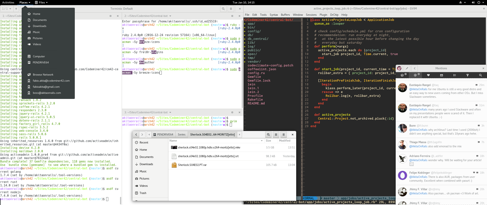
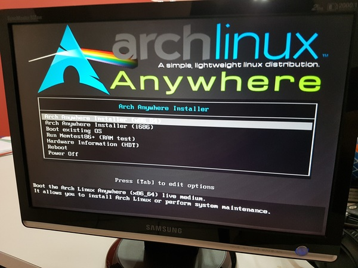
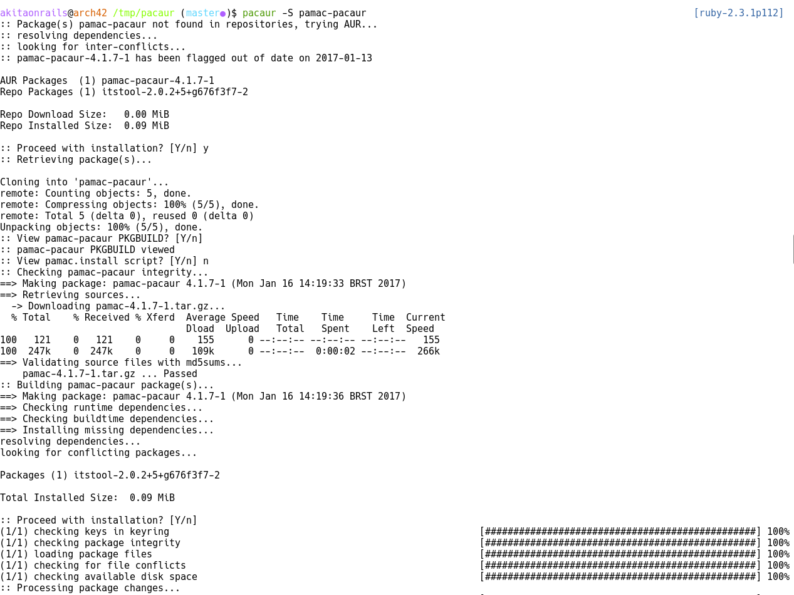

# Arch Linux - Best distro ever?

2017 January 10, 14:25 h - tags: [linux](http://www.akitaonrails.com/linux) [pacman](http://www.akitaonrails.com/pacman) [pacaur](http://www.akitaonrails.com/pacaur) [asdf](http://www.akitaonrails.com/asdf) [archlinux](http://www.akitaonrails.com/archlinux)

**Update 01/18/2017:** If you're on old hardware like me, you may want to optimize your installation to be way more responsiveness, [read all about it here](http://www.akitaonrails.com/2017/01/17/optimizing-linux-for-slow-computers).

Since I decided to move back from macOS to Linux, I didn't want to just return to old Ubuntu (yes, I get bored of doing the same things for too long). So I tried out Fedora 25 and I was delighted by how Gnome 3.22 evolved nicely.

Compared to Ubuntu, Fedora's defaults felt nicer. In practice you can force any distro to become whatever you want, but I'd rather not fight the defaults. Ubuntu is heavily customized for Unity and I really, really dislike it. It feels more like a toy than a serious environment to do work.

Fedora 25 looks good with Gnome 3, but it still gave me a few headaches. One thing that didn't work at all was [Gnome's Online Accounts](https://wiki.gnome.org/Projects/GnomeOnlineAccounts). GOA collects authentication tokens after you sign in to your social services like Google. Then compatible apps like Evolution and the built-in Calendar can pick them up. But the tokens were getting expired all the time, so the integration was useless. And manually configuring Evolution for Google wasn't pleasant.



Now the surprise: on Arch Linux, I chose Gnome 3.22 as my desktop and manually installed the [gnome-online-account](https://www.archlinux.org/packages/extra/i686/gnome-online-accounts/) package. I signed in to my Google accounts and I am very delighted to report that it's not expiring and it "Just Works"! This is the kind of polish I expect from a major distro, not the fiasco that's labeled as "stable" in Fedora.

### Why Arch Linux?

Most major distros are divided between "stable" (but with very old packages) and "unstable" (but with the cutting-edge goodness). If you install the Long-Term Support (LTS) versions, you're doomed to have only old packages from a couple of years ago. If you install the unstable repositories, you're doomed to have stuff exploding in your face without explanation and losing hours browsing through Stackoverflow.

Now, it seems that Arch figured out the exactly "right" level of confidence between stable and cutting-edge. It keeps pushing the most recent version of software without breaking everything else all the time. So, in Ubuntu 16.04 and Fedora 25, if I want to install Postgresql, I am locked in to 9.4 or 9.5, but in Arch I can access 9.6 from the main Pacman repositories. (By the way, "Pac"kage "Man"ager is the most obvious name ever).

You can easily `pacman -Sy postgresql` and you're in business.

And if you're on Ubuntu 14.04 and now you want 16.04, good luck on `dist-upgrade` your way. It's easier to start from scratch.

So, it seems that the philosophy of Arch is to have the real most recent version of all software that won't break your system. There is no such thing as a big bang upgrade every 6 months that breaks everything. Instead, you have a constantly **rolling** upgrade system, where you're always on the latest version, without having to wait another year for the next big LTS.

Every major distro has "unsupported" repositories for proprietary binaries (codecs for example) or 3rd-party software. Then, there is Arch User Repository (AUR): a collection of small Git repositories from users maintaining simple `PKGBUILD` text files.

AUR is clever. If you're from macOS and familiar with Homebrew, you will understand it: it feels like Casks and Formulas. A `PKGBUILD` file can describe a recipe to download an available DEB package or tarball, disassemble it and rebuild it as a Pacman compatible package. It can describe the necessary dependencies and make the installation process super smooth.

For example, Sublime Text only has an option to download a DEB package or a tarball with the binaries. Same goes for Spotify, Franz, etc. Sometimes you can register Personal Package Archives (PPAs) and then `apt-get` your way in installing them. But you still need someone to build, maintain and distribute those packages properly. It's a lot of work.

Now, maintaining a simple Git repository with a simple PKGBUILD text file is far easier. `makepkg` does the hard work of build the package you need, in your machine, and then `pacman` can handle installing it like any other package. No more `wget`-ing tarballs and configuring everything manually!

Maybe I can finally just do `pacman -Syu` and have everything "really" upgraded without having to worry about the next big LTS that will eventually force me to reinstall everything from scratch.

### Arch Linux is perfect for "Beginners"

I've been hearing about Arch for a long while and their users are very enthusiastic in trying to convince other people to join. Whenever you see such a heavily loyal fanbase there must be something interesting hidden under the hoods. Rolling upgrades, Pacman, AUR are really valuable reasons.

After just one day using it, I've come to realize that Arch is good for advanced users, but also for **beginners**. But not because it is easy. On the contrary: it's because it is hard in the right way.

Most "Linux users" nowadays just get a trivial-to-install distro, such as Ubuntu or Elementary, and they have no idea what goes on underneath. Blindlessly clicking "next" in the graphical installers.

Most people have no idea what TTYs are. That you can probe USB devices with command line tools such as `lsusb` or that you must use tools such as `fdisk` to partition and then `mkfs.ext4` to format them. That memory swap files are partitions with a special format. They are not aware of LVM options for flexible partitioning, or even that LVM exists at all. That the "thing" you choose your kernel from in the boot menu is called Grub and that you can tweak it.

There is a lot going on in assembling a fully functional Linux-based distribution. But graphical installers hide most of it. Arch Linux forces you to go step by step and really feel like you "own" your machine, not the other way around.

If you're a "beginner", I really urge you to install a distro like Arch a few times, in different configurations of machines, to really understand what an operating system really look like.

The [Arch Wiki](https://wiki.archlinux.org/) is a very comprehensive and detailed repository of information for everything you ever need to know about installing and maintaining every component of a proper Linux system. You will learn a lot in the process.

But if you're like me, and you've been doing that through all the mid 90's and early 2000's (heck, I had to learn my way through Slackware 1.0, I still remember having to use boot and root floppy disks and screwing up my hard-drives not understanding cilinders and sectors through fdisk), you can skip it. For you, advanced/experienced users, I'd recommend you go with [Arch Linux Anywhere](https://arch-anywhere.org/).



It will custom install Arch but will provide you with enough automation to not waste much time in bringing a properly configured Arch installation up and running, without bloatware.

### Pacaur - best way to deal with AUR

Arch users are quick to praise Pacman. For the most part you can basically do:

|  |  |
| --- | --- |
| ``` 1 ``` | ``` sudo pacman -S chromium ``` |

And that's it. And then you can `sudo pacman -Syu` to upgrade installed packages. This is the basics you need to know.

If you're a developer I also recommend you to install the basic development packages:

|  |  |
| --- | --- |
| ``` 1 ``` | ``` sudo pacman -Sy --needed base-devel ``` |

Now, you can manually install AUR packages. You can go to their website and [search for "terminix"](https://aur.archlinux.org/packages/?O=0&K=terminix) (a very nice Terminal replacement, similar to Mac's iTerm2) for example. You will end up in [this page](https://aur.archlinux.org/packages/terminix/) and you will have to manually do the following:

|  |  |
| --- | --- |
| ``` 123 ``` | ``` git clone https://github.com/gnunn1/terminix.gitcd terminixmakepkg -si ``` |

Feels simple, but you can do better by installing [Pacaur](https://github.com/rmarquis/pacaur), a wrapper on top of Pacman. If you're using a graphical terminal such as Terminal or Terminix DO NOT FORGET to edit the profile to "Run command as login shell", otherwise there will be a PATH problem and Cower will fail to install
.

|  |  |
| --- | --- |
| ``` 12345678910 ``` | ``` sudo pacman -S expac yajl --noconfirmgpg --recv-keys --keyserver hkp://pgp.mit.edu 1EB2638FF56C0C53git clone https://aur.archlinux.org/cower.gitcd cowermakepkg -sicd ..git clone https://aur.archlinux.org/pacaur.gitcd pacaurmakepkg -sicd .. ``` |

In summary, Pacaur can be used not only as a complement to install AUR packages, but also if you want to use a single tool to manage both AUR and official Pacman packages. All commands `-S` will be Pacman commands. So instead of doing `sudo pacman -Syu` to upgrade all packages, you can replace it for `pacaur -Syu`. Everything else mostly "just works".

When you try to install a package with `-S` it will first look into the official repos, if not found then it tries AUR. There's even a nice GUI if you want:

|  |  |
| --- | --- |
| ``` 1 ``` | ``` pacaur -S pamac-pacaur ``` |

Now, to install the same Terminix, you can do just this:

|  |  |
| --- | --- |
| ``` 1 ``` | ``` pacaur -Sy terminix ``` |

It will ask you simple yes/no questions such as "Do you want to edit the build file?" You can answer "n" to those and confirm "y" when it asks you if you want to install the dependencies or the generated package.

And that's it! You can search the AUR repositories with:

|  |  |
| --- | --- |
| ``` 1 ``` | ``` pacaur -s spotify ``` |

It will give you a lot of options, for example:

|  |  |
| --- | --- |
| ``` 12345678 ``` | ``` $ pacaur -s spotifyaur/spotify 1.0.47.13-1 (1037, 36.09) [installed]    A proprietary music streaming serviceaur/playerctl 0.5.0-1 (127, 11.33)    mpris media player controller and lib for spotify, vlc, audacious, bmp, xmms2, and others.aur/blockify 3.6.3-3 (106, 5.61)    Mutes Spotify advertisements.... ``` |

Common sense, my friends. Read, interpret, choose. Arch requires you to be a **smart** person, and by "smart" I mean: knowing how to read! Most people skip reading things and just click stuff like moron.

Now that you know the exact name of the package you want, just install it normally like this:

|  |  |
| --- | --- |
| ``` 1 ``` | ``` pacaur -S spotify ``` |



Pacaur is one of many [AUR Helpers](https://wiki.archlinux.org/index.php/AUR_helpers). I was initially drawn into Yaourt, but after research you figure out that you should only try out aurutils, bauerbill or pacaur. I prefer the latter because it's easier to spell out.

|  |  |
| --- | --- |
| ``` 1 ``` | ``` pacaur -Syua ``` |

This should keep your system up to date, both the official and AUR packages.

### Asdf - the last languages version manager you'll ever need

If you're a Rubyist, you're familiar with RVM, rbenv, chruby. If you're from Node.js you know the RVM-inspired NVM to manage your different versions of Node. Each new language nowadays needs a version manager as they're evolving quickly and because if you work with client projects you will eventually need to use an old version to deal with legacy software.

So even though you can install the current stable Ruby 2.3.3 by just doing `pacman -S ruby` or `pacaur -S ruby` you will eventually need to switch back to Ruby 2.1 or older for a client project, for example.

Should you install RVM? Or rbenv? And how do you deal with different versions of Clojure, Go, Rust, Elixir?

That sounds like yet another maintenance nightmare to deal with. But someone decided to actually solve this problem in an elegant way. Enter [asdf](https://github.com/asdf-vm/asdf) - and if you happen to know [Akash Manohar](https://github.com/HashNuke) give him a big hug.

Let's install it (from the project's README):

|  |  |
| --- | --- |
| ``` 1 ``` | ``` git clone https://github.com/asdf-vm/asdf.git ~/.asdf --branch v0.2.1 ``` |

Then edit your shell config files:

|  |  |
| --- | --- |
| ``` 12345678910111213141516 ``` | ``` # For Ubuntu or other linux distrosecho -e '\n. $HOME/.asdf/asdf.sh' >> ~/.bashrcecho -e '\n. $HOME/.asdf/completions/asdf.bash' >> ~/.bashrc# OR for Mac OSXecho -e '\n. $HOME/.asdf/asdf.sh' >> ~/.bash_profileecho -e '\n. $HOME/.asdf/completions/asdf.bash' >> ~/.bash_profile# For the Fish shellecho 'source ~/.asdf/asdf.fish' >> ~/.config/fish/config.fishmkdir -p ~/.config/fish/completions; and cp ~/.asdf/completions/asdf.fish ~/.config/fish/completions# If, like me, you like ZSH with YADR (you have to install YADR before this)touch ~/.zsh.after/asdf.zshecho -e '\n. $HOME/.asdf/asdf.sh' >> ~/.zsh.after/asdf.zshecho -e '\n. $HOME/.asdf/completions/asdf.bash' >> ~/.zsh.after/asdf.zsh ``` |

This tool is very self explanatory. Let's start by installing a bunch of plugins (full table of links in the README file):

|  |  |
| --- | --- |
| ``` 1234567 ``` | ``` asdf plugin-add clojure https://github.com/vic/asdf-clojure.gitasdf plugin-add elixir https://github.com/asdf-vm/asdf-elixir.gitasdf plugin-add erlang https://github.com/asdf-vm/asdf-erlang.gitasdf plugin-add golang https://github.com/kennyp/asdf-golang.gitasdf plugin-add ruby https://github.com/asdf-vm/asdf-ruby.gitasdf plugin-add rust https://github.com/code-lever/asdf-rust.gitasdf plugin-add nodejs https://github.com/asdf-vm/asdf-nodejs.git ``` |

If you're like me, you must be **super excited** because you already know what we will do next:

|  |  |
| --- | --- |
| ``` 1234567891011121314151617181920212223242526272829303132 ``` | ``` sudo pacman -Sy jdk8-openjdk # you need Java for Clojureasdf install clojure 1.8.0asdf global clojure 1.8.0mkdir ~/binwget https://raw.githubusercontent.com/technomancy/leiningen/stable/bin/lein -O ~/bin/leinchmod +x ~/bin/leinexport PATH=$PATH:~/bin# echo "PATH=$PATH" > ~/.zsh.after/binpath.zsh # if you use YADR+ZSHleinasdf install erlang 19.0asdf global erlang 19.0asdf install elixir 1.4.0asdf global elixir 1.4.0mix local.hexmix local.rebarasdf install golang 1.7.4asdf global golang 1.7.4asdf install ruby 2.4.0asdf global ruby 2.4.0gem install bundlerasdf install rust 1.14.0asdf global rust 1.14.0asdf install nodejs 7.4.0asdf global nodejs 7.4.0npm -g install brunch phantomjs ``` |

That's it! We now have every language we need installed and ready to use! What if I need Ruby 2.3.1 for a client project?

|  |  |
| --- | --- |
| ``` 12 ``` | ``` asdf install ruby 2.3.1asdf local ruby 2.3.1 ``` |

And now I have 2.3.1 locally (I can change it to be the system default using `global`).

Most of the maintanence effort summarizes to this:

|  |  |
| --- | --- |
| ``` 12 ``` | ``` asdf plugin-update --all # update the individual pluginsasdf list-all [language] # to list all available versionf ``` |

And that's basically it! You have almost everything you need to develop software.

### Useful Software to Install

Now, as usual, let me recommend some software:

|  |  |
| --- | --- |
| ``` 1234567891011121314151617181920212223242526272829303132333435363738394041424344454647484950515253545556 ``` | ``` # make sure you're up to datesudo pacman -Syu# install multimedia codecssudo pacman -Sy gstreamer0.10-pluginssudo pacman -Sy exfat-utils fuse-exfat a52dec faac faad2 flac jasper lame libdca libdv gst-libav libmad libmpeg2 libtheora libvorbis libxv wavpack x264 xvidcore gstreamer0.10-plugins flashplugin libdvdcss libdvdread libdvdnav gecko-mediaplayer dvd+rw-tools dvdauthor dvgrab pulseaudio-equalizer-# if you need japanese fonts like mesudo pacman -Sy adobe-source-han-sans-otc-fonts otf-ipafont# some components that you will needsudo pacman -Sy fuse-exfat # I personally like the Numix theme and Breeze Icons, change them with the Tweak Toolsudo pacman -Sy numix-themes breeze-icons # Ifnstall more good looking fontssudo pacman -Sy ttf-dejavu pacaur -S ttf-ms-fonts ttf-vista-fonts ttf-liberation adobe-source-sans-pro-fonts ttf-ubuntu-font-family# Firefox and Java pluginsudo pacman -Sy icedtea-web firefox# for devssudo pacman -Sy zsh the_silver_searcher gvim imagemagick htoppacaur -Sy ttf-hack# Native wrapper for Web apps such as Slack, Hangout, etcpacaur -Sy franz-bin# Best native Twitter client for Linuxpacaur -Sy corebird# No need to explainpacaur -Sy spotifypacaur -Sy sublime-text-dev # install these plugins http://www.hongkiat.com/blog/sublime-text-plugins/# If you like to read RSSpacaur -Sy feedreader-beta# if you need Office-like supportsudo pacman -Sy libreoffice-fresh# if you need Photoshop-like supportsudo pacman -Sy gimpsh -c "$(curl -fsSL https://raw.githubusercontent.com/doctormo/GimpPs/master/tools/install.sh)"# if you want a really good video editorsudo pacman -Sy frei0r-plugins dvdauthor vlcpacaur -Sy kdenlive# this can make CPU-intensive software to behave better and guarantee better user experiencepacaur -Sy ananicy-git# dropbox is the most horrible piece of software, but you may need it:pacaur -Sy dropbox dropbox-cli nautilus-dropbox ``` |

As usual, I like to replace Bash for Zsh and configure Vim with YADR:

|  |  |
| --- | --- |
| ``` 123456 ``` | ``` sh -c "`curl -fsSL https://raw.githubusercontent.com/skwp/dotfiles/master/install.sh`"touch ~/.vimrc.beforetouch ~/.vimrc.afterecho "let g:yadr_using_unsolarized_terminal = 1" >> ~/.vimrc.beforeecho "let g:yadr_disable_solarized_enhancements = 1" >> ~/.vimrc.afterecho "colorscheme gruvbox" >> ~/.vimrc.after ``` |

To install and configure Postgresql 9.6:

|  |  |
| --- | --- |
| ``` 123456789101112131415 ``` | ``` sudo pacman -Sy postgresqlsudo -u postgres -iinitdb --locale $LANG -E UTF8 -D '/var/lib/postgres/data'exit# do not do this in Production machinessudo sed -i.bak 's/ident/trust/' /var/lib/postgres/data/pg_hba.confsudo systemctl start postgresqlsudo systemctl enable postgresqlsudo -u postgres -icreateuser --interactive # create with your username and superuser rolecreatedb youruserexitsudo systemctl restart postgresql ``` |

If you want to install Docker:

|  |  |
| --- | --- |
| ``` 12345 ``` | ``` sudo pacman -Sy dockersudo usermod -aG docker $USERsudo systemctl start dockersudo systemctl enable dockerlogout ``` |

We always need Redis, Memcached, so let's install them:

|  |  |
| --- | --- |
| ``` 12345 ``` | ``` sudo pacman -Sy redis memcachedsudo systemctl start redissudo systemctl enable redissudo systemctl start memcachedsudo systemctl enable memcached ``` |

After you install and remove a lot of software, you may end up with unnecessary packages eating up disk space. You can clean it up with:

|  |  |
| --- | --- |
| ``` 1 ``` | ``` sudo pacman -Rns $(pacman -Qtdq) ``` |

And as I said before, the Arch Wiki is super useful for you to keep tweaking your system, so make sure you read articles such as [this "Improving Performance" page](https://wiki.archlinux.org/index.php/Improving_performance).

### Desktop Kernels

One thing to keep in mind about most Linux distros is that the kernel is usually compiled to be better optimized for Servers.

Modern hardware, specially with lots of RAM and equipped with an SSD "should" work well enough. But not always, you may experience some "stutters" or even total unresponsiveness.

There are many reasons why, but the 2 main culprits are application memory being paged out to disk swap and the I/O scheduler of the linux kernel.

In a server scenario you want processes to have fair share of resources, which is why a process scheduler such as CFS - Completely Fair Scheduler - and CFQ - Complete Fairness Queueing - for I/O, are fantastic.

But in the Desktop the story is totally different. You are willing to trade-off high throughput for lower latency in order to have responsiveness. No one wants to have their UI and mouse pointer frozen while copying large files to USB drives, or while waiting for that nasty `make -j9` to finish compiling your also nasty gcc-gcj. You may end up with a frozen UI for hours! This is just unnacceptable!

What you want for Desktop usage, with dozens of random processes doing random operations, is almost "soft real time" configuration. A more aggressive premption where the Kernel gives some control back to the UI so you can do other stuff - albeit slower. Low latency is the key to have a smooth user experience.

To increase responsiveness, the most important first thing you want to do is configure this:

|  |  |
| --- | --- |
| ``` 123456 ``` | ``` sudo tee -a /etc/sysctl.d/99-sysctl.conf <<-EOFvm.swappiness=1vm.vfs_cache_pressure=50vm.dirty_background_bytes=16777216vm.dirty_bytes=50331648EOF ``` |

Reboot. If you want to know what those settings are, [read this](https://rudd-o.com/linux-and-free-software/tales-from-responsivenessland-why-linux-feels-slow-and-how-to-fix-that).

And you may want to install a customized Kernel with a different Scheduler. There are 3 options nowadays: [Zen](https://aur.archlinux.org/packages/linux-zen-git/), [Liquorix](https://liquorix.net/) and [CK](https://aur.archlinux.org/packages/linux-ck/).

I am still not 100% sure which one is the best, they have a few maintenance concerns.

Out of the 3, you will want to stick to Zen (which is [basically Liquorix](https://github.com/zen-kernel/zen-kernel/issues/30#issuecomment-142787936)), as it's maintained in the official repositories in binary format (believe me, you don't want to wait for a custom kernel to compile, it takes forever).

|  |  |
| --- | --- |
| ``` 12 ``` | ``` sudo pacman -Sy linux-zensudo grub-mkconfig -o /boot/grub/grub.cfg ``` |

Reboot.

The main change is probably the I/O Scheduler, upgrading from the standard CFQ to BFQ. If you're using a mechanical hard drive you will want to use the better BFQ (which Zen enables by default). If you're using an SSD you will want 'deadline' instead.

DO NOT INSTALL THOSE KERNELS IN PRODUCTION SERVERS! They are intended for desktop usages only!

For the most part, Zen may have the better balance between stability and tweak set. You may want to use it, specially in older hardware. Modern hardware, as I said, may not notice too much difference.

### Conclusion

I am not sure if it is the Arch maintainers that are doing a super job or if it's RedHat and Canonical that are screwing up their distros so badly in comparison.

I mean, Ubuntu, Fedora, OpenSuse, Elementary, are all fair and nice distros that, most of the time, "just works".

But for a distro that many consider targetted to "advanced users", Arch is way more polished. I can't figure out why.

In the same hardware, the Gnome 3 experience under Arch is noticeably better than the same Gnome 3 over Fedora. Compared to Unity on Ubuntu, it's miles ahead. It's fast, fluid, good looking, the defaults all work out nicely.

And all of a sudden I realize that I don't have to worry about major upgrades. Rolling upgrades to the latest, continuously brings me another layer of confidence.

Arch makes me feel like I am in control again without requiring me to waste hours tweaking things to my liking. The defaults are rock solid and I can small improvements over it whenever I need to.

Kudos to the Arch maintainers, this is the finest Linux distro I've ever had the pleasure to play with. I hope this feeling goes on as I keep using this as my daily driver. But so far I am convinced that this is the right choice.
