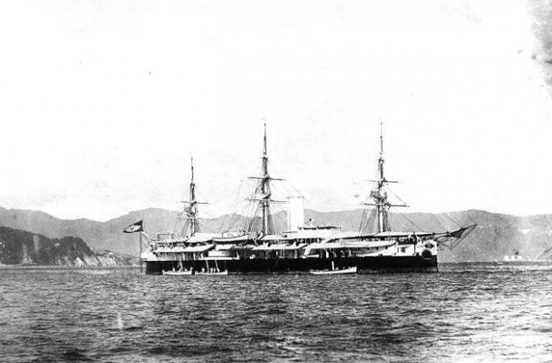

# ThLuiz Integration

Tumblr usado para integrar meus serviços

Search Posts

[Mozart no campo de futebol](http://thluiz-integration.tumblr.com/post/44541888323/mozart-no-campo-de-futebol "Mozart no campo de futebol")

[shared via Google Reader from [Papo de Homem - Lifestyle Magazine](http://t.umblr.com/redirect?z=http%3A%2F%2Fbit.ly%2F10MERMU&t=MWZmYWIyNTQwMjY4MjgwZDlhZTUxZTczNWM1MDkwNWY2YjhhYzUzNSxRV3BOOEpoQg%3D%3D&b=t%3AuvMV4RFEQxzEx2cgKvE_zQ&p=http%3A%2F%2Fthluiz-integration.tumblr.com%2Fpost%2F44541888323%2Fmozart-no-campo-de-futebol&m=1)]

Se você é um ouriço, a última coisa que pode fazer é se comprometer a não usar seus espinhos.

### Guerra naval na Baía da Guanabara

Em setembro de 1893, a Marinha Brasileira em peso se rebelou contra o governo e ameaçou bombardear a capital federal se o presidente Floriano Peixoto não renunciasse. Ele se recusou e as fortalezas passaram o mês seguinte atirando contra os navios e os navios, contra as fortalezas.

Depois de um mês, os comandantes dos navios estrangeiros ancorados na baía conseguiram um acordo entre as partes, no qual a Marinha se comprometia a não atirar contra a cidade e o governo se comprometia a não atirar contra os navios rebeldes.

Os líderes da revolta, almirantes Custódio de Mello e Saldanha da Gama, são até hoje revenciados como heróis da Marinha, mas é difícil de entender o por quê: ao aceitar esse pacto, eles passaram atestado de não entender nada de guerra.

O tempo estava a favor do governo em terra, que foi se fortalecendo e costurando alianças. Já a Armada rebelada no mar abrira mão de sua única arma, de sua única ameaça crível, e basicamente se condenara à ociosidade, à inutilidade e à derrota.

O Encouraçado Aquidabã, um dos mais poderosos navios de guerra do Brasil, rebelado.

Finalmente, quando o governo se sentiu forte o bastante, desfez o pacto unilateralmente e ainda teve a gentileza de avisar quando começaria operações de guerra contra os navios rebeldes.

Sem outro remédio, os estrangeiros saíram da frente e os revoltosos ou se renderam ou saíram corridos da Baía de Guanabara, encerrando assim a chamada Revolta da Armada. Floriano cumpriu seu mandato até o fim.

Como [escreveu Joaquim Nabuco](http://t.umblr.com/redirect?z=http%3A%2F%2Fbit.ly%2F10MEUbx&t=N2YwZjBlYTUxYzI1ZmM1YjcyYTlhNWE0ZjJiN2YzNTI0OWYwYWNhNixRV3BOOEpoQg%3D%3D&b=t%3AuvMV4RFEQxzEx2cgKvE_zQ&p=http%3A%2F%2Fthluiz-integration.tumblr.com%2Fpost%2F44541888323%2Fmozart-no-campo-de-futebol&m=1 "Joaquim Nabuco sobre a Revolta da Armada") no livro que dedicou ao episódio,

> “quem não quer empregar os meios de guerra não faz a guerra”.

Nabuco era favorável à revolta, eu não, mas nenhum de nós dois acha que os navios deveriam ter atirado contra a capital. Entretanto, se os líderes rebeldes não estavam dispostos a isso teria sido mais humanitário nem mesmo começar a revolta.

*(A explicação é simples: dois anos antes, em 1891, o almirante Custódio de Mello fez exatamente a mesma coisa e conseguiu que o então presidente Marechal Deodoro, já velho, cansado e de saco cheio, renunciasse no mesmo dia. O erro de cálculo foi considerar que Floriano Peixoto fosse fazer o mesmo. A revolta se viu na insustentável posição de não ter estômago para cumprir as próprias ameaças. Por isso, como todos que já se colocaram nessa mesma sinuca, perdeu.)*

Resoluto, Floriano Peixoto se recusou a deixar o poder!

### Neymar na Orquestra Sinfônica

E aí você pergunta, amigo leitor:

> “E daí? Qual é a relevância disso pra mim?”

É simples. A revolta foi derrotada porque se comprometeu a não usar a sua única arma.

E, todo dia, observo várias pessoas, amigos, colegas de trabalho, familiares, dando com os burros n’água pelo mesmo motivo.

Vejo o inteligente tentando competir com o lindo na beleza, vejo o lindo tentando competir com o inteligente na cultura.

Vejo o Neymar desafiando o Federer para uma partida de tênis, vejo o Cesar Cielo desafiando o Usain Bolt pra uma corrida. Nunca dá certo.

A vitória tem várias chaves. Uma delas é não desistir. A outra é escolher suas batalhas e escolher suas armas.

O mundo está cheio de Mozarts que ninguém ouviu falar porque ao invés de estudar piano estavam dando murro em ponta de faca na quadra de futebol.

“Luiz, seguinte, talvez o futebol não seja a sua praia. Já pensou em se dedicar a outra carreira? Política, quem sabe?”

  
  

