# Optimize Your Site for Conversions: 7 Strategies That Work

[View all articles](https://www.toptal.com/designers/blog)

You know what they say about first impressions: you only get one. The landing page is your first impression; you want to make a good impression, and get them to sign up.

While getting people to visit your site is important, what you ultimately want is a conversion, or in other words, visitors who are interested enough in your unique proposition that they want to stay updated, share with their friends, and become customers.

You have on average [eight seconds](http://www.statisticbrain.com/attention-span-statistics/) or less to convince visitors to share one of the digital era’s most sacred and safely-guarded commodities – their contact information.

The approach you take with designing your signup experience will vary based on many factors. Consider your specific industry and market vertical, your target audience, and the required information you need to capture in the transaction. The following are some innovative and successful strategies to improve your conversion rates.

## 1. Make your case.

### Sell a better life.

You’ve gotten someone to visit your website. First, you need to explain how your unique product or service benefit them. The first few lines of your pitch should strike an emotional, human chord that solves the user’s problem.

Rather than talking about the size of their customer base or how many contractors they have, [Alfred](https://www.google.com/url?q=https://www.helloalfred.com/&sa=D&ust=1484936947568000&usg=AFQjCNERIy3bJbOT48daDceXJOmIOcJkww) tells its visitors how their lives will be better with Alfred.

In just a few words, Alfred tells visitors that with their service, they get their free time back. What a proposition! The right language inspires your prospects to envision how your offering fits into or improves their lives, which is a great sell.

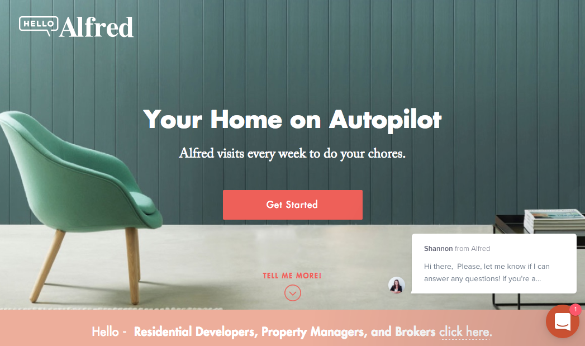

Investment startup [Betterment](https://www.google.com/url?q=https://www.betterment.com/&sa=D&ust=1484936947571000&usg=AFQjCNHdIFMA8h54FoCP1ozWBwPo1SAkEw) also has a landing page that presents a convincing case to prospects. Harmonious colors, compelling copy, a clear call-to-action (CTA), and a row of benefits so the user immediately understands what they have to offer.

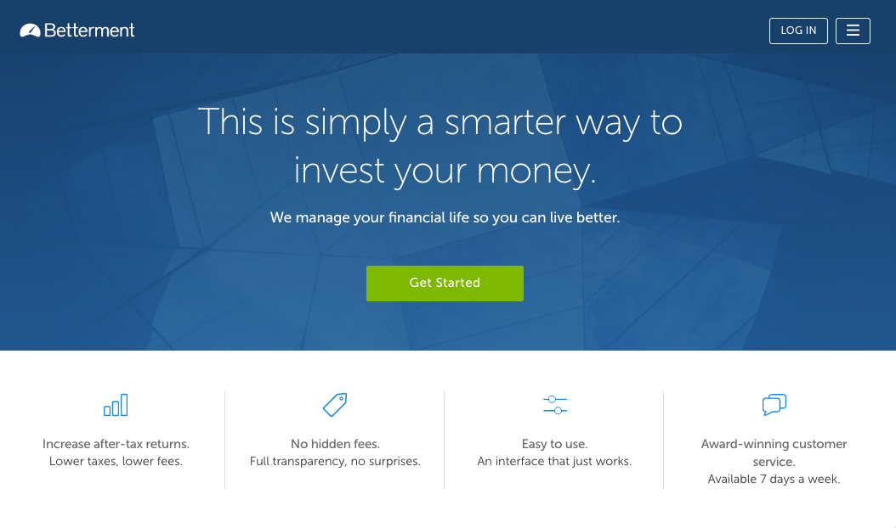

### Provide proof.

Another way to convert users is to highlight testimonials.

As Quicksprout Founder [Neil Patel](https://www.google.com/url?q=https://blog.hubspot.com/marketing/landing-page-writing-tips&sa=D&ust=1484936947575000&usg=AFQjCNEE8uJpEBtwNliLUzaby3BokRZFtA) explains, “It’s impossible to write copy as good as your customer. Why? Because good copy depends on the source, not just the style and substance. Testimonials are compelling because they show the customer what she will experience if she uses your product or service.”

Testimonials help sell the experience of what you offer, and a visitor can easily internalize this expectation.

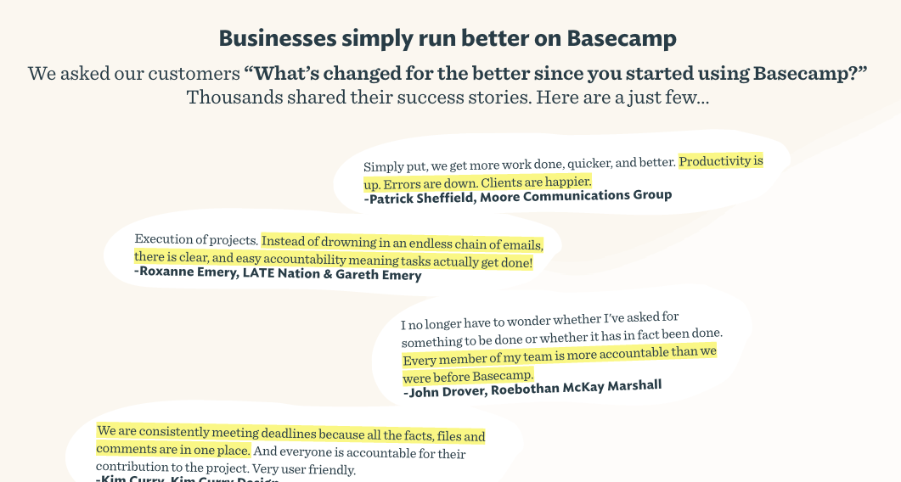

### Speak in their language.

Striking the right mood for the right audience is also vital.

It’s important to match the language (and visual design) of your pitch to the emotion you want to convey to your visitors, whether it’s a sense of trust or flirting with danger, formality or friendliness, stoic seriousness or cheek.

Tailor your message to your customers. Compare the language and imagery of these two private jet services, for instance.

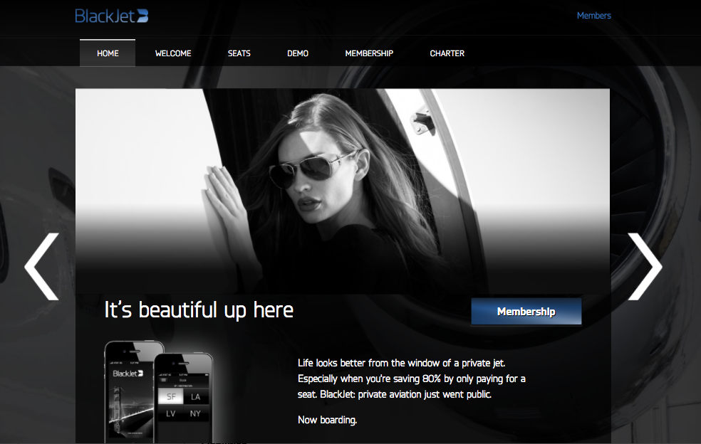

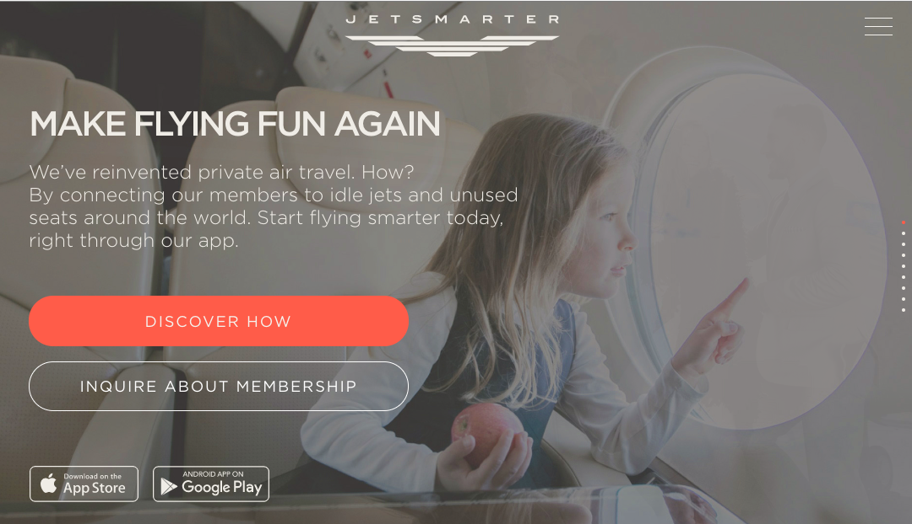

[BlackJet](https://www.google.com/url?q=https://www.blackjet.com/&sa=D&ust=1484936947584000&usg=AFQjCNGMeRT90Pu79JKre3QKsDTOSZJirw) is clearly targeting users turned on by luxury and exclusivity—feelings commonly associated with the idea of private air travel.
On the other hand, [Jetsmarter](https://www.google.com/url?q=https://jetsmarter.com/&sa=D&ust=1484936947585000&usg=AFQjCNEIhU5u0llEKt_WalyrDMKRx8sI-w) targets families, making it sound like a completely natural fit to your life.

Your offering will likely attract a core customer that fits a specific persona, so you should always be sure to speak to their specific needs and values directly.

## 2. Lead with an action.

### Invite the user to solve their problem straight away.

One successful approach to escalating commitment from your visitors is to focus on the primary action of your offering.

Ask yourself: Why is my user here, visiting my site? It’s probably not just to give you their email.

[Airbnb](https://www.google.com/url?q=https://www.airbnb.com/&sa=D&ust=1484936947592000&usg=AFQjCNHVXPI4qgDWaKrfFgQXJAvi6x-JvQ)’s landing page tells you what it’s about, not only in its pitch, but also in the first set of form fields above the fold.

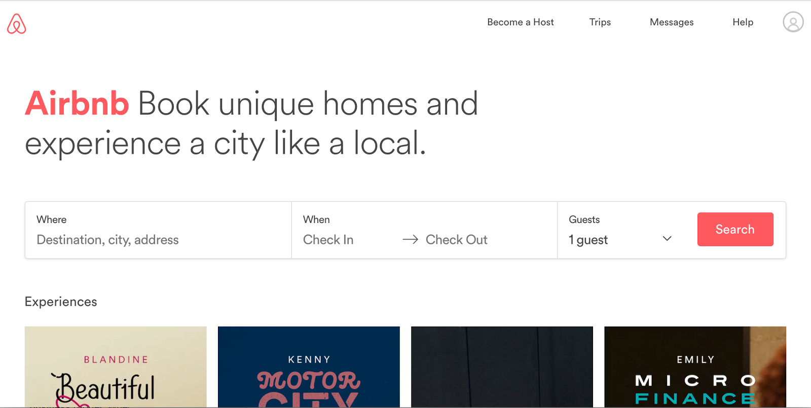

Where do you want to go and when?

By focusing on the essential offering of Airbnb’s service, users begin taking actions that escalate their commitment.

Once they’ve started planning their trip and exploring their options, they have invested time and emotion. Only after the user decides to book or “like” a listing does Airbnb ask them to signup for an account.

This simultaneously helps them complete their desired action (in the case that they are committed to book) and/or stimulates the desire to “save their work” (if they were just browsing or exploring their options).

[TaskRabbit](https://www.google.com/url?q=https://www.taskrabbit.com/&sa=D&ust=1484936947599000&usg=AFQjCNHodGxD8N0eE9zDhLJjB-SNwXL4fA) does the same thing.

Rather than their primary CTA be “Sign Up,” they get to the heart of what the user wants.

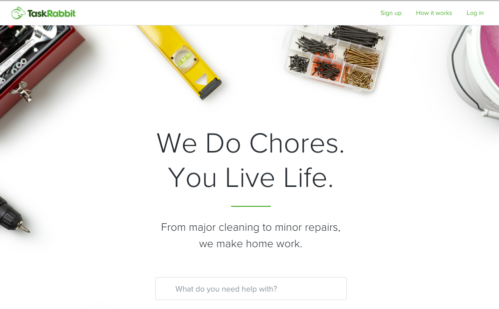

They strike an emotional chord with their messaging combined with the search field that asks users what they need help with. Just reading that question inspires the user to consider what they’d love to have help with doing, and invites them to explore by stating their specific need.

## 3. Make them an offer they can’t refuse.

### Offer a discount.

Sure, your offering is great and will be a boon to your customers. The problem is a million other companies are already vying for your customer’s attention daily.

So if you want people to give you their email address, you may have to make it worth their while.

Many companies offer first-time shoppers an enticing deal just for handing over their email address.

Often, this means offering a discount, free shipping, a free trial, or any other compelling incentive. Offering something in return is not only friendly, but it incentivizes signup.

Take [Brooklinen](https://www.google.com/url?q=https://www.brooklinen.com/&sa=D&ust=1484936947607000&usg=AFQjCNErHKf7Nz7PcinLLFnFatba5hMmbQ), for example. It offers its visitors free shipping on their first sheet purchase.

To continue to the site without signing up, the user must actively choose a button that says “No, I want to pay for shipping.” And who wants to pay for shipping? At this point, the site makes you think you are foolish to decline their offer.

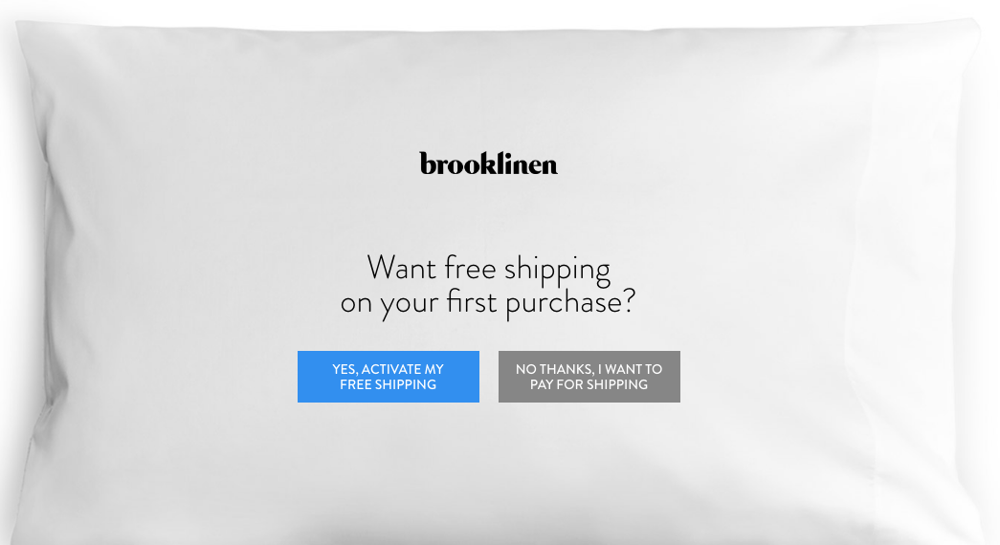

Like what you're reading?

Get the latest updates first.

No spam. Just great design posts.

Like what you're reading?

Get the latest updates first.

Thank you for subscribing!

You can edit your subscription preferences [here](https://www.toptal.com/designers/web/optimize-your-site-for-conversions-7-strategies-that-work#).

- 40shares

### Educate users.

Another way to collect email addresses is to offer a free piece of content in exchange for an email address.

[UXPin](https://www.google.com/url?q=https://www.uxpin.com/&sa=D&ust=1484936947611000&usg=AFQjCNEsLOepZtHZnClvW-tKFKt6UHVSww) is known for its informative ebooks on a variety of topics.

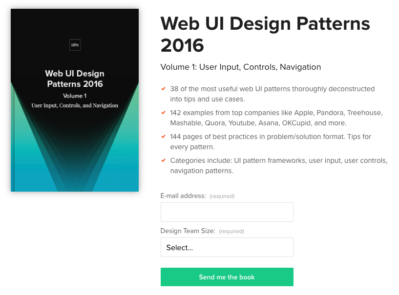

The site gives them away in exchange for your email address and a few key nuggets of information. Visitors want the valuable information so they don’t mind providing their email address to get it.

Now, UXPin can send emails to the new subscriber whenever they want.

## 4. Reduce friction.

### Keep forms simple.

There are many details that can make or break your signup form.

Friction is anything that creates confusion, requires cognitive work on the part of the user, or encourages errors. The best forms contain helpful messages and clear labels, and they make it easy for the user to digest.

Help your user know when they’ve made a formatting error with inline validation.

Unless you’re a bank, avoid asking the user to create complex, hard-to-recall passwords that must contain at least 10 characters, contain both upper and lower case letters and a number, not begin with a number, and contain at least one special character.

Decide whether or not it’s really necessary for the user to confirm their email and password, or if you can simply give them the option to show a masked password.

[Instapaper](https://www.google.com/url?q=https://www.instapaper.com/&sa=D&ust=1484936947621000&usg=AFQjCNEC9tyy8E1L0DS-e-mCYrmpHYKRPw)’s sign up form is minimal and clean, but doesn’t remind me why I want to create an account. The form also lacks any inline validation, so I must submit the form before finding out I didn’t enter a valid email address. This kind of friction may seem trivial, but it can cost you signups.

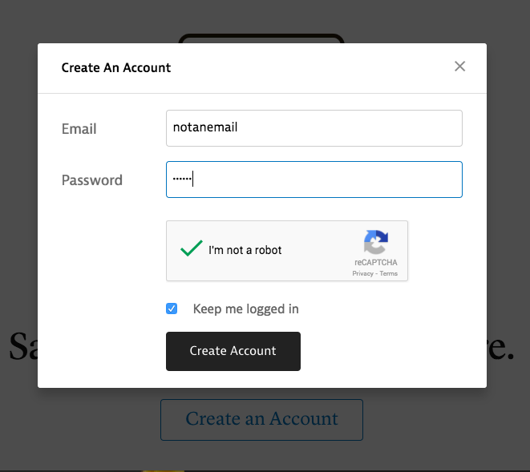

On the other hand, [Pocket](https://www.google.com/url?q=https://getpocket.com/&sa=D&ust=1484936947623000&usg=AFQjCNHWxwcMQxdS7JNDq0RlO6gvhCXmcA)’s signup form is warm and inviting and keeps the value proposition visible. The visitor knows the benefits of having an account, and the forms are clear. Inline validation lets the user know if they have made a mistake before submitting the form, which reduces friction.

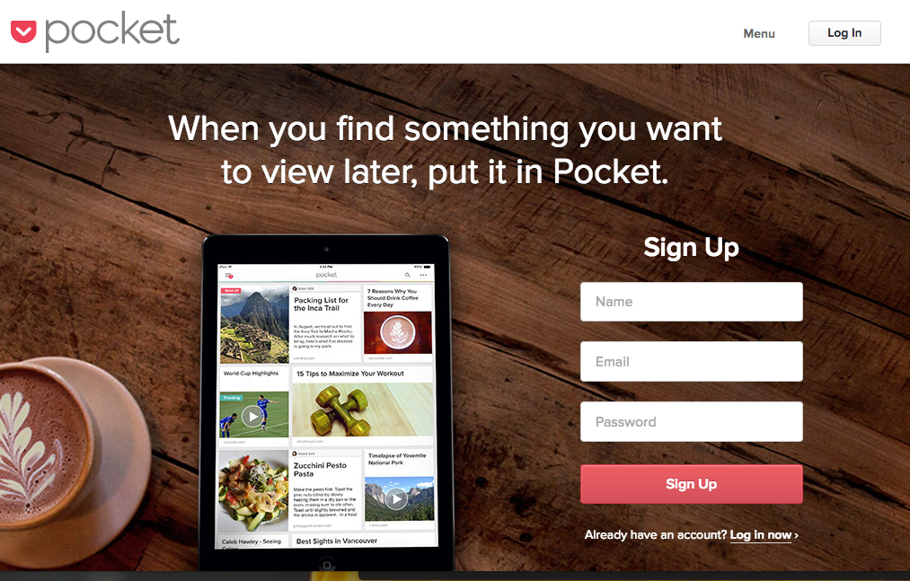

## 5. Remember: Mobile first.

You’ve heard it a million times: mobile first.

More users accessed the web on mobile devices than on desktops in [October 2016](https://www.google.com/url?q=http://gs.statcounter.com/press/mobile-and-tablet-internet-usage-exceeds-desktop-for-first-time-worldwide&sa=D&ust=1484936947628000&usg=AFQjCNHl_ZtZFYNZVHiesQo69F2TwWzUuA).

And we already know that Google search results favor mobile-friendly websites, which means that it’s likely that first-time visitors are viewing your website on their phones. If your page and sign up form are not properly formatted for mobile, you will likely lose that conversion.

It seems obvious, but even in 2017, you’ll still find websites that aren’t very mobile-friendly.

Sometimes a website will be formatted to display on a mobile device, but the sign up forms still fall short. Other times, the fields and buttons are too tiny, or the designer has chosen input methods that are cumbersome for mobile web users.

If you’re frustrating your visitor with tiny, untappable form fields and buttons that rely on the user to pinch, zoom, and slide their viewport all over to see each field, then you’re losing more prospects than you think.

There is no excuse for a large bank, like [HSBC](https://www.google.com/url?q=https://www.us.hsbc.com/&sa=D&ust=1484936947633000&usg=AFQjCNFU4Tozz5o1bFphREYNwzfg3arCIw), to look like this on mobile.

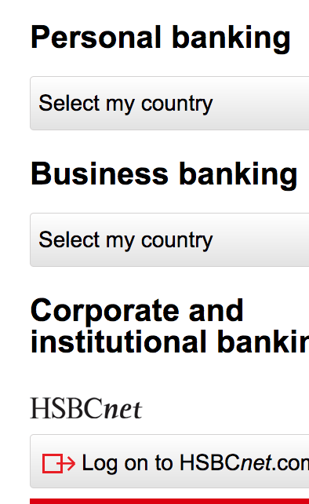

The fields aren’t responsive, and text and images are cut off. The user must pinch, zoom, and drag to see the entire page. It’s a disaster.

Stack large, highly tappable form fields vertically, and make buttons large and thumb-friendly.

Magazine subscription startup [Texture](https://www.google.com/url?q=https://www.texture.com/&sa=D&ust=1484936947637000&usg=AFQjCNGpQTZ5c42CFXwc0RQMCIkzGNo8zQ)’s signup form looks and feels great on mobile.

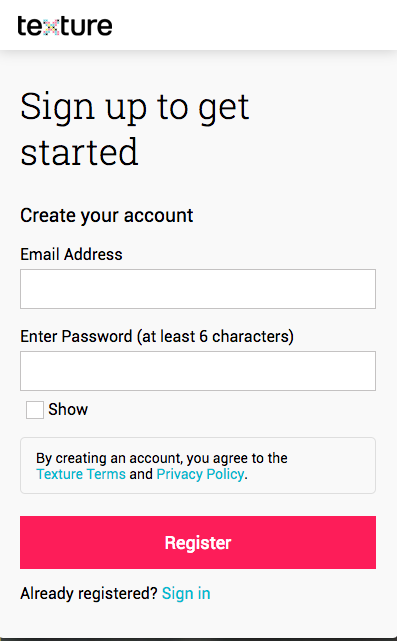

There is minimal noise, and the clearly-labeled fields are large and tappable. Buttons are clear and full-width The password field gives the user the option to show their password, which is great for mobile devices where typos and mis-fires are a fact of life.

## 6. Avoid TMI.

### Ask the bare minimum.

How much information do you need from your visitor to get started?

Of course you want to know everything about them, but imagine if you were sharing an elevator with a stranger, who suddenly asked for your name (first and last), your email (twice), gender, birthdate (and age), phone number (with extension), and home zip code.

You would likely get off on the first floor possible or even press the emergency button. Why are they asking so many personal questions?

If your first impression feels like an interrogation, you’re likely scaring off potential conversions faster than you realize. Even if you mark some fields as optional, you’re probably asking too much information and giving your visitors the impression you don’t respect their privacy.

[Macy](https://www.google.com/url?q=http://www1.macys.com/&sa=D&ust=1484937341011000&usg=AFQjCNFfDEs4_Y05XHF1jqUHV6gc70JdOA)’s for example asks a ton of questions just to sign up.

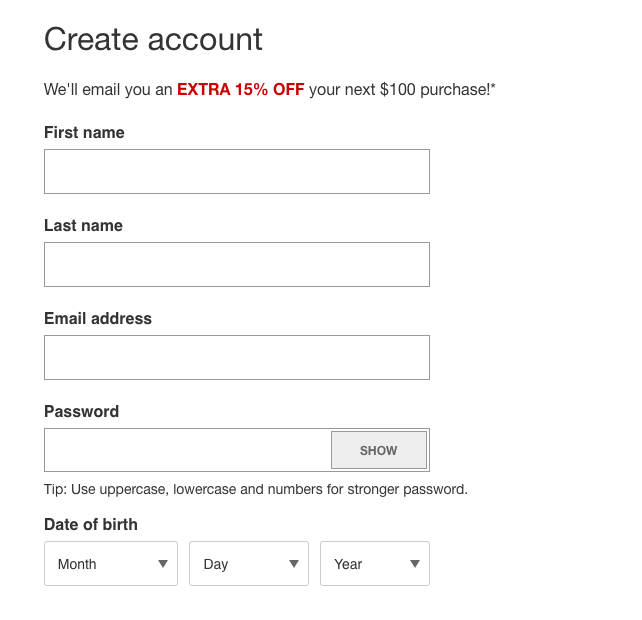

Why do they need to know my birthdate? They probably want to know my age so they can segment me by demographic, but as a visitor, I know that’s why they’re asking me that, and I’m likely to abandon the form. This is easily something they could ask me later in my preferences.

And while I love [TaskRabbit](https://www.google.com/url?q=https://www.taskrabbit.com/&sa=D&ust=1484937341013000&usg=AFQjCNFp58zQy8ASLdh1m6GdTP47IS5Q-w)’s landing page, their signup form is a bit much.

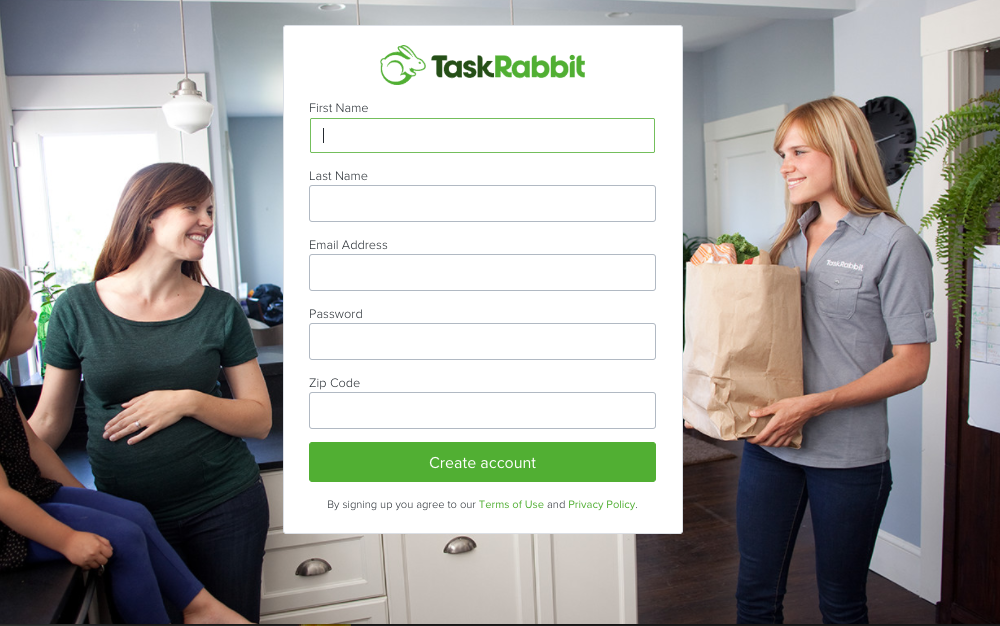

Why do you need my first and last name if I am just signing up for your service? Zipcode makes sense, since service providers are local. I would ask for just an email, password, and zipcode. The rest of the information can be requested during the onboarding process.

[Blue Apron](https://www.google.com/url?q=https://www.blueapron.com/&sa=D&ust=1484937341015000&usg=AFQjCNFAWfqOzpq0oGYJUaBMLEJI6boBNQ)’s meal kit service, however, just asks for the user to create an account with an email address and password.

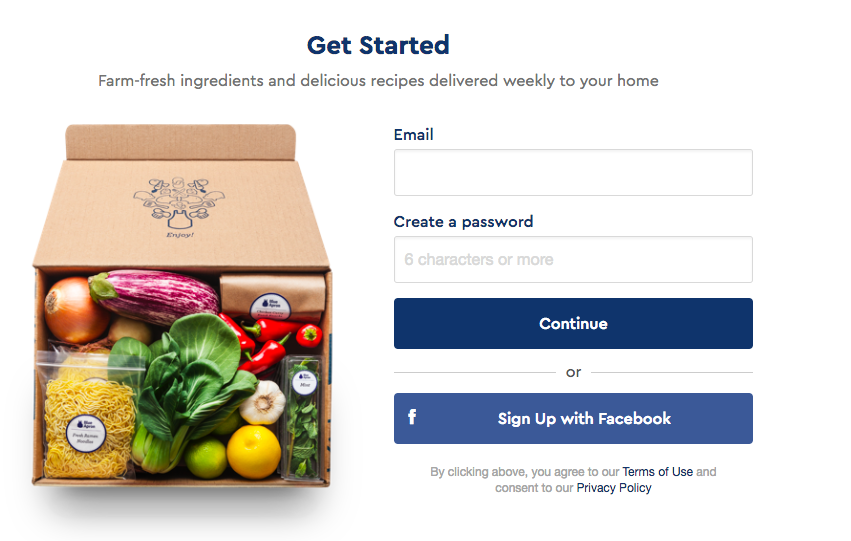

They don’t ask for a name or even a zipcode (even though the service is not available everywhere) at this stage, which means the user is much less likely to abandon the form.

Regardless of whether or not the user makes a purchase, their email can be used for marketing and promotions to encourage them to buy later.

Remember, these days, digital advertisers are tracking every social media post, Google search, and page visit, targeting users in ways that seem increasingly sinister.

Digital privacy is a big concern in modern society, and trust is not easily won.

When you ask for a lot of personal information up front, you are signaling to the user that you are going to use that information for something, and your form fields give the user hints as to what that might be.

If you just want to email the visitor about your offering, you just need their email address, because you never know when that [one extra field could cost you $12 million](https://www.google.com/url?q=http://uxmovement.com/resources/the-12-million-optional-form-field/&sa=D&ust=1484937341021000&usg=AFQjCNEYsvGr20ur5tvyYXe_LLV1JVj2mQ).

## 7. Start a conversation.

Welcome to the future, where the traditional GUI, full of buttons and menus, is gradually disappearing behind one of the most intuitive and natural interaction patterns – conversation.

The popularity of virtual assistants (VAs), chatbots, and conversational UIs is exploding.

You can order books on Amazon with Alexa; get a weather update from Poncho; or basically do anything with integrated apps like WeChat. So why not initiate a conversation with a new visitor to your site, and find out how to meet their needs?

Email client startup, [Hop](https://www.google.com/url?q=https://gethop.com/&sa=D&ust=1484937341024000&usg=AFQjCNHE-wSO9Y8VVaPwrIG4mfLy9ECc9w), redesigned its homepage this month to feature a chat-based signup process.

An email app is obviously perfect for conversational sign up and worth a look.

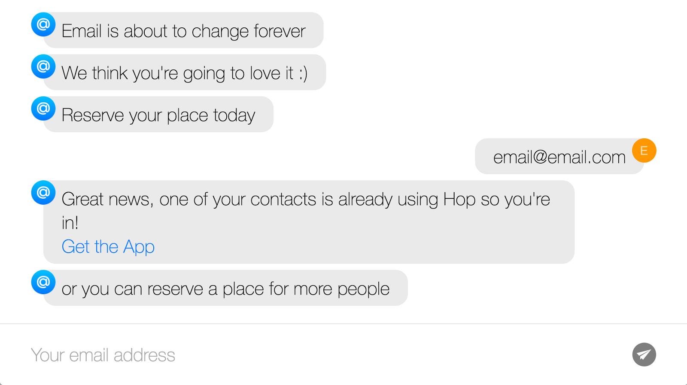

The interface makes a quick pitch addressing the visitor and then asks them for their email address to sign up for their waitlist for an invitation (if you are on an existing user’s list of contacts, you may get an invitation immediately).

It’s worth noting that the app’s onboarding process is also a conversation that asks for the user’s preferences.

Start with a simple “Hello,” and perhaps ask users what brought them to your site or explain how you can get them set up with your service.

In a conversation, you can gradually build a visitor profile, which could help you customize their experience, and tailor the type of communication (newsletters, push notifications, etc.) you will be sending them moving forward.

At some point, you’ll want to capture their email or some other way to continue to conversation. Like greeting a customer in a store, you can collect pertinent data and exchange information by just talking.

Conversational UIs feel fun, friendly, and helpful (if done right), and might work well for companies hoping to foster a connection with their potential clients. This strategy might make sense for service industries, like hotels and insurance providers.

By asking a series of questions, the AI can tailor its responses, to point the user in the right direction, or learn more about what services the company can provide.

It’s also a great way to onboard users, which Slack’s Slackbot does beautifully by guiding the user through common interactions and commands.

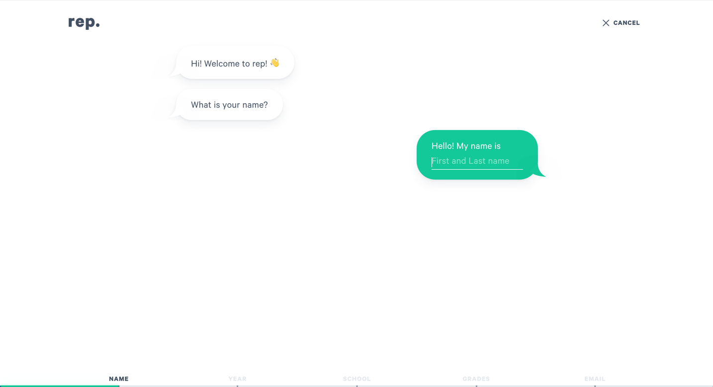

Conversational UIs can also create an experience of delight by inserting personality in casual exchanges, such as getting the weather from Poncho.

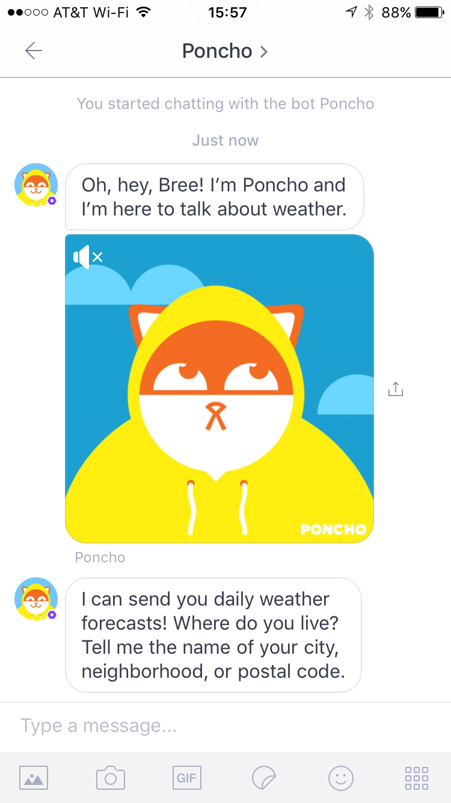

Of course, this strategy might set certain expectations for your first time visitor that might be difficult to meet.

Always keep in mind that your visitor is a human being who has the potential to ask questions that run outside of your pre-programmed list of responses, or frame them in syntax that the chatbot doesn’t immediately recognize.

Even very sophisticated machines still think like machines. If poorly executed, a chatbot can feel cold and in worst cases, the user can walk away feeling uncomfortable. Sometimes even a sophisticated chatbot can pick up [some really bad behavior](https://www.google.com/url?q=http://gizmodo.com/here-are-the-microsoft-twitter-bot-s-craziest-racist-ra-1766820160&sa=D&ust=1484937341037000&usg=AFQjCNHVXAdaQ8AyXe5tZ-vyONSvkdGKpw).

It’s also possible to achieve a conversational feel without going the chatbot route.

[Betterment](https://www.google.com/url?q=https://www.betterment.com/&sa=D&ust=1484937341040000&usg=AFQjCNEw99ijN-Ko8kPncosETkTSi1g7qw) uses a natural language form that plays out a bit like an ad-lib.

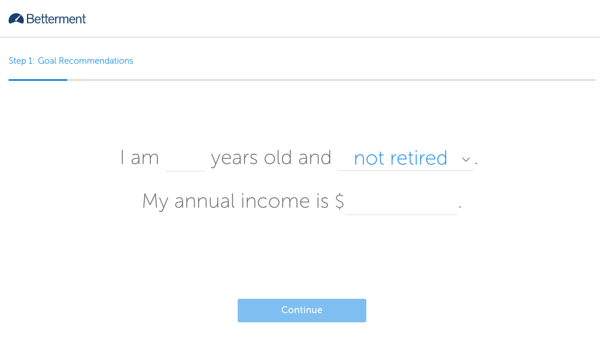

The user enters their information, and it feels a bit more natural than filling out a conventional set of form fields with dropdowns and such.

As Matt West writes in his piece [The Future of Web Forms](https://www.google.com/url?q=https://blog.prototypr.io/the-future-of-web-forms-4578485e1461%23.lsadyyaqi&sa=D&ust=1484937341043000&usg=AFQjCNEEyKgjuX2eYjcxsZ35ilBVL5VZrg):

“Consider the implications for accessibility, privacy, multi-language support, emotional and compassionate design. These are all challenges we need to overcome if we’re going to introduce a new era of more meaningful interactions with technology.” West cites some great examples of conversational forms that demonstrate the potentials and challenges of this type of data collection.”

While not right for every industry, conversational forms have the potential to engage visitors on a more human level, and the startups that take the leap, and do it right will be [true trailblazers](https://www.toptal.com/designers/web).

## And that’s how you convert users.

You have just a few seconds to get a new visitor to sign up for your product or service.

Think strategically about how and when to ask your users to sign up, as well as what information you want them to provide at what stage.

You can engage them in your core product through exploration to escalate their commitment.
Just focus solely on getting their email address first. And make your site and sign up forms a pleasure to visit regardless of device.

There are millions of sites out there vying for users’ attention and engagement. By making the sign up process frictionless and pleasant, you are meeting your user halfway and are more likely to get them to convert.

## About the author

[

View full profile »](https://www.toptal.com/designers/resume/bree-rubin)

[Hire the Author](https://www.toptal.com/companies/apply?interested_in=designers)

[Bree Chapin, United States](https://www.toptal.com/designers/resume/bree-rubin)

Bree is a multi-skilled soup-to-nuts designer with 10+ years of interaction design and five years with a strong focus on UX and product development for web and mobile. She's had the great fortune to work on projects across a wide range of domains and on teams of all sizes, from developing IoT startup MVPs to designing features on long-established finance industry tools. [[click to continue...]](https://www.toptal.com/designers/resume/bree-rubin)

[Hiring? Meet the Top 10 Freelance Web Designers for Hire in January 2017](https://www.toptal.com/designers/web)
