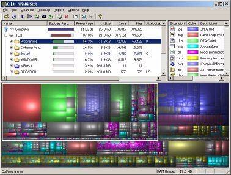

# WinDirStat

WinDirStat is a disk usage statistics viewer and cleanup tool for various versions of **Microsoft Windows**.  
***Note:*** if you are looking for an alternative for **Linux**, you are looking for [KDirStat](http://kdirstat.sourceforge.net/) (apt-get install kdirstat or apt-get install k4dirstat on Debian-derivatives) or [QDirStat](https://github.com/shundhammer/qdirstat) and for **MacOS X** it would be [Disk Inventory X](http://www.derlien.com/) or [GrandPerspective](http://grandperspectiv.sourceforge.net/).

Please visit the [WinDirStat blog](https://blog.windirstat.net/) for more up-to-date information about the program.

On start up, it reads the whole directory tree once and then presents it in three useful views:

- The directory list, which resembles the tree view of the Windows Explorer but is sorted by file/subtree size,
- The treemap, which shows the whole contents of the directory tree straight away,
- The extension list, which serves as a legend and shows statistics about the file types.

The treemap represents each file as a colored rectangle, the area of which is proportional to the file's size. The rectangles are arranged in such a way, that directories again make up rectangles, which contain all their files and subdirectories. So their area is proportional to the size of the subtrees. The color of a rectangle indicates the type of the file, as shown in the extension list. The cushion shading additionally brings out the directory structure.
