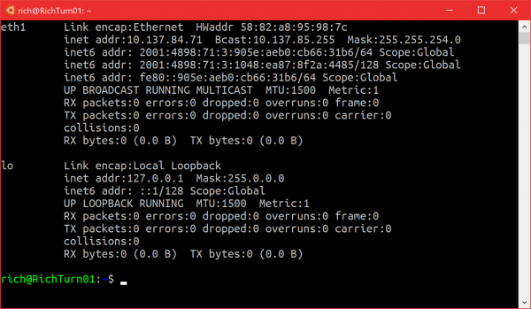
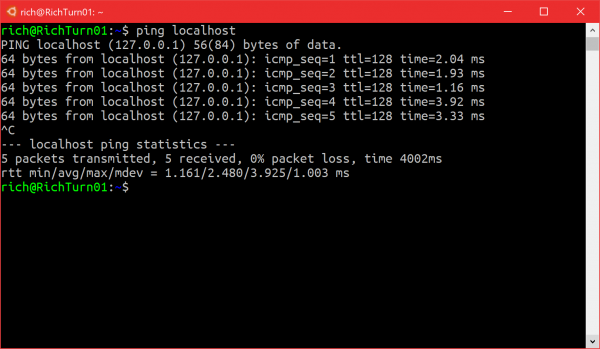
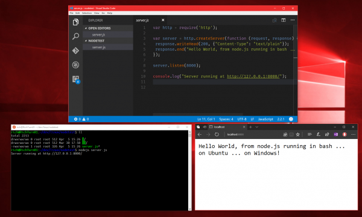
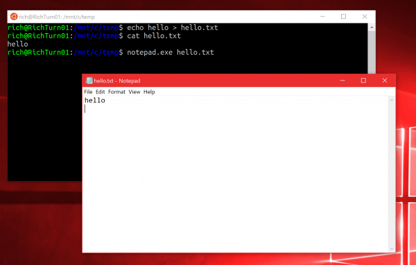
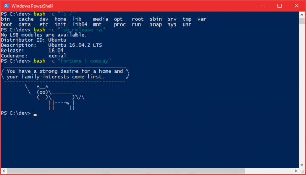
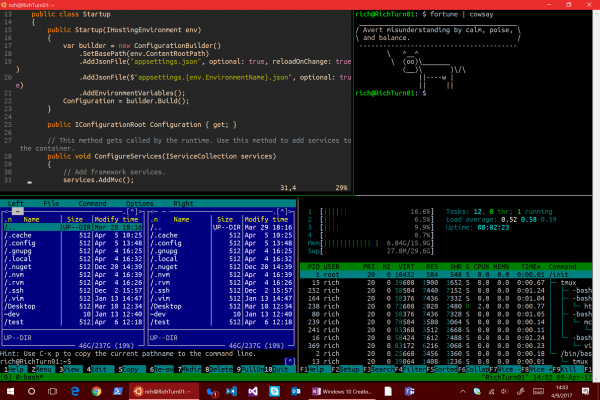
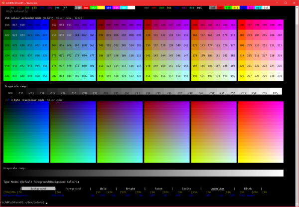
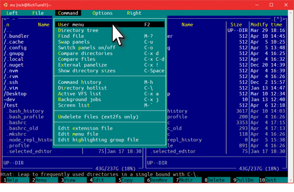

# This release was built by and for YOU!

On behalf of the WSL & Console engineering teams, a very sincere and grateful **THANK YOU** to all of you who’ve tried and used Bash/WSL over the last 12+ months, and especially to all of you who filed issues on our [GitHub issues repo](https://github.com/microsoft/bashonwindows), contacted [me on Twitter](https://twitter.com/richturn_ms), submitted/voted for asks on [our UserVoice](https://wpdev.uservoice.com/forums/266908-command-prompt), asked questions on [StackOverflow](http://stackoverflow.com/questions/tagged/wsl), [AskUbuntu](http://askubuntu.com/questions/tagged/wsl), [Reddit](https://www.reddit.com/r/bashonubuntuonwindows/), our [Command-Line Blog](https://blogs.msdn.microsoft.com/commandline/), the [WSL Team Blog](https://blogs.msdn.microsoft.com/wsl/) and elsewhere.

The massively improved Bash/WSL & Windows Console that we’re shipping in Windows 10 Creators Update is due largely to all of you!

# What’s New in WSL?

During the Windows 10 Creators Update (CU) development cycle, the WSL engineering team implemented hundreds of fixes and improvements, most of which were catalogued in the [WSL release notes](https://msdn.microsoft.com/en-us/commandline/wsl/release_notes). While we highlighted some of the more visible features of Console & WSL in our [Command-Line Blog](https://blogs.msdn.microsoft.com/commandline/), we thought a consolidated list of the most important features and improvements would be useful.

So, read on to find out, what’s new in Bash/WSL & Console in Windows 10 Creators Update:

## More compatibility

A key goal for Win10 CU was to dramatically improve WSL’s depth and breadth of compatibility with the [Linux System Call Interface (SCI)](https://en.wikipedia.org/wiki/Linux_kernel_interfaces). By expanding and improving our syscall implementations, we increase the tools, platforms, runtimes, etc. that our users need to run.

The result? In Win10 CU, most mainstream developer tools now work as expected, including:

- **Core tools:** apt, sed, grep, awk, top, tmux, ssh, scp, etc.
- **Shells:** Bash, zsh, fish, etc.
- **Dev tools:** vim, emacs, nano, git, gdb, etc.
- **Languages & platforms:** Node.js & npm, Ruby & Gems, Java & Maven, Python & Pip, C/C++, C# & .NET Core & Nuget, Go, Rust, Haskell, Elixir/Erlang, etc.
- **Systems & Services:** sshd, Apache, lighttpd, nginx, MySQL, PostgreSQL
- And many, **MANY** others!

***Note:** Some of you may also have been following along with some intrepid explorations into running X/GUI apps and desktops on WSL. While we don’t explicitly support X/GUI apps/desktops on WSL, we don’t do anything to block/prevent them from running. So if you manage to get your favorite editor, desktop, browser, etc. running, GREAT [anexo ausente] but know that we are still focusing all our efforts on delivering a really solid command-line experience, running all the command-line developer tools you need.*

## Ubuntu 16.04 support

While Win10 Anniversary Update delivered Ubuntu 14.04 support, in Win 10 Creators Update, WSL now supports Ubuntu 16.04. Any new Bash instances installed on Win10 CU will now install Ubuntu 16.04.

If you’d like to find out what version of Ubuntu you’re running, enter the following at your Bash on Ubuntu on Windows Console:

```
$ lsb_release -a
No LSB modules are available.
Distributor ID: Ubuntu
Description:    Ubuntu 16.04.2 LTS
Release:        16.04
Codename:       xenial
```

**Important Note:** Existing Ubuntu 14.04 instances are **NOT** automatically upgraded to 16.04: **You must manually upgrade your instance to Ubuntu 16.04 in one of two ways**:

1. Remove & Replace (recommended)
2. Upgrade In-Place

### Remove & replace

If you’re currently running an Ubuntu 14.04 instance, we recommend removing and replacing your existing instance with a fresh new Ubuntu 16.04 instance.

WARNING: The instructions below will delete your existing distro and any of the files you’ve stored in the Linux filesystem. Therefore, be sure to copy/move any Linux files you want to keep, for example, to a Windows folder (e.g. /mnt/c/temp/wslbackup/…) BEFORE removing and replacing your instance!

To remove and re-install your Ubuntu instance, run the following commands from a Cmd/PowerShell Console.

```
C:\> lxrun /uninstall /full /y
...
C:\> lxrun /install
```

The lxrun /install command above will then download and install a fresh new copy of Ubuntu 16.04 onto your machine.

### Upgrade In-Place

If your Ubuntu instance is particularly complex to configure, you can opt to upgrade it in-place, though this may not result in an optimal instance.

If you opt to upgrade your instance in-place, use [Ubuntu’s instructions](https://help.ubuntu.com/lts/serverguide/installing-upgrading.html) for upgrading an existing instance:

```
$ sudo do-release-upgrade
```

## Ifconfig & network connection enumeration support

One of Win10 AU’s biggest annoyances was that it lacked the ability to enumerate network connections which prevented tools like ifconfig, gulp, npm and others from running correctly.

This has been fixed in Win10 CU and you can use ifconfig to enumerate and examine the configuration of your available network adapters:

[](https://msdnshared.blob.core.windows.net/media/2017/04/1-ifconfig.png)

## Ping & ICMP network support

Another issue that users quickly bumped into in Win10 AU was the fact that non-administrators could not ping a network endpoint. This has now been fixed in Win10 CU:

[](https://msdnshared.blob.core.windows.net/media/2017/04/2-ping.png)

## File change notification support (INOTIFY)

Another much-requested improvement is the ability for a tool to register for notifications when a file is changed. This is an essential capability used frequently by web, Node.js, Ruby and Python developers, and many others.

For example, if you were working on a node.js website project, editing your source in vim, Emacs, Sublime Text, VS Code, etc., whenever you save your code, you might want your website server to reload your newly changed page source so that you can refresh your browser and see your changes reflected immediately.

Well, now you can! WSL supports [inotify](http://man7.org/linux/man-pages/man7/inotify.7.html) which allows apps to register for filesystem change notifications, which can then trigger actions, like rebuilding a project, or restarting a local web server. This works for both DrvFS and internal LXFs locations.

Importantly, this file change notification support also supports file change notifications for files in the Windows filesystem. This means that you can edit your project source stored on your Windows filesystem using a Windows GUI editor such as VSCode, Visual Studio, SublimeText, Notepad++, etc. and have node.js running in Bash/WSL serving your website locally, and picking up your changes as you save your files!

[](https://msdnshared.blob.core.windows.net/media/2017/04/3-inotify.png)

## Windows <-> Linux Interop

A key goal of building WSL was to reduce the “gaps” experienced when running Windows tools alongside Linux command-line tools and environments. When we shipped WSL in Windows 10 AU, we brought Linux and Windows alongside one another, but there was still a large “gap” – while both systems could share some of the same files, each environment was pretty isolated from one another.

Users often told us that they wanted to be able to invoke Windows applications from within Bash, and to invoke Linux applications from within Windows. So, we added this feature!

In Windows 10 Creators Update, you can now launch Windows apps & tools from within Bash …

[](https://msdnshared.blob.core.windows.net/media/2017/04/4-interop.png)

… and you can launch Linux binaries/commands/scripts from within Windows:

[](https://msdnshared.blob.core.windows.net/media/2017/04/5-interop-bash.png)

[Read our blog post on this feature](https://blogs.msdn.microsoft.com/commandline/2016/10/19/interop-between-windows-and-bash/) for more details:

## UNIX and Netlink Socket improvements

Some aspects of UNIX sockets and Netlink sockets were not supported in Anniversary Update.

In Creators Update, UNIX datagram sockets and Netlink sockets, options & properties were added to WSL, enabling various forms of IPC that allow many modern tools  to run on WSL.

For more details, review the [WSL Release Notes](https://msdn.microsoft.com/en-us/commandline/wsl/release_notes).

## TCP socket & IPv6 improvements

In Creators Update, the WSL team and Windows Core Networking teams worked together to enable WSL to support several additional IPv6 & TCP socket options & properties. This enables a broad range of tools and technologies that rely upon various network socket features, improved IPv6 support, etc.

For more details, review the [WSL Release Notes](https://msdn.microsoft.com/en-us/commandline/wsl/release_notes).

## Miscellaneous WSL Improvements

The WSL improvements listed above are just a selection of the most visible and noteworthy changes, but there are many hundreds of other WSL improvements included in Creators Update. Below are a few more, and don’t forget to dig through the [release notes](https://msdn.microsoft.com/commandline/wsl/release_notes) for more detail.

- Linux processes exposed to Windows Process enumeration infrastructure so they show up on TaskManager, etc.
- Added features to help [enable anti-malware & firewall tools to understand Linux processes](https://blogs.msdn.microsoft.com/wsl/2016/11/01/wsl-antivirus-and-firewall-compatibility/)
- Shared memory support required by PostgreSQL & other tools

# Windows Console & Command-Line Improvements:

The Windows Console is one of the most fundamental pieces of the entire Operating System and has been part of Windows for several decades. Around 2 years ago, a new Windows Console team was formed to own give the Console its biggest overhaul in more than 30 years!

One of the key drivers for the Console overhaul was the need to enable the Console to render the output of Linux command-line tools & applications running on WSL. The team are also performing some much needed surgery & modernization to the Console’s underpinnings and internals, which will allow for far more rapid and exciting feature development in the future.

So, what’s new in the Console in Win10 CU?

## Many VT Sequence Improvements

Because the Windows Console was not originally built to support \*NIX, it was unable handle the different behaviors and output formatting codes ([ANSI Escape Codes & VT sequences](https://en.wikipedia.org/wiki/ANSI_escape_code)) generated by \*NIX command-line tools & applications.

But, no longer:

In Windows 10 Anniversary Update, the Console was improved with the ability to handle most common VT Sequences, enabling it to correctly render the majority of simple text formatting. However, it lacked support for several advanced scenarios.

In Windows 10 Creators Update, Windows Console’s VT Sequence support was further improved to correctly handle several more advanced VT Sequences, enabling the Console to light-up many rich text-UI features in [vim](http://www.vim.org/), [emacs](http://www.gnu.org/software/emacs/), [Midnight Commander](http://midnight-commander.org/), [tmux](https://tmux.github.io/), [htop](http://hisham.hm/htop/), etc:

[](https://msdnshared.blob.core.windows.net/media/2017/04/6-console-tmux.png)

## 24-bit color support

Another frequent ask from the community was for the Console to support > 16 colors. Support for 256+ colors is increasingly important when working with today’s increasingly rich and sophisticated command-line tools, shells, etc.

In Win10 Creators Update, the Console has been updated to support full, glorious 24-bit color!

[](https://msdnshared.blob.core.windows.net/media/2017/04/7-console-colors.png)

For more details, read the accompanying [blog post announcing 24-bit color support](https://blogs.msdn.microsoft.com/commandline/2016/09/22/24-bit-color-in-the-windows-console/) in the Console.

## Mouse support

With the number of rich, text-based UI’s ever increasing, users wanted mouse support for tools like Midnight Commander, Htop, etc., so we added mouse support in Win10 CU.

[](https://msdnshared.blob.core.windows.net/media/2017/04/8-console-mouse.png)

*\* Author’s artistic rendition for illustrative purposes [anexo ausente]*

## Symlinks in Windows without Admin Rights

Symlinks are an important tool used comprehensively in Linux, but less so in Windows since admin rights were required to create symlinks, and the Console in which the symlinks were created had to be run elevated as admin – something users rarely do.

In Windows 10 Creators Update, the admin-rights restriction has been lifted for users who have [enabled developer mode](https://docs.microsoft.com/en-us/windows/uwp/get-started/enable-your-device-for-development), allowing symlinks to be created from an un-elevated Console.

[Read the release announcement](https://blogs.windows.com/buildingapps/2016/12/02/symlinks-windows-10) for more symlink details & examples.

# What’s Next?

So, are we done yet? Noooo! Far from it!

Both WSL and Windows Console have backlogs stuffed full of improvements, features and new capabilities that we’re eager to get working on.

In addition, while Console and WSL have been significantly improved in Creators Update, it is important to note that WSL remains a beta feature in Win10 Creators Update while we shave-off some rough edges and improve some core features and capabilities.

We continue to forge ahead with many planned improvements and exciting new features. Stay tuned for lots more exciting features coming in future releases of Windows 10: If you want to be among the first to access and experience improvements planned for the next Windows 10 release, be sure to [sign up to the Windows Insider program](https://insider.windows.com/) and set your Windows Insider Update Ring to “Fast”!

And, as always, **PLEASE KEEP YOUR FEEDBACK COMING**: Let us know if you find issues when using WSL on the [WSL GitHub issues repo](https://github.com/microsoft/bashonwindows), feel free to [ask questions on Twitter](https://twitter.com/richturn_ms), [suggest new features on UserVoice](https://wpdev.uservoice.com/forums/266908-command-prompt), carry on all the great discussions on [Reddit](http://reddit.com/r/bashonubuntuonwindows/), [StackOverflow](http://stackoverflow.com/questions/tagged/wsl), [SuperUser](https://superuser.com/questions/tagged/windows-linux-subsystem), etc, and keep the comments coming on this [Command-Line Blog](https://blogs.msdn.microsoft.com/commandline/), and the [WSL Team Blog](https://blogs.msdn.microsoft.com/wsl/).

Onwards! [anexo ausente]
