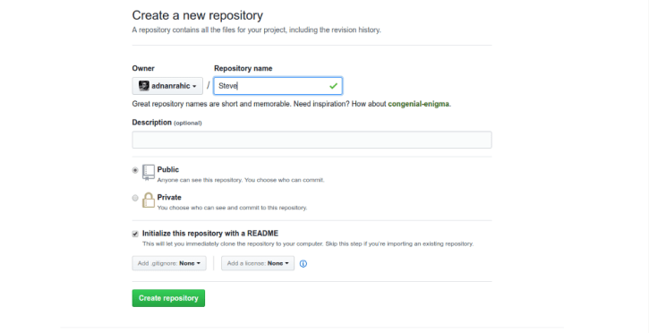
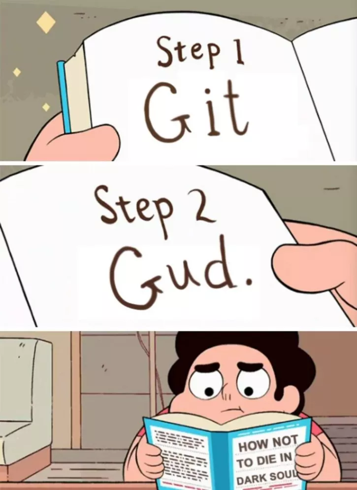

# How to master the art of Git

*This article was first published on Medium. You can take a look at it [here](https://hackernoon.com/how-to-master-the-art-of-git-68e1050f3147).*

Have you ever wondered how one learns to use Git well? You use Git very poorly for a long time. Eventually, you’ll get the hang of it. That’s why I’m here. I’ll take you on a journey to enlightenment. These are my basic guidelines of how to speed up the process of learning Git significantly. I’ll cover what Git actually is and the 7 Git commands I use the most. This article is mainly aimed towards aspiring developers and college freshmen who are in need of an introductory explanation of what Git is and how to master the basics.

---

**TLDR;**

You can go ahead and read the whole article or hurt my feelings significantly by only reading the TLDR;

When in the process of learning Git, make a habit of following these steps:  
1. `git status` all the time!  
2. Try only to change files you really want to change.  
3. `git add -A` is your friend.  
4. Feel free to `git commit -m "meaningful messages"` .  
5. Always `git pull` before doing any pushing,   
but after you have committed any changes.  
6. Finally, `git push` the committed changes.

---

**Do not go gentle into that good night.**  
The universal first step for any developer is to choose a common place to host his or her code base. Voilá, GitHub! The meeting place for all things regarding code. To be able to understand the concept of GitHub you would first need to understand what Git really is.

Git is a version control software, based on the command line, with a few desktop apps available for Windows and Mac. Created by Linus Torvalds, the father of Linux and one of the most influential people in computer science, ever. Channeling this merit, Git has become a standard for a vast majority of software developers regarding sharing and maintaining code. Those were a bunch of large words. Let’s break it down. Version control software, means exactly what it says. Git allows you to have a preview of all the versions of your code you have ever written. Literally, ever! Every code base a developer has, will be stored in its respective repository, which can be named anything from pineapple to express. In the process of developing the code within this repository you will make countless changes, up until the first official release. Here lies the core reason why version control software is so important. It enables you, the developer, to have a clear view of all changes, revisions and improvements ever done to the code base. In turn making it much easier to collaborate, download code to make edits, and upload changes to the repository. However, in spite of all this awesomeness, one thing takes the crown as the most incredible. You can download and use the files even thought you have nothing to do with the development process!

Let’s get back to the GitHub part of the story. It’s just a hub for all repositories, where they can be stored and viewed online. A central meeting point for like minded individuals.

**Let’s start using it already!**  
Okay, remember, Git is a software, and like any other software you’ll first need to install it:  
[Download and install Git](https://git-scm.com/book/en/v2/Getting-Started-Installing-Git)

***Anchorman Voice***  
Please click on the link above, and follow the instructions stated…  
Done installing it, great. Now you will need to punch in github.com in your browsers address bar. Create an account if you don’t already have one, and you’re set to rock’n’roll! Jump in and create a new repository, name it Steve for no reason at all, just for the fun of having a repository named Steve. Go ahead and check the Initialize this repository with a README checkbox and click the create button. You now have a new repository called Steve. Be proud of yourself, I sure am.



**Starting to use Git for real this time.**  
Now comes the fun part. You’re ready to clone Steve to your local machine. View this process as simply copying the repository from GitHub to your computer. By clicking the clone or download button you will see a URL which will look something like this:

```
https://github.com/yourGithubAccountName/Steve.git
```

Copy this URL and open up a command prompt. Now write and run this command:

```
gitclonehttps://github.com/yourGithubAccountName/Steve.git
```

Abrakadabra! Steve has automagically been cloned to your computer. Looking in the directory where you cloned the repository, you’ll see a folder named Steve. This local folder is now linked with it’s origin, the original repository on Github.  
Remember this process, you will surely repeat it many times in your career as a software developer. With all this formal stuff done, you are ready to get started with the most common and regularly used Git commands.



You’re actually just now starting to use Git for real.  
Open up the Steve directory and go ahead and open a command prompt from within the same directory. Run the command:

```
gitstatus
```

This will output the status of your working directory, showing you all the files you have edited. This means it’s showing you the difference between the files on the origin and your local working directory. The status command is designed to be used as a commit template. I’ll come back to talking about commit a bit further down this tutorial. Simply put, git status shows you which files you have edited, in turn giving you an overview of which you wish to upload back to the origin.

But, before you do any of that, first you need to pick which files you wish to send back to the origin. This is done with:

```
gitadd
```

Please go ahead and create a new text file in the Steve directory. Name it pineapple.txt just for the fun of it. Write whatever you would want in this file. Switch back to the command prompt, and run git status once again. Now, you’ll see the file show up in red under the banner untracked files.

```
Onbranchmaster
Yourbranchisup-to-datewith'origin/master'.
Untrackedfiles:
(use"git add <file>..."toincludeinwhatwillbecommited)
pineapple.txt
```

The next step is to add a file to staging. Staging can be viewed as a context where all changes you have picked will be bundled into one, when the time comes to commit them. Now you can go ahead and add this file to staging:

```
gitadd-A
```

The -A flag means that all files that have been changed will be staged for commit. However, git add is very flexible and it is perfectly fine to add files one by one. Just like this:

```
gitaddpineapple.txt
```

This approach gives you power to cherry pick every file you wish to stage, without the added worry that you’ll change something you weren’t supposed to.

After running git status once again you should see something like this:

```
Onbranchmaster
Yourbranchisup-to-datewith'origin/master'.
Changestobecommitted:
(use"git reset HEAD <file>..."tounstage)
newfile:pineapple.txt
```

Ready to commit the changes? I sure am.

```
gitcommit-m"Write your message here"
```

The Git commit command stores the current files in staging in a new commit along with a log message from the user describing the changes. The -m flag includes the message written in double quotes in the commit.

Checking the status once again will show you:

```
Onbranchmaster
Yourbranchisaheadof'origin/master' by 1 commit.
(use"git push"topublishyourlocalcommits)
nothingtocommit,workingdirectoryclean
```

All changes have now been bundled into one commit with one dedicated message regarding the work you have done. You’re now ready to git push this commit to the origin. The push command does literally what it means. It will upload your committed changes from your local machine to the repository origin on GitHub. Go back to the command prompt and run:

```
gitpush
```

It will ask you to enter your GitHub username and password, after which you will see something like this:

```
Countingobjects:3,done.
Deltacompressionusingupto4threads.
Compressingobjects:100%(2/2),done.
Writingobjects:100%(3/3),280bytes|0bytes/s,done.
Total3(delta0),reused0(delta0)
Tohttps://github.com/yourGithubUserName/Steve.git
c77a97c..08bb95amaster->master
```

That’s it. You have uploaded the local changes. Go ahead and look at your repository on GitHub and you’ll see that it now contains a file named pineapple.txt.

What if you work in a team of developers? Where all of them push commits to the origin. What happens then? This is where Git starts to show it’s real power. You can just as easily pull the latest version of the code base to your local machine with one simple command.

```
gitpull
```

But Git has its limitations. You need to have matching versions to be able to push changes to the origin. Meaning the version you have locally needs to be exactly the same as the one on the origin. When pulling from the origin you shouldn’t have files in the working directory, as they will be overwritten in the process. Hence me giving this simple advice. When in the process of learning Git, make a habit of following these steps:

1. `git status` all the time!
2. Try only to change files you really want to change.
3. `git add -A` is your friend.
4. Feel free to `git commit -m "meaningful messages"` .
5. Always `git pull` before doing any pushing,
   but after you have committed any changes.
6. Finally, git push the committed changes.

---

Phew, are you still with me? You’ve come a long way. Have a break.


Rested up? Great! You’re ready for some error handling. What if you accidentally changed some files you shouldn’t have touched. No need to freak out, just use `git checkout`. Let’s change something in the pineapple.txt file. Add another line of text in there, let’s say, “Steve is mega-awesome!”. Go ahead, save the changes and check the `git status`.

```
Onbranchmaster
Yourbranchisup-to-datewith'origin/master'.
Changesnotstagedforcommit:
(use"git add <file>..."toupdatewhatwillbecommitted)
(use"git checkout -- <file>..."todiscardchangesinworkingdirectory)
modified:pineapple.txt
nochangesaddedtocommit(use"git add"and/or"git commit -a")
```

As expected it has been registered as a change. But what if Steve really isn’t that mega-awesome? What if Steve is mega-lame? Worry not! The simplest way to revert the changes is to run:

```
gitcheckout--pineapple.txt
```

Now you will see the file has been returned to its previous state.  
But what if you really mess up. I mean like majorly mess things up, and need to reset everything back to the state the origin is in. No need to worry, during emergencies like this we have this beauty:

```
gitreset--hard
```

The Git reset command with the *--hard* flag discards all changes since the last commit. Pretty handy sometimes.

---

To wrap up, I’d like to encourage you to play around with Git as much as possible. It’s by far the best way of learning how to use it with confidence. Apart from that, make a habit of reading the Git documentation. As confusing as it may seem at first, after a few moments of reading you will get the hang of it.

*Hope you guys and girls had as much fun reading this article as I had writing it. Feel free to share if you believe it will be of help to someone, or you can follow me on Twitter or Medium to catch up on any more of my writing.*
