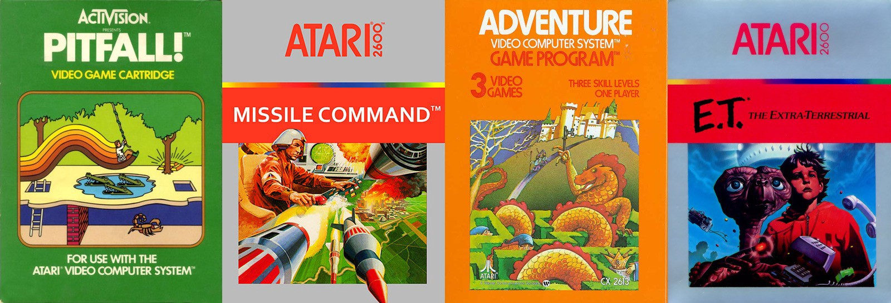
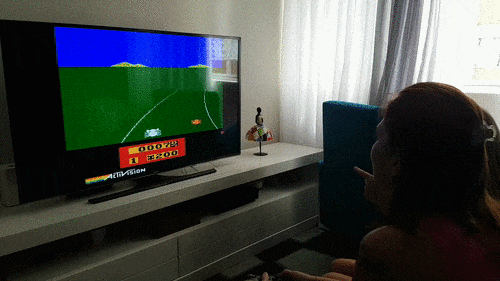
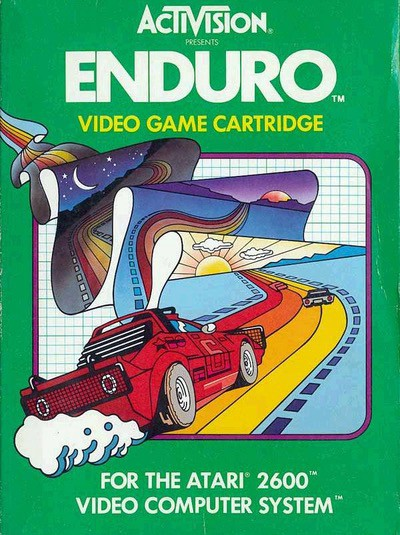
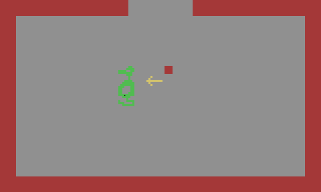

# O Atari e o fosso da imaginação

Num acesso de nerdice extrema (motivada por um certo tédio de fim de carnaval) transformei meu Raspberry Pi numa [máquina de retro-videogame](https://www.recalbox.com/).

Chegada a hora da visita obrigatória por grandes clássicos dos anos 80 coloquei Enduro e BUM, abriu-se um túnel do tempo na minha frente e voltei a ter 10 anos… que por coincidência é a idade da Clarinha, minha filha que ao olhar para tela perguntou inocentemente: “É uma aranha?”

Nada como gastar milhões em uma TV 4K para jogar… Atari

Se você olhar atentamente para a tela vai ver que até que aquelas coisas passando parecem uma aranha. Definitivamente parecem mais com uma aranha do que com um carro! Então como é que nós espetávamos o cartucho no velho Atari e imediatamente éramos transportados para uma *infinita highway* com carros velozes, nevoeiro e neve escorregadia? Somos uma geração mais abstrata do que a atual? Ou tivemos uma ajudinha?

A caixa do Enduro clássico, com imagens iguaizinhas ao jogo de verdade, SQN

Não era coincidência que as caixas dos jogos de Atari não eram visualmente nem um pouco parecidas com o que você encontrava dentro do jogo. As caixas cumpriam o papel de dar ao jogador a direção para onde sua imaginação deveria apontar, preenchendo o (gigante) fosso entre a dura realidade 8-bits e o que você *gostaria* que o jogo fosse. Nenhum jogo representou isso melhor do que **Adventure**, que na capa tinha todos os elementos do jogo: um dragão, um labirinto, chaves e armas mágicas… Enquanto isso, no jogo:

Você é esse quadrado. A seta é uma espada (ou lança?) tentando matar o terrível dragão verde

Propaganda enganosa ou ferramenta de *experiência de usuário*? Hoje ficou claro para mim que as caixas dos jogos do Atari tinham sim um papel fundamental para que os momentos na frente da TV de tubo fossem muito mais *uooooooooooooou*.

Para saber mais sobre as maravilhosas caixas de jogos de Atari e sua missão no fosso da imaginação confira um episódio do podcast [Imaginary Worlds](http://www.imaginaryworldspodcast.org/atari-vs-the-imagination-gap.html) sobre “A arte do Atari”.
