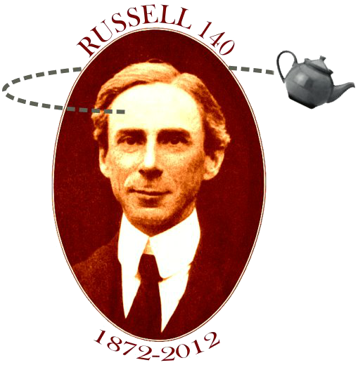
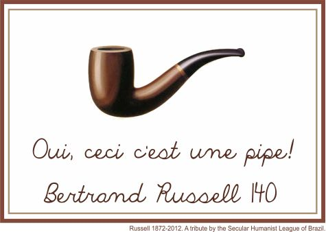

# ThLuiz Integration

Tumblr usado para integrar meus serviços

Search Posts

[140 anos de Bertrand Russell](http://thluiz-integration.tumblr.com/post/23364865565/140-anos-de-bertrand-russell "140 anos de Bertrand Russell")

[shared via Google Reader from [Bule Voador](http://t.umblr.com/redirect?z=http%3A%2F%2Fbulevoador.com.br%2F2012%2F05%2F35328%2F%3Futm_source%3Dfeedburner%26utm_medium%3Dfeed%26utm_campaign%3DFeed%253A%2BBuleVoador%2B%2528Bule%2BVoador%2529&t=ZWM0OTExMmQyODgxODdiNTY1N2IwYWNjOWYzZDJhM2YzNzI3ODYzYSxNUjNFUkgzeg%3D%3D&b=t%3AuvMV4RFEQxzEx2cgKvE_zQ&p=http%3A%2F%2Fthluiz-integration.tumblr.com%2Fpost%2F23364865565%2F140-anos-de-bertrand-russell&m=1)]

Hoje nós na Liga Humanista Secular do Brasil comemoramos os **140 anos desde o nascimento do grande filósofo Bertrand Russell**, o criador da [analogia que nomeou este blog](http://t.umblr.com/redirect?z=http%3A%2F%2Fbulevoador.com.br%2Fsobre%2F&t=OTE3ZmYyNzJmMWQwNjQ2NWI5MDVkNGNmMzI4ZjUyODk0MTkxNjU5NCxNUjNFUkgzeg%3D%3D&b=t%3AuvMV4RFEQxzEx2cgKvE_zQ&p=http%3A%2F%2Fthluiz-integration.tumblr.com%2Fpost%2F23364865565%2F140-anos-de-bertrand-russell&m=1). Recomendamos o [conteúdo arquivado aqui](http://t.umblr.com/redirect?z=http%3A%2F%2Fbulevoador.com.br%2Fcategory%2F7-bule-series%2Fbertrand-russell%2F&t=NWMzY2VlNzk1NGU4NDg1NWQ5OTI0NGIyY2FjOGZlMmM0MGQwOWVjNyxNUjNFUkgzeg%3D%3D&b=t%3AuvMV4RFEQxzEx2cgKvE_zQ&p=http%3A%2F%2Fthluiz-integration.tumblr.com%2Fpost%2F23364865565%2F140-anos-de-bertrand-russell&m=1) no Bule Voador sobre ele.

A seguir, alguns vídeos de Bertie, alguns legendados completamente, um em parte, e outro sem legendas.

A **Bertrand Russell Society**, da qual o presidente da LiHS é um membro, gentilmente nos cedeu o material original de mídia em áudio e vídeo produzidos durante a vida do filósofo. Chamamos a todos os fãs que desejam participar da legendagem desse material para se juntarem ao [Grupo de Legendas da LiHS](http://t.umblr.com/redirect?z=http%3A%2F%2Fgroups.google.com%2Fgroup%2Flegendaslihs%3Fhl%3Dpt-BR&t=MjQ0MTA0M2RlYzBiMTNlYWNkYTgwNGQ5ZWViMWNlZjk0Y2IxMjVlMSxNUjNFUkgzeg%3D%3D&b=t%3AuvMV4RFEQxzEx2cgKvE_zQ&p=http%3A%2F%2Fthluiz-integration.tumblr.com%2Fpost%2F23364865565%2F140-anos-de-bertrand-russell&m=1), o grupo que legendou com sucesso e alta qualidade o filme “The Ledge” de Matthew Chapman.

(Somente a primeira parte da entrevista acima está disponível.)

**Veja também:**
