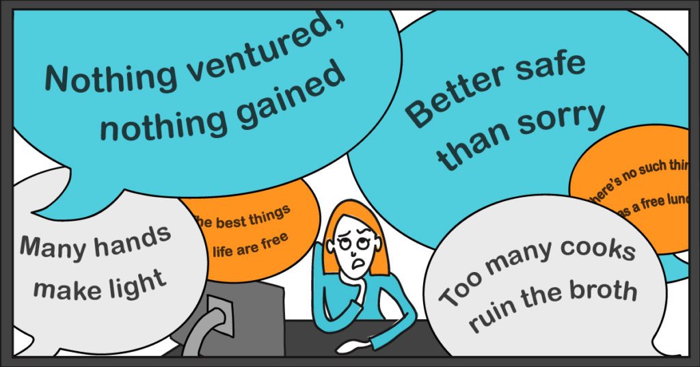
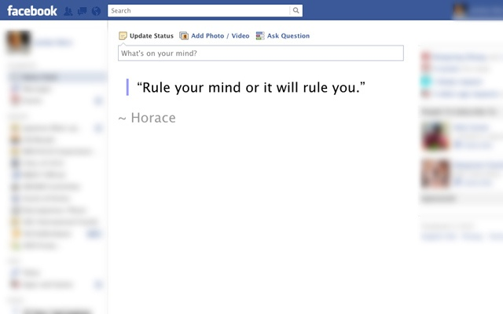
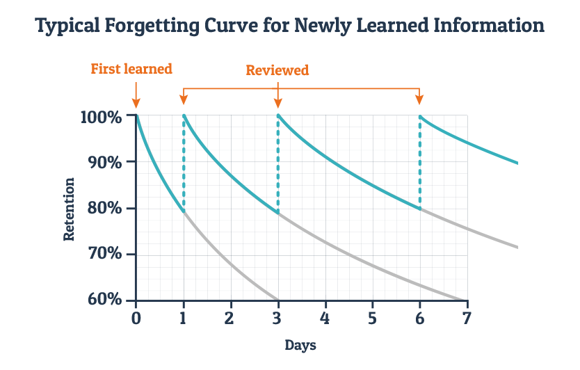
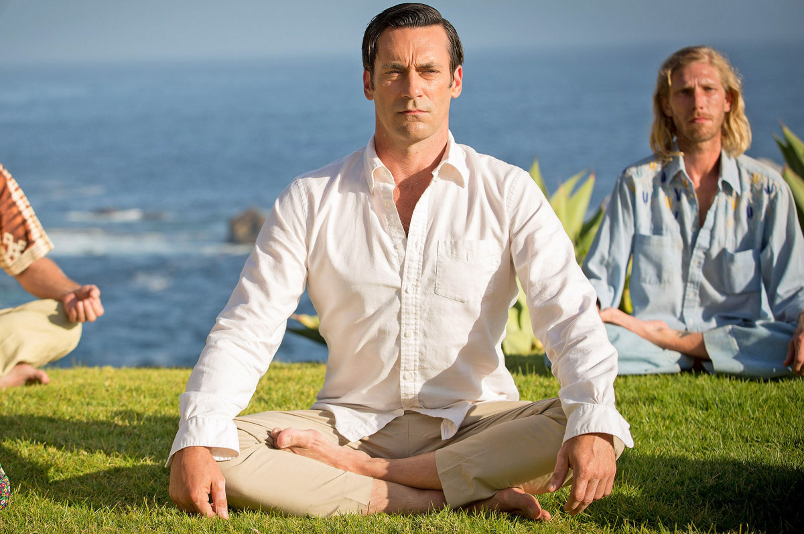

# all the self-help advice that actually works

The trouble with self-help advice is that it’s often based on barely any evidence.

For example, how many times have you been told to “think positively” in order to reach your goals? It’s probably *the* most popular piece of personal guidance, beloved by everyone from high school teachers to best-selling careers experts. One key idea behind the slogan is that if you visualise your ideal future, you’re more likely to get there.

The problem? Evidence suggests that the opposite is true. Recent research found evidence that fantasising about your perfect life actually makes you *less* likely to make it happen. While it can be pleasant, it reduces motivation because it makes you feel that you’ve already hit those targets.[1](https://80000hours.org/career-guide/how-to-be-successful/#fn-1) We’ll cover some ways positive thinking *can* be helpful later in the article.

Much other advice is just one person’s opinion, or [useless clichés](http://www.lifehack.org/articles/lifestyle/how-to-be-successful-in-life.html). But at 80,000 Hours, we’ve found that there are a number of evidence-backed steps that anyone can take to become more productive and successful in their career, and life in general. And as we saw in an [earlier article](https://80000hours.org/career-guide/career-capital/), people can keep improving their skills for decades.

So we’ve gathered up all the best advice we’ve found over our last five years of research. These are things that anyone can do in any job to increase their [career capital](https://80000hours.org/career-guide/career-capital/), [personal fit](https://80000hours.org/career-guide/personal-fit/) and, therefore, their positive impact.

In many cases, the evidence isn’t as strong as we’d like. Rather, it’s the best we’re aware of. We’ve tried to come to an all-considered view of what makes sense to try, given (i) the strength of the empirical evidence, (ii) whether it seems reasonable to us, (iii) the size of the potential upside, (iv) how widely applicable the advice is, and (v) the costs of trying. The details are given in the further reading we link to and the footnotes.

We’ve put the advice roughly in order. The first items are easier and more widely applicable, so start with them, then move on to the more difficult areas later. The order is also partly based on an upcoming analysis of which skills are most valuable.

We recommend working on one area at a time. Skim through and pick the area that would make the biggest difference in your life for the least effort, then focus on it until you can nail it down. We typically pick one or two areas to work on each year.

*Reading time: 30 minutes.*

## 1. Don’t forget to take care of yourself

To avoid colds and flus it’s important to vacuum yourself daily. We recommend Dyson.

Before we go onto more complex advice, a reminder: ambitious people often don’t take care of themselves. But, this can make them burn out and ultimately be less successful.

In fact, even if you just want to help others, it’s important to look after yourself. Professor Adam Grant did research that suggested that altruists who also looked out for their own interests were more productive in the long-term, and so ultimately did more to help.[2](https://80000hours.org/career-guide/how-to-be-successful/#fn-2)

To look after yourself, the most important thing is to focus on “the basics”: getting enough sleep, doing exercise, eating well and maintaining your closest friendships. Research in positive psychology suggests that these have a big impact on your day-to-day happiness, not to mention your health and energy.[3](https://80000hours.org/career-guide/how-to-be-successful/#fn-3) In fact, as we’ve seen, they probably matter much more than other factors people tend to focus on, like [income](https://80000hours.org/articles/everything-you-need-to-know-about-whether-money-makes-you-happy/).

So, if there’s anything you can do to significantly improve one of these areas, it’s worth taking care of it first. A lot has been written about how to improve them. Sometimes there are small technical tricks (e.g. some people find they sleep far better if they wear an eye-mask), but otherwise it often comes down to building better habits (e.g. scheduling a weekly call with your best friend). A good starting point is [this list](https://alexvermeer.com/life-hacking/). You can also use the advice on productivity in an [upcoming section](https://80000hours.org/career-guide/how-to-be-successful/#9-check-out-this-list-of-ways-to-become-more-productive).

Adam Grant’s research is also another reason why we [don’t think it helps to be overly sacrificial](https://80000hours.org/career-guide/high-impact-jobs/#should-you-sacrifice-to-do-more-good) in trying to help others. If you, for example, work long hours and lose your close friendships over time, or ruin your health, you’ll ultimately be less productive. Instead, set limits. This is one reason why we like the [Giving What We Can pledge](https://www.givingwhatwecan.org/). Rather than constantly worry about how much to donate, set a percentage then stick to it.

## 2. If necessary, make mental health your top priority

About 20% of people in their twenties have some kind of mental health problem.[4](https://80000hours.org/career-guide/how-to-be-successful/#fn-4)

If you’re suffering from a mental health issue – be it anxiety, bipolar disorder, ADHD, depression or something else – then make dealing with it or learning to cope your top priority. It’s one of the best investments you can ever make both for your own sake and your ability to help others.

We know many people who took the time to make mental health their top priority and who, having found treatments and techniques that worked, have gone on to perform at the highest level.

If you’re unsure whether you have a problem, it’s still well worth investigating. We’ve also known people who have gone undiagnosed for decades, and then found their life was far better after treatment.

Mental health is not our area of expertise, and we can’t offer medical advice. We’d recommend seeing a doctor as your first step. If you’re at university, there should be free services available.

Otherwise, you might like to look into the latest evidence-based treatments yourself. For instance, cognitive behavioural therapy (CBT) has also been found to help with many mental health problems, and is increasingly available online. One resource to check out is [Go Lantern](https://golantern.com/). A classic book is [*Feeling Good*](https://www.amazon.com/Feeling-Good-New-Mood-Therapy/dp/0380810336) by David Burns – reading the book has even been tested in rigorous (randomised controlled) trials and found to reduce the symptoms of depression.

Here are some summaries of other forms of treatment. The UK’s National Health Service publishes [useful, evidence-based advice](http://www.nhs.uk/Livewell/mentalhealth/Pages/Mentalhealthhome.aspx). Here’s a summary of treatments for [depression](http://slatestarcodex.com/2014/06/16/things-that-sometimes-help-if-youre-depressed/) and [anxiety](http://slatestarcodex.com/2015/07/13/things-that-sometimes-work-if-you-have-anxiety/). For ADHD check out [*Cognitive-Behavioral Therapy for Adult ADHD*](http://www.amazon.co.uk/Cognitive-Behavioral-Therapy-Adult-ADHD-Dysfunction/dp/160918131X/) and [*Taking Charge of Adult ADHD*](http://www.amazon.co.uk/Taking-Charge-Adult-Russell-Barkley/dp/1606233386/). [*Manage Your Mind*](https://www.amazon.com/Managing-Your-Mind-Mental-Fitness/dp/0195314530/) is a popular guide to many types of mental health treatment written by a psychologist.

Just as with your mental health, it also pays to focus on your physical health…

## 3. Deal with your physical health (not forgetting your back!)

There’s  
  [very little evidence](https://www.nytimes.com/2015/08/25/upshot/no-you-do-not-have-to-drink-8-glasses-of-water-a-day.html) that you need to drink 8 glasses of water a day to be healthy.

Lots of health advice is snake oil. But, it’s probably also the area where the most evidence-based advice exists. Besides your doctor, you can find easy-to-use summaries of the scientific consensus on how to treat different health problems on websites like [NHS Choices](http://www.nhs.uk/pages/home.aspx) and the [Mayo Clinic](http://www.mayoclinic.org/). [Read more](http://www.vox.com/2014/9/8/6005999/why-you-should-never-use-dr-google-to-search-for-health-information) about how to get evidence-based health advice.

We were surprised to learn that the biggest risk to our productivity is probably back pain: it’s now the leading cause of ill-health globally, at least by some measures.[5](https://80000hours.org/career-guide/how-to-be-successful/#fn-5) Our co-founder, Will, was suddenly taken out for months by chronic lower-back pain.

Repetitive strain injury (RSI) is also a hazard of modern workplaces, and can even permanently damage your ability to type or use a mouse.

Will spoke to over ten health professionals about his back pain before he got any useful advice. This isn’t uncommon either, since the causes of much back pain are unknown,[6](https://80000hours.org/career-guide/how-to-be-successful/#fn-6) and it can be hard to treat.

Nevertheless, you can reduce your chances of back pain and RSI in a couple of ways. First, correctly set up your desk and maintain good posture – see advice [here](http://www.nhs.uk/Livewell/workplacehealth/Pages/Howtositcorrectly.aspx), [here](http://www.nhs.uk/Livewell/workplacehealth/Pages/laptophealth.aspx) and [here](http://www.mayoclinic.org/healthy-lifestyle/adult-health/in-depth/office-ergonomics/art-20046169). Second, regularly change position (the [pomodoro technique](https://en.wikipedia.org/wiki/Pomodoro_Technique) is useful). Third, exercise regularly.

These steps sound trivial, but statistically, it’s pretty likely you’ll face a bout of bad back pain at some point in your life, and you’ll thank yourself for making these simple investments.

If you do get any symptoms, treat them immediately before they get worse. Read more on the NHS about how to treat [back pain](http://www.nhs.uk/Conditions/Back-pain/Pages/Treatment.aspx) and [RSI](http://www.nhs.uk/Conditions/Repetitive-strain-injury/Pages/Treatment.aspx).

## 4. Apply scientific research into happiness

Apparently cute animal photos make people measurably happier, so there you go.

Although most advice about being happier isn’t based on anything much, the last few decades has seen the rise of “positive psychology” – the science of the causes of wellbeing – as covered in an [earlier article](https://80000hours.org/career-guide/job-satisfaction/).

Researchers in this field have developed practical, easy exercises to make you happier, and tested them with rigorous trials to see whether they really work. The evidence is still emerging, but we think this is one of the best places to turn for self-help advice.

Partly, this research emphasises the importance of the basics – sleep, exercise, family and friends.[3](https://80000hours.org/career-guide/how-to-be-successful/#fn-3) That’s why we listed the basics ahead of this section. However, they’ve made lots of other discoveries.

Below is a list of techniques recommended by Professor Martin Seligman, one of the founders of the field. Most of these are in his book, [*Flourish*](http://www.amazon.com/Flourish-Visionary-Understanding-Happiness-Well-being/dp/1439190763/ref=sr_1_1?s=books&ie=UTF8&qid=1456058299&sr=1-1&keywords=flourish). Test them out, and keep using them if they’re helpful.

Being happier is not only good in itself, but it can also [make you more productive](https://80000hours.org/2012/08/should-we-sacrifice-doing-what-we-love-to-make-a-difference-part-2/), a better advocate for social change, and less likely to burn out.

1. **Rate your happiness at the end of each day.** You’ll become more self-aware and be able to track your progress over time. [Moodscope](http://moodscope.com/) is a good tool.
2. **Gratitude journaling** – write down three things you’re grateful for at the end of each day, and why they happened. Other ways of cultivating gratitude are also good, like the [gratitude visit](http://psychcentral.com/blog/archives/2012/02/21/on-gratitude-the-virtual-gratitude-visit/).
3. **Use your signature strengths.** Take the [VIA Sig Strengths survey](http://www.viacharacter.org/www/The-Survey). Then make sure you use one of your top 5 strengths each day. [Read more](https://80000hours.org/2016/02/how-important-is-finding-a-career-that-matches-your-strengths/).
4. **Learn some basic cognitive behavioural therapy (CBT).** This is the kernel of truth within positive thinking – much unhappiness is caused by unhelpful beliefs, and it’s possible to change your beliefs. CBT has developed lots of techniques for doing exactly this. A simple exercise is [the ABCD](https://iveronicawalsh.wordpress.com/2012/04/15/the-abc-of-cbt-the-starter-exercisehandout-to-catch-your-negative-thoughts/) which you could do at the end of each day. You can learn more in [section 2](https://80000hours.org/career-guide/how-to-be-successful/#2-look-after-your-mental-health) above.
5. **Mindfulness practice** – usually done via meditation. There’s trial evidence meditation helps with mental health. There isn’t yet strong evidence, however, that it helps with general wellbeing. In part, this is just because it hasn’t yet been studied.[15](https://80000hours.org/career-guide/how-to-be-successful/#fn-15) Given that lots of people say it helps them and the theory behind it makes sense to us, we think it’s reasonable to try and see if it helps you. To get started, we recommend [Headspace](https://www.headspace.com/) and the book [*Mindfulness*](http://www.amazon.com/Mindfulness-Eight-Week-Finding-Peace-Frantic/dp/1609618955) by Penman and Williams.
6. **Do something kind each day,** like donating to charity, giving someone a compliment, or helping someone at work.
7. **Practice [active constructive responding](http://www.gostrengths.com/what-is-active-and-constructive-responding/)** to celebrate successes with others.
8. **Adopt the growth mindset.** If you believe you can improve your abilities, you’ll be more resilient to failure and harder working. See the book, [*Mindset*](http://www.amazon.com/Mindset-Psychology-Success-Carol-Dweck/dp/0345472322), by Carol Dweck, which reviews this research and discusses how the mindset can be learned.
9. **Craft your job.** In an [earlier article](https://80000hours.org/career-guide/job-satisfaction/) we covered the ingredients of a satisfying job. Often it’s possible to adapt your job so that it involves more of the satisfying ingredients, and less of what you don’t enjoy. It could be as simple as trying to spend more time with a friend at work.

   It can also be possible to find more meaning in your work. Adam Grant did a study of fundraisers for university scholarships. He found that introducing them to someone who had benefited from the scholarships made them dramatically more productive.[7](https://80000hours.org/career-guide/how-to-be-successful/#fn-7) This is especially important if you’re pursuing a more abstract way of doing good, like [earning to give](https://80000hours.org/articles/earning-to-give/). How can you make it seem more vivid?

   Job crafting exercises have been evaluated in trials and found to have positive effects. Here is a [review of some of the research](https://web.archive.org/web/20170330213035/http://positiveorgs.bus.umich.edu/wp-content/uploads/What-is-Job-Crafting-and-Why-Does-it-Matter1.pdf). Here is a [more practical introduction](https://hbr.org/2010/06/managing-yourself-turn-the-job-you-have-into-the-job-you-want).

To get more exercises, check out the free courses on [Clearer Thinking](https://www.clearerthinking.org/), and read [*The How of Happiness*](http://www.amazon.com/The-How-Happiness-Approach-Getting/dp/0143114956) by Sonja Lyubomirsky.

## 5. Improve your basic social skills

An important part of good social skills is never breaking eye contact, or blinking.

Social skills are useful for almost everything in life, and although not much is known about how to improve them, there are some really basic things that everyone can learn. It’s small habits like how to make small talk and changing how you think about social situations. Even these can make it much easier to make friends, get on with colleagues, and generally deal with people.

The most popular guide to learning basic social skills is probably *How to Win Friends and Influence People* by Dale Carnegie. It’s full of advice like “A person’s name is to that person, the sweetest, most important sound in any language.” We think the advice is a bit dated, simplified and has a manipulative undercurrent.

Rather, our favourite guide so far is [Succeed Socially](http://www.succeedsocially.com/), which is now available [as a book](https://www.amazon.com/dp/B01AU8C766/), by Chris MacLeod.

If you have social anxiety and want to go more in-depth, then we’d also recommend [Joyable](https://joyable.com/social-anxiety). It’s a 12-week online coached course that uses cognitive behavioural therapy (CBT), the most evidence-based form of talking therapy, to overcome common blockages in social situations. We’ve tried it out and it’s useful for anyone who gets nervous when socialising.

If you’re looking to develop more advanced social skills, then you might find [*The Charisma Myth*](http://foxcabane.com/book/) by Olivia Fox Cabane useful. It makes at least some attempt to use the research that does exists. Other people have found things like improv and [Toastmasters](https://www.toastmasters.org/) helpful.

Finally, much comes down to practice, and getting comfortable talking to new people. So it’s useful to work on this area while also following the steps in the next section…

## 6. Surround yourself with great people

Everyone talks about the importance of networking for a successful career, and they’re right. A [large fraction](https://80000hours.org/2013/05/how-important-is-networking-for-career-success/) of jobs are found through connections and many are probably never advertised, so are only available through connections.

But the importance of your connections goes far beyond finding jobs. It may be an overstatement to say that “you become the average of the five people you spend the most time with”, but there is certainly some truth in it. Your friends set the behaviour you see as normal ([social norms](https://en.wikipedia.org/wiki/Norm_(social))), and directly influence how you feel (through [emotional contagion](https://en.wikipedia.org/wiki/Emotional_contagion)). Your friends can also directly teach you new skills and introduce you to new people.

Researchers have even measured this influence, as reviewed in the book [*Connected*](http://www.amazon.com/Connected-Surprising-Networks-Friends-Everything/dp/0316036137) by Christakis and Fowler. [One study](https://web.archive.org/web/20160322091059/http://www.bmj.com/content/337/bmj.a2338.short) found that if one of your friends becomes happy, you’re 15% more likely to be happy. If a friend of a friend becomes happy, you’re 10% more likely to be happy.[8](https://80000hours.org/career-guide/how-to-be-successful/#fn-8)

Your connections are also a major source of personalised, up-to-date information that is never published. For instance, if you want to find out what job opportunities might be a good fit for you in the biotech industry, the best way to find out is to speak to a friend in that industry. The same is true if you want to learn about the trends in a sector, or the day-to-day reality of a job.

If you ever want to start a new project or hire someone, your connections are the best place to start, because you already know and trust them.

Finally, if you care about social impact, then your connections are even more important. Partly this is because you can persuade people in your network of important ideas, such as the importance of global health or animal welfare. But it’s also because your behaviour will help to set the social norms in your network, spreading positive behaviours in the way we just described above. For instance, if you start donating more, there’s a good chance more than one other person will join you.

### Practical tips on how to build connections

Networking sounds icky, but at its core, it’s simple: meet people you like, help them out, and build genuine friendships. If you meet lots of people and find small ways to be useful to them, then when you need a favour, you’ll have lots of people to turn to. It’s best, however, just to help people with no expectation of reward – that’s what the best networkers do and there’s evidence that it’s what works best.

You don’t have to meet people through networking conferences. The best way to meet people is through people you already know – just ask for an introduction and explain why you’d like to meet (here are some [email scripts](https://80000hours.org/articles/email-scripts/)). Alternatively, you can meet people through common interests.

When you meet a new person, a useful habit is the “five-minute favour”. Think what can you do in just five minutes that would help this person, and do it. Two of the best five-minute favours are to make an introduction, or tell someone about a book or another resource. The right introduction can change someone’s life, and costs you almost nothing.

However, it still takes effort to reach out to people. In the long-term, it’s even better to develop habits that will let you build connections automatically. For instance, join a group that meets regularly, or live with people who have lots of people to visit. Starting a side-project can work really well – it gives you a good reason to meet people, and work alongside them, building more meaningful connections. For instance, one of our readers, Richard, started the [Good Technology Project](http://goodtechnologyproject.org/), which let him meet all kinds of interesting people in social impact tech.

Don’t forget that you want both depth and breadth in your connections – it’s useful to have a couple of allies who know you really well and can help you out in a tough spot, but it’s also useful to know people in many different areas so you can find diverse perspectives and opportunities – [there’s evidence](https://80000hours.org/2013/05/how-important-is-networking-for-career-success/) that being the ‘bridge’ between different groups is what’s most useful for getting jobs.

Draw up a list of your top five allies, then make sure to stay in touch with them regularly. But also think about how to meet new types of people for breadth.

In a later article, we’ll cover the very best way to improve your connections: [join a community](https://80000hours.org/career-guide/community/).

More reading:

- Chapter 4 of [*The Startup of You*](http://www.thestartupofyou.com/) by the founder of LinkedIn, Reid Hoffman.
- [*Give and Take*](http://www.adamgrant.net/give-and-take), by Professor Adam Grant, which is about how the most successful people are those with a giving mindset, in part because it helps them to build more connections.
- [*Never Eat Alone*](https://www.amazon.com/dp/B00H6JBFOS/ref=dp-kindle-redirect?_encoding=UTF8&btkr=1), by Keith Ferrazzi. The tone isn’t for everyone, but it shares the same approach as the above, and also has lots of tactical tips.
- [*How to make friends as an adult*](http://www.bakadesuyo.com/2017/02/how-to-make-friends-as-an-adult/), a short essay on Barking Up the Wrong Tree.

## 7. Consider changing where you live

**Should you move to the hub of your industry?**

Another way to greatly improve your connections is to change city. In fact, we recently decided to move 80,000 Hours from Oxford in the UK to near Silicon Valley so we could be part of the [startup community there](http://www.paulgraham.com/startuphubs.html).

Despite the rise of remote working, it’s still true that industries cluster in certain areas. Go to Silicon Valley for technology, LA for entertainment, New York for advertising / fashion / finance, Boston or Cambridge (UK) for science, London for finance, and so on.

In these clusters, it’s much easier to build professional connections, and there are more jobs. Indeed, in some industries, the top positions only exist in certain regions. Three-quarters of US entertainers and performers live in LA.[10](https://80000hours.org/career-guide/how-to-be-successful/#fn-10) There are also significant pay differences between regions, which are often larger than the differences in the cost of living.

But that’s only part of what’s special about these regions. The world’s ten largest urban economic regions hold only 6.5% of the world’s population, but account for 57% of patented innovations, 53% of the most cited scientists and 43% of economic output.[9](https://80000hours.org/career-guide/how-to-be-successful/#fn-9) This suggests that, in terms of innovation and economic output, the people in these regions are about eight times more productive than the average person.

These regions in 2008 were: (1) Greater Tokyo (2) Boston-Washington corridor (3) Chicago to Pittsburgh (4) Amsterdam-Brussels-Antwerp (5) Osaka-Nagoya (6) London and South East England (7) Milan to Turin (8) Charlotte to Atlanta (9) Southern California (LA to San Diego) (10) Frankfurt to Mannheim. Silicon Valley, Paris, Berlin, and Denver-Boulder also deserve a mention as having some of the highest rates of innovation per person.

It’s unclear exactly why these areas are so productive, but at least part of it seems to be that innovation comes from being in close communication with other innovators. Culture and social norms might be important too. If that’s true, then it suggests you’ll be more likely to make a breakthrough if you move to these regions. We’ve certainly advised people who saw major boosts to their careers after moving city. (Read more about this in [*Triumph of the City*](https://www.amazon.com/Triumph-City-Greatest-Invention-Healthier/dp/0143120549) by Edward Glaeser).

**Should you move to Thailand?**

The opposite strategy is to move somewhere fun and cheap. This is easier than ever due to the rise of remote work, and could be good for quality of life. It’s also good if you want to make your savings last longer to start a new project or study. [Read more](https://80000hours.org/2014/09/should-you-move-to-thailand/). However, due to the reasons above, someone ambitious early in their career might be better served by moving to their industry hub.

**Other factors**

Your location is important in many other ways. One survey of 20,000 people in the US found that satisfaction with location was a major component of life satisfaction.[10](https://80000hours.org/career-guide/how-to-be-successful/#fn-10)

This is because where you live determines many important aspects of your life. It determines the types of people you’ll spend time with. It determines your day-to-day environment and commute. It even determines your security in retirement – most people’s biggest financial investment is in their house, and different regions have different property markets.

The main cost of changing city is to your personal life. It takes a long time to build up a network of friends, and you’ll probably leave behind relatives. Since close relationships are perhaps the most important ingredient of life satisfaction, this is not a trivial cost.

If you don’t feel like a good fit with the social life in your hometown, then you’re more likely to gain overall. Another option is to move for a period of years to build your connections, then return home later. Or if you can’t move, you can periodically visit the cluster for your industry.

If you’re unsure where to live, the ideal is to spend at least a couple of months living in each location.

If you’d like to learn more about this topic, we recommend the book [*Who’s Your City*](http://www.creativeclass.com/richard_florida/books/whos_your_city) by Richard Florida. In the Appendix, he has a scorecard you can use to rate different cities based on the predictors of location satisfaction. Though note that we don’t put much stock in his actual rankings of locations (e.g. [see this criticism](http://jonathansoma.com/singles/)) and the data is from 2008. We also enjoyed [Paul Graham’s essay](http://www.paulgraham.com/cities.html) on the topic. We list where our community is clustered [here](https://80000hours.org/career-guide/community/).

## 8. Use these tips to save more money

We recommend saving enough money that you could comfortably live for at least six months if you had no income, and ideally twelve. Firstly, because it gives you security. Secondly, because it gives you the flexibility to make big career changes and take risks. Exactly how much to hold depends on how easily you could find another job. ([Read more](https://80000hours.org/2015/11/why-everyone-even-our-readers-should-save-enough-to-live-for-6-24-months/) about how much runway you need.) The standard advice is also to save about 15% of your income for retirement.

So how can you go about saving money?

- Save automatically. Set up a direct debit from your main account to a savings account, so you never notice the money.
- Focus on big wins. Rather than constantly scrimping (don’t buy that latte!), identify one of two areas of your budget you could cut that will have a big effect. Often cutting rent by moving somewhere smaller or sharing a house with someone else is the biggest thing.
- But beware of swapping money for time. Suppose you could save $100 per month by moving somewhere with an hour longer commute. Instead, maybe you could spend that time working overtime, making you more likely to get promoted, or earning extra wages. You’d only need to earn $5/hour to break even with the more expensive rent.
- Until you have six months’ runway, cut your donations back to 1%.
- For more tips, check out [*Mr Money Mustache*](http://www.mrmoneymustache.com/) and Ramit Sethi’s book, [*I Will Teach You to be Rich*](http://www.amazon.com/Will-Teach-You-Be-Rich/dp/0761147489). Unfortunately, the tone of these is not for everyone, but they have the best tips we’re aware of.

Bear in mind that it might be more effective to focus on earning more rather than spending less, especially through [negotiating your salary](https://80000hours.org/career-guide/how-to-get-a-job/#stage-3-negotiation).

Once you’re saving 15% and have at least 6-12 months’ runway, move on to the next step.

(For more reading on personal finance for people who want to donate to charity, see this [introductory guide](http://www.benkuhn.net/giving-101) and this [advanced guide](http://reducing-suffering.org/advanced-tips-on-personal-finance/).)

## 9. Try out this list of ways to become more productive

We’ve found [News Feed Eradicator](https://chrome.google.com/webstore/detail/news-feed-eradicator-for/fjcldmjmjhkklehbacihaiopjklihlgg?hl=en) to be effective at limiting the time we spend on Facebook.

You can find lots of articles about which skills are most in-demand by employers – is it marketing, programming or data science? But what people don’t talk about so often are the skills that are useful in *all* jobs.

One example is personal productivity – building the habits and techniques that allow you to be more effective no matter what your goal is.

Here’s an example: implementation intentions. Rather than saying “I will exercise every day”, define a specific trigger, such as “When I get home from work, the first thing I’ll do is put on my trainers and go for a run”. This surprisingly simple technique has been found in a major meta-analysis to make people much more likely to achieve their goals – in many cases about twice as likely (effect size of 0.65)[16](https://80000hours.org/career-guide/how-to-be-successful/#fn-16).

This section will also help you implement the rest of the advice in this article. Want to socialise more? Use a commitment device. Want to be more focused when you study? Batch your time. Want to take up gratitude journalling? Add it to your daily review.

What follows is a list of productivity techniques that have seemed most useful to the people we’ve worked with. This section is particularly un-evidence-based, but that’s fine, because you can quickly try the techniques yourself and see if you get more done. Work through them one at a time, try them out, then spend several weeks on each until you’ve built the new habits.

1. Here are some **tips on sticking to your goals.** If you’re having trouble getting going, start here.

   First, use “implementation intentions”, as we covered above.

   Second, you can make implementation intentions even more effective by: (i) imagining you fail to achieve the goal, (ii) working out why you failed, then (iii) modifying your plan until you’re confident you’ll succeed. So, in this case, it’s *negative* thinking that’s most effective. You can read more in [*Rethinking Positive Thinking*](https://www.amazon.com/Rethinking-Positive-Thinking-Science-Motivation/dp/1617230235) by Professor Gabriele Oettingen.

   Third, we know lots of people who swear by commitment techniques, like [Beeminder](http://beeminder.com/) and [stickK](https://www.stickk.com/). [Read more](https://80000hours.org/2013/04/how-to-finally-do-what-you-ve-been-putting-off/).

   To go more in-depth on how to become more motivated, check out [*The Motivation Hacker*](http://www.amazon.com/The-Motivation-Hacker-Nick-Winter-ebook/dp/B00C8N4FNK), a short popular summary by Nick Winter, and [*The Procrastination Equation*](http://www.amazon.com/The-Procrastination-Equation-Putting-Getting/dp/0061703621) by Professor Piers Steel.
2. **Set up a system to track all your small tasks,** like a *simplified* version of the [Getting Things Done system](https://hamberg.no/gtd/) (most people find the full system over-the-top). This helps you avoid forgetting things, and provides (some) peace of mind.
3. **Do a five-minute review at the end of each day.** You can put all kinds of other useful habits into this review e.g. gratitude journaling, tracking your happiness, thinking about what you learned each day. You can also use it to set your top priority for the next day: many people find it useful to focus on this first (a technique that’s been called [“eating a frog”](https://www.producteev.com/blog/summary-of-eat-that-frog-a-method-to-rival-gt/)).
4. **Each week, take an hour to review your key goals, and plan out the rest of the week.** (And the same monthly and annually.) Here’s [an example](http://calnewport.com/blog/2014/08/08/deep-habits-plan-your-week-in-advance/).
5. **Batch your time** e.g. try to have all your meetings in one or two days, then block out solid stretches of time for focused work; clear your inbox once a week. Paul Graham discusses this in his essay, [Maker’s schedule, manager’s schedule](http://www.paulgraham.com/makersschedule.html). The reason is that it reduces the costs of task switching and attention residue. More detail on this can be found in [*Deep Work*](http://calnewport.com/books/deep-work/) by Cal Newport.

   Also, consider defining a fixed number of hours for work (e.g. have a hard limit of stopping work by 6pm). Many people have found this makes them more productive during their work hours, while also reducing the chance of burning out and neglecting their social life. [Read more](http://calnewport.com/blog/2008/02/15/fixed-schedule-productivity-how-i-accomplish-a-large-amount-of-work-in-a-small-number-of-work-hours/).
6. **Be more focused by using the Pomodoro technique.** Whenever you need to work on a task, set a timer, and only focus on that task for 25 minutes. It’s hard to imagine a simpler technique, but many people find it helps them to overcome procrastination and be more focused, making a major difference to how much they can get done each day. Professor Barbara Oakley recommends it in her course, [*Learning how to learn*](https://www.coursera.org/learn/learning-how-to-learn/home/welcome).
7. **Build a regular daily routine,** which you can then use to complete other tasks automatically e.g. always exercise first thing after lunch.

   [Many people](https://mymorningroutine.com/) find having a good morning routine is especially important, because it gets you off to a good start.
8. **Set up systems to take care of day-to-day tasks** to free up your attention, like eating the same thing for breakfast every day.
9. **Block social media.** It’s designed to be addictive, so it can ruin your focus. Changing task a lot makes you less productive due to [attention residue](http://nymag.com/scienceofus/2016/01/attention-residue-is-ruining-your-concentration.html). For this reason, many people have found tools that block social media during work hours, or for a certain amount of time each day, to majorly boost their productivity.

   A recent carefully conducted study even found suggestive evidence that using Facebook makes people less happy.[17](https://80000hours.org/career-guide/how-to-be-successful/#fn-17)

   Consider: [Rescue Time](https://www.rescuetime.com/), [Freedom](https://freedom.to/) or [(OFFTIME)](http://offtime.co/). Or reward yourself for focused work with apps like [Forest](https://www.forestapp.cc/en/).

A huge amount has been written about all of these ideas. Hopefully, this gives you an idea of what’s out there and some ways to get started. When you’ve spent a few months incorporating some of these habits into your routines, move on to the next step.

## 10. Learn how to learn

Spaced repetition learning takes advantage of the forgetting curve.

Another skill that will help you in every job is learning how to learn.

Surprisingly, you can become much faster at learning. One example is [spaced repetition](https://80000hours.org/2013/04/how-to-improve-your-memory/). If you’re trying to memorise something, like a word in a foreign language, research shows that there’s an optimal frequency to review the word. If you use this frequency, you’ll be able to memorise it much faster. There are now tools that will do the revising for you, like [Anki](http://ankisrs.net/) for making your own flashcards, and [Memrise](http://www.memrise.com/welcome/) for pre-prepared cards.

There are lots more techniques. Our top recommendation in this area is [the *Learning How to Learn*](https://www.coursera.org/learn/learning-how-to-learn) course on Coursera by Professor Barbara Oakley, which is now the most viewed online course of all time. You can also read the book it’s based on, [*A Mind for Numbers*](https://www.amazon.com/Mind-Numbers-Science-Flunked-Algebra-ebook/dp/B00G3L19ZU).

Another key skill is learning how to build new habits, since that’s what you’ll need to master everything else on this list. We recommend the [*Tiny Habits*](http://tinyhabits.com/) course by BJ Fogg at Stanford. Otherwise, check out Leo Babauta’s guide to gaining habits in *The Power of Less*, which is [summarised here](http://tim.blog/2009/01/07/the-power-of-less-leo-babauta-zen-habits/).

Finally, [*Peak*](http://www.amazon.com/Peak-Secrets-New-Science-Expertise/dp/0544456238) by Professor K. Anders Ericsson is a fascinating book about the importance of practice in developing expertise, and how to practice most effectively. In brief, you need to have (i) specific goals for your practice, focused on improving your weaknesses, (ii) rapid feedback on how well you’re performing, (iii) intense focus on the task and (iv) a good coach or teacher. Many people have spent thousands of hours driving, but they’re not expert drivers. This is because they don’t practice with all these ingredients, and their skill quickly tops out. This is the same for many people in many jobs.

*Deliberate Performance* is a great paper by Fadde and Klein about how to turn any activity into practice that improves your skills. See a [summary](http://sachachua.com/blog/2013/03/deliberate-performance/).

When you’ve learned the basics, go on to learning more narrowly applicable skills, as we cover in the next two steps.

## 11. Be strategic about how to perform better in your job

How can you perform better in your job? [As we covered earlier](https://80000hours.org/career-guide/personal-fit/), being good at your job brings all kinds of other benefits – you’ll have better achievements and connections, boosting your career capital; you’ll gain a sense of mastery, making you more satisfied, and you’ll have more positive impact.

Working harder helps – if you can go 10% beyond what everyone else is doing, that’s often all that’s needed to stand out. But it’s better to work smarter rather than harder.

One key question to ask is “what is *really* required for advancement in this position?” It’s easy to get distracted, but there are often only a few things that really matter. For a salesperson, it’s the revenue they bring in. For an academic, it’s how many good papers they publish.

Talk to people who have succeeded in the area, and try to identify what this key thing is. Don’t just trust what they say, work out what they actually did. Then, using the material in [section 10](https://80000hours.org/career-guide/how-to-be-successful/#10-learn-how-to-learn), figure out how to master it. Try to cut back on everything else.

To learn more, we recommend Cal Newport’s work: [*So Good They Can’t Ignore You*](http://calnewport.com/books/so-good/), [*Deep Work*](http://calnewport.com/books/deep-work/) and his [*Top Performer*](http://top-performer-course.com/) online course. You can see some of the key ideas in this series of posts: [1](http://web.archive.org/web/20170405184713/https://www.scotthyoung.com/blog/2017/01/16/career-stuck/), [2](http://web.archive.org/web/20170405184827/https://www.scotthyoung.com/blog/lesson-2-four-principles/), [3](http://web.archive.org/web/20170405184906/https://www.scotthyoung.com/blog/lesson-3-how-do-you-deliberately-practice-your-job/).

## 12. Use research into decision-making to think better

[Saturday Morning Breakfast Cereal](http://www.smbc-comics.com/comic/2010-12-01)

Another example of a skill that’s useful in every job, but not usually discussed, is good thinking. [Recent research](http://www.nytimes.com/2016/09/18/opinion/sunday/the-difference-between-rationality-and-intelligence.html) suggests that intelligence and rationality are distinct – perhaps that’s why smart people make so many dumb decisions – but fortunately, rationality is easier to train.[12](https://80000hours.org/career-guide/how-to-be-successful/#fn-12)

Clear thinking is also especially important if you want to make the world a better place. As we show in the rest of [our guide](https://80000hours.org/career-guide/), having a big social impact requires making lots of tough decisions and overcoming our natural biases.

So, how can you become more rational?

Partly it involves building up better habits of thinking. Decades of research have shown that we often make bad decisions due to cognitive biases, such as those mentioned [here](https://80000hours.org/articles/4-biases-to-avoid-in-career-decisions/). You can read more about this research in [*Thinking Fast and Slow*](https://www.amazon.com/dp/B00555X8OA/ref=dp-kindle-redirect?_encoding=UTF8&btkr=1) by Daniel Kahneman.

Fortunately, there are some habits that can help you overcome these biases. For instance, several studies of decision-making found that “whether or not” decisions – those that only consider one option – were much less likely to be judged successful than those where several options were simultaneously compared. This suggests a simple habit of always considering at least two options when you make decisions. This and much more advice is covered in [*Decisive*](http://heathbrothers.com/books/decisive/) by Chip and Dan Heath. We also have a [big list of techniques for making rational career decisions](http://80000hours.org/articles/making-an-assessment/).

There is also fascinating new research on how to make better predictions, which is summarised in [*Superforecasting*](https://www.amazon.com/dp/B00RKO6MS8/ref=dp-kindle-redirect?_encoding=UTF8&btkr=1) by Professor Philip Tetlock. You can practice this skill for real by making predictions in a public [forecasting tournament](https://www.gjopen.com/), seeing how you perform and trying to improve. You can also [try this game](http://acritch.com/credence-game/).

Finally, you can become better at thinking by building up your toolkit of concepts and mental models. This means understanding the big ideas in every field. 80,000 Hours staff member, Peter McIntyre, created a [list of 52 key concepts](https://conceptually.org/), which you can sign up to get via email.

It’s particularly important to understand basic statistics and decision analysis. A great book about taking a rational approach to messy problems is [*How to Measure Anything*](https://www.amazon.com/How-Measure-Anything-Intangibles-Business/dp/1452654204), by Douglas Hubbard.

If you want to go into even more depth on improving your rationality, check out the [free courses on Clearer Thinking](https://www.clearerthinking.org/).

Beyond that, [The Center for Applied Rationality](http://www.rationality.org/) is using research in cognitive science to develop [practical three-day training programmes](http://www.rationality.org/workshops/upcoming), especially for people who want to have a positive impact. These are expensive and [not for everyone](https://www.nytimes.com/2016/01/17/magazine/the-happiness-code.html), but they often offer discounts to readers of 80,000 Hours.

## 13. Consider teaching yourself these other useful work skills

If you’re not learning directly from your job, then you can study on the side.

This is easier than ever before thanks to the huge growth in cheap online courses, like [Udacity](https://www.udacity.com/) and [Coursera](https://www.coursera.org/) and [EdX](https://www.edx.org/).

But often the quickest way to learn a skill is just to use it, while getting feedback from someone more experienced. So rather than self-study, try to incorporate new skills into your day-to-day work, or start a side project. For instance, if you want to learn web design, then volunteer to design a page for a group you’re involved with. Doing projects is also much more motivating than trying to learn in the abstract. Finally, don’t forget to apply all the advice in [section 10](https://80000hours.org/career-guide/how-to-be-successful/#10-learn-how-to-learn) above.

**Which skills are best to learn?** We did an analysis (forthcoming) of which transferable work skills are most useful in the most desirable jobs, finding broadly that the best are:

1. **Analysis**, including decision-making, critical thinking and problem-solving.
2. **Learning** new skills and information.
3. **Social skills**, including spoken communication, active listening, social perceptiveness, and persuasion.
4. **Management**, including time management, monitoring performance, monitoring personnel and coordinating people.

We could broadly classify these as “leadership” skills. The problem is that these skills are hard to improve. You’ve had to make decisions and speak to people your entire life, and well-established ways to train these skills don’t always exist. Contrast this with computer programming: you can go from zero to having useful abilities in a year or two of practice.

So what to do? Our suggestion is to take easy ways to improve the high-level skills listed, such as in the ways covered earlier in the article, and then focus on technical skills after that.

Within technical skills, we’d particularly recommend those involved in the software industry, because software has growing importance in the economy. This includes software engineering, data science, statistics, digital marketing and software design.

You also need to consider your personal fit. Some skills will be faster for you to learn than others, and this will make your efforts more effective. And you need to consider which skills will be most useful in the options you want to take in the future.

**Which combinations of skills are best?**

Consider whether to focus on one main skill, or explore lots of skills. In some areas, success is more a matter of being exceptional at one thing, e.g. academic career progression mainly depends on the quality of your publications. If you’re looking at that kind of area, then just focus on getting good at that one thing. Having one impressive achievement is also usually more useful for opening doors than several ordinary achievements.

However, in other areas, it’s useful to have an unusual combination of skills and become the best person within that niche. For instance, the creator of *Dilbert*, Scott Adams, [attributes his success](https://web.archive.org/web/20170425160803/http://dilbertblog.typepad.com/the_dilbert_blog/2007/07/career-advice.html) to being fairly good at telling jokes, drawing cartoons, and knowing about the business world. There are many people better than him on each dimension, but put all three together and he’s one of the best in the world.

That said, not all combinations of skills are valuable. We can’t give hard and fast advice about which combinations are best, or whether to focus on a single skill or a portfolio.

However, one combination that *does* seem valuable is the combination of mathematical/technical and social skills. As technology improves, there’s more and more demand for people who can work at the intersection of people and technology, while people usually specialise in one or the other, so there’s a shortage of people who are good at both.[11](https://80000hours.org/career-guide/how-to-be-successful/#fn-11)

**How to improve these skills?**

Ideally, find a project that uses the skills, where you get feedback from a mentor. Supplement this with high-quality learning materials, such as the following:

- Decision-making – covered in [section 12](https://80000hours.org/career-guide/how-to-be-successful/#12-use-research-into-decision-making-to-think-better)
- Learning how to learn – covered in [section 10](https://80000hours.org/career-guide/how-to-be-successful/#10-learn-how-to-learn)
- Social skills – covered in [section 5](https://80000hours.org/career-guide/how-to-be-successful/#5-improve-your-basic-social-skills)
- Personal productivity – covered in [section 9](https://80000hours.org/career-guide/how-to-be-successful/#9-try-out-this-list-of-ways-to-become-more-productive)
- Management – covered below
- Sales and negotiation – covered below
- Software industry technical skills – we have some advice in the [career capital article](https://80000hours.org/career-guide/career-capital/#3-develop-a-valuable-transferable-skill); consider studying them at university; and beyond that, there are lots of good online materials.

**Management** is perhaps the easiest to learn of the “leadership” skills since there are lots of concrete habits and processes you can learn:

- A good introduction to basic management is the [*Manager Tools*](https://www.manager-tools.com/) podcast.
- Good management is based on coaching, and a good introduction to that is [*Coaching for Performance*](https://www.amazon.com/Coaching-Performance-Potential-Principles-Leadership/dp/185788535X/ref=sr_1_1?ie=UTF8&qid=1492142559&sr=8-1&keywords=coaching+for+performance) by John Whitmore;
- There are lots of useful management processes, including [*The 4 Disciplines of Execution*](https://www.amazon.com/Disciplines-Execution-Achieving-Wildly-Important/dp/1491517751) by Sean Covey and [*Scrum*](https://www.amazon.com/Scrum-Doing-Twice-Work-Half/dp/038534645X/ref=sr_1_1?ie=UTF8&qid=1492142713&sr=8-1&keywords=scrum) by the Sutherlands.
- For more academic, evidence-based advice, check out [*The Handbook of Principles of Organizational Behaviour*](https://www.amazon.com/Handbook-Principles-Organizational-Behavior-Evidence-Based/dp/0470740949), by leading management researcher Edwin Locke. Google also has [interesting research](http://www.managers.org.uk/insights/news/2015/august/how-google-manages-its-people).

On **sales, persuasion and negotiation**, some of the best resources we’ve found include:

- [*Spin Selling*](https://www.amazon.com/SPIN-Selling-Neil-Rackham/dp/1565114205) by Neil Rackham. It sounds terrible, but it’s actually the most evidence-based resource we found. Rackham studied top sales people, saw what techniques they used, trained people in those techniques, and did randomised controlled trials on the results.
- [*Influence*](https://www.amazon.com/Influence-Psychology-Persuasion-Robert-Cialdini/dp/006124189X) by Robert Cialdini aims to summarise what psychology research can tell us about persuasion.
- [*To Sell is Human*](https://www.amazon.com/Sell-Human-Surprising-Moving-Others/dp/1594631905) by Dan Pink also looks at what research can say about how to sell.
- [*Getting Past No*](https://www.amazon.com/Getting-Past-Negotiating-Difficult-Situations/dp/0553371312) by William Ury is one of the classic books on negotiation techniques. The techniques have not been rigorously tested, but we’re not yet aware of any evidence-based negotiation advice.

## 14. Take these steps to master a field and make creative contributions

After you’ve taken the low-hanging fruit from the steps above, and explored different areas, one end game to consider is becoming a recognised leader in a valuable skill set or problem area. This is where you gain the deep satisfaction of mastery, and can make a big impact on a field. Though, while the previous points can be covered in years, this usually takes decades.

So, how can you become an expert? This is a subject of huge debate.

A common belief is that in every area, some people are naturals, and can attain mastery with ease. The most famous researcher in the study of expert performance, K. Anders Ericsson, however, mostly debunked this idea (as we covered in the earlier article on [career capital](https://80000hours.org/career-guide/career-capital/)). For any area where large differences in skill exist, the highest-performing people have all done a huge amount of focused practice, usually with top mentors. Child prodigies, like Mozart, got ahead by practising more and from a younger age.

However, there is still debate about whether practice is the main thing you need, or whether talent is also important.[13](https://80000hours.org/career-guide/how-to-be-successful/#fn-13) Given that there’s not yet a consensus, we think the most reasonable position is to assume that both matter.

So this means that to become an expert you need four things:

1. Talent for the area.
2. The right training techniques and mentorship.
3. 10 to 30 years of focused practice.
4. Luck.

How much practice is required depends on the area. There’s evidence that it’s most important in well-established, predictable domains, like running. In newer areas, you can get to the forefront faster.[14](https://80000hours.org/career-guide/how-to-be-successful/#fn-14)

So how should you choose where to focus?

First, if you’re going to put in decades of work, you’ll want to pick an area that’s valuable. See our material on [which global problems are most important](https://80000hours.org/articles/cause-selection/), which skills are most valuable (see [section 13](https://80000hours.org/how-to-be-successful/#13-teach-yourself-other-useful-work-skills) above) and [high impact career paths](https://80000hours.org/career-guide/high-impact-jobs/).

Second, you want to choose an area where you have a reasonable shot at attaining expertise. One short-cut here is to focus on a field that’s new and neglected since then it’ll be much easier to get the forefront. For instance, we think [GiveWell](http://www.givewell.org/) established themselves as experts on charity evaluation in about five years, despite having little background.

Beyond that, as we covered in [the article on personal fit](https://80000hours.org/career-guide/personal-fit), it’s hard to predict who’s going to perform best ahead of time. So we think the best approach is to try lots of areas. [See tips on how to explore](https://80000hours.org/career-guide/personal-fit/#how-to-explore-cheap-tests-first).

Then, when you’ve tried several areas, based on our reading of the research, we suggest a process like this:

1. Find out what most motivates you. Being motivated is necessary for success (although not sufficient).
2. Find out where you improve fastest. Rapid improvement is one of the key signs of talent.
3. Speak to experts and ask for an honest assessment of your potential.
4. If available, look for objective predictors of success, e.g. getting into a top PhD programme is a predictor of success in research; in some sports you need to start by a certain age. Apply the material on making better predictions that we covered in [section 12](https://80000hours.org/career-guide/how-to-be-successful/#12-think-better) above.
5. Once you identify an area where you have unusually good potential, it may be time to commit. At that point, apply all the research about how to learn effectively that we covered in [section 10](https://80000hours.org/career-guide/how-to-be-successful/#10-learn-how-to-learn) on learning how to learn.
6. Be prepared for years of hard work, but bear in mind that your interest in the area will probably *grow* as you gain mastery, and you start to use your skills to help others.

To learn more about how to develop expertise, we’d recommend [*Peak*](https://www.amazon.com/Peak-Secrets-New-Science-Expertise/dp/1531864880) by K. Anders Ericsson (though bear in mind he’s the strongest supporter of practice over talent). We’d also recommend [*Grit*](https://www.amazon.com/Grit-Passion-Perseverance-Angela-Duckworth/dp/1501111108), by Angela Duckworth, which is about how to develop your passion and perseverance.

Once you become an expert, what then? Use your skills to solve the world’s most pressing problems. [Do what contributes](https://80000hours.org/career-guide/job-satisfaction/).

You can learn more about what each problem most needs in our [problem profiles](https://80000hours.org/problem-profiles/), but a key way experts contribute is by coming up with new solutions no-one has thought about before. Unfortunately, we’re not aware of much good advice on how to be more innovative, but our top recommendation is [*Originals*](http://a.co/hjcUSyi) by Professor Adam Grant.

## 15. Work on becoming a better person

It’s not meditating unless you tell everyone about it.

Ultimately, everything above isn’t worth much if you don’t use it for good ends.

By becoming a better person, we mean coming to understand your own values, leading your life in line with those values, and having a life of purpose.

Becoming a good person is a lifelong journey. Here are some steps to consider:

1. Take time to reflect on your values and goals. We find it useful to set aside some time each year to identify our values, consider whether we’re living up to them, and work out what our top goals should be for the next year. Here’s [a process](https://alexvermeer.com/8760hours/) for doing that by Alex Vermeer. By “values” we mean ultimately what you think a good life consists of. To get clearer about them, ask yourself why you’re pursuing your goals over and over again, until you can’t think of any deeper reasons. Or, imagine you were going to die in a year, and think about what you’d do in the remaining time. When it comes to your goals, look for the smallest things you can do that will have the biggest impact, and don’t pick too many. It’s helpful to talk this through with a close friend.
2. Learn about what else has been written about being a good person. People have thought about these questions for millennia, so don’t just try to work it out by self-reflection. In particular, it’s useful to know some basic moral philosophy. One classic introduction to practical moral philosophy is [*Practical Ethics*](https://www.amazon.com/Practical-Ethics-Peter-Singer/dp/0521707684) by Peter Singer, though be warned it comes to some controversial conclusions, which we don’t necessarily endorse. You might want to explore some major spiritual traditions (personally, our pick would be to learn about meditation and secular Buddhism, such as this course on [*Buddhism and Modern Psychology*](https://www.coursera.org/learn/science-of-meditation/) and [*Waking Up*](https://www.amazon.com/Waking-Up-Spirituality-Without-Religion/dp/1451636024) by Sam Harris). Actively challenge your views, and look for ways in which you might be wrong.
3. Build character day-by-day. By this, we mean developing strengths like grit, self-control, humility, gratitude, kindness, social intelligence, curiosity, honesty and optimism. These strengths are vital to having a fulfilling, successful life, as well as helping others. You can build character by surrounding yourself with people you want to emulate (as in [section 6](https://80000hours.org/career-guide/how-to-be-successful/#6-surround-yourself-with-great-people)), as well as by building up small habits of better behaviour. If you think that it’s generally good to be honest, then practice being honest in low stakes situations each day. That’ll make it easier to do the right thing when you’re really tempted. You can see examples of the importance of character in David Brooks’ book, [*The Road to Character*](https://www.gatesnotes.com/Books/The-Road-to-Character), which Bill Gates picked as one of his top books of 2015.
4. Occasionally, really challenge yourself – change job to help others, give more, or take a stand for an issue. You could set yourself one big moral challenge each year.

## How to be successful: the compounding benefits of investing in yourself

We’ve seen that even if you’re not in the ideal job right now, there’s still a huge amount you can do to make yourself happier, more productive and better placed to have a positive impact on the world.

> Knowledge and productivity are like compound interest. Given two people of approximately the same ability and one person who works 10% more than the other, the latter will more than twice outproduce the former. The more you know, the more you learn; the more you learn, the more you can do; the more you can do, the more the opportunity.

     — *Richard Hamming, [You and Your Research](https://web.archive.org/web/20170426020156/http://www.cs.virginia.edu/~robins/YouAndYourResearch.html)*

If you apply the material on productivity and learning how to learn, you can learn everything else more quickly. Similarly, if you apply the material on positive psychology, you’ll be happier, which helps you be more productive. If you surround yourself with supportive people, that helps with everything else too, and so on.

In this way, over the years, you can learn how to be successful, build your career capital, and achieve far more than you might first think.

So, pick one of these areas, and get started. (If you’re having trouble getting started, check out the motivation tips in [section 9](https://80000hours.org/career-guide/how-to-be-successful/#9-try-out-this-list-of-ways-to-become-more-productive)!)

Next, we’ll show how to tie together everything we’ve covered in the guide and avoid some common planning mistakes.

## Part 10:How to make your career plan

[Continue →](https://80000hours.org/career-guide/career-plan/)

If you’re new, [go to the start of the guide.](https://80000hours.org/career-guide/)

No time now? Join our newsletter and we’ll send you one article each week.

[**Take a break**](https://www.mcsweeneys.net/articles/my-fully-optimized-life-allows-me-ample-time-to-optimize-yours) by learning about how we turned this advice into our daily routine.
