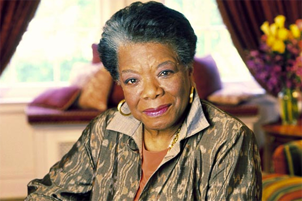
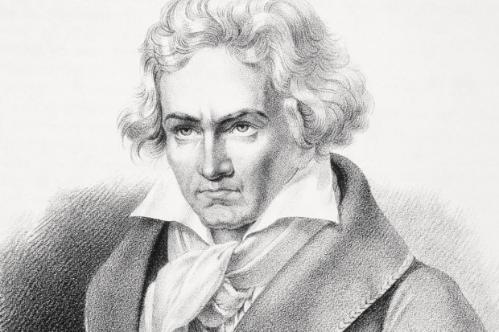
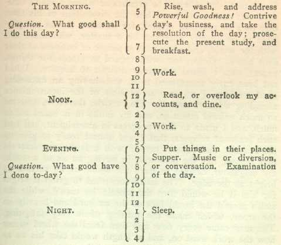

# 7 hábitos altamente produtivos de pessoas famosas

por 24 De Setembro De 2014[Multitasking](https://blog.todoist.com/pt/category/multitasking-2/), [Produtividade](https://blog.todoist.com/pt/category/produtividade/), [Técnicas](https://blog.todoist.com/pt/category/tecnicas/)

Cada uma das grandes personalidades do mundo – sejam escritores, líderes, atores, compositores ou profissionais de negócios – emprega formas únicas de manter sua produtividade (e que a gente já avisa desde já: são hábitos que podem perfeitamente serem integrados ao ritmo de vida de cada um de nós). Fomos pesquisar sobre alguns destes exemplos, e trazemos para vocês como alguns dos nomes mais reconhecidos da história conseguiam se manter em dia com suas enormes demandas de trabalho e como isso os ajudou a chegar onde eles estão.

**1. Maya Angelou**–**Separe os seus ambientes de casa e de trabalho**

Esta autora [era tão severa](http://fourhourworkweek.com/2013/12/16/beethoven-maya-angelou-francis-bacon/) no quesito separar sua vida em casa e no trabalho que, por anos, ela manteve um quarto de hotel alugado em sua cidade, para onde ela ia escrever todos os dias, de 7 da manhã às 2 da tarde. O quarto era bem espartano – as únicas coisas que ela permitia que estivessem por ali era a Bíblia, um jogo de cardas e uma garrafa de sherry – não havia espaço para nenhuma outra distração. Como uma mestra do “[uma tarefa de cada vez](https://todoist.com/blog/pt_br/como-trabalhar-como-multitarefa-atrapalha-nosso-cerebro-e-acaba-com-a-produtividade/)“, a diligência de Maya é que a levou a ganhar o Prêmio Pulitzer, o Tony Awards, três Grammys e muitos outros prêmios.

**2. Beethoven e Bergman**– **Acordar bem cedo, trabalhar até o meio-dia, e depois descansar:**

Assim como Maya Angelou, algo que acontecia com frequência entre muitos pensadores brilhantes e criativos visionários era um simples hábito: acordar cedo e começar o dia com tudo. Ludwig van Beethoven, Ingmar Bergman (um diretor/escritor/produtor sueco) e [todos estes escritores](http://www.brainpickings.org/wp-content/uploads/2013/11/sleepproductivitywriters_1500_1.jpg) mantiveram [esse mesmo calendário](http://www.theguardian.com/science/2013/oct/05/daily-rituals-creative-minds-mason-currey) por décadas: acordar antes das 8 da manhã, trabalhar intensamente até o meio dia, e depois tirar um tempo para um bom e longo almoço – e, no caso de Beethoven, [sair para dar uma caminhada](https://todoist.com/blog/pt_br/caminhando-para-uma-produtividade-maior/), e no caso de Bergman, curtir uma boa soneca.

**3. Benjamin Franklin**– **Registrava seus sucessos e frustrações diárias**

Tirar um tempo para fazer um resumo de como foi o nosso dia é um hábito de produtividade que Benjamim Franklin Taking the time to write out a summary of your day is a productivity habit that Benjamin Franklin jurava fazer sempre. Todos os dias, por volta das 21 horas, ele reservava um tempo para responder sua pergunta do dia “O que eu fiz de bom hoje?”. Outro fã desta atividade é o [Steve Rotkoff](http://www.csmonitor.com/2006/1024/p15s01-bogn.html "steve rotkoff"), um oficial militar da Inteligência, condecorado e muito criativo, que mantinha um diário de Haikus que detalhavam suas frustrações com os acontecimentos do dia anterior. Fazer este esforço de recapitular suas atividades do dia pode ajudá-lo a priorizar suas metas e a ter claro em sua mente o caminho para onde guiar o seu trabalho para as próximas 24 horas.

**4. Paul McCartney– Trabalhe suas limitações**

Assim como foi muito bem descrito no livro [“Outliers – Fora de série”](http://www.livrariasaraiva.com.br/produto/2609043/fora-de-serie-outliers/), de Malcolm Gladwell (aliás, recomendamos a leitura!), os Beatles alcançaram sua regra das “10 mil horas” necessárias para chegar ao sucesso – e o conseguiram porque tocaram por mais de 300 vezes em um ano (e isso por 4 anos seguidos) na mesma sala de concertos que ficava na Alemanha. Com tantas horas de música, eles puderam aperfeiçoar sua arte, e o faziam independentemente das condições. [Uma vez](http://www.clashmusic.com/feature/paul-mccartney-interview), Paul McCartney tocou usando uma guitarra para destros (ele é canhoto) – e nem isso pôde impedí-lo de se tornar, junto com sua banda, um dos melhores grupos de música de todos os tempos.

**5. Barack Obama– Elimine decisões desnecessárias:**

Ser o presidente de qualquer país já é uma tarefa complicada: ela traz de bônus uma lista sem fim de tarefas a cumprir, e certamente poucas delas são assuntos triviais ou fáceis. É por isso que o presidente americano Barack Obama faz todo o [esforço possível](http://99u.com/articles/7223/how-barack-obama-gets-things-done) para eliminar decisões desnecessárias – como por exemplo, o que comer ou o que vestir. Seus memorandos ainda incluem um formato muito simples de decisão: só está escrito “concordo”, “discordo” e “vamos discutir”. Enquanto ser um presidente de um país é jogar em um outro plano de decisões, o resto de nós pode, pelo menos, adotar este hábito de produtividade útil no nosso dia a dia, tornando as decisões mais fáceis – e isso vai desde fazer um planejamento semanal das refeições ou até já deixar escolhidas previamente as roupas de trabalho do dia seguinte.

**6. Kant, Dickens, Darwin– Exercícios na parte da tarde**

Se há uma coisa que é acaba sendo um senso comum ao lermos o cotidiano de atividades destas pessoas famosas, é a rotina adotada por uma grande maioria de trabalhar intensamente de manhã e deixar a parte da tarde reservada para outras atividades. Neste [quadro interativo](https://podio.com/site/creative-routines), vemos famosos criativos como Franz Kafka, Charles Dickens, Charles Darwin, e Richard Strauss tinham uma forte tendência a deixar a parte da tarde reservada para atividades físicas. É a equação perfeita: exercite seu cérebro de manhã, e seus músculos à tarde.

**7. Jerry Seinfeld****– Nunca quebre a corrente:**

Paul McCartney e os Beatles não foram os únicos a se tornarem famosos pelo mérito das suas performances recorrentes – Jerry Seinfeld, de fato, tem um [método de produtividade com o seu nome](https://todoist.com/blog/pt_br/como-escolher-o-melhor-mtodo-de-produtividade-que-combina-com-sua-personalidade/) pela mesma razão. No início de sua carreira, ele percebeu que a repetição era a chave para a melhoria, e disse que *“após alguns dias fazendo a mesma coisa, é como se você criasse uma corrente. Apenas continue fazendo isso, e a sua corrente vai crescendo a cada dia. E o melhor: você vai começar a gostar de olhar para esta corrente, especialmente se você vê que só faltam algumas semanas para você chegar naquela sua meta. Seu único objetivo é não quebrar a corrente”*. Gostou? Então [veja aqui](https://todoist.com/blog/pt_br/como-escolher-o-melhor-mtodo-de-produtividade-que-combina-com-sua-personalidade/) como integrar este método à sua vida.

Gostaram? Quais destes métodos de produtividade você incorporaria à sua rotina? Já tentou algum deles? Conte sua impressão nos comentários.
