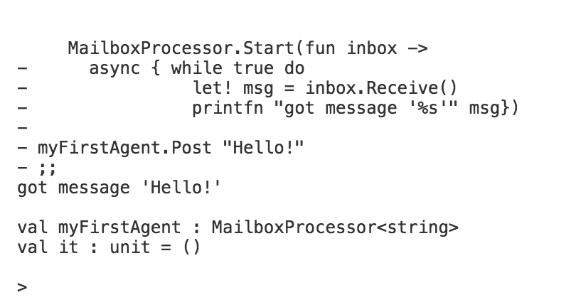
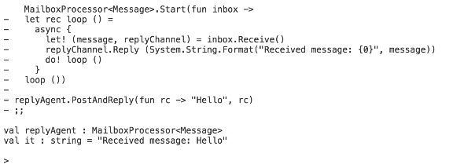
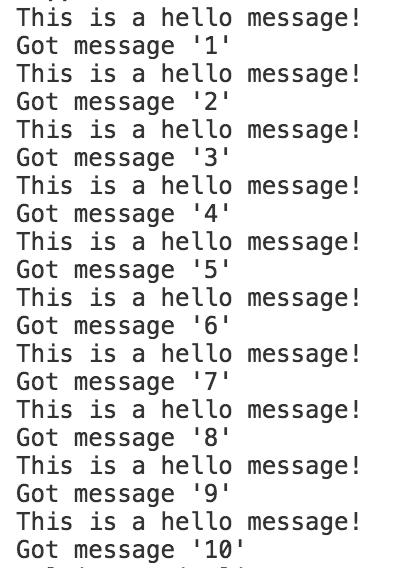
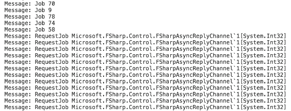
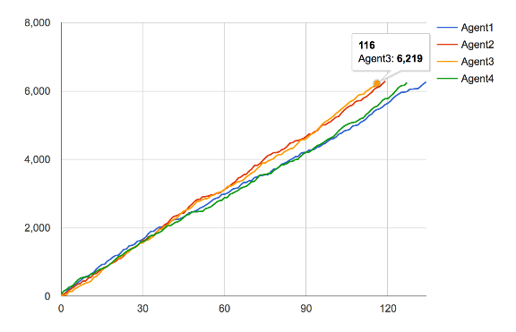
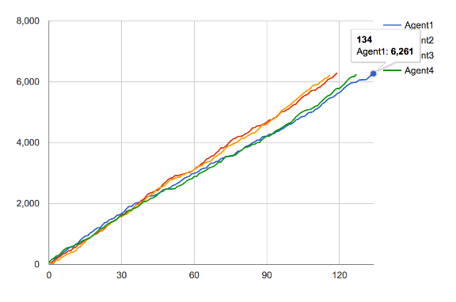

# Rachel Reese

Rachel Reese is a long-time software engineer and math geek who can often be found talking to random strangers about the joys of functional programming and F#. She currently handles training and evangelism for Jet.com in the NYC area, and has a habit of starting user groups: so far, in Hoboken, NJ (Pluralsight Study Group), Nashville, TN (@NashFSharp) and Burlington, VT (@VTFun). She's also an ASPInsider, an F# MVP, a Xamarin MVP, a community enthusiast, one of the founding @lambdaladies, and a Rachii. You can find her on twitter, @rachelreese, or on her blog: rachelree.se

## This article was published in:

There are many approaches to concurrency, but in this issue, I’d like to talk about the built-in way that F# can handle message-based concurrency: using F# mailbox processors.

## The Actor Model

To understand F# mailbox processors better, let’s look a little closer at the theory they’re based on: the actor model, which is also a prominent part of the Erlang programming language. There are a few key parts of the theory that can help you know when and why you should be using mailbox processors.

The Actor Model is a model of concurrent programming that uses actors as the base unit. These actors are lightweight constructs that contain a queue, and can receive and process messages. When I say lightweight, I mean lightweight—they’re not like threads. I can easily spin up 100,000 on my aging laptop without a hitch. An actor’s behavior is very limited. They can only:

- Create more actors
- Determine what to do with the next incoming message
- Send messages to another actor

There are also a few rules for the actor model itself:

- Actors can be created dynamically.
- The only interaction between actors is through direct asynchronous message passing.
- Messages must include the actor’s address.
- There’s no restriction on message arrival order.

A mailbox processor is based on a single actor. However, in general, you’ll want to create several actors as part of a system. Even one of the creators of the actor model, Carl Hewitt, has famously said, "One actor is no actor. They come in systems." I mentioned Erlang above as the first, and most faithful, representation of the actor model, because this gives you a good idea how to think about a whole system of actors. Erlang was developed for telephony applications, and you can think about a telephone as a single actor that can send messages (or make calls) to another telephone, as long as you have an address (telephone number). This analogy gives you a good working idea of how to build systems of actors, or mailbox processors.

Here’s one more note before I jump into code. The original model is called the actor model and uses actors. F#’s implementation of actors is referred to as mailbox processors, as I’ve mentioned. Actors and mailbox processors are also occasionally referred to as agents. For most uses, these terms are interchangeable.

For most purposes, the terms actor, mailbox processor, and agent are interchangeable.

## Your First Mailbox Processor

Now that I’ve just made the point that mailbox processors must come in systems, let’s look at how to construct a single one. First, there must be a name, in this case myAgent, which is the address of the mailbox processor. This is how you’ll be able to post a message to it to be processed, and in general, you’ll use **.Start** to instantiate and then start the mailbox processor immediately. Next, there’s a lambda function with an inbox containing an asynchronous workflow. Each message sent to the mailbox processor is sent asynchronously. They’ll also need to be processed in order, so there must be a loop. Here I’m using a non-functional **while...true** style loop. It’s perfectly fine to use this, or to use a functional, recursive loop.

Inside the loop is the heart of the mailbox processor. The first line waits for a message to be received. This code blocks the thread—you can’t really process a message until you have one! You also might notice the change to **let!** from **let**. The extra exclamation mark ensures that the computation is started immediately. Within an asynchronous workflow, a lack of exclamation mark creates an asynchronous object that will be processed later.

Finally, you can process the actual message itself. In this case, I’m just printing a string that’s been sent to it, but this section can get much more complicated.

```
let myFirstAgent =MailboxProcessor.Start(fun inbox ->async{whiletruedolet! msg = inbox.Receive()
               printfn "got message '%s'" msg})
```

Next, let’s post a message to this agent. You’ll use the agent’s address, **myAgent**, and call **Post** with a message. In this case, a simple Hello will do.

```
myFirstAgent.Post"Hello!"
```

The result here looks like **Figure 1**.



**Figure 1** : A first agent

I need to make a few comments before I continue. It’s common, but not always necessary, to declare the message type as part of the mailbox processor declaration. If you decide to declare it, setting up an agent looks like this:

```
let myFirstAgent =MailboxProcessor<string>.Start(fun inbox ->...)
```

## Common Patterns

Now that you have some experience with the basics, let’s look at a few more complicated patterns. For brevity’s sake, I’m only going to cover topics that I need for the final example code, which means I’m not going to cover, for example, error handling in this article, although I may in a future article.

### Replying

Previously, you’ve only seen how to create a mailbox processor and post to it, but F# also allows you to send a response back to the original agent. This can contain an acknowledgement that the message was received, or perhaps return a calculation that the agent had performed.

F# allows you to send a response back to the original agent. This can contain an acknowledgement that the message was received, or perhaps return a calculation that the agent had performed.

Let’s look at how you might create an agent that can send replies. With most agents, I’ll start by declaring a message type that the agent should take in. If the agent is sending a reply, this message type needs to contain both a standard incoming type as well as an **AsyncReplyChannel**, which is the mechanism used to make the reply. These will be sent in as a tuple. For this example, I’ll take in a string, and return a string.

```
type Message=string*AsyncReplyChannel<string>
```

Next, create the agent itself. In this case, for a simple example, I’m only going to format the string and respond with it on the **AsyncReplyChannel**. Much of this should look familiar. I’m creating an agent, which I start right away. There’s a lambda function creating the inbox, and in this case, I’m using a recursive style loop. I again have an internal asynchronous workflow and block to receive messages. However, because I’m receiving a tuple, I can immediately decompose it into the incoming message and the **AsyncReplyChannel**. In more complicated examples, you might have more processing come next, but here I’m going to immediately make use of the **AsyncReplyChannel** to respond with the reformatted message, and loop to the next message. Finally, I start the loop.

```
let replyAgent =MailboxProcessor<Message>.Start(fun inbox ->let rec loop ()=async{let!(message, replyChannel)=
        inbox.Receive()
      replyChannel.Reply(String.Format("Received message: {0}", message))do! loop ()}
  loop ())
```

To post to an agent that sends replies, you must use PostAndReply or PostAndAsyncReply rather than a simple post. You must also send along an **AsyncReplyChannel**.

```
replyAgent.PostAndReply(fun rc ->"Hello", rc)
```

The result looks like **Figure 2**.



**Figure 2** : Replying with an agent

### Scanning

Let’s look next at scanning. This is the option to scan a mailbox processor’s entire inbox for a certain message or type of message without processing every message in order. If the particular message is found, it’s removed from the inbox and processed ahead of the other messages.

Let’s modify the **myFirstAgent** mailbox processor from earlier to search specifically for messages that say "Hello!" and prioritize processing them. In this case, I’ll process the first "Hello!" message that I find, and then continue on with any messages in the regular queue.

Just before receiving the next message from the inbox queue to be processed, I’ll add an **inbox.Scan** function. This takes a lambda function that returns an **Option** type. The messages you want to be found during the scanning process should return **Some**, and the messages you want to ignore for now should return **None**. In this case, I want to search for messages that say "Hello!" and process them, so I use a match statement to discover those, and to print a different message. Once scan has found the first matching message, the code continues on to process the remaining messages from the queue. Each time the loop restarts, one "Hello!" message processes, and one other message processes.

```
let myFirstAgent =MailboxProcessor.Start(fun inbox ->async{whiletruedodo! inbox.Scan(fun hello ->
                match hello with|"Hello!"->Some(async{
                    printfn
                            "This is a hello "+" message!"})| _ ->None)let! msg = inbox.Receive()
              printfn "Got message '%s'" msg
     })
```

For example, I could send a list of messages to the agent all at once, starting with 10 other messages, and finishing with 10 "Hello!" messages, like so:

```
["1";"2";"3";"4";"5";"6";"7";"8";"9";"10";"Hello!";"Hello!";"Hello!";"Hello!";"Hello!";"Hello!";"Hello!";"Hello!";"Hello!";"Hello!"]|>List.map myFirstAgent.Post
```

Then I’ll end up with a response that alternates the messages, just like **Figure 3**.



**Figure 3** : Results from an agent that scans and prioritizes certain messages

## An Example

Now, let’s look at a longer example that combines a few of these patterns. I’ll create a coordinating agent, as well as four job agents. The agents start by requesting a workload from the coordinating agent, who’ll return the next job that it has in the internal queue. Now, for demo purposes, to simulate work here, I’ll have the job agents just perform a **Thread.Sleep**, but obviously they could handle a much more complicated task. When they’ve finished a workload, they’ll request a new job from the coordinating agent. Take a look at **Figure 4** to see the workflow. Finally, for fun, I’ll add an extra agent to track how many jobs each agent handled and how long the overall work took, and I can chart that.


**Figure 4**: The workflow for our agents project

Let’s start by creating the worker agents, as they’re the most simple. Because I’ll need to reuse this code for each new worker, I’ll pass in a **unit** value **()** so that a single worker instance isn’t reused for all four. By now, most of the rest of the code should look familiar. I’m creating a **MailboxProcessor** that accepts a **bool** type. There’s a recursive loop with an async workflow inside. This time, however, this **MailboxProcessor** doesn’t need to accept messages. The way that it gets jobs to run is by requesting them from the coordinating agent, using **PostAndAsyncReply**. This sends the **ReplyChannel** wrapped in a **RequestJob** type, so that the coordinating agent knows what type of message it’s receiving. Once the job is received, the worker sleeps for the allotted time and requests a new job.

```
letWorker()=MailboxProcessor<bool>.Start(fun inbox ->let rec loop ()=async{let! length =Coordinator.PostAndAsyncReply(fun reply ->RequestJob(reply))do!Async.Sleep length
        return! loop ()}
    loop ())
```

Now, because I’m creating four separate worker agents, let’s make things more fair. The first worker agent that’s created will have a little more time to start running jobs while the others spin up. So, I’ll post a message to the coordinating agent before the loop starts that this agent is ready.

```
letWorker()=MailboxProcessor<bool>.Start(fun inbox ->Coordinator.PostReadylet rec loop ()=async{let! length =Coordinator.PostAndAsyncReplyRequestJobdo!Async.Sleep length
        return! loop ()}
    loop ())
```

Next, let’s consider the coordinating agent. First, I’ll need a message type to pass it, which will need to contain both the **RequestJob** and the **Ready** messages that the Workers will be sending. **RequestJob** will use an **AsyncReplyChannel** to return an integer containing the length of time that the job should take.

```
type CoordinatorMessage=|Ready|RequestJob of AsyncReplyChannel<int>
```

But there’s one more consideration: I’ll need to give the coordinating agent a list of jobs. If I create a third message type, **Job**, which sends in an integer containing the length of time to work, I can handle this. In general, for a more complicated workload, you’d likely want to send a custom type with sufficient job information for the workers to handle running your job rather than an integer.

```
type CoordinatorMessage=|Job of int|Ready|RequestJob of AsyncReplyChannel<int>
```

Next, let’s look at the coordinating agent itself. The full code is available in **Listing 1**, but I’ll skip past the **MailboxProcessor** basics, and focus on just the internals of the async workflow. Before I jump in, note that I’m creating a second, internal queue to keep the jobs ready to be quickly sent back to the workers.

Now, within the async workflow, I need to gather the Ready messages. Here, I’m using a simple while loop to scan the coordinating agent’s inbox, waiting for four total messages. I’m pattern matching on the possible messages that I might see, using an option type to return None for the **Job** and **RequestJob** types, and simply counting the **Ready** messages until I have all four.

```
while count <4dodo! inbox.Scan(function|Ready->Some(async{count<-count+1})|Job l ->None|RequestJob r ->None)
```

Once that has completed, the coordinating agent waits for additional messages, and pattern matches on those. I’ll also have the agent print them to the console here, just to check how things are progressing. If it receives a message containing a job, it adds that to the job queue, and if it receives a message from a worker requesting a new job, it uses the **ReplyChannel** construct to send back the job at the top of the queue. Don’t forget that when a scan finds a match, the matching message is removed from the inbox, so there should no longer be any **Ready** messages arriving.

```
let! message = inbox.Receive()
printfn "Message: %A" message
match message with|Job length -> queue.Enqueue length
|RequestJob replyChannel ->
  replyChannel.Reply<| queue.Dequeue()|Ready->()
```

Don’t forget that when a scan finds a match, the matching message is removed from the inbox, so you’ll only be processing the messages you want.

Next, I only need to create some fake Job data to seed the coordinating agent. I’ll do this by initializing a sequence with 500 random numbers. Now, **rand.Next** is strangely inconsistent: the lower bound (1, in this case) is included in the mix, but the upper bound (here, 101) is not included. So the list contains random numbers from 1 to 100, inclusive. Then you iterate over those numbers and post them, as Jobs, to the coordinating agent.

```
let rand =newSystem.Random(941345563)Seq.init 500(fun _ -> rand.Next(1,101))|>Seq.iter (fun r ->Coordinator.Post(Job r))
```

Finally, you create the four instances of the worker agents.

```
letJobAgent1=Worker()letJobAgent2=Worker()letJobAgent3=Worker()letJobAgent4=Worker()
```

At this point, if you run your code, you’ll see messages quickly scrolling past your screen that should look similar to **Figure 5**.



**Figure 5** : The messages to the coordinating agent from the worker agents

Let’s go one step farther, and separate the data from each agent so that you could run some statistics on each worker. Maybe one is taking on a greater load, and you’ll want to look a little deeper into causes. For my purposes, I’m going to categorize the data as it passes through each worker in order to chart the number of jobs taken against the cumulative time it took to run the jobs, per worker. Once the data is categorized, I’ll pass it off to a third agent, the sorting data agent, which sorts the data into separate lists for each worker. From there, it’s just a few lines to chart what I have.

So, let’s start by looking at the sorting data agent message type. I’ll start here because I need to know how the data will be categorized for sorting in the sorting agent before I can actually categorize it in the worker agents. Because I want to simply split up the data from the four worker agents, creating a union with a type for each agent will work.

```
type SortDataMessage=|Agent1 of int|Agent2 of int|Agent3 of int|Agent4 of int
```

I’ll also need to create a **ResizeArray** for the set of values from each agent. I’ll have them take in a tuple containing both the length of the job and the position of the job (first, second, third, etc.).

```
let vals1 =newResizeArray<int*int>()let vals2 =newResizeArray<int*int>()let vals3 =newResizeArray<int*int>()let vals4 =newResizeArray<int*int>()
```

Next, let’s create the sorting data agent itself. It simply receives the messages and pattern matches on it. Each message is identified as coming from a specific agent, and all data from an individual agent is then sent to the relevant **ResizeArray**.

```
letSortData=MailboxProcessor<SortDataMessage>.Start(fun inbox ->let rec loop ()=async{let! message = inbox.Receive()
        match message with|Agent1 w -> vals1.Add(vals1.Count,w)|Agent2 x -> vals2.Add(vals2.Count,x)|Agent3 y -> vals3.Add(vals3.Count,y)|Agent4 z -> vals4.Add(vals4.Count,z)return! loop ()}
    loop ())
```

Finally, I’ll need to update the worker agent to send to the sorting data agent. You can see the full, updated agent in **Listing 2**. I’ll just outline the differences here. First, I need to add a parameter so that I know which agent is currently being used.

```
let worker whichagent =
```

This means that I need to update the code that creates the worker agents.

```
letJobAgent1=Worker1letJobAgent2=Worker2letJobAgent3=Worker3letJobAgent4=Worker4
```

Next, I need to convert the job length that’s received back from the coordinating agent. Because I want to be sure I’ve covered all cases, I add a final catchall case that throws an error. This way, if I add additional worker agents some day, this code throws an error, rather than simply not returning anything.

```
let byAgent =
        match whichagent with|1->Agent1 length
  |2->Agent2 length
  |3->Agent3 length
  |4->Agent4 length
  | _ -> failwith "Unknown agent"
```

Finally, I post the converted value to the sorting data agent.

```
SortData.Post byAgent
```

Now that I have the data I need in the four **ResizeArray**s, it’s time to make use of it. Because I want to chart the accumulated length of all the jobs against the number of jobs run for each agent, I need to start by compiling the data. So, let’s create a function to handle this for a single list, using a Seq.fold over the list. The way fold works is similar to map: by applying a function to each element of the list. However, fold also takes another argument, usually called an accumulator, to manage a state as that function is being applied. Let’s look at a simple example before you look at the function.

The way fold works is similar to map, applying a function to each element of the list. However, fold also takes another argument, usually called an accumulator, to manage a state as that function is being applied.

One common example is to use fold to sum a list. The function that fold requires takes two parameters: acc, the accumulator, and elem, the current element of the list that is being considered. Then, it sums the two numbers, with the accumulator set to 0 to start.

```
let sumList myList =
    myList
    |>Seq.fold (fun acc elem -> acc + elem)0
```

Now, back to compiling the data. I have a much more complicated fold function set up here. Rather than threading an accumulator that reduces down to a single value, like the example above, I’m using the accumulator to create a new list. So I’m passing in an empty list at the end.

Now, recall that the list of values is a list of tuples: the current count of jobs, and the length of the current job. I want to keep the order and the first numeric value the same for every tuple, but keep a running sum for the second, rather than the values. For example, I need a function that takes a list that looks like [(1, 5); (2, 10); (3, 25); (4, 15); (5, 5)] and turn it into [(1, 5); (2, 15); (3, 40); (4, 55); (5, 60)].

So the complile function takes in an accumulator, accList, just like the example, but also takes a decomposed tuple. I then create a tuple containing the order, and the result of this If-statement, which checks whether or not accList is empty. If it is, that’s because I’m working with the very first element in valueList. If this is the first element in valueList, just return the original length value as it was sent in, because there’s not yet anything to accumulate. If this is a later element in valueList, take the first tuple element from the accumulated list, accList, and take the second value from that tuple. This is the accumulating length value. Then add the current length value. Once the If-statement has been evaluated, the tuple is complete. Next, concatenate this tuple on to the accumulating list as the next value.

```
let compile valueList =
    valueList
    |>Seq.fold
      (fun accList (order, length)->(order,ifList.isEmpty accList
          then length
          else(accList.Head|> snd)+length)::accList)[]
```

Finally, let’s work with all the value lists that have been created. First, I call compile to transform the data. Then, I set up a combo chart, with a legend and corresponding labels. Finally, I set the types for the individual charts.

```
[vals1;vals2;vals3;vals4]|>List.map compile
|>Chart.Combo|>Chart.WithLegendtrue|>Chart.WithLabels["Agent1";"Agent2";"Agent3";"Agent4"]|>Chart.WithOptions(Options(series=[|for type in series ->Series(type)|]))let series =["line";"line";"line";"line"]
```



Figure 6: **Cumulative job** time by number of agents, per agent. Hovering over the Agent3 line, you can see that there were 116 total jobs run, in a total time of 6219s.



**Figure 7**: Cumulative job time by number of agents, per agent. Comparing to Figure 6, you can see that Agent1 ran far more jobs, 134 in total, but that the total time was approximately the same, at 6261s.
