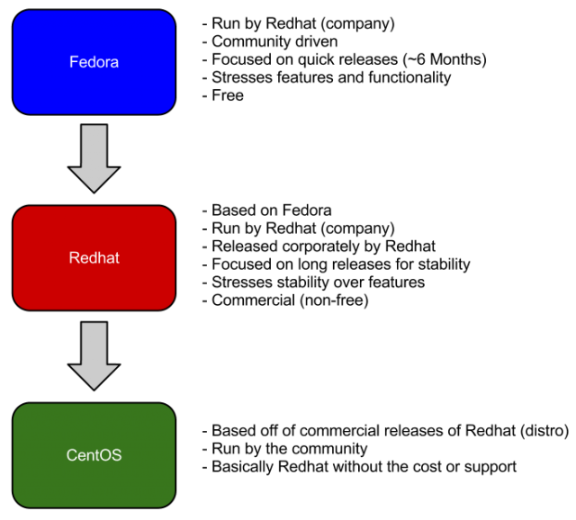

# The Difference Between Fedora, Redhat, and CentOS

[**Site Sponsor**: Netsparker — find vulnerabilities in your web applications before someone else does it for you.](https://www.netsparker.com/?utm_source=danielmiessler.com&utm_content=brand+name&utm_medium=referral&utm_campaign=generic+advert)

☞ Every Sunday I put out a curated list of the week's most interesting stories in infosec, technology, and humans. You can [subscribe to it here](https://danielmiessler.com/podcast/).

[ NOTE: For more primers like this, check out my [tutorial series](https://danielmiessler.com/study/). ]

People are often confused by the relationship between Fedora, Redhat, and CentOS. Are they the same company? Is one another version of the other? Which one is more up to date? Etc.

They go in order starting from the top, as shown in the graphic above.

1. **Fedora** is the main project, and it’s a communitity-based, free distro focused on quick releases of new features and functionality.
2. **Redhat** is the corporate version based on the progress of that project, and it has slower releases, comes with support, and isn’t free.
3. **CentOS** is basically the community version of Redhat. So it’s pretty much identical, but it is free and support comes from the community as opposed to Redhat itself.

Hope this helps.

CREATED: MAY 2011 | UPDATED: JAN 2015
