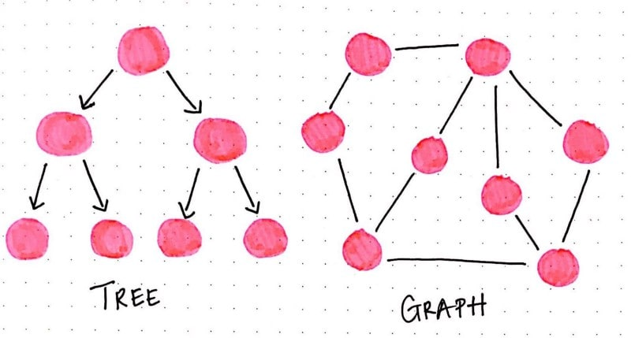
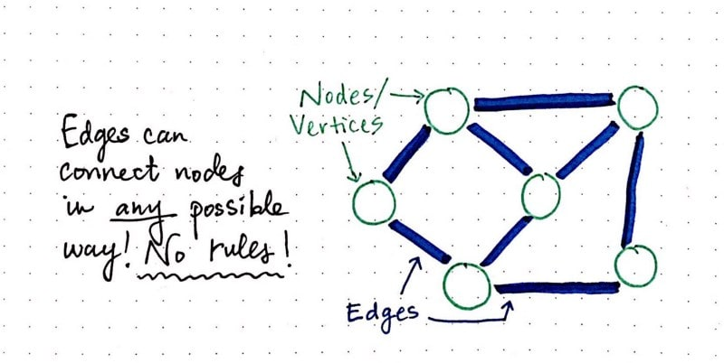
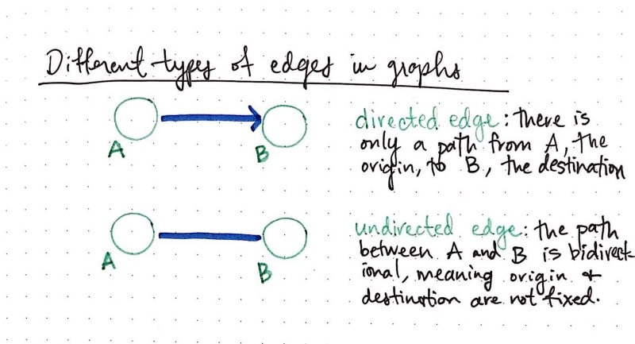
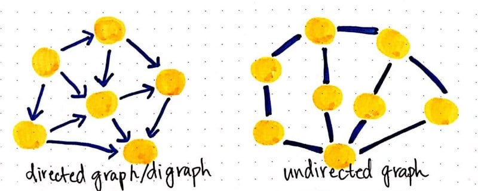
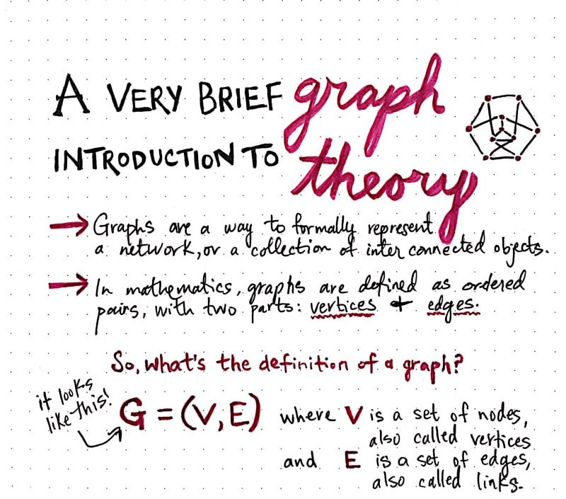
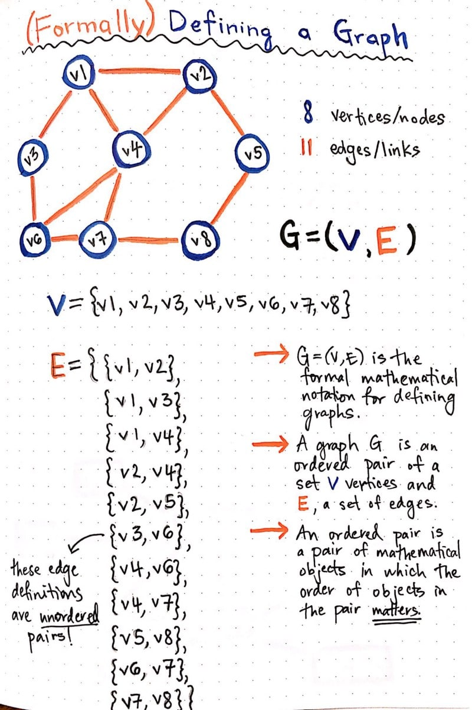
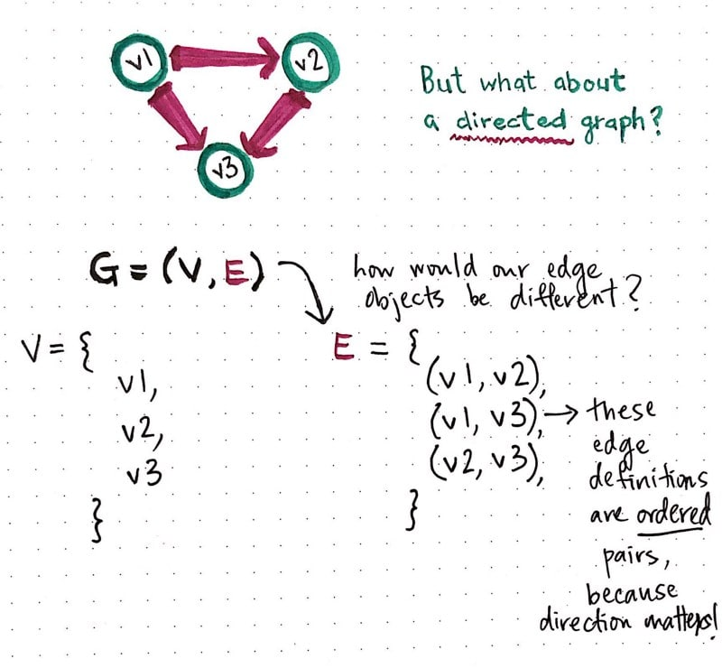
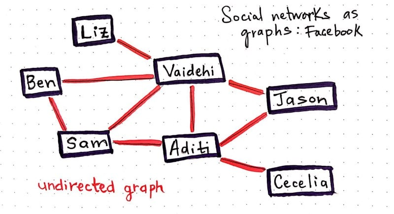
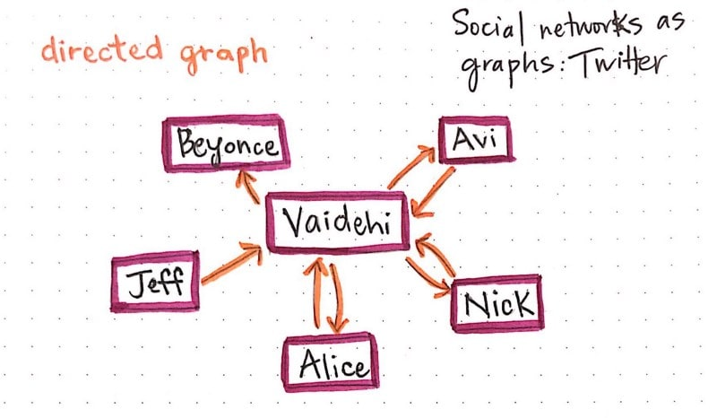

# A Gentle Introduction To Graph Theory

So many things in the world would have never come into existence if there hadn’t been a problem that needed solving. This truth applies to everything, but *boy, is it obvious* in the world of computer science.

Someone needed a way of keeping track of the order of things, so they played around with and created [different data structures](https://dev.to/vaidehijoshi/whats-a-linked-list-anyway) until they found the one that worked the best for the specific problem that they were trying to solve. Someone else needed a good way of storing data, so they played around with [different number systems](https://dev.to/vaidehijoshi/hexes-and-other-magical-numbers) until they found one that worked best for the kind of information that they wanted to contain. People needed a good way of labeling and processing tasks, so they found a way to [build upon the tools](https://dev.to/vaidehijoshi/to-queue-or-not-to-queue) they had and created a way to juggle all the things that one single system needed to do, at any given time.

Of course, computer science isn’t the *only* field to innovate and build upon what came before it, but I do think that it’s unique in one way: *computer science’s innovations rely and build upon its own abstractions.*

I’ve talked about abstractions a whole lot in this series, because ultimately, that’s what this series is *about*: finding the joy in the abstractions that lie beneath the things that all of us use, every single day. And, for what it’s worth, when I say “us”, I’m only partially talking about *us* as programmers, the producers of technology — I also mean *us* as users, the consumers of technology.

So, which amazing abstraction shall we learn about next? Well, now that we’re experts in tree data structures, it only seems right to understand where trees came from. Trees are actually a subset of something you might have already heard about: **graphs**. But in order to truly know why we use graphs and what they are, we’ll need to go deep down to the very roots of something that stems from discrete mathematics: **graph theory**.

If this is your very first foray into discrete math, fear not — it’s mine, too! Let’s tackle it together — and try not to lose our sanity in the process.

### Loosey–goosey graphs

When we first started looking at non-linear structures, we learned about their most fundamental characteristic: that their data doesn’t follow an order — at least, not an obvious numerical one, like we see in arrays or linked lists. Trees, [as we learned](https://medium.com/basecs/how-to-not-be-stumped-by-trees-5f36208f68a7#.hzdufmviz), start with a root node, and might connect to other nodes, which means that could contain subtrees within them. Trees are defined by a certain set of rules: one root node may or may not connect to others, but ultimately, it all stems from one specific place. Some trees have even *more* specific rules, like [binary search trees](https://medium.com/basecs/leaf-it-up-to-binary-trees-11001aaf746d#.x8kftrftl), which can only ever have *two* links to *two* nodes at any given time.

But what if we did something kind of crazy and just…threw these rules out the window? Well, as it turns out, we totally *can* do that! It’s just that we wouldn’t be dealing with trees anymore — we’d be dealing with something called a **graph**.

> Trees are nothing more than restricted types of graphs, just with many more rules to follow . A tree will always be a graph, but not all graphs will be trees.

So, what is it that makes a tree different from the large umbrella of graphs?

Well, for one thing, a tree can only flow in one direction, from the root node to either leaf nodes or child nodes. A tree can also only have one-way connections — a child node can only have one parent, and a tree can’t have any loops, or cyclical links.

With graphs, all of these restrictions go straight out the window. Graphs don’t have any concept of a “root” node. And why would they? Nodes can be connected in any way possible, really. One node might be connected to five others! Graphs also don’t have any notion of “one-directional” flow — instead, they might have direction, or they might have no direction whatsoever. Or, to complicate matters further, they could have some links that have direction and others that don’t! But we won’t get into that today.

Let’s stick with the simple stuff to start.

### Graphs with direction, and graphs without

Okay, so we know that graphs pretty much break all the rules that we know. However, there is one characteristic that every graph *must* have: every graph always needs to have, at the very least, one single node. Just as how trees need at least one root node in order to be considered a “tree”, similarly, a graph needs at least a single node in order to be considered a “graph”. A graph with just one node is usually referred to as a **singleton graph**, although we won’t really be dealing with those.

Most of the graphs we’ll be dealing with are a bit more complex. But, don’t be worried — we won’t be diving into the *super complicated* graphs today. And trust me, some graphs really are complicated!

Instead, let’s look at the two types of graphs that are pretty easy to spot, and also pretty common in graph theory problems: directed graphs, and undirected graphs.

As we know, there are no real rules in the way that one node is connected to another node in a graph. Edges (sometimes referred to as *links*) can connect nodes in *any* way possible.

The different types of edges are pretty important when it comes to recognizing and defining graphs. In fact, that’s one of the biggest and most obvious differentiators between one graph and another: the types of edges that it has. For the most part (aside from one exception, which we won’t cover today), graphs can have two types of edges: a edge that has a direction or flow, and an edge that has no direction or flow. We refer to these as *directed* and *undirected* edges, respectfully.

In a **directed edge**, two nodes are connected in a very specific way. In the example below, node A connects to node B; there is only *one* way to travel between these two nodes — only one *direction* that we can go. It’s pretty common to refer to the node that we’re starting from as the *origin*, and the node that we’re traveling toas the *destination*. In a directed edge, we can **only travel** **from the origin to the destination**, and never the other way around.

However, it’s an entirely different story with undirected edges. In an **undirected edge**, the path that we can travel goes both ways. That is to say, the path between the two nodes is *bidirectional*, meaning that **the origin and destination nodes are not fixed**.

This differentiation is actually pretty important, because the edges in a graph determine what the graph is called. If all of the edges in a graph are *directed*, the graph is said to be a **directed graph**, also called **digraph***.* If all of the edges in a graph are *undirected*, the graph is said to be — you guessed it — an **undirected graph**! Go figure, right?

This is all very cool, but at this point, I want to know two things — where did all of this graph stuff *come from*, exactly? And…why should we care?

Let’s investigate.

### Tread lightly: we’re in graph country now

Computer science loves to borrow stuff. More specifically, it has borrowed a lot of concepts from logic and mathematics. As it turns out, this is the case with graphs.

Graph data structures as we know them to be computer science actually come from math, and the study of graphs, which is referred to as **graph theory**.

> In mathematics, graphs are a way to formally represent a network, which is basically just a collection of objects that are all interconnected.

As it turns out, when computer scientists applied graph theory to code (and ultimately implemented graphs as data structures), they didn’t change a whole lot. So, a lot of the terms that we use to describe and implement graphs are the exact terms that we’ll find in mathematical references to graph theory.

For example, in mathematical terms, we describe graphs as **ordered pairs**. Remember high school algebra, when we learned about *(x,y)* ordered pair coordinates? Similar deal here, with one difference: instead of *x* and *y*, the parts of a graph instead are: ***v***, for *vertices*, and ***e***, for its *edges*.

The formal, mathematical definition for a graph is just this: **G = (V, E)**. That’s it! Really. I promise.

But hang on a second — what if our graph has more than one node and more than one edge! In fact…it will pretty much *always* have multiple edges if it has more than one node. How on earth does this definition work?

Well, it works because that ordered pair — *(V, E)* — is actually made up of **two** **objects**: a *set* of vertices, and a *set* of edges.

Okay, that makes more sense to me now. But it would be a whole lot clearer if I had an example and actually wrote out the definition of a graph! So we’ll do just that. In the example below, we have an undirected graph, with 8 vertices, and 11 edges.

So what’s going on here?

Well, we wrote out our ordered pair *(V, E)*, but because each of *those* items is an object, we had to write those out as well. We defined *V* as an *unordered* set of references to our 8 vertices. The “unordered” part is really important here, because remember, unlike trees, there is **no hierarchy of nodes**! Which means that we don’t need to order them, since order doesn’t matter here.

We also had to define *E* as an object, which contains a bunch of edge objects within it. Notice yet again that our edge objects are also *unordered*. Why might that be? Well, what type of graph is this? Is there any direction or flow? Is there a fixed sense of “origin” and “destination”?

Nope, there’s not! This is an *undirected* graph, which means that the edges are bidirectional and the origin node and destination node are *not* fixed. So, each of our edge objects are also **unordered pairs**.

This particularity, of course, leads us to wonder: what if this were a **directed** graph? Time for another example! Here’s a directed graph, with three vertices and three edges:

The way we define the vertices here doesn’t look any different, but let’s look more closely at our edge definition. Our edge objects in this case are *ordered* pairs, because direction actually matters in this case! Since we can only travel from the origin node to the destination node, our edges *must* be ordered, such that the origin node is the first of the two nodes in each of our edge definitions.

Cool, so that’s how we define graphs. But…when would we ever actually *use* graphs? Well, you probably used one today. You might just not know it yet! Time to change that.

### Super social graphs

Graphs are all around us, we just don’t always see them for what they are.

In fact, by the very act of reading this post, you are *literally on a graph right now.* The web is a massive graph structure! When we click between websites and navigate back and forth between URLs, we’re really just navigating through a graph. Sometimes those graphs have nodes with edges that are undirected — I can go back and forth from one webpage to another — and others that are directed — I can only go from webpage A to webpage B, and never the other way around.

But there’s an even better example that beautifully illustrates our daily interactions with graphs: social networks.

Facebook, a massive social network, is a type of graph. And if we think more about it actually functions, we start to better understand *how* we can define, and exactly what *type* of graph it is. On Facebook, if I add you as a friend, you must accept my request. It’s not possible for me to be your friend on the network without you also being mine. The relationship between two users (read: nodes or vertices in graph terms!) is *bidirectional*. There’s no concept of an “origin” and a “destination” node — instead, you’re my friend and I am yours.

Can you guess what type of graph Facebook is implemented as?

If you guessed *undirected graph*, then you’re right! Well done. Relationships are two-way, so if we were to define Facebook’s friend network as a graph, its edges would all end up being unordered pairs when we wrote them out.

Twitter, on the other hand, works very differently from Facebook. I can follow you, but you might not follow me back. Case in point: I follow Beyonce, but she definitely does not follow me back (sadly).

We could represent Twitter as a *directed* graph. Each edge we create represents a *one-way* relationship. When you [follow me on Twitter](https://twitter.com/vaidehijoshi), you create an edge in the graph with your account as the origin node, and my account as the destination node.

So what happens when I follow you back? Do I change the edge you created when you followed me? Does it suddenly become bidirectional? Well, no, because I could unfollow you at any given point. When I follow you *back* on Twitter, I create a second edge, with *my* account as the origin node and yours as the destination.

The same model applies to dev.to, as well, which lets you follow and unfollow authors! In fact, this network model is *all over the place*. And all it is, once we abstract all the layers away, is a graph. And truly, what a powerful thing it is.

### Resources

Lots and lots of entire *books* have been written about graphs. I certainly didn’t cover enough information here to fill a book, but that doesn’t mean you can’t keep learning about graphs! Fill your mind with more graph theory awesomeness, starting with the great links below.
