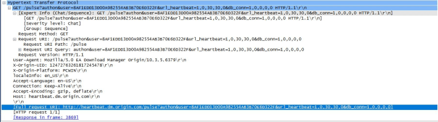
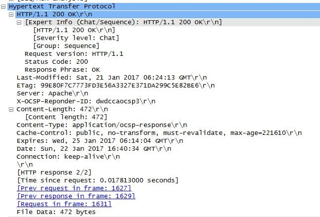

# How Not to Screw Up Your DevOps Interview

### 

[devops-interview-loadbalancers](https://dev.to/t/devops-interview-loadbalancers)

I screwed up a tiny bit. I went into an interview unprepared. What’s worse is that I was unprepared for the part I should have known all about. The technical portion.

Admittedly it wasn’t as bad as I’m projecting it to be. I think I at the very least knew enough to ask some interesting questions. Always gives the impression that you’re paying attention to the interviewer. However there was some rudimentary subjects in the field of DevOps that I was not as versed as I believed I was. As a result there were some glaring gaps in the answers I was able to provide.

On a good note my interviewers were great guys who had been in the tech field for almost a combined twenty years. They really knew their stuff and was able to walk me through some of the fundamentals surrounding web app infrastructure and administration. Quick tip if you don’t know the answer to a question, as odd as it may sound; I do think that that best way to approach it would be to ask what the answer is. Possibly you’re not what they’re looking for as far as experience and knowledge goes however, just asking “that I’m not sure about, what exactly are you asking about?” Isn’t a crime to me. Granted, I’m not someone who routinely interviews people however one of the most important things in the tech field (and life in general) is an inquisitive mind. With the knowing what they were asking you could do some homework and maybe be just a little more prepared for your next interview.

My interviewers took me through how a web app is distributed across multiple servers. I’d like to write a little about that subject so maybe some of you reading this may be a little better prepared for your DevOps interview.

The most important thing to an internet based business is up time. To an internet facing business downtime can mean real dollars just flying by. It is their prerogative to make sure that the site is up at all times (or at least 99.99999% of the time). For every time a potential customer goes to that site and sees something wrong that is a customer they no longer have. So it is vital that the site is up and running as efficiently as possible. Below are some of the ways that can be achieved.

**HTTP Requests and Load Balancing**

When you type a URL into a web browser, what happens? You type in a URL, you hit enter an HTTP request is sent to the DNS server. See this tutorial on how a domain name is resolved with a host name. When the client finds the IP address to query the client sends an HTTP request to the web server (usually on port 80, which is the default port for web traffic. However, these days most good sites are using some encryption so they would be using port 443 which is for Secure Socket Layer traffic) containing the client info, IP address info, and remote server info. Here you can see an example of a header:

On a regular WordPress site for example Apache, or whichever web server software your server is using, will send a response with some information from the client on the server. Specifically the response code telling us that they are alive and are going to send the HTML (response code 200 is the default message from a web server that the request was successful) to the client. Below is an example of the response:

The code for the site is transmitted using a couple different strategies. However you can refer to the HTTP handlers for how it is done. The default handlers will just send over the static code located in the directory indicated. Usually an address of [http://www.example.com](http://www.example.com/) will serve from internally var/www/web/ or something similiar. These days most web apps handle everything programmatically or dynamically. For example a Ruby on Rails app will refer to the routing scripts to return HTTP handlers.

You will also get the same response from a server running from a load balancer server however the internal traffic from that server is slightly different. With a regular server it’s going to serve the HTML. When you hit a load balancer it acts as a traffic cop proxying out the connections to different servers in their server cluster.

This solves a couple of problems. It is a way in which to have several servers serve one host name and one IP address. It is also a way to be able to route millions of requests and maximize up time for the website.

There are two types of load balancers software and hardware based. The hardware based units are built and loaded by the proprietors. They are built with specialized hardware engineered to take on the amount of incoming traffic. Software load balancers are far more flexible and can be installed on regular hardware. One that I know of and have seen come up in job openings mention software such as NGINX. I’ve also seen other version from Kemp, and Zen. Windows Server has their own load balancer as well.

When setting up your load balancer there are a few algorithms used for deciding where your traffic will go.

**Round Robin** – When the load balancer sends the traffic in sequential order

**Least Connections** – When the load balancer sends traffic to the unit with the least amount of current connections.

**IP Hash** – When the IP address of the client wishing to hashed and is routed to a selected server for that hash.

**Historical Analysis** – When the balancer sends traffic based on number of open connections and response time of the nodes.

Now if you have only one server that’s routing traffic you’ve created a nasty choke point should that unit go down. So traditionally you would want to have a backup running for redundancy.

**Virtual IPs**

So when DNS resolves a hostname to an IP address that website only gets one IP address so how are we able to spread the load over different servers when you only have one IP address to give out? Virtual IPs are what a load balancer can use to sort traffic coming in. With a virtual IP you can have addresses for each server in your cluster with the load balancer using the public address. Similar to subnetting, Network Address Translation allows for each of the nodes in the cluster to have it’s own internal IP address with the client seeing only the IP address of the hostname it started looking for.

There are a couple ways in which to achieve this. One way is using CARP or Common Address Redundancy Protocol. It works by having a set of hosts that are running a set of IP addresses. It is useful for ensuring redundancy. If one host goes down another can take over without a service using the host noticing. Another implementation is using Proxy ARP. Which essentially uses tunneling to proxy incoming traffic.

**Conclusion**

DevOps is the marriage of systems and development. What was covered here is only a small portion of the breadth of duties involved in the job. The only things that I covered were the things in which I had issues explaining, and the people I interviewed with were gracious enough to help me with them.

We went over a myriad of technologies and procedures. A Lot of which can be found in various interview question articles I will list below. I was happy that I was able to leave the interview knowing more than when I came in. The guys who i spoke to were very accommodating. I have no assumptions on whether or not they will pursue my candidacy. However I do have just a little more knowledge so that if these questions were to come up again, I will be prepared.

**DevOps Interview Questions**

<https://www.quora.com/What-are-some-good-interview-questions-for-a-DevOps-position>

<https://github.com/spikenode/DevOps-Interview-Questions>

<https://www.edureka.co/blog/interview-questions/top-devops-interview-questions-2016/>

**Further Reading**

<https://devcentral.f5.com/articles/back-to-basics-least-connections-is-not-least-loaded>

<https://www.nginx.com/resources/glossary/load-balancing/>

<https://www.liquidweb.com/kb/understanding-load-balancing/>

<https://doc.pfsense.org/index.php/What_are_Virtual_IP_Addresses>

<https://en.wikipedia.org/wiki/Proxy_ARP>

<https://en.wikipedia.org/wiki/Common_Address_Redundancy_Protocol>

<https://en.wikipedia.org/wiki/Virtual_IP_address>

<http://www.doesconsulting.com/faq.shtml>
