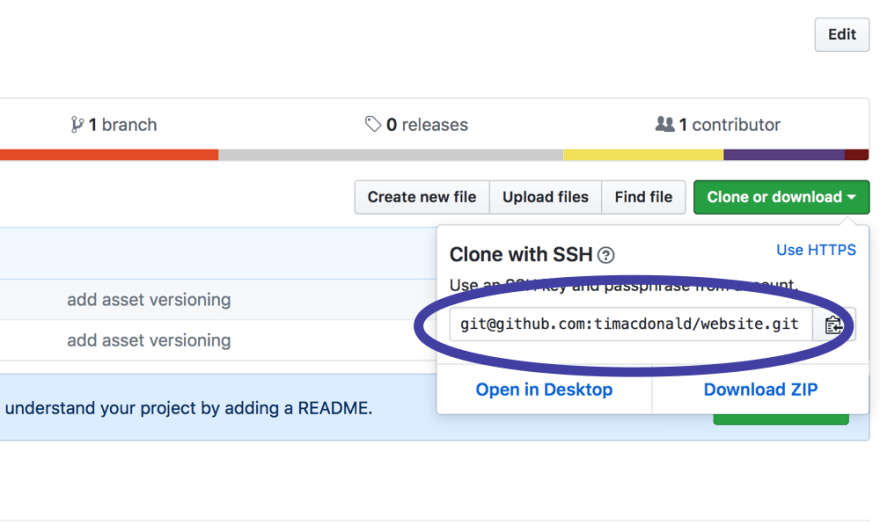

# Writing a Zero Downtime Deployment Script

### 

[shell-script](https://dev.to/t/shell-script)

Having never written a shell script before, I thought I'd try and level up by writing a simple deployment script for my website and my clients websites. The outcome: FlipIt™

Over the past year I've become more and more familiar with the terminal and (a limited set of) the commands that are possible. Swapping out GitHub Desktop app for the Git terminal commands and learning about moving around, manipuating files, VIM (read: I use Nano) and other possibilities in this new world, I was now ready to tackle something new: writing a shell script.

What originally drew my attention to doing some shell scripting was hearing that Adam Wathan of [Full Stack Radio](http://www.fullstackradio.com/) originally wrote [Nitpick CI](https://nitpick-ci.com/), his PSR-2 coding standard app, in PHP but later converted it to shell scripts. I thought: *"Dang! I should check out some shell scripts and learn when they come in handy"*.

After putting in a bit of Googl'ing and Stack Overflow'ing, I've hit the nail on the head and got my simple script running. Pretty stoked!

## Zero Downtime Deployment

Something that has been bugging me recently is my website deployment setup for myself and my clients. I want to be able to run a single command to retrieve the new site from the Git respository and then run any composer commands or additional shell commands neccessary (e.g. compiling assets with Laravel Mix).

The problem with running these commands after deploying from a repository is that it all takes time, and it means that for however long all these commands take to run, the site is in an incomplete state for any requests that come through.

Enter: **Zero Downtime Deployments**

The idea here is that you can run all these commands and while they are running the previous site is still active. Once the commands have finished running and the new version of the site is ready for visitors, the site delivered to the user is switched out seamlessly with the new one.

There are plenty of tools out there to do this for you. Check out [Envoyer](https://envoyer.io/). But what developer ever thought: *"Hey it exists so I don't have to build it myself"* ...right?!?

## FlipIt™ Commands

Yes...I named it 😎

### Creating a Deployment Directory

The first step is to create a directory in which the fresh git respoitory will be cloned into. I used to just use `git pull` command, but this meant that there would be some downtime. Ain't nobody got time for dat.

From the server root we will create the directory structure `flipit/deploys/UNIX_TIME`. [Unix time](https://en.wikipedia.org/wiki/Unix_time) is simply the seconds since midnight 1970. This structure will mean that each time we create a new deployment directory this number will be different and we will be able to determine the order of the directories easily.

To create this directory structure, we need to run the following shell commands:

```
# Create a variable to store the unix time.
# As 'date +%s' itself is a command, we need to tell the system to interpret it
#   as a command and not simply a string. To do this we can wrap the command in
#   parenthesis and prepend it with the '$' sign, e.g. $(COMMAND_HERE).
UNIX_TIME=$(date +%s)

# Create a variable and store the path to this new deployment, we'll need it
#   later.
DEPLOYMENT_DIRECTORY=./flipit/deploys/$UNIX_TIME

# Make the directory. To learn more type 'man mkdir'.
# The -p flag tells the system to also create any intermediate directories.
# To utilise our 'DEPLOYMENT_DIRECTORY' variable we append the '$' sign.
mkdir -p $DEPLOYMENT_DIRECTORY
```

If at any point you want to trouble shoot and check the value of the variables you create, you can output their value by using the `echo` command, e.g. `echo $DEPLOYMENT_DIRECTORY`. Also, if any of these commands are confusing, or you'd like to know more about them, you can bring up the manual by typing `man COMMAND_HERE`, e.g. to learn more about the `mkdir` command type `man mkdir`.

**Pro Tip:** if you're all 😱 and can't get out of the manual, type `q` to exit the manual! Took me a few tries to work that one out 👍.

So now we have our directory ready to roll. We are killing it! 🙏

### Cloning Our Repository to Our Deployment Directory

If you've been working with Git for a while, this step is what you've probably done a thousand times before. We are going to get our system to clone our respository from GitHub into our deployment directory, rather than just using `git pull` into the existing cloned respository, which is usually live...and would cause downtime...but I regress.

**Note:** You will need to have setup SSH keys for this to work seamlessly. Github have a [help section](https://help.github.com/articles/connecting-to-github-with-ssh/) to guide you through the setup process. When I was new to all this, I didn't really get SSH keys, but having spent a bit of time working it all out, it's a great help and makes things so much easier.

To make this magic happen, we will first need to get the repository URL from GitHub:

[](https://res.cloudinary.com/practicaldev/image/fetch/s--GPT5Wr7a--/c_limit,f_auto,fl_progressive,q_auto,w_880/https://timacdonald.me/assets/img/posts/github-repository-url.png)

and then run the following shell commands:

```
# Create our repository variable.
# You should of course clone your repo...not mine.
GIT_REPOSITORY=git@github.com:timacdonald/website.git

# Clone our respository and pass the deployment directory as the destination
#   in which to store the repository.
git clone $GIT_REPOSITORY $DEPLOYMENT_DIRECTORY
```

Once this has run, we now have our fresh respository waiting for us in our deployment directory. Navigate into the folder to check it out. It is finally time to FlipIt™!

### Switch Out the Current Site, Instantly!

This step is basically just creating a shortcut, just like you would on your computer when you might create a shortcut on your desktop to an application you use, or a file you are constantly editing. We are going to tell the system to create a shortcut from our public directory to our deployment directory. Switching this shortcut is what gives us the *zero downtime*.

Now in my repository I have a `public_html` directory which has my current site ready for deployement. If this was a [Laravel](http://laravel.com/) installation, my preferred framework of choice, the repositories public directory would simply be `public`.

I'm running my site on [shared hosting](http://www.panthur.com.au/members/aff.php?aff=318) that's located in Sydney, Australia (sorry for the response times international visitors, not sorry) that has a few restrictions (as shared hosting tends to do), which means that I'm building my site on my development machine and keeping the current working files in the Git. I'll probably work on this and get it setup so I can run all the build and asset compilation steps as a part of this script, but let's take it [one piece at a time](https://www.youtube.com/watch?v=ws-_syszg84). My server has a `public_html` directory, which is the public area of the server. Some servers might have a `www` directory or a `public` directory, or something similar.

So, what does that all mean. That means that I am going to link my servers `public_html` directory to my repositories `public_html`. Make sure you're sitting down, let's make some magic:

```
# Create my servers 'public' directory variable.
# You can change this to whatever your server provides.
SERVER_PUBLIC_DIRECTORY_PATH=public_html

# Create my repository 'public' directory variable.
# For a Laravel installation, swap 'public_html' with 'public'.
REPOSITORY_PUBLIC_DIRECTORY_PATH=public_html

# Make a link...oh I mean FlipIt™
# The -s flag tells the system to make a [symbolic link](https://en.wikipedia.org/wiki/Symbolic_link). This is important
#   and also very handy for a lot of things. If you've ever used [Laravel Valet](https://laravel.com/docs/5.4/valet)
#   before, you've been creating symbolic links! Well worth investigating.
# The -h flag tells the system not to follow any symbolic links. This was doing
#   my head in I ended up with ./public_html/public_html links! Inception!
# the -f flag tells the system that if a link already exists, remove it and add
#   this link instead.
ln -s -n -f $DEPLOYMENT_DIRECTORY/$REPOSITORY_PUBLIC_DIRECTORY_PATH $SERVER_PUBLIC_DIRECTORY_PATH
```

Now our servers `public_html` directory is ACTUALLY a shortcut to our repositories `public_html` directory.

✨ **MAGICAL** 🦄

Let's wrap that all up together now.

```
# You should change these variables to suit your setup...
SERVER_PUBLIC_DIRECTORY_PATH=public_html
GIT_REPOSITORY=git@github.com:timacdonald/website.git
REPOSITORY_PUBLIC_DIRECTORY_PATH=public_html

UNIX_TIME=$(date +%s)
DEPLOYMENT_DIRECTORY=./flipit/deploys/$UNIX_TIME

mkdir -p $DEPLOYMENT_DIRECTORY
git clone $GIT_REPOSITORY $DEPLOYMENT_DIRECTORY
ln -s -n -f $DEPLOYMENT_DIRECTORY/$REPOSITORY_PUBLIC_DIRECTORY_PATH $SERVER_PUBLIC_DIRECTORY_PATH
```

## Converting Commands To A Script We Can Run

You don't want to have to remember all this and type it everytime, plus have to change the variables for every server you own, so instead, let's make this into a script you can call and run from your local machine to FlipIt™ on your remote server, providing the directories and url as arguments.

### Making and Running a Script File

To create a script file we could use a text-editor, but while we are doing commands, let's use the terminal to do it. First we need to create a file, but we will also need to allow the file to be executed.

```
# Create a file called 'flipit.sh'.
touch flipit.sh

# Change the permissions of the file to make it executable.
chmod +x flipit.sh
```

Now you can open the `flipit.sh` file in your text-editor of choice and fill it out as we go.

### Adding Arguments

Shell scripts allow you to provide flags like `-p`, as you've seen above, but also arguments. As a example, say we want to call a script that does some kind of logging in, and we can provide a username and password, it might look something like this, where my username (`-u`) is `tim` and my password (`-p`) is `password1`:

```
./login.sh -u tim -p password1
```

As we are going to provide our url and directories as arguments when we call the script, we need to add a little bit of extra code to our script, that I found online. Being new to scripting and the syntax, I get what this new block is doing but it's a copy and paste job...it loops through the provided arguments and allows you to use the values provided by the user. In our case, we are just going to set our `SERVER_PUBLIC_DIRECTORY_PATH`, `GIT_REPOSITORY` and `REPOSITORY_PUBLIC_DIRECTORY_PATH` variables in this loop.

So let's move our variable creation into our loop that detects the provided arguments. Becuase we are going to save this script as a file, we will also need to tell the system what type of script it is by adding `#!/bin/sh` at the top of the script file so that the system knows how to interpret the commands, just like our HTML `<!doctype html>` at the beginning of a HTML file tell the browser how to interpret the HTML it's about to parse.

```
#!/bin/sh
while getopts r:g:s: option
do
    case "${option}"
    in
        r) GIT_REPOSITORY=${OPTARG};;
        g) REPOSITORY_PUBLIC_DIRECTORY_PATH=${OPTARG};;
        s) SERVER_PUBLIC_DIRECTORY_PATH=./${OPTARG};;
    esac
done

UNIX_TIME=$(date +%s)
DEPLOYMENT_DIRECTORY=./flipit/deploys/$UNIX_TIME

mkdir -p $DEPLOYMENT_DIRECTORY
git clone $GIT_REPOSITORY $DEPLOYMENT_DIRECTORY
ln -s -n -f $DEPLOYMENT_DIRECTORY/$REPOSITORY_PUBLIC_DIRECTORY_PATH $SERVER_PUBLIC_DIRECTORY_PATH
```

Once this is in place, these values can be provided by calling:

```
# Exectue FlipIt™.
# The -s argument provides the servers public directory.
# The -r argument provides the repository url.
# The -g argument provides the git repository public directory...I know it's terrible naming.
./flipit.sh -s public_html -r git@github.com:timacdonald/website.git -g public_html
```

## Calling The Script Locally, But Executing On A Remote Server

The last piece of my puzzle was to be able call the script on my local development machine, but have it login to the remote web server and execute the script on a remote server. Because I have my development and web server matched up with SSH keys, I can easily SSH in and run these commands, but now I want the script to SSH into my server and execute the script automatically.

Just to reiterate, learning about SSH'ing into servers has been a very helpful skill. I've [added my server to my `.ssh/config` file](http://nerderati.com/2011/03/17/simplify-your-life-with-an-ssh-config-file/) so I can call `ssh timacdonald` to SSH into my web server without having to provide the login details each time.

So now I just need to be able to get my script to SSH in and run the script. Luckily for us, we can pass the script as a string and pass it as an argument to the `ssh` command. To do this we'll wrap the script to run in a [heredoc](https://en.wikipedia.org/wiki/Here_document#Unix_shells). Let's see what that would look like:

```
#!/bin/sh
while getopts r:g:s: option
do
    case "${option}"
    in
        r) GIT_REPOSITORY=${OPTARG};;
        g) REPOSITORY_PUBLIC_DIRECTORY_PATH=${OPTARG};;
        s) SERVER_PUBLIC_DIRECTORY_PATH=./${OPTARG};;
    esac
done

UNIX_TIME=$(date +%s)
DEPLOYMENT_DIRECTORY=./flipit/deploys/$UNIX_TIME

# SSH into the server and run script.
# The -tt flag will mean that the scripts output will be returned to our console
#   so we can see if it was successful, otherwise we don't get the console output.
# The script provided in the heredoc will be executed on the remote server
ssh -tt timacdonald <<REMOTE_SCRIPT
mkdir -p $DEPLOYMENT_DIRECTORY
git clone $GIT_REPOSITORY $DEPLOYMENT_DIRECTORY
ln -s -n -f $DEPLOYMENT_DIRECTORY/$REPOSITORY_PUBLIC_DIRECTORY_PATH $SERVER_PUBLIC_DIRECTORY_PATH

# Close the connection
exit

REMOTE_SCRIPT
```

Of course, you will probably want to make the host an argument the user can provide also so that it is not harcoded into the script.

And that's a wrap on my goal - *Nailed It*! This is really just an exercise for me to wrap my head around shell scripting and the basics of how it comes together, but I'm really happy with the outcome. Now I can run the script and have my site updated to the latest commit with zero downtime, and if you're reading this post - it WORKED 💪.

## What's Next

- I'd like to add a rewind option to flip back to the previous deploy incase something goes wrong.
- Having an `init` option for FlipIt™ that stores the repository and folder variables in a config file so that after the initial `init` command is called, you no longer need to provide the folder and url arguments.

## Notes

- For my purpose this is zero downtime, however I'm not 100% it's an atomic swap. You should really just use Envoyer for any serious production stuff, this is just a toy.
- This is working for my setup, but different servers might have different setups and the code may not execute as expected. I'm running these commands on my development Mac. I'm not expecting this to 'just work' for you, but hopefully in following along you learnt some things, I know I did!
- The script does not currently clean up after itself i.e. after many deploys you may start to fill up your web server. For now you will want to manually clear out old deploys from the deploy directory. In the future I might add a cleanup script to remove the older deploys...or you could just use Envoyer.
- I've just worked this out through trial and error. Dig into shell scripting, it's a different world and good fun experimenting with - makes you feel like a programming guru at the cafe as well 🤓.
- If you are running something like Laravel and wish to run any additional command, such as `composer`, `artisan` or `npm` commands, you can slot them in before the symbolic link is made, but make sure it's not AFTER the link is made, otherwise our Zero Downtime is gone e.g.

```
...

git clone $GIT_REPOSITORY $DEPLOYMENT_DIRECTORY

# Run composer install in the deployment directory before link is flipped
composer --working-dir=$DEPLOYMENT_DIRECTORY install

ln -s -n -f $DEPLOYMENT_DIRECTORY/$REPOSITORY_PUBLIC_DIRECTORY_PATH $SERVER_PUBLIC_DIRECTORY_PATH"

...
```

We'll you made it this far, so it you'd like to discuss anything about the article, or criticize my lack of knowledge, please feel free to hit me up on [Twitter](https://dev.to/timacdonald/%7B%7B%20site.twitter_url%20%7D%7D).

## Links

- [GitHub Respository](https://github.com/timacdonald/flipit) - Please feel free to contribute and make it better!

---

## Updates

The always awesome [Matt Stauffer](https://twitter.com/stauffermatt) added a [great tip](https://twitter.com/stauffermatt/status/847564955729534976) to this. When cloning the respository, add a *depth of 1* i.e.

```
git clone --depth 1 $GIT_REPOSITORY $DEPLOYMENT_DIRECTORY
```

This will ensure that only the latest version of the files is downloaded, instead of including every revision of every file in the respositories history. Thanks Matt!

Originally published: [Writing a Zero Downtime Deployment Script](https://timacdonald.me/writing-a-zero-downtime-deployment-script/).
