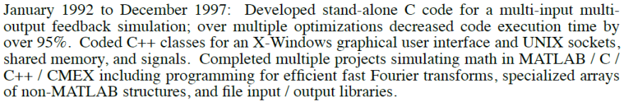
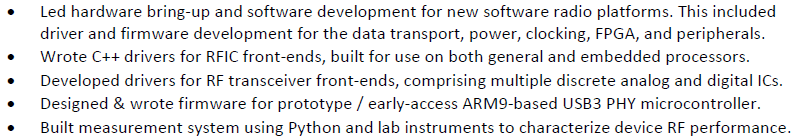

# Writing an Awesome Resume

*Originally posted on my blog, here: [Creating an Awesome Resume](https://bhilburn.org/creating-an-awesome-resume/). It has been shortened for this post.*

I read **a lot** of resumes as the R&D manager for Ettus Research. After several years of staring at job applications, my biggest take-away is that **most engineers are terrible at writing resumes and cover letters.**

This is not a great situation for the candidate, nor the employer. Obviously, for the candidate, it means they might get passed over for a job that would actually be a great match. For the employer, it makes it even more difficult to locate good talent. At the end of a day of resume reading, my biggest fear is that one of the resumes in my "don't follow-up" pile is from the very best applicant in the lot, but I just didn't realize it. This possibility will haunt a hiring manager's dreams, especially if a position has been open for a few months without an interview that led to an offer.

It's fairly common knowledge that resumes, as a tool for sourcing candidates, are really poor. I've [written about this before](https://bhilburn.org/hiring-is-hard/), and then [wrote about it again](https://bhilburn.org/update-on-hiring-its-still-hard/). If you have access to a hiring pipeline that isn't reliant on resumes (e.g., contributions to an open-source project), that is almost always the better route for both hiring managers and job-seekers. But, pragmatically, resumes are a standard part of current recruiting procedures, and having a good one can make a difference in the opportunities available to you.

**Disclaimers:** Firstly, my R&D hiring experience is entirely in the world of computer science and electrical & computer engineering (e.g., software, hardware, FPGAs and digital design, signal processing, etc.,), so that's what I'm going to talk about. Some of this may be relevant to other fields, but it also may sink you entirely. Any job that requires an artistic portfolio, for example, is a completely different process compared to what I'll talk about, here. Secondly, the advice in this post is entirely my personal view - there may be hiring managers out there that disagree with me. That said, I think my subjective opinion on this matter is objectively the right one `;)`

### General Advice

Before we get into specifics, let's cover some general strategy. **The key to good resume writing is to tune the content to the needs of hiring pipelines.** In most cases, there are three audiences for an engineering resume, and your resume & cover letter will progress through the pipeline in this order:

1. A less-technical 'sourcer', HR rep, or head-hunter.
2. A technical hiring manager.
3. Very technical experienced engineers.

Your resume should catch the attention of the folks at the hiring portal (#1), convince the hiring manager (#2) that your application warrants a follow-up, and then provide background and talking points for a technical interview to both the hiring manager (#2) and the engineering team (#3). If your resume does not successfully do all three of these, you are likely missing out on good opportunities.

Sometimes you can bypass the first part if you know someone at the company, or if the company is small enough that it doesn't have full-time recruiters looking for people. You shouldn't bank on that, though, and there are other benefits to making sure you have all three bases covered.

The next big point is that **your resume must accomplish this as quickly as possible, with as little content as possible.** This may sound surprising at first, but hiring managers do not want to read a 5-page journal article to figure out if you *may* be a good match. This does not mean that you can't provide lots of detail in your resume (and you want quite the opposite, actually). What it means is that **your resume should be formatted and presented in a way that makes it easy to locate and understand the key points on the page.** Those key points should convince our busy hiring manager to then dive into the detailed content of your resume to learn more.

### Sections / Topics for Your Resume

The first decision you need to make in designing your resume is what sections or topics you will list in your resume. There are some that are categorically required (i.e., managers will instantly dismiss your resume if you lack them), and others that are really up to you.

Here's a list of what I consider to be **required** resume sections, in no particular order:

1. **Personal / Contact Information:**
2. **Objective or Summary Statement**
   - You should have **one** of these, but not both. This is an XOR function.
3. **Education**
4. **Technical Skills**
5. **Experience / Work History**

### One Page or Multiple

I adhere to a very strict philosophy on this. **One page is a resume, multiple pages is a curriculum vitae (CV).** The key thing to keep in mind, here, is that **a resume isn't meant to be your exhaustive professional history.** Minimalism can be a very beautiful thing.

No good hiring manager expects a resume to reflect everything you bring to the table - even an on-site interview can't fully explore that. Your resume is a summary. It's a conversation starter. It's effectively your pick-up line for employers. Once the conversation is going, sure, then you can talk about your 24 publications and 20 years of job history - but you don't need to include all of that on your resume. Plus, by keeping your resume focused, it makes it easier to highlight what's important.

Many resumes also contain a tremendous amount of redundant content - cutting this text out makes it much easier to get down to one page. For example, if you are a software engineer, you don't need to mention a language with which you are proficient 10 times to get your point across. List it in your technical skills list, and then leave it out of specific work experience descriptions unless it's really necessary.

Remember, if you have hidden the details of what makes you a strong candidate in 3 pages of work history, the hiring manager will probably dismiss your resume before ever unearthing these details.

### The Golden Rule of Resume Writing

If there is a 'Golden Rule' for resume writing, it is this: **you should be able to discuss, in detail, anything that is on your resume.** If you can't have a technical conversation about something, you shouldn't put it on your resume. Period.

Good hiring managers and interviewers will work off of your resume; as mentioned above, your resume is a tool for guiding conversation. If the conversation reaches something on your resume and you aren't actually able to speak about that topic knowledgeably, it brings the entirety of your resume into doubt.

Just as you wouldn't compromise your own integrity, don't sacrifice the integrity of your resume to make it look like you know more than you do. Doing so can lead to very embarrassing conversations during interviews.

### Specific Advice

Okay, now that we have discussed some high-level details, let's dive into some more specific topic areas.

#### The Objective Statement

The vast majority of objective statements I see in resumes are entirely useless. Most of them read something like:

```
Objective:
To obtain a job where I can use my skills, experience, and strong 
work ethic to solve challenging problems in a team environment.
```

This tells me *nothing* about you or what you are looking for. Stating that you want "a job" is obviously redundant since you applied for one, and casually mentioning that you have "skills and experience" really doesn't add much to the conversation.

If you would like to include an objective statement, I recommend covering these points:

1. What type of employment do you want (full-time, part-time, contractor, etc.,)?
2. What type of role do you want (developer, designer, manager, etc.,)?
3. Do you have any special requirements (work location, travel, etc.,)?

Here's an example of something I would consider a useful objective statement:

```
Objective:
A full-time position as a senior hardware designer, located in 
the Raleigh-Durham metro area.
```

The latter statement has a third less verbiage than the first, and yet communicates more about what you are looking for. Breaking it down, it calls out each of these:

- full-time position
- senior-level role
- hardware designer
- located in the Raleigh-Durham metro area

Not all resumes need an objective statement. If you don't have a lot of 'hard' requirements for your position, you should consider eschewing the 'objective' statement for a 'summary' statement.

#### The Summary Statement

Summary statements are a great alternative to objective statements if your job search is a little less constrained in terms of exact role or geographic area. The most common mistake I see in summary statements is expanding them into a summary *paragraph*. Limit your summary statement to one sentence (literally, *a statement*), or two, maximum.

Here's an example of what I would consider to be a good summary statement:

```
Summary:
A full-stack software engineer with a strong background in embedded 
systems and bare-metal development, looking for new opportunities as 
a technical manager or senior developer.
```

The summary statement is also a great place to explain a shift or change that you are looking for, which may be difficult to communicate elsewhere in your resume. For example, in the summary statement above, we can see that this developer may be interested in moving in the direction of technical management, depending on the opportunity. Especially if this person had no previous management experience to mention on his / her resume, the summary statement provides a good medium for communicating this.

#### Personal Information

For the most part, listing contact information is straight-forward. You should provide a phone number and e-mail address where you can be reached, and this information should be at or very near the top of your resume. A few things to keep in mind:

- Absolutely do **not** list an e-mail or phone number associated with your current employer. I have seen this before, and it screams that you don't have a good understanding of workplace etiquette.
- You should read [this Oatmeal comic, "What your email address says about you"](http://theoatmeal.com/comics/email_address).
- If you have a LinkedIn page or personal website, be sure to include it!

#### Grammar

This should be obvious, but the number of resumes (and cover letters) I see with grimace-worthy grammar errors is flabbergasting.

And you can't rely on automated checkers for the nitty-gritty stuff, because there are plenty of things they won't catch. Are you really a `principle` engineer rather than a `principal` engineer? Because the former sounds horribly boring. Did you really work on all `faucets` of a design rather then the `facets`? Because someone only needs so many faucets.

You get the idea.

Have multiple people review your resume for you. Print it out and highlight every single word as you read it. Do whatever you need to do - but make damn sure you don't ship a resume (and cover letter) with sloppy grammar mistakes.

#### Technical Skills

Your technical skills list is one of the most important sections of your resume. In fact, I would say it is **the most important section**, excepting your contact information (for obvious reasons). There are plenty of people without a college degree that are rock-stars in a technical field. Your list of technical skills will frame the rest of your resume.

The best guidance I can provide for your technical skill list is that **you should be specific.** Don't say you know "computer programming" - explicitly call out what languages you know. Don't say you know "CAD tools" - specifically name what tools you have used. Being generic in your skill list makes it seem like you are attempting to hide a lack of proficiency, and it makes it very difficult for the hiring manager to determine whether or not you are a good fit. In most cases, as discussed above, this will result in a dismissal of your resume.

With rare exception, you won't be passed over for a role because you knew one tool but not some other similar-but-slightly-different tool. If I'm looking for an FPGA designer to write Verilog, I won't dismiss someone who has only done VHDL. If I'm looking for a HW designer in an Altium toolflow, I won't dismiss someone who has only worked with Mentor Graphics.

Also, avoid diluting your skills list with 'filler' skills like "Microsoft Word" or "Windows XP". Including items like these makes it seem like you are really grasping at straws to think of things you are good at, which doesn't reflect well on you. Focus on important, relevant, hard technical skills for the job you want.

Lastly, there's what I call 'meta skills'. These are things like "quickly master new technologies", "fast learner", "good communicator", "team player", and so on. These are almost universally a waste of space in a resume - these don't describe you in a differentiated way. Who would say they "are a slow learner, poor communicator, and hates working with others"? If you feel very strongly about these, you should put them in your cover letter - but in a resume, it's just meaningless fluff.

#### Education

Listing your education is always important, but the importance of the details wane the longer you have been out-of-school. If you are a fresh graduate, you should absolutely list:

- Degrees (and anticipated graduation date)
- Major(s) & Minor(s)
- GPA
- Relevant Coursework

As a new grad, you probably won't have much professional experience to distinguish yourself from other candidates, so your performance in school will have an elevated importance.

After several years in industry, though, what you have done post-graduation is far more important than details like your GPA. Once you reach this point, I recommend shortening your education section to:

- Degrees
- Major(s) & Minor(s)

If you graduated with distinction (e.g., [summa|magna|] cum laude), be sure to **always** include this. It is an achievement worth listing, even many years after graduation. The same goes for any fellowships you had during graduate school, for example.

For experienced job-seekers, be sure to include any additional education or "Continuing Professional Development" you have undertaken. This obviously includes any additional collegiate degrees, but also includes certifications like [PMP](http://www.pmi.org/Certification/Project-Management-Professional-PMP.aspx) or [Six Sigma](http://www.pmi.org/Certification/Project-Management-Professional-PMP.aspx).

#### Experience

The experience section(s) usually consumes by far and away the majority of the page real-estate. And while I'll be the first to say that [experience is not a requirement to be good](https://bhilburn.org/a-keystone-of-success/), it is obviously one of the most important aspects of your resume.

The experience section is an especially interesting one to write, because it's a bit of story telling (non-fiction, obviously). Reading about someone's experience tells you how they spent a large part of their time, potentially over a significant part of their lifetime. Further, the manner in which you detail your experience, whether professional, academic, or hobbyist, will shape the story it tells - just like a good novel.

There are generally three different types of experience that you might want to list (mentioned above):

- Work / Professional / Industry
  - The usual stuff - your previous jobs.
- Academic / Research
  - I think it's often useful to separate this from industry experience, especially if it's part of any graduate school work you did.
- Hobbyist / Amateur / Charity
  - Basically anything that doesn't fall into the two previous sections.

Explaining your experience is an art-form. You want to communicate as much as possible with as few words as possible. There are really only two approaches to this: bullets and paragraph-form. Either can work well, as long as you craft the language carefully. Personally, I prefer bullets.

Regardless, I don't think there are any hard rules about doing this `right`, but there are some rules-of-thumb that I think are helpful:

- Start each item with a verb.
  - Examples: Designed, Programmed, Wrote, Led, Developed, Managed, etc.,
- If you are using bullets, keep each to a single line where possible.
  - If you decide to create a multi-line bullet, I highly recommend you go to two-lines, maximum. Larger than that, and you are likely trying to pack too much information into a single point.
- Avoid collisions. Try to make each bullet about a discrete project or job responsibility you had. Don't be redundant across multiple bullets.
  - Example: If one bullet says, "Led design team" for some product's development, and the next bullet says, "Managed deliverables" for the same product, you've got a collision. The former implies the latter.
- Be specific about the technologies / designs you worked with - demonstrate knowledge about the projects you list.

Here are some examples of job experience sections from resumes:

This is a good example of a paragraph-form experience from my colleague [Michael Dickens](https://www.linkedin.com/in/michaelldickens/). Note that each sentence starts with a verb, he is specific, demonstrates knowledge, and avoids collisions:

[](https://res.cloudinary.com/practicaldev/image/fetch/s--HOmty_E8--/c_limit,f_auto,fl_progressive,q_auto,w_880/https://thepracticaldev.s3.amazonaws.com/i/nrs0b7y9mw1cp9qs7jv5.PNG)

And here is an example from a previous version of my own resume. Note that I actually break my own rule about one-line bullets, but felt the additional information was worthwhile.

[](https://res.cloudinary.com/practicaldev/image/fetch/s--kTzcAUEi--/c_limit,f_auto,fl_progressive,q_auto,w_880/https://thepracticaldev.s3.amazonaws.com/i/2990hso8uz023l1mnmaq.PNG)

Because there is necessarily so much verbiage in your experience sections, it will be the hardest section to get right. When updating your resume, you will more than likely spend the majority of your time editing and refining your experience section. If done well, though, I assure you it's worth it.

#### Publications and Patents

Publications and patents are a great way to distinguish yourself professionally and technically in your field. The problem is that if you have a lot of them, there really is no way to fit them onto your resume. If you are in this boat, I recommend adding a one-liner that effectively tells the hiring manager that you have publications and/or patents that are relevant, and then listing each one in detail in your **CV**.

This allows you to highlight an important accomplishment in your professional history and discuss it at the appropriate time, but still keep your resume focused.

#### Side Note: Artistic Touches

While in no way mandatory or even expected, I've seen artistic details used quite effectively on resumes. When done well, they are a creative way to differentiate yourself from "the stack", and help establish a personal brand. This is something that I've never tried to do with my own resume, actually, but admire when I see others do it skillfully.

Some good avenues for adding a dash of creativity to your resume are in the formatting and method of content presentation. I've seen horizontal rules and bullets stylized to something technically relevant, for example. Many resumes typically have a lot of whitespace that provides potential real-estate for creative additions. I have also seen personal logos used to great effect when they fundamentally communicate something about that person. My colleague, Marcus Müller, [has a great one](https://github.com/marcusmueller) that communicates signal processing expertise, for example.

### Cover Letters

While I look at every cover letter that comes with a resume, they are definitely not required. **If you are looking for job opportunities by personally contacting managers or recruiters, a cover letter is a requirement.** Not including one is essentially the equivalent of calling someone and then just rambling off your skills. A cover letter provides context, and sometimes that is just necessary.

If you are applying to a job through an automated web portal or job site (e.g., [Monster](http://www.monster.com/), [Dice](http://www.dice.com/), [TheLadders](http://www.theladders.com/), [Indeed](http://www.indeed.com/)), I generally don't think a cover letter is a requirement.

If you don't necessarily have to provide a cover letter, there are still some great advantages to doing so. Cover letters are a great way of sharing a detailed description of what you are looking for, explaining why you are looking for a new job, and even just communicating your awesome personality. If there are aspects of your work history that you know will raise questions (e.g., "Why didn't you have a job for two years?"), you can also head those off in your cover letter.

That said, you can very easily sink your application by writing a sloppy cover letter. If you are providing a cover letter, be **absolutely certain that your spelling and grammar are perfect.** While a cover letter can tell a hiring manager a lot about how great you are, it can also tell the hiring manager that you are terrible at communicating in writing; in a business world driven by online messaging, that's a big problem.

A cover letter can be a huge boon, but it can also be a double-edged sword. Just be sure you wield it with finesse `=)`

### Actually Applying to a Job

Now that you have an amazing resume (and perhaps a cover letter), it's time to actually apply to a job! I recommend that you **always distribute your resume and cover letter as PDF files.** Sending out docx files, or anything else really, exposes you to the risk that your resume will be horribly formatted when someone looks at it with anything but the tool you used to create it.

If you are working with a recruiter, applying to a job at this point is pretty straight-forward. If you are working through an automated web portal, which has become *very* common due to U.S. government reporting requirements, things can be a bit trickier. Here are a couple of tips:

- Many automated portals will try to convert your PDF files into plaintext. Be ready to create a plaintext version of your resume. If it looks okay in a plaintext editor (e.g., Notepad), then it will look okay in the system.
  - Be sure to still upload your PDF resume, though, as nearly all of these systems allow the hiring manager to download the "original PDF file".
- Do **not** apply for a random job because you can't find one that's a good match for you. I see this all the time. Example: You are an FPGA Engineer, you know Acme Inc. has FPGA roles, but you can't find any advertised on their site - so, you apply to a DSP Engineering role, instead, just to "get your resume into the system". Usually, this will result in your resume being auto-disqualified. Yes, seriously. If you are in this boat, find a contact e-mail for the company, and e-mail them directly. It's the only way to be sure your resume actually gets *seen*.

Lastly, it may take a while for someone to get back to you. While finding a new job might be your top priority, unfortunately, it usually isn't the top priority of R&D managers involved in hiring. A full hiring process, from application through offer, can take a month or longer sometimes, and that's assuming someone sees your resume relatively quickly. Even if you aren't hearing back quickly, keep your spirits up `=)`

### Good Luck!

Job hunting and interviewing can be a stressful and anxiety-inducing experience. I hope the content of this post helps you navigate your job search, and [good luck!](https://www.youtube.com/watch?v=9uKIeamPi2Y)
