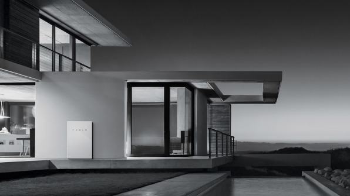
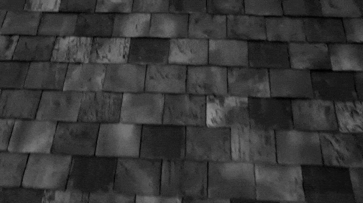
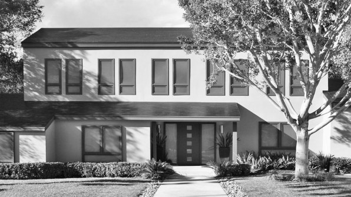
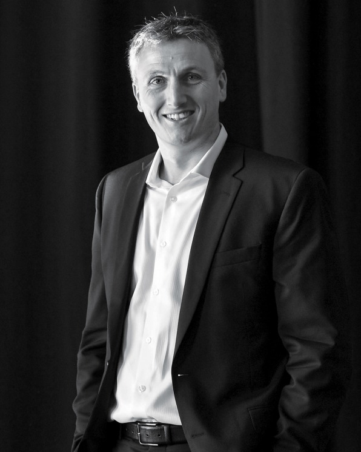
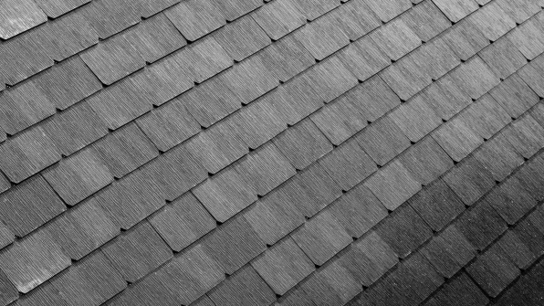

# The Real Story Behind Elon Musk’s $2.6 Billion Acquisition Of SolarCity And What It Means For Tesla’s Future–Not To Mention The Planet’s

## The Tesla CEO’s merger with his cousins’ sustainable-energy company, SolarCity, is totally logical–and hugely risky. With eyes now on the private sector for environmental leadership, can Musk pull off another miracle?

[Illustration: [Lola Dupré](http://loladupre.com/); Source Photo: Justin Chin/Bloomberg/Getty Images]

[By Austin Carr](https://www.fastcompany.com/user/austin-carr)

Elon Musk stands in the middle of a residential street. It’s shortly before sunset at a joint Tesla–SolarCity product launch, held last October at Universal Studios’ back lot in Los Angeles, and Musk, wearing a Gray sweater and black jeans, is perched on a platform erected in the center of the manicured suburbia that served as the set for *Desperate Housewives*. Musk begins his presentation with doom and gloom—rising CO2 levels, the crisis of global warming—but the audience of 200 or so is beaming. They’re excited to see what fantastical invention he will unveil as a solution. As he stresses the need to transition the world to sustainable energy, an overzealous attendee yells out, “Save us, Elon!”

Musk’s big reveal: “The houses you see around you are all solar houses. Did you notice?” he says, gesturing toward the homes with a grin. They appear to have regular shingled rooftops, but Musk says they’ve actually been retrofitted with a new product called the Solar Roof, a potentially transformative system that’s nearly indistinguishable from a traditional rooftop—and one, he promises, that lasts longer and costs less, all while generating electricity. “Why would you buy anything else?” he says. The crowd cheers.

These roof tiles are the latest component of Musk’s larger plan to wean us off fossil fuels. Inside the garage of each of these homes, he points out, is a Tesla vehicle and next-generation Powerwall, the sleek rechargeable battery Tesla developed in 2015 to store energy for household use. During the day, the solar shingles can generate electricity and recharge the Powerwall. After the sun goes down, the battery takes over, providing power independent of the traditional utility grid. “This is the integrated future. You’ve got an electric car, a Powerwall, and a Solar Roof. It’s pretty straightforward, really,” he says with a big shrug and a smile. “[This] can solve the whole energy equation.”

Musk’s announcement is about saving the planet. But it’s also about saving SolarCity, the company his cousins, Peter and Lyndon Rive—who are in the audience—launched with Musk’s support in 2006 to bring solar power to the masses. The business, an industry-rallying success for nearly a decade, had recently run into challenges. Its stock, once unstoppable, had dropped roughly 77% since its February 2014 peak. Its debt had mushroomed to $3.4 billion, sales growth had slowed, and it faced a cash crunch. Last June, Musk proposed that Tesla acquire SolarCity in a deal valued at $2.8 billion. Today’s event was staged largely to win over Tesla and SolarCity shareholders, who would be voting in three weeks on whether to approve the merger.

Tesla is betting that its Powerwall battery, combined with its Solar Roof tiles, will entice the design-conscious set. [Photo: courtesy of Tesla]

There was a lot for shareholders to think about—and even more for corporate governance experts and company analysts to scrutinize. Tesla’s and SolarCity’s boards and investors represent a weave of overlapping interests, both financial and familial. Six of Tesla’s seven directors have clear ties to SolarCity. Tesla’s board includes SolarCity’s former CFO, a SolarCity director, and two VCs whose firms also have seats on SolarCity’s board, along with Musk’s brother, Kimbal. Musk chairs both companies and is SolarCity’s largest shareholder. He has taken out $475 million in personal credit lines to buy more shares in SolarCity and Tesla when advantageous. SpaceX, his aerospace company, has purchased $165 million in bonds issued by SolarCity. Some analysts cautioned that Musk might be self-dealing, rescuing his own investments and his cousins’ company through this purchase. Hedge-fund manager Jim Chanos, who had shorted Tesla and SolarCity, called the acquisition a “shameful example of corporate governance at its worst,” a “bailout” of SolarCity that “strikes us as just the height of folly.”

Musk’s investors, though, have grown accustomed to naysayers. They know his actions are often fraught with risk, but they believe in his mission—and his products. Three weeks after Musk’s presentation, 85% of shareholders approved the Tesla–SolarCity merger, an outcome even more impressive considering that the first Solar Roof tiles wouldn’t be installed on a real customer’s home for at least another seven months. The ones atop the Universal Studios homes weren’t functional.

But that’s the magic of Musk. Few entrepreneurs in his stratosphere could make such a grandiose pitch land so solidly. His cousins, the Rives, had struggled to sell a fraction of this vision to Wall Street during their latter years running SolarCity as a public company; Musk did it in 14 minutes. To him, this future—in which his combined companies will save us from the destructive forces of climate change—is simply “logical” and “quite obvious,” phrases he repeats to me a few months after the deal closed. “It’s totally logical that we’ll have sustainable energy in the long term, because unsustainable energy, by definition, is unsustainable,” he says. “So how quickly do we get there? And to what degree do we negatively impact the environment by getting there slower?”

Musk has always approached innovation this way: as a massive bet on the inevitability of tomorrow, rather than what he can deliver today. He designs the future and wills it into existence, despite the disbelievers. Tesla and SpaceX, which many viewed as the wild gambles of a stretched-thin entrepreneur keen to waste billions of his (and others’) dollars, have proved more risky to bet against. This year, in fact, Tesla became the most perilous stock to short, costing speculators billions—more than the combined losses of those trading against Apple, Amazon, and Netflix. In that sense, Musk has become the face of salvation to some, and motivation to others. “BMW is using a picture of me to scare their executives into taking electric vehicles seriously. I’m not kidding,” Musk says. “It’s sort of a backhanded compliment.” All of this makes him the—to use his word—obvious person to lead the solar-energy industry forward: Lyndon Rive, SolarCity’s CEO, announced on May 15 that he’d be leaving the company.

### Related Video: Everything You Need To Know About Elon Musk In A Minute

Even so, within Tesla, there were serious doubts about the merger. “There was almost no understanding for what SolarCity was inside the broader company, and that includes Elon,” says a knowledgeable source. “They didn’t understand the business.” Yet Musk is famous for mastering information quickly, and again, who’s going to bet against him? If he’s wrong, SolarCity could prove to be a serious strain on Tesla’s resources. Solar power might be an undeniable part of our future—the industry created double the amount of jobs as coal did last year and accounts for nearly 40% of new electric capacity added to the grid, more than wind or even natural gas—but SolarCity itself isn’t. In its last reported earnings quarter before the merger, SolarCity saw a 26% year-over-year decrease in its megawatts installed, a key growth metric of solar power.

If he’s right, however, he’ll move a big step closer to realizing his vision for a cleaner planet. With President Donald Trump announcing the U.S.’s withdrawal from the Paris Climate Agreement last week, all eyes are now on the private sector for environmental leadership, with Musk leading the charge.

Not surprisingly, Musk says he isn’t worried. “Oh, it definitely will work,” he says. “It’s just a question of when.”

---

Since the acquisition, Musk has been regularly making the 2-mile drive from Tesla’s factory in Fremont, California, to SolarCity’s R&D center to look at Solar Roof prototypes. I glimpse a number of designs myself, during a visit to Fremont in April. They’re installed on two model roofs sitting in the office’s back parking lot, like parts of a prefab house waiting for pickup. “When we think something is ready, we’ll bring Elon out here,” says Peter Rive, formerly SolarCity’s CTO and now Tesla’s VP of solar products, standing outside near the models on the cloudy afternoon. “He’ll tell us if it’s pass or fail.”

When seen from below, the tiles appear to be opaque, like Tuscan or slate shingles. But from above, the glass covering the tiles is transparent, allowing the sun to reach the solar cell underneath. SolarCity’s engineers have received feedback from Tesla designers to refine the products, spending weeks, for example, experimenting with different shades of black. Musk’s reaction so far? “ ’Not good enough,’ ” Peter says Musk told the team earlier this year. “ ’Make this look better.’ ”

Slate Tile Solar Roof [Gif: courtesy of Tesla]

Musk stresses that such collaborative engineering couldn’t have happened before the merger. Because they were previously separate public companies (with those many conflicts of interest), SolarCity and Tesla were required to operate at an “arm’s length.” Whatever partnerships they pursued had to be audited to make sure they were in each company’s interest. “Every time we wanted to do something, it had to go through two org committees. It was incredibly slow,” Musk says. “Now we can make decisions immediately instead of it taking a month.”

Lyndon acknowledges that Musk, his and Peter’s older cousin (their mothers are twins), instantly brought much-needed product skills to SolarCity. “There are often technical challenges ahead where people say, ‘No, that’s impossible, a brick wall,’ ” says Lyndon. “Elon is smart enough to know how to go through that brick wall, to come up with solutions to address the problem. It’s very rare to encounter someone with his all-of-the-above qualities.”

Musk feels that aesthetics, in particular, will be crucial for SolarCity, which hopes to win over the kinds of consumers who might balk at installing traditional solar panels on top of their houses. After all, Musk has explained that Tesla grew from his view that electric vehicles were “ugly and slow and boring like a golf cart.” He created the Powerwall, he has said, because all existing batteries “sucked… They’re expensive, unreliable, stinky, ugly, bad in every way.” If there was one implied criticism of his cousins during the product event last fall, it was that they were never quite able to pull off this transformation, from the useful to the beautiful. “The key is to make solar something desirable,” Musk said onstage, so “you want to put it on the most prominent part of your house, call your neighbors over, and say, ‘Check out this sweet roof!’ ”

Musk’s tiles might prove as sexy to customers as his vehicles. Gavin Baker, who runs a $13.8 billion portfolio at Fidelity, increased the firm’s investment in SolarCity right before the acquisition, and he has said he’s bullish on the product. But the residential solar industry is still Byzantine and fragmented, involving things like building permits, regulatory roadblocks, and individual roof assessments. And then there’s the issue of price. The SolarCity roof requires a complete re-roofing job, unlike traditional solar panels, which can be mounted on top of existing shingles. Apple sells its customers on a portfolio of products—iPhones, iPads, MacBooks—but that same kind of integration isn’t as feasible when you’re dealing with a $70,000 Model S, a $6,000 Powerwall, and a Solar Roof that can cost $65,000 or more.

The combined companies aim to develop financing models that will make the technology affordable, streamline the rollout process (thanks to SolarCity’s army of installers), and take advantage of Tesla’s retail footprint to sell the vision. While the up-front price for its Solar Roof looks high, SolarCity asserts that tax credits and the estimated value of energy created over the product’s 30-year power warranty will save customers money in the long run. Solar is a massive market, the company notes, with about 5 million new roofs built every year in the U.S. alone, and SolarCity hopes to capture 5% of that business, or 250,000 homes annually, an ambitious goal considering the company only made 325,000 solar installations in its decade of operation before the merger.

SolarCity isn’t the first company ever to produce a solar tile, and most in that space have floundered. But the merger with Tesla allows the company to offer vertical integration, potentially meeting all of its customers’ energy needs. “If you just created a solar shingle, you’re kind of fucked,” Peter Rive says. “I don’t think anybody but the combination of SolarCity and Tesla can pull this off.”

---

When it was founded, SolarCity wasn’t concerned with product at all. The Rive brothers—who grew up with Musk in Pretoria, South Africa, and built (and later sold) an IT software company in the Bay Area—were looking to make a bigger impact with their next startup. Musk, Lyndon recalls, suggested they look into solar. They launched SolarCity in 2006 with a $10 million investment from Musk.

They came up with a plan to drive costs down by controlling the experience from sale to installation (while third-party manufacturers provided the panels). They hired 150 employees, the majority of them construction workers, and by the next year, the company was installing about 70 solar systems per month around Northern California. Having sold panels himself in the early days, Lyndon knew that the biggest barrier to adoption was price: Customers simply didn’t have capital to purchase the system, which typically costs upwards of $40,000. What if they could lease it instead? Other companies had explored similar financing models in the commercial space, but banks told them it was impossible to bring that to the residential market. “But we just kept hammering and hammering at it,” recalls Lyndon. The company pioneered an arrangement that allowed it to offer systems to homeowners without any down payment. SolarCity would handle all the up-front costs—for the consultations, rooftop designs, panels, and installation—and worked with banks to help front the capital, giving SolarCity long-term recurring revenue. The customer would pay back SolarCity and its financial partners over the course of a 20-year lease, ideally at a monthly cost that would be lower than their traditional utility bill. (This financial model was feasible in part thanks to a 30% federal solar tax credit, which SolarCity could claim on the value of each installation.)

Business began to grow, and the company eventually expanded to more than a dozen states. Musk, who was at the time busy building Tesla and SpaceX, wasn’t involved much beyond the board level. But the Rives—who share a passion for extreme sports such as mountain biking (Lyndon also plays underwater hockey, which involves holding your breath and shuttling a puck across a pool floor)—brought a Muskian intensity to their jobs.

---

When SolarCity went public at the end of 2012, at $8 a share, the stock surged 47% on its first day of trading, and the company effectively doubled its sales every year thereafter. In early 2014, it boasted more than 70,000 customers, and its stock hit $86 per share, an all-time high. Lyndon set a Musk-size goal for his employees: 1 million installations by 2018.

Of course, as with any booming startup, there was also chaos. Peter and Lyndon were successfully bringing residential solar mainstream, but the company culture began to shift, especially with the ascent of two particularly polarizing executives, Tanguy Serra and Hayes Barnard, the latter of whom arrived via SolarCity’s $120 million purchase of his direct-marketing firm Paramount Solar. The atmosphere, many employees felt, became testosterone-fueled and sales-obsessed. “It was a radical change, like the tree huggers got replaced with a fraternity house,” says a former sales leader, who describes the sales group demographics as becoming more male dominated, filled with “guys who were used to selling mortgages in a boiler room.”

Terra-Cotta Solar Roof Tiles [Photo: courtesy of Tesla]

SolarCity had made a number of smart investments in order to keep its product differentiated and reduce costs. Serra, who oversaw operations, was a driving force behind the company’s acquisition of Zep Solar, an innovative startup that had developed an industry-leading panel-mounting system that lowered SolarCity’s average time of installation from days to just hours. But Serra and Lyndon also launched a distracting expansion into Mexico and acquired a solar-panel technology startup called Silevo for at least $200 million, which would eventually eat up substantial capital at a time when solar-panel prices started plummeting to the point of commoditization. (Serra declined to comment for this story.)

If there was one sign that the company was flying too close to the sun, it was, many felt, an extravagant sales-team huddle in Las Vegas around March 2015. In a scene straight out of HBO’s *Silicon Valley*, Barnard, then SolarCity’s chief revenue officer, burst onto the stage in front of Lyndon, Peter, and 1,300 employees (Musk would arrive later) at Hakkasan nightclub, rapping over Nicki Minaj and Drake’s hit “Truffle Butter” while surrounded by provocatively dressed dancers. At another point, he appeared dressed as [Helios](https://vimeo.com/124996107#t=306), the Greek sun god, [wearing a green suit of armor](https://c1.staticflickr.com/9/8617/16099288633_6bda5805c9.jpg) designed by the same people who created the Iron Man costume for that movie. “The party was cool,” recalls hip-hop artist Chingy, who [also performed](https://scontent-iad3-1.xx.fbcdn.net/v/t31.0-8/11034426_10205176264859119_2415820248369020577_o.jpg?oh=ee2936845da2f23cef14603134d99c73&oe=59D9F710). “Lots of energy, a beautiful crowd. We shined like the sun.” There was, after all, much for them to celebrate. SolarCity was by then the clear industry leader, owning a third of the residential market and handling more installations than its next 50 competitors combined. (Barnard explains that he was only trying to rally his troops, and strongly denies that the culture became bro-y. “I don’t tolerate that bullshit,” he says.)

The company’s growth rate—it was hiring 100 sales reps a week to help hit aggressive targets—led to some dubious tactics when it came to marketing SolarCity’s zero-money-down concept. Many sources felt that the drive to hook customers often eclipsed any concerns about whether they would follow through with the lease purchase. “You had all these poorly trained reps basically going, ‘Just sign here! Don’t worry, you can cancel any time!’ ” says a former sales director. “People were treating it like signing off on iTunes’ terms and conditions.”

The company’s average cancellation rate increased to 45% or higher; its door-to-door sales team saw rates of 70%, multiple sources say. (The [SEC is reportedly probing](https://www.wsj.com/articles/sec-probes-solar-companies-over-disclosure-of-customer-cancellations-1493803801) the lack of public disclosures around cancellation rates in the solar industry. A spokesperson for SolarCity says that rates have improved, and that the company reports on “installed assets,” rather than “preinstallation cancellation rates.”) With competition in the solar space increasing, SolarCity engaged in a pricing war with many of its rivals, a race to the bottom that hurt deal profitability.

SolarCity’s business model had by then become more complicated. To help fund its ballooning installations, the company turned to an array of instruments, such as tax-equity financing, bonds, and debt securities. Google, for example, invested $300 million to fund some of SolarCity’s residential installations (in part for the associated tax credits). “The reality of solar financing was that most of the cash started coming from investors like Google months after installation,” says a source familiar with SolarCity’s financials. “We started having huge gaps in cash flow as the business grew.”

SolarCity’s stock trended down in the second half of 2015. In August, Jim Chanos, the hedge-fund manager known for predicting the fall of Enron, called it more of a “subprime financing company” than an energy company, comparing its solar leases to homeowners taking out second mortgages. “He [doesn’t] have his facts straight,” Lyndon said at the time, retorting that SolarCity’s customers defaulted on payments at a rate of less than 0.5%.

Lyndon was increasingly consumed by a growing number of external pressures. The fate of several state policies that allowed SolarCity to operate had become more uncertain, thanks mostly to hostility from the entrenched utilities, and the company was forced to pull out of Nevada altogether after the state’s public utilities commission voted to significantly cut benefits for homeowners with solar. Worse, the 30% federal solar tax credit was set to expire. When it was unexpectedly extended in late 2015, it ironically weakened demand, since some of SolarCity’s customers realized they had more time to take advantage of the subsidy.

Smooth Glass Tiles Solar Roof [Photo: courtesy of Tesla]

With its solar installation growth rate lagging, the company started selling Wall Street on a different story. Rather than continuing to push for rapid expansion, which was becoming increasingly costly, Lyndon said that SolarCity would pivot and concentrate on becoming profitable instead. “Looking at the last nine years, the strategy of the company has all been about growth… to achieve scale,” Lyndon told shareholders in October 2015. It was becoming difficult to keep doubling the business every year as investors had grown accustomed to. “With this new focus, we’re going to reduce our growth rates to roughly 40% in 2016.”

SolarCity shared more disappointing projections in its year-end earnings report, posted in February 2016, and its stock dropped by nearly a third in after-hours trading. SolarCity had always stressed that it was generating long-term “retained value” from its leased rooftop solar systems, which it co-owned with its financial partners. The company essentially acted like a clean-energy utility that billed homeowners monthly. Now, in its pivot to profitability, instead of leasing panels to consumers, SolarCity’s core strategy would be to sell them, primarily through loans, which would lower SolarCity’s debt burden and generate interest. But that also meant customers would ultimately own their systems—i.e., no more monthly payments. In May, Serra, then CFO, tried to explain this change on an earnings call. Some analysts expressed confusion about this seemingly existential shift, with one asking, “What exactly is the business model of SolarCity?”

“This is a company that I regard in a first-class crisis that acts as if everything is fine,” TV anchor Jim Cramer said on CNBC afterward, calling it “the worst conference call of 2016.”

---

In February 2016, Musk called Lyndon and suggested it was time they combined their companies. The previous spring, Musk had made a splashy announcement for the Powerwall, a battery storage product that he called the “missing piece” in the framework that would reinvent how we consume energy alongside electric vehicles and solar panels. Tesla began ramping up production at the Gigafactory, its vast battery factory near Reno, Nevada. But, Musk says, he quickly realized that the sales and installation processes were “incredibly clunky and awkward.” To get a home equipped with Powerwall, customers had to rely on a local, independent installer, since Tesla didn’t have a field-services team. Worse, to get it linked into solar, customers would have to turn to an entirely different company, such as SolarCity or one of its rivals. “It was like having to buy your laptop and your laptop’s hard drive separately,” he says.

---

**Related:** [Elon Musk Powers Up: Inside Tesla’s $5 Billion Gigafactory](https://www.fastcompany.com/3052889/elon-musk-powers-up-inside-teslas-5-billion-gigafactory)

---

Musk wanted Tesla to control the experience from start to finish. As it turned out, SolarCity was the real missing piece. When I ask why he didn’t have that epiphany until February 2016—especially given all of SolarCity’s challenges—Musk acknowledges that the acquisition should have been done “probably a year or two earlier.” It had become “quite obvious” where things were headed, but, in his telling, Tesla before simply had “too much going on.”

No formal offer was made on that February phone call, and they agreed to digest the idea before moving forward. Musk brought the idea to Tesla’s board at the end of February. Initially, the directors rejected the proposal: They felt it would strain resources, particularly as Tesla was dealing with manufacturing challenges with its Model X. (Separately, a month later, SpaceX purchased $90 million worth of bonds from SolarCity, a move that reportedly raised eyebrows in Washington, with some lawmakers concerned that Musk was using his aerospace venture’s high-priced government contracts to buoy his solar company.) It wasn’t until May, when the board felt Tesla’s production issues were mostly resolved, that Musk raised the notion again. Tesla maintains that nobody at SolarCity or on its board, including the Rives, had any idea that Musk was continuing to push for an acquisition during this time.

Glass Tiles [Photo: courtesy of Tesla]

On June 20, Tesla’s general counsel emailed SolarCity’s lawyers an offer valued at $2.8 billion. Normally, acquisition bids and due diligence are handled in private, but because of the conflicts of interest, Tesla had to disclose its intentions publicly before SolarCity could consider the offer, a process one source involved calls “dead-ass backward.” In a blog post, Musk described the plan as a “no-brainer,” but investors had yet to be convinced, and Tesla’s stock dropped roughly 10% on the news. Confusion around the pre-deal announcement and whether the merger would go through led SolarCity’s financial partners to temporarily freeze its capital, creating a $200 million monthly hole in its cash balance, already one of the more worrisome parts of SolarCity’s financials. In an early August story about the deal, *Wall Street Journal* columnist [Spencer Jakab noted that SolarCity](https://www.wsj.com/articles/a-double-dose-of-risk-for-tesla-in-solarcity-deal-1470067165) burned through a “whopping” $6 of cash for each dollar of revenue in the past year, while Tesla burned through 50 cents. “Tesla latching on to SolarCity is the equivalent of a shipwrecked man clinging to a piece of driftwood grabbing on to another man without one.”

To help persuade analysts and shareholders, Musk hopped on SolarCity’s August 9 earnings call to talk up the deal’s merits. He tantalized them with a big new “solar roof” product the company would reveal soon. “What if we can offer you a roof that looks way better than a normal roof? That lasts far longer than a normal roof?” he teased. “Different ball game.”

---

**Related:** [Inside “Steel Pulse,” The Project That Became Elon Musk’s Solar Roof](https://www.fastcompany.com/40422084/inside-steel-pulse-the-mysterious-project-that-became-elon-musks-solar-roof)

---

Internally, however, the product was nowhere near what Musk considered market-ready. According to nearly a dozen sources, later that month, Peter Rive and the head of Zep Solar, the subsidiary that developed SolarCity’s panel-mounting system, invited Musk to see their latest prototype. Code-named “Steel Pulse,” it was a standing-seam metal roof with solar integration. Musk hated it—telling the team, according to two sources, that they were wasting his time with this “piece of shit”—but he liked the underlying concept. (A spokesperson for Tesla clarifies that Musk “very much liked the idea of Steel Pulse. He simply did not like the first iteration.”) Musk asked for more “stunning” concepts, and pushed the team toward developing a better-looking, glass-tiled version. Within weeks, SolarCity and Tesla teams had created the Solar Roof demos unveiled at Universal Studios.

---

A month after shareholders approve the merger in November, I travel to Buffalo to check out SolarCity’s new manufacturing plant, which, once completed, is expected to be the largest solar-panel factory in the western hemisphere. When I arrive, the city is buzzing about what it could mean for Buffalo—locals talk about SolarCity as if a new Six Flags is opening in town—especially following the recent announcement of the Solar Roof, which the company will eventually manufacture here. The factory has become a symbol of opportunity for the area. “Now that SolarCity has been merged with Elon Musk’s company,” says Mayor Byron Brown, “it truly brings the eyes of the world to Buffalo.”

At a series of SolarCity recruiting sessions held around the city, residents are clearly focused on one thing—jobs—but they also express pride in the possibility of being a part of the future, rather than stuck hoping for a revival of industries of the past. “I’ve been watching [the factory] since the first brick,” one job hopeful tells me. “I’ve waited and waited and waited for one of these jobs to come along.”

---

**Related:** [Can Elon Musk Get SolarCity’s Gigafactory Back On Track?](https://www.fastcompany.com/40422079/can-elon-musk-get-solarcitys-gigafactory-back-on-track)

---

The Gigafactory 2, as it is now called, is a 10-minute drive south of downtown Buffalo, on an 88-acre site once home to steel mills, billowing smokestacks, and other totems of rust belt industry. The sprawling 1.2 million–square-foot facility lies along a sharp switchback in the Buffalo River, near a freight-train yard. Across the street is a fish-and-chips shop, with a London-style telephone booth out front.

SolarCity came to control the site through its acquisition of solar-panel startup Silevo, in June 2014, for $200 million in stock plus an additional $150 million tied to certain development targets. The company thought Silevo’s panel technology could achieve “a breakthrough in the cost of solar power,” as Musk, Lyndon, and Peter wrote in a blog post at the time. They also touted a deal Silevo had inked with the state of New York to build a manufacturing plant in Buffalo, and sought to quintuple the factory’s output. Governor Andrew Cuomo soon committed $750 million to fund the project, on the condition it would generate 1,460 manufacturing jobs and $5 billion in ongoing area investments, and Musk and the Rives targeted an annual production capacity greater than one gigawatt by mid-2016.

But the project ran into challenges. The goal was to build what are known as high-efficiency solar panels—which feature premium cells that can convert sunlight into energy at a materially higher percentage—at a cost on par with what SolarCity had been paying to Chinese manufacturers. But panel prices globally were plummeting, down more than 75% since 2009, and the Silevo team wrestled with creating an economically viable product. In early 2015, Silevo’s R&D team, working out of an old Solyndra building in Fremont, tried to develop a pilot production line that could eventually yield up to 1,000 high-efficiency panels per day, a process they hoped to one day replicate in Buffalo. But the team struggled to automate the process consistently to produce more than dozens of panels per day, according to people familiar with the matter. (A SolarCity spokesperson acknowledges that there were issues with manufacturing.)

Meanwhile, in Buffalo, SolarCity was burning through hundreds of millions of dollars of government funding to get the facility built as fast as possible. According to multiple sources involved, there were a series of delays and budget overruns. “Nothing was on track in 2015,” one says. The company went on to purchase more than $250 million in custom machinery using state funds, but much of it sat idle while the building was still being constructed and layouts were being reconfigured. On a call with shareholders in February 2015, Lyndon delayed the timeline: The factory, he indicated, would now be built and ready for equipment by early 2016 (while that one-gigawatt production target wouldn’t be reached until the first quarter of 2017). But that deadline too came and went. As SolarCity’s financial pressures intensified, another source involved says, “It all just stopped. We were going to rely on SolarCity’s money to finish the Buffalo project, but our sales were so far down that all the money just stopped.” (The company confirms that there was “limited activity” in Buffalo during this period, but explains that it was due to shifts in strategy.)

“It is crazy to think that we needed any type of bailout,” says **Lyndon Rive**, SolarCity’s former CEO. “If we needed to raise capital, we could have.” [Photo: Eddie Jim/Getty Images]

In November, the site was finally almost ready to accommodate machinery. But the building cost had gone over budget by $130 million, and in order to pay for the remaining equipment, SolarCity would need to pony up an estimated $200 million of its own. The following month, SolarCity, having determined that Silevo would not achieve its production and technology goals, decided that it had to bring in an outside partner, Panasonic, to help bear the costs and to take over solar-cell manufacturing.

When I visit the Buffalo factory in December, there are barely two dozen cars in the massive parking lots. (SolarCity declined my requests to see inside.) The company had expected to be manufacturing 10,000 panels a day by now, on four to five production lines, but clearly nothing is running. When I pull into the long road leading up to the building, a man idling in a green SolarCity truck flags me down and tells me to leave.

Since the merger, Tesla and SolarCity have been able to share manufacturing expertise and resources. But according to sources, with Tesla focused on ramping up Model 3 production at its other factories, Musk himself has yet to tour the Buffalo plant. SolarCity now doesn’t expect the Gigafactory 2 to reach one gigawatt of solar-module production until 2019.

---

In mid-April of 2017, I make a trip to San Mateo, California, to meet with Lyndon at SolarCity headquarters. When I arrive, I tell the security guard I’m visiting SolarCity, but he tells me there is no more SolarCity. “We are Tesla now,” he says. Clues of the absorption are evident all around the office park, from the Tesla charging stations to the signs on the surrounding buildings, once bearing the SolarCity name, now replaced by Tesla logos.

Lyndon and I sit down in a plain conference room on the second floor near his cubicle, and soon his assistant brings us each a black coffee and a green smoothie concoction he calls “The Lyndon,” which is a blend of kale, celery, and other vegetables. “Not bad, eh?” Lyndon says, eyeing my reaction as I take a foamy sip. “It’s healthy, and the juice is freshly squeezed. I have one or two every day followed up with coffee.”

He’s as energetic as usual today, swiveling frenetically in his chair and clicking the pen in his hand repeatedly. The narrative surrounding the company, however, isn’t quite as upbeat. SolarCity, in order to readjust for lower revenue forecasts, has laid off 3,000 employees, about 20% of its workforce, many of them in sales and marketing. While Tesla maintains that the Gigafactory 2 is on track, these layoffs included employees in Fremont and in Buffalo, and SolarCity also parted ways with Silevo’s CEO and CTO. Serra and Barnard, SolarCity’s CFO and chief revenue officer, have since left too, as has the head of Zep Solar. Meanwhile, the company’s solar installations have dropped nearly 40% in the past few months, as it continues to transition away from the original lease-financing model Lyndon pioneered and more toward loans (which have leapt from representing 2% of its sales to 31%). Musk later tells me that “SolarCity will fade away as a brand,” replaced by “Tesla Solar.”

Textured Glass Solar Roof [Photo: courtesy of Tesla]

These types of post-merger changes have added to the perception that the business was headed toward bankruptcy until Musk stepped in to save it. Lyndon won’t stand for that characterization. “It is crazy to think that we needed any type of bailout,” he says when I ask about criticism the company has faced. “We had massive recurring revenue and access to liquidity since we had one of the highest-volume traded stocks in the solar industry. If we needed to raise capital, we could have.” What’s more, he continues, SolarCity started to generate a “significant amount of cash” following its business-model pivot from leases to loans, regardless of what those betting against the stock said. “The people whose opinions don’t matter are the ones shorting the stock.”

Lyndon does acknowledge that the company endured some growing pains internally. He explains that the “leaders who can lead 1,000 people may not be the same ones who can manage 5,000.” If he could have redone things, he admits, he would’ve invested much earlier in better products and tried to manage growth expectations more effectively. But that’s only easy to see in hindsight, he says: Few could’ve predicted the wild swings of the solar industry over the past couple years. (After all, in the past 12 months, two of its larger competitors, SunEdison and Sungevity, have filed for bankruptcy.)

When I ask Lyndon about how he and Musk compare as CEOs, he returns to that “brick wall” metaphor about how Musk can often break through the impossible. “I can punch through many walls,” Lyndon says, humbly. “Elon can punch through every wall. That’s the difference between us.”

A couple weeks after our discussion, Lyndon announces that he will be leaving the company. When I reach him by phone, he tells me that SolarCity is in a “place now where a strong operator can take over without much impact,” and that he plans to take a break before starting another company that might have “another large impact on humanity.” The news of his departure, coming just 170 days after the merger closed, was unexpected—and some have wondered whether his brother, Peter, might follow. (No, Lyndon says.) When I ask if he has considered how it might look that he’s leaving, particularly following the challenges SolarCity had faced during the previous year, he replies that the question sounds to him “like a broken record. This concept that it was a bailout is super annoying.” He prefers to see the bigger picture. “The vision will still play through,” he says. “The vision is working.”

---

Four hours before Tesla is set to post its first-quarter earnings on May 3, Musk calls me. I ask how he’s doing. “Terrible,” he says. Is he referring to the upcoming earnings? He laughs. “No, no, I think it will be a good call,” he says. Then he mentions Tesla’s stock, which recently hit another all-time high, making the company more valuable than General Motors, a stunning notion to some investors considering that GM sold 10 million cars last year compared with Tesla’s 76,000. Musk wonders aloud whether the market is “being a little too generous” and “putting a lot of faith in the future.”

Musk had touched on a similar theme—faith—a few days earlier, at a TED Talk in Vancouver. As the host asked a series of questions about his many earth-saving ventures, Musk finally stopped him and said, “I want to be clear: I’m not trying to be anyone’s savior.” It was an odd statement considering that his whole brand is built around that promise—whether it’s rescuing the planet or the transportation system and energy grid. Perhaps he realized there’s risk in making so many predictions that seem to imply godlike abilities.

During our call, I ask if he ever worries that one day he’ll have to stop pushing himself into ever-more-ambitious projects, because if one of his efforts truly fails, people will lose confidence in him. He doesn’t. “I don’t think I’ve really upped the ante,” he adds. “The goals have been the same from the beginning.”

It’s true that Musk outlined part of his broader mission long ago in his mad-genius manifesto, jokingly entitled “The Secret Tesla Motors Master Plan,” which he published online in 2006. But I find the idea that he hasn’t upped the ante somewhat hard to believe, and even more so after the earnings call. Musk spends much of the session talking to analysts about the Next Big Things. Sounding subdued, almost bored by his own predictions, he speaks about advances toward the Model 3 rollout, as well as a new vehicle, the Model Y, scheduled for 2019. He gives clues about the potential for Tesla semis and pickup trucks, and even briefly discusses the idea for his side venture the Boring Company, his blueprint to reinvent transportation infrastructure with underground tunnels. He says he wants to continue innovating at Tesla for the rest of his life, or at least until he becomes “senile or too crazy.” When an analyst asks if he anticipates that Tesla will one day boast the same market cap as Apple, which is valued at $770 billion to Tesla’s $47 billion, he pauses. “I could be completely delusional,” he then says, “but I see a clear path to that outcome.” SolarCity, which Musk had sold as Tesla’s Next Big Thing just a few months earlier, barely comes up on the 80-minute call, garnering just two brief questions. (The company would begin accepting orders for Solar Roofs the following week.)

---

**Related:** [Elon Musk Shows Off A “Boring” Tunnel Network To End L.A.’s Traffic Jams](https://www.fastcompany.com/40416014/elon-musk-reveals-a-tunnel-network-to-end-l-a-s-traffic-jams)

---

It’s easy to want to believe in the future Musk imagines. And the new Solar Roofs—combined with Powerwalls and Tesla cars—may truly be a key development in helping wean us off fossil fuels. But it’s just as easy, given how that future seems to grow more fantastical and distant with each word he utters, to become cynical. Musk understands this. As he frames it on the earnings call, there will always be “a group that says [this future] is obvious, and a group that says it’s impossible.”

This distinction between believers and non-believers, between hope and hype, reminded me of my visit to Buffalo. On a frigid evening, days before Christmas, nearly 100 people braved icy roads to attend a SolarCity job fair at Mt. Olive Baptist Church, on the slight chance they might qualify for one of the few hundred positions available at the company’s solar factory. Residents of all types—laid-off factory workers, service-industry employees trying to switch professions, students looking for their first jobs—gathered to learn about SolarCity’s plans. They had come to hear a recruiting rep share the gospel of Musk, who, a number of them told me afterward, is a “visionary” and an “innovator.”

For many Tesla watchers, whether Musk succeeds or fails in his various quests will mean little more than whether there’s another cool product on the market, or a higher stock price. But for these people in the linoleum-floored church meeting room, the stakes are higher and more pressing.

“Many years ago, we had the manufacturers—the GMs, the Fords, the Bethlehem Steels—[providing] good-paying jobs,” says Rasheed Wyatt, a local city council member. “But those have died off, and we’ve struggled to give our residents a new identity.” SolarCity could be transformational. “I’m hoping this is going to be a boom.”

*Eds. note: After Fast Company published this story, photos and video available online from SolarCity’s March 2015 Las Vegas sales-team huddle, which we previously linked to in this article’s description of the event, were removed from Flickr and YouTube. We have since updated the article to include a video clip from the sales huddle, captured before its removal, as well as comments from Chingy, who performed at the event.*

---

## The Shingle Factor

*Tesla’s new Solar Roof tiles might have an edge*

Tesla’s Solar Roof shingles are noteworthy for their design, but they’re not the first solar tiles on the market. Industrial behemoths like Dow and BP began selling them alongside typical solar panels as long as 15 years ago—before exiting the market due to high costs and low demand—and there are at least three competitive products being sold today. While traditional solar panels have consistently dropped in price, tiles have remained relatively expensive and don’t generate as much power. Chris Fisher, a product manager at roofing company CertainTeed, estimates that CertainTeed’s tiles convert about 16% of the sunlight they receive into energy, compared to 18% for traditional panels. But expense and efficiency will only be part of the equation for Tesla customers. Solar Roof tiles only became available for preorder in May (they are due to market later this year), and high-end developers are already buying in. “The Tesla shingles look like something we’ll feel comfortable putting on our buildings,” says Marmol Radziner design principal Ron Radziner, who is planning to use them on the roofs of a small apartment complex in Santa Monica, California. “They’re clean and look well-designed, and that’s important.” Tesla’s Solar Roof tiles will be available in terra-cotta style (above) in 2018. — Kim Lightbody [Photo: courtesy of Tesla]
