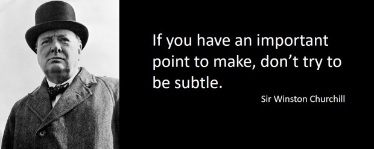

# 3 Secrets to Giving Corrective Feedback with Ease and Confidence

[December 15, 2016](https://leadershipfreak.blog/2016/12/15/3-secrets-to-giving-corrective-feedback-with-ease-and-confidence/ "7:23 am")

Every time you shoot yourself in the foot, you do it with good intentions. Someone needs to say, “If you do that again, you’re going to shoot the other foot.”

> Corrective feedback enables average performers to improve and top performers to excel.

## 3 secrets to giving corrective feedback:

**#1. Provide abundant positives:**

In a recent workshop, one leader asked, “How can we maintain the practice of giving three positives for one negative? I suggested that he show up everyday looking for behaviors to affirm. Don’t worry. The bad stuff will find you.

One leader prints business cards with, “You are ‘Incredible’,” on the front. He writes the affirmation on the back and hands it to team members. He’s averaging two a day.

“Employees who report receiving recognition and praise within the last seven days show increased productivity, get higher scores from customers, and have better safety records.” Tom Rath

**#2. Choose a ‘good’ moment:**

Timeliness is more important than the perfect moment. The longer you wait, the less useful and more difficult the conversation becomes.

> Wait for a ‘good’ moment, not a perfect moment to give corrective feedback.

When you wait too long it feels like you’re gathering evidence for a conviction. It’s also embarrassing. “Why did you let me walk around with food in my teeth for two weeks?”

**#3. Tear the bandage off quickly:**

“If you have an important point to make, don’t try to be subtle or clever.” Winston Churchill

Don’t judge. Just say what you see. “I notice that you….” After saying what you see, explain the impact of their behavior.

Don’t:

1. Socialize.
2. Discuss other issues.
3. Begin with compliments. *An affirmation given before corrective feedback goes in one ear and out the other.*

**How might leaders improve their skill at giving corrective feedback?**
